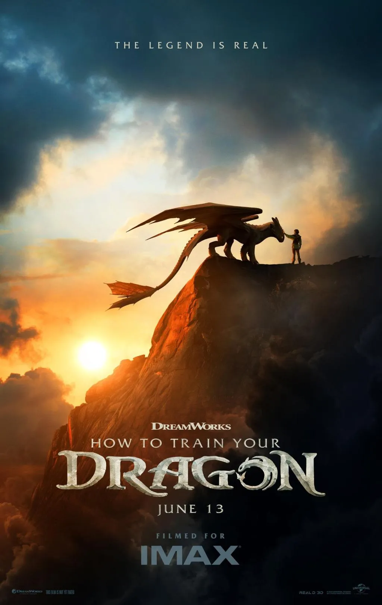
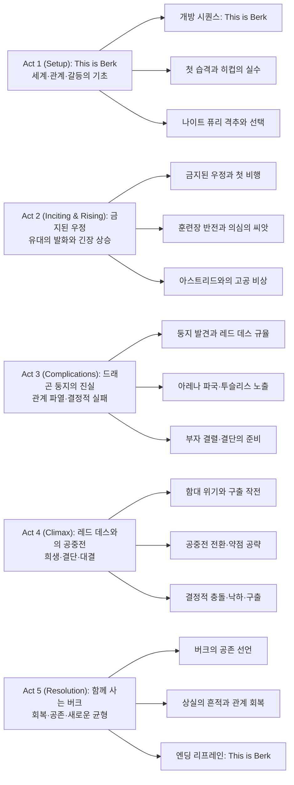
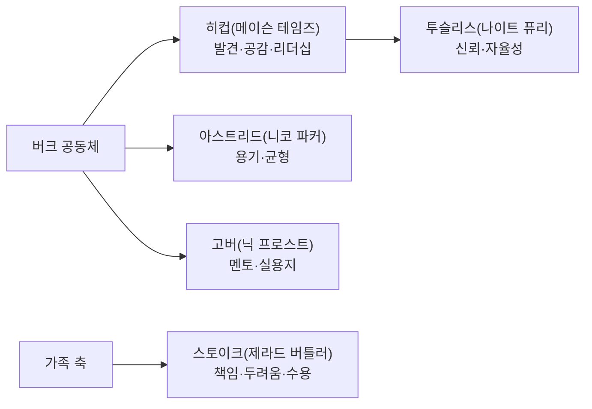

세대를 관통한 우정과 신뢰의 서사가 실사로 되살아났다. 원작의 감정선과 서사 구조를 충실히 따르되, 빌 포프 촬영감독의 웅장한 스케일과 프레임스토어의 정교한 VFX, 존 파웰의 주제가가 어우러지며 체감은 한층 커졌다. 아래 내용은 스포일러를 포함한다.

||
|:---:|
||

## 개요

### 영화 정보
* 제목: How to Train Your Dragon / 드래곤 길들이기 (2025)
* 감독: Dean DeBlois
* 각본: Dean DeBlois (원작 기반: Cressida Cowell)
* 출연: Mason Thames(히컵), Nico Parker(아스트리드), Gerard Butler(스토이크), Nick Frost(고버), Julian Dennison, Gabriel Howell, Bronwyn James, Harry Trevaldwyn, Peter Serafinowicz 외
* 촬영: Bill Pope | 편집: Wyatt Smith | 음악: John Powell
* 제작/배급: Universal Pictures · DreamWorks Animation · Marc Platt Productions / Universal Pictures
* 장르: 판타지, 어드벤처, 가족
* 상영시간: 125분
* 개봉일: 2025.06.13 (미국, 극장)

### 추천 대상
* **원작 팬**: 원작 감정선을 실사 이미지와 사운드로 다시 체험하고 싶은 관객
* **가족 관객**: 관계 회복·신뢰·비폭력의 메시지를 자녀와 함께 나누고 싶은 관객
* **영상·음악 중심 관람자**: IMAX 호흡, 공중 비행 시퀀스, 존 파웰의 테마를 극장에서 만끽하려는 관객

## 구조 분석

### Act 1 (Setup): This is Berk

**개방 시퀀스와 세계 소개**
거친 바닷바람과 북해의 암초를 가르는 드론 급 롱테이크가 버크의 지형을 훑는다. 히컵의 내레이션 "This is Berk."가 공간·문화·생업을 단정히 규정하며 톤을 결정한다. 북유럽 민요풍 타악과 목관의 얕은 웨이브가 공동체의 리듬을 깔아준다.

**첫 습격과 히컵의 선택**
야간 습격 사이렌과 불길·연기·종소리가 뒤엉킨 사운드 월드 속에서, 히컵은 볼라 발사기로 ‘나이트 퓨리’를 포착한다. 충격음 뒤 광야의 정적, 그는 쓰러진 그림자 앞에서 칼을 내린다. 공포와 연민이 교차하는 클로즈업이 캐릭터의 윤리를 못 박는다.

**훈련장 일상과 소외감**
고버가 이끄는 훈련장에서 히컵은 근력·체구·기술 모두 뒤처진다. 익스트림 와이드로 과장된 장내를 잡아 코미디 톤을 간헐적으로 주입하되, 히컵의 고립을 중거리 샷에 오래 머물며 체감시킨다. ‘성장’의 결핍이 이야기의 추진 동력으로 확정된다.

**숲의 코브와 첫 마주침**
코브의 역광 미장센에서 히컵은 묶인 나이트 퓨리와 눈을 맞춘다. 칼자루를 쥔 손이 떨리고, 날숨 소리가 과도하게 증폭된다. "난… 못 하겠어." 그 순간 칼끝이 땅에 닿는 소리와 함께, 영화의 핵심 테제(비폭력·신뢰)가 태어난다.

**첫 접촉의 의식**
물고기 헌상, 시선 회피, 손바닥 내밀기. 미세한 호흡·근육 움직임·동공 변화까지 담는 근접 촬영이 ‘금지된 우정’을 의식처럼 체험하게 한다. 존 파웰의 테마가 아주 얇게 스며들다가 손과 이마가 맞닿는 순간 미세하게 개방된다.

### Act 2 (Inciting & Rising): 금지된 우정

**테더·프로스테틱 실험**
히컵은 결손된 꼬리날을 보완하는 기계식 핀을 설계한다. 실패-수정-재시도 몽타주가 창의·집념을 리드미컬하게 축적한다. "Go on, bud."라는 따뜻한 속삭임과 함께 첫 짧은 활공이 성공하는 순간, 관객의 체감이 히컵의 자신감과 동기화된다.

**훈련장 반전과 동료의 시선**
히컵은 기술·무력이 아닌 ‘이해’로 훈련장 드래곤을 진정시킨다. 호흡 맞추기, 사과 제스처, 사소한 관심이 전술이 된다. 반면 스노트라우트의 비아냥, 아스트리드의 의심이 프레임 가장자리를 교란한다. 장내의 환호는 갈등의 예고편이다.

**아스트리드의 발견과 고공 비상**
히컵의 비밀을 추적한 아스트리드가 코브에서 진실을 목격한다. 투슬리스의 등 위로 강제 탑승, 급강하·구름 돌파·수평 비행으로 이어지는 공중 시퀀스는 ‘신뢰’가 공포를 소거하는 과정을 시각·청각적으로 번역한다.

**진실 고백과 가치 전환**
히컵은 "우리가 아는 모든 건 틀렸어."라며 드래곤의 습성·공포·생존 논리를 아버지에게 설명하려 하지만, 스토이크는 부족의 안전과 규율을 앞세운다. 세대·책임·공포의 충돌이 부자 갈등을 구조화한다.

**결정의 문턱**
최종 시합을 앞두고 히컵은 ‘죽이지 않겠다’는 선택을 준비한다. 드라마의 질문은 전환된다. 증명할 것인가, 설득할 것인가, 구출할 것인가. 세 가지 목표가 서로를 방해하며 긴장을 증폭한다.

### Act 3 (Complications): 드래곤 둥지의 진실

**둥지 규율 목격**
구름 위 비행 중 투슬리스가 이끄는 대로 도달한 거대 동굴. 레드 데스가 소형 개체를 지배·착취하는 생태가 드러난다. 아스트리드의 공포와 연민이 교차하고, 히컵은 전쟁이 아닌 시스템의 문제를 깨닫는다.

**아레나의 파국**
결정의 자리에서 히컵은 드래곤을 쓰다듬는다. 관중의 야유, 족장의 분노, 사슬이 튕기는 금속성 음향이 폭발한다. 숨은 투슬리스가 난입해 히컵을 보호하고, 그 존재가 공개되며 질서가 붕괴한다.

**부자 결렬**
스토이크는 투슬리스를 포획해 둥지로의 안내를 강제하고, 히컵을 외면한다. 히컵의 눈엔 배신보다 두려움이 보인다. 그럼에도 그는 책임을 선택한다. 관계는 부서졌지만, 윤리는 남는다.

**또 다른 라이더들**
히컵은 동료들에게 드래곤을 길들이는 법을 전수한다. 불신·경계가 호기심·신뢰로 변모하는 짧은 장면들이 가벼운 코미디 리듬으로 엮인다. 집단이 개인의 결심을 뒷받침하기 시작한다.

**구출의 서약**
히컵은 투슬리스를 되찾고 모두를 살리겠다고 선언한다. 목표는 명확해졌지만, 방법은 위험하다. 이야기의 추진력은 ‘설득’에서 ‘구출’로 완전히 전환된다.

### Act 4 (Climax): 레드 데스와의 공중전

**함대의 위기**
둥지를 파괴하려던 함대는 레드 데스의 규모와 화력 앞에 붕괴한다. 만(灣) 전체를 뒤덮는 화염·바람·잔해의 물리감이 공포를 실체화한다. 히컵 일행은 공중에서 전장을 재구성한다.

**전술 전환**
히컵은 레드 데스의 시야·기류·막막 구조를 읽고 약점을 노린다. 구름을 엄폐물로 쓰고, 스톨과 급강하를 반복하며 막막을 찢는다. 파웰의 테마가 ‘Test Drive’ 모티프를 변주하며 심박을 끌어올린다.

**결정적 충돌**
폭발 직전, 히컵은 투슬리스를 보호하려다 충격파에 휩쓸린다. 화염 속 실루엣이 사라지는 숏에서 사운드는 거의 사일런스에 가깝게 내려앉는다. 투슬리스의 날개가 감싸며 낙하를 멈춘다.

**구출과 상실**
히컵은 목숨을 건졌지만 왼쪽 발을 잃는다. 카메라는 침묵과 함께 신체적 상흔이 감정적 성장을 봉인하는 의식으로 기능함을 보여준다. 스토이크의 참회의 포옹이 부자 관계를 봉합한다.

**전장의 종결**
레드 데스의 붕괴와 함께 폭풍은 잦아든다. 잔해 사이로 새벽빛이 스며들고, 공기는 다시 호흡을 찾는다. 드래곤과 인간은 같은 하늘을 비상한다.

### Act 5 (Resolution): 함께 사는 버크

**공존의 선언**
버크의 광장에 드래곤 기착대가 세워지고, 생활 도구가 바뀐다. 드래곤은 적이 아니라 이웃이 된다. 공동체의 리듬이 변화에 적응하는 과정을 경쾌하게 스케치한다.

**관계의 회복**
스토이크는 히컵을 진정한 후계자로 인정한다. 권위는 강제가 아니라 신뢰에서 비롯됨을 보여준다. 아스트리드와 히컵의 가벼운 농담·포옹은 청춘 로맨스의 온기를 남긴다.

**엔딩 리프레인**
히컵의 나레이션이 되돌아온다. "This is Berk." 같은 문장이 다른 의미로 울린다. 이제 이곳은 공존과 신뢰의 집이다.

**일상의 복구**
광장에서 대장간 불길이 다시 타오르고, 드래곤의 체온을 이용한 건조·난방이 일상의 기술로 흡수된다. 시장에는 드래곤 비늘을 형상화한 공예품이 등장하고 아이들은 투슬리스의 그림자를 따라 뛰어다닌다. 카메라는 로우 앵글에서 꼬리와 아이들 발을 번갈아 잡아 새로운 공존의 높이를 체감하게 한다.

**기술과 생활의 통합**
히컵은 보철 다리와 안장·핀 설계를 조정해 ‘사람-드래곤’의 동역학을 일상 주행에도 맞춘다. 금속이 부딪히는 미세한 고주파음을 줄이고, 가죽 스트랩의 텐션을 조절하는 손놀림이 반복 몽타주로 제시된다. 삶을 위한 기술이 전투를 위한 기술을 대체하는 순간이다.

**미래의 암시**
아스트리드는 ‘우리 방식으로 바꿔 보자’고 말하며 버크의 새로운 규칙을 함께 쓰자고 제안한다. 히컵은 미소로 답하고, 투슬리스는 짧은 그르렁거림으로 호응한다. 롱숏으로 잡힌 바다 수평선 위로 작은 드래곤 무리가 지나가며, 더 넓은 세계와의 연결을 암시한다.

## 장면별 상세 줄거리 (스포일러)

### 1. 야간 습격 – 버크의 리듬
밤하늘을 가르는 화염과 종소리, 그리고 "This is Berk"라는 단정한 선언이 첫 장면을 규정한다. 카메라는 선창·어부·대장장이의 반복 동작을 빠른 컷으로 연결해 공동체의 생활 리듬을 만든다. 히컵은 볼라 발사대를 밀고 달리며 ‘다르게 살고 싶은’ 욕망을 내레이션 바깥의 표정으로 드러낸다.

### 2. 코브 – 칼을 내리는 순간
안개 낀 코브에서 쓰러진 나이트 퓨리와 눈을 맞춘 히컵은 칼을 들었다가 떨리는 손을 내린다. 호흡·바람·물방울 소리가 과장되며 감각이 확장되는 듯한 주관적 사운드가 이어진다. "난… 못 하겠어."라는 낮은 독백 뒤, 칼끝이 흙을 긁는 소리가 장면을 봉인한다.

### 3. 첫 비행 – 공포가 신뢰로
임시 핀·안장·테더를 장착한 투슬리스는 불안정하게 몸을 일으킨다. 히컵의 "Go on, bud."가 신호가 되고, 급강하와 붙임날개 동작이 교차 편집으로 박진감을 만든다. 첫 성공 이후 둘은 바람골을 타며 구름을 뚫고, 파웰의 현악 모티프가 서서히 개방된다.

### 4. 아레나 – 비폭력의 시도
관중의 환호 속 히컵은 드래곤을 쓰다듬고, 무기를 내려놓는다. 쇠사슬·발굽·관중 호흡이 겹겹이 쌓인 사운드가 일순 끊기며 정적이 찾아온다. 난입한 투슬리스가 히컵을 가리는 순간, 체제는 균열을 드러내고 스토이크의 분노는 공포의 다른 이름임이 드러난다.

### 5. 둥지 – 레드 데스의 규율
구름 위를 넘어선 검은 바다 위, 거대한 동굴에서 레드 데스의 먹이 사슬이 드러난다. 작은 드래곤들이 먹이를 바치고 살아남는 구조를 목격한 히컵과 아스트리드는 싸움이 아닌 구조 변화를 결심한다. 차가운 저역 리버브가 공간의 스케일을 체감시키며 불길한 예감을 키운다.

### 6. 결전 – 하늘에서의 체스
함대가 무너지는 가운데 히컵은 기류·시야각·막막의 약점을 계산해 공중전의 전술을 바꾼다. 구름이 엄폐물, 태양이 역광 무기가 되고, 스톨이 회피 기동이 된다. 폭발 직전, 투슬리스의 날개가 히컵을 감싸며 불꽃 속 실루엣이 사라지고, 거의 무음의 순간이 정서를 압착한다.

### 7. 귀환 – 함께 사는 버크
히컵은 왼발 보철과 함께 마을로 돌아오고, 투슬리스의 새 꼬리날이 햇빛을 받아 반짝인다. 광장에는 드래곤 기착대가 서고, 아이들은 머뭇거림 없이 비늘을 쓰다듬는다. 히컵의 마지막 나레이션이 반복되지만, 세계의 의미는 완전히 바뀌어 있다.

### 핵심 대사 모음
* "This is Berk." — 세계·정체성 선언의 프레이밍
* "난 그를 죽일 수 없었어. 나처럼 두려워하고 있었거든." — 연민이 폭력을 이기는 순간
* "우리가 아는 건 대부분 틀렸어." — 지식의 전환이 서사의 전환을 이끈다
* "Go on, bud." — 신뢰의 언어, 실천의 촉발
* "고마워… 아무것도 아닌 줄 알았던, 쓸모없는 파충류." — 코미디 속 애정의 반어법

### 상징적 장면 분석
* 손바닥 맞대기: 폭력을 멈추게 하는 가장 단순한 제스처의 힘
* 첫 장거리 비행: 공포를 신뢰로 재기입하는 체험적 시퀀스
* 아레나의 비폭력: 제도권 규칙을 윤리로 갱신하는 장면
* 상실과 보철: 신체 변화가 성장을 봉인하는 현대적 영웅의 문법

## 사운드트랙·사운드 디자인

- 작곡: John Powell. 오리지널 3부작의 테마를 동기·화성·오케스트레이션 레벨에서 재구성해 실사 질감에 맞춘 것이 특징이다.
- 발매: 영화와 동시(2025-06-13, Back Lot Music). 선공개 싱글 "Test Driving Toothless"가 데모 기반으로 재편곡되어 공개되었다.
- 모티프 설계: 버크(공동체·리듬), 우정(미세 호흡·하프·목관), 비행(현악 아르페지오·호른 레이어)이 장면 전환의 접착제 역할을 한다.
- 사운드 디자인: 화염(초저역+고역 크랙), 날개(에어 러시+가죽 마찰), 금속(하모닉 디스토션 최소화), 바람(기류 변화 따른 포커싱)의 레이어가 공간 인지를 보조한다.

## 촬영·미장센·VFX

- 촬영감독: Bill Pope. 실제 공중 시퀀스를 고려한 IMAX 프레이밍과 롱 포컬 전환으로 속도감을 유지하면서도 공간 지각을 잃지 않는다.
- 미장센: 코브의 역광·실루엣, 광장 로우 앵글, 클라이맥스 역광·연기 사용 등 ‘대비’를 통해 감정 곡선을 선명하게 만든다.
- VFX: Framestore 단일 벤더. 퍼핏·짐벌 세트를 통한 배우-드래곤 상호작용 연기 후 CG 합성으로 현실감을 극대화했다.
- 로케이션 영감/사용: 페로 제도의 Tindhólmur·Drangarnir 지형을 비행 장면에 활용해 버크의 ‘바다 위 절벽’ 정체성을 강화한다.

## 등장인물 심층 분석

### 주인공: 히컵 (Mason Thames)
**캐릭터 개요**
* 기본 설정: 16세, 족장의 아들, 신체적 취약·지적 호기심
* 핵심 목표: 공동체에서의 역할 증명 → 공존 질서의 창안
* 주요 갈등: 부자 갈등(책임 vs 윤리), 공동체 규범 vs 개인 양심

**성장 곡선**
* 소외와 결핍 → 공감의 발견 → 비폭력 리더십 확립
* 핵심 메시지: 힘보다 이해, 승리보다 공존

**동기와 욕망**
* 표면 목표: 족장다운 용맹 증명
* 내면 욕구: 인정·소속감·사랑
* 두려움: 실패·거절·상실

**갈등 구조**
* vs 자신: 겁과 죄책감, ‘다르게 보이는’ 것에 대한 주저
* vs 타인: 아버지·동료의 불신과 저항
* vs 상황: 전통과 전쟁의 관성

**상징적 의미**
타자 이해를 통해 공동체 규칙을 재작성하는 새로운 리더의 모델.

### 아스트리드 (Nico Parker)

**캐릭터 개요**
* 기본 설정: 용맹하고 규율적인 전사 지망생, 도끼와 기동력 중심의 전투 스타일
* 핵심 목표: 공동체의 명예 수호와 최고의 라이더로서 인정
* 주요 성향: 경쟁심·책임감·현실감각, 판단은 빠르되 수정에도 주저하지 않음

**성장 곡선**
* 의심 → 관찰 → 체험(고공 비상) → 이해·연대 → 공동 리더십
* 핵심 메시지: 진짜 용기는 ‘모르는 것을 배울’ 용기에서 시작한다

**동기와 욕망**
* 표면 목표: 규칙과 성과로 입증되는 리더십
* 내면 욕구: 공동체의 신뢰, 스스로의 기준을 지키는 자존감
* 두려움: 약점 노출, 무책임한 선택으로 인한 피해

**갈등 구조**
* vs 자신: 자존심과 개방성 사이의 줄다리기
* vs 타인: 초반 히컵의 ‘비정통’ 접근에 대한 경계와 이후 공존 전략의 공동 설계
* vs 상황: 전통적 규율과 새 윤리(비폭력·공존)의 조율

**상징적 의미**
전통과 혁신을 연결하는 ‘균형의 용기’. 실천으로 검증된 리더십이 공동체 변화를 견인한다.

### 스토이크 (Gerard Butler)

**캐릭터 개요**
* 기본 설정: 버크의 족장, 강인한 수호자이자 엄격한 아버지
* 핵심 목표: 마을의 생존·질서 유지, 외부 위협의 제거
* 주요 성향: 보호 본능·규율·결단, 공포에 기반한 예방적 행동 경향

**성장 곡선**
* 통제 → 회의의 균열 → 직면(아레나 파국) → 수용·지지 → 동행
* 핵심 메시지: 권위의 목적은 복종이 아니라 보호, 그리고 신뢰로 갱신된다

**동기와 욕망**
* 표면 목표: 체계적 방어와 전통 유지
* 내면 욕구: 아들의 안전, 족장으로서의 책임 완수
* 두려움: 공동체 붕괴·자식의 상실, 알 수 없는 것에 대한 본능적 경계

**갈등 구조**
* vs 자신: 두려움과 사랑 사이의 충돌
* vs 타인: 히컵의 비폭력 윤리 vs 자신의 전통적 전술
* vs 상황: 생존을 위한 전쟁 체제에서 공존 체제로 전환해야 하는 압력

**상징적 의미**
공포 기반 통치에서 신뢰 기반 보호로 전환하는 ‘권위의 갱신’ 모델. 사과와 포옹은 권위 회복의 새 언어다.

### 투슬리스 (Night Fury)

**캐릭터 개요**
* 기본 설정: 나이트 퓨리, 최고 등급의 민첩·지능·화력 보유
* 핵심 목표: 자유로운 비행과 생존, 신뢰 가능한 동료와의 유대
* 주요 성향: 호기심·놀이성·영리함, 경계와 친밀을 상황에 따라 유연하게 조절

**성장 곡선**
* 포식자 → 동맹 → 보호자 → 공존 질서의 상징
* 핵심 메시지: 신뢰는 언어보다 먼저 작동하는 합의다

**동기와 욕망**
* 표면 목표: 안전한 비행, 상호 보완적 조종 체계 확립
* 내면 욕구: 자율성과 유대의 균형(꼬리날·안장 협응)
* 두려움: 포획·구속, 신체 결손으로 인한 무력감

**갈등 구조**
* vs 자신: 꼬리 결손으로 인한 의존/자율 간 딜레마
* vs 타인/환경: 인간의 오해·사냥·구금 장치
* vs 상황: 포식-피식 구도의 역사적 관성

**상징적 의미**
타자 이해의 거울. 상호 의존과 자율의 균형을 통해 ‘함께 나는’ 기술을 완성한다.

### 고버 (Nick Frost)

**캐릭터 개요**
* 기본 설정: 대장장이이자 훈련 교관, 실용주의적 멘토
* 핵심 목표: 마을의 안전 장비 공급과 젊은 세대 교육
* 주요 성향: 유머·현실 감각·충성, 전통 내에서도 유연한 판단

**성장 곡선**
* 규범적 훈련 → 현장 관찰 → 히컵 방식의 효용 인정 → 보호·지원

**동기와 욕망**
* 표면 목표: 실전에서 통하는 도구·규율 보급
* 내면 욕구: 제자들의 생존과 성장을 보는 보람

**갈등 구조**
* vs 자신/상황: ‘검증된 방식’과 ‘새 방법’ 사이의 효율 비교

**상징적 의미**
기술과 전통을 연결하는 실무형 멘토. 변화의 설득자이자 안전망.

### 스노트라우트 (Snotlout Jorgenson)

**캐릭터 개요**
* 기본 설정: 허세와 경쟁심이 강한 라이더 지망생
* 핵심 목표: 인정과 위상 확보

**성장 곡선**
* 과시 → 좌절 → 협력 → 팀 플레이어

**동기와 욕망**
* 표면 목표: 눈에 띄는 성과·무용
* 내면 욕구: 불안을 가리는 자기확신

**갈등 구조**
* vs 타인: 히컵·동료와의 서열 경쟁
* vs 자신: 자의식과 불안의 진동

**상징적 의미**
경쟁이 협력으로 전환될 때 집단 효율이 극대화됨을 보여주는 사례.

### 피시레그스 (Fishlegs Ingerman)

**캐릭터 개요**
* 기본 설정: 지식·데이터 중심, 드래곤 도감 애호가
* 핵심 목표: 정보로 팀의 생존률 향상

**성장 곡선**
* 두려움 → 분석 → 적용 → 용기

**동기와 욕망**
* 표면 목표: 정확한 분류·대응
* 내면 욕구: 쓸모 있는 동료가 되고 싶은 마음

**갈등 구조**
* vs 상황: 실전 압박 속 ‘이론→실천’ 전환의 공포

**상징적 의미**
지식이 전장이 아닌 삶을 지키는 실천이 될 수 있음을 입증.

### 러프넛 & 터프넛 (Ruffnut & Tuffnut)

**캐릭터 개요**
* 기본 설정: 혼돈과 장난의 쌍둥이, 위험 감수 성향 높음
* 핵심 목표: 스릴·재미, 그러나 위기 시 동료 보호

**성장 곡선**
* 소란 → 포지셔닝 학습 → 역할 특화 → 팀 내 시너지

**상징적 의미**
다름과 혼돈이 올바른 포지셔닝을 만나면 창의적 전력이 된다.

### 적대/환경: 레드 데스 (Red Death)

**개요와 기능**
* 거대 알파 개체, 먹이-복종 구조로 생태계를 통제하는 ‘환경적 적’

**상징적 의미**
공포와 오해로 유지되는 체제의 은유. 개인의 악의라기보다 구조적 폭력이 낳은 비극으로 제시된다.

## 비교 분석

| 작품 | 공통점 | 차별점 | 본작의 강점 |
|:--|:--|:--|:--|
| The Jungle Book (2016) | 애니메이션 실사화, 생태·우정 | 하이브리드 캐릭터 연기 중심 | 손 제스처·시선 교환의 감정 연기 정밀도 |
| The Lion King (2019) | 원작 충실성, 음악 재해석 | 포토리얼·감정 표현 논란 | 인간-드래곤 상호작용의 체감 미학 |
| Aladdin (2019) | 원곡·서사 재연, 현대적 업데이트 | 뮤지컬 톤 강조 | 파웰 테마의 다이내믹한 서사 구동력 |

## 숨겨진 레이어

### 상징적 의미
손바닥·시선·호흡은 폭력의 사슬을 끊는 최소 단위의 언어다. 타자 이해의 기술이 곧 생존 기술로 전환된다.

### 사회적/문화적 맥락
두려움·오해에 기반한 적대의 정치가 ‘공존’으로 재설계될 때 공동체는 더 강해진다. 환경·생태 윤리의 은유도 뚜렷하다.

### 현대적 메시지
강함의 정의를 바꾸는 이야기. 이기는 것보다 살아가는 방식이 더 중요하다.

## 제작 비하인드

* 촬영: Bill Pope — 실사 체감과 공중 시퀀스의 공간 인지 극대화, IMAX 포맷 고려
* VFX: Framestore — 퍼핏·짐벌 연기와 CG 결합으로 ‘배우-드래곤’ 상호작용의 현실감 확보
* 음악: John Powell — 원작 테마의 동기·화성 재구성, 비행 시퀀스의 심박 조율
* 로케이션: 벨파스트(북아일랜드)·페로 제도 — 버크 지형·기류의 실재감 강화
* 상영 포맷: RealD 3D, IMAX, Dolby Cinema, 4DX, ScreenX

## 종합 평가

**최종 평점: ★★★★☆ (4.2/5)**

### 한 줄 평
연민이 용기를 바꾸고, 용기가 세상을 바꾼다. 실사로 되살린 ‘신뢰의 비행’.

### 추천 작품
* How to Train Your Dragon (2010) — 원작의 감정 설계도
* Pete’s Dragon (2016) — 비폭력·우정의 또 다른 얼굴
* The Jungle Book (2016) — 실사·CG 하이브리드의 완숙함

### 관람 전 체크리스트
* 스포일러 허용: 원작 줄거리와 유사하나, 체감은 ‘극장 사운드·화면’이 좌우
* 비행 시퀀스: IMAX·고사양 상영관 추천
* 어린이 동반: 전투·괴수 장면의 소음·광량 주의

