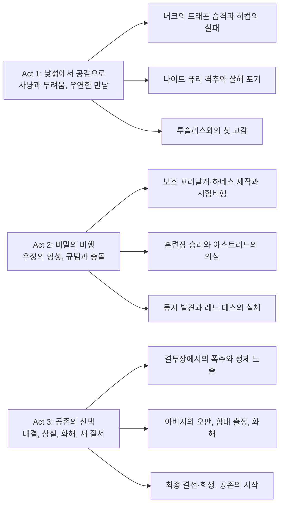
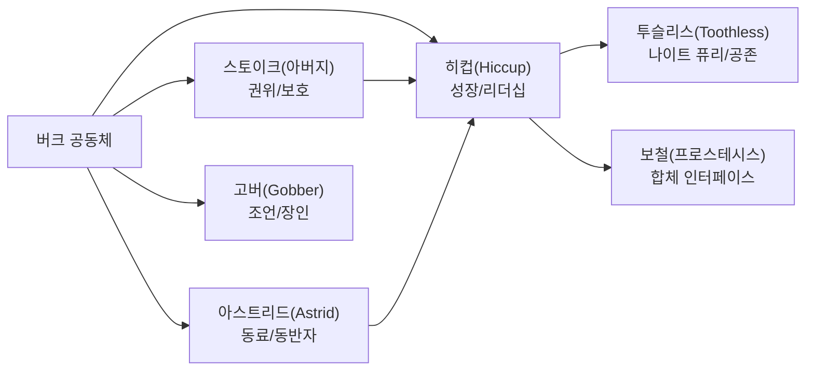

영화의 원형을 이루는 우정과 성장, 그리고 공존의 윤리를 2025년의 기술 문법으로 다시 비상시킨 실사판이다. 원작 애니메이션의 정서와 구도를 충실히 계승하면서도, IMAX 최적화 촬영과 프랙티컬 세트, Framestore의 VFX, John Powell의 스코어가 결합되어 체감 몰입도를 비약적으로 높였다는 점이 본 작품의 정체성을 규정한다.

||
|:---:|
||

## 개요

### 영화 정보
* 제목: How to Train Your Dragon / 드래곤 길들이기 (2025)
* 감독: Dean DeBlois
* 출연: Mason Thames, Nico Parker, Gerard Butler, Nick Frost, Gabriel Howell, Julian Dennison, Bronwyn James, Harry Trevaldwyn, Peter Serafinowicz 외
* 장르: Fantasy, Adventure, Family
* 상영시간: 125분
* 제작/배급: Universal Pictures, DreamWorks Animation, Marc Platt Productions / Universal Pictures
* 개봉일: 2025.06.13 (미국), 2025.04.02 (CinemaCon 프리미어)

### 추천 대상
* **원작 팬**: 원작의 감성과 구도를 shot-for-shot에 가까운 충실도로 재현한 실사 리메이크의 미덕을 체험하려는 관객에게 적합하다.
* **가족 관객**: 공존과 우정, 성장의 테마를 선명히 제시하며, 체감적인 비행 시퀀스가 가족 단위 관람에 어울린다.
* **영화 기술 관심층**: 프랙티컬 세트+퍼펫 워크+디지털 VFX의 하이브리드 워크플로, IMAX 지향 촬영, 포맷별 믹스(RealD 3D, Dolby Cinema, 4DX, ScreenX)가 만드는 상영 경험을 분석적으로 즐길 수 있다.

## 완전 스토리 로드맵

**🎬 스포일러 전체 공개 - 이미 영화를 본 독자를 위한 완전한 줄거리 재구성**

### 3막 구조 분석

### Act 1: 낯섦에서 공감으로

버크 섬은 드래곤의 야습에 시달리고 있고, 족장 스토이크의 아들 히컵은 왜소한 체구와 미숙한 체력 때문에 공동체의 비웃음을 산다. 야습의 소란 속에서 히컵은 볼라 발사 장치로 전설의 나이트 퓨리(투슬리스)를 격추하는 데 성공하나, 증명할 길이 없다. 숲 골짜기에서 포획당한 드래곤을 마주한 히컵은 최종 일격 대신 로프를 끊어 준다. 살려 주는 선택은 공포의 감정 회로를 끊고 호기심과 연민의 회로를 작동시킨다.

스토이크는 둥지를 파괴하기 위한 대원 소집을 서두르고, 고버는 히컵을 드래곤 격투 훈련반에 등록한다. 대장간의 붉은 화구와 쇠의 타격음 사이에서 히컵은 스케치 노트에 설계도를 그려 넣고, 실패한 원형(prototype)을 고쳐 간다. 훈련장에서는 피시레그, 스놋라웃, 러프넛·터프넛 쌍둥이, 아스트리드와 함께 기본기부터 배우지만, 히컵의 방식은 기존 규범과 다른 관찰·기술 중심의 접근이다.

히컵은 골짜기에서 투슬리스를 다시 찾아가 경계를 낮추는 의식부터 시작한다. 무기를 내려놓고 시선을 낮춘 뒤, 생선을 내밀고 모래바닥에 원과 선을 그려 서로의 동선과 안전거리를 조율한다. 가까워지는 호흡과 눈동자의 흔들림이 신뢰의 미세한 징후로 누적되고, 히컵은 절단된 꼬리날개의 결손을 보완할 보철과 하네스의 초기 설계를 착수한다. 첫 시제품은 당연히 불안정하나, 실패의 데이터가 다음 시도들의 정밀도를 높인다.

첫 시범 장착은 땅 위에서의 느린 보행과 미끄러짐으로 시작한다. 히컵은 투슬리스의 체축과 꼬리날개 각도 변화를 관찰하며, 자신의 몸을 비슷한 리듬으로 흔들어 동조를 유도한다. 낮게 깔린 햇빛이 비늘을 스치고, 투슬리스의 동공이 확장·수축을 반복하는 동안 둘의 호흡은 점차 같은 간격으로 맞춰진다. 촉각적 신뢰가 형성되자 히컵은 짧은 활주를 시도하고, 실패의 파편 속에서 설계 변수들이 목록화된다.

동시에 히컵은 밤마다 드래곤 노트를 갱신한다. 공격 신호를 유발하는 시선, 진정 효과를 주는 거리 유지, 먹이 선호와 회피 행동 등, 관찰로 축적된 데이터는 훈련장에서의 대응 전략으로 환원된다. 그는 훈련장에서 '공격을 멈추는 자세'를 몸으로 재현해 보여 주며, 불필요한 충돌 없이 과제를 통과한다. 이 과정은 공동체 규범과 다른 길이 있음을 아직 명명하지 못한 채 예고한다.

### Act 2: 비밀의 비행

히컵은 하네스와 보조 꼬리날개를 탑승형 인터페이스로 통합해 조종자-비행체의 합체적 운동학을 구축한다. 시험비행은 무게중심과 추력 벡터를 조정하는 연속적 피드백-보정-학습 루프를 통해 안정화되고, 바람결과 해무, 절벽 상승기류를 읽는 법을 체득한다. 둘의 관계는 동료애를 넘어 감각을 공유하는 공진(共振)의 단계로 이행한다.

훈련장에서는 히컵이 관찰로 익힌 드래곤의 행동 양식을 활용해 비폭력적 제압을 시연한다. 눈가리개를 벗겨 주고, 사료를 제공하고, 위협 자세를 풀어 주는 방식으로 드래곤들은 저항을 멈춘다. 승리가 반복되자 공동체의 시선은 흔들리지만, "힘으로 굴복시켜야 한다"는 규범은 여전히 공고하다. 한편 스토이크의 둥지 탐색 원정은 큰 손실을 입고 귀환하여, 문제의 해법을 더 강경하게 찾으려 한다는 기류를 강화한다.

아스트리드는 히컵의 비밀을 감지하고 추적하다가 골짜기에서 정체를 확인한다. 히컵은 그녀를 태우고 구름 상층의 비행으로 안내하며, 낙하와 상승, 회전이 교차하는 순간에 감각의 신뢰를 공유한다. 그 비행은 드래곤 떼의 이동 경로를 따라 거대한 둥지로 이어지고, 그곳에서 알파 개체 레드 데스가 약탈 생태계를 강제한다는 사실을 목격한다. 아스트리드는 즉시 마을에 알리자고 주장하지만, 히컵은 투슬리스를 보호하기 위해 신중을 요청한다. 그러나 결투 의식이 다가오면서 타이머는 이미 시작되었다.

히컵은 아버지에게 진실을 말하려는 시도를 망설이며, 고버에게서 "때로는 다른 길도 있다"는 조언을 듣는다. 히컵은 하네스를 미세 조정하고, 안장 결속과 발 페달의 스트로크를 재설계해 비행 중 제어성을 높인다. 야간 비행에서 구름 틈으로 스며드는 별빛과 북방의 냉기가 피부에 와 닿는 감각은, 실사 물성이 부여하는 체험의 밀도를 극대화한다.

의식의 날이 다가오자 공동체의 기대와 히컵의 양심은 충돌한다. 히컵은 드래곤을 쓰러뜨리는 영웅이 되라는 요구를 온몸으로 체감하지만, 투슬리스와의 경험이 가르친 다른 해법을 포기하지 못한다. 내부의 갈등은 아스트리드의 단호함과 동료들의 경쟁심, 그리고 스토이크의 질서 유지 본능에 의해 더욱 첨예해진다. 모든 조정과 설득의 시간이 바닥나며, 장은 폭발 직전의 긴장으로 응고된다.

### Act 3: 공존의 선택

결투 의식의 경기장에서 히컵은 드래곤을 죽이지 않는 방식으로 진실을 보여 주려 하나, 억눌린 공포와 군중의 압력이 결투장을 폭주시킨다. 포획된 몬스트러스 나이트메어가 불을 뿜으며 난동을 부리고, 히컵이 위험에 처하자 투슬리스가 은신처에서 뛰쳐나와 그를 보호한다. 비밀이 폭로되자 스토이크는 배신으로 받아들이고, 투슬리스를 구속해 둥지를 찾는 유인 신호로 삼는다.

히컵은 아스트리드와 동료들에게 진실을 전하고, 각자의 훈련장 드래곤을 길들여 구출대에 오른다. 거친 해류와 안개 벽을 가르며 함대에 접근한 아이들은 포박 장치와 사슬, 닻줄의 배열을 익히고 틈을 찾아들어 투슬리스에게 닿기 위한 경로를 연다.

결전의 고비에서 스토이크는 침몰하는 선창에서 히컵과 투슬리스를 함께 끌어올리며, 권위로 단절했던 관계를 행동으로 복구한다. 사과와 포옹은 말보다 앞선다. 아버지의 오판과 아들의 고집은 서로의 결핍을 메우는 대화로 전환되고, 함대의 병력은 일방의 전투에서 협력의 구도로 재정렬된다.

이어 나타난 레드 데스와의 전투는 비행 고도와 선회 반경, 날개막의 구조적 약점을 겨냥하는 전술로 전개된다. 히컵과 투슬리스는 유도 비행으로 거대 개체를 상층으로 끌어올린 뒤, 날개막을 손상시키고 내부 연소를 유발해 추락을 유도한다.

폭발의 충격 속에서 히컵은 투슬리스의 보호로 생명을 건지지만, 왼발을 잃는다. 귀환한 버크에서는 고버가 의족을 마련하고, 투슬리스의 보철 꼬리도 새로운 균형을 찾는다. 공동체는 드래곤과의 공존을 공식화하고 마을의 일상은 비행과 동행으로 재편된다. 히컵과 아스트리드는 대등한 파트너로서 새로운 윤리를 실천하기 시작하며, 공포의 대상이던 드래곤은 삶의 동반자로 자리매김한다.

에필로그는 버크의 일상을 재구성한다. 지붕에는 드래곤 착지를 위한 보강 구조가 설치되고, 마을길에는 비행 전용 통로가 마련된다. 아이들은 학교 대신 비행장을 오가며 드래곤과 함께 과업을 수행하고, 장터의 물류 역시 하늘길을 탄다. 히컵의 의족과 투슬리스의 보철 꼬리는 동행의 리듬에 맞춰 같은 템포로 움직이며, 공동체는 두려움의 서사를 돌봄과 연대의 서사로 갈아 끼운다.

### 핵심 대사 모음
* "그를 죽이지 않았어." — 살해와 구원의 경계에서 윤리의 회로가 바뀌는 순간을 선언한다.
* "그는 이빨이 없어. 투슬리스라고 부르자." — 공포의 외형을 재명명하는 언어적 행위로 타자화의 고리를 끊는다.
* "우리는 함께 날아." — 보철-동력-의지의 통합, 동체감각의 공유를 요약한다.

### 상징적 장면 분석
* 히컵이 칼을 내리고 로프를 푸는 클로즈업: 칼날의 반사광이 사라지며 프레임의 색온도가 낮아진다. 공격성에서 공감성으로의 전이.
* 첫 합동 비행의 롱테이크: IMAX 프레이밍과 와이드 렌즈의 주변부 왜곡이 고도감/속도감을 증폭한다.
* 결전의 불기둥: 열의 파장과 연기 입자 시뮬레이션이 사운드의 저역과 동조되어 파국의 숭고(sublime)를 시각-청각적으로 구현한다.

## 등장인물 심층 분석

### 캐릭터 관계도

### 주인공: 히컵 (Mason Thames)
**캐릭터 개요**
* 기본 설정: 16세, 족장의 아들, 신체적 열세와 기술적 호기심을 겸비한 발명가 기질
* 핵심 목표: 공동체가 부여한 용맹의 규범을 충족시키고 인정받기
* 주요 갈등: 폭력의 관습과 비폭력의 윤리 사이, 아버지의 기대와 자신의 신념 사이

**성장 곡선**
* 실패와 조롱 → 공감의 발견 → 윤리의 선택 → 리더십의 체현
* 핵심 메시지: 용기는 파괴 능력이 아니라 타자와의 관계를 지키는 결단이다.

**동기와 욕망**
* 표면적 목표: 드래곤을 물리쳐 존중받기
* 내면적 욕구: 공동체의 규범을 바꾸어도 소속을 유지하고 싶다는 욕망
* 두려움: 아버지의 실망, 낙오자로 규정되는 공포

**갈등 구조**
* vs 자신: 폭력의 빠른 해결과 공감의 느린 설득 사이의 진동
* vs 타인: 스토이크의 권위, 훈련장의 경쟁자들
* vs 상황: 드래곤-인간의 적대적 생태 구조, 결전의 물리적 난제

**상징적 의미**
* 보철-비행 인터페이스는 결손을 창의로 전환하는 테크놀로지 윤리를 표상한다.

### 아스트리드 (Nico Parker)
* 초반에는 규범의 수호자이나 관찰과 체험을 통해 전환을 실행하는 촉매자. 의심에서 신뢰로의 궤적이 공동체 변화를 가속한다.

### 스토이크 (Gerard Butler)
* 보호-통제의 프레임으로 세계를 인식하나, 물에 빠진 히컵과 투슬리스를 구하며 사랑을 행동으로 재정의한다. 화해의 포옹은 권위의 재기입.

### 투슬리스 (Night Fury)
* 비인간 주체. 공포의 대상에서 관계적 파트너로 재지시된다. 눈동자의 클로즈업과 호흡의 리듬이 감정의 문법을 제공한다.

## 요소별 심층 분석

### 기술 요소 분석 테이블

| 기술 요소 | 혁신점/특징 | 시각적/청각적 효과 | 제작 의의 |
|-----------|-------------|-------------------|-----------|
| Cinematography (Bill Pope) | IMAX 지향 프레이밍, 와이드-롱테이크 비행 시퀀스 | 고도감/속도감 증폭, 공간지남감 향상 | 실사 비행 질감의 재현으로 리메이크의 존재 이유 확보 |
| VFX (Framestore) | 드래곤 퍼포먼스 캐처+퍼펫 레퍼런스 융합 | 비늘·막질·연기 입자의 물성 구현 | 퍼포먼스 기반 합성으로 생명감 강화 |
| Practical Sets & Puppetry | 세트와 퍼펫을 배우 시야에 제공 | 시선/프레이밍의 정확도, 연기 반응의 자연화 | CG 의존도를 낮추고 현장 퍼포먼스 질 제고 |
| Sound Design | 저역 풍부한 비행/포효 사운드, 공간 리버브 | 체감적 몰입, 비상감의 신체적 전달 | 대형 상영 포맷에서의 경험 최적화 |
| Music (John Powell) | 원작 모티프의 재조합·오케스트레이션 확장 | 감정 곡선의 정밀한 가이드 | 시리즈 아이덴티티 계승과 현대화의 균형 |

### 연기 & 캐스팅 분석 테이블  

| 배우 | 캐릭터 | 연기력 평가 | 캐스팅 적합성 | 특별한 점 |
|------|---------|-------------|---------------|-----------|
| Mason Thames | 히컵 | 신체적 열세-정신적 결단의 이중성 구현 | 매우 높음 | 공감의 윤리를 얼굴 표정 변화로 정밀하게 전달 |
| Nico Parker | 아스트리드 | 의심→신뢰의 궤적을 리듬감 있게 처리 | 높음 | 체험 기반 전환의 설득력을 부여 |
| Gerard Butler | 스토이크 | 권위와 애정의 긴장을 균형 있게 제시 | 높음 | 성우에서 실사로의 자기 재현 |
| Nick Frost | 고버 | 코믹 릴리프와 조언자의 균형 | 높음 | 톤 조절의 완급 |

### 연출 & 각본 분석
원작의 3막 구조를 거의 그대로 유지하되, 실사 물성에 맞춘 디테일(동작의 무게감, 표면 질감, 물/불/연기 물리)이 장면의 감각적 설득력을 강화한다. shot-for-shot 재현이 많은 만큼 참신성의 제약도 있으나, 핵심 장면의 체감 업그레이드는 리메이크의 존재 이유를 충분히 소명한다.

### 음악 & 사운드 분석
존 파웰의 테마는 동체감각과 감정곡선을 연결하는 신경다리 역할을 한다. 저역 포효와 하이파이 현악의 상승 진행이 비행 시퀀스의 카타르시스를 증폭한다.

## 비교 분석

### 동일 감독/제작사 작품과의 비교
* 애니메이션 3부작(2010/2014/2019) 대비: 내러티브 충실도 극대화, 물성·스케일·체감의 증폭. 상상적 자유도는 애니메이션이 앞서나, 실사는 체감 몰입의 우위를 점한다.

### 동일 장르/리메이크와의 비교  
* Disney 실사 리메이크(Beauty and the Beast, Aladdin, The Lion King) 대비: 원작 충성도는 유사하나, 본작은 프랙티컬-퍼포먼스 지향으로 현장감이 탁월하다.

### 동시대 경쟁작과의 비교
* 2025년 주요 텐트폴 대비: 가족 타깃 포지셔닝이 분명하고, 상영 포맷 다변화 전략으로 흥행 저변을 넓힌다.

## 숨겨진 레이어

### 상징적 의미
보철은 결손을 결속으로 바꾸는 사회·기술적 은유다. 결여의 치유가 아닌 공진의 설계.

### 사회적/문화적 맥락
타자화된 존재(드래곤)를 생태적 파트너로 재인식하는 과정은 현대의 공존 윤리, 동물권·환경 담론과 공명한다.

### 현대적 메시지
용기는 지배가 아니라 관계를 지키는 지속적 실천이라는 명제.

## 제작 비하인드
* 촬영: Belfast(북아일랜드) 중심, Faroe Islands(틴드홀무르/드랑가니르) 로케이션으로 버크의 지형감을 실사화.
* 촬영감독: Bill Pope. IMAX 포맷 최적화, 롱테이크·와이드 기반의 비행 몰입 설계.
* VFX: Framestore 단일 벤더. 퍼펫/짐벌/8축 리그를 통해 배우-드래곤 상호작용을 현장에 구현 후 합성.
* 음악: John Powell. 개봉일 동시 공개 사운드트랙, 모티프 재편곡.

## 종합 평가

**최종 평점: ★★★★☆ (4/5)**

원작의 미덕(우정·성장·공존)을 보존하면서 상영 체험을 확장한 균형 잡힌 리메이크이다. 참신성의 한계는 shot-for-shot 충성도의 뒷면이지만, 실사 물성이 제공하는 감각적 설득력은 가족 관객과 원작 팬 모두에게 충분한 보상을 제공한다.

### 한 줄 평
"관계의 용기를 실감의 기술로 되살린, 충성도 높은 비상."

### 추천 작품
* How to Train Your Dragon (2010)
* How to Train Your Dragon 2 (2014)
* Pete’s Dragon (2016) — 공존 테마의 실사/CG 하이브리드 비교 감상

### 관람 전 체크리스트
* 대형 포맷(IMAX/돌비/4DX/ScreenX) 상영관 추천
* 어린 관객에게는 결전 시퀀스의 강렬한 음향·화염 연출 사전 안내 권장

