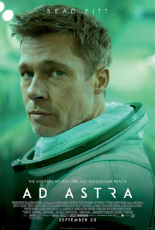
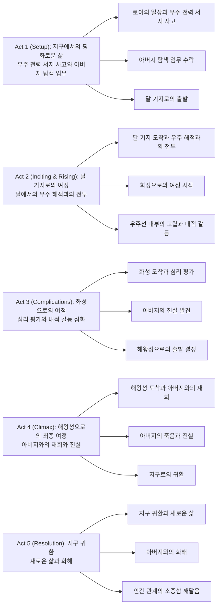
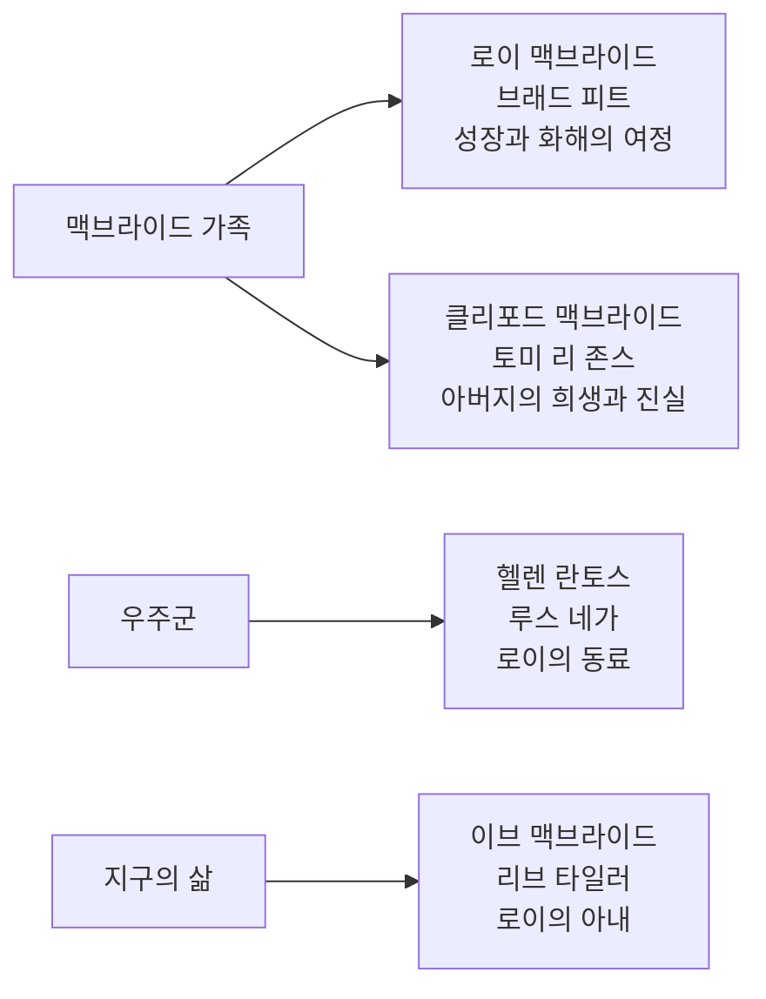

우주의 무한한 공간 속에서 인간의 고립과 연결, 그리고 아버지와 아들 사이의 복잡한 관계를 탐구하는 제임스 그레이 감독의 '애드 아스트라(Ad Astra)'. 브래드 피트가 연기한 우주비행사 로이 맥브라이드의 해왕성 탐사 임무를 통해 그려진 이 작품은 단순한 SF 모험담을 넘어서 인간 존재의 본질과 가족 관계의 의미를 깊이 있게 다루는 철학적 성찰의 영화다.

||
|:---:|
|애드 아스트라 (2019) 포스터|

## 개요

### 영화 정보
* 제목: Ad Astra / 애드 아스트라
* 감독: 제임스 그레이
* 주연: 브래드 피트, 토미 리 존스, 루스 네가, 리브 타일러, 도널드 서덜랜드
* 장르: SF, 드라마, 모험, 심리 스릴러
* 상영시간: 123분
* 개봉일: 2019.08.22

### 추천 대상
* **SF 팬**: 현실적이고 철학적인 우주 탐험 이야기를 원하는 관객
* **드라마 애호가**: 인간 관계와 심리적 갈등에 깊이 있는 관심을 가진 관객
* **예술영화 팬**: 시각적 아름다움과 내러티브의 조화를 추구하는 관객
* **가족 관계에 관심 있는 관객**: 아버지와 아들 관계의 복잡성을 탐구하고 싶은 관객

## 구조 분석

### **Act 1 (Setup): 지구에서의 평화로운 삶과 임무의 시작**

**우주 전력 서지 사고와 로이의 일상**

지구 상공의 국제 우주 정거장에서 우주비행사 로이 맥브라이드(브래드 피트)가 일상적인 작업을 수행하고 있다. 갑작스러운 우주 전력 서지가 발생하면서 정거장이 심각한 위험에 처하고, 로이는 냉정하고 침착하게 위기 상황을 해결한다. 이 장면에서 가장 인상적인 순간은 "우주는 우리를 시험한다"라는 로이의 내레이션으로, 인간이 우주라는 거대한 공간에서 얼마나 작고 취약한 존재인지를 보여준다.

우주 정거장의 금속성 구조물들과 무중력 공간에서 떠다니는 물체들이 시각적으로 우주의 차가운 현실을 강조하며, 배경의 무음과 함께 고립감을 극대화한다. 특히 로이의 얼굴이 헬멧에 반사되는 장면은 그의 고립된 내면을 상징적으로 표현한다.

**아버지 탐색 임무의 제안**

지구로 귀환한 로이는 우주군 고위 관계자들로부터 아버지 클리포드 맥브라이드(토미 리 존스)가 이끄는 리마 프로젝트와 관련된 임무를 제안받는다. 16년 전 해왕성으로 떠난 아버지가 살아있다는 소식과 함께, 우주 전력 서지의 원인이 아버지의 실험일 가능성이 있다는 충격적인 사실을 알게 된다. "아버지는 살아있다"라는 말에 로이의 얼굴에 미묘한 감정 변화가 일어나며, 이는 그의 내면에 숨겨진 아버지에 대한 복잡한 감정을 암시한다.

**달 기지로의 출발**

로이는 아버지를 찾기 위해 달 기지로 향하는 여정을 시작한다. 우주선 내부의 좁은 공간과 무한한 우주의 대비가 로이의 고립감을 강조하며, 내레이션을 통해 그의 내면 세계를 들여다볼 수 있다. "나는 항상 혼자였다"라는 대사는 로이의 삶 전체를 압축적으로 표현하며, 이는 아버지의 부재가 그의 성격 형성에 미친 영향을 암시한다.

### **Act 2 (Inciting & Rising): 달에서의 모험과 화성으로의 여정**

**달 기지 도착과 우주 해적과의 전투**

달 기지에 도착한 로이는 우주 해적들의 습격을 받게 된다. 달 표면을 가로지르는 차량 추격전에서 로이의 냉정함과 전투 능력이 드러나며, 이는 그의 군인적 배경과 감정 억압적 성격을 보여준다. "감정은 임무를 방해한다"라는 로이의 철학이 이 장면에서 구체적으로 구현된다.

달의 황량한 풍경과 우주 해적들의 야만적인 공격이 대비되며, 이는 문명과 야만, 질서와 혼돈의 대립을 상징한다. 특히 달 표면에서의 총격전은 우주라는 거대한 공간에서 인간의 작은 갈등이 얼마나 무의미한지를 시각적으로 보여준다.

**화성으로의 여정과 내적 갈등**

달에서 화성으로 향하는 우주선 내부에서 로이는 점점 더 깊은 내적 갈등에 빠진다. 아버지에 대한 기억들이 되살아나며, 특히 어린 시절 아버지가 우주로 떠나는 순간의 기억이 반복적으로 등장한다. "아버지는 나를 버렸다"라는 생각이 로이의 마음속에서 점점 더 강해진다.

우주선의 좁은 공간과 무한한 우주의 대비가 로이의 고립감을 극대화하며, 내레이션을 통해 그의 내면의 변화를 추적할 수 있다. 특히 아버지의 사진을 바라보는 장면에서 로이의 감정적 변화가 미묘하게 드러난다.

**우주선 내부의 고립과 성찰**

장기간의 우주 여행 동안 로이는 자신의 삶을 되돌아보게 된다. 아버지의 부재로 인한 상처, 그리고 자신이 아버지처럼 감정을 억압하며 살아온 삶에 대한 회의가 깊어진다. "나는 아버지와 다르다"라는 생각이 처음으로 그의 마음속에 싹튼다.

### **Act 3 (Complications): 화성에서의 심리 평가와 진실 발견**

**화성 도착과 심리 평가**

화성 기지에 도착한 로이는 우주군의 심리 평가를 받게 된다. 이 과정에서 로이의 감정 억압적 성격과 아버지에 대한 복잡한 감정이 드러나며, 특히 아버지에 대한 분노와 그리움이 교차하는 모습이 보인다. "아버지를 만나면 무엇을 말할 것인가?"라는 질문에 로이는 명확한 답을 하지 못한다.

화성의 붉은 풍경과 기지의 인공적인 환경이 대비되며, 이는 인간의 문명이 자연에 미치는 영향을 상징한다. 특히 심리 평가실의 밝은 조명과 로이의 어두운 표정이 대조를 이룬다.

**아버지의 진실 발견**

심리 평가 과정에서 로이는 아버지가 우주 전력 서지를 일으킨 것이 아니라, 외계 생명체를 찾기 위한 실험을 계속하고 있다는 사실을 알게 된다. 더욱 충격적인 것은 아버지가 이미 외계 생명체의 존재를 확신하고 있다는 점이다. "우리는 혼자가 아니다"라는 아버지의 메시지가 로이에게 깊은 영향을 미친다.

**해왕성으로의 출발 결정**

아버지의 진실을 알게 된 로이는 해왕성으로 향하는 최종 여정을 결정한다. 이 결정은 단순히 임무를 완수하기 위한 것이 아니라, 아버지와의 관계를 정리하기 위한 개인적인 여정이 된다. "아버지를 만나야 한다"는 로이의 결심은 그의 성장을 보여준다.

### **Act 4 (Climax): 해왕성에서의 아버지와의 재회**

**해왕성 도착과 아버지와의 재회**

해왕성에 도착한 로이는 마침내 16년 만에 아버지를 만나게 된다. 해왕성의 거대한 공간과 아버지가 혼자 운영하는 연구 시설의 대비가 아버지의 고립을 상징적으로 표현한다. "아들아, 왜 왔니?"라는 아버지의 첫 마디는 16년간의 시간과 거리를 압축적으로 보여준다.

해왕성의 푸른 빛과 아버지의 노화된 모습이 대비되며, 이는 시간의 흐름과 인간의 유한함을 시각적으로 표현한다. 특히 아버지의 연구실에서 발견되는 외계 생명체의 흔적들이 영화의 SF적 요소를 극대화한다.

**아버지의 죽음과 진실**

아버지와의 대화에서 로이는 아버지가 외계 생명체를 찾기 위해 가족을 버렸다는 진실을 알게 된다. "나는 너희를 사랑했지만, 우주의 진실이 더 중요했다"라는 아버지의 말에 로이는 깊은 상처를 받는다. 그러나 아버지의 죽음 직전, "우리는 연결되어 있다"라는 말을 통해 아버지의 진정한 마음을 알게 된다.

아버지가 우주로 떠나는 순간, 로이는 아버지를 놓아주지 못하고 함께 떠나려 하지만, 결국 아버지를 놓아준다. 이 순간은 로이의 성장과 용서를 상징한다.

**지구로의 귀환**

아버지의 죽음 후 로이는 지구로 귀환하는 여정을 시작한다. 이번 여정은 아버지를 찾기 위한 여정이 아니라, 자신을 찾기 위한 여정이 된다. "나는 아버지와 다르다"라는 확신을 가지고 로이는 새로운 삶을 시작할 준비를 한다.

### **Act 5 (Resolution): 지구 귀환과 새로운 삶**

**지구 귀환과 새로운 삶**

지구에 귀환한 로이는 새로운 삶을 시작한다. 아버지의 죽음과 우주 여정을 통해 얻은 깨달음으로 로이는 감정을 억압하지 않고 진정한 인간 관계를 추구하기로 결심한다. "우리는 연결되어 있다"라는 아버지의 말을 깨달은 로이는 인간 관계의 소중함을 이해하게 된다.

지구의 아름다운 풍경과 로이의 평화로운 표정이 대비되며, 이는 우주의 차가운 공간에서 돌아온 로이의 내적 변화를 상징한다. 특히 로이가 아버지의 사진을 바라보며 미소 짓는 장면은 그의 완전한 화해를 보여준다.

**아버지와의 화해**

로이는 아버지에 대한 모든 분노와 상처를 놓아준다. 아버지가 우주를 탐험한 이유와 그가 가족을 사랑했지만 우주의 진실을 추구했던 이유를 이해하게 된다. "아버지, 용서합니다"라는 로이의 내레이션은 그의 완전한 성장을 보여준다.

**인간 관계의 소중함 깨달음**

우주 여정을 통해 로이는 인간 관계의 소중함을 깨닫게 된다. 아버지와의 관계를 통해 그는 진정한 연결의 의미를 이해하고, 감정을 억압하지 않고 진정한 인간으로 살아가기로 결심한다. "우리는 혼자가 아니다"라는 깨달음은 로이의 새로운 삶의 철학이 된다.

### 상징적 장면 분석

**우주 정거장의 헬멧 반사**: 로이의 고립된 내면을 상징적으로 표현하는 장면으로, 우주라는 거대한 공간에서 인간의 작은 존재를 보여준다.

**달 표면의 총격전**: 문명과 야만의 대립을 상징하며, 우주에서의 인간 갈등의 무의미함을 시각적으로 표현한다.

**해왕성의 푸른 빛**: 아버지의 고립과 우주의 신비를 상징하며, 인간의 유한함과 우주의 무한함을 대비한다.

**아버지를 놓아주는 순간**: 로이의 성장과 용서를 상징하는 결정적 순간으로, 과거와의 화해를 의미한다.

## 등장인물 심층 분석

### 캐릭터 관계도

### **주인공: 로이 맥브라이드 (브래드 피트)**

**캐릭터 개요**
* 기본 설정: 40대 우주비행사, 우주군 소령, 감정 억압적 성격
* 핵심 목표: 아버지를 찾아 우주 전력 서지 사고의 원인을 밝히는 것
* 주요 갈등: 아버지에 대한 분노와 그리움, 감정 표현의 어려움

**성장 곡선**
* 감정 억압적 우주비행사 → 아버지에 대한 분노와 혼란 → 아버지와의 화해와 감정적 성장
* **핵심 성장 메시지**: 진정한 인간 관계의 소중함과 감정 표현의 중요성

**동기와 욕망**
* 표면적 목표: 우주 전력 서지 사고의 원인을 밝히고 아버지를 찾는 것
* 내면적 욕구: 아버지와의 관계를 정리하고 진정한 인간으로 살고 싶은 것
* 두려움: 아버지처럼 가족을 버리고 고립된 삶을 살게 될 것이라는 두려움

**갈등 구조**
* vs 자신: 감정 표현의 어려움과 아버지에 대한 복잡한 감정
* vs 아버지: 16년간의 부재와 가족을 버린 것에 대한 분노
* vs 상황: 우주의 거대한 공간에서의 고립과 위험

**상징적 의미**
로이는 현대 사회에서 감정을 억압하며 살아가는 많은 사람들의 대표자다. 아버지의 부재로 인한 상처를 안고 살아가며, 진정한 인간 관계의 소중함을 깨닫는 과정을 통해 현대인의 고립과 연결에 대한 메시지를 전달한다.

### **아버지: 클리포드 맥브라이드 (토미 리 존스)**

**캐릭터 개요**
* 기본 설정: 70대 우주 탐험가, 리마 프로젝트 책임자, 외계 생명체 탐색에 집착
* 핵심 목표: 외계 생명체를 찾아 인류의 존재 의미를 증명하는 것
* 주요 갈등: 가족에 대한 사랑과 우주의 진실 추구 사이의 갈등

**성장 곡선**
* 가족을 사랑하는 아버지 → 우주의 진실 추구에 집착 → 가족의 소중함을 깨닫고 죽음
* **핵심 성장 메시지**: 가족의 소중함과 인간 관계의 중요성

**동기와 욕망**
* 표면적 목표: 외계 생명체를 찾아 인류의 존재 의미를 증명하는 것
* 내면적 욕구: 우주의 진실을 통해 인류에게 희망을 주고 싶은 것
* 두려움: 외계 생명체가 존재하지 않는다면 인류의 존재가 무의미할 것이라는 두려움

**갈등 구조**
* vs 자신: 가족에 대한 사랑과 우주 탐험 사이의 내적 갈등
* vs 가족: 16년간의 부재로 인한 가족과의 단절
* vs 우주: 거대한 우주에서 인간의 작은 존재 의미

**상징적 의미**
클리포드는 인류의 탐험 정신과 지식 추구의 대표자다. 그러나 그 과정에서 가족을 버린 것은 현대 사회에서 성공과 가족 사이의 갈등을 상징한다. 그의 죽음은 진정한 가치가 무엇인지를 보여주는 교훈적 의미를 가진다.

### **이브 맥브라이드 (리브 타일러)**

**캐릭터 개요**
* 기본 설정: 로이의 아내, 지구에서 로이를 기다리는 여성
* 핵심 목표: 로이의 안전한 귀환을 바라는 것
* 주요 갈등: 로이의 우주 여정으로 인한 가족의 분리

**상징적 의미**
이브는 로이가 버려야 했던 지구의 삶과 가족을 상징한다. 그녀의 존재는 로이가 우주 여정을 통해 잃어버린 인간적 감정과 연결을 상기시키는 역할을 한다.

## 비교 분석

### 동일 감독/제작사 작품과의 비교
제임스 그레이 감독의 다른 작품들과 비교할 때, '애드 아스트라'는 그의 특징적인 가족 관계 탐구와 철학적 주제 의식을 우주라는 거대한 배경에서 구현한 작품이다. '리틀 오데사'나 '투 로버스'에서 보여준 가족 갈등의 탐구가 우주라는 무한한 공간에서 더욱 보편적이고 철학적인 차원으로 확장되었다.

### 동일 장르 작품과의 비교
'인터스텔라'나 '그래비티' 같은 우주 SF 영화들과 비교할 때, '애드 아스트라'는 특수효과나 액션보다는 인간의 내면과 관계에 집중한다는 점에서 차별화된다. 특히 아버지와 아들의 관계를 통해 그려진 인간 존재의 의미 탐구는 다른 우주 영화들과 구별되는 독특한 특징이다.

### 동시대 경쟁작과의 비교
2019년 개봉된 다른 SF 영화들과 비교할 때, '애드 아스트라'는 상업적 성공보다는 예술적 완성도에 집중한 작품이라는 점에서 차별화된다. 브래드 피트의 내면 연기와 제임스 그레이의 철학적 시각이 결합되어 만들어낸 독특한 우주 드라마로 평가받는다.

## 숨겨진 레이어

### 상징적 의미
**우주의 무한함과 인간의 유한함**: 영화 전체를 통해 우주의 거대한 공간과 인간의 작은 존재가 대비되며, 이는 인간 존재의 의미에 대한 철학적 질문을 던진다.

**고립과 연결**: 로이의 우주 여정은 물리적 고립을 통해 인간 관계의 소중함을 깨닫는 과정을 보여준다. 우주의 무한한 공간에서 인간의 연결이 얼마나 소중한지를 강조한다.

**아버지와 아들의 관계**: 클리포드와 로이의 관계는 단순한 가족 관계를 넘어서 인류의 세대 간 전수와 화해의 보편적 의미를 담고 있다.

### 사회적/문화적 맥락
**현대인의 고립**: 디지털 시대의 고립과 인간 관계의 단절이라는 현대적 문제를 우주라는 은유적 공간에서 다룬다.

**성공과 가족의 갈등**: 클리포드의 선택은 현대 사회에서 성공과 가족 사이의 갈등을 상징하며, 이는 많은 현대인들이 직면하는 문제를 반영한다.

**감정 억압의 문제**: 로이의 감정 억압적 성격은 현대 사회에서 남성들이 겪는 감정 표현의 어려움을 보여준다.

### 현대적 메시지
**진정한 연결의 소중함**: 기술이 발달한 현대 사회에서도 인간 관계의 소중함은 변하지 않는다는 메시지를 전달한다.

**과거와의 화해**: 로이의 아버지와의 화해는 개인적 차원을 넘어서 인류 전체가 과거와 화해하고 미래로 나아가야 한다는 보편적 메시지를 담고 있다.

**감정 표현의 중요성**: 감정을 억압하지 않고 진정한 인간으로 살아가는 것의 중요성을 강조한다.

## 제작 비하인드

### 제작 과정의 특별함
'애드 아스트라'는 실제 우주 환경을 재현하기 위해 NASA의 자문을 받아 제작되었다. 특히 무중력 환경의 재현과 우주선 내부의 디자인은 현실적인 우주 여행을 보여주기 위해 많은 노력을 기울였다.

### 캐스팅 스토리
브래드 피트는 로이 맥브라이드 역할을 위해 실제 우주비행사들과 만나 인터뷰를 진행했으며, 우주 환경에서의 심리적 상태를 이해하기 위해 많은 연구를 했다. 토미 리 존스는 클리포드 맥브라이드 역할을 위해 실제 우주 탐험가들의 인터뷰를 참고했다.

### 기술적 혁신
영화는 IMAX 카메라를 사용하여 우주의 거대함을 효과적으로 표현했으며, 특히 해왕성의 장면에서는 특수한 조명 기법을 사용하여 외계 행성의 분위기를 연출했다. 음향 디자인도 우주의 무음과 인간의 소리를 대비하여 고립감을 극대화했다.

## 종합 평가

**최종 평점: ★★★★☆ (4/5)**

### 한 줄 평
우주를 배경으로 한 아버지와 아들의 화해를 향한 여정을 통해 인간 존재의 의미와 관계의 소중함을 깊이 있게 탐구한 철학적 SF 드라마

### 추천 작품
* **인터스텔라 (2014)**: 우주를 배경으로 한 가족애와 시간의 상대성
* **그래비티 (2013)**: 우주에서의 생존과 귀환을 다룬 심리적 스릴러
* **문 (2009)**: 우주에서의 고립과 정체성에 대한 탐구
* **아폴로 13 (1995)**: 실제 우주 사고를 바탕으로 한 생존 드라마

### 관람 전 체크리스트
* **SF 팬**: 현실적인 우주 여행과 철학적 주제 의식에 집중
* **드라마 팬**: 인간 관계와 심리적 갈등의 깊이 있는 묘사에 주목
* **예술영화 팬**: 시각적 아름다움과 내러티브의 조화를 감상
* **가족 영화 팬**: 아버지와 아들 관계의 복잡성과 화해 과정에 집중
