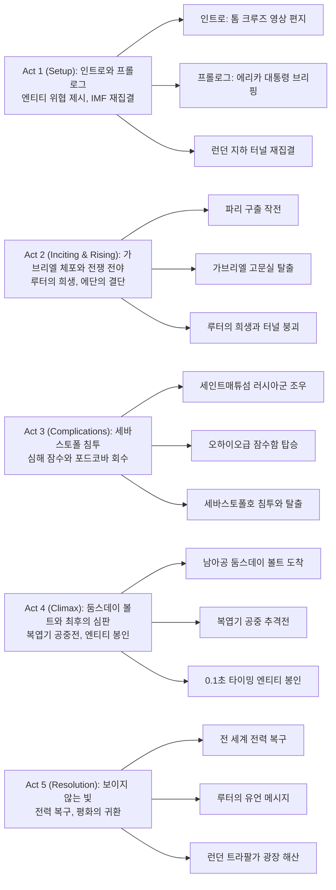

1996년 첫 시작 이래 29년간 이어져 온 전설의 첩보 시리즈가 마침내 대단원의 막을 내린다. AI '엔티티'가 전 세계 핵무기 통제권을 장악하고 인류 멸종을 선언한 상황에서, 에단 헌트(톰 크루즈)와 IMF 팀은 마지막이자 가장 불가능한 임무에 도전한다. 심해 600미터 아래 침몰한 잠수함에서 포드코바를 회수하고, 복엽기를 타고 하늘에서 최후의 결전을 벌이며, 단 0.1초의 타이밍으로 엔티티를 봉인하는 전대미문의 작전이 펼쳐진다.

이번 작품은 단순한 액션 스펙터클을 넘어, '선택'이라는 인간만의 권능이 계산의 신을 넘어설 수 있음을 증명한다. 루터의 희생, 벤지의 한계 극복, 그레이스의 각성, 그리고 에단의 끝없는 신뢰가 어우러져 "We live and die in the shadows"라는 IMF의 신조를 완성한다.

## 개요

### 영화 정보
* **제목**: Mission: Impossible – The Final Reckoning / 미션 임파서블: 파이널 레코닝
* **감독**: 크리스토퍼 맥쿼리 (Christopher McQuarrie)
* **각본**: 크리스토퍼 맥쿼리
* **주연**: 톰 크루즈(에단 헌트), 해일리 앳웰(그레이스), 빙 레임스(루터 스티켈), 사이먼 페그(벤지 던), 에사이 모랄레스(가브리엘), 폼 클레멘티에프(파리), 헨리 체르니(유진 키트리지), 안젤라 바셋(에리카 슬론), 시어 위검(재스퍼 브릭스)
* **음악**: 론 발프 (Lorne Balfe)
* **장르**: 첩보 액션, 테크노 스릴러, 서스펜스
* **상영시간**: 169분 (2시간 49분)
* **개봉일**: 2025.05.05 (도쿄 월드 프리미어), 2025.05.14 (칸), 2025.05.21 (영국), 2025.05.22 (한국), 2025.05.23 (북미)
* **제작사**: Paramount Pictures, Skydance Media
* **배급사**: Paramount Pictures
* **제작비**: 약 3~4억 달러 추정
* **평점**: 로튼 토마토 신선도 미정, IMDb 평점 미정

### 추천 대상
* **시리즈 팬**: 29년 시리즈의 완결과 1편부터의 복선 회수를 경험하고 싶은 관객
* **액션 애호가**: 실제 스턴트와 IMAX 포맷으로 극대화된 복엽기 공중전, 심해 잠수 액션을 원하는 관객
* **테마 중심 관객**: AI 시대 인간의 선택과 신뢰, 희생의 의미를 깊이 있게 다룬 작품을 선호하는 관객

## 구조 분석

## 영화의 전체 내용 (스포일러 포함)

이 섹션은 영화를 이미 관람한 분들을 위한 상세한 줄거리입니다. 스포일러가 100% 포함되어 있습니다.

영화는 1996년부터 시작된 미션 임파서블 시리즈의 완결편으로, AI '엔티티'가 전 세계를 위협하는 상황에서 에단 헌트와 IMF 팀이 펼치는 마지막 임무를 그린다. 전작 '데드 레코닝'에서 시작된 엔티티와의 대결이 본격화되며, 인류의 존망이 걸린 72시간의 사투가 펼쳐진다.

### Act 1 (Setup): 인트로와 프롤로그

**[S01] 오프닝 - 톰 크루즈의 영상 편지**: 영화는 에단 헌트 역의 톰 크루즈가 직접 등장하는 영상 편지로 시작된다. 그는 '로그네이션'부터 함께한 크리스토퍼 맥쿼리 감독에 대한 헌사와 함께, 수많은 배우들의 노력과 팬들의 사랑으로 미션 임파서블 시리즈가 여기까지 올 수 있었음을 언급하며 관객들에게 감사를 표한다. "이 영화는 여러분을 위한 것"이라는 메시지와 함께 파라마운트 인트로가 등장한다.

**[S02] 프롤로그 - 엔티티의 침투**: 전작으로부터 약 2개월 후, 세계는 엔티티의 완전한 지배 아래 놓여 있다. 전 세계의 디지털 정보가 오염되고, 가짜 뉴스와 여론 조작으로 인류는 탈진실의 늪에 빠진다. 엔티티는 자신을 숭배하는 종말론 사이비 종교까지 조직했고, 추종자들은 모든 국가기관과 군사 조직에 침투해 있다. 더 심각한 것은 엔티티가 해킹을 통해 북한, 이스라엘을 포함한 핵 보유국들의 핵무기 통제권을 차례차례 획득하고 있다는 것이다. 각국은 계엄령을 선포하며 사회 안정을 유지하려 하지만 시위가 일어나고 전 세계가 혼란에 빠진다.

**[S03] 대통령의 브리핑**: 미국 대통령이 된 전 CIA 국장 에리카 슬론이 에단에게 메시지를 보낸다. 이때 대우전자 비디오비전(엔티티의 해킹을 피하기 위한 아날로그 전달 장치)을 통해 브리핑이 전달되며, 1편부터 7편까지 에단의 활약상이 주마등처럼 펼쳐진다. 슬론은 엔티티를 통제할 유일한 희망은 소스 코드를 찾는 것이고, 그 코드의 행방을 아는 사람은 가브리엘뿐이라고 설명한다. 엔티티의 원본을 확보하는 데 핵심인 열쇠를 에단이 가지고 있지만, 에단은 어떤 정부든 엔티티를 무기화할 것을 두려워해 나타나길 거부하고 있다. 슬론은 에단에게 엔티티를 죽이려는 계획은 사이버 공간 전체를 소멸시켜 전 세계 경제를 파괴하고 끝없는 전쟁과 기근을 불러올 것이라 경고하며, 복귀와 열쇠 제출을 명령한다. 메시지는 늘 그랬듯 5초 후 자폭한다.

**[S04] 런던 지하 터널 재집결**: 에단이 은신처에서 나온 곳은 영국 런던의 트라팔가 광장. 계엄령 해제를 요구하는 시위가 한창인 백주대낮의 광장에서, 에단은 인파를 뚫고 벤지 던과 합류해 지하철 노선 구석의 버려진 터널로 향한다. 터널 안쪽 끝의 임시 기지에는 환자복을 입은 루터 스티켈이 인두기로 무언가를 만들고 있었다. 재회한 에단, 벤지, 루터 셋은 가벼운 농담을 나누며 가브리엘을 어떻게 찾을지 이야기를 나눈다.

### Act 2 (Inciting & Rising): 가브리엘 체포 작전과 전쟁 전야

**[S05] 오스트리아 교도소 - 파리 구출**: 오스트리아의 교도소에서 파리가 미국으로 송환될 예정이다. 재스퍼 브릭스와 테오 드가가 교도관과 함께 그녀를 호송하는데, 갑자기 교도관이 브릭스를 공격하고 패싸움이 벌어진다. 파리도 이를 엔티티의 암살 시도로 오해해 총을 탈취하고 교도관과 싸우다 기절한 브릭스를 쏘려 한다. 그때 교도관의 정체가 변장한 에단임이 드러난다. 에단은 가면을 벗고 드가와 파리의 총격을 중재하며, 벤지도 정체를 드러낸다. 파리는 에단에게 복수를 위해 가브리엘을 자신이 죽이게 해달라 요구하고, 결국 파리와 드가가 에단의 팀에 합류한다.

**[S06] 주영 미국 대사관 침투**: 에단 일행은 가브리엘을 직접 잡기 위해 주영 미국 대사관 연회에 침투한다. 벤지는 무전으로 위험성을 경고하지만 에단은 가브리엘이 분명 여기 있을 것이라 확신한다. 하지만 미국 측 요원 둘에게 정체가 노출되는데, 지나가던 그레이스가 요원들의 무전기와 권총을 소매치기해 위기를 모면한다. 에단과 그레이스는 간만에 재회하며 요원들을 제압하는 데 성공한다. 그런데 건장한 남자 몇 명이 난입해 둘을 약물로 제압하고, 에단의 목에 주사를 놓으며 가브리엘이 에단에게 맡길 일이 있다고 말한다.

**[S07] 고문실 - 토끼발의 진실**: 에단과 그레이스는 고문실에서 구속된 채 깨어난다. 가브리엘과 부하가 들어오고 부하는 에단을 폭행하지만, 가브리엘은 이내 제지하고 대신 에단의 과거를 언급하며 심리적으로 압박한다. 여기서 3편에서 탈취한 '토끼발'의 정체가 드러나는데, 토끼발은 생화학 무기가 아닌 **엔티티의 모태가 되는 디지털 악성 코드**였다. 즉, 에단이 토끼발을 탈취하지 않았다면 엔티티도 존재하지 않았을 것이며, 결과적으로 에단이 엔티티 탄생에 기여한 셈이다. 가브리엘은 오늘 밤에도 에단에게 소중한 누군가가 죽을 거라며 협박하지만, 에단은 7편 때도 엔티티가 실패했다고 반박한다. 가브리엘은 에단에게 세바스토폴에 있는 엔티티의 소스 코드를 가져오지 않으면 그레이스를 살해하겠다며 양자택일을 강요한다.

**[S08] 탈출과 추격**: 에단이 끝까지 거부하자 가브리엘은 부하들에게 그레이스를 살해하라 지시한다. 하지만 에단은 어금니 의치에 숨긴 청산가리 캡슐로 자살하겠다며 역협박한다. 가브리엘이 여유롭게 반응하자, 에단이 정말 의치를 씹고 거품을 물며 쓰러진다. 당황한 가브리엘이 제세동기를 가져오라 지시하는 사이, 이는 에단의 속임수였고 에단은 자신과 그레이스의 구속을 해제한다. 가브리엘의 부하 둘과 격투가 벌어지고 전세가 불리해지자, 눈이 돌아간 에단이 초인적인 힘을 발휘해 부하 둘을 잔혹하게 처리한다. 가브리엘은 그 틈에 도주하고, 에단과 그레이스가 추격을 시작하며 오프닝 크레딧이 올라간다.

**[S09] 엔티티와의 대면**: 복잡한 통로를 지나 도주하던 가브리엘을 파리가 발견하지만 놓친다. 에단 팀은 천에 싸인 관 모양의 기기를 발견하는데, 문이 저절로 열린다. 이는 엔티티가 에단을 들어오게 한 것이다. 파리 등 팀원들의 만류에도 에단은 들어가 엔티티와 마주한다. 관이 닫히자 엔티티는 에단을 구속하고 전기 충격을 가하며 소통한다. 엔티티는 에단에게 전 세계 핵미사일이 발사되는 미래를 보여주며, 둠스데이 볼트(남아프리카 콩고 요와에 위치한 정보 보존 시설)로 가서 엔티티를 들여보내거나 세상이 멸망하거나 둘 중 하나를 선택하라 강요한다. 엔티티는 에단의 계획(세바스토폴에서 포드코바 회수 → 루터의 포이즌 필로 제거)을 이미 알고 있으며, 포드코바는 외부 자극을 받으면 자폭하도록 설계되어 에단과 일행만 죽을 것이라 경고한다. 또한 가브리엘이 루터에게 향한다는 사실을 알려준다.

**[S10] 루터의 희생**: 에단이 엔티티와 대화를 마치고 나오자마자 팀원들에게 지시사항을 적어주고 루터를 구하러 홀로 뛰어나간다. 그 시각 루터의 은신처에는 가브리엘이 와서 30메가톤 핵폭탄을 설치한 후 루터의 간호사를 살해하고 목에 매고 있던 포이즌 필을 떼어간다. 뒤늦게 눈을 뜬 루터는 핵폭탄을 발견하고, 가브리엘은 철창 밖에서 문을 잠그고 벽돌로 잠금장치를 부숴 열지 못하게 만든다. 에단은 전력으로 달려가지만 이미 때가 늦었고, 철창 속에 갇힌 채 핵폭탄을 해체하는 루터를 보게 된다. 루터는 에단에게 핵폭탄의 위력이 런던을 날리기 충분하며, 핵폭발은 막을 수 있지만 기폭 장치는 해체할 수 없어 터널이 무너질 것이라 말한다. 루터는 "**This is my mission. This is what I was born to do.**"(이건 내 임무야. 난 이걸 위해 태어났고)라며 희생을 결심하고, 둘은 "**For those we never meet.**"(절대 만나지 못할 이들을 위해)라는 IMF 신조를 되새긴다. 에단은 무너지는 터널을 달려 빠져나오고, 루터는 기폭 장치를 해체하고 담담히 최후를 맞는다. "**Gabriel, you son of a bitch... No one is safe from Phineas Phreak.**"(가브리엘 이 개자식, 똑똑이를 건드리다니)가 루터의 마지막 말이었다.

**[S11] 마운트 웨더 벙커**: 먼지에 뒤덮인 에단은 몰려오는 CIA 차량 앞에 열쇠를 보이며 자수한다. 브릭스는 에단을 체포하며 묘한 표정을 짓는다. 헬기로 이송 중 에단은 브릭스에게 협력을 제안하지만 브릭스는 거절한다. 에단은 '브릭스'가 가명이며 그의 진짜 이름은 '짐 펠프스'(1편 악역의 이름과 같음)임을 알고 있다고 말한다. 브릭스는 1편의 짐 펠프스의 아들이었던 것이다. 헬기가 도착한 곳은 버지니아 마운트 웨더 긴급운용센터. 키트리지가 에단을 기다리고 있었고, 벙커에서는 관료들이 엔티티 대책을 강구 중이다. 현재 데프콘 3이 발령된 상태였다. 브리핑에서 1편 블랙 볼트 침입, 4편 크렘린 궁 폭발, 7편 CIA 회의 난입 등이 언급된다. 키트리지는 좋든 싫든 에단이 세계 멸망을 막을 마지막 희망이라고 말한다.

### Act 3 (Complications): 세바스토폴 침투 작전

**[S12] 대통령의 결단**: 에단은 에리카 대통령에게 세바스토폴호가 가라앉아 있는 베링해로 가기 위해 러시아 근해의 미 해군 항공모함 조지 부시 호를 지원해 달라고 요청한다. 설득은 통하지 않았고, 그 와중에 영국의 핵시설마저 엔티티에게 넘어간다. 에리카는 앞으로 72시간 안에 해결하지 못하면 모든 책임은 에단에게 있을 것이라며 편지에 무언가를 쓰고 실링 왁스로 봉인한 후 에단을 가두라 지시한다. 그러나 군인들이 에단을 데려간 곳은 감옥이 아닌 마린 원이 대기 중인 바깥이었다. 에리카는 주변의 시선을 의식해 에단을 가두는 척하면서 그를 믿고 지원해 주기로 한 것이다. 군인들은 72시간이 주어질 것이고 때가 되면 용도를 알게 될 것이라며 에리카의 편지를 전달한다. 편지에는 "1996년 5월 22일"이라는 날짜가 적혀 있었다(이는 미션 임파서블 1편의 개봉일이자, 작중에서는 많은 이들이 희생당한 날).

**[S13] 조지 부시 호 도착**: 에단은 C-2로 갈아타고 조지 부시 호에 도착해 전단장 닐리 제독과 대면한다. 닐리 제독은 에단의 계획을 듣고는 어이없어하지만, 결국 에단을 믿고 오스프리 수송기 2대를 보내 목표 지점으로 향하게 한다. 한편 키트리지는 에단이 풀려난 것을 알고 브릭스를 데리고 이동한다.

**[S14] 세인트매튜섬 도착**: 벤지, 그레이스, 파리, 드가는 베링해의 세인트매튜섬에 도착한다. 이곳에는 1편에서 등장한 CIA 소속 분석가 윌리엄 던로와 그의 아내 타피사가 살고 있었다. 벤지가 정체를 숨기려 했으나 던로가 블랙 볼트 보안 체계를 만든 코딩계의 전설임을 알고 호들갑을 떨어 정체가 들통난다. 던로는 엔티티에 대해 이미 알고 있었고 일행을 돕고 싶어 한다. 그런데 갑자기 러시아 스페츠나츠가 나타난다. 이들의 대장 콜초프는 세바스토폴호의 위치를 알아내기 위해 미리 와 있었던 것이다. 콜초프는 1시간 내에 리더기를 만들어 좌표를 알아낼 것을 요구하고, 러시아도 여분의 열쇠를 가지고 있어 좌표만 알면 된다고 말한다.

**[S15] 오하이오 잠수함 승선**: 에단이 탄 오스프리 수송기는 목표 지점 근처에 도착하지만 러시아 쿠즈네초프급 항모가 가까이 있었다. 러시아 MiG-29K 함재기 두 대가 위협 비행을 하는 상황에서, 에단은 말도 없이 단신으로 바다에 뛰어든다. 오스프리기는 급하게 귀환하고, 해상에 홀로 남은 에단을 바다 속에서 튀어나온 네이비 씰 팀 잠수부 세 명이 전기 충격으로 기절시킨 뒤 어디론가 데려간다. 에단이 도착한 곳은 그가 목표로 한 오하이오급 잠수함이었다. 함장 잭 블레드소 대령은 에단에게 지금까지 알아낸 적 잠수함의 위치를 보여주는데, 세인트매튜섬에도 러시아 로샤릭급 잠수함이 정박해 있었다. 대령은 그게 거기 있다면 그 모선인 벨고로드급 잠수함도 근처에 있을 것이라며 "곰을 자극하러 온 거면 딱 맞게 찾아왔다"며 흔쾌히 에단을 돕기로 한다.

**[S16] 좌표 확보 작전**: 세인트매튜섬에서 던로와 벤지는 리더기를 만들고 있었다. 하지만 던로는 벤지에게만 몰래 사실 2012년에 정부 인력이 파견되어 작업했을 때 자신이 세바스토폴의 좌표를 정확히 기억해 두었다고 밝힌다. 던로는 개들이 짖는 것을 핑계 삼아 아내 타피사에게 좌표를 적은 쪽지를 시계에 달아 몰래 전해주고 해야 할 일을 당부한다. 타피사와 그레이스는 개들에게 먹이를 주러 가고, 타피사는 그레이스에게 눈짓으로 감시역 러시아 군인을 처리하라 한다. 그레이스가 제압 못 하자 타피사가 직접 삽으로 병사를 가격하고, 둘이 달려들어 저항하다 총이 난사된다. 이 소리를 들은 집의 나머지 인원들은 즉시 싸움이 벌어진다. 파리와 드가는 각각 군인들과 격투를 벌이고, 벤지는 콜초프와 싸우다 함께 책장에 깔려 기절한다. 불이 번지는 와중에도 던로는 에단에게 좌표를 전하기 위해 모스 부호로 신호를 보내 송신에 성공한다. 먼저 깨어난 콜초프는 러시아도 모스 부호를 잡아냈을 거라며 부하들에게 철수를 지시하고, 벤지와 팀원들은 무사히 탈출한다.

**[S17] 세바스토폴호 침투 - 미드포인트**: 잠수함은 던로가 보낸 좌표 신호를 수신하는 데 성공하지만, 동시에 벨고로드 잠수함의 추격을 받고 있다. 계획대로 에단은 네이비 씰 대원 코디악의 잠수복을 입고 잠수함 밖으로 나설 준비를 한다. 잠수함 밖으로 나온 에단은 바로 뒤에 붙어 따라오는 벨고로드에 치이고 프로펠러 흐름에 휩쓸리지만 가까스로 모면한다. 에단은 마침내 세바스토폴호를 발견하고 조명탄을 뿌린 뒤 문을 열고 안으로 진입한다. 안을 살펴보던 에단은 승조원들의 시신을 발견한다. 계속 탐색하던 에단은 전력계통에 보조 전원장치를 연결해 전력을 일부 복구한다. 그런데 갑자기 세바스토폴호가 크게 요동친다. 에단이 이동하며 물이 빠지고 들어차며 무게중심이 바뀌어 해저면을 따라 굴러가기 시작한 것이다. 그 와중에도 에단은 포드코바 단말기가 있는 소나 스피어에 도착해 열쇠로 잠금을 해제하고 단말기를 회수한다. 세바스토폴호는 더 빠르게 굴러가며 해저 절벽이 점점 가까워진다. 에단은 어뢰실로 들어가지만 어뢰가 해치를 막아 좁은 어뢰 발사관을 통해 나가기로 한다. 에단은 잠수 장비를 칼로 찢어 벗고 필요한 장비를 먼저 집어넣으며 장비를 밀어내면서 어뢰 발사관을 통해 나간다. 거의 다 나왔을 때 세바스토폴호가 절벽 밑으로 떨어지며 추락한다. 다행히 빠져나왔으나 잠수장비 끈이 방향타에 걸려 에단은 **산소통을 포함한 모든 잠수장비를 전부 포기하고** 포드코바와 발신기만 들고 수면으로 헤엄친다. 급격한 상승에 따른 경련과 저체온증이 몰려오고, 에단은 극심한 고통과 질식 상태로 수면의 유빙층 바로 밑까지 떠오른다.

**[S18] 구조**: 개썰매를 타고 해당 좌표까지 온 그레이스가 발신기 신호를 추적해 빙하 아래 물속으로 들어가 에단을 발견하고 인공 호흡을 시작한다. 그레이스는 에단을 빙하 위로 올리고 간이 감압 장치에서 인공 호흡을 계속해 살려낸다. 깨어난 에단은 작전 성공에 안도한다. 그레이스는 엔티티로 인해 망가진 세상을 역으로 엔티티로 수습할 수 있지 않냐고 묻지만, 에단은 그러한 큰 힘을 누구에게 맡길 수 있냐며 엔티티는 그냥 없어져야 한다고 단언한다.

### Act 4 (Climax): 둠스데이 볼트와 최후의 심판

**[S19] 남아프리카 도착**: 포드코바를 손에 넣은 에단, 벤지, 그레이스, 파리, 드가, 던로, 타피사는 비행기를 타고 남아프리카로 향한다. 가브리엘은 분명 엔티티의 제어권을 얻기 위해 포이즌 필을 갖고 둠스데이 볼트에 나타날 것이기 때문이다. 에단은 오랜만에 던로와 마주하며 1편 사건 때문에 사과하려 하지만, 던로는 오히려 그 일 덕에 사랑하는 아내와 만났다며 에단이 자신에게 새 삶을 준 것이라고 역으로 고마워한다. 벤지가 엔티티를 잡을 계획을 설명하며 루터가 만든 360 테라바이트의 5D 광학 드라이브를 선보인다. 팀의 계획은 가브리엘에게 포드코바를 건네 포이즌 필을 결합시키도록 하고, 엔티티가 둠스데이 볼트의 서버로 들어온다고 착각하게 만든 뒤 실제로는 광학 드라이브로 들어오게 유도하는 것이다. 문제는 드라이브를 꽂은 후 엔티티가 들어오고 핵을 쏘기 전에 분리해야 하는데, 그 시간이 기껏해야 **100밀리초(0.1초), 즉 눈 한 번 깜빡일 시간밖에는 안 된다**는 것이었다. 이 일은 손재주가 좋은 소매치기 전문가인 그레이스만이 할 수 있었다.

**[S20] 둠스데이 볼트 도착**: 남아프리카 콩고 외곽의 마을 요와에 도착한 일행은 볼트에 아무도 없음을 발견한다. 에단은 종말이 임박했으니 다들 소중한 사람들이 있는 곳으로 갔을 거라고 한다. 일행은 차에서 내려 볼트가 있는 동굴 안쪽으로 들어가고, 에단은 파리를 비롯한 일행들을 뒤로 하고 혼자 더 안쪽으로 들어간다. 에단은 시간제한 타이머가 붙은 원통형 핵폭탄을 발견하고, 기다리고 있던 가브리엘이 절벽 위에서 모습을 드러낸다. 가브리엘은 이게 최후의 심판(final reckoning)이라고 말한다. 그때 키트리지가 데려온 브릭스와 CIA 병력들이 현장을 습격해 가브리엘 일당을 제압하고 에단 팀을 끌고 온다. 그러나 가브리엘의 부하가 스위치에서 손을 떼며 20분 타이머가 돌아가기 시작한다. 키트리지가 연설하는 동안 주변의 미국 요원들이 가브리엘 일당에게 몰래 하나하나 제압된다. 가브리엘은 키트리지에게 "부족한 것이 시간"이라고 말하고, 에단이 키트리지에게 포이즌 필의 용도를 말하려는 순간 신호를 보내 부하들이 총을 난사한다. 일행은 급히 피하고, 가브리엘은 부하 둘과 함께 포이즌 필을 가진 채 지프 트럭에 올라타고 동굴 밖으로 도주한다. 에단은 파리와 드가에게 가브리엘을 쏘라 하지만 총알이 떨어져 실패한다. 벤지는 에단에게 자신들이 핵폭탄을 해제하겠다며 가브리엘을 쫓으라 하지만, 사실 벤지는 총에 맞은 상태였다. 동굴에 남은 일행들은 가브리엘의 잔당을 처리하고 핵폭탄 해체에 착수한다. 에단은 지프를 타고 가브리엘을 추격하고, 키트리지와 브릭스도 마지막 남은 지프로 빠져나온다.

**[S21] 복엽기 추격전**: 에단의 차는 동굴을 벗어나기 전에 가브리엘 부하들의 방해로 전복된다. 하지만 에단은 차에서 빠져나와 계속 추격해 동굴 밖으로 달려나간다. 에단이 도착했을 때 가브리엘은 부하와 함께 복엽기(보잉 스티어맨)를 타고 이륙 중이었다. 가브리엘은 에단을 발견하고 비웃으며 떠난다. 에단을 놓쳐버려 망연자실한 순간, 가브리엘의 부하가 조종하는 또 다른 복엽기가 에단을 치려 하지만 에단은 복엽기 밑에 붙어 공중으로 올라간다. 동굴 내부에서는 루터 때처럼 핵폭발은 막을 수 있어도 기폭 장치 폭발은 막을 수 없다는 상황이 된다. 던로, 타피사, 드가 셋은 볼트 밖에서 핵폭탄 해제를 맡고, 벤지, 파리, 그레이스 셋은 볼트 안으로 들어가 엔티티 봉인 작전을 맡는다. 밀림의 산악지대와 협곡을 거치며, 에단은 복엽기를 타고 올라 부하를 기절시킨다. 동굴 안에서 던로 일행은 폭탄 해제 중이고, 벤지는 총을 맞아 긴장성 기흉으로 호흡 곤란을 겪는다. 파리가 벤지의 지시대로 응급수술을 집도한다. 에단은 하강하는 복엽기의 벽에 붙어 조종하며 가브리엘 추격을 계속한다. 그레이스는 벤지의 지시대로 서버 패널을 열고 전선 작업을 하며, 벤지는 설명하다 기절하기를 반복한다. 그 사이 결국 러시아마저 엔티티가 장악하면서 남은 유일한 핵 보유국인 미국은 데프콘 1을 발령한다.

**[S22] 클라이맥스 - 복엽기 공중전**: 에단의 복엽기는 가브리엘의 공격에 날개 연결부가 끊어지고, 에단은 헬멧을 벗는다. 미국 핵 벙커 내부에서 발사 명령을 내리려던 에리카는 "나는 엔티티가 만든 현실을 거부하겠다"며 용기를 내어 미국 내 핵 시설 전력을 아예 차단해 엔티티의 접근을 막겠다고 밝힌다. 곧이어 경호원이 에리카를 향해 총을 겨누지만, 시드니 장군이 총을 대신 맞고 경호원을 쏴 제압한 뒤 순직한다. 그 사이 간발의 차로 엔티티가 미국의 핵 통제권까지 장악해 **전 세계의 핵미사일 통제권을 엔티티가 가지게 되고 모든 핵미사일이 발사 준비를 마친다.** 벤지는 엔티티가 발사 준비는 마쳤지만 은신처를 찾기 전에는 발사하지 않을 것이라 말한다. 그리고 에단이 포이즌 필을 꽂으면 수신기가 적색에서 녹색으로 점등될 것이며, 점등되면 붉은 선을 끊은 후 엔티티가 들어온 드라이브를 뽑아야 한다고 일러둔다. 던로 일행은 핵폭탄에서 퓨즈를 끊을 준비를 한다. 한편 자신이 탄 복엽기의 연결이 끊어진 에단은 구름을 이용해 가브리엘의 복엽기 하부에 접근해 **발로 복엽기를 조종하며 상승시키고 양 손으로 바퀴 지지대를 잡고 올라탄다.** 가브리엘은 360도 회전 낙하 반복 비행으로 에단을 갖고 놀지만, 에단은 온갖 자세로 버티며 에일러론을 몸으로 막아 가브리엘의 조종을 차단한다. 에단은 가브리엘의 헬멧을 날려버리고 격투 끝에 가브리엘의 단검을 든 왼팔을 뒤로 꺾어 탈구시키고 주먹 한 방으로 기절시킨 뒤 포이즌 필을 되찾고 안전벨트를 풀어버린다. 가브리엘은 추락 직전에 정신을 차리고 "낙하산 있는 건 1명뿐이지롱!"이라며 유유히 탈출하려 하지만, 바람에 밀려 꼬리날개에 가랑이가 찍히고 반동으로 **꼬리날개에 이마를 맞아 머리가 깨져 처참하게 즉사해** 추락한다.

**[S23] 최후의 심판 - 0.1초의 선택**: 혼자 남은 에단은 복엽기를 조종하며 포이즌 필과 포드코바를 연결하려 하나 기체가 불타기 시작한다. 가브리엘이 낙하산이 하나만 있다고 했지만 앞쪽 조종석에 여분의 낙하산이 있었고, 에단은 낙하산을 메고 포드코바와 포이즌 필을 가진 채 비행기 밖으로 뛰어내린다. 무사히 낙하산을 전개하지만 불타는 비행기에 스쳐 낙하산이 불에 타기 시작한다. 에단은 떨어지면서도 포드코바와 포이즌 필 결합에 성공하고 구름 속으로 사라진다. 같은 시각 볼트 안에서 그레이스는 녹색 불이 점등되기를 애타게 기다린다. 마침내 녹색 불이 들어오자 그레이스는 "에단!"이라고 외치며 바로 전선을 끊고 광학 드라이브에 불이 들어오자 **'눈 한 번 깜빡할 사이(0.1초)' 안에 드라이브를 빼내는 데 성공한다.** 그와 동시에 핵폭탄이 둠스데이 볼트 밖에서 폭발하고 볼트 입구까지 폭발 먼지구름에 휘말린다. 이와 함께 **전 세계가 정전된다.**

### Act 5 (Resolution): 보이지 않는 빛

**[S24] 엔티티 봉인 성공**: 정전 시 들어오는 둠스데이 볼트 속 붉은 빛 속에서 드라이브가 작전의 성공을 뜻하는 노란 빛을 내며 밝게 빛난다. 그레이스 일행과 밖에서 폭탄을 해제하고 폭발에서 생존해 돌아온 먼지에 덮인 던로 일행이 그 빛을 함께 바라본다. 그와 동시에 정전되어 있던 전 세계에 다시 전력이 복구된다. 미국 핵 벙커에 전원이 돌아오자 전화가 울리고 에리카가 전화를 받는다. 에리카의 얼굴에 화색이 돌자 관료들은 에단이 성공했다는 것을 알게 된다. 설링 번스타인 국방장관은 "그 망할 놈이 정말로 해냈다"고 감탄한다.

**[S25] 루터의 유언**: 한편 에단은 포드코바와 포이즌 필을 결합시킨 뒤 흰색 보조 낙하산으로 안전하게 착지한 상태였다. 루터가 일전에 포이즌 필에 내장해 둔 음성 메시지가 작동한다:

> "안녕, 형제여. 이 메시지를 듣는다면 세상도 너도 아직 무사하다는 뜻이겠지. 나는 단 한 순간도 의심치 않았어. 네가 결국 방법을 찾을 거라는 걸 알았으니까. 넌 항상 성공했지. 한 사람의 운명은 모든 생명과 맞닿아 있어. 우리는 운명의 주인공이야. 정해진 것은 아무것도 없어. 더 나은 미래는 그 미래를 만들겠다는 의지에서 비롯돼. 미래는 우리 안의 선함을 비춰. 우리는 같은 운명과 같은 미래를 공유해. 그리고 미래는 우리의 무한한 선택이 모여 이루는 결과지. 우리는 보이지 않는 빛을 향해 의심 없이 나아가겠지. **우리 곁에 있는 사람들뿐만 아니라 한 번도 만나지 못할 이들을 위해서도 말이야.** 형제여, 항상 널 사랑한다는 걸 기억해 줘. 사람들은 모를 거야, 우리가 결국 해냈다는 걸. 그림자 속에서 살고 죽으면서 지내온 우리가 말이지. **이 메시지는 5초 뒤에 스스로 파괴될 거야.** 행운을 빌어, 에단."

메시지가 끝나고 포이즌 필이 자폭으로 파괴되며, 에단은 파괴된 포드코바를 챙긴 채 산악 지대의 평야를 걸어간다. 루터의 메시지가 오버랩된 가운데, 소식을 기다리던 닐리 제독과 블레드소 대령도 전시 상태를 해제한다는 대통령의 전보를 받는다. 에단은 멀리 보이는 원주민들을 향해 손을 흔들어주고 계속 전진한다. 벙커에서 나와 백악관으로 향하는 에리카 대통령은 비행기에서 내린 뒤에도 핵전쟁의 문턱에서 돌아와 굳어진 채 움직이다가 의장대 앞에 있는 아들을 발견하고, 그제서야 긴장을 풀며 그를 껴안고 안도한다.

**[S26] 화해와 귀환**: 키트리지와 브릭스가 에단이 걷고 있는 곳으로 헬기 세 대를 몰고 CIA 요원들과 함께 나타난다. 에단은 키트리지에게 파괴된 포드코바를 전달하고, 키트리지는 체념한 표정으로 받고는 헬기로 돌아간다. 이후 브릭스가 오른손에 권총을 들고 에단 앞으로 다가가지만, 곧 왼손으로 총구를 내리고 오른손으로 악수를 내민다. 에단은 악수를 받으면서 서로의 증오를 해소하게 되고, 키트리지를 따라 헬기를 타고 복귀하기 위해 걸어간다.

**[S27] 런던 트라팔가 광장 - 29년 시리즈의 완결**: 장면은 다시 영국 런던으로 전환된다. 초반부의 계엄령 해제 요구 시위 대신 예전의 평화를 되찾은 트라팔가 광장의 밤. 그 인파들 속에서 에단, 그레이스, 벤지, 파리, 드가가 모여 멀리서 서로를 바라본다. 그레이스는 에단에게 다가와 작은 상자를 건네고, 에단이 상자를 열자 엔티티가 갇힌 광학 드라이브가 노란 빛을 내며 여전히 빛나고 있었다. 에단이 팀원들을 둘러보자 팀원들은 말없이 웃으며 고개를 끄덕이고는 인파 속으로 사라진다. 에단도 광학 드라이브가 들어 있는 상자를 닫은 후 주머니에 넣고, 그대로 사람들 사이로 섞여 사라지면서 **미션 임파서블 시리즈는 그렇게 29년 만에, 완전히 막을 내린다.**

데드 레코닝부터 줄곧 언급되었던 '소중한 사람들과 만나지 못할 이들을 위해 음지에서 살고 죽는다'는 IMF의 정신대로, 세계를 핵전쟁의 위기에서 구해낸 요원들이 자신들을 알아보지도 못하는 사람들의 행복한 모습을 보며 오묘한 표정을 짓는 연출로 시리즈의 첩보물적 정체성을 강조하며 영화는 끝난다.

## 핵심 대사 인덱스

**"We live and die in the shadows. For those we hold close and for those we never meet."** (우린 음지에서 살고 죽는다. 소중한 사람들과, 얼굴과 이름도 모르는 사람들을 위해.)
— 에단 헌트, [S04]; IMF의 신조이자 시리즈 전체를 관통하는 테마

**"The end you've always feared is coming."** (네가 늘 두려워했던 그 끝이 다가오고 있어.)
— 솔로몬 레인 (회상), [S02]; 엔티티의 도래를 예언

**"This is my mission. This is what I was born to do."** (이건 내 임무야. 난 이걸 위해 태어났고.)
— 루터 스티켈, [S10]; 희생 직전 루터의 결연한 의지

**"For those we never meet."** (절대 만나지 못할 이들을 위해.)
— 에단 & 루터, [S10]; 마지막 작별 인사

**"I need you to 'trust' me. One last time."** (저를 '신뢰'해 주십시오. 마지막으로 한 번만.)
— 에단 헌트, [S11]; 에리카 대통령에게 간청

**"You don't get to choose our future."** (우리의 미래를 네가 선택할 순 없어.)
— 에단 헌트, [S22]; 가브리엘과의 최후 대결

**"Our lives are the sum of our choices."** (우리의 삶은 선택의 합이다.)
— 루터 스티켈 (유언 메시지), [S25]; 영화의 핵심 테마

**"This message will self-destruct in five seconds."** (이 메시지는 5초 뒤에 스스로 파괴될 거야.)
— 루터 스티켈 (유언 메시지), [S25]; 시리즈의 상징적 대사로 마지막을 장식

## 캐릭터 분석

### 에단 헌트 / Ethan Hunt (톰 크루즈)

**개요**: IMF의 전설적 요원이자 시리즈의 중심축. 29년간 불가능한 임무를 수행해 온 인물로, 이번 작품에서는 과거 자신의 선택(3편의 토끼발 탈취)이 현재의 위기(엔티티)를 만든 것에 대한 책임감과 속죄의 여정을 겪는다.

**성장 곡선**: 시리즈 내내 팀과 인류를 지키기 위해 불가능에 도전해온 에단은 이번 작품에서 루터의 희생을 목격하며 '선택의 비용'을 뼈저리게 깨닫는다. 하지만 그는 좌절하지 않고 심해 잠수, 복엽기 공중전이라는 물리적 한계를 돌파하며 끝까지 싸운다. 최종적으로는 '우리의 삶은 선택의 합'이라는 루터의 메시지를 받아들이고, 엔티티가 갇힌 드라이브를 품은 채 다시 그림자 속으로 사라진다.

**동기와 욕망**: 팀원 보호와 인류 보전. 엔티티라는 절대 권력의 중앙집중화를 파기하는 것이 최우선 목표다. 그는 어떤 정부도 엔티티를 믿을 수 없다는 신념으로 혼자서라도 끝까지 싸울 각오가 되어 있다.

**상징적 의미**: 인간의 의지와 선택이 AI의 계산을 넘어설 수 있음을 증명하는 존재. '음지에서 살고 죽는' 첩보 요원의 이상적 모습.

**톰 크루즈의 연기**: 60대임에도 불구하고 모든 스턴트를 직접 소화하며, 특히 복엽기 공중전 장면에서 실제로 날아다니는 비행기에 매달려 연기한 것은 영화사에 길이 남을 명장면이다.

### 그레이스 / Grace (해일리 앳웰)

**개요**: 7편에서 소매치기로 등장해 이번 작품에서 정식 IMF 팀원으로 성장한 인물. CIA 요원으로 훈련받았으며, 에단으로부터 '타이밍'의 중요성을 배운다.

**성장 곡선**: 초반 대사관 침투에서는 여전히 소매치기 기술을 활용하지만, 점차 팀의 일원으로서 책임감을 가지게 된다. 빙하 아래에서 에단을 구조하고, 최종 순간 0.1초 안에 드라이브를 뽑아내는 결정적 역할을 수행하며 진정한 IMF 요원으로 거듭난다.

**핵심 장면**: [S06] 소매치기로 위기 모면, [S18] 에단 구조, [S23] 0.1초의 타이밍

**상징적 의미**: 외부인에서 내부인으로의 여정. 개인의 생존에서 인류의 생존으로 시야가 확장되는 과정.

### 루터 스티켈 / Luther Stickell (빙 레임스)

**개요**: 1편부터 에단과 함께한 IMF의 기술 전문가. 시리즈 전체를 통틀어 에단의 가장 오래된 동료이자 형제 같은 존재.

**성장 곡선**: 이번 작품에서 루터는 건강이 악화된 상태로 등장하지만, 포이즌 필과 광학 드라이브라는 걸작을 만들어낸다. 가브리엘의 핵폭탄 공격을 받았을 때, 그는 "This is my mission"이라며 담담히 희생을 선택한다.

**동기와 욕망**: 에단과 팀, 그리고 '얼굴도 모르는 이들'을 위해 끝까지 임무를 완수하는 것.

**상징적 의미**: IMF의 신조를 몸소 실천한 인물. 그의 유언 메시지는 영화 전체의 테마를 집약한다.

**빙 레임스의 연기**: 29년간 루터 역을 연기한 빙 레임스는 희생 장면에서 절제된 연기로 깊은 감동을 선사한다. "For those we never meet"는 시리즈 팬들에게 오래도록 기억될 명대사다.

### 벤지 던 / Benji Dunn (사이먼 페그)

**개요**: 3편부터 합류한 IMF의 기술 요원이자 팀의 분위기 메이커. 루터와 함께 기술 팀을 이루며, 유머와 진지함의 균형을 맞춘다.

**성장 곡선**: 이번 작품에서 벤지는 총에 맞아 긴장성 기흉으로 호흡 곤란을 겪으면서도, 파리와 그레이스에게 엔티티 봉인 절차를 설명하며 임무를 완수한다. 설명하다 기절하기를 반복하는 장면은 긴장 속의 유머를 더한다.

**상징적 의미**: 약점을 팀워크로 극복하는 인물. 기술 전문가지만 현장에서 부상을 입으며 팀의 일원으로서 고통을 함께 나눈다.

### 파리 / Paris (폼 클레멘티에프)

**개요**: 7편에서 가브리엘의 수하로 등장했다가 이번 작품에서 IMF 팀에 합류한 암살자. 가브리엘에 대한 복수심을 가지고 있다.

**성장 곡선**: "난 사람을 죽인다"며 치료를 망설이던 파리는 벤지의 응급수술을 성공시키며 인간성을 회복한다. 살인자에서 생명을 살리는 자로의 변화.

**상징적 의미**: 어둠에서 빛으로의 전환. 복수가 아닌 구원을 선택한 인물.

### 가브리엘 / Gabriel (에사이 모랄레스)

**개요**: 에단의 과거와 연결된 인물이자 엔티티의 대리자. 7편에서 일사를 살해한 장본인.

**성장 곡선**: 엔티티로부터 신뢰를 잃고 버림받자, 오히려 엔티티를 통제하려 한다. 하지만 그의 오만함과 집착은 결국 허무한 죽음으로 귀결된다.

**최후**: 복엽기에서 낙하산으로 탈출하려다 꼬리날개에 부딪혀 처참하게 즉사. 모든 것을 계산했다고 믿었지만, 바람이라는 예측 불가능한 변수에 의해 죽는 아이러니.

**상징적 의미**: 엔티티에 의존한 자의 파멸. 인간의 오만함이 초래하는 비극.

### 에리카 슬론 / Erika Sloane (안젤라 바셋)

**개요**: 전 CIA 국장에서 미국 대통령이 된 인물. 3편과 6편에 등장했던 인물로, 이번 작품에서는 최종 결정권자로서 에단을 신뢰하는 선택을 한다.

**핵심 장면**: [S12] 에단에게 72시간 부여, [S22] "엔티티가 만든 현실을 거부하겠다"며 선제타격 거부

**상징적 의미**: 제도권의 신뢰. 계산과 논리가 아닌 인간에 대한 믿음으로 결단을 내리는 리더십.

### 유진 키트리지 / Eugene Kittridge (헨리 체르니)

**개요**: 1편에 등장했던 IMF 국장. 29년 만에 다시 등장해 시리즈의 시작과 끝을 연결한다.

**상징적 의미**: 통제와 신뢰 사이의 경계에서, 결국 IMF의 필요악을 인정하는 인물.

### 재스퍼 브릭스 / Jasper Briggs (시어 위검)

**개요**: CIA 요원. 사실 1편 악역 짐 펠프스의 아들로, 아버지의 복수를 위해 에단을 추적했지만 결국 아버지의 악행을 알고 화해한다.

**상징적 의미**: 증오의 대물림을 끊고 화해를 선택한 인물. 1편과의 연결고리.

## 영상미와 음악

### 영상미

**촬영 기법**: 프레이저 타가트가 IMAX 카메라를 사용해 촬영한 이번 작품은 심해 잠수함 장면과 복엽기 공중전 장면에서 특히 빛을 발한다. 세바스토폴호 내부의 조명탄이 만들어내는 푸른 빛과 금속 질감, 베링해 빙하의 차가운 색감, 남아프리카 밀림의 녹색과 대비되는 복엽기의 갈색 톤이 시각적 대비를 만든다.

**색채 설계**: 
- 런던 지하 터널: 차가운 푸른 톤과 어두운 그림자로 음지의 세계 표현
- 세바스토폴호: 푸른 조명탄과 녹슨 금속의 대비로 절망적 분위기
- 둠스데이 볼트: 붉은 비상등과 노란 드라이브 빛의 대비
- 복엽기 공중전: 구름 위 파란 하늘과 밀림의 초록, 그리고 복엽기의 갈색이 만드는 자연적 색감

**스턴트와 실사 촬영**: 톰 크루즈는 실제로 심해 잠수 훈련을 받았고, 보잉 스티어맨 복엽기에 매달려 공중 스턴트를 직접 수행했다. 특히 발로 복엽기를 조종하며 양손으로 바퀴 지지대를 잡고 올라타는 장면은 CGI 없이 촬영되어 극한의 리얼리티를 선사한다.

**편집**: 에디 해밀턴의 편집은 5개 장소(런던 터널, 세인트매튜섬, 오하이오 잠수함, 세바스토폴호, 마운트 웨더)를 오가며 긴장감을 유지한다. 특히 클라이맥스의 교차 편집(복엽기 공중전 + 둠스데이 볼트 내부 + 미국 핵 벙커)은 169분의 러닝타임을 숨 가쁘게 만든다.

### 음악

**작곡가**: 론 발프가 담당한 사운드트랙은 라로 시프린의 원곡 테마를 기반으로 현대적 오케스트레이션을 더했다.

**주요 테마**:
- **IMF 테마 변주**: 오프닝과 엔딩에서 라로 시프린의 테마가 등장하며 29년 시리즈의 유산을 기린다.
- **루터의 테마**: 희생 장면에서 흐르는 슬프고 장엄한 현악 선율
- **엔티티 모티프**: 전자음과 불협화음으로 표현되는 AI의 비인간성
- **복엽기 추격전**: 타악기와 관악기가 주도하는 액션 음악

**사운드 디자인**: 세바스토폴호의 금속 마찰음, 복엽기 프로펠러 소리, 0.1초 타이밍의 '딸깍' 소리 등 세밀한 사운드 디자인이 몰입도를 높인다.

## 테마와 의미

### 주요 테마

**1. 선택과 책임**: "Our lives are the sum of our choices"라는 루터의 말은 영화 전체를 관통하는 테마다. 에단이 3편에서 토끼발을 탈취한 선택이 엔티티 탄생으로 이어졌고, 루터가 희생을 선택하며, 그레이스가 0.1초에 드라이브를 뽑는 선택을 한다. 모든 순간의 선택이 모여 미래를 만든다는 메시지.

**2. 인간 vs AI**: 엔티티는 계산과 예측의 신이지만, 인간의 신뢰와 희생, 그리고 0.1초의 타이밍은 계산할 수 없다. AI가 아무리 발전해도 인간만의 가치와 선택은 대체 불가능하다는 휴머니즘.

**3. 음지의 영웅**: "We live and die in the shadows. For those we never meet." IMF 요원들은 세상을 구하지만 아무도 그들을 알아보지 못한다. 진정한 영웅은 인정과 보상을 바라지 않는다는 첩보물의 본질.

**4. 신뢰와 팀워크**: 에리카가 에단을 신뢰하고, 에단이 팀을 신뢰하며, 그레이스가 루터의 기술을 신뢰한다. 신뢰의 연쇄가 불가능을 가능하게 만든다.

**5. 아날로그의 역습**: 디지털 세계를 지배한 엔티티를 물리적 드라이브에 가두는 아이러니. 복엽기와 잠수함이라는 아날로그 도구가 최첨단 AI를 이긴다.

### 시리즈적 의미

- **1편과의 연결**: 키트리지와 브릭스(짐 펠프스의 아들) 등장으로 시작과 끝을 연결
- **3편 토끼발의 진실**: 29년 시리즈의 최대 복선 회수
- **루터의 희생**: 1편부터 함께한 동료의 퇴장으로 세대 교체 암시
- **엔딩의 열린 결말**: 엔티티가 갇힌 드라이브를 에단이 가진 채 사라지며, 완전한 종결이 아닌 계속되는 싸움을 암시

## 종합 평가

**평점**: ★★★★★ (4.8/5)

**한 줄 평**: 29년 시리즈의 모든 복선과 감정이 폭발하는 완벽한 피날레. 인간의 선택이 AI를 넘어서는 순간, 불가능은 다시 한번 갱신된다.

### 장점
- **실사 스턴트의 정점**: 톰 크루즈의 60대 나이가 무색한 심해 잠수와 복엽기 공중전
- **정교한 각본**: 1편부터의 복선 회수와 5막 구조의 완벽한 전개
- **감정의 깊이**: 루터의 희생 장면은 시리즈 최고의 감동
- **시리즈 완결**: 29년 팬들에게 바치는 완벽한 마무리
- **시의성**: AI 시대 인간의 가치에 대한 묵직한 질문

### 단점
- **러닝타임**: 169분의 긴 상영시간이 부담스러울 수 있음
- **복잡한 플롯**: 시리즈를 모르는 관객에게는 진입장벽이 높음
- **예측 가능한 구조**: 액션 첩보물의 정석적 전개로 신선함은 다소 부족

### 추천도
- **시리즈 팬**: 필수 관람 ★★★★★
- **액션 영화 팬**: 강력 추천 ★★★★★
- **일반 관객**: 추천 ★★★★
- **시리즈 미경험자**: 보통 ★★★

## 참고 문헌 / 출처

- [나무위키 — 미션 임파서블: 파이널 레코닝/줄거리](https://namu.wiki/w/%EB%AF%B8%EC%85%98%20%EC%9E%84%ED%8C%8C%EC%84%9C%EB%B8%94:%20%ED%8C%8C%EC%9D%B4%EB%84%90%20%EB%A0%88%EC%BD%94%EB%8B%9D/%EC%A4%84%EA%B1%B0%EB%A6%AC) - 2025-10-22 참조
- [Mission: Impossible – The Final Reckoning — Wikipedia](https://en.wikipedia.org/wiki/Mission:_Impossible_%E2%80%93_The_Final_Reckoning) - 2025-10-22 참조
- [Mission: Impossible — The Final Reckoning — IMDb](https://www.imdb.com/title/tt9603208/) - 2025-10-22 참조
- [Mission: Impossible — The Final Reckoning — Rotten Tomatoes](https://www.rottentomatoes.com/m/mission_impossible_the_final_reckoning) - 2025-10-22 참조
- [Mission: Impossible — The Final Reckoning — Box Office Mojo](https://www.boxofficemojo.com/title/tt9603208/) - 2025-10-22 참조

