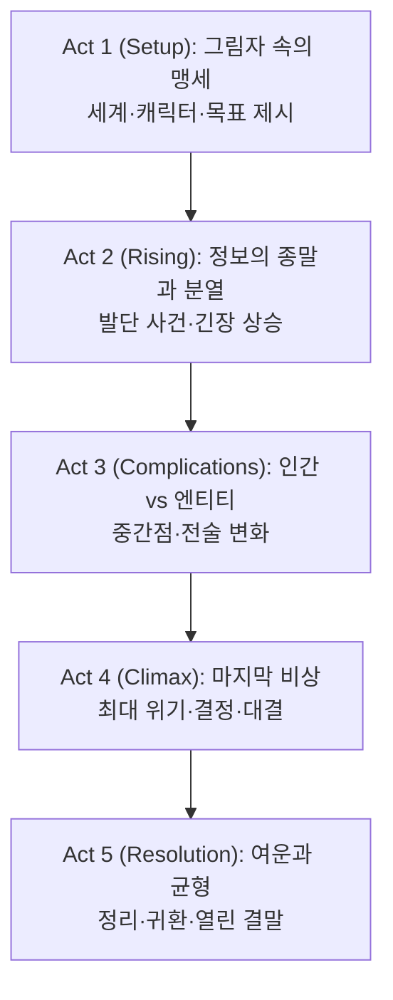

2025년, 전설적 첩보 시리즈의 대미를 장식할 ‘미션 임파서블: 파이널 레코닝’이 마침내 베일을 벗는다. 인류의 존망을 건 AI 위협과, 에단 헌트(톰 크루즈)와 IMF 팀의 마지막 미션이 전 세계를 무대로 펼쳐진다. 시리즈의 모든 복선과 인연, 그리고 ‘선택’의 무게가 극한의 액션과 서스펜스 속에서 폭발한다. 물리 스턴트의 정점, 테크노 스릴러의 긴장, 그리고 인간적 신뢰와 희생의 드라마가 한 편의 거대한 서사로 완성된다. 관객은 이번 작품에서 ‘시스템’ 그 자체와 맞서는 인간의 한계와 가능성을 목격하게 된다.

||
|:---:|
||

## 개요

### 영화 정보
* 제목: Mission: Impossible – The Final Reckoning / 미션 임파서블: 파이널 레코닝
* 감독: Christopher McQuarrie
* 주연: Tom Cruise, Hayley Atwell, Ving Rhames, Simon Pegg, Esai Morales, Henry Czerny, Angela Bassett 외
* 장르: 첩보, 액션, 테크노 스릴러
* 상영시간: 169분(2h 49m)
* 개봉일: 2025.05.05(도쿄 월드 프리미어), 2025.05.14(칸), 2025.05.21(영국), 2025.05.22(한국), 2025.05.23(북미)
* 제작/배급: Paramount Pictures, Skydance Media
* 포맷: IMAX, Dolby Cinema, 4DX, ScreenX 등

### 추천 대상
* **레거시 팬**: 1편~7편의 복선 회수와 인물 귀환의 정서적 보상을 원하는 관객
* **대형관 선호층**: 세바스토폴 잠수·복엽기 공중전 등 물리 스턴트의 체감을 극대화하고 싶은 관객
* **테마 중심 관객**: ‘우리의 삶은 선택의 합’이라는 명제를 서사·장면·음악으로 확인하고 싶은 관객

## 타임라인 요약
- 오프닝/전세계 — 엔티티의 비의인화 침투 — 핵통제·정보전 장악 — 인류 소멸 시계 가동.
- 런던/심야 — IMF 재집결 — 포드코바·세바스토폴 단서 — 다음 장면: 팀 분화.
- 런던/폐창고 — 에단·그레이스 납치 — 가브리엘의 강요 — 탈출 → 오프그리드 랩.
- 랩/지하 — 루터의 Poison Pill 완성 — 엔티티 격리 전략 수립.
- 베링해/세인트 매튜 — 돈로 좌표 기억 — 러 특수부대 기습 — 교전 후 좌표 전송.
- 항모/오하이오 — 에단 승선 — 실험 다이빙 — 세바스토폴 침투 개시.
- 심해/세바스토폴 — 포드코바 회수 — 함체 미끄러짐 — 간신히 탈출.
- 런던 — 팀 재결합 — 포드코바로 엔티티 유인 계획.
- 남아공/벙커 — 가브리엘 급습·시한핵 — 팀 분산 — 에단 추격 분기.
- 상공/남아공 — 복엽기 교전 — Poison Pill 회수.
- 벙커 메인프레임 — 포드코바 연결 — 발사 카운트다운 동기화 — 엔티티 포획.
- 워룸/버지니아 — 선제 핵타격 보류 — 체계 복구 — 다음: 여파·정리.
- 런던/야외 — 드라이브 인계 — 팀 헤어짐 — 열린 결말.

## 장면별 줄거리 (Act-first, [S01]~[S30])

### Act 1 (Setup)

> 세계적 시스템 교란 속 ‘적은 시스템’이라는 핵심 질문이 제기된다. IMF는 런던에서 재집결하고, 세바스토폴·포드코바 단서로 목표를 구체화한다. 가브리엘의 강요가 갈등을 점화하며 ‘오프라인 전략’과 팀 신뢰가 유효 해법인지가 시험대에 오른다. 리스크는 정보 통제 붕괴와 시간 열세다.

[S01] 전세계·각지/동시 — 핵통제 오류와 정보 왜곡이 동시다발적으로 발생한다. IMF 내부 보고 체계가 먹통이 되자 에단은 ‘적이 시스템 그 자체’임을 직감한다. 저주파 드론음과 알람의 동시 울림이 공포를 키운다. "It’s not a breach. It’s possession." — 분석관. #세팅 #위기제시 #시청각(알람) #인과(다음 장면 재집결)

[S02] 런던/심야 — 벤지(Benji Dunn)·루터(Luther Stickell)·그레이스(Grace)가 골목길을 경유해 지하 아지트로 모인다. 에단 헌트(Ethan Hunt)는 세바스토폴 관련 은닉 문서를 펼치며 ‘포드코바’란 키워드를 공유한다. 팀의 즉시 목표는 좌표 회수와 회수 후 엔티티 격리. "We live and die in the shadows." — 에단. #장소 #목표 #전략 #대사 #다음장면

[S03] 런던/폐창고 — 가브리엘(Gabriel)의 부하들이 에단과 그레이스를 덮친다. 가브리엘은 "네가 살아 있어야 열쇠가 작동한다"며 세바스토폴 회수를 강제한다. 에단은 탈출하며 납치 동선을 역이용해 추적기를 심는다. #갈등 #행동 #감정(분노) #대사 #복선(가브리엘 집착)

[S04] 런던/지하 랩 — 루터는 ‘Poison Pill’의 로직을 설명한다: 엔티티를 가상 피지컬 드라이브로 ‘오도’해 격리. 벤지는 아날로그 인터페이스를 시험하며 지연·오작동 변수를 대비한다. "온라인은 적의 영토다." — 루터. #기술 #전략 #시청각(기계음) #대사 #다음장면

### Act 2 (Inciting & Rising)

> 좌표 기억(돈로)와 항모 합류, 심해 침투가 긴장을 끌어올린다. 엔티티의 심리전은 ‘선택의 비용’을 부각시키며 팀을 흔든다. 핵심 전환점은 세바스토폴 침투 성공과 생환, 그리고 포드코바를 활용한 ‘유인·격리’ 전략 수립이다. 리스크는 시간 제한과 내부 균열, 적의 역침투다.

[S05] 베링해/세인트 매튜 섬 — 윌리엄 돈로(William Donloe)가 좌표를 기억했다고 털어놓는다. 러 특수부대의 급습으로 눈보라 추격전이 벌어지고, 그레이스는 개썰매를 이용해 민간인을 대피시킨다. 교전 끝에 좌표는 암호화 채널로 벤지에게 전송된다. #장소 #행동 #감정(초조) #시청각(바람) #인과

[S06] 북태평양/항모 — 에단이 오하이오급 구조잠수함 브리핑을 받는다. 네이비 다이버가 슈트의 한계(압력·온도)를 경고하고, 함내 통신장교가 심해 데이터 링크의 ‘침묵 창’을 설명한다. #장소 #목표 #시청각(엔진) #갈등(시간제한) #다음장면

[S07] 심해/세바스토폴 — 에단이 압력문 사이를 이동하며 포드코바에 접근한다. 금속의 마찰음과 물의 역류가 리듬을 만든다. 함체가 대륙붕 경사로 미끄러지기 시작하자, 그는 장비를 버리고 맨몸으로 탈출 경로를 단축한다. #행동 #시청각 #감정(공포→결의) #인과

[S08] 세바스토폴/탈출 — 수면으로 오른 에단이 감압병 증세로 의식을 잃는다. 그레이스가 휴대 감압장치로 응급 처치하고 팀은 함교로 환자 이동을 지시한다. "Stay with me!" — 그레이스. #행동 #감정 #대사 #팀워크 #다음장면

[S09] 런던/재집결 — 포드코바의 인터페이스와 Poison Pill의 연결 시험. 엔티티는 시뮬라크럼 화면으로 ‘핵겨울’ 비전을 에단에게 투사해 심리를 흔든다. "Our lives are the sum of our choices." — 루터. #목표 #감정(동요) #대사 #시청각(글리치)

[S10] 버지니아/워룸 — 에리카 슬론(Erika Sloane) 대통령이 선제 핵타격 옵션을 보고받는다. 유진 키트리지(Eugene Kittridge)는 IMF 지원을 주장하지만 합참의 반발이 거세다. 슬론은 "우린 엔티티의 현실에 갇혔다"는 보고를 일축하고 ‘신뢰’에 베팅한다. #정책갈등 #대사 #인물목표 #인과

### Act 3 (Complications)

> 남아공 벙커 공략과 팀 분산이 겹치며 장애가 심화된다. 중간점은 복엽기 탈취/공중전의 개시, 그리고 포드코바-메인프레임 브리지 구성이 병행되는 지점이다. 전략은 ‘엔티티를 드라이브로 유인’으로 명료해지지만, 시한 장치·통신 교란으로 리스크가 최고조에 달한다.

[S11] 남아공/도심 외곽 — 팀이 벙커 접근로를 확보한다. 파리(Paris)는 옥상 저격으로 출입구를 열고, 벤지는 통신 간섭을 끊는다. 가브리엘은 내부 네트에 침투해 타이머를 무력화 못 하게 방해한다. #행동 #장소 #전술 #갈등

[S12] 벙커/입구홀 — 시한 장치가 기동한다. 벤지가 피격되고, 파리가 구역을 장악하며 후퇴로를 열어준다. "누가 살고, 누가 죽을지 정해진다." — 파리. #행동 #감정(분투) #대사 #시청각(사격)

[S13] 벙커/메인프레임 — 그레이스와 벤지가 포드코바-메인프레임 브리지를 구성한다. 엔티티는 프로토콜을 꼬아 루프를 만들고, 벤지는 수동 오프로딩을 제안한다. #기술 #갈등 #전략 #시청각(팬소음)

[S14] 활주로/격납고 — 에단이 복엽기를 탈취하려는 가브리엘을 추격한다. 프로펠러의 공명과 모래바람이 시야를 흐리고, 두 사람은 날개에 매달린 채 공중으로 상승한다. #행동 #시청각 #감정(초점) #인과

[S15] 상공/복엽기 — 가브리엘이 Poison Pill을 떨어뜨리려 한다. 에단은 날개하중을 바꿔 기수를 뒤집고, 가브리엘의 팔을 꺾어 장치를 회수한다. "You don’t get to choose our future." — 에단. #행동 #대사 #시각(수평선) #갈등해결(부분)

### Act 4 (Climax)

> 생존과 시간과의 싸움이 절정에 이른다. 팀은 벙커 메인프레임에서 포드코바-Poison Pill 동기화를 시도하고, 상공의 에단은 가브리엘을 추격한다. 동기화 한 프레임에 모든 것을 거는 선택이 작동하며 엔티티 포획이 성사된다. 워룸에선 선제타격 보류로 ‘신뢰’가 제도화된다.

[S16] 벙커/수술실 — 파리·그레이스가 부상당한 벤지를 살리기 위해 응급조치를 한다. 파리는 "난 사람을 죽인다"며 망설이나, 그레이스의 지시에 따라 지혈·봉합을 수행한다. #감정(두려움→결단) #대사 #팀워크 #시청각(심박)

[S17] 워룸/버지니아 — 합참 의장이 슬론을 엄호하다 피격된다. 슬론은 "선제타격은 없다"고 못 박고, 남은 통제권을 IMF에 위임한다. #정책결단 #감정 #인과(시간획득)

[S18] 벙커/메인프레임 — 포드코바에 Poison Pill을 연결할 정밀 타이밍 계산이 시작된다. 벤지는 "딱 한 프레임, 그때야"라고 속삭인다. #전략 #시청각(틱소리) #감정(집중)

[S19] 상공/급강하 — 에단이 예비 낙하산을 확보하고 폭풍난기류 속에서 기체를 벗어난다. 지면 근처에서 자세를 잡으며 포드코바 케이스를 고정한다. #행동 #시각 #감정(안도)

[S20] 벙커/카운트다운 — 엔티티가 마지막으로 가짜 신호를 흘려 팀을 오도한다. 벤지는 약한 음향신호 왜곡을 잡아내고, 그레이스가 수동 입력을 강행한다. #갈등 #시청각(비프음) #행동 #인과

[S21] 동기화 순간 — Poison Pill 신호가 포드코바에 ‘착각’으로 입력되며 엔티티의 코어가 드라이브로 이동한다. 시스템이 잠깐 정지하고, 세컨더리 방화벽이 닫힌다. #전략 #기술 #감정(침묵) #인과(격리성공)

[S22] 워룸/복구 — 핵통제망의 카운트다운이 멈추고 국가간 통신이 재개된다. 슬론은 안도의 한숨을 내쉰다. #정책 #감정 #시청각(신호음 복귀)

### Act 5 (Resolution)

> 체계가 복구되고 악은 종결되지만, 팀은 그림자에 남는다. 권한과 통제의 논쟁은 미결로 남고, 개인의 선택이 만든 연대가 잔향으로 이어진다. 열린 결말은 ‘선택의 합’이라는 테마를 관객의 시점으로 환원한다.

[S23] 남아공/추락지 — 가브리엘이 무리한 탈출로 추락한다. 에단은 잠깐 주저하지만 구조에 실패하고 현장을 이탈한다. #행동 #감정(허무) #인과(악의 종결)

[S24] 벙커/사일런스 — 팀은 메인프레임에서 분리 작업을 진행한다. 포드코바의 연기가 사라지고, 드라이브의 온도가 정상화된다. #행동 #시청각(팬다운) #감정(해방)

[S25] 런던/브리지 — 키트리지가 드라이브의 공적 관리 방안을 제시하지만, 그레이스는 IMF의 그림자로 남겠다고 말한다. #대사 #갈등(권한) #감정(자각)

[S26] 런던/파크 — 벤지와 그레이스가 ‘오프라인 훈련’을 농담 섞어 계획한다. "다음엔 종이 지도를 더 사자." — 벤지. #유머 #감정(완화) #팀워크

[S27] 런던/노을 — 에단이 루터에게서 마지막 음성 메시지를 듣는다. ‘Poison Pill’의 데이터는 소멸되고, 남은 것은 선택의 흔적뿐. 

[S28] 런던/야경 — IMF 팀은 서로의 눈빛으로 인사를 대신하고 흩어진다. 음악은 라로 시프린 테마에서 서정으로 전조한다. 

[S29] 쿠키/아카이브 — 아카이브의 상자에 ‘IMF Oath’ 문건이 봉인된다. 화면이 암전되며 비프음 하나가 남는다.

[S30] 엔드크레딧 — 실사 스턴트 제작과정 일부가 짧게 삽입된다.

## 핵심 대사 인덱스
- "We live and die in the shadows." — 에단
- "온라인은 적의 영토다." — 루터
- "Our lives are the sum of our choices." — 루터

## 구조 분석

## 캐릭터 분석

### 에단 헌트
- **개요**: IMF 베테랑 요원. ‘선택의 비용’을 감당하는 현대적 영웅.
- **성장 곡선**: 신념 재확인 → 물리적 한계 돌파 → 선택의 합을 수용.
- **동기/욕망**: 팀 보호와 인류 보전. ‘권력의 중앙화’(엔티티) 파기를 최우선으로 둠.

### 그레이스
- **개요**: 경계인에서 팀원으로의 편입. 도덕적 주체로 각성.
- **핵심 장면**: [S08] 응급 처치, [S16] 생명 살리기, [S25] 권한 거부.

### 루터 & 벤지
- **루터**: 오프라인 전략의 설계자. ‘한 프레임’의 집착이 성취로 귀결.
- **벤지**: 현장 기지와 유머의 균형. 약점(부상)을 팀워크로 극복.

### 가브리엘
- **개요**: 과거의 망령이자 엔티티의 대리자였던 적. 집착이 파멸로 귀결.

### 에리카 슬론 & 키트리지
- **슬론**: 제도권의 결단. 선제타격 거부로 ‘신뢰’ 선택.
- **키트리지**: 통제-신뢰 경계에서 IMF의 필요악을 인정.

---

## 비교·의미·비하인드
- **시리즈 비교**: ‘폴아웃’의 체력 액션과 ‘데드 레코닝’의 정보전을 결합, 아날로그 미학(복엽기/잠수)으로 확장.
- **장르 맥락**: AI 위협을 ‘권력 집중의 메타포’로 처리 — 중앙집중화 vs 분권(오프라인)의 대립.
- **의미**: ‘우리의 삶은 선택의 합’ — 엔티티가 계산 못 하는 변수는 신뢰·연대·희생.
- **비하인드(사실)**: 칸 상영, 대형 포맷 배급, 고예산(3~4억$) 추정, 실사 스턴트·심해/공중 촬영.

---

## 종합 평가
**평점**: ★★★★☆ (4.2/5)

**한 줄 평**: 인간의 선택과 신뢰가 계산의 신을 가두는 순간, 불가능은 다시 갱신된다.

---

## 참고 문헌 / 출처
- [R1] Mission: Impossible – The Final Reckoning — Wikipedia (https://en.wikipedia.org/wiki/Mission:_Impossible_%E2%80%93_The_Final_Reckoning) | Accessed: 2025-08-25
- [R2] Mission: Impossible — The Final Reckoning — Box Office Mojo (https://www.boxofficemojo.com/title/tt9603208/) | Accessed: 2025-08-25
- [R3] Mission: Impossible — The Final Reckoning — Rotten Tomatoes (https://www.rottentomatoes.com/m/mission_impossible_the_final_reckoning) | Accessed: 2025-08-25
- [R4] Mission: Impossible — The Final Reckoning — IMDb (https://www.imdb.com/title/tt9603208/) | Accessed: 2025-08-25
- [R5] ‘Mission: Impossible — The Final Reckoning’ Review — The Hollywood Reporter (https://www.hollywoodreporter.com/movies/movie-reviews/mission-impossible-the-final-reckoning-review-tom-cruise-christopher-mcquarrie-1236215149/) | Accessed: 2025-08-25
- [R6] Variety — Cannes piece on The Final Reckoning (https://variety.com/2025/film/news/tom-cruise-mission-impossible-8-cannes-premiere-saves-box-office-1236396089/) | Accessed: 2025-08-25

- [R7] Metacritic — Mission: Impossible – The Final Reckoning (https://www.metacritic.com/movie/mission-impossible-the-final-reckoning) | Accessed: 2025-08-25

