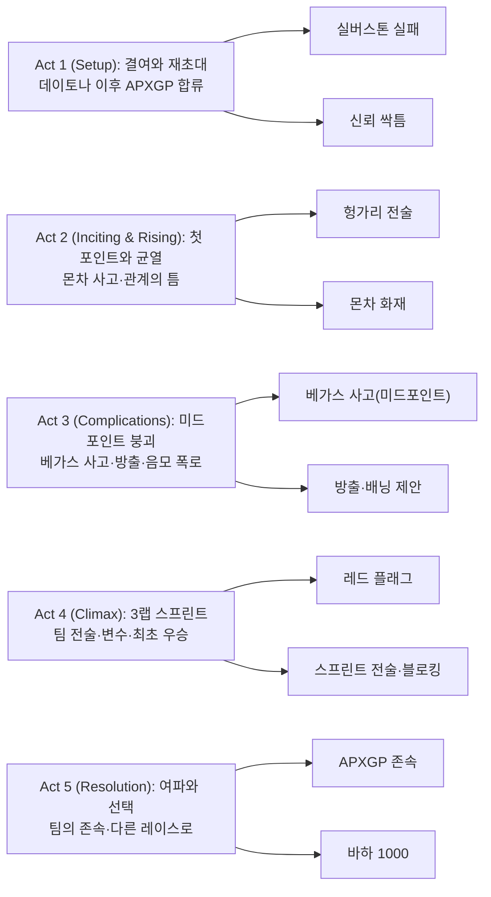

영화 제목과 기본 정보를 소개하고, 독자의 관심을 끌 수 있는 흥미로운 문장으로 시작한다. 조셉 코신스키가 항공에서 트랙으로 매체를 바꿨을 때 가장 먼저 바꾼 것은 카메라의 호흡이었다. 이 영화는 속도보다 압력, 직선보다 접지, 광란보다 인과를 가까이서 듣게 만든다.

||
|:---:|
||

## 개요

### 영화 정보
* 제목: F1 the Movie / F1 더 무비
* 감독: 조셉 코신스키 (Joseph Kosinski)
* 주연: 브래드 피트, 댐슨 이드리스, 케리 콘돈, 하비에르 바르뎀, 토비아스 멘지스
* 장르: 스포츠 드라마, 액션
* 상영시간: 155–156분(출처별 상이)
* 개봉일: 2025.06.27(미국) / 2025.06.25(국제)

### 추천 대상
* **레이싱 팬**: 실제 그랑프리 주말 촬영과 그리드 접근으로 체감 속도·현장감 극대화
* **사운드·영상덕후**: 초소형 온보드 카메라, IMAX 최적화와 하이브리드 스코어 체험
* **서사 중심 관객**: 노년/루키 듀오, 팀의 생존과 구원, 경쟁과 협력의 역학을 입체적으로 탐구

## 줄거리

### Act 1 (Setup)

- [S01] 바르셀로나·1993 오후 — 커리어를 멈춘 충돌의 기억
  소니 헤이즈는 스페인 GP에서 고속 코너를 통과하다가 차량 밸런스를 잃고 대파한다. 그는 "난 더 잘할 수 있었어"라는 죄책감을 오래 붙든다. 피트레인 사이렌과 연기, 금속 마찰음이 과거를 현재로 끌어온다. 이 장면은 소니의 결여(미완)를 명확히 하고, 훗날의 구원 동인을 심는다.
- [S02] 데이토나·새벽 — 클래스 우승과 초대장
  수십 년 후, 소니는 데이토나 24시에서 클래스 우승으로 생계형 드라이버로서의 면모를 증명한다. 경기 뒤 루벤 세르반테스가 다가와 APXGP에 복귀할 것을 제안하며 "베스트 인 더 월드"를 입증하자고 부추긴다. 관중의 함성과 파워유닛의 저주파가 뒤섞여 새로운 장의 개막을 알린다. 소니는 망설이지만, 스스로를 증명할 무대를 떠올린다.
- [S03] APXGP 공장·낮 — 붕괴 직전의 팀
  소니는 노후 설비와 인력난으로 허덕이는 APXGP를 둘러본다. 기술 디렉터 케이트 맥케나는 자원 빈곤 속에서도 데이터로 문제를 짚어내며 소니의 감각을 신뢰하려 한다. 소니는 머신과 팀의 결핍을 즉각 진단하고, 단기 전술 vs 중기 개발의 균형을 제안한다. 이 만남은 팀 케미스트리의 씨앗이 된다.
- [S04] 브리티시 GP 그리드·정오 — 루키와의 첫 호흡
  소니는 루키 조슈아 피어스를 만난다. 조슈아는 APXGP의 미래보다 자신의 커리어 점프에 더 민감하며 협업을 꺼린다. 스타팅 그리드의 열기와 헬멧 내부 호흡음이 긴장을 배가한다. 둘은 같은 목표(생존)로 다른 전략을 품은 채 출발한다.
- [S05] 실버스톤·레이스 — 팀워크의 부재
  소니와 조슈아는 서로에게 정보를 숨기고, 코스에서 서로를 방해하는 선택을 한다. 결국 두 대 모두 사고로 리타이어. 무전에는 씁쓸한 침묵만 흐른다. 이 실패는 협업 없이는 포인트조차 불가능하다는 명확한 교훈을 남긴다.
- [S06] 피트월·해질녘 — 규칙을 이해하는 눈
  소니는 현대 F1의 장비와 규정에 적응하려 기록과 데이터를 파고든다. 그는 변칙적 타이밍의 피트콜과 SC(세이프티카) 트리거 가능성을 짚는다. 케이트는 그의 ‘규칙 읽기’를 기술적으로 뒷받침하겠다고 약속한다. 둘 사이 신뢰의 싹이 튼다.
- [S07] 시뮬레이터 룸·밤 — 손끝의 기억
  소니는 시뮬레이터에서 코너 진입 브레이크 포스를 2%씩 바꿔보며 옛 감각을 되찾는다. "그 순간엔, 내가 untouchable이었지"라는 독백이 스피커의 저음을 타고 울린다. 감정선은 자신감과 공포 사이를 오간다. 다음 레이스에 대한 작은 확신이 생긴다.
- [S08] 패독·새벽 — 조건과 약속
  루벤은 9전 내 1승을 못 하면 팀이 팔린다고 고백한다. 소니는 팀 우선 전술을 조슈아에게 설득하겠다고 약속한다. 이 약속은 이후 갈등과 화해의 기준선이 된다.

### Act 2 (Inciting & Rising)

- [S09] 헝가로링·구름 낀 오후 — 첫 포인트의 설계
  소니는 중위권 혼전에서 SC를 유발할 수 있는 상황을 읽어내며 타이밍을 조작한다. 팀은 그 틈을 타 조슈아를 상위권으로 끌어올린다. 피트월의 박수와 함께 APXGP는 시즌 첫 포인트를 획득. 소니는 팀을 위해 자신의 결과를 희생하는 선택을 학습한다.
- [S10] 팀 모터홈·저녁 — 균열과 비교
  언론은 포인트를 조슈아 덕으로만 보도한다. 소니는 표정 없이 받아들이지만, 안쪽에서는 서늘한 허무가 차오른다. 케이트는 “당신의 해석이 없었다면 불가능했다”고 조용히 말한다. 이 위로는 두 사람의 정서적 연결을 강화한다.
- [S11] 몬차·우중 레이스 — 스LICK 도박
  소니는 빗방울 속에서도 슬릭을 고수할 것을 조슈아에게 권한다. 조슈아는 직선에서 해밀턴·르클레르를 추격하며 2위까지 치고 올라간다. 그러나 오버스티어로 트랙을 이탈, 화염이 치솟는다. 소니가 구조대와 함께 달려가 그를 구한다.
- [S12] 병원·새벽 — 트라우마의 재점화
  조슈아는 회복에 시간이 필요하고, 언론과 모친은 소니의 ‘리스크 테이킹’을 비난한다. 소니는 1993년의 플래시백을 억누르며 스스로를 다그친다. 그는 조용히 팀 게시판에 “리턴에 필요한 것은 시간과 신뢰”라고 적는다.
- [S13] 스파·오후 — 돌아온 루키, 뒤틀린 에너지
  조슈아는 조급함 속에 소니에게 고의에 가까운 푸시를 가해 충돌을 만든다. 피트월은 혼란에 빠지고, 소니는 팀 라디오에 단호하게 말한다. "우리가 되찾은 건 포인트가 아니라 방법이야." 그 말은 싸늘한 공기를 남긴다.
- [S14] 팀 포커 게임·밤 — 공통분모의 발견
  케이트가 마련한 포커 게임에서 두 사람은 유사한 가정사와 동기를 공유함을 알게 된다. 잠시 웃음이 돌고, 소니와 케이트는 밤을 함께 보낸다. 감정선은 경계에서 친밀로 이동한다. 다음 날의 협력 가능성이 열린다.
- [S15] 공장·아침 — 익명 제보와 강등
  케이트의 바닥(플로어) 업그레이드가 외부 도움을 받았다는 익명 제보가 접수되고, FIA는 임시 제거를 명한다. 팀은 즉각 페이스를 잃는다. 인과의 체인은 치밀하게 끊겼고, 모두가 범인을 의심한다.

### Act 3 (Complications) — Midpoint 포함

- [S16] 라스베이거스 스트립·야간 — 의식의 붕괴
  소니는 ‘의식’처럼 지키던 랜덤 카드 뽑기를 생략한 채, 과감함을 넘어섰다. 전광판과 네온이 흐릿해지는 속도에서 그는 과하게 밀어붙이고 결국 사고를 낸다. 구급차 사이렌과 심박 모니터가 장면의 리듬을 장악한다. 미드포인트: 소니는 한계를 벗어난 선택의 대가를 치른다.
- [S17] APXGP 오피스·심야 — 방출 통보
  루벤은 의사 소견(시력·신경 위험)을 근거로 소니를 방출한다. 소니는 말없이 자리를 정리한다. 책상 위에 남은 건 모서리가 닳은 세 장의 카드. 감정선은 무력과 체념으로 가라앉는다.
- [S18] 주차장·새벽 — 유혹의 제안
  이사회 멤버 피터 배닝이 다가와 팀 매각 시 단장 자리를 약속하며 실패를 방조하라고 제안한다. 그는 익명 제보와 영입 공작이 자신이 꾸민 판이었다고 고백한다. 소니의 분노는 무음의 진동처럼 번진다. 이 제안은 클라이맥스를 향한 윤리적 선택의 축을 만든다.
- [S19] FIA 브리핑룸·오전 — 무혐의 & 복원
  FIA는 케이트의 개발이 규정을 위반하지 않았다고 결론내리고 업그레이드를 복원한다. 팀은 한숨 돌리지만, 소니가 없다. 조슈아는 스스로 인정한다. “그때의 사고는 내 선택이었어.”
- [S20] APXGP 피트·정오 — 복귀 청원
  소니는 흐릿한 시야와 두통을 숨긴 채 루벤에게 마지막 기회를 청한다. 케이트는 그를 똑바로 바라본다. “당신이 왜 달리는지, 이번엔 나도 안다.” 팀은 소니를 다시 태운다.
- [S21] 야스 마리나·그리드 — 마지막 카드
  어스름이 번지는 그리드에서 소니는 주머니에서 카드를 뽑아 시야 앞에 세운다. 그것은 조용한 의식의 회복이다. 그는 조슈아에게 무전한다. “우리는 같이 간다. 먼저 너를 올리고, 난 막는다.”
- [S22] 레이스 스팅 1 — 페이스 구축
  조슈아는 업그레이드의 효과로 페이스를 끌어올리고, 소니는 더티에어 속에서 추격자들을 커버한다. 관객의 파도와 엔진의 고음이 리듬을 만든다. 미세한 타이어 온도 관리가 다음 전개를 준비한다.

### Act 4 (Climax)

- [S23] 멀티 카 크래시 — 레드 플래그
  중상위권의 접촉 연쇄로 대형 사고가 발생한다. 레이스는 레드 플래그, 모든 차가 피트로 돌아온다. APXGP는 찢어진 플로어와 프론트윙을 정밀 수리한다. 3랩 스프린트가 선언된다.
- [S24] 피트레인·막간 — 결정과 합의
  소니는 조슈아에게 스프린트 시나리오를 전한다. “네가 P1을 잡으면, 내가 뒤를 막는다.” 조슈아는 고개를 끄덕인다. 팀워크의 의미가 겨우 같은 문장으로 합의된다.
- [S25] 리스타트 — 론치 & 블로킹
  재출발에서 조슈아는 슬립스트림을 활용해 선두 다툼에 끼어든다. 소니는 르클레르·해밀턴 라인을 차단하며 팀 전략을 수행한다. 관중은 함성과 야유를 동시에 보낸다. 인과는 단순하다: 한 대를 앞으로 보낸다.
- [S26] 라스트 랩·백스트레이트 — 충돌과 변수
  해밀턴과 조슈아가 휠 투 휠로 교차하며 접촉한다. 조슈아의 차는 자세를 잃고 밖으로 밀려난다. 소니는 즉시 라인을 바꿔 클린하게 빠져나간다. 예상 밖의 창이 열린다.
- [S27] 최종 코너 — 경계 위의 스로틀
  소니는 차의 마지막 그립을 모아 아웃-인-아웃으로 선회를 마치고 전개한다. 라디오에 숨이 섞인 호출이 터진다. "너의 레이스다, 소니!" 관중석의 플래시가 연속 스틸컷처럼 반짝인다.
- [S28] 체커드 — 첫 F1 우승(클라이맥스)
  체커기가 흔들리고, 전광판에 APXGP의 1위가 새겨진다. 소니는 조용히 핸들을 쥔 채 호흡을 고른다. "증명됐지." 그의 눈엔 과거의 잔상이 아니라 현재의 트랙만 비친다.

### Act 5 (Resolution)

- [S29] 파크 페르메 — 팀의 포옹
  팀원들이 차를 에워싸 안고 서로를 끌어안는다. 조슈아는 자신의 실수를 인정하고 소니에게 고개 숙여 축하한다. 케이트는 글러브 낀 손으로 소니의 헬멧을 두드린다. 음악은 오케스트라와 전자 리드가 교차하며 따뜻하게 수렴한다.
- [S30] 패독 브리핑 — 제안과 거절
  메르세데스가 조슈아에게 시트를 제안하지만, 그는 APXGP를 택한다. “여기서 배운 걸 끝까지 하고 싶어요.” 팀의 존속과 아이덴티티가 굳어진다.
- [S31] 공항 활주로 — 고요한 이별
  소니는 인파를 피해 조용히 떠날 채비를 한다. 케이트는 “다음엔 모래(사막)에서 보자”고 농담하며 미소 짓는다. 둘은 말보다 긴 눈인사를 나눈다.
- [S32] 바하 1000 스타트라인 — 다른 속도의 시작(엔딩)
  사막의 아침 햇살이 차체를 스친다. 누군가 묻는다. "무엇을 위해 달려요?" 소니는 웃으며 시동을 건다. 응답은 엔진의 포효다.

### 핵심 대사 인덱스

"Best in the world." — 루벤, [S02]; 동기 부여

"우리는 같이 간다." — 소니, [S21]; 팀워크

"그 순간엔 내가 untouchable이었지." — 소니, [S07]; 감정·기억

"너의 레이스다, 소니!" — 무전, [S27]; 클라이맥스

## 구조 분석(Act-first 보조 도식)

## 캐릭터 분석

### 소니 헤이즈 — 결여에서 구원으로

||
|:---:|
||

- 욕망/목표: ‘증명’의 재정의(개인 승리 → 팀의 생존과 방식)와 과거의 트라우마 극복
- 성장 곡선: 베가스 미드포인트에서 붕괴한 뒤, 윤리적 선택과 팀 전술로 재구성
- 상징: 낡은 카드(의식) — 통제 불능의 속도를 통제 가능한 리듬으로 바꾸는 장치

### 조슈아 피어스 — 루키의 재학습

||
|:---:|
||

- 욕망/목표: 상위팀 이적·개인 영광 → 팀 내 신뢰 구축·지속가능한 커리어
- 성장 곡선: 과감함이 무모함으로 기운 순간(몬차·스파)을 지나 책임의 언어를 학습
- 상징: 라디오 침묵에서 라디오 합의로 변하는 음향의 궤적

### 케이트 맥케나 — 기술과 신뢰의 다리

||
|:---:|
||

- 동기: 자원 열세 속 정공법으로 성능을 끌어올리는 엔지니어의 자존
- 역할: 소니의 감각을 수치로 번역, 전술을 머신에 각인시키는 번역자
- 상징: 제거·복원되는 플로어 — 팀의 진실성에 대한 판결문

### 루벤 세르반테스 — 스폰서 시대의 오너

||
|:---:|
||

- 동기: 자본 논리 속 팀 아이덴티티 보존
- 역할: 팀과 사람을 잇는 신뢰의 리더십, 방출 통보의 고통을 감내하는 보호자

### 피터 배닝 — 시스템적 유혹
- 동기: 자산 가치 극대화
- 역할: 결과를 위해 과정을 훼손하는 유혹의 대변자, 윤리적 대비를 강화

## 비교/의미/비하인드
- 비교: 『탑건: 매버릭』이 공중에서 구현한 ‘속도의 내부화’를, 본작은 지면과 타이어, 공기역학의 압력으로 이식한다. 카메라의 위치와 질량이 드라마를 이동시킨다.
- 의미: ‘최고’(best in the world)의 재정의 — 1위의 기록이 아니라, 공동의 선택과 책임의 문법
- 비하인드: 실제 GP 주말 촬영·그리드 접근·초소형 온보드 카메라(아이폰 기반 맞춤형)·IMAX 포맷 최적화는 현장감의 핵심 지분을 차지한다.

## 종합 평가
- 평점: ★★★★☆ (4.5/5)
- 한 줄 평: 속도를 스펙터클이 아닌 인과의 언어로 번역한, 팀 영화의 정석.
- 관람 포맷 추천: IMAX/프리미엄 포맷 권장 — 고주파 엔진음·저역 토크의 체감 우수
- 관람 전 체크: 실존 레이스·드라이버 카메오·규정/전술 용어에 대한 기본 이해가 몰입을 돕는다.

## 참고 문헌 / 출처

- [F1 (film) — Wikipedia](https://en.wikipedia.org/wiki/F1_(film))
- [Box Office Mojo — F1: The Movie](https://www.boxofficemojo.com/release/rl2507374593/)
- [The Numbers — F1: The Movie](https://www.the-numbers.com/movie/F1-The-Movie-(2025)#tab=summary)
- [Apple TV+ Press — Trailer PR](https://www.apple.com/tv-pr/news/2025/03/apple-original-films-unveils-the-f1-movie-trailer/)
- [Formula1.com — Information page](https://www.formula1.com/en/page/apple-original-films-f1-movie)
- [Warner Bros. — Official movie page](https://www.warnerbros.com/movies/f1)
- [Variety — Box Office](https://variety.com/2025/film/box-office/brad-pitt-f1-movie-box-office-record-apple-megan-2-flops-1236443608/)
- [Rotten Tomatoes/Metacritic index pages](https://www.rottentomatoes.com/)
