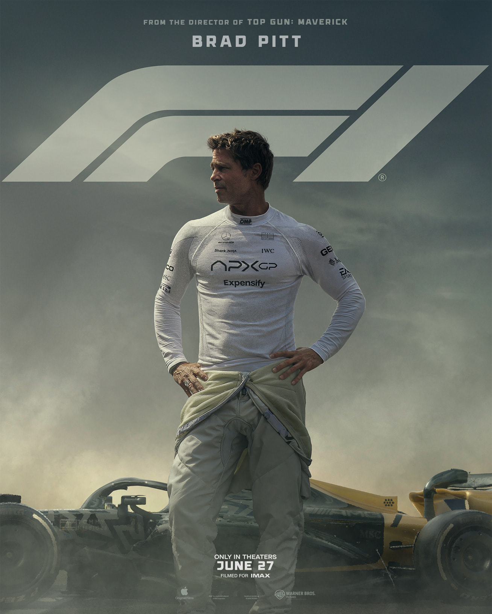
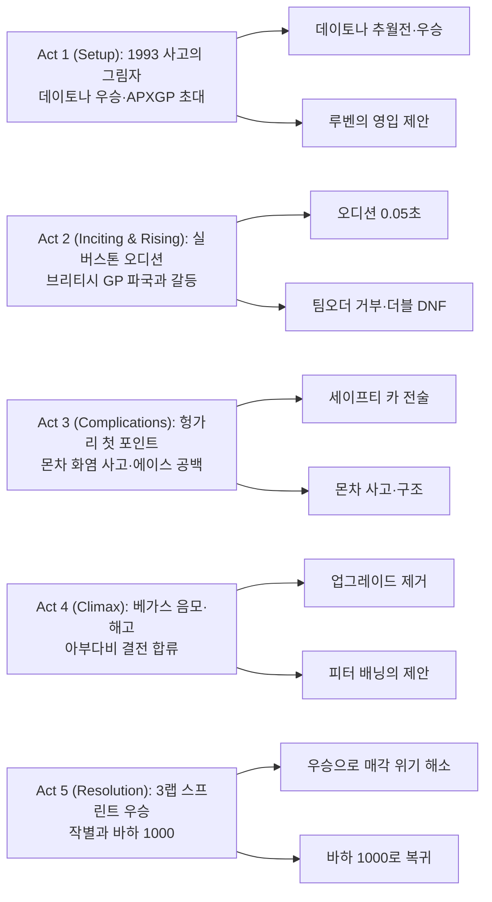
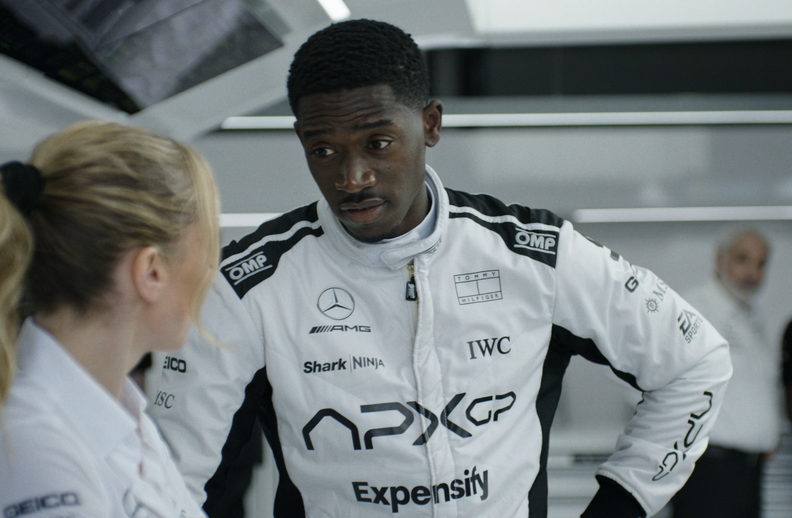
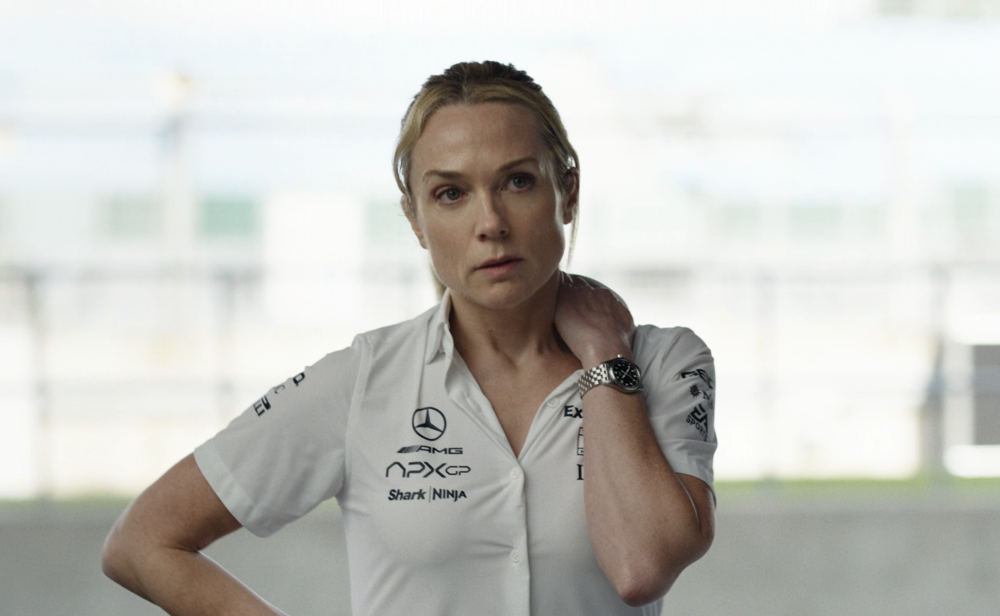
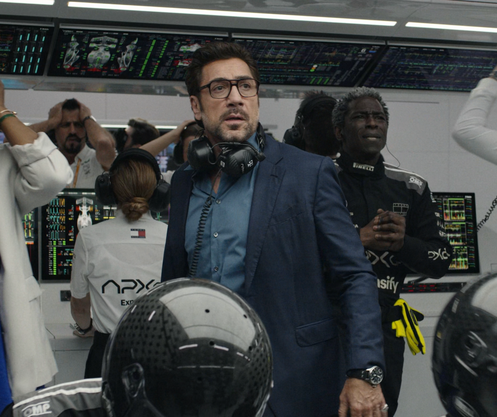

『F1 더 무비』는 1993년의 사고로 F1에서 사라진 베테랑 소니 헤이즈가 무포인트 팀 APXGP에 합류해, 루키 조슈아와 부딪히며 다시 ‘승리의 방식’을 배우는 레이싱 드라마다. 조셉 코신스키는 온보드 시점과 피트월의 긴장감을 교차 편집해 속도를 ‘감각’이 아닌 ‘의사결정’으로 보이게 만든다.

## 개요

### 영화 정보
* 제목: F1 the Movie / F1 더 무비
* 감독: 조셉 코신스키 (Joseph Kosinski)
* 주연: 브래드 피트, 댐슨 이드리스, 케리 콘돈, 하비에르 바르뎀, 토비아스 멘지스
* 장르: 스포츠 드라마, 액션
* 상영시간: 155–156분(출처별 상이)
* 개봉일: 2025.06.27(미국) / 2025.06.25(국제)

### 추천 대상
* **레이싱 팬**: 실제 그랑프리 주말 촬영과 그리드 접근으로 체감 속도·현장감 극대화
* **사운드·영상덕후**: 초소형 온보드 카메라, IMAX 최적화와 하이브리드 스코어 체험
* **서사 중심 관객**: 노년/루키 듀오, 팀의 생존과 구원, 경쟁과 협력의 역학을 입체적으로 탐구

## 줄거리

### Act 1 (Setup) — 데이토나: “새로운 드라이버가 필요해”

- [S01] 1993 스페인 그랑프리·오후 — 헬멧캠과 암전

  팀 로터스의 소니 헤이즈는 고속 코너에서 바깥쪽 라인을 크게 쓰며 선두를 노리지만, 갑자기 그립을 잃고 방호벽에 충돌한다. 화면이 암전되며 ‘멈춘 커리어’의 기원이 박힌다.
- [S02] 2023 데이토나 24시·한밤 — “브레이크 때문에 징징대고 있대”

  칩 하트 레이싱의 미캐닉이 밴에서 자던 소니를 깨운다. 소니는 아웃랩부터 경쟁자들을 정리하며 96번 BMW를 집요하게 몰아붙이고, 르망 시케인 직전 브레이킹 승부로 극적인 추월을 만든다.
- [S03] 데이토나·동틀 무렵 — 클래스 우승과 ‘계약 거절’

  세 번의 스틴트를 마친 소니는 선두를 지키고 피트인한다. 팀은 우승을 확정하지만, 칩의 정식 계약 제안을 소니는 거절하고 우승 보너스 수표만 챙겨 떠난다. 그의 목표는 다음 레이스(바하 1000)다.
- [S04] 코인 세탁소·낮 — 오랜 친구의 초대

  로터스 시절 팀메이트였던 루벤 세르반테스가 나타나 APXGP의 현실(3시즌 가까이 노포인트, 매각 위기)을 털어놓는다. “새로운 이사회가 필요하겠네.”라는 농담 뒤, 루벤은 본론을 던진다. “새로운 드라이버가 필요해.”
- [S05] 식당·저녁 — “돈이 중요한 게 아니에요 / 그럼 뭐가 중요한데요?”

  루벤은 런던행 티켓까지 놓고 설득하지만 소니는 망설인다. 소니는 웨이트리스에게 ‘상상도 못 할 제안’을 받으면 어떻게 할지 묻고, 돌아온 “그럼 뭐가 중요한데요?”라는 답에 미소를 짓는다. 그는 다시 F1에 발을 들일 준비를 한다.

### Act 2 (Inciting & Rising) — 실버스톤: “오디션”과 첫 레이스의 파국

- [S06] 실버스톤·낮 — APXGP의 루키, 조슈아 피어스

  업그레이드 테스트로 분주한 개러지. 루키 조슈아는 차의 언더/오버스티어를 두고 케이트 맥케나를 몰아붙이고, 팀 프린시펄 카스파는 위기의 팀을 다잡으려 한다. 그때 소니가 나타난다.
- [S07] 실버스톤·오디션 — “JP보다 1초 느리면 떠난다”

  소니는 30년 만에 F1 머신에 올라 스핀하고, 다시 플라잉 랩을 시작한다. 섹터에서 뒤처지지만 스토(15번)에서 늦은 브레이킹으로 추격한다. 마지막 코너에서 스핀해 방호벽에 박지만, 피니시라인을 기준보다 0.05초 ‘일찍’ 통과해 합격한다.
- [S08] 브리티시 그랑프리·그리드 — ‘일부러 늦은 출발’

  최후미 그리드의 소니는 포메이션 랩에서 출발을 늦춰 간격을 만든 뒤 텅 빈 트랙에서 타이어를 데워 이득을 본다. 다른 드라이버는 그가 복귀할 때까지 기다리며 타이어 온도가 떨어진다.
- [S09] 브리티시 그랑프리·레이스 — 피트의 참사, 팀오더 거부, 더블 DNF

  소니는 초반 8그리드를 올리고 페레스를 추월하지만, 피트스탑에서 휠건·잭 문제로 팀이 무너진다. 전략팀은 포지션 스왑을 지시하지만 소니는 거부하고, 둘의 경쟁은 타이어 접촉으로 이어져 두 대 모두 스핀, 더블 DNF로 끝난다.
- [S10] 개러지·경기 후 — 최악의 팀워크에서 ‘전투형’ 요구

  조슈아는 소니와 충돌하며 언쟁을 벌이고, 루벤은 매각 위기 속에서 폭발한다. 소니는 케이트에게 차를 더 “전투형”으로 설계해달라고 요구하고, 케이트는 “완주하면 생각해보겠다”고 선을 긋는다.

### Act 3 (Complications) — 헝가로링~몬차: 첫 포인트, 그리고 화염 사고

- [S11] 헝가로링·결승 — 규정의 빈틈을 ‘팀을 위해’ 쓰다

  소니는 피트스탑에서 타이어 고집으로 시간을 끌고, 상황을 읽어 세이프티 카를 끌어내며 레이스 흐름을 흔든다. 소니는 최하위로 밀리지만 조슈아가 10위로 들어오며 APXGP는 시즌 첫 포인트를 얻는다. 케이트는 소니의 잠재력을 인정하고 업그레이드 계획을 세운다.
- [S12] 몬차·결승 — VSC를 만든 ‘그래블’과 방어전

  소니는 하위권 페이스를 늦춰 전략 창을 만들고, 피트 진입 직전에 ‘안 들어간다’며 트랙을 더 돌다가 그래블을 밟아 타이어를 손상시켜 트랙에 자갈을 뿌린다. 버츄얼 세이프티 카가 발동되고, 소니는 피트아웃 후 베르스타펜을 붙잡아 조슈아를 P4까지 끌어올린다.
- [S13] 몬차·우중 후반 — 무리한 추월, 화염, 구조

  비가 내리자 조슈아는 ‘소니라면 슬릭’이라며 속행을 선택한다. 소니는 블루 플래그 상황을 이용해 갭을 줄여주지만, 조슈아는 직선에서 기다리라는 지시를 무시하고 무리하다가 충돌·화염 사고를 낸다. 소니는 달려가 조슈아를 구조하고, 조슈아는 큰 부상으로 최소 3경기 결장한다.
- [S14] 네덜란드~일본~멕시코시티 — 에이스 공백을 버티는 소니

  소니는 팀의 얼굴로 미디어에 서고, 케이트의 업그레이드가 적용된 머신으로 포인트를 쌓아 신뢰를 회복한다. 동시에 그는 1993년 사고의 후유증(시야 흐림·두통)을 숨긴 채 달리며 한계를 느끼기 시작한다.

### Act 4 (Climax) — 벨기에~라스베이거스: 화해, 음모, 해고, 그리고 결전행

- [S15] 복귀 이후·갈등 — “꼴통짓 하지 마 / 꼰대짓 하지 마요”

  복귀한 조슈아는 소니를 밀어 충돌을 만들며 갈등이 재점화된다. 케이트는 라스베이거스 퀄리파잉 후 두 사람을 포커 자리로 불러내고, 텍사스 홀덤으로 서로의 상처와 욕망을 끌어올린다. 소니는 일부러 져주며 ‘우선권’을 조슈아에게 넘긴다.
- [S16] 라스베이거스·심야 — 악몽과 고백

  소니는 1993년의 사고 악몽에 시달리고, “가끔 모든 소리가 사라지고… 아무도 날 못 건드리는 순간”을 기다린다고 케이트에게 고백한다. 둘의 관계는 연인으로 이어진다.
- [S17] FIA 조사·경기 당일 — 업그레이드 제거, 루틴 붕괴, 리타이어

  익명의 제보로 케이트의 업그레이드가 불법 의혹을 받으며 FIA는 부품 제거를 명령한다. 소니는 분노 속에 경기 전 의식(무작위 카드 뽑기)을 건너뛰고, 감정적으로 몰아붙이다 사고로 리타이어한다.
- [S18] 병원/오피스 — 방출과 배신의 제안

  루벤은 소니의 건강 리스크(1993년 부상 후유증)를 확인하고 안전을 이유로 해고한다. 곧바로 피터 배닝은 계약·제보 조작으로 팀 매각을 노렸음을 밝히며, 소니에게 ‘새 팀 운영’과 전략 책임을 제안한다. 소니는 루벤을 모욕하는 피터를 거절하고 아부다비로 향한다.
- [S19] 복구 — 무혐의, 복원, 그리고 각서

  FIA는 제보가 조작된 정보임을 확인해 업그레이드 복구를 허용한다. 소니는 “어떤 사고가 나도 팀에 책임을 묻지 않는다”는 각서를 들고 마지막 레이스 출전을 강행하고, 루벤은 결국 그를 태운다.

### Act 5 (Resolution) — 아부다비 & 새로운 시작

- [S20] 아부다비·그리드 — 조롱과 ‘지는 게 이기는 것’

  피터 배닝은 그리드의 소니를 보고 당황한다. 소니는 피터에게 조롱 문자를 보내고, 자신을 긁던 기자에게는 몬차 내기 약속대로 1만 파운드 봉투를 건네 입을 다물게 한다.
- [S21] 아부다비·결승 — 큰 사고, 레드 플래그, 3랩 스프린트

  소니는 조지 러셀과 충돌해 큰 사고를 겪지만 피트로 자력 귀환한다. 이어 레드 플래그로 15분 정비 시간이 주어지고, APXGP는 간신히 두 대를 복구한다. 남은 3랩 스프린트에서 ‘깨끗하게 남은 소프트 타이어’가 APXGP의 결정적 어드밴티지가 된다.
- [S22] 라스트 3랩 — “Do they have the car?” / “We have the driver.”

  소니는 해밀턴을 공격해 조슈아가 선두로 오를 틈을 만들고, 자신은 스핀까지 겪으며 희생한다. 마지막 랩에서 조슈아와 해밀턴이 충돌해 둘 다 리타이어하고, P3였던 소니가 단숨에 P1이 된다.
- [S23] 체커드 — “He’s flying”과 첫 우승(클라이맥스)

  흐려진 시야와 극심한 고통 속에서도 소니는 끝까지 버티며 체커기를 받아낸다. “What’s up?” / “He’s flying.”이라는 무전과 함께 소니의 생애 첫 F1 우승이 확정되고, APXGP는 매각 위기에서 벗어난다. 피터 배닝은 바이어에게 역으로 조롱당한다.
- [S24] 에필로그 — 작별, 그리고 바하 1000

  조슈아는 “난 앞으로 많이 이길 거라서 한 번 양보했다”고 농담하며 소니에게 감사를 전한다. 토토 볼프의 제안을 조슈아는 거절하고 팀에 남는다. 소니는 케이트와 재회를 약속한 뒤 팀을 떠나, 처음부터 계획했던 바하 1000 랠리에 참가한다. 주최 측이 “그럼 뭐가 중요한데요?”라고 묻고, 소니가 미소 짓는 순간 영화는 엔딩 크레딧(에드 시런의 ‘Drive’)으로 넘어간다.

### 핵심 대사 인덱스

"그럼 뭐가 중요한데요?" — 웨이트리스, [S05]; 선택의 기준

"새로운 드라이버가 필요해." — 루벤, [S04]; 재초대

"Do they have the car?" / "We have the driver." — 중계/루벤, [S22]; 결전의 문장

"What’s up?" / "He’s flying." — 휴/케이트, [S23]; ‘그 순간’의 도달

## 구조 분석(Act-first 보조 도식)

## 캐릭터 분석

### 소니 헤이즈 — 결여에서 구원으로

- 욕망/목표: ‘증명’의 재정의(개인 승리 → 팀의 생존과 방식)와 과거의 트라우마 극복
- 성장 곡선: 베가스 미드포인트에서 붕괴한 뒤, 윤리적 선택과 팀 전술로 재구성
- 상징: 낡은 카드(의식) — 통제 불능의 속도를 통제 가능한 리듬으로 바꾸는 장치

### 조슈아 피어스 — 루키의 재학습

- 욕망/목표: 상위팀 이적·개인 영광 → 팀 내 신뢰 구축·지속가능한 커리어
- 성장 곡선: 과감함이 무모함으로 기운 순간(몬차·벨기에)을 지나 책임의 언어를 학습
- 상징: 라디오 침묵에서 라디오 합의로 변하는 음향의 궤적

### 케이트 맥케나 — 기술과 신뢰의 다리

|

- 동기: 자원 열세 속 정공법으로 성능을 끌어올리는 엔지니어의 자존
- 역할: 소니의 감각을 수치로 번역, 전술을 머신에 각인시키는 번역자
- 상징: 제거·복원되는 플로어 — 팀의 진실성에 대한 판결문

### 루벤 세르반테스 — 스폰서 시대의 오너

- 동기: 자본 논리 속 팀 아이덴티티 보존
- 역할: 팀과 사람을 잇는 신뢰의 리더십, 방출 통보의 고통을 감내하는 보호자

### 피터 배닝 — 시스템적 유혹
- 동기: 자산 가치 극대화
- 역할: 결과를 위해 과정을 훼손하는 유혹의 대변자, 윤리적 대비를 강화

## 비교/의미/비하인드
- 비교: 『탑건: 매버릭』이 공중에서 구현한 ‘속도의 내부화’를, 본작은 지면과 타이어, 공기역학의 압력으로 이식한다. 카메라의 위치와 질량이 드라마를 이동시킨다.
- 의미: ‘최고’(best in the world)의 재정의 — 1위의 기록이 아니라, 공동의 선택과 책임의 문법
- 비하인드: 실제 GP 주말 촬영·그리드 접근·초소형 온보드 카메라(아이폰 기반 맞춤형)·IMAX 포맷 최적화는 현장감의 핵심 지분을 차지한다.

## 종합 평가
- 평점: ★★★★☆ (4.5/5)
- 한 줄 평: 속도를 스펙터클이 아닌 인과의 언어로 번역한, 팀 영화의 정석.
- 관람 포맷 추천: IMAX/프리미엄 포맷 권장 — 고주파 엔진음·저역 토크의 체감 우수
- 관람 전 체크: 실존 레이스·드라이버 카메오·규정/전술 용어에 대한 기본 이해가 몰입을 돕는다.

## 참고 문헌 / 출처

- [F1 (film) — Wikipedia](https://en.wikipedia.org/wiki/F1_(film))
- [Box Office Mojo — F1: The Movie](https://www.boxofficemojo.com/release/rl2507374593/)
- [The Numbers — F1: The Movie](https://www.the-numbers.com/movie/F1-The-Movie-(2025)#tab=summary)
- [Apple TV+ Press — Trailer PR](https://www.apple.com/tv-pr/news/2025/03/apple-original-films-unveils-the-f1-movie-trailer/)
- [Formula1.com — Information page](https://www.formula1.com/en/page/apple-original-films-f1-movie)
- [Warner Bros. — Official movie page](https://www.warnerbros.com/movies/f1)
- [Variety — Box Office](https://variety.com/2025/film/box-office/brad-pitt-f1-movie-box-office-record-apple-megan-2-flops-1236443608/)
- [Rotten Tomatoes/Metacritic index pages](https://www.rottentomatoes.com/)
