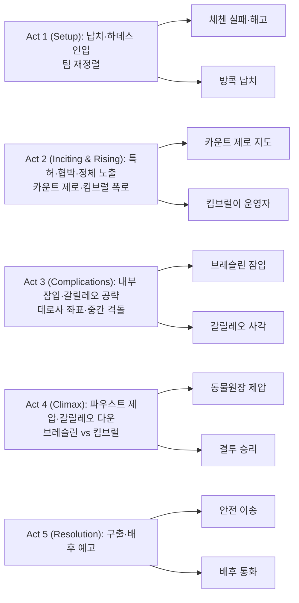

레이 브레슬린이 다시 감옥으로 돌아왔다. 이번엔 사람보다 시스템이 더 잔혹하다. 자동화 감옥 ‘하데스(HADES)’는 인간 교도관 대신 알고리즘과 방어 시스템 ‘갈릴레오(Galileo)’로 수감자를 길들이고, 정보는 전기충격과 고문으로 추출된다. 서사는 뚜렷하지만 연출은 산만하고, 액션의 리듬은 불규칙하다. 그럼에도 ‘기계가 만든 감옥’이라는 착상은 동시대의 기술 불안과 권력의 자동화를 비추는 흥미로운 거울이다.

## 개요

### 영화 정보
* 제목: Escape Plan 2: Hades / 이스케이프 플랜 2: 하데스
* 감독: 스티븐 C. 밀러 (Steven C. Miller)
* 주연: 실베스터 스탤론, 데이브 바티스타, 황샤오밍, 제시 메트칼프, 제이미 킹, 웨스 채텀, 티투스 웰리버, 커티스 “50 Cent” 잭슨
* 장르: 액션, 스릴러, 테크노 스릴러, 감옥 영화
* 상영시간: 96분(일부 플랫폼 93분)
* 개봉/출시: 2018.06.29 (미국 홈/중국 극장)

### 추천 대상
* **감옥 장르 매니아**: 자동화 감옥 콘셉트의 변형과 ‘기계적 권력’ 모티프를 체크하려는 관객
* **액션 합주보다는 아이디어 감상**: 아이디어는 흥미로우나 액션 리듬은 들쭉날쭉, 기대치 관리 필요
* **시리즈 추적러**: 전편 설정·인물군의 변주를 최소한으로 확인하려는 관객

## 줄거리 — Plot-DeepDive (Act-first)

### Act 1 (Setup)

- [S01] 체첸·인질 구출 — 알고리즘의 판단, 인간의 실수
  브레슬린 팀의 인질 구출 작전에서 재스퍼 킴브럴은 자신의 알고리즘을 믿고 임무를 일탈한다. 그 결과 인질이 총상을 입고 사망한다. 브레슬린은 킴브럴을 즉시 해고하고, 팀은 ‘기계적 판단’의 위험을 목격한다.
- [S02] 1년 후·의뢰 — 슈 런과 유셩의 기술
  슈 런은 가족의 부탁으로 사촌 마 유셩의 신변을 보호한다. 유셩은 위성 통신 특허 공개를 앞둔 통신 기업의 핵심 인물이다. 기술이 국가안보·핵 시스템에 미칠 파장을 슈는 처음으로 실감한다.
- [S03] 방콕·파티 습격 — 납치의 서막
  파티에서 복면 괴한들이 난입해 유셩을 노린다. 슈는 격투로 저지하지만 테이저에 당해 실신한다. 둘은 정체불명의 시설로 끌려간다.
- [S04] 하데스·첫 격투 — 자동화된 사육장
  슈는 천장이 높고 벽이 움직이는 원형 격투장에서 눈을 뜬다. 강제 대련에서 생존을 증명하고 ‘하데스’라는 감옥의 존재를 알아챈다. 인간 교도관 대신 시스템과 드론, 조명·벽체가 수감자를 관리한다.
- [S05] 동료의 그림자 — 킴브럴과의 재회
  같은 수감자 신분의 킴브럴이 슈에게 말을 건다. 그는 몇 달째 갇혀 있다며 구조를 기대하지 말라고 냉소한다. 슈는 그의 태도에서 석연치 않은 기색을 읽는다.
- [S06] 본사·실종 인지 — 팀의 추적 개시
  허쉬·아비게일·루크는 슈·유셩의 동선을 역추적한다. 브레슬린은 전편의 ‘더 톰’을 떠올리며 동일 자금줄 가능성을 의심한다. 팀은 비공식 작전을 준비한다.

### Act 2 (Inciting & Rising)

- [S07] ‘동물원장’ — 특허와 협박
  하데스의 소장 그레고르 파우스트(별칭 동물원장)는 유셩의 통신 특허를 요구한다. 그는 특허가 넘겨지면 둘을 풀어주겠다고 말한다. 슈는 시간을 벌며 탈출 가능성을 탐색한다.
- [S08] 비밀의 무게 — 핵을 흔드는 통신
  유셩은 기술이 전 세계 핵 발사 시스템을 하이재킹할 잠재력이 있다고 털어놓는다. 그는 남용을 우려해 핵심을 묻어두었다고 말한다. 둘은 ‘침묵’과 ‘탈출’ 두 전략을 병행하기로 한다.
- [S09] 동맹 요청 — 데로사를 불러라
  브레슬린은 옛 동료 트렌트 데로사를 호출한다. 팀 내부 리소스만으로는 감당이 어렵다고 판단한다. 전원은 외부 흔적을 최소화하고 그림자 작전을 개시한다.
- [S10] 루크의 추락 — 또 하나의 포로
  루크가 단독으로 실마리를 좇다 역추적당해 납치된다. 하데스로 이감된 루크는 슈와 재회한다. 팀은 내부 접선 창구를 잃는다.
- [S11] 연필 자국 — 매일 바뀌는 미로
  슈는 감옥 바닥에 연필로 작은 표시를 남기며 레이아웃 변화를 기록한다. 요리사 츄와 교류하며 식당·의무실·제어실의 상대적 위치를 도식화한다. 하데스는 밤마다 벽체를 이동시키는 ‘미로’다.
- [S12] 카운트 제로 — 지도와 신뢰
  슈는 리전의 리더 ‘카운트 제로’의 신뢰를 얻는다. 그는 구조 지도를 제공하지만 정체가 노출된다. 하데스의 시선이 그에게 쏠린다.
- [S13] 처형 쇼 — 공포의 연출
  다음 날, 수감자들 앞에서 카운트 제로의 처형이 연출된다. 슈는 그것이 ‘시스템의 통치 기술’임을 깨닫는다. 공포는 저항을 해체하기 위한 도구다.
- [S14] 진실의 폭로 — 운영자는 킴브럴
  킴브럴은 자신이 하데스의 설계·운영자임을 드러낸다. 인간 대신 알고리즘이 운영하는 감옥이 ‘탈출 불가능’을 증명할 것이라 오만하게 선언한다. 개인적 복수와 기술 시연이 얽혀 있다.

### Act 3 (Complications — Midpoint 포함)

- [S15] 자발적 포획 — 브레슬린의 침투
  브레슬린은 일부러 잡혀 하데스로 이송된다. 치아 속 송수신기로 허쉬와 교신하며 내부에서 방어망을 무너뜨릴 계획을 세운다. 그는 ‘안에서 밖을 여는’ 전술을 택한다.
- [S16] 가림막 — 카메라를 먼저 꺼라
  팀은 사각지대를 만들기 위해 CCTV 루프를 돌린다. 조명·벽체 이동 주기를 계산해 데드타임을 확보한다. 갈릴레오를 건드리기 전, 눈을 멀게 하는 단계다.
- [S17] 충돌 — 제압과 분산
  파우스트는 무장 병력을 투입해 제압에 나선다. 수감자·팀 양쪽의 피해가 커지고 그룹은 갈라진다. 브레슬린은 제어실보다 ‘사람’의 결속을 우선한다.
- [S18] 외부 추적 — 데로사의 좌표
  데로사는 전력 패턴과 우회 냉각 라인을 토대로 입구를 찾아낸다. 지상 침투의 타이밍은 내부 전력 스파이크와 일치해야 한다. 두 전선이 교차점을 향한다.
- [S19] 이념의 격돌 — 인간 vs 알고리즘
  브레슬린은 킴브럴과 마주한다. 그는 "감옥은 결국 사람의 눈을 속박한다"고 말하며 알고리즘의 오만을 꼬집는다. 킴브럴은 ‘예측·통제’의 절대성을 믿는다.
- [S20] 오버라이드 — 유셩의 키 입력
  유셩은 감옥 전력 우선순위를 역전시키며 일시 개방을 유도한다. 제어실로 연결되는 짧은 창이 열린다. 데로사는 이 신호를 포착해 돌입한다.

### Act 4 (Climax)

- [S21] 동물원장의 최후 — 칼날의 균형
  슈는 파우스트와 칼부림 끝에 그를 제압한다. ‘동물원’의 은유는 운영자의 몰락과 함께 무너진다. 수감자들은 인간의 언어를 되찾는다.
- [S22] 제어실 접전 — 루크·데로사 합류
  루크는 데로사와 합류해 제어실을 향한다. 좁은 코리도어에서 근접전이 벌어진다. 문 하나, 코너 하나가 생존을 가른다.
- [S23] 눈을 감겨라 — 갈릴레오 정지
  허쉬의 원격 지원으로 갈릴레오가 다운된다. 자동 억제 시스템이 멈추자 ‘하데스’는 흔한 콘크리트 상자에 불과해진다. 기술의 권위가 박탈되는 순간이다.
- [S24] 결투 — 브레슬린 vs 킴브럴
  브레슬린은 맨손으로 킴브럴을 제압한다. "감옥이 주는 선물은 시간"이라는 그의 언술처럼, 기다림과 타이밍이 승부를 갈랐다. 킴브럴은 오만의 대가를 치른다.
- [S25] 되찾은 통로 — 수감자들의 합
  통로가 열린다. 각자 흩어진 이들이 서로의 위치를 공유하며 빠져나간다. 시스템이 사라진 자리에 협력이 들어선다.
- [S26] 브리치 완료 — 출구로
  제어권을 되찾은 팀은 출구를 개방한다. 데로사가 외부에서 커버를 제공하고, 내부는 루크가 마무리한다. 브레슬린은 마지막까지 후위에 선다.

### Act 5 (Resolution)

- [S27] 이송 — 슈·유셩의 구출
  슈와 유셩은 아비게일·허쉬의 지원 아래 안전 구역으로 이송된다. 붕괴하는 시스템의 불빛이 뒤로 멀어진다. 둘은 침묵을 지킨 대가로 자유를 얻는다.
- [S28] 전화 — 배후의 그림자
  브레슬린은 하데스의 배후 조직으로부터 연락을 받는다. 그는 추적과 폭로를 서약한다. 시리즈의 다음 장으로 연결되는 여지를 남기며 막이 내린다.

### 핵심 대사 인덱스
"The one gift every prison gives you is time." — 레이 브레슬린, [S24]; 감각·타이밍
"You move together, and everything flows as one." — 브레슬린, [S15]; 팀워크
"I run HADES." — 재스퍼 킴브럴, [S14]; 오만
"This is a zoo. You are animals." — 파우스트, [S07]; 통치 은유
"Train your mind to look beyond the physical walls." — 브레슬린, [S15]; 인지 전환

## 구조 분석(Act-first 보조 도식)

## 캐릭터 분석

### 레이 브레슬린 — 시간과 타이밍의 언어
- 욕망/목표: 팀의 구출과 ‘인간 판단’의 회복.
- 성장 곡선: 외부 지휘 → 내부 잠입 → 타이밍으로 승부하는 후위 리더십.
- 상징: ‘시간’ 담론 — 자동화 앞에서 인간이 쥘 수 있는 마지막 수단.

### 슈 런 — 관찰·기록·연결의 전술가
- 욕망/목표: 유셩 보호·탈출.
- 성장 곡선: 강제 격투 생존 → 미로 지도화 → 소장의 제압으로 능동성 회복.
- 상징: 연필 자국 — 변하는 세계를 붙잡는 인간적 기록.

### 재스퍼 킴브럴 — 예측의 오만
- 동기: 알고리즘의 우월성 증명·개인적 복수.
- 대비: 인간 협력의 즉흥성과 타이밍에 패배. ‘완전한 예측’은 현실을 이기지 못한다.

### 그레고르 파우스트(동물원장) — 통치 은유의 실패
- 동기: 동물원/판옵티콘적 통제 욕망.
- 퇴장: 칼부림으로 무너지는 권위 — 기계가 세운 권력의 취약성.

### 트렌트 데로사 — 외부의 해킹
- 역할: 외부 추적·물리적 돌파구 제공.
- 상징: 전력 패턴 독해 — 기술을 기술로 꿰뚫는 실천적 지성.

## 비교/의미/비하인드
- **의미**: ‘기계적 감옥’은 알고리즘 통치·자동화 권력의 비유다. 하데스가 멈추는 순간, 감옥은 다시 ‘사람이 만든 방’으로 축소된다.
- **비교**: 전편이 설계자 vs 시스템의 퍼즐을 정공법으로 풀었다면, 속편은 아이디어는 크고 구현은 빈약하다(세트·촬영·동선 리듬의 와해).
- **비하인드**: 미·중 합작 구조로 해외(중국) 흥행 비중이 극단적으로 높다. 촬영 20일대 압축 제작·수정된 러닝타임이 리듬 붕괴의 한 요인으로 관측된다.

## 종합 평가
- 평점: ★★☆☆☆ (2/5)
- 한 줄 평: 아이디어는 현재형, 구현은 과거형. ‘기계의 감옥’이 던진 질문만이 오래 남는다.
- 관람 전 체크: 직행 비디오 급 완성도·리듬 붕괴를 감안한 기대치 설정 권장.

## 참고 문헌 / 출처
- [R1] Escape Plan 2: Hades — Wikipedia (`https://en.wikipedia.org/wiki/Escape_Plan_2:_Hades`)
- [R2] Escape Plan 2: Hades — Box Office Mojo (`https://www.boxofficemojo.com/title/tt6513656/`)
- [R3] Escape Plan 2: Hades — Rotten Tomatoes (`https://www.rottentomatoes.com/m/escape_plan_2_hades`)
- [R4] IndieWire Review — David Ehrlich (`https://www.indiewire.com/2018/06/escape-plan-2-hades-review-sylvester-stallone-dave-bautista-1201979919/`)
- [R5] The Hollywood Reporter — Casting/Production (`https://www.hollywoodreporter.com/movies/movie-news/dave-bautista-joining-sylvester-stallone-escape-plan-2-985073/`)
- [R6] Deadline — Casting (`https://deadline.com/2017/03/jaime-king-curtis-50-cent-jackson-escape-plan-2-sylvester-stallone-1202041564/`)
- [R7] IMDb Title Page (`https://www.imdb.com/title/tt6513656/`) | Accessed: 2025-08-31