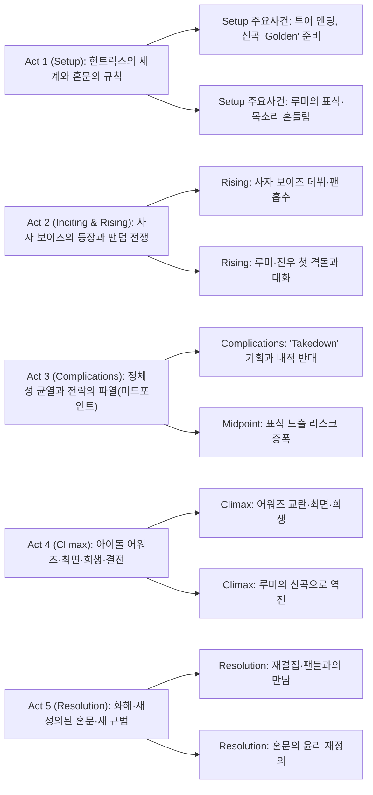

||
|:---:|
|KPop Demon Hunters (2025) — Netflix/Sony Pictures Animation|

## 개요

### 영화 정보
* 제목: KPop Demon Hunters / 케이팝 데몬 헌터스
* 감독: Maggie Kang, Chris Appelhans
* 주연: Arden Cho, Ahn Hyo‑seop, May Hong, Ji‑young Yoo, Yunjin Kim, Lee Byung‑hun, Ken Jeong, Daniel Dae Kim
* 장르: 애니메이션, 뮤지컬, 어반 판타지, 액션 코미디
* 상영시간: 100분 (공식 표기 기준; 일부 DB 95분 병기)
* 개봉/공개: 2025.06.20 (Netflix 스트리밍), 2025.08.23–24 (북미 등 싱어롱 이벤트 한정)
* 제작/배급: Sony Pictures Animation / Netflix

### 추천 대상
* **K‑팝 팬덤**: 팬 문화와 정체성, 스타·팬 상호의존을 입체적으로 녹여낸 음악·서사 경험
* **애니 작화·연출 애호가**: 콘서트 조명·에디토리얼 사진·애니메 감수성의 하이브리드 미학
* **가족 관객**: 자아수용·우정·희생을 경쾌한 유머와 파워풀한 넘버로 전달하는 보편성

## 구조 분석

## Plot-DeepDive (Act-first, 28+ Scene Beats)

아래 장면 비트는 관람자를 대상으로 하며(스포일러 100%), 각 비트는 3–6문장으로 장소·목표·행동·감정·대사·시청각·인과 중 최소 5요소를 포함한다. 번호는 전역 연속([S01]~)으로 유지한다. 본 개정은 나무위키 ‘케이팝 데몬 헌터스/줄거리’를 교차 참조하여 사건·고유명·연대를 보강했다.

### Act 1 — Setup

[S01] 서울 월드투어·밤 — 관객이 가득 찬 공연장 외부, 셀린의 내레이션이 헌터의 기원과 귀마의 위협, 혼문(Honmoon)의 역할을 간결히 소개한다. 카메라는 큐시트와 인터컴 소리, 드럼 체크의 킥으로 박동을 맞춘다. 목표는 마지막 공연을 무사히 수행하고 팬들과의 공명을 유지하는 것. 도입의 평정은 다음 장면의 비상으로 전환된다.

[S02] 개인 비행기·이륙 중 — 헌트릭스(루미·미라·조이)는 공연 직전 ‘폭풍 흡입’으로 탄수화물을 보충하며 라면까지 달라고 한다. 승무원들의 부자연스러운 동작과 서늘한 눈빛이 포착되고, 조종석의 계기판 조작이 어색하게 흔들린다. 루미는 이상 기류를 감지하며 손등의 문양을 무의식적으로 가린다. 웃음의 톤은 불길함으로 급전환한다.

[S03] 기내·연속 — 정체를 드러낸 악령들이 “팬들의 영혼을 가져가겠다”고 위협하며 하이재킹을 선언한다. 셋은 “공연부터 끝내자”는 듯 침착히 전투 자세를 잡고, 라이트가 꺼진 기내에서 ‘How It’s Done’의 리듬처럼 코러스를 맞춘다. 조명의 플리커와 금속성 효과음이 시청각을 지배. 다음 장면의 파국으로 인과 연결.

[S04] 상공·연속 — 악령들이 비행기를 절단하듯 찢어버리고 기내는 두 동강 난다. 헌트릭스는 우스꽝스럽게도 라면 한입을 마저 먹고, 맨몸 낙하로 밤하늘을 가른다. 헤어/메이크업을 점검하는 익살과 동시에 낙하의 바람 소리가 귀를 때린다. 목적지는 공연장 무대.

[S05] 메인 스테이지·착지 — 조명빔 사이로 낙하한 셋은 퍼포먼스와 전투를 동시에 수행한다. 관객은 악령을 백댄서 분장과 특수효과로 착각하고 열광한다. 코러스가 고조될수록 무대 뒤편 관측 장치의 혼문에 황금빛이 스며든다. 전투가 끝나자 혼문의 모서리 한 조각이 금빛으로 깜빡인다.

[S06] 백스테이지·직후 — 매니저 바비는 실시간 SNS 1위를 확인하며 함박웃음을 짓고, 팀에게 2주의 휴식이 주어진다. 셀린은 루미의 목소리를 확인하고 “금빛이 완성되면 표식도 사라질 것”이라 위로한다. 루미는 고개를 끄덕이지만, 속으로는 불안의 잔향이 남는다. 다음날 팬 인터뷰로 시점 이동.

[S07] 인터뷰 몽타주·다음날 — 팬들이 각자 미라·조이·루미를 좋아하는 이유를 밝힌다. 미라는 ‘멧 갈라에서 침낭을 입던 장난꾸러기’, 조이는 버뱅크 출신의 귀염둥이 래퍼, 루미는 선라이트 시스터즈 류 미영의 딸이자 셀린에게 입양된 성장 서사가 언급된다. 소음은 줄고 보컬 샘플이 잔잔히 흐른다. 캐릭터의 욕망과 외부 이미지가 설정된다.

[S08] 헌문 관측 포인트·밤 — 셀린과 셋은 균열 지점을 점검하며 “이번 물결은 다르다”고 진단한다. 금빛 스파크가 콘크리트 벽을 타고 번쩍이며, 악령의 잔광이 속삭인다. 다음 막의 발단으로 불길한 씨앗이 심어진다.

### Act 2 — Inciting & Rising

[S09] 악령 세계·지하 — 귀마는 실패를 보고하는 부하를 그 자리에서 불태워 소멸시키며 분노를 표출한다. 이때 진우가 비파를 연주하며 등장, “아이돌의 언어로 팬을 흔들어 혼문의 근원을 무너뜨리자”고 제안한다. 귀마는 처음엔 비웃다가 논리를 수긍하고, 진우의 보상 요구(인간 시절 기억 삭제)를 묻는다. 권력과 거래의 톤이 확립된다.

[S10] 숙소·밤 — 휴식 시작과 동시에 루미는 흥분을 이기지 못하고 ‘Golden’의 깜짝 발표를 밀어붙인다. 바비는 황급히 스케줄을 재조정하고, 미라·조이는 “오늘 밤부터 홍보?”라며 울상 짓다가도 곧 환호한다. 화면 하단에 주가·차트 그래프가 코믹하게 스쳐 지나간다. 무리한 가속이 인과적으로 다음 사달을 부른다.

[S11] 골든 무대 대기실·라이브 직전 — 루미는 클라이맥스 고음을 소화하지 못하고 뛰쳐나간다. 목까지 치솟은 보라색 문양이 클로즈업으로 드러나며 셀린만이 그 비밀을 알고 있다. “괜찮아, 금빛이 완성되면 사라져” — 셀린. 하지만 루미의 감정 곡선은 추락한다.

[S12] HAN의원·낮 — 의사는 “부분을 알기 위해선 전체를 봐야 한다”며 루미의 ‘벽’을 지적한다. 조이에게는 ‘남들 기분을 맞추려는 습관’을, 미라에게는 통제 과잉을 콕 집는다. 루미는 참지 못하고 약을 재촉하며 처방전을 받아든다. 코믹과 불안을 교차 편집.

[S13] 거리·연속 — 약 상자를 들고 나온 셋 앞에 사자 보이즈가 천천히 걸어온다. 배경에 ‘Soda Pop’이 깔리고, 슬로모션에서 진우와 루미의 시선이 맞물린다. 루미가 휘청이자 진우가 손을 내미는 듯하다가, 음악이 툭 끊기며 손을 닦는 ‘클리셰 전복’이 웃음을 유발한다.

[S14] 야외 버스킹·즉시 — 헌트릭스는 민간인 피해를 우려해 타이밍을 재다, 빈 공간이 생기자 기습 전투를 건다. 공명으로 악령임을 간파한 루미는 진우의 팔목 문양을 목격하지만, 진우는 역으로 루미의 문양을 보고도 덮어준다. “오늘은 관객이 많아” — 진우. 그는 더피(호랑이)로 ‘만나자’라는 메시지를 전한다.

[S15] 골목·심야 — 루미와 진우가 단둘이 마주한다. 진우는 400년 전 조선에서 가난을 견디다 귀마와 거래해 이름을 얻었지만 가족을 파국으로 몰았다는 죄책을 고백한다. “넌 가족을 살릴 순 없지만 내가 도와 줄 순 있다” — 귀마가 속삭였다고. 루미는 동요하지만 칼을 뽑아 거리를 둔다.

[S16] 연습실·오전 — 헌트릭스는 전략을 재정비하고 디스곡 ‘Takedown’을 제작한다. 조이는 팬 상처를 우려하나, 미라는 “진실은 불편해야 해”라며 밀어붙인다. 루미는 가사 속 증오의 톤에 망설이며, 진우와의 대화가 남긴 ‘다른 길’을 떠올린다.

### Act 3 — Complications (Midpoint 포함)

[S17] 도심 전광판·저녁 — 사자 보이즈의 파급력이 커지고 혼문 외곽선이 눈에 띄게 얇아진다. 실종자 뉴스 자막이 지나가고, 관객들의 표정이 공허하게 변해간다. 셋은 “아이돌 어워즈에서 끝내자”고 결의한다. 상승부의 압력이 축적된다.

[S18] 지하철 선로 위·밤 — 악령을 추격하던 헌트릭스가 지붕 위에서 교전한다. 루미와 미라 사이의 불신이 폭발하고, 루미가 머뭇거리는 찰나 혼문에 거대한 균열이 생긴다. 악령이 객차를 뒤덮으며 탑승객 전체가 혼을 빼앗기는 대참사가 발생한다. 비명 대신 ‘저음 허밍’이 울려 퍼진다.

[S19] 옥상·새벽 — 충격 속에서 루미는 진우와의 협력을 제안하기로 결심한다. “아이돌 어워즈에서 우리가 이기면, 금빛 혼문이 완성돼. 그때 네가 인간계에 있으면 자유로워질 거야.” 진우는 침묵으로 흔들린다. 귀마의 속삭임이 잠시 멎는다.

[S20] 리허설 홀·아침 — 루미의 솔로 파트가 다시 열린다. “나… 지금 들려.” 그녀의 목소리가 투명하게 맑아지고, 셀린은 모니터 뒤에서 미묘한 미소를 짓는다. 감정 곡선이 회복되지만, 불안은 여전하다.

[S21] 어워즈 대기실·D‑day — 루미는 ‘Takedown’을 보류하고 ‘Golden’을 부르자고 선언한다. 미라·조이는 배신감과 당혹을 드러내며 언성을 높인다. 스태프들이 분주히 오가고, 무대 진행 타이머가 초 단위로 깎인다.

[S22] 무대 암전·연속 — 매니저 바비가 악령들에게 납치되며 혼선이 발생한다. 조명이 꺼지고, 예정에 없던 ‘Takedown’ 전주가 울린다. 관객은 열광하지만, 루미는 무언가 틀렸음을 직감한다.

[S23] 본무대·연속 (Midpoint) — 무대로 돌아온 ‘미라’와 ‘조이’는 사실 악령이 둔갑한 가짜다. 그들은 무대 위에서 루미를 몰아세우며 악령 혐오 가사를 퍼붓고, 대형 스크린에 루미의 문양이 노출된다. “너의 어디서부터가 진짜고 가짜인지 모르는데 어떻게 함께하자고 하냐” — (가짜)조이. 팀의 신뢰가 산산조각 난다.

[S24] 백스테이지 복도·즉시 — 무대 아래에서 진짜 미라·조이와 마주친 루미는 반인반귀의 진실을 들키고 만다. 두 사람의 눈빛엔 배신과 공포가 교차하고, 미라가 곡도를, 조이가 신칼을 겨눈다. 루미는 말문이 막힌 채 후퇴한다. 감정 곡선 최저점.

[S25] 골목·심야 — 루미는 진우에게 달려가지만, 이번엔 그가 배신자였음이 드러난다. 귀마는 진우의 ‘가장 추한 고백’을 끝내 끌어내지 못한 틈을 파고들어 그를 소환했고, 진우는 루미의 신뢰를 얻기 위한 거짓으로 협력했던 것. “자기 혼자 비참한 삶을 벗어나기 위해 귀마와 거래했고 결국 가족을 버렸다!” — 진우. 루미의 분노가 폭발한다.

[S26] 제주·한적한 절·새벽 — 루미는 셀린을 찾아가 사인검을 건네며 “이걸 끝내줘”라고 부탁한다. 셀린은 “정체를 숨기면 된다”는 낡은 믿음을 반복하다가, 루미의 절망을 마주하고 말을 잃는다. 루미는 “그런 혼문이라면 차라리 무너지게 두겠다”고 남기고 사라진다.

### Act 4 — Climax

[S27] 남산타워 인근 스타디움·밤 — 사자 보이즈가 정체를 드러내며 콘서트를 시작한다. ‘Your Idol’의 최면성 코러스에 군중은 귀마의 불길 속으로 걸어 들어가려 한다. 미라와 조이도 세뇌된 미소로 무대 쪽으로 향한다. 혼문은 산산조각 나기 직전.

[S28] 외부 무대·연속 — 모든 것을 잃은 루미가 자신을 있는 그대로 받아들이고 새로운 노래 ‘What It Sounds Like’를 시작한다. “내가 숨긴 상처의 소리, 이제 내가 부른다.” 그녀의 진솔한 보컬이 공명을 깨우자 미라와 조이가 차례로 정신을 차린다. 조명의 색온도가 차갑음에서 따뜻함으로 이동한다.

[S29] 관객석·연속 — 바비를 비롯한 팬들도 서서히 최면에서 깨어나 헌트릭스와 공명한다. 세 사람의 하모니가 무지개색 스펙트럼으로 시각화되며, 무대 바닥에 새로운 원이 그려진다. 사자 보이즈의 음향은 찢어지고 상징물들이 부서진다. 최종 대면 준비.

[S30] 스타디움 중앙·정점 — 귀마의 거대한 불의 입이 하늘을 갈라 루미를 덮치려는 순간, 진우가 몸을 던져 공격을 막는다. “미안해… 네가 내게 준 걸, 돌려줄게.” 그는 자신의 혼을 루미에게 돌려주고 소멸한다. 지배의 사슬이 끊어지며 베이스가 멎고 심장 박동만 남는다.

[S31] 결전·연속 — 헌트릭스의 화음이 ‘금빛’이 아닌 ‘무지개색’의 새로운 혼문을 만든다. 이는 분리의 봉인이 아니라 공존의 약속으로 재정의된다. 귀마와 사자 보이즈는 와해되고, 관객의 플래시는 별자리처럼 반짝인다. 장엄한 메이저 코드로 클라이맥스가 닫힌다.

### Act 5 — Resolution

[S32] 목욕탕·아침 — 전투가 끝난 뒤, 세 사람은 목욕탕에서 지친 몸을 식히며 조용히 웃음을 나눈다. 미라와 조이는 마침내 상처를 드러낸 루미를 끌어안고, 3개월의 휴식기를 갖기로 한다. 그러나 밖에서 팬들의 환호가 들리자 셋은 즉석 길거리 팬미팅을 연다. 건물 옥상에선 더피와 서씨가 그들을 내려다본다.

### 핵심 대사 인덱스
- “혼문이 금빛으로 완성되면 표식도 사라질 거야.” — 셀린, [S06]; 구원의 오해
- “넌 가족을 살릴 순 없지만 내가 도와 줄 순 있다.” — 귀마(회상), [S15]; 유혹의 언어
- “너의 어디서부터가 진짜고 가짜인지 모르는데 어떻게 함께하자고 하냐.” — (가짜)조이, [S23]; 신뢰 붕괴
- “이걸 끝내줘.” — 루미, [S26]; 절망의 극점
- “미안해… 네가 내게 준 걸, 돌려줄게.” — 진우, [S30]; 희생과 해방

## 캐릭터 분석

### 루미(Rumi)
- **욕망/두려움**: 완벽성과 구원의 약속(골든 혼문) vs 수치심과 정체성의 노출.
- **성장 곡선**: 타인의 규범(완벽·은폐)에 의존 → 수치심의 목소리를 인식 → 자기 수용과 공동 윤리로 이동.
- **상징**: 금빛 원의 재정의(분리의 봉인 → 공존의 약속), 목소리의 회복은 수치심의 해체로 성취.

### 진우(Jinu)
- **욕망/상처**: 가족을 지키려던 선택이 귀마의 계약으로 비틀림; 목소리는 선물이자 족쇄.
- **관계**: 루미와의 대화로 인간성 회복; 최후의 희생으로 지배의 사슬을 끊음.
- **상징**: 파란 호랑이(더피)와 까치(서시) — 전통 민화의 익살과 경계 사이를 오가는 존재.

### 미라(Mira)
- **욕망/신념**: 팀의 완성도와 진실성; 때론 공격적 전략으로 표출.
- **아크**: ‘Takedown’의 직설을 선호 → 팬·상대 모두를 상처낼 수 있음을 깨닫고 조율자로 성장.
- **상징**: 메트 갈라 가운/무대 의상 — 과감함과 보호의 이중성.

### 조이(Zoey)
- **욕망/역할**: 막내이자 래퍼로 팀의 균형; 유머로 긴장 완화.
- **아크**: ‘대중의 사랑’을 잃는 공포 → ‘공존의 윤리’로 이동, 팬들과의 상호성 강조.
- **상징**: 팝-랩의 브리지 — 서사적 연결부를 잇는 기능.

### 셀린(Celine)
- **욕망/죄책**: 루미를 구하겠다는 강박; 과거의 선택이 현재 윤리에 그림자.
- **아크**: ‘완벽한 금빛’ 신화에서 물러나 루미의 자율성과 새 질서를 지지.
- **상징**: 과거 헌터의 장신구(노리개), ‘보호’의 수호자에서 ‘신뢰’의 안내자로.

### 귀마(Gwi‑Ma)
- **동기/전술**: 수치심의 내면화를 노래로 증폭, 팬덤의 에너지를 착취.
- **상징**: 거대한 불의 입 — 소비와 조작의 은유; 최면 코러스.

## 종합 평가
- **총평**: 콘서트 라이트·애니메 감수성·민속 모티프를 한 몸처럼 엮어, 팬덤·정체성·공존의 윤리를 ‘노래’로 선언하는 2025년형 뮤지컬 판타지. 서사의 몇몇 급전개에도 불구하고, 곡-연출-미장센의 유기성이 압도적 쾌감을 만든다.
- **한 줄 평**: “수치심의 목소리를 떼창으로 덮는 황금의 합창.”

## 참고 문헌 / 출처
- [R1] KPop Demon Hunters — Wikipedia (`https://en.wikipedia.org/wiki/KPop_Demon_Hunters`) | Accessed: 2025-09-08
- [R2] KPop Demon Hunters: Trailer, Lore and News — Netflix Tudum (`https://www.netflix.com/tudum/articles/kpop-demon-hunters-release-date-cast-news`) | Accessed: 2025-09-08
- [R3] KPop Demon Hunters — Rotten Tomatoes (`https://www.rottentomatoes.com/m/kpop_demon_hunters`) | Accessed: 2025-09-08
- [R4] Keipab Demon Heonteoseu (2025) — IMDb (`https://www.imdb.com/title/tt14205554/`) | Accessed: 2025-09-08
- [R5] KPop Demon Hunters — The Numbers (`https://www.the-numbers.com/movie/KPop-Demon-Hunters-(2025)#tab=summary`) | Accessed: 2025-09-08
- [R6] KPop Demon Hunters — Box Office Mojo (`https://www.boxofficemojo.com/title/tt14205554/`) | Accessed: 2025-09-08
- [R7] KPop Demon Hunters Review — Empire (`https://www.empireonline.com/movies/reviews/kpop-demon-hunters/`) | Accessed: 2025-09-08
- [R8] KPop Demon Hunters — The Film Verdict (`https://thefilmverdict.com/kpop-demon-hunters-film-review/`) | Accessed: 2025-09-08

