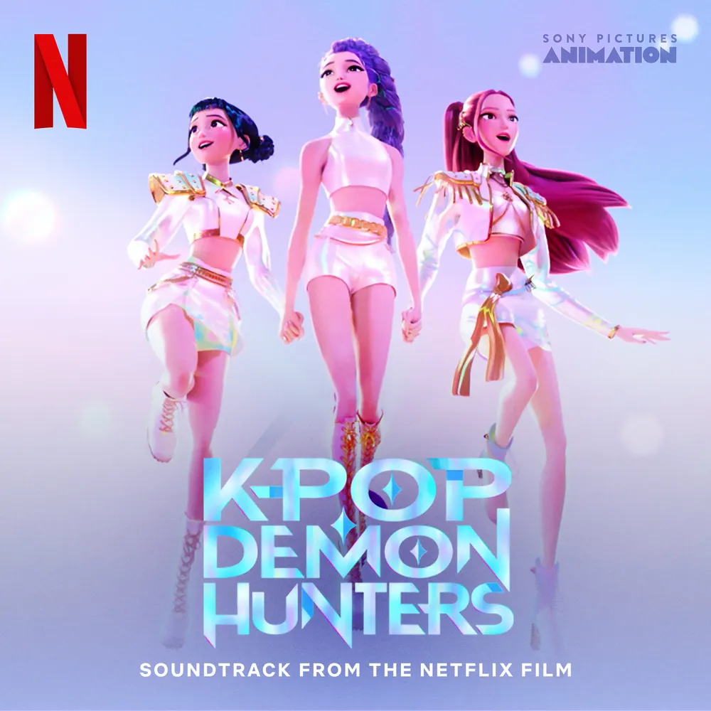
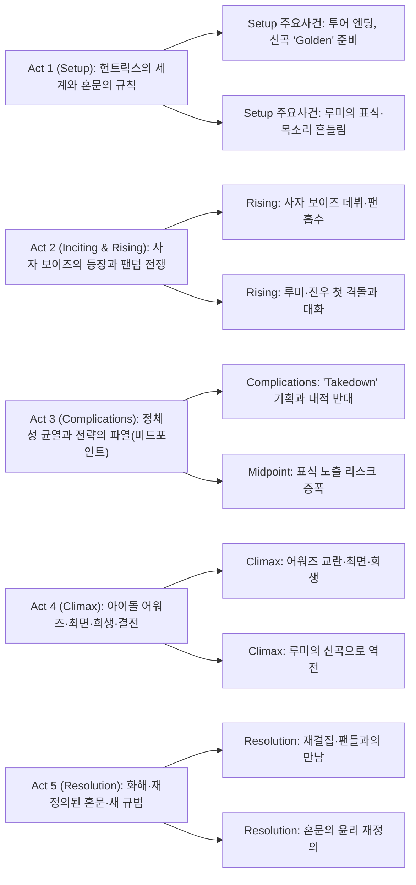

## 개요

### 영화 정보
* 제목: KPop Demon Hunters / 케이팝 데몬 헌터스
* 감독: Maggie Kang, Chris Appelhans
* 주연: Arden Cho, Ahn Hyo‑seop, May Hong, Ji‑young Yoo, Yunjin Kim, Lee Byung‑hun, Ken Jeong, Daniel Dae Kim
* 장르: 애니메이션, 뮤지컬, 어반 판타지, 액션 코미디
* 상영시간: 100분 (공식 표기 기준; 일부 DB 95분 병기)
* 개봉/공개: 2025.06.20 (Netflix 스트리밍), 2025.08.23–24 (북미 등 싱어롱 이벤트 한정)
* 제작/배급: Sony Pictures Animation / Netflix

### 추천 대상
* **K‑팝 팬덤**: 팬 문화와 정체성, 스타·팬 상호의존을 입체적으로 녹여낸 음악·서사 경험
* **애니 작화·연출 애호가**: 콘서트 조명·에디토리얼 사진·애니메 감수성의 하이브리드 미학
* **가족 관객**: 자아수용·우정·희생을 경쾌한 유머와 파워풀한 넘버로 전달하는 보편성

## 구조 분석

## Plot-DeepDive (Song-based Structure)

아래 줄거리는 영화의 8개 주요 노래를 기준으로 재구성되었다. 각 섹션은 해당 노래가 중심이 되는 시퀀스를 다루며, 장소·목표·행동·감정·대사·시청각·인과를 포함한다. (스포일러 100%)

### Prologue (Hunter's Mantra) — 헌트릭스의 기원

**[공연장 외부·밤]** 헌트릭스의 월드 투어 마지막 공연을 기다리는 관객들로 가득 찬 공연장. 셀린의 나레이션으로 헌터의 기원이 소개된다. 오래전부터 사람들의 영혼을 빼앗아먹는 **귀마(Gwi-Ma)**라는 악령의 우두머리가 존재했고, 그 수하 악령들을 퇴치하는 역할을 해온 것이 헌터였다.

**[설정]** 헌터는 단순히 악령을 퇴치하는 것이 아니라, 자신들의 목소리로 사람들에게 감동을 주고 그 감동으로 악령들이 지상으로 올라오는 것을 막는 **혼문(Honmoon)**을 만들 수 있는 능력을 가지고 있었다. 3명으로 구성된 여성 헌터들은 여러 세대를 거쳐 가수 활동을 하며, 특히 황금빛으로 빛나는 **황금 혼문**을 만들어 악령을 영원히 지상으로 못 올라오게 만드는 것을 목표로 삼았다.

**[팬 인터뷰]** 관객들은 헌트릭스 멤버들을 왜 좋아하는지 인터뷰로 밝힌다. 메인 댄서 **미라**는 멧 갈라에서 드레스 대신 침낭을 입고 나올 정도로 어릴 때부터 말썽쟁이였다. **조이**는 캘리포니아 버뱅크 태생으로 귀여운 외모와 달리 랩을 할 때는 거칠다. **루미**는 선라이트 시스터즈 멤버 류미영의 딸이지만 어렸을 때 엄마를 잃었고, 셀린이 입양해 키웠다. 루미의 목소리는 팬들에게 깊은 감동을 주는 것으로 유명하다.

### How It's Done — 헌트릭스의 강함

**[개인 비행기·공연 직전]** 매니저 바비는 무대 준비를 하며 헌트릭스가 도착하지 않아 불안해한다. 헌트릭스의 항공편 위치를 확인하지만 공연장에서 점점 멀어지고 있다. 한편 개인 비행기에 탄 헌트릭스는 공연 직전 만반의 준비를 위해 어마어마한 탄수화물 야식을 먹어치운다. 컵라면을 위해 뜨거운 물을 요청하지만, 승무원들의 행동이 부자연스럽다.

**[하이재킹]** 헌트릭스는 악령들이 비행기를 하이재킹한 것을 알아챈다. 악령들은 정체를 드러내며 헌트릭스를 해치우고 팬들의 영혼을 가져가겠다고 위협한다. 헌트릭스는 정색하며 전투 준비를 한다.

**[전투와 공연]** 악령들과의 전투 중 비행기가 반토막 나지만, 헌트릭스는 쿨하게 라면을 먹어치우고 낙하산 없이 맨몸으로 고고도강하를 강행한다. 낙하 중에도 화장과 머리를 체크한다. 악령들을 처리하고 공연장에 무사히 착지하며 공연과 전투를 동시에 수행한다. 관객들은 악령을 백댄서의 특수분장으로 착각하고 열광한다.

**[황금 혼문의 징조]** 공연을 성공적으로 마친 헌트릭스는 혼문의 한구석이 황금색으로 빛나기 시작한 것을 보고 황금 혼문 완성이 얼마 남지 않았음을 확신한다.

### Golden — 황금 혼문을 위한 마지막 여정

**[악령 세계·지하]** 귀마는 헌트릭스가 너무 강하다고 변명하는 악령을 그 자리에서 불태워 소멸시킨다. "이대로면 우리 모두 혼문에 갇혀 죽는다"고 질책한다. 이때 귀마의 수하 중 한 명인 **진우**가 비파를 연주하며 등장한다. "이대로 싸우면 이길 수 없다. 혼문의 근원인 팬을 노리는 아이돌 그룹으로 승부해야 한다"며 **사자 보이즈** 5명이 화려한 포즈를 잡는다. 귀마는 처음 비웃다가 납득하고, 진우의 요구(인간 시절 기억 삭제)를 묻는다.

**[휴식기와 신곡 발표]** 성공적으로 공연을 끝낸 헌트릭스에게 2주간의 휴식기가 주어진다. 미라와 조이는 소파에 간식을 늘어놓고 쉴 준비를 한다. 하지만 황금 혼문 완성이 얼마 남지 않았다는 흥분에 빠진 루미는 신곡 'Golden'의 의상을 입고 독단적으로 신곡 발표를 해버린다. 미라와 조이는 울면서 "오늘 밤부터 신곡 홍보?"라고 절규하지만, 바비가 신곡 반응이 너무 좋다고 하자 금세 환호하며 홍보에 들어간다.

**[루미의 비밀]** 'Golden' 뮤직비디오 인트로가 나온다. 골든은 멤버 각자의 개인사를 담은 노래다. 골든 공연 대기실에서 미라와 조이는 같은 대기실을 쓰지만 루미는 독실을 쓴다. **사실 루미는 본래 헌터와 악령의 혼혈이었고, 악령의 문양을 타고났으며, 이 문양이 조금씩 커져 지금은 목까지 올라왔기 때문이다.** 셀린은 문양을 다른 멤버에게도 숨겨야 하며, 황금 혼문이 완성되면 귀마의 영향력이 사라지면서 문양도 사라질 것이라고 위로한다.

**[펑크와 한의원]** 악령 문양의 영향으로 막바지 연습 중 골든의 클라이맥스 파트를 소화할 수 없게 되고, 루미는 골든 데뷔 무대를 펑크낸 채 도망친다. 미라와 조이는 한의원에 가자고 조언한다.

### Soda Pop — 라이벌 '사자 보이즈'의 등장

**[HAN의원]** 돌팔이 같아 보이는 한의사는 "부분을 알기 위해서는 전체를 봐야 한다"며 루미를 응시하나, "벽이 너무 많아서 아무것도 볼 수가 없다"고 말한다. 조이에게는 "남들의 기분을 너무 맞춰주려 한다"는 평을 내리고, 다른 멤버들도 조용히 동의한다. 마음이 급해진 루미는 못 참고 약을 재촉하며 처방받는다.

**[사자 보이즈 조우]** 약 상자를 들고 한의원을 나온 멤버들은 자신들 쪽을 향해 걸어오는 사자 보이즈를 목격한다. 배경에 달달한 음악(멜로망스의 '사랑인가 봐')이 깔리고 슬로모션이 걸린다. 진우와 루미의 시선이 맞물리고 루미가 넘어지자 진우가 손을 내미는 듯하다가 음악이 급종료되며 어깨를 털고 손을 닦는 클리셰 파괴로 마무리된다.

**[거리 공연 전투]** 사자 보이즈가 'Soda Pop'을 부르며 거리에서 공연하던 도중, 희미한 문양을 보고 악령임을 알아차린 헌트릭스는 습격 기회를 노린다. 팬들이나 주변 사람들이 휘말릴까 봐 대놓고 나서지 못하다가 겨우 기회를 잡아 전투를 시작한다. 전투 중 진우가 루미에게 악령의 문양이 있다는 것을 발견하지만 숨겨준다. 이후 자신의 호랑이(더피)를 보내어 루미에게 만남을 제안한다.

**[진우의 고백]** 루미를 만난 진우는 자신의 과거를 알려준다. 진우는 400년 전 조선시대 사람으로 어머니와 여동생과 함께 가난하게 살았고 비파 연주로 겨우 생계를 이어갔다. 귀마가 "넌 가족을 살릴 순 없지만 내가 도와 줄 순 있다"며 목소리에 홀리게 했고, 진우는 가족을 먹여살리기 위해 귀마와 거래했다. 이후 뛰어난 음악가로 알려졌고 가족들은 궁에 들어가 살 정도로 나아졌으나, 보라색 문양이 점점 커지면서 악령의 세계로 소환되었다. 자신이 사라지자 가족들은 궁에서 쫓겨나 전보다 훨씬 비참한 삶을 살게 되었다. 이로 인한 죄책감과 수치심이 귀마가 악령을 통제하고 지배하는 힘임을 알려주고, 루미에게도 비슷한 사연이 있는지 털어놓으라고 설득한다. 루미는 잠시 망설이지만 이내 칼을 휘둘러 진우를 쫓아버린다.

### Takedown — 헌트릭스 VS 사자 보이즈

**[견제와 불안정]** 사자 보이즈는 지속적으로 다양한 수단으로 헌트릭스를 견제하며 인기를 모아간다. 'Soda Pop'의 인기가 높아짐에 따라 혼문은 점차 불안정해진다. 이에 헌트릭스는 **월드 아이돌 어워즈**에서 확실히 사자 보이즈를 물리치고 황금 혼문을 완성시키기 위해, 악령에 대한 조롱과 그들을 물리치고자 하는 의지를 담은 디스곡 **'Takedown'**을 제작한다.

### Free — 사자 보이즈 리더인 진우와의 동질감

**[혼문의 균열과 대참사]** 불안정해진 혼문으로 인해 악령은 점차 인간계에 자주 침입하기 시작하고, 악령에게 혼을 뺏겨 실종된 사람들의 수도 점점 증가한다. 루미는 진우와의 만남 이후 악령들에 대한 감정과 편견이 흔들려 악령들에 대해 알아보고 대화를 시도한다. 자신도 반은 악령인 만큼 무자비하고 무감정하게 그들을 없애는 데 회의감을 갖게 된다.

멤버들, 특히 미라에게 이런 모습들을 많이 노출하게 되며 헌트릭스 사이의 갈등이 생긴다. 헌트릭스가 지하철 위에서 악령들을 제거하던 도중 루미에 대한 의심이 커지던 미라와 루미 간에 다툼이 발생한다. 그때 **지하철 위에서 혼문에 거대한 틈이 발생하고 루미가 머뭇거리는 사이 악령들이 지하철을 뒤덮어버리면서 지하철 탑승객들 전체가 혼을 빼앗기는 대참사가 발생한다.**

**[협력 제안]** 점점 혼란에 빠진 루미는 고민 끝에 진우와의 만남을 갖기로 결심한다. 루미는 진우에게 월드 아이돌 어워드에서 헌트릭스가 우승하도록 조력해주면 황금 혼문이 완성될 것이고, 악령의 세계가 완전히 차단되며, 자신의 문양도 사라지고 그때 진우가 현실 세계에 있으면 귀마의 영향력이 끊어져 자유를 찾을 것이라 제안한다. 진우는 회의감을 내비치나, 떠나는 루미의 팔목을 붙잡는 등 완전히 희망을 버리지는 못한다.

**[목소리의 회복]** 다음 만남에서 진우는 협력할 수 없다고 선언하나, 루미는 이미 진우가 스스로도 모르게 루미를 도와주었다고 고백한다. **악령인 진우가 반악령인 루미를 온전히 인정하고 받아들여줌으로써 루미가 스스로를 인정하지 못하고 감추고 사는 과정에서 생긴 수치심, 헌트릭스 동료들을 비롯한 많은 사람에게 악령 문양을 감추고 산 죄책감을 해소해주어 목소리가 돌아오고 있었던 것.** 이내 진우와 루미는 서로의 비밀을 알고 상처를 공유하며 서로를 어느 정도 받아들이게 된다. 이 과정에서 진우는 귀마의 목소리가 머릿속에서 들리지 않게 되고 루미의 목소리도 완전히 돌아온다. 진우는 아이돌 어워드에서 사자 보이즈가 우승하지 못하도록 할 것이라 대답한다.

### Your Idol — 헌트릭스를 패배시키고 본색을 드러내는 사자 보이즈

**[시상식 날]** 루미는 악의와 조롱을 담은 'Takedown' 대신 자신들의 목표를 담은 'Golden'을 부르기로 한다. 그러나 루미의 솔로 파트가 진행되는 도중 매니저 바비가 악령들에게 납치되는 광경을 보게 된 미라와 조이가 잠시 자리를 비우게 된다. 무대의 조명이 꺼지더니 'Takedown'의 전주가 흘러나온다. 갑작스러운 변경에 당황하지만 조명과 함께 돌아온 미라와 조이와 무대를 선보인다.

**[정체 노출]** 그러나 'Takedown'과 함께 돌아온 것은 **악령이 둔갑한 가짜 미라와 조이**였다. 이들은 루미가 악령임을 알고 있었다며 악령에 대한 혐오를 담은 가사를 쏟아내고, 무대 위에서 루미를 몰아세워 결국 **악령의 문양을 드러내고 만다**. 멘탈이 박살 난 루미는 무대에서 도망쳤다가 마침 돌아오는 진짜 미라와 조이와 마주치고, 결국 그들에게 자신의 진실(반인반귀)을 들키고 만다.

**[신뢰의 붕괴]** 루미는 어떻게든 상황을 수습하려 하지만 그녀의 정신 상태와 함께 혼문이 극히 불안정해진다. 이러한 광경을 본 미라와 조이는 배신감만 더 커진다. 루미는 그들에게 혼문을 부활시키는 데 함께 하자고 하나 조이는 **"너의 어디서부터가 진짜고 가짜인지 모르는데 어떻게 함께하자고 하는 거냐"**며 루미에 대한 신뢰를 잃은 상태다. 루미가 소리를 지르자 악령의 파동이 생긴다. 이 광경을 본 둘은 루미를 믿지 못한 채 조용히 무기를 겨눈다.

**[진우의 배신]** 루미는 도망치며 진우를 찾지만, 결국 이러한 음모를 꾸민 것이 진우였음을 알게 되면서 절망에 빠진다. 혼문이 박살 나기 시작한다. 루미는 배신한 진우에게 분노가 폭발했고 진우는 "귀마에게 벗어나지 못할 뿐이었고 결국 니 신뢰를 얻기 위한 거짓말이었다"라고 말한다.

**[진우의 진실]** 사실 자신의 치부를 온전히 드러낸 루미와 달리, 진우는 끝내 자신의 치부(가족을 위해서가 아니라 자신의 영달을 위해 귀마와 거래했고 결국 가족을 버렸다는 사실)를 완전히 드러내지 못했다. 이로 인한 고뇌를 귀마는 놓치지 않았고, 진우를 소환하여 그를 조롱하며 자신을 벗어날 수 없음을 상기시켰다. 귀마로부터 자유로워질 수 없음에 절망한 진우가 결국 루미를 배신했던 것이다.

루미는 그저 실수일 뿐이고 넌 귀마에게 속은 거라며 회유하지만 진우는 **"자기 혼자 비참한 삶을 벗어나기 위해 귀마와 거래했고 결국 가족을 버렸다"**고 크게 울부짖으며 외친다. 루미가 소리를 지르자 또 악령의 파장이 생기고 그 모습을 본 진우는 "그런 모습으로 어떻게 귀마를 처치할 수 있겠냐, **너도 그저 나랑 똑같은 악령일 뿐이고 영원히 비참한 세상에 사는 것이 어울린다**"며 조용히 자리를 떠난다.

**[셀린과의 대면]** 정신적으로 완전히 내몰린 루미는 셀린을 찾아가 사인검을 건네주며 자신이 완전히 악령이 되어 지키려던 혼문을 자기 스스로 파괴하기 전에 죽여줄 것을 청한다. 하지만 셀린은 억누르고 정체를 숨기면 된다는 말만을 반복한다. 악령으로서의 자신을 인정하지 못하고 두려움에 주춤대는 셀린을 본 루미는 절망하고, 결국 **"자신이 지켜야 하는 혼문이 그런 것이라면, 차라리 파괴되는 걸 지켜보는 게 낫겠다"**는 말을 남기고 사라진다.

**[귀마의 소환]** 남산타워 옆 스타디움에는 미라와 조이를 비롯한 수많은 사람들이 모여든다. 사자 보이즈는 정체를 드러내며 콘서트를 시작하고, 마침내 귀마가 이승에 소환된다. 사람들은 사자 보이즈의 노래에 홀린 채 귀마의 불길 속으로 걸어가기 시작한다.

### What It Sounds Like — 루미의 성장, 헌트릭스의 재결합

**[새로운 노래]** 모든 것을 잃고 사라졌던 루미는 자신을 있는 그대로 받아들이며 새로운 혼문을 열기 위한 노래를 시작한다. 자신의 상처를 드러내지 못했음을 고백하고 자신의 마음을 진솔하게 노래하자 조이와 미라가 차례로 정신을 차린다. 그들은 귀마의 방해를 물리치고 서로의 마음을 다시 확인한다. 헌트릭스의 마음이 모이자 바비를 비롯한 관객들도 서서히 귀마의 유혹에서 깨어나 그들과 공명하기 시작한다.

**[진우의 희생]** 뒤이어 루미는 진우를 구하기 위해 움직이고, 그녀들을 막으려던 악령들과 사자 보이즈가 하나둘 쓰러지자 분노한 귀마가 직접 나서 루미를 공격한다. 다른 멤버들이 수많은 적들에 둘러싸여 움직일 수 없는 상황에서 홀로 귀마의 공격을 받아내던 루미는 위기에 빠지지만, **진우가 몸을 던져 귀마의 공격을 막아내고 자신의 행동을 사과하며 루미에게 혼을 넘기며 소멸**한다.

**[새로운 혼문]** 진우의 희생, 팬들과의 공명으로 헌트릭스는 완전히 힘을 되찾고, 마침내 사자 보이즈와 귀마를 물리치고 자신들만의 새로운 혼문을 만든다. **이 새로운 혼문은 기존에 멤버들이 원하던 황금색 혼문이 아닌 무지개색에 가까운 혼문이다.** 무지개가 다양성을 상징하는 색으로도 쓰이는 것을 생각하면 여러모로 적절하다.

**[에필로그]** 모든 싸움이 끝나고 목욕탕에서 휴식을 취하는 헌트릭스. 미라와 조이는 마침내 완전히 자신을 드러낼 수 있게 된 루미와 감정을 나누며 3개월간의 휴식기를 갖기로 한다. 하지만 휴식을 선언한 것도 잠시, 팬들의 모습을 보자 즉석에서 길거리 팬미팅을 시작하며 다시금 활동을 이어간다. 그리고 건물 위에서 더피와 서씨가 지켜보고 있는 모습을 보여주며 영화는 끝난다.

### 핵심 대사 인덱스
- "넌 가족을 살릴 순 없지만 내가 도와 줄 순 있다." — 귀마, 진우 과거 회상; 유혹의 언어
- "너의 어디서부터가 진짜고 가짜인지 모르는데 어떻게 함께하자고 하는 거냐." — 조이, 시상식 백스테이지; 신뢰 붕괴
- "자신이 지켜야 하는 혼문이 그런 것이라면, 차라리 파괴되는 걸 지켜보는 게 낫겠다." — 루미, 셀린과의 대면; 절망의 극점
- "너도 그저 나랑 똑같은 악령일 뿐이고 영원히 비참한 세상에 사는 것이 어울린다." — 진우, 배신 고백 장면; 자기혐오의 투사

## 캐릭터 분석

### 루미(Rumi)
- **욕망/두려움**: 완벽성과 구원의 약속(골든 혼문) vs 수치심과 정체성의 노출.
- **성장 곡선**: 타인의 규범(완벽·은폐)에 의존 → 수치심의 목소리를 인식 → 자기 수용과 공동 윤리로 이동.
- **상징**: 금빛 원의 재정의(분리의 봉인 → 공존의 약속), 목소리의 회복은 수치심의 해체로 성취.

### 진우(Jinu)
- **욕망/상처**: 가족을 지키려던 선택이 귀마의 계약으로 비틀림; 목소리는 선물이자 족쇄.
- **관계**: 루미와의 대화로 인간성 회복; 최후의 희생으로 지배의 사슬을 끊음.
- **상징**: 파란 호랑이(더피)와 까치(서시) — 전통 민화의 익살과 경계 사이를 오가는 존재.

### 미라(Mira)
- **욕망/신념**: 팀의 완성도와 진실성; 때론 공격적 전략으로 표출.
- **아크**: ‘Takedown’의 직설을 선호 → 팬·상대 모두를 상처낼 수 있음을 깨닫고 조율자로 성장.
- **상징**: 메트 갈라 가운/무대 의상 — 과감함과 보호의 이중성.

### 조이(Zoey)
- **욕망/역할**: 막내이자 래퍼로 팀의 균형; 유머로 긴장 완화.
- **아크**: ‘대중의 사랑’을 잃는 공포 → ‘공존의 윤리’로 이동, 팬들과의 상호성 강조.
- **상징**: 팝-랩의 브리지 — 서사적 연결부를 잇는 기능.

### 셀린(Celine)
- **욕망/죄책**: 루미를 구하겠다는 강박; 과거의 선택이 현재 윤리에 그림자.
- **아크**: ‘완벽한 금빛’ 신화에서 물러나 루미의 자율성과 새 질서를 지지.
- **상징**: 과거 헌터의 장신구(노리개), ‘보호’의 수호자에서 ‘신뢰’의 안내자로.

### 귀마(Gwi‑Ma)
- **동기/전술**: 수치심의 내면화를 노래로 증폭, 팬덤의 에너지를 착취.
- **상징**: 거대한 불의 입 — 소비와 조작의 은유; 최면 코러스.

## 종합 평가
- **총평**: 콘서트 라이트·애니메 감수성·민속 모티프를 한 몸처럼 엮어, 팬덤·정체성·공존의 윤리를 ‘노래’로 선언하는 2025년형 뮤지컬 판타지. 서사의 몇몇 급전개에도 불구하고, 곡-연출-미장센의 유기성이 압도적 쾌감을 만든다.
- **한 줄 평**: “수치심의 목소리를 떼창으로 덮는 황금의 합창.”

## 참고 문헌 / 출처
- [KPop Demon Hunters — Wikipedia](https://en.wikipedia.org/wiki/KPop_Demon_Hunters)
- [KPop Demon Hunters: Trailer, Lore and News — Netflix Tudum](https://www.netflix.com/tudum/articles/kpop-demon-hunters-release-date-cast-news)
- [KPop Demon Hunters — Rotten Tomatoes](https://www.rottentomatoes.com/m/kpop_demon_hunters)
- [Keipab Demon Heonteoseu (2025) — IMDb](https://www.imdb.com/title/tt14205554/)
- [KPop Demon Hunters — The Numbers](https://www.the-numbers.com/movie/KPop-Demon-Hunters-(2025)#tab=summary)
- [KPop Demon Hunters — Box Office Mojo](https://www.boxofficemojo.com/title/tt14205554/)
- [KPop Demon Hunters Review — Empire](https://www.empireonline.com/movies/reviews/kpop-demon-hunters/)
- [KPop Demon Hunters — The Film Verdict](https://thefilmverdict.com/kpop-demon-hunters-film-review/)
- [케이팝 데몬 헌터스/줄거리 — 나무위키](https://namu.wiki/w/%EC%BC%80%EC%9D%B4%ED%8C%9D%20%EB%8D%B0%EB%AA%AC%20%ED%97%8C%ED%84%B0%EC%8A%A4/%EC%A4%84%EA%B1%B0%EB%A6%AC)

