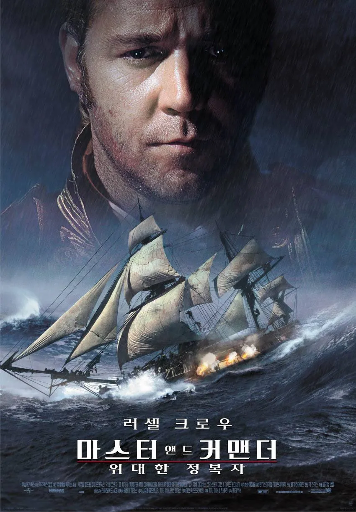
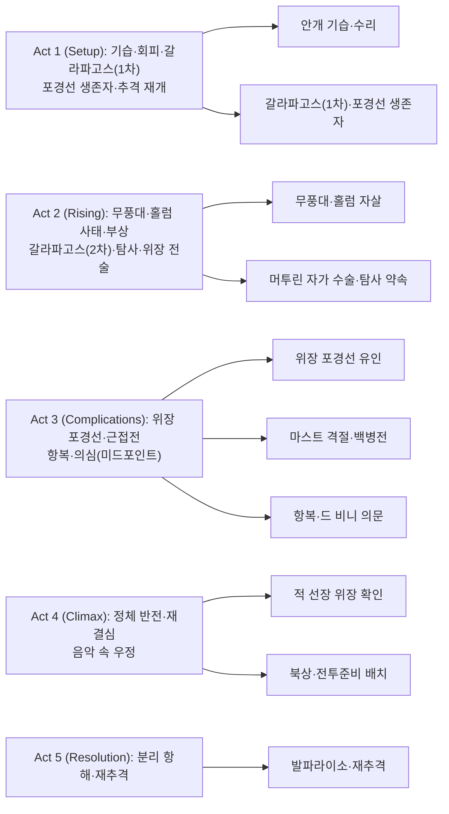

바다의 바람과 포성, 현악의 울림으로 기억되는 해양 활극의 정점. ‘Master and Commander: The Far Side of the World’는 임무와 우정, 전술과 호기심이 충돌하는 순간들을 압도적인 사운드·촬영으로 밀착 체감하게 한다. 잭 오브리와 스티븐 머투린의 상보적 관계를 통해 ‘배=영국’이라는 은유가 살아나고, 갈라파고스의 경이는 전쟁의 소음 사이로 조용한 질문을 던진다. 아래 글은 장면 단위로 그 긴장과 여운을 따라가며, 리얼리즘과 지성의 균형이 어떻게 이 작품을 클래식으로 만들었는지 추적한다.

## 개요

### 영화 정보
* 제목: Master and Commander: The Far Side of the World / (국내 배급명) 마스터 앤드 커맨더: 위대한 정복자
* 감독: 피터 위어 (Peter Weir)
* 주연: 러셀 크로우, 폴 베타니, 제임스 다시, 맥스 퍼키스 외
* 장르: 어드벤처, 전쟁, 역사 드라마
* 상영시간: 138분
* 개봉일: 2003.11.14(미국) / 2003.11.28(대한민국)

### 추천 대상
* **해양 전술·함상 생활에 관심 있는 관객**: 당시 항해술·지휘·백병전의 리얼리즘 체감
* **인물 드라마 중심의 역사서사 선호자**: 오브리–머투린의 상보적 우정과 갈등
* **자연사·탐사 테마 애호가**: 갈라파고스 시퀀스의 경이와 과학적 호기심

---

## Plot-DeepDive (Act-first)

### Act 1 (Setup)

- [S01] 브라질 연안·새벽 안개 — '보이지 않는 적'의 첫 일격
  HMS 서프라이즈가 짙은 안개 속을 항해하던 새벽, 감시병이 기이한 선체 윤곽을 포착한다. 곧장 피격탄이 우현을 관통하고 함교가 아수라장이 된다. 오브리(목표: 생존·전열 재정비)는 수리반을 배치하고 연막으로 시야를 끊는다. 굉음과 파편, 비명 사이로 북소리와 함포 굉음이 중첩되며, 이 전투가 영화의 '음향 문법'을 규정한다.

- [S02] 안개 회피·응급 수리 — 귀항이냐 추격이냐
  선체가 찢긴 채 겨우 빠져나온 서프라이즈는 즉시 귀항하자는 의견과 '임무 계속' 의견으로 갈린다. 오브리는 "이 배는 영국이다("This ship is England.")"라며 임무 지속을 결심한다. 머투린(목표: 과학 탐사·탑승자 보호)은 무리수를 경계하지만, 오브리의 결단은 선원들의 사기를 묶는다. 다음 국면으로 인과가 연결된다.

- [S03] 미끼 뗏목 작전·야간 — 위장된 등대의 속임수
  갑판병들이 랜턴을 단 뗏목을 띄워 '부서진 배'로 보이게 만든다. Acheron의 주의를 분산시킨 사이, 서프라이즈는 돛과 타를 숨겨 반대 측으로 빠져나간다. 긴장과 안도의 감정 곡선이 교차하고, 파도와 삭구가 삐걱거리는 음향이 계획의 섬세함을 강조한다.

- [S04] 남하와 약속 — 갈라파고스로의 항로
  오브리는 Acheron 추격을 위해 남쪽 항로를 택하고, 머투린에게 "갈라파고스에 들르면 탐사 시간을 주겠다"고 약속한다. 이 약속은 두 사람의 신뢰를 보여주며, 이후 갈등과 화해의 씨앗이 된다.

- [S05] 갈라파고스 첫 도착 — 포경선의 잔해
  서프라이즈는 갈라파고스에 도착하고, 불에 탄 영국 포경선의 생존자들을 발견한다. 생존자들은 Acheron에 습격당했다고 증언하며, Acheron이 근해에 있음을 알린다. 오브리는 머투린에게 약속한 탐사 시간을 미루고 즉시 추격을 재개한다.

- [S06] 케이프 혼 접근 — 혹한의 훈육
  남대서양의 회오리바람과 파고가 선체를 때린다. 오브리는 빙우와 폭풍을 뚫고 우회 항로를 강행하고, 풋내기들은 돛대 꼭대기에서 공포를 배운다. 드럼·현악이 섞인 음악이 "항해는 전투"라는 주제를 가시화한다.

### Act 2 (Inciting & Rising)

- [S07] 무풍대 — 미신과 불안의 확산
  바람이 사라지자 선내는 눅눅한 더위와 침묵으로 채워진다. 선원들은 견습사관 홀럼을 '요나'라 수군거리고, 일부는 공개적으로 부딪힌다. 오브리는 규율을 위해 처벌을 명하고, 머투린은 '집단 심리의 위험'을 경고한다. 압력이 높아질수록 이후 참극의 원인이 축적된다.

- [S08] 홀럼의 붕괴 — 바다로의 퇴장
  반복되는 질책과 조롱 끝에, 홀럼은 야간 갑판에서 무력하게 선체를 내려다본다. 그는 무리를 벗어나 바다로 몸을 던지고, 모두는 침묵 속에 시신 없는 장례를 치른다. 슬픔·죄책감·안도의 뒤섞인 감정이 바람의 귀환과 맞물려 선원들의 태도가 달라진다.

- [S09] 총기 사고 — 의도치 않은 총탄
  해병대 하워드 대위와의 들새 사냥 중, 머투린이 오발에 맞아 복부에 부상을 입는다. 오브리는 즉시 의료반을 꾸리지만, '섬에서 수술해야 더 안전하다'는 판단이 내려진다. 의술의 차분한 리듬과 대비되는 배의 진동음이 시청각 대비를 만든다.

- [S10] 갈라파고스 복귀 — 자가 수술의 결기
  갈라파고스로 돌아온 서프라이즈. 머투린은 거울을 세우고, 마취와 지혈을 최소화한 채 스스로 복부에서 탄환을 꺼낸다. 오브리는 선실 밖을 지키며 그를 신뢰하고, 배 안팎은 정적에 잠긴다. '과학자이자 군의'라는 머투린의 정체성이 극명해진다.

- [S11] 자연사의 유혹 — 약속의 이행
  오브리는 회복 중인 머투린에게 "며칠간 탐사를 허락하겠다"며 이전 약속을 이행한다. 머투린은 날지 못하는 가마우지와 대벌레, 거북을 채집·기록하며 환희를 맛본다. 음악은 보케리니 '마드리드의 밤의 음악'으로 이어지고, 전장에서 일상으로 넘어가는 감정의 쉼표가 놓인다.

- [S12] 보호색의 통찰 — 위장 전략의 실마리
  머투린은 대벌레의 보호색을 관찰하다가 위장의 원리를 오브리에게 설명한다. 오브리는 "배를 포경선처럼 보이게 하자"는 전술로 전환한다. 과학과 전술이 접속하는 순간이며, 두 사람의 '차이'가 '협력'으로 변한다. 탐사 중 Acheron을 다시 발견하여 추격을 재개한다.

- [S13] 위장 포경선 — 유인과 접근
  너덜너덜한 돛, 늘어진 로프, 무기 없는 갑판으로 서프라이즈를 꾸민다. 바다 안개가 깔린 오후, Acheron은 먹잇감에 접근하듯 다가온다. 침묵 속 심장 박동 같은 타악이 들리고, 사수들이 대기한다.

### Act 3 (Complications — Midpoint 포함)

- [S14] 포격 개시 — 마스트 절단
  가까워진 순간, 오브리는 "사정거리 진입!"을 외치며 일제사격을 명한다. Acheron의 돛대가 부서지고, 파편·로프·천이 하늘을 메운다. 오브리는 "접현 준비, 전원 전투 배치!"로 백병전을 준비한다.

- [S15] 선내 돌입 — 혼전과 결속
  두 배가 맞붙자 함상은 연기와 포말로 뒤덮인다. 해병과 수병들이 일제히 건너붙고, 피와 물이 섞인 갑판 위에서 칼부림이 벌어진다. 블레이크니와 소년 사관들은 훈련받은 냉정으로 명령을 전달하며, 성장의 순간을 맞는다.

- [S16] 머투린의 차분 — 부상자 처치와 사기 유지
  머투린은 부상자들의 동맥을 집어 봉합하고, 공포로 굳은 병사에게 "숨을 맞추게"라며 손을 잡아준다. 의무실의 촛불과 쇳소리, 외부의 함성과 포성이 대비된다. 그의 존재감은 전투의 이성적 중심이다.

- [S17] 선실 제압 — 항복의 검
  오브리가 이끄는 돌격조가 선실을 제압하고, 프랑스측은 항복을 표한다. '선의 드 비니'가 항복의 검을 건네며, 적장의 사망을 알린다. 승전의 환호 대신 무거운 호흡과 피로가 공간을 채운다.

- [S18] 전리품과 수리 — 두 배의 나란한 항해
  승조원들은 파손을 수리하고 포로를 관리한다. 풀링스는 임시로 Acheron의 지휘를 맡아 발파라이소로의 예인을 준비한다. 음악은 잦아들고, 도구와 방울 소리, 돛의 바스락거림이 돌아온 일상을 암시한다.

- [S19] 미세한 모순 — 이름의 단서
  선실 대화 중 머투린은 "드 비니는 몇 달 전에 죽었다"는 사실을 건넨다. 오브리의 시선이 흔들리고, 항복 당시 미묘한 위계와 말투를 떠올린다. 작은 의심이 다시 '추격'의 불씨가 된다(미드포인트 전환).

### Act 4 (Climax)

- [S20] 정체의 반전 — 선의가 아니라 선장
  오브리는 보고와 명부를 대조하며, 항복을 주도한 자가 사실상 아케론의 선장임을 확신한다. 적은 '의사의 외피'로 자신을 숨겼고, 진짜 선의는 이미 전사했다. 속임수는 속임수로 파훼된다는 아이러니가 드러난다.

- [S21] 북상 명령 — 다시, 전투준비 배치
  오브리는 북쪽으로의 급선회를 명하고 "전원 전투 준비!"를 외친다. 선원들의 얼굴에는 피로 속 결연이 서리고, 북소리가 다시 울린다. 머투린은 씁쓸한 미소로 "그 새를 찾으려면 시간은 많다. 날지 못하니까."라는 농을 듣는다.

- [S22] 지휘의 고독 — 책임과 우정
  선실에서 둘은 조용히 합주한다(바이올린·첼로). 오브리는 국가와 선원의 생명을 짊어진 결정을 되뇌고, 머투린은 자연과 인간 사이의 균형을 반추한다. 음악은 말보다 많은 것을 전한다.

### Act 5 (Resolution)

- [S23] 발파라이소로 — 분리 항해의 여운
  풀링스는 Acheron을 이끌고 발파라이소로 향하고, 서프라이즈는 그 뒤를 쫓아 북상한다. 갑판에는 바람이 돌아온다. 바다 위 두 선박의 거리가 다시 줄어드는 원샷이 끝내지 못한 추격의 지속을 암시한다.

---

### 핵심 대사 인덱스
"This ship is England." — 잭 오브리, [S02]; 사명·정체성
"To wives and sweethearts. May they never meet." — 건배사, [S22]; 유머·전우애
"Surprise is on our side." — 잭 오브리, [S13]; 기만·전술
"It's not going anywhere." — 잭 오브리(머투린에게), [S21]; 갈라파고스·여운
"Name a greater act of piracy than a Frenchman bearing a surgeon's coat." — 함내 대화 변주, [S20]; 위장·반전

---

## 구조 분석(보조 도식)

## 캐릭터 분석

### 잭 오브리 — 지휘·책임·전술적 상상력
- 목표: 임무 완수(프랑스 사략선 무력화)와 승조원 생존의 균형.
- 대비: 감정의 동요를 감춘 결단력 vs 자연·과학을 향한 머투린의 성찰.
- 전환: 보호색 전술 수용으로 ‘완고한 함장’에서 ‘학습하는 지휘관’으로 확장.

### 스티븐 머투린 — 과학자의 양심과 선의의 태도
- 목표: 생명 보호·자연 탐사(갈라파고스)·전쟁의 이성적 관리.
- 기능: 전술 아이디어의 촉매(보호색), 서사의 도덕적·철학적 준거.
- 상징: 거울 앞 자가 수술 — 냉정한 의지와 과학적 호기심의 합.

### 홀럼 — 미신과 집단 심리의 희생양
- 역할: 항해 공동체의 불안과 규율의 경계가 낳은 비극.
- 의의: ‘사기 관리’가 전술만큼 중요한 이유를 보여주는 서브플롯.

### 블레이크니/풀링스 — 성장과 승계의 얼굴
- 블레이크니: 절단의 상처를 안고도 명령을 수행하는 소년 장교의 성숙.
- 풀링스: 전리품 지휘를 맡아 독립된 판단을 수행하는 장교로의 도약.

## 영상미와 음악

### 시각 효과 / 촬영 / 미학

촬영감독 Russell Boyd는 자연광과 핸드헬드 카메라 워크를 결합해 범선 위 생활의 촉각적 리얼리즘을 구현했다. 실물 크기 HMS Surprise 레플리카와 거대 수조를 활용한 촬영은 CGI 의존을 최소화하고, 파도·바람·돛의 움직임을 물리적으로 체감 가능하게 만든다.

**색감과 구도**:
- 해무의 회청색, 목재 갑판의 갈색, 혈흔의 붉은색이 선명하게 대비된다.
- 좁은 선실의 밀폐감과 광활한 대양의 개방감을 프레이밍으로 교차 배치해 심리적 압박과 해방을 시각화.
- 포격 장면에서 파편·로프·천 조각이 날리는 물리적 사실성은 스턴트와 특수효과의 정교한 조합.

**촬영 기법**:
- 함상 전투 시 흔들리는 카메라는 관객을 승조원 시점으로 밀어 넣는다.
- 갈라파고스 시퀀스는 고정 샷과 긴 테이크로 전환되어 전쟁과 탐사의 리듬 차이를 강조.

**미장센**:
- 선실 내부의 랜턴 조명, 해먹과 대포 사이를 누비는 동선, 의무실의 촛불은 18-19세기 함상 생활의 고증을 충실히 따른다.

### 음악감독의 음악

Iva Davies, Christopher Gordon, Richard Tognetti가 공동 작곡한 음악은 바로크 실내악과 영화 음악의 경계를 넘나든다.

**주요 특징**:
- **보케리니 '마드리드의 밤의 음악' (Boccherini - Musica notturna delle strade di Madrid)**: 오브리와 머투린의 바이올린·첼로 듀엣 장면에서 사용되며, 두 인물의 상보적 관계와 우정을 대사 없이 전달하는 핵심 장치.
- **현악 + 타악기 조합**: 항해의 리듬(삭구 소리, 파도 소리)과 전투의 긴장(북·포성)을 음악적으로 재현.
- **음향 디자인과의 조화**: 음악이 환경음(바람, 물, 목재 삐걱임)과 유기적으로 결합되어, 배 자체가 하나의 악기처럼 울린다.

**서사적 기능**:
- 전투 장면에서는 타악기 중심의 긴박한 리듬.
- 갈라파고스 탐사에서는 현악의 서정적 선율로 전환.
- 선실 합주 장면은 지휘관의 고독과 과학자의 성찰을 '말 없는 대화'로 승화.

음악은 단순한 배경이 아니라, 캐릭터의 내면과 해양 환경의 장엄함을 동시에 표현하는 서사적 중심축이다.

## 비교/의미/비하인드

- **의미**: 전쟁·과학·우정이 바다라는 거대한 환경에서 서로를 견제·보완한다. ‘배=영국’이라는 등식은 공동체와 책임의 압박을 함장의 어깨로 닦아세운다.
- **리얼리즘**: 실제 범선·거대 수조·현장 음향을 결합해 함상 생활을 촉각적으로 재현. 포성·쇄목음·바람소리가 캐릭터 심리를 전한다.
- **원작 관계**: 여러 권을 결합하되, 시점을 1805년으로 당겨 역사·정치 맥락 설명을 최소화. 적선 변경은 극적 선명도를 위한 영화적 선택.
- **수상/흥행**: 아카데미 10개 부문 후보, 촬영상·음향편집상 수상. 전세계 흥행 $211.6M로 고비용 역사 활극의 기준점을 세움.

## 종합 평가

- 평점: ★★★★☆ (4.5/5)
- 한 줄 평: 바다의 장엄함과 인간의 지성이 맞물릴 때, 역사 활극은 철학이 된다.
- 관람 전 체크: 전투 장면의 밀도는 높지만, 서사의 쾌감은 인물·소리·공간 감각에서 온다.

## 참고 문헌 / 출처

- [Master and Commander: The Far Side of the World — Wikipedia](https://en.wikipedia.org/wiki/Master_and_Commander:_The_Far_Side_of_the_World)
- [Master and Commander: The Far Side of the World (2003) — IMDb](https://www.imdb.com/title/tt0311113/)
- [Master and Commander: The Far Side of the World — Box Office Mojo](https://www.boxofficemojo.com/release/rl2439218689/)
- [Master and Commander: The Far Side of the World — RogerEbert.com Review](https://www.rogerebert.com/reviews/master-and-commander-the-far-side-of-the-world-2003)
- [Master and Commander Review — The Guardian](https://www.theguardian.com/film/article/2003/nov/21/master-and-commander-the-far-side-of-the-world-review)
- [Master and Commander — AllMovie](https://www.allmovie.com/movie/master-and-commander-the-far-side-of-the-world-am4070)
- [마스터 앤드 커맨더 위대한 정복자 리뷰 명대사 — 네이버 블로그](https://blog.naver.com/booknonnod/223730740289)

