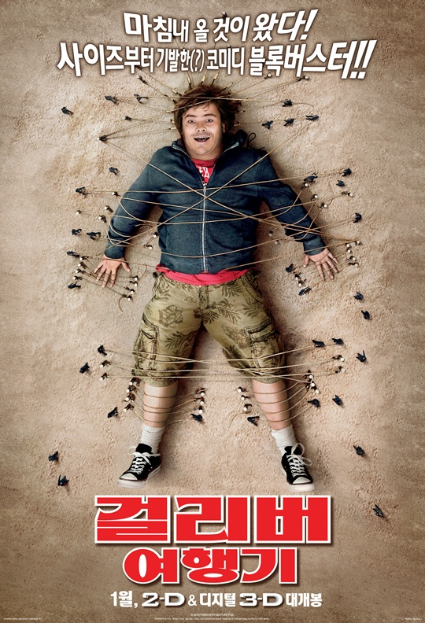
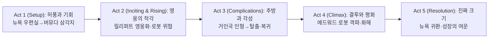

||
|:---:|
||

## 개요

### 영화 정보
* 제목: Gulliver's Travels / 걸리버 여행기 (2010)
* 감독: Rob Letterman
* 주연: Jack Black, Jason Segel, Emily Blunt, Amanda Peet, Billy Connolly, Chris O’Dowd, James Corden, T.J. Miller, Catherine Tate
* 장르: 가족, 코미디, 어드벤처, 판타지
* 등급: PG | 상영시간: 85분
* 개봉일: 2010.12.25(미국) | 배급: 20th Century Fox | 음악: Henry Jackman
* 제작비/흥행: $112M / $237.4M(WW)

### 추천 대상
* **가족 관객**: ‘소인국/거인국’의 물리적 대비에서 발생하는 순한 유머와 가벼운 모험을 찾는 관객
* **잭 블랙 팬 중 라이트 톤 선호층**: 특유의 에너지·슬랩스틱은 유지하되, 과격함보다는 착한 유머가 많은 작품
* **원작 캐주얼 감상층**: 스위프트의 원전 풍자보다 현대 패러디·관계 회복 서사를 선호하는 관객

## 구조 분석(Act-first 보조 도식)

## Plot-DeepDive (Act-first, [S01]~[S25])

참고 출처: Wikipedia — Gulliver's Travels (2010 film) (https://en.wikipedia.org/wiki/Gulliver%27s_Travels_(2010_film))

### Act 1 (Setup)

> 질문: ‘크기’가 아닌 ‘책임’은 어떻게 증명되는가. 리스크: 허풍의 들통, 타인의 신뢰 손상.

[S01] 뉴욕·신문사 우편실 — ‘작은 자리’에 갇힌 일상과 욕망의 발화
걸리버는 10년째 우편실에서 일하며, 여행 부서의 다르시를 동경만 한다. 그는 자신이 작고 보잘것없다고 느끼며 변화의 계기를 찾지 못한다. 우연히 대화를 나눌 기회가 오자, 그는 ‘여행가’로서의 경험을 과장한다. 허풍은 기회를 만들었지만 동시에 덫이 된다. 관객은 그의 ‘내적 결여’를 첫 장면에서 파악한다.

[S02] 맨해튼·야간 거리 — ‘가능성’이라는 유혹과 거짓의 첫걸음
다르시는 버뮤다 삼각지 전설을 취재해 오라고 제안한다. 걸리버는 자신이 해낼 수 있다는 근거 없는 자신감을 스스로 주입하고, 밤새 다른 글을 표절해 초고를 제출한다. 포장된 자기소개와 표절 원고는 타인의 호의를 이끌지만, 그는 실제 항해 경험이 없다. 작은 거짓이 큰 여정을 부른다.

[S03] 대서양·버뮤다 삼각지 — 폭풍과 표류, 우연이 만든 이세계 도착
홀로 보트를 몰던 그는 워터스파우트에 휘말려난 뒤 해변에 나뒹군다. 카메라는 수평선을 낮게 두고 그의 무력감을 부각한다. 깨어난 걸리버는 사방에서 당기는 가는 밧줄과 말총 같은 줄들을 목격한다. 수십 명의 소인들이 그를 ‘짐승’으로 호명하며 포박한다. 인간의 ‘크기’가 곧 ‘위험’으로 호명되는 첫 대면이다.

[S04] 릴리퍼트·동굴 감옥 — 타자와의 접촉, 동맹의 씨앗
왕국은 거인 포로를 엄중히 가둔다. 그곳에서 걸리버는 죄수 호레이쇼를 만나 메리 공주 이야기를 듣는다. 그는 소인들의 언어·질서에 서툴지만, 호레이쇼의 진심에 움직인다. 단지 크기만으로 위협으로 간주되는 경험은, 그에게 ‘존재 증명’의 강박을 키운다. 동맹은 연민에서 시작한다.

[S05] 성곽·낮 — 공주 구출과 화재 진압, 영웅 만들기의 메커니즘
블레푸시아의 공주 납치 기도와 왕궁 화재가 연달아 발생한다. 걸리버는 단숨에 뛰어들어 공주를 구하고, 소변으로 화재를 꺼 왕의 목숨을 구한다. 영웅서사는 빠르게 구축된다. 왕국은 그에게 집과 칭호를 내리고 잔치를 연다. 허풍을 섞은 자기소개가 ‘대통령’ 급으로 뻥튀기된다.

### Act 2 (Inciting & Rising)

> 질문: ‘허풍의 영광’은 얼마만에 부채가 되는가. 리스크: 질투의 반동, 외부 위협의 실체화.

[S06] 왕궁·연회장 — 허영의 확대 재생산과 관계의 비대칭
걸리버는 자신을 ‘맨해튼 대통령’이라 소개하고, 뉴욕을 신화처럼 묘사한다. 그는 다르시와의 로맨스까지 과장하며 궁정의 환호를 산다. 호레이쇼는 그런 허풍이 장차 무너질 기둥임을 경고한다. 메리 공주는 그에게서 성실함과 허세를 동시에 본다. 영웅은 동시에 허풍쟁이다.

[S07] 해안 포대 — 방어 체계 붕괴와 침공, ‘몸빵’의 한계
질투에 사로잡힌 총사령관 에드워드는 방어 장치를 일부러 멈춘다. 블레푸시아 함대가 진격하고, 걸리버는 신체를 방패 삼아 포탄을 막아낸다. 승리는 값싸 보이지만 손상은 누적된다. 왕국은 영웅을 찬양하나, 군 내부의 균열은 깊어진다. 방어는 관계의 문제이기도 하다.

[S08] 작업실·비밀 설계 — 반역의 가속, 거대 로봇의 설계도
에드워드는 걸리버의 게임 매뉴얼(‘Guitar Hero III’)에서 아이디어를 얻어 거대 로봇을 설계한다. 그는 블레푸시아에 망명해 도면을 넘긴다. 기술은 질투와 결합해 파괴가 된다. 호레이쇼는 공주의 마음이 에드워드에서 떠났음을 직감한다. 위협은 눈에 보이는 형태로 다가온다.

[S09] 광장·낮 — 정체 폭로와 추락, ‘우편실 직원’의 실체
에드워드의 공작으로 걸리버의 허풍이 만천하에 드러난다. 군중은 실망하고, 메리는 침묵한다. 왕국은 그를 명예에서 끌어내려 조롱 대상으로 삼는다. 걸리버는 스스로를 ‘작은 존재’라 자학하며 도망치고 싶어진다. 허풍의 대가는 사회적 추방으로 이어진다.

[S10] 해안·추방식 — ‘가지 못할 섬’으로의 유형, 고립의 시작
에드워드는 거대 로봇을 앞세워 군중 앞에서 걸리버에게 “난 우편실 직원일 뿐”이라고 자백을 강요하고, 그를 브롭딩낵으로 추방한다. 걸리버는 배에 실려 파도 속으로 사라진다. 광장은 조용해졌지만, 왕국의 불안은 가라앉지 않는다. 호레이쇼만이 끝까지 그의 변화를 믿으려 한다. 신뢰는 현실의 유일한 밧줄이다.

### Act 3 (Complications)

> 질문: ‘작아짐’은 어떤 자각을 선물하는가. 리스크: 모욕·자존의 붕괴, 구조 실패.

[S11] 브롭딩낵·인형의 집 — 거인의 아이와 인형, 수치심의 연출
걸리버는 거인 소녀 글룸달클리치에게 잡혀 분홍 드레스를 입고 인형의 집에 갇힌다. 그는 무력한 장난감으로 취급되며, ‘크기는 상대적’임을 뼈저리게 느낀다. 동화적 장식은 모욕의 무대를 미화한다. 한편 에드워드는 릴리퍼트를 ‘뉴 블레푸시아’로 개명하려 든다. 그는 스스로를 합리화하려 하나 당장의 탈출 수단이 없다. 내적 독백이 처음으로 정직해진다.

[S12] 인형의 집·비밀 공간 — 낙하산의 발견, 계획의 원형
낡은 미군 조종사의 유해 옆에서 낙하산을 발견한다. 소품은 ‘탈출’과 ‘구조’의 이중 상징이 된다. 그는 소녀의 틈을 노려 탈출 루트를 계산한다. 그러나 릴리퍼트로 돌아가도 과오를 바로잡을 수 있을지 회의한다. 구원이 먼저인지, 사과가 먼저인지가 그를 괴롭힌다.

[S13] 숲 가장자리 — 호레이쇼와의 재회, 구조 요청
호레이쇼는 메리에게 외면당한 뒤에도 친구를 찾아 나선다. 그는 다르시가 블레푸시아에 억류되었음을 전한다. 걸리버는 ‘허풍’이 아니라 ‘책임’으로 돌아가야 함을 깨닫는다. 두 사람은 함께 귀환 루트를 정한다. 동맹은 이제 연대다.

[S14] 절벽 가장자리 — 귀환 결심, 현실의 두려움과 합의
걸리버는 실패의 두려움을 인정하고, 그럼에도 돌아가겠다고 말한다. 호레이쇼는 공주의 신뢰를 되찾을 방법을 묻는다. 그는 ‘사과와 행동’이 답이라고 답한다. 낙하산의 끈을 조정하며, 그는 처음으로 준비된 표정을 짓는다. 성장의 문법이 허풍에서 책임으로 바뀐다.

[S15] 해안·밤 — 바람의 창, 탈출 실행
해류와 풍향을 맞춘 그는 인형의 집을 빠져나온다. 달빛과 파도 소리가 긴장감을 키운다. 낙하산이 밤하늘에 펼쳐지는 순간, 카메라는 작은 실루엣을 크게 잡는다. 그는 더 이상 ‘거대한 몸’이 아니다. 책임의 무게가 그를 키운다.

### Act 4 (Climax)

> 질문: 명예 회복은 개인의 승리인가, 공동체의 치유인가. 리스크: 결투 실패, 평화 파기.

[S16] 릴리퍼트·항구 — 귀환과 구조, 다르시와의 재회
걸리버는 블레푸시아에 억류된 다르시를 구해 항구로 복귀한다. 그는 대중 앞에서 자신의 허풍을 사과한다. 다르시는 ‘지금의 당신’을 본다며 미소 짓는다. 왕국은 그의 진심을 시험대에 올린다. 명예 회복은 말이 아니라 행동으로 채워져야 한다.

[S17] 광장·결투 선언 — 에드워드의 도발, 로봇과의 일대일
에드워드는 거대 로봇을 앞세워 결투를 신청한다. 걸리버는 도망치지 않고 맞서겠다고 한다. 그는 ‘몸빵’이 아닌 ‘전략’으로 승산을 찾는다. 호레이쇼는 전기 무기를 무력화할 방안을 모색한다. 연대는 개인의 약점을 메운다.

[S18] 해안절벽·전초 — 장비 분담, 역할의 명료화
걸리버는 상대의 시야를 끄는 미끼가 되고, 호레이쇼는 전원 차단을 맡는다. 메리는 시민 대피를 지휘한다. 왕과 왕비는 선전포고를 고민하지만, 걸리버는 평화의 여지를 남겨달라 청한다. 전투는 싸움이자 설득이다.

[S19] 도시 외곽·결투 개시 — 충돌과 타이밍, 전환의 순간
로봇의 전기가 번쩍이며 싸움이 시작된다. 걸리버는 돌과 나무를 이용해 높이를 바꾸며 시간을 번다. 호레이쇼가 차단에 성공하자, 로봇은 잠시 멈칫한다. 그는 기다렸다는 듯 관절부를 끊어 넘어뜨린다. 힘이 아닌 타이밍의 승리다.

[S20] 성문 앞 — 인질 위협과 자가 구원, 메리의 주체성
에드워드는 메리를 인질로 위협한다. 메리는 주먹으로 그를 제압해 인질극을 스스로 무너뜨린다. 공주는 구원의 대상이 아니라 행위의 주체임을 증명한다. 걸리버는 뒤에서 그의 결단을 지지한다. ‘영웅’은 때로 뒤로 물러서는 법을 배운다.

[S21] 왕궁·평화 제안 — 처형 명령과 반대, 노래로 잇는 합의
왕은 분노 속에 블레푸시아 전원 처형을 명한다. 걸리버는 전쟁을 멈추자고 설득하며, 모두가 아는 노래 ‘War’를 읊조리며 광장을 웃게 만든다. 피로 물들일 이유가 사라지는 순간, 광장은 다시 축제가 된다. 에드워드는 권좌에서 밀려난다. 승리는 파괴가 아니라 중재의 결과다.

### Act 5 (Resolution)

> 질문: 진짜 ‘크기’는 무엇으로 측정되는가. 리스크: 없으나, 다음 항해의 책임이 남는다.

[S22] 항구·아침 — 귀환 준비, ‘거짓 없는 여행기’의 예고
걸리버와 다르시는 수리된 배에 오른다. 그는 더 이상 자신을 ‘대통령’이라 부르지 않는다. 다르시는 그가 쓸 여행기를 기대한다고 말한다. 두 사람은 바람을 향해 손을 흔든다. 다음 여정은 솔직함 위에 세워질 것이다.

[S23] 뉴욕·카페 — 여행기자의 탄생, 관계의 전환
걸리버는 우편실 대신 정식 여행기자로 복귀해 원고를 보낸다. 그는 다른 취재를 마치고 돌아온 뒤 다르시를 점심에 초대한다. 카메라는 작은 책상 위의 원고를 크게 잡는다. 크기는 마음의 크기로 환치된다.

## 핵심 대사 인덱스
"I’m just the guy from the mailroom." — 걸리버, [S09]; 자기 인정·전환
"We don’t need a war to be one nation." — 걸리버, [S21]; 중재·평화
"You don’t have to be big to be brave." — 메리, [S20]; 주체성

## 캐릭터 분석

### 걸리버 — 허풍에서 책임으로
- 개요: ‘작은 자리’에서 허풍으로 도약했으나, 실패와 추방을 거쳐 ‘책임’으로 성장한다.
- 성장 곡선: 허풍(Setup) → 영웅 착각(Rising) → 모욕·각성(Complications) → 중재자(Climax) → 성찰(Resolution)
- 상징: 밧줄/낙하산 — 얽매임과 해방, 타인과의 연결을 동시에 뜻한다.

### 다르시 — 관찰자에서 동반자로
- 개요: 냉정한 에디터에서, 진실을 지지하는 파트너로 이동한다.
- 역할: 허풍을 거르는 필터, 성장의 증인, 귀환 후 ‘언어’로 완성되는 사랑의 축

### 메리 — 구원 대상에서 행위 주체로
- 개요: 공주로서의 위엄과 실천을 겸비, 결투 국면에서 스스로를 구한다.
- 역할: 타인의 구원이 아닌 자기 구원의 가능성 제시, 로맨스의 균형점

### 호레이쇼 — 신뢰의 끈
- 개요: 가장 작은 자가 가장 큰 용기를 낸다. 끝까지 친구를 찾아 나서는 연대의 표상.
- 역할: 계획의 보조가 아닌 결단의 동반자, 전투 승리의 실질적 공헌자

### 에드워드 — 질투의 기술자
- 개요: 질투와 허영이 결합된 반역자. 거대 로봇은 마음의 빈자리를 키운 결과물.
- 역할: ‘힘’ 중심의 해결이 얼마나 공허한지 대비시키는 거울

## 비교·의미·비하인드
- 비교: ‘걸리버 여행기’의 정치풍자를 가족 코미디로 재배치 — 원작의 날카로움은 약해졌지만, 접근성은 높아졌다.
- 의미: ‘크기’의 재정의 — 물리적 거대함이 아닌, 실수를 인정하고 평화를 선택하는 용기.
- 비하인드: 3D 변환, 블렌하임 궁 촬영, 인형의 집 세트·미니어처 활용, 오프닝 단편 ‘Scrat’s Continental Crack-Up’ 동반 상영.

## 종합 평가

**평점**: ★★☆ (3/5)

**한 줄 평**: 큰 몸·작은 마음으로 시작해, 작은 몸·큰 책임으로 끝나는 잭 블랙의 라이트급 성장담.

## Entities Glossary (한영 병기)
- Lemuel Gulliver — 레뮤얼 걸리버
- Darcy Silverman — 다시 실버먼
- Horatio — 호레이쇼
- Princess Mary — 메리 공주
- King Theodore — 테오도어 왕
- General Edward (Edwardian) — 에드워드 장군
- Glumdalclitch — 글룸달클리치
- Lilliput — 릴리퍼트(소인국)
- Blefuscia — 블레푸시아(영화판 명칭)
- Brobdingnag — 브롭딩낵(거인국)
- New York City — 뉴욕
- Bermuda Triangle — 버뮤다 삼각지대
- Rob Letterman — 로브 레터맨
- Henry Jackman — 헨리 잭맨
- 20th Century Fox — 20세기 폭스

## Sources
- [R1] [Gulliver's Travels (2010 film) — Wikipedia](https://en.wikipedia.org/wiki/Gulliver%27s_Travels_(2010_film))
  - Facts: Rob Letterman 감독, 85분, $112M 제작비, 월드와이드 $237.4M, 현대 배경의 느슨한 각색(Part One 중심)
  - Entities: Jack Black, Jason Segel, Emily Blunt, Amanda Peet, Billy Connolly, Lilliput, Blefuscia, Brobdingnag
  - Conflicts: ‘Blefuscu’ vs ‘Blefuscia’ 표기 차이(영화판 내 명칭 변경)
- [R2] [Gulliver's Travels (2010) — Rotten Tomatoes](https://www.rottentomatoes.com/m/gullivers-travels-2010)
  - Facts: Tomatometer 19%, Audience 27%, 등급 PG, 개봉 2010-12-25(미국)
  - Entities: Critics Consensus, rating breakdown
  - Conflicts: 비평 혹평 대비 가족 타깃 만족도는 일부 유지
- [R3] [Gulliver's Travels — Box Office Mojo](https://www.boxofficemojo.com/release/rl4200039937/)
  - Facts: Domestic $42.8M / International $194.6M / WW $237.4M, Opening $6.3M(2,546개관)
  - Entities: Runtime 1h 25m, MPAA PG
  - Conflicts: 없음(수치 합치)
- [R4] [Gulliver's Travels (2010) — Roger Ebert](https://www.rogerebert.com/reviews/gullivers-travels-2010)
  - Facts: 별점 3/4, 가족 관객에게 어필, 실사 3D·효과 지적, ‘Scrat’s Continental Crack-Up’ 단편 동반 상영 언급
  - Entities: Jack Black, Amanda Peet, Emily Blunt, Lilliput
  - Conflicts: 대체로 혹평 속 비교적 호의적 시각
- [R5] [Gulliver’s Travels — The Hollywood Reporter](https://www.hollywoodreporter.com/movies/movie-reviews/gullivers-travels-movie-review-64984/)
  - Facts: 효과 과잉·서사 빈약 지적, 어린이용 오락성은 유지, 2010-12-25 개봉
  - Entities: Chris O’Dowd, Catherine Tate, 20th Century Fox, 3D 변환
  - Conflicts: 가족 코미디로서의 유효성 vs 원작 풍자성 약화
- [R6] [걸리버 여행기(2010) — 나무위키](https://namu.wiki/w/%EA%B1%B8%EB%A6%AC%EB%B2%84%20%EC%97%AC%ED%96%89%EA%B8%B0(2010))
  - Facts: 한국어 제목·배우·줄거리 요약 및 반응 정리
  - Entities: ‘릴리퍼트/거인국’ 등 한글 표기 관용형
  - Conflicts: 일부 표기·해석 차이(영문 위키와 병행 검증)
- [R7] [Gulliver's Travels (2010) — IMDb](https://www.imdb.com/title/tt1320261/)
  - Facts: 캐스트·크루 상세, 기술 스펙, 릴리스 정보
  - Entities: 전체 출연진/제작진 목록
  - Conflicts: 없음(메타데이터 보강 용도)

