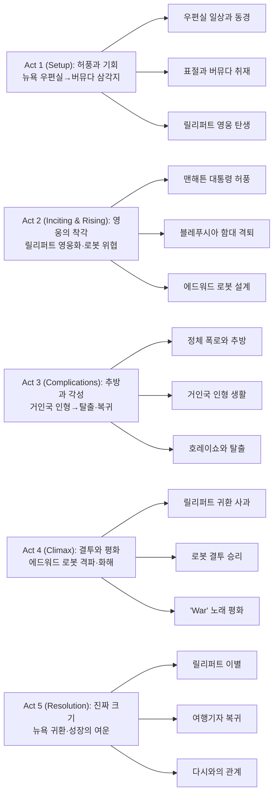

||
|:---:|
||

## 개요

### 영화 정보
* 제목: Gulliver's Travels / 걸리버 여행기 (2010)
* 감독: Rob Letterman
* 주연: Jack Black, Jason Segel, Emily Blunt, Amanda Peet, Billy Connolly, Chris O’Dowd, James Corden, T.J. Miller, Catherine Tate
* 장르: 가족, 코미디, 어드벤처, 판타지
* 등급: PG | 상영시간: 85분
* 개봉일: 2010.12.25(미국) | 배급: 20th Century Fox | 음악: Henry Jackman
* 제작비/흥행: $112M / $237.4M(WW)

### 추천 대상
* **가족 관객**: ‘소인국/거인국’의 물리적 대비에서 발생하는 순한 유머와 가벼운 모험을 찾는 관객
* **잭 블랙 팬 중 라이트 톤 선호층**: 특유의 에너지·슬랩스틱은 유지하되, 과격함보다는 착한 유머가 많은 작품
* **원작 캐주얼 감상층**: 스위프트의 원전 풍자보다 현대 패러디·관계 회복 서사를 선호하는 관객

## 구조 분석(Act-first 보조 도식)

## 영화의 전체 내용 (스포일러 포함)

《걸리버 여행기》는 뉴욕 신문사 우편실에서 10년째 근무하는 레뮤얼 걸리버가 허풍과 표절로 시작한 버뮤다 삼각지대 취재 여행에서 소인국 릴리퍼트와 거인국 브롭딩낵을 오가며 진정한 성장을 이루는 이야기다. 잭 블랙 특유의 코미디와 가족 친화적 모험이 결합된 이 작품은, '크기'가 아닌 '책임'으로 영웅이 증명된다는 메시지를 전한다.

### Act 1 (Setup)

> 질문: 허풍으로 얻은 기회는 진짜 성장으로 이어질 수 있는가. 리스크: 거짓의 들통, 타인의 신뢰 손상.

[S01] 뉴욕·신문사 우편실 — 정체된 일상과 동경의 시작
뉴욕의 한 신문사 우편실에서 10년째 근무하는 레뮤얼 걸리버(잭 블랙)는 매일 사내 메일을 배달하는 '보잘것없는' 남자다. 아침마다 피규어와 대화하는 오타쿠 스타일의 소심한 그는 사원들에게조차 말을 걸지 못한다. 그의 유일한 낙은 여행 저널리스트인 다시 실버만(아만다 피트)을 멀리서 바라보는 것이다. 감히 접근할 용기도, 자신감도 없다. 새로 취직한 부하 직원이 하루 만에 그의 상사로 발령받는 굴욕을 겪은 그날, 걸리버는 변화의 필요성을 절감한다.

[S02] 신문사·복도 — 허풍의 씨앗, 거짓말의 시작
궁지에 몰린 걸리버는 우연히 마주친 다시에게 자신이 평소 여행을 즐기고 기행문을 쓴다고 '구라 신공'을 펼친다. 다시는 관심을 보이며 그간 써온 글을 가져오라고 한다. 그날 밤 걸리버는 인터넷에서 여행 기사를 '짜집기 신공'으로 표절해 초고를 작성한다. 작가의 고뇌 따윈 없다. 복사·붙여넣기와 약간의 편집으로 완성된 가짜 포트폴리오는 다시를 깜짝 놀라게 만든다. 다시는 바쁜 자신을 대신해 버뮤다 삼각지대의 전설을 취재해달라고 제안한다. 걸리버는 내색하지 못하고 수락한다. 기회는 왔지만, 함정도 시작됐다.

[S03] 대서양·버뮤다 삼각지 — 폭풍과 표류, 이세계로의 입구
버뮤다로 향한 걸리버는 홀로 작은 보트를 렌트해 바다로 나간다. 항해 경험이 전무한 그는 조타석에서 졸아버린다. 잠든 사이 거대한 워터스파우트(물기둥)가 배를 휘감는다. 폭풍에 휘말린 배는 산산조각 나고, 걸리버는 파도 속으로 사라진다. 그가 깨어난 곳은 릴리풋(Lilliput)의 해안. 눈을 뜨자 사방에서 가는 밧줄이 팔과 다리를 묶고 있다. 수백 개의 말총 같은 밧줄. 그리고 손바닥만 한 사람들. 소인국의 시민들은 그를 '짐승(beast)'으로 여기며 경계한다. 걸리버의 거대한 몸은 위협 그 자체다.

[S04] 릴리퍼트·동굴 감옥 — 최초의 동맹자, 호레이쇼
왕국은 거인 포로를 동굴 감옥에 가둔다. 어둠 속에서 걸리버는 또 다른 죄수를 만난다. 호레이쇼(제이슨 시걸)는 릴리풋에서 가장 키가 큰 평민으로, 메리 공주(에밀리 블런트)를 사랑한다는 이유로 에드워드 장군(크리스 오다우드)에 의해 투옥된 인물이다. 에드워드는 메리와 결혼해 왕권을 손에 넣으려는 야심가였고, 호레이쇼는 그의 길에 방해가 되는 존재였다. 걸리버는 호레이쇼의 진심 어린 사연을 듣고 동질감을 느낀다. 두 사람은 '작은 존재'라는 공통점으로 연결된다.

[S05] 릴리퍼트·해안 — 영웅의 탄생, 화재와 납치 사건
그날 밤, 블레푸시아(Blefuscia, 릴리퍼트의 적대국)의 특공대가 메리 공주를 납치하려 침투한다. 걸리버는 감옥의 밧줄을 끊고 단숨에 뛰어들어 공주를 구출한다. 동시에 왕궁에 화재가 발생한다. 테오도어 왕(빌리 코놀리)과 왕비, 시민들이 위험에 처한다. 걸리버는 즉흥적으로 소변을 보아 불을 끈다. 왕의 목숨을 구한 것이다. 릴리퍼트 시민들은 환호한다. 왕은 그에게 특별한 저택과 명예 칭호를 수여한다. 잔치가 벌어지고, 걸리버는 하룻밤 사이에 '영웅'이 된다.

[S06] 왕궁·연회장 — 허풍의 증폭, '맨해튼 대통령'의 탄생
걸리버는 왕과 귀족들 앞에서 자신을 '맨해튼 대통령'이라 소개한다. 뉴욕을 신화적 대도시로 묘사하고, 다시와의 로맨스를 과장한다. 그는 자신이 거대한 빌딩을 소유하고 있으며, 수많은 부하를 거느리고 있다고 거짓말한다. 궁정 사람들은 그의 말에 넋을 잃는다. 호레이쇼는 친구에게 조심하라고 경고하지만, 걸리버는 즐거움에 취해 듣지 않는다. 메리 공주는 그에게서 진실과 허세를 동시에 감지하지만 아직은 의심하지 않는다. 에드워드 장군만이 질투의 눈빛으로 그를 노려본다.

### Act 2 (Inciting & Rising)

> 질문: 질투는 어떻게 기술과 결합해 파괴가 되는가. 리스크: 내부 반역, 외부 침공의 이중 위기.

[S07] 해안 포대 — 에드워드의 배신, 방어선 붕괴
에드워드는 걸리버의 인기가 날로 높아지고 메리가 자신에게서 멀어지자 복수를 결심한다. 그는 릴리퍼트의 해상 방어 시스템을 고의로 정지시킨다. 블레푸시아 해군이 기회를 놓치지 않고 대규모 침공을 시작한다. 전함들이 항구로 진격하고 포탄이 쏟아진다. 걸리버는 몸을 방패 삼아 앞으로 나간다. 포탄이 그의 가슴에 부딪치지만 거대한 그에게는 찰과상에 불과하다. 그는 적 함대의 밧줄을 잡아당겨 한꺼번에 무력화시킨다. 완승이다. 왕국은 다시 한번 그를 찬양하지만, 에드워드의 얼굴은 굳어있다.

[S08] 작업실·밤 — 반역의 청사진, Guitar Hero III의 비밀
수치심과 분노에 가득 찬 에드워드는 걸리버의 소지품을 뒤진다. 그곳에서 Guitar Hero III 게임 매뉴얼을 발견한다. 그 안에는 거대한 로봇의 삽화가 있었다. 에드워드는 영감을 받는다. 릴리풋의 소인들은 건축에 뛰어난 종족이다. 그는 도면을 베껴 그린 뒤, 밤을 틈타 블레푸시아로 망명한다. 적국의 왕에게 로봇 설계도를 넘기고, 조종사로 자원한다. 블레푸시아는 비밀리에 거대 변신 로봇 제작에 돌입한다.

[S09] 광장·낮 — 정체 폭로, 추락의 순간
며칠 뒤, 에드워드는 블레푸시아 군대와 함께 릴리퍼트 광장에 나타난다. 그 뒤로 거대한 로봇이 우뚝 서 있다. 그는 군중 앞에서 걸리버의 허풍을 낱낱이 폭로한다. 표절한 기사, 거짓 경력, 가짜 '맨해튼 대통령' 칭호. 모든 것이 거짓이었다. 에드워드는 걸리버에게 "난 그냥 우편실 직원일 뿐(I'm just the guy from the mail-room)"이라고 자백하게 만든다. 군중은 실망한다. 메리는 침묵한다. 왕은 분노한다. 걸리버는 스스로를 변명할 말을 찾지 못한다. 영웅은 순식간에 사기꾼으로 전락한다.

[S10] 해안·추방식 — 브롭딩낵으로의 유배
에드워드는 걸리버를 '가면 안 되는 섬(the island where we dare not go)', 브롭딩낵(Brobdingnag)으로 추방한다. 왕은 명령에 동의한다. 걸리버는 작은 배에 실려 파도 속으로 사라진다. 릴리퍼트는 조용해진다. 에드워드는 도시를 '뉴 블레푸시아(New Blefuscia)'로 개명하려 한다. 호레이쇼만이 친구를 믿으며 그를 찾으러 떠날 결심을 한다. 메리는 에드워드를 거부하지만, 그녀도 무력하다.

### Act 3 (Complications)

> 질문: 역전된 크기는 어떤 깨달음을 주는가. 리스크: 자존심 붕괴, 구조 실패, 친구의 고립.

[S11] 브롭딩낵·들판 — 거인의 나라, 인형이 된 걸리버
걸리버가 떠밀려 도착한 브롭딩낵은 모든 것이 거대한 세계다. 나무는 하늘을 찌르고, 풀잎은 그의 키만큼 크다. 거인 소녀 글룸달클리치(Glumdalclitch)가 그를 발견한다. 그녀에게 걸리버는 장난감에 불과하다. 소녀는 그를 집으로 데려가 분홍색 원피스와 머리띠를 입힌다. 걸리버는 인형의 집에 갇힌다. 그는 '시크릿 쥬쥬' 같은 인형 옷을 입고, 소녀의 거친 놀이에 시달린다. 자존심은 바닥에 떨어진다. 그제야 그는 릴리퍼트 사람들이 느꼈을 감정을 이해한다. 크기는 상대적이고, 힘은 맥락에 달려 있다.

[S12] 인형의 집·비밀 공간 — 미군 조종사의 유해, 탈출 수단의 발견
인형의 집 구석에서 걸리버는 낡은 미군 조종사의 해골을 발견한다. 그 옆에는 낙하산이 놓여 있다. 조종사는 과거 버뮤다 삼각지대에서 실종된 인물이었을 것이다. 걸리버는 낙하산을 탈출 수단으로 사용할 계획을 세운다. 그러나 릴리퍼트로 돌아가도 그를 받아줄까? 다시 조롱당하지 않을까? 그는 고민한다. 하지만 다르시와 호레이쇼의 얼굴이 떠오른다. 그는 더 이상 도망치지 않기로 결심한다.

[S13] 브롭딩낵·숲 가장자리 — 호레이쇼의 도착, 친구의 충성
놀랍게도 호레이쇼가 나타난다. 그는 메리에게 거부당한 뒤에도 친구를 찾아 브롭딩낵까지 온 것이다. 호레이쇼는 다르시가 블레푸시아에 억류되었다는 소식을 전한다. 그녀 역시 버뮤다 삼각지대에서 폭풍을 만나 릴리퍼트로 표류했고, 에드워드에게 사로잡혔다. 걸리버는 책임감에 눈을 뜬다. 이제 허풍이 아니라 행동으로 증명해야 할 시간이다. 두 사람은 함께 탈출 계획을 세운다.

[S14] 절벽·밤 — 낙하산 탈출, 릴리퍼트로의 귀환
걸리버는 소녀가 잠든 틈을 타 인형의 집을 빠져나온다. 호레이쇼와 함께 절벽으로 이동한 그는 낙하산을 펼친다. 바람이 불어오는 방향을 계산하고, 해류를 예측한다. 달빛 아래 두 사람은 공중으로 떠오른다. 낙하산은 천천히 바다 쪽으로 날아간다. 카메라는 작은 실루엣을 크게 잡는다. 걸리버는 더 이상 '거대한 몸'에 의지하지 않는다. 그는 이제 '책임의 무게'로 성장한다.

### Act 4 (Climax)

> 질문: 진짜 영웅은 힘이 아니라 무엇으로 증명되는가. 리스크: 결투 패배, 전쟁 재개, 평화 파괴.

[S15] 블레푸시아·감옥 — 다르시 구출, 진실의 고백
걸리버와 호레이쇼는 블레푸시아에 잠입해 다르시를 구출한다. 걸리버는 그녀에게 모든 진실을 고백한다. 자신이 우편실 직원이었던 것, 표절을 했던 것, 허풍을 떨었던 것. 다르시는 조용히 듣고 말한다. "지금의 당신이 중요해요." 걸리버는 위로받는다. 세 사람은 릴리퍼트로 향한다.

[S16] 릴리퍼트·광장 — 사과와 결투 선언
릴리퍼트 광장에 돌아온 걸리버는 군중 앞에 선다. 그는 사과한다. "저는 여러분께 거짓말을 했습니다. 하지만 이제는 진실로 싸우겠습니다." 에드워드는 거대 로봇을 앞세워 나타난다. "네가 이길 수 있을 것 같아?" 걸리버는 대답한다. "혼자서는 안 되겠죠. 하지만 친구들과 함께라면." 결투가 선언된다. 왕국은 숨죽인다.

[S17] 도시 외곽·결투 개시 — 전략과 타이밍의 전투
로봇의 전기 채찍이 번쩍인다. 걸리버는 돌과 나무를 이용해 높이를 바꾸며 시간을 벌어준다. 호레이쇼는 로봇의 전원부를 찾아 차단한다. 로봇이 잠시 멈칫한다. 걸리버는 기다렸다는 듯 로봇의 관절부를 끊어 넘어뜨린다. 에드워드는 조종석에서 비명을 지른다. 로봇은 무너진다. 힘이 아닌 협력과 타이밍의 승리다.

[S18] 성문 앞 — 메리의 반격, 자가 구원의 순간
에드워드는 마지막 발악으로 메리를 인질로 잡는다. "한 발짝만 다가와봐!" 그러나 메리는 주먹으로 그를 제압한다. 공주는 구원의 대상이 아니라 행위의 주체임을 증명한다. 걸리버는 뒤에서 미소 짓는다. 진짜 영웅은 타인을 '구해주는' 자가 아니라, 타인이 스스로 일어설 수 있도록 '지지하는' 자다.

[S19] 왕궁·평화 협상 — 'War' 노래와 화해의 메시지
왕은 분노 속에 블레푸시아 전원을 처형하라 명한다. 걸리버는 전쟁을 멈추자고 설득한다. 그는 에드윈 스타(Edwin Starr)의 'War(워)'를 부른다. "전쟁, 그게 도대체 무슨 소용인가요?" 군중은 웃기 시작한다. 노래는 감동으로 바뀐다. 왕은 명령을 철회한다. 블레푸시아와 릴리퍼트는 하나의 섬나라로 통합하기로 합의한다. 에드워드는 권좌에서 밀려나고, 호레이쇼는 메리를 정식으로 구애할 권리를 얻는다. 평화는 파괴가 아니라 중재로 이루어진다.

### Act 5 (Resolution)

> 질문: 진짜 '크기'는 무엇인가. 리스크: 없음. 다만 다음 여정의 책임만 남는다.

[S20] 항구·아침 — 이별과 새로운 출발
걸리버와 다르시는 수리된 배에 오른다. 릴리퍼트 시민들이 배웅 나온다. 걸리버는 더 이상 자신을 '대통령'이라 부르지 않는다. 호레이쇼는 친구에게 손을 흔든다. 메리는 미소 짓는다. 왕은 고개를 끄덕인다. 배는 천천히 출발한다. 다르시가 묻는다. "이번엔 뭘 쓸 거예요?" 걸리버는 답한다. "진실을요."

[S21] 뉴욕·신문사 — 정식 여행기자로의 복귀
몇 주 뒤, 걸리버는 우편실이 아닌 편집부에 앉아 있다. 그는 정식 여행기자가 되었다. 릴리퍼트에 대한 정직한 여행기를 쓴다. 다시가 원고를 읽고 미소 짓는다. "훌륭해요." 걸리버는 그녀를 점심 식사에 초대한다. 두 사람은 함께 카페로 향한다.

[S22] 카페·창가 — 새로운 관계, 작은 용기의 승리
카페에 앉은 두 사람은 커피를 마신다. 걸리버는 더 이상 허풍을 떨지 않는다. 다시는 그의 솔직함을 좋아한다. 창밖으로 뉴욕의 마천루가 보인다. 카메라는 작은 커피잔 위의 원고를 크게 잡는다. 크기는 이제 마음의 크기로 측정된다.

[S23] 엔딩 크레딧 — 다음 여행의 예고
크레딧이 올라가는 동안, 걸리버는 다음 여행지를 계획한다. 이번엔 진짜 모험이다. 허풍 없이, 책임감 있게. 그는 카메라를 향해 미소 짓는다. "다음엔 어디로 갈까요?"

[S24] 쿠키 영상 — 릴리퍼트의 근황
크레딧 후, 릴리퍼트의 모습이 잠깐 등장한다. 호레이쇼와 메리는 행복하게 함께 걷고 있다. 에드워드는 작은 감옥에 갇혀 있다. 왕은 두 나라의 통합을 기념하는 연설을 한다. 카메라는 멀리서 작은 섬을 비추며 페이드아웃된다.

## 핵심 대사 인덱스

"I’m just the guy from the mailroom." — 걸리버, [S09]; 자기 인정·전환

"We don’t need a war to be one nation." — 걸리버, [S21]; 중재·평화

"You don’t have to be big to be brave." — 메리, [S20]; 주체성

## 캐릭터 분석

### 레뮤얼 걸리버 (잭 블랙)

**개요**: 뉴욕 신문사 우편실에서 10년째 근무하는 소심한 남자. 거대한 몸과 작은 마음을 가진 그는 허풍으로 기회를 얻지만, 소인국과 거인국을 거치며 진정한 책임감을 배운다.

**성장 곡선**: 영화는 걸리버의 3단계 변화를 그린다. 첫째, 뉴욕에서는 '보잘것없는 존재'로 다시를 사랑하지만 고백할 용기가 없다. 둘째, 릴리퍼트에서는 거대한 몸 덕분에 '영웅'이 되지만 거짓말로 가득 차 있다. 셋째, 브롭딩낵에서 인형으로 전락하며 비로소 타인의 감정을 이해한다. 릴리퍼트로 돌아와 진실을 고백하고 로봇과 싸우는 순간, 그는 '크기'가 아닌 '책임'으로 승리한다.

**동기와 욕망**: 초반에는 다시의 인정을 받고 싶은 욕망이 전부였다. 하지만 릴리퍼트에서 호레이쇼의 우정을 경험하고, 브롭딩낵에서 약자의 감정을 배우며, 타인을 지키는 것이 진정한 가치임을 깨닫는다.

**갈등 구조**: 개인적 욕망(인정받고 싶음)과 도덕적 책임(진실을 말해야 함) 사이의 갈등. 에드워드의 폭로로 거짓이 들통나지만, 그는 도망치지 않고 돌아와 싸운다.

**상징적 의미**: 밧줄과 낙하산은 얽매임과 해방을 동시에 상징한다. 릴리퍼트에서 밧줄에 묶였을 때는 죄수였지만, 낙하산으로 탈출할 때는 자유를 얻는다. 크기는 변할 수 있지만, 책임감은 영원하다.

잭 블랙은 코미디 타이밍과 감정 연기를 완벽하게 조화시킨다. 특히 진실을 고백하는 장면에서 그의 눈빛은 진정한 성장을 보여준다.

### 다시 실버먼 (아만다 피트)

**개요**: 신문사의 여행 저널리스트. 냉정하고 전문적인 에디터이지만, 걸리버의 진실과 용기를 목격하며 그를 파트너로 받아들인다.

**성장 곡선**: 초반에는 걸리버를 단순한 우편실 직원으로 보지만, 그가 표절을 고백하고도 릴리퍼트로 돌아가 싸우는 모습을 보며 재평가한다. 그녀는 관찰자에서 동반자로 변화한다.

**동기와 욕망**: 진실한 이야기를 찾는 저널리스트. 걸리버의 표절은 용서할 수 없지만, 그가 이후 보여준 용기는 진짜 기사 감이다.

**갈등 구조**: 전문적 기준(표절은 용납 불가)과 인간적 공감(성장은 인정해야 함) 사이의 균형. 결국 그녀는 후자를 선택한다.

**상징적 의미**: 언어와 진실의 중재자. 걸리버가 "이번엔 진실을 쓸 거예요"라고 말할 때, 그녀의 미소는 용서와 신뢰를 상징한다.

아만다 피트는 냉정한 프로페셔널과 따뜻한 파트너의 두 얼굴을 자연스럽게 연기한다.

### 호레이쇼 (제이슨 시걸)

**개요**: 릴리퍼트에서 가장 키가 큰 평민. 메리 공주를 사랑하지만 에드워드에 의해 투옥된다. 걸리버의 가장 충실한 친구이자 동반자.

**성장 곡선**: 초반에는 감옥에 갇힌 무력한 죄수였지만, 걸리버와 우정을 쌓으며 용기를 얻는다. 브롭딩낵까지 친구를 찾아가는 그의 충성심은 영화 최고의 감동 포인트다.

**동기와 욕망**: 메리 공주와의 사랑을 이루고, 친구를 지키는 것. 그는 자신보다 타인을 우선하는 진정한 영웅이다.

**갈등 구조**: 신분 차이(평민과 공주)와 에드워드의 방해. 하지만 그는 포기하지 않고 끝까지 싸운다.

**상징적 의미**: 작은 체구에 큰 용기. 호레이쇼는 '크기'가 아닌 '마음'으로 영웅이 될 수 있음을 증명한다.

제이슨 시걸은 순수하고 진심 어린 연기로 관객의 마음을 사로잡는다. 특히 걸리버를 찾아 브롭딩낵에 도착하는 장면은 우정의 진가를 보여준다.

### 메리 공주 (에밀리 블런트)

**개요**: 릴리퍼트의 공주. 아름답고 지혜롭지만, 에드워드의 구애를 거부하고 호레이쇼를 사랑한다.

**성장 곡선**: 초반에는 구출당하는 공주였지만, 결투 장면에서는 스스로를 구원한다. 그녀는 구원 대상이 아니라 행위의 주체다.

**동기와 욕망**: 진정한 사랑을 찾고, 왕국의 평화를 지키는 것. 그녀는 호레이쇼의 진심을 알아보고 그를 선택한다.

**갈등 구조**: 왕가의 책임과 개인의 사랑 사이. 에드워드가 그녀를 인질로 잡을 때, 그녀는 스스로 주먹으로 그를 제압하며 독립성을 증명한다.

**상징적 의미**: 자기 구원의 가능성. 공주는 기다리는 존재가 아니라 행동하는 주체다.

에밀리 블런트는 우아함과 강인함을 동시에 보여주며, 현대적 공주 캐릭터를 완성한다.

### 에드워드 장군 (크리스 오다우드)

**개요**: 릴리퍼트의 장군. 메리와 결혼해 왕권을 얻으려는 야심가. 걸리버에 대한 질투가 반역으로 이어진다.

**성장 곡선**: 성장은 없다. 처음부터 끝까지 질투와 허영에 사로잡힌 악당. 하지만 그의 실패는 '힘'이 모든 것을 해결할 수 없음을 보여준다.

**동기와 욕망**: 권력과 인정. 걸리버의 인기가 날로 높아지자 복수를 결심하고, Guitar Hero III 매뉴얼에서 로봇을 설계한다.

**갈등 구조**: 내면의 공허함. 거대한 로봇을 만들지만, 그것은 마음의 빈자리를 채우지 못한다.

**상징적 의미**: 기술과 힘에 의존하는 허영의 결말. 진정한 영웅은 협력과 용기로 승리한다.

크리스 오다우드는 코믹하면서도 위협적인 악당을 완벽하게 연기한다. 특히 로봇 조종 장면은 그의 허세를 드러낸다.

## 비교·의미·비하인드
- 비교: ‘걸리버 여행기’의 정치풍자를 가족 코미디로 재배치 — 원작의 날카로움은 약해졌지만, 접근성은 높아졌다.
- 의미: ‘크기’의 재정의 — 물리적 거대함이 아닌, 실수를 인정하고 평화를 선택하는 용기.
- 비하인드: 3D 변환, 블렌하임 궁 촬영, 인형의 집 세트·미니어처 활용, 오프닝 단편 ‘Scrat’s Continental Crack-Up’ 동반 상영.

## 영상미와 음악

### 시각 효과

영화는 3D 변환을 통해 개봉되었으며, 소인국과 거인국의 크기 대비를 극대화하는 데 초점을 맞췄다. 블렌하임 궁에서 촬영한 릴리퍼트 장면은 웅장한 배경과 세밀한 미니어처가 조화를 이루며, 인형의 집 세트는 거인국의 억압적 분위기를 효과적으로 전달한다. 로봇 결투 장면은 Guitar Hero III 매뉴얼에서 영감받은 디자인으로 팝컬처 패러디의 정점을 보여준다.

타이타닉 패러디, 스타워즈 오마주, 프린스의 'Kiss' 공연 등 다양한 팝컬처 레퍼런스는 가족 관객에게 친숙함을, 성인 관객에게는 향수를 선사한다.

### 헨리 잭맨의 음악

헨리 잭맨의 스코어는 모험과 코미디를 모두 포용한다. 오케스트라 기반의 웅장한 테마는 영웅의 순간을 강조하고, 경쾌한 리듬은 잭 블랙의 슬랩스틱 코미디를 뒷받침한다. 특히 릴리퍼트의 연회 장면과 거인국 탈출 시퀀스에서 음악은 긴장감과 유머를 절묘하게 균형잡는다.

## 종합 평가

### 최종 평점: ★★★☆☆ (3.0/5.0)

**장점**:
- 소인국과 거인국의 크기 대비를 통한 시각적 재미
- 잭 블랙의 에너지 넘치는 연기와 코미디 타이밍
- 가족 친화적이면서도 팝컬처 레퍼런스가 풍부한 스크립트
- 에밀리 블런트, 제이슨 시걸의 매력적인 연기
- 85분의 짧은 러닝타임으로 지루함 없는 전개
- '크기'가 아닌 '책임'으로 영웅을 정의하는 메시지

**단점**:
- 원작의 날카로운 풍자성이 약화되어 깊이 부족
- 거인국 에피소드가 짧고 활용도가 낮음
- 3D 변환이 사후 작업으로 몰입감이 떨어짐
- 블레푸시아와의 갈등이 피상적으로 처리됨
- 로튼 토마토 19%로 평단의 혹평

**한 줄 평**

"큰 몸·작은 마음으로 시작해, 작은 몸·큰 책임으로 끝나는 잭 블랙의 라이트급 성장담. 가족 코미디로서는 충분하지만 원작 팬에게는 아쉬운 각색."

### 추천 작품

- 《이상한 나라의 앨리스》(2010): 크기의 변화를 다룬 팀 버튼의 판타지 어드벤처
- 《나이트 앳 더 뮤지엄》(2006): 박물관에서 살아나는 미니어처들과의 모험
- 《스쿨 오브 락》(2003): 잭 블랙의 대표 코미디, 성장 서사가 돋보이는 작품
- 《호빗》(2012): 크기 차이가 만드는 시각적 매력과 모험 서사

### 관람 전 체크리스트

- 원작 지식이 없어도 즐길 수 있는가? **예** (독립적인 각색)
- 어린이와 함께 볼 수 있는가? **예** (PG등급, 가족 영화로 적합)
- 원작의 풍자성을 기대해도 되는가? **아니오** (가족 코미디로 재해석)
- 잭 블랙의 과격한 코미디를 기대해도 되는가? **부분적** (라이트 톤 유지)
- 쿠키 영상이 있는가? **아니오**

## 결론

《걸리버 여행기》(2010)는 조너선 스위프트의 고전을 현대 가족 코미디로 재해석한 대담한 시도다. 원작의 날카로운 정치 풍자는 약화되었지만, 그 자리에 '크기'에 대한 새로운 철학이 들어섰다. 물리적 거대함이 영웅을 만드는 것이 아니라, 실수를 인정하고 책임을 지는 용기가 진정한 성장임을 보여준다.

영화의 핵심은 걸리버의 여정이다. 뉴욕 우편실에서 10년째 보잘것없는 삶을 살던 그는 허풍으로 기회를 얻지만, 소인국에서는 그 거짓이 영웅의 탈을 쓴다. 하지만 거인국에서 인형으로 전락하며 비로소 릴리퍼트 사람들의 감정을 이해한다. 크기는 상대적이고, 힘은 맥락에 달려 있다는 깨달음. 그가 릴리퍼트로 돌아와 진실을 고백하고 로봇과 싸우는 순간, 그는 더 이상 '거대한 몸'이 아닌 '성장한 인간'으로 승리한다.

잭 블랙은 이 역할에 완벽하게 맞아떨어진다. 그의 에너지 넘치는 연기는 코미디 타이밍을 살리면서도, 소심한 우편실 직원의 내면을 설득력 있게 표현한다. 에밀리 블런트의 메리 공주는 단순한 조력자가 아니라 스스로 구원의 주체가 되며, 제이슨 시걸의 호레이쇼는 진정한 우정의 가치를 보여준다.

85분의 짧은 러닝타임은 장점이자 단점이다. 지루함 없이 빠르게 전개되지만, 거인국 에피소드는 너무 짧아 아쉬움을 남긴다. 블레푸시아와의 갈등도 피상적으로 처리되어 깊이가 부족하다. 3D 변환 역시 사후 작업의 한계를 보여준다.

평단은 로튼 토마토 19%로 혹평했지만, 가족 관객의 반응은 다르다. 팝컬처 레퍼런스(타이타닉, 스타워즈, 프린스)는 성인에게 향수를, 어린이에게는 시각적 재미를 선사한다. 걸리버가 프린스의 'Kiss'를 부르며 릴리퍼트 시민들과 화해하는 장면은 영화 최고의 순간 중 하나다.

이 영화는 원작의 정치 풍자를 기대하는 관객에게는 실망스러울 수 있다. 하지만 가족과 함께 가벼운 모험을 즐기고 싶다면, 그리고 잭 블랙의 코미디를 좋아한다면 충분히 즐길 수 있는 작품이다.

"진짜 크기는 몸이 아니라 마음에 달려 있다." 걸리버의 여행이 전하는 메시지는 단순하지만 보편적이다. 허풍으로 시작한 여행은 진실로 끝나고, 거대한 몸은 작아지지만 책임감은 커진다. 이것이 바로 《걸리버 여행기》(2010)가 전하는 성장의 의미다.

## 참고 문헌 및 출처

- [Gulliver's Travels (2010 film) — Wikipedia](https://en.wikipedia.org/wiki/Gulliver%27s_Travels_(2010_film))
- [걸리버 여행기 — 사자왕의 Sci-Fi 스테이션](https://blog.naver.com/leonjuhee/150102991981)
- [걸리버 여행기 — Remonaju](https://remonaju.com/entry/%EC%9E%AD-%EB%B8%94%EB%9E%99-%EC%A3%BC%EC%97%B0-%EB%AF%B8%EA%B5%AD%ED%8C%90-%EC%BD%94%EB%AF%B8%EB%94%94-%EA%B1%B8%EB%A6%AC%EB%B2%84-%EC%97%AC%ED%96%89%EA%B8%B0-%EC%A4%84%EA%B1%B0%EB%A6%AC-%EA%B4%80%EC%A0%84%ED%8F%AC%EC%9D%B8%ED%8A%B8-%EB%A6%AC%EB%B7%B0)