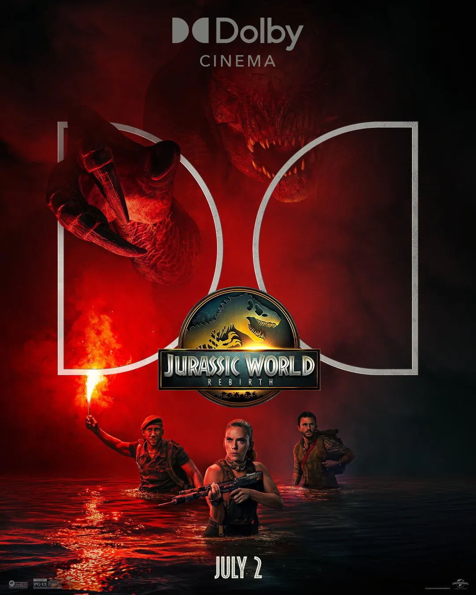
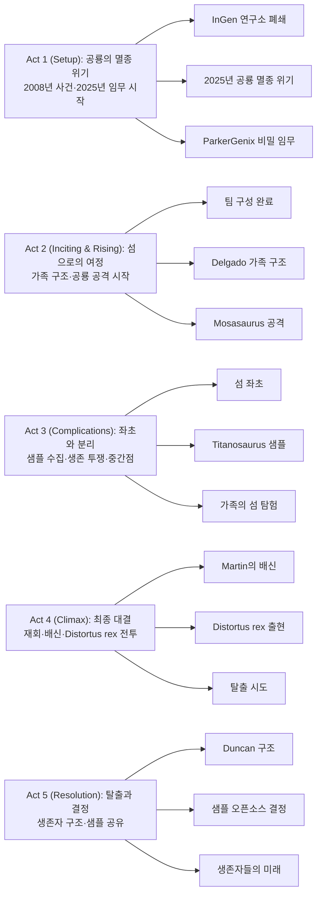

쥬라기 시리즈가 새로운 장을 연다. Gareth Edwards 감독의 《Jurassic World Rebirth》는 공룡들이 멸종 위기에 처한 2025년을 배경으로, 인류의 생존을 위한 필사적인 임무와 예기치 않은 위험이 교차하는 SF 액션 블록버스터다. 시리즈의 창시자 Steven Spielberg가 제작에 참여하고, 원작 《Jurassic Park》의 각본가 David Koepp가 시나리오를 집필하여 시리즈의 DNA를 계승하면서도 독립적인 이야기를 선보인다.

Scarlett Johansson이 이끄는 팀은 치료제 개발을 위해 거대 공룡 표본에서 생체 샘플을 추출하는 비밀 임무를 수행하지만, 조난당한 가족을 구조하면서 계획이 틀어지고, 위험한 섬에 좌초되어 변종 공룡들과의 생존 전쟁을 벌이게 된다.

## 개요

### 영화 정보
* **제목**: Jurassic World Rebirth / 쥬라기 월드 리버스
* **감독**: Gareth Edwards (가렛 에드워즈)
* **각본**: David Koepp (데이비드 콥)
* **주연**: Scarlett Johansson, Mahershala Ali, Jonathan Bailey, Rupert Friend, Manuel Garcia-Rulfo, Ed Skrein
* **제작**: Steven Spielberg (Executive Producer)
* **장르**: Science Fiction, Action, Adventure, Thriller
* **상영시간**: 미정
* **개봉일**: 2025.06.17 (런던 프리미어), 2025.07.02 (미국)
* **제작사**: Universal Pictures, Amblin Entertainment
* **배급사**: Universal Pictures
* **제작비**: 약 1.8억~2.25억 달러
* **평점**: 흥행 8.68억 달러 이상 (2025년 4위)

### 추천 대상
* **공룡 영화 팬**: 쥬라기 시리즈의 새로운 시작을 경험하고 싶은 관객
* **액션 스릴러 애호가**: 긴장감 넘치는 생존 액션과 몬스터 대결을 즐기는 관객
* **SF 영화 팬**: 기후 위기와 유전공학이라는 현대적 주제를 다루는 SF 설정에 관심 있는 관객

## 구조 분석

## 영화의 전체 내용 (스포일러 포함)

《Jurassic World Rebirth》는 2025년을 배경으로, 대부분의 공룡들이 멸종 위기에 처한 세계에서 인류가 공룡의 생체 물질을 이용해 심장병 치료제를 개발하려는 과정을 그린다. 비밀 임무를 수행하던 팀이 조난당한 가족을 구조하면서 계획이 틀어지고, InGen이 버린 섬에서 변종 공룡들과 맞서 생존을 위해 싸우는 이야기가 펼쳐진다.

### Act 1 (Setup): 공룡의 멸종 위기와 비밀 임무

2008년부터 시작된 공룡 실험의 어두운 역사와 2025년 새로운 임무가 시작되는 과정을 보여준다.

**[S01] 2008년 Île Saint-Hubert 연구소**: 대서양의 섬 Île Saint-Hubert에 위치한 InGen의 공룡 유전학 연구소는 회사 수뇌부가 불안해할 만큼 기괴한 유전자 조작 및 변종 공룡들을 보유하고 있다. 이곳에는 6개의 다리를 가진 티라노사우루스인 Distortus rex가 격리되어 있다.

**[S02] Distortus rex 탈출**: Distortus rex가 격리 구역을 탈출하여 직원 한 명을 살해하는 사건이 발생한다. 이 사건으로 인해 연구소 직원들은 긴급히 섬을 포기하고 대피한다.

**[S03] 2025년 공룡 멸종 위기**: 2025년, 지구의 대부분 지역은 부활한 공룡들이 생존하기에 적합하지 않은 기후가 되었다. 남은 공룡들은 중생대와 유사한 기후를 가진 적도 지역에서만 생존하고 있으며, 이 지역은 인간의 접근이 제한된 배제 구역으로 설정되어 있다.

**[S04] ParkerGenix의 제안**: 제약회사 ParkerGenix의 임원 Martin Krebs는 세 종의 거대 공룡 표본에서 생체 물질 샘플을 수집하는 극비 임무를 위해 전직 비밀 요원 Zora Bennett을 고용한다. 이 샘플들은 새로운 심혈관 질환 치료제 개발에 핵심적인 역할을 할 것이다.

**[S05] 고생물학자 Henry Loomis 합류**: Zora는 고생물학자 Dr. Henry Loomis와 함께 임무를 수행하기로 한다. 두 사람은 공룡에 대한 전문 지식과 작전 수행 능력을 결합한 완벽한 팀을 구성한다.

**[S06] 수리남에서 팀 구성**: Zora는 수리남으로 가서 오랜 동료인 Duncan Kincaid를 원정대장으로 영입한다. 팀에는 해양 조종사 LeClerc, 용병 Nina, 보안 전문가 Bobby Atwater도 합류한다.

**[S07] 임무 브리핑**: 팀은 Île Saint-Hubert로 가서 수생 공룡 Mosasaurus, 육상 공룡 Titanosaurus, 비행 공룡 Quetzalcoatlus로부터 생체 샘플을 수집하는 임무를 받는다. 이들은 각각 다른 환경에 서식하는 거대 공룡들이다.

### Act 2 (Inciting & Rising): 섬으로의 여정과 예기치 않은 구조

계획된 임무가 시작되지만, 예상치 못한 조난 사고로 인해 상황이 복잡해진다.

**[S08] Delgado 가족의 항해**: 같은 시기, Reuben Delgado는 딸들 Teresa와 Isabella, 그리고 Teresa의 남자친구 Xavier Dobbs와 함께 요트를 타고 항해 중이다. Reuben은 Xavier를 야망이 없는 청년으로 여기며 못마땅해한다.

**[S09] Mosasaurus의 공격**: Delgado 가족의 요트가 Mosasaurus의 공격을 받아 전복된다. Reuben은 급히 조난 신호를 보낸다.

**[S10] 구조 결정**: 원정대는 조난 신호를 감지한다. Martin은 임무를 우선시하며 항로를 바꾸지 말 것을 주장하지만, Zora와 팀원들은 인명 구조를 선택하고 항로를 변경한다.

**[S11] 가족 구조 성공**: 원정대는 물에 빠진 Delgado 가족을 발견하고 배에 태운다. 네 명의 조난자가 무사히 구조되지만, 이로 인해 임무 수행이 지연되고 복잡해진다.

**[S12] Mosasaurus 재출현**: 구조 작업 중 Mosasaurus가 다시 수면 위로 나타난다. 팀은 신속하게 개조된 마취총을 사용하여 Mosasaurus의 혈액 샘플을 성공적으로 채취한다. 첫 번째 목표 달성이다.

**[S13] Spinosaurus 무리의 습격**: Mosasaurus의 공격으로 혼란스러운 상황에서 Spinosaurus 무리가 함께 배를 공격한다. 격렬한 전투 끝에 보안 전문가 Bobby가 Spinosaurus에게 살해당한다.

**[S14] Teresa 실종**: 혼란 중에 Martin은 임무의 기밀을 유지하기 위해 Teresa가 구조 신호를 보내는 것을 막는다. 싸우는 과정에서 Teresa가 배 밖으로 떨어진다.

**[S15] 물속으로의 뛰어들기**: Xavier는 즉시 Teresa를 구하기 위해 물속으로 뛰어든다. Reuben과 Isabella도 가족을 구하기 위해 뒤따라 뛰어든다. 네 명은 배와 분리되어 표류한다.

**[S16] 섬 좌초**: 원정대의 배가 Spinosaurus의 공격으로 손상을 입고 섬 해안에 좌초된다. Spinosaurus 한 마리가 해변까지 쫓아와 용병 Nina를 죽인다. 팀은 두 명의 동료를 잃고 섬에 고립된다.

### Act 3 (Complications): 좌초와 분리, 샘플 수집의 난관

좌초된 팀과 분리된 가족이 각자의 방식으로 생존을 위해 고군분투한다.

**[S17] 구조 계획 공유**: Zora는 팀원들에게 24시간 동안 무선 침묵이 지속되면 구조 헬리콥터가 섬 상공을 순찰할 것이라고 알린다. 그들은 24시간 동안 생존하며 임무를 완수해야 한다.

**[S18] Titanosaurus 발견**: 팀은 섬 내륙으로 이동하여 Titanosaurus 무리를 발견한다. 이 거대한 초식공룡들은 평화롭게 풀을 뜯고 있지만, 그 크기만으로도 위협적이다.

**[S19] Titanosaurus 샘플 채취**: 팀은 신중하게 접근하여 Titanosaurus 한 마리에게 마취총을 쏘고 혈액 샘플을 성공적으로 채취한다. 두 번째 목표를 달성했지만, 가장 어려운 샘플이 남아있다.

**[S20] Quetzalcoatlus 전략 회의**: 거대한 육식성 Quetzalcoatlus는 너무 위험하여 직접 샘플을 채취하기 어렵다. 팀은 대신 알에서 샘플을 채취하기로 결정한다.

**[S21] 절벽 하강 작전**: Zora, Henry, LeClerc은 고대 동굴 사원 안에 위치한 Quetzalcoatlus 둥지로 접근하기 위해 절벽을 타고 내려간다. 둥지는 접근하기 어려운 위치에 있다.

**[S22] 미드포인트 - LeClerc의 죽음과 마지막 샘플**: 팀이 알에서 샘플을 채취하는 동안 어미 Quetzalcoatlus가 돌아온다. 거대한 익룡은 LeClerc을 공격하여 죽인다. 혼란 속에서도 Zora와 Henry는 마지막 샘플을 확보하는 데 성공한다.

**[S23] Delgado 가족의 해변 도착**: 한편, 물에서 분리된 Delgado 가족과 Xavier는 섬의 다른 해변에 상륙한다. 그들은 원정대가 버려진 InGen 단지에 있을 것이라 추측하고 그곳을 찾기로 한다.

**[S24] 다양한 공룡들과의 조우**: 가족은 섬을 탐험하며 여러 공룡들을 만난다. 그들은 Mutadon(랩터와 익룡의 하이브리드), Aquilops(작은 초식공룡) 등 다양한 종을 목격한다. Isabella는 작은 Aquilops를 애완동물처럼 돌본다.

**[S25] 보트 발견**: 가족은 강가에서 팽창식 보트를 발견한다. 이것이 그들이 섬을 탈출할 수 있는 유일한 방법이다.

**[S26] Tyrannosaurus의 습격**: 보트를 강으로 옮기는 과정에서 Tyrannosaurus가 나타나 그들을 공격한다. 가족은 간신히 도망쳐 강으로 보트를 띄운다.

**[S27] 강을 따라 이동**: 가족은 강을 따라 내려가며 InGen 단지로 향한다. 강을 이용한 이동은 육지보다 상대적으로 안전하지만, 여전히 위험이 도사리고 있다.

### Act 4 (Climax): 재회, 배신, 그리고 최종 대결

분리되었던 두 그룹이 재회하지만, 인간의 탐욕과 변종 공룡이라는 이중의 위협에 직면한다.

**[S28] InGen 단지 도착**: Delgado 가족이 버려진 InGen 단지에 도착한다. 낡고 방치된 건물들은 불길한 분위기를 풍긴다.

**[S29] 재회**: 단지에서 원정대와 Delgado 가족이 재회한다. 양측 모두 기뻐하지만, 팀의 규모가 크게 줄어든 것을 확인한다.

**[S30] Teresa의 폭로**: Teresa는 Martin이 자신이 구조 신호를 보내는 것을 막았고, 자신을 물에 빠뜨린 것을 폭로한다. 팀원들은 Martin의 냉혹함에 충격을 받는다.

**[S31] Martin의 배신**: 궁지에 몰린 Martin은 권총을 꺼내 모두를 위협한다. 그는 샘플을 빼앗아 헬리패드로 향하는 UTV(소형 지형 차량)에 탑승하여 혼자 탈출을 시도한다.

**[S32] Mutadon의 공격**: Martin이 떠난 직후, Mutadon 무리가 하늘에서 내려와 생존자들을 공격한다. 이 하이브리드 공룡들은 랩터의 민첩함과 익룡의 비행 능력을 결합하여 매우 위협적이다.

**[S33] 지하 터널로 도주**: 생존자들은 Mutadon을 피해 건물 아래 지하 터널로 도망친다. 어둡고 좁은 터널은 불안감을 증폭시킨다.

**[S34] 클라이맥스 - 구조 헬기 도착**: 바로 그때 구조 헬리콥터가 헬리패드에 착륙한다. Martin은 구조되어 탈출할 수 있을 것처럼 보인다.

**[S35] Distortus rex 출현**: 그러나 17년 전에 격리에서 탈출한 6개 다리의 Distortus rex가 나타나 헬리콥터를 파괴한다. 강력한 변종 티라노사우루스의 등장은 모든 것을 바꾼다.

**[S36] 터널의 막다른 길**: 지하 터널을 따라 도망치던 생존자들은 출구에서 잠긴 철문을 발견한다. 철문 반대편에는 보트와 문을 열 수 있는 제어판이 있다.

**[S37] Isabella의 용기**: 철문 사이 틈은 너무 좁아서 어른은 통과할 수 없지만, 어린 Isabella는 통과할 수 있다. 그녀는 용기를 내어 틀을 빠져나가 제어판을 향해 달린다.

**[S38] D. rex의 추격**: Isabella가 제어판에 도달하는 순간 Distortus rex가 터널에 나타난다. 거대한 변종 공룡이 생존자들을 향해 돌진한다.

**[S39] Martin의 최후**: Isabella가 문을 여는 순간, D. rex는 헬리패드에서 도망쳐 온 Martin을 발견하고 삼켜버린다. 샘플을 가진 Martin이 공룡에게 죽으면서 임무가 실패할 위기에 처한다.

**[S40] 샘플 회수**: 혼란 속에서 Zora는 신속하게 Martin의 가방에서 세 가지 샘플을 회수한다. 팀은 보트를 향해 달린다.

### Act 5 (Resolution): 탈출과 새로운 결정

생존자들이 섬을 탈출하고, 샘플의 운명에 대한 중요한 결정을 내린다.

**[S41] Duncan의 희생**: 모두가 보트로 향하는 동안 Duncan이 뒤에 남아 플레어를 사용하여 D. rex의 주의를 끈다. 그의 희생 덕분에 다른 사람들이 탈출할 시간을 벌 수 있다.

**[S42] 보트 출발**: Zora, Henry, Reuben, Teresa, Xavier, Isabella는 보트에 탑승하여 섬을 떠난다. 그들은 간신히 D. rex의 추격을 따돌리고 바다로 나간다.

**[S43] Duncan의 생존 신호**: 바다로 나간 후 얼마 지나지 않아 Duncan의 생존 신호가 잡힌다. 그는 살아남은 것이다.

**[S44] Duncan 구조**: 보트는 해안가에서 신호를 보내는 Duncan을 발견하고 구조한다. 모든 생존자가 함께 무사히 섬을 떠난다.

**[S45] 샘플의 미래**: 바다를 항해하며 Zora와 Henry는 샘플의 운명에 대해 논의한다. ParkerGenix에 독점적으로 제공하는 대신, 그들은 더 큰 선택을 한다.

**[S46] 오픈소스 결정**: Zora와 Henry는 생체 물질을 오픈소스 자원으로 배포하기로 결정한다. 이를 통해 전 세계 어디서나 누구나 접근할 수 있게 하여, 더 많은 사람들이 치료의 혜택을 받을 수 있게 한다.

**[S47] 새로운 시작**: 생존자들은 수평선을 바라보며 미래를 생각한다. 그들은 목숨을 걸고 얻은 샘플로 인류에게 희망을 줄 것이다. Reuben과 Xavier의 관계도 이번 경험을 통해 개선된다.

## 캐릭터 분석

### Zora Bennett (Scarlett Johansson)

**개요**: 전직 비밀 요원으로, 뛰어난 전투 능력과 작전 수행 능력을 갖춘 여성. ParkerGenix로부터 고용되어 거대 공룡에서 생체 샘플을 수집하는 위험한 임무를 맡는다. 냉철하고 전문적이지만, 인명을 중시하는 도덕적 기준을 가지고 있다.

**성장 곡선**: 초반에는 임무 완수에 집중하는 프로페셔널로 등장하지만, Delgado 가족을 구조하기로 결정하면서 인간적 면모를 드러낸다. Martin의 배신과 팀원들의 희생을 겪으며, 개인의 이익보다 공공의 선을 우선시하는 리더로 성장한다. 최종적으로 샘플을 오픈소스로 배포하기로 결정하면서, 기업의 이익보다 인류 전체의 이익을 선택하는 영웅적 변화를 완성한다.

**동기와 욕망**: 처음에는 임무 완수와 보수가 주된 동기였으나, 과정에서 더 많은 사람들을 구하고 올바른 일을 하고자 하는 욕구가 커진다. 팀원들의 희생이 헛되지 않도록 샘플을 올바르게 사용하고자 한다.

**갈등 구조**: 외적으로는 공룡과의 생존 전쟁, Martin의 배신과 대립한다. 내적으로는 임무 완수와 인명 구조 사이의 선택, 기업의 이익과 공공의 선 사이의 갈등을 겪는다.

**상징적 의미**: Zora는 기업 자본주의에 맞서는 개인의 양심과 용기를 상징한다. 그녀의 최종 결정은 이윤보다 생명과 공공의 이익을 우선시하는 가치관을 대변한다.

Scarlett Johansson은 액션 시퀀스에서의 물리적 연기와 감정적 깊이를 균형 있게 보여주며, 《Black Widow》에서 보여준 액션 역량을 다시 한번 증명한다.

### Dr. Henry Loomis (Jonathan Bailey)

**개요**: 고생물학자로, 공룡에 대한 깊은 지식을 가진 학자. 원정대의 과학 고문으로 참여하며, 위험한 상황에서도 침착함을 유지한다. 공룡을 연구 대상이자 보호해야 할 생명체로 존중한다.

**성장 곡선**: 초반에는 학술적 관점에서 공룡에 접근하는 이론가였으나, 실전에서 생존을 위해 싸우며 행동하는 과학자로 변모한다. Zora와 함께 샘플 수집의 위험을 감수하고, 최종적으로 지식의 독점이 아닌 공유를 선택한다.

**동기와 욕망**: 공룡 연구에 대한 학문적 열정과 인류의 의학 발전에 기여하고자 하는 욕구가 그를 이끈다. 공룡들을 단순한 자원이 아닌 생명체로 존중하고자 한다.

**갈등 구조**: 과학자로서의 호기심과 생존 본능 사이의 갈등, 연구 윤리와 현실적 필요 사이의 긴장을 경험한다.

**상징적 의미**: Henry는 윤리적 과학의 중요성을 상징한다. 그는 지식이 소수에게 독점되어서는 안 되며, 모두에게 공유되어야 한다는 가치를 대변한다.

Jonathan Bailey는 지적이면서도 용감한 캐릭터를 설득력 있게 연기하며, 《Bridgerton》에서 보여준 매력에 액션 요소를 더한다.

### Martin Krebs (Rupert Friend)

**개요**: 제약회사 ParkerGenix의 임원으로, 원정대의 후원자이자 감시자. 냉철하고 계산적이며, 이윤과 기업의 이익을 최우선으로 생각한다. 샘플 확보를 위해서는 인명도 희생시킬 수 있는 냉혹한 인물이다.

**성장 곡선**: 성장이 아닌 전락의 곡선을 그린다. 초반부터 이기적이고 냉정했지만, 위기 상황에서 그의 진면목이 드러난다. Teresa를 위험에 빠뜨리고, 최종적으로 팀을 배신하며 샘플을 독차지하려다 자신의 탐욕에 의해 파멸한다.

**동기와 욕망**: 회사의 이익과 개인적 성공, 샘플의 독점적 확보가 그의 모든 행동을 이끈다. 인간의 생명보다 기업의 자산을 우선시한다.

**갈등 구조**: 팀원들의 도덕적 가치관과 충돌하며, 생존보다 샘플 확보를 우선시하는 그의 태도가 내적 갈등 없이 일관되게 유지된다.

**상징적 의미**: Martin은 무자비한 기업 자본주의와 탐욕을 상징한다. 그의 최후는 인간의 탐욕이 자연(공룡)에 의해 심판받는 상징적 장면이다.

Rupert Friend는 표면적으로는 전문적이지만 내면에는 냉혹함이 도사리고 있는 악역을 효과적으로 연기한다.

### Reuben Delgado (Manuel Garcia-Rulfo)

**개요**: 딸 두 명과 함께 항해를 즐기던 가장으로, 큰딸 Teresa의 남자친구 Xavier를 못마땅해한다. 공룡의 공격으로 인한 조난 사고로 원정대와 얽히게 된다.

**성장 곡선**: 초반에는 Xavier를 무시하고 판단하는 보수적인 아버지였으나, 위기 상황에서 Xavier가 Teresa를 구하기 위해 목숨을 걸고 뛰어드는 모습을 보며 그를 재평가한다. 섬에서의 경험을 통해 가족의 소중함과 타인에 대한 편견을 버리는 법을 배운다.

**동기와 욕망**: 가족을 보호하고 모두를 안전하게 귀가시키는 것이 그의 최우선 목표다. 딸들의 행복을 진심으로 바란다.

**갈등 구조**: Xavier에 대한 편견과 그가 보여주는 용기 사이의 갈등, 아버지로서 가족을 지켜야 한다는 책임감과 극한 상황에서의 무력감 사이의 긴장을 경험한다.

**상징적 의미**: Reuben은 가족의 유대와 편견을 극복하는 인간 성장을 상징한다. 그의 변화는 영화의 휴먼 드라마적 요소를 강화한다.

### Xavier Dobbs (Ed Skrein)

**개요**: Teresa의 남자친구로, Reuben으로부터 야망이 없다는 평가를 받는다. 그러나 위기 상황에서 진정한 용기와 헌신을 보여준다.

**성장 곡선**: 초반에는 소극적이고 눈치를 보는 모습이었으나, Teresa가 물에 빠지자 주저 없이 뛰어들면서 진정한 영웅성을 드러낸다. 섬에서의 생존 과정에서 가족을 보호하고 이끄는 리더십을 발휘한다.

**동기와 욕망**: Teresa에 대한 사랑과 그녀를 보호하고자 하는 욕구가 그를 움직인다. Reuben에게 인정받고 싶은 마음도 있다.

**갈등 구조**: Reuben의 부정적 시선과 자신의 가치 증명 사이의 갈등, 생존 상황에서의 두려움과 사랑하는 사람을 지키려는 용기 사이의 긴장을 경험한다.

**상징적 의미**: Xavier는 진정한 용기는 평소의 모습이 아니라 위기의 순간에 드러난다는 주제를 상징한다.

### Duncan Kincaid (Mahershala Ali)

**개요**: Zora의 오랜 동료이자 원정대장. 경험 많은 생존 전문가이자 전술가로, 팀의 중추적 역할을 한다.

**성장 곡선**: 처음부터 끝까지 신뢰할 수 있는 리더이자 동료로 일관된 모습을 보인다. 최후의 순간 팀원들을 위해 희생을 선택하면서 진정한 영웅성을 완성한다.

**동기와 욕망**: Zora에 대한 충성심과 동료애, 임무 완수에 대한 책임감이 그를 이끈다.

**갈등 구조**: 임무와 생존 사이의 균형, 팀원들을 보호해야 하는 책임과 현실적 한계 사이의 긴장을 경험한다.

**상징적 의미**: Duncan은 희생과 충성, 진정한 리더십을 상징한다. 그의 생존은 영웅적 행동에 대한 보상을 의미한다.

Mahershala Ali는 절제되면서도 강렬한 존재감을 발휘하며, 《Moonlight》와 《Green Book》에서 보여준 깊이 있는 연기력을 다시 한번 증명한다.

## 영상미와 음악

### 시각 효과 / 촬영 / 미학

Gareth Edwards 감독은 《Godzilla》(2014)와 《Rogue One: A Star Wars Story》(2016)에서 보여준 대규모 시각효과와 인간 드라마의 균형을 다시 한번 입증한다. 

영화는 태국, 몰타, 영국에서 촬영되었으며, 열대 섬의 무성한 자연환경을 실감나게 재현한다. 낡고 방치된 InGen 시설의 디스토피아적 분위기는 인간의 오만함이 남긴 잔해를 시각적으로 표현한다.

공룡들은 최첨단 CGI로 구현되었으며, 특히 6개 다리를 가진 Distortus rex는 유전공학의 위험성을 시각적으로 상징하는 독특한 디자인을 자랑한다. Mosasaurus의 수중 공격 시퀀스는 물의 역동성과 공룡의 위력을 효과적으로 결합하며, Quetzalcoatlus의 비행 장면은 고대 하늘의 지배자가 가진 위엄을 표현한다.

촬영은 광활한 자연 경관을 담은 와이드 샷과 긴박한 액션 시퀀스의 클로즈업을 효과적으로 번갈아 사용하여 규모감과 긴장감을 동시에 전달한다. 어두운 터널 시퀀스는 클로스트로포비아를 유발하며, 밝은 외부 장면과 대조를 이룬다.

색감은 열대 지역의 생생한 녹색과 파란색을 강조하면서도, 위기 상황에서는 차갑고 어두운 톤을 사용하여 분위기를 조성한다.

### 음악

《Jurassic World Rebirth》의 음악은 John Williams의 상징적인 《Jurassic Park》 테마를 존중하면서도 새로운 음악적 정체성을 확립한다. (구체적인 음악 감독 정보는 확인되지 않았으나, 시리즈의 전통을 이어갈 것으로 예상된다.)

오케스트라 스코어는 경이로움과 공포를 동시에 전달하며, 공룡이 등장하는 장면에서는 웅장한 브라스와 타악기가 강조된다. 인간 캐릭터들의 감정적 순간에는 스트링 섹션이 서정성을 더한다.

액션 시퀀스는 빠른 템포의 리듬과 불협화음을 활용하여 긴장감을 고조시키며, 조용한 순간에는 미니멀한 사운드 디자인이 관객의 집중력을 높인다.

사운드 디자인은 각 공룡 종의 고유한 울음소리와 움직임 소리를 디테일하게 표현하여, 시각효과와 함께 몰입감을 극대화한다.

## 종합 평가

### 최종 평점: ★★★☆☆ (3.5/5.0)

**장점**:
- 강력한 캐스팅: Scarlett Johansson과 Mahershala Ali를 비롯한 배우들의 설득력 있는 연기
- 독립적 스토리: 시리즈 팬이 아니어도 즐길 수 있는 독립적인 서사 구조
- 시각효과: 공룡들의 리얼한 CGI와 액션 시퀀스의 박진감
- 현대적 주제: 기후 위기, 기업 윤리, 오픈소스 지식 공유 등 현대적 이슈 반영
- Gareth Edwards의 연출: 대규모 액션과 인간 드라마의 균형 잡힌 연출

**단점**:
- 예측 가능한 플롯: 생존 스릴러의 전형적 패턴을 크게 벗어나지 못함
- 캐릭터 깊이: 일부 조연 캐릭터들의 발전이 충분하지 않음
- 혼합 평가: 비평가들로부터 엇갈린 반응을 받음

### 한 줄 평

"시리즈의 DNA를 계승하면서도 새로운 방향을 제시하는 탄탄한 생존 액션 블록버스터."

### 추천 작품

- 《Jurassic Park》(1993): 시리즈의 원점이자 공룡 영화의 기준점. Steven Spielberg의 명작
- 《Godzilla》(2014): Gareth Edwards 감독의 이전 괴수 영화로, 유사한 연출 스타일 확인 가능
- 《The Meg》(2018): 거대 해양 생물과의 생존 전쟁을 다룬 액션 스릴러
- 《Kong: Skull Island》(2017): 고립된 섬에서 거대 생물들과 맞서는 생존 액션

### 관람 전 체크리스트

- 사전 지식이 필요한가? **아니오**. 독립적인 이야기로 시리즈를 모르는 관객도 즐길 수 있음
- 어린이와 함께 볼 수 있는가? **주의 필요**. 공룡 공격 장면과 인명 피해가 묘사되므로 어린 아동에게는 부적합할 수 있음
- 특정 요소를 기대해도 되는가? **예**. 긴박한 액션, 공룡 대결, 생존 스릴러 요소를 충분히 제공
- 쿠키 영상이 있는가? **정보 없음**. 추후 확인 필요
- 속편 가능성은? **있음**. 흥행 성적과 독립적 서사 구조를 고려할 때 새로운 이야기로의 확장 가능

## 결론

《Jurassic World Rebirth》는 30년 넘게 이어진 쥬라기 시리즈에 새로운 활력을 불어넣으려는 야심찬 시도다. Gareth Edwards 감독은 시리즈의 상징적 요소들을 존중하면서도, 기후 위기와 기업 윤리라는 현대적 주제를 자연스럽게 녹여냈다.

Scarlett Johansson과 Mahershala Ali를 중심으로 한 강력한 캐스팅은 영화의 가장 큰 자산이다. 두 배우는 액션 시퀀스와 감정적 장면 모두에서 설득력 있는 연기를 보여주며, 관객의 몰입을 이끈다. 특히 샘플을 오픈소스로 배포하기로 하는 결정은 이윤 추구보다 공공의 이익을 우선시하는 현대적 가치관을 반영하여 의미 있는 메시지를 전달한다.

영화는 생존 스릴러로서의 긴장감과 가족 드라마로서의 감성을 균형 있게 배치하여, 다양한 관객층에게 어필한다. 6개 다리를 가진 Distortus rex와 같은 독특한 공룡 디자인은 유전공학의 위험성을 시각적으로 상징하며, 인간의 오만함에 대한 경고를 담고 있다.

다만 생존 스릴러 장르의 전형적 패턴에서 크게 벗어나지 못하고, 일부 캐릭터의 발전이 충분하지 않다는 점은 아쉬움으로 남는다. 그럼에도 불구하고 탄탄한 연출, 화려한 시각효과, 의미 있는 메시지를 담은 《Jurassic World Rebirth》는 여름 블록버스터로서 충분한 가치를 제공하며, 시리즈의 미래에 대한 기대감을 높인다.

공룡 영화의 팬이라면, 그리고 잘 만들어진 생존 액션 스릴러를 찾는다면 《Jurassic World Rebirth》는 놓치지 말아야 할 작품이다.

## 참고 문헌 및 출처

- [Jurassic World Rebirth — Wikipedia](https://en.wikipedia.org/wiki/Jurassic_World_Rebirth)
- [Jurassic World Rebirth — IMDb](https://www.imdb.com/title/tt17663048/)
- [Jurassic World Rebirth — Universal Pictures](https://www.universalpictures.com/)

