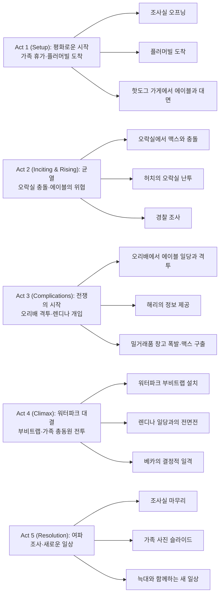

전편에서 러시아 마피아의 금고를 불태우며 "평범한 직장인" 마스크를 벗어던진 허치 맨셀이 돌아왔다. 이번에는 가족과 함께 떠난 평화로운 휴가가 그를 기다리고 있었지만, 플러머빌이라는 작은 마을에서 다시금 폭력의 세계로 끌려들어가게 된다. 전작의 버스 액션 신을 능가하는 오리배 격투, 오락실 난투, 그리고 워터파크 최종 결전까지, 온 가족이 생존을 위해 싸워야 하는 이야기가 펼쳐진다.

## 개요

### 영화 정보
* **제목**: Nobody 2 / 노바디 2
* **감독**: 티모 자얀토 (Timo Tjahjanto)
* **각본**: 데릭 콜스태드 (Derek Kolstad), 애런 래빈 (Aaron Rabin)
* **원안**: 데릭 콜스태드 (Derek Kolstad)
* **주연**: 밥 오덴커크 (Bob Odenkirk), 코니 닐슨 (Connie Nielsen), 존 오티즈 (John Ortiz), 콜린 행크스 (Colin Hanks), RZA, 크리스토퍼 로이드 (Christopher Lloyd), 샤론 스톤 (Sharon Stone)
* **촬영**: 칼란 그린 (Callan Green)
* **음악**: 도미닉 루이스 (Dominic Lewis)
* **장르**: 액션, 스릴러, 범죄
* **상영시간**: 89분
* **개봉일**: 2025.08.15 (미국)
* **제작사**: 87North Productions, Odenkirk Provissiero Entertainment
* **배급사**: Universal Pictures
* **평점**: 로튼 토마토 77% (Certified Fresh), 관객 평점 88%

### 추천 대상
* **액션 영화 팬**: 밀도 높은 액션 시퀀스와 창의적인 무기 활용
* **전편 팬**: 허치 맨셀의 성장과 가족과의 관계 심화
* **다크 코미디 선호자**: 잔혹한 폭력 속에 숨겨진 블랙 유머

## 구조 분석

## 영화의 전체 내용 (스포일러 포함)

영화는 허치 맨셀의 여정을 5막 구조로 세밀하게 그려낸다. 전편의 러시아 마피아 사건 이후, 빚을 갚기 위해 암살 임무를 계속해야 하는 허치가 가족과의 시간을 위해 휴가를 떠나지만, 부패한 작은 마을에서 다시금 폭력의 소용돌이에 휘말리게 되는 과정이 긴장감 넘치게 전개된다.

### Act 1 (Setup): 평화로운 시작

**[S01] 조사실 오프닝**: 영화는 전편과 동일하게 조사실에서 시작한다. 수갑을 찬 허치 맨셀 옆에는 웬 늑대 한 마리가 있고, 허치는 라이터 불로 자신 왼팔의 상처를 지진다. 조사관들이 "당신들 대체 누구야?"라는 식으로 묻자, 영화는 사건 며칠 전으로 플래시백한다.

**[S02] 빚을 갚는 일상**: 전편에서 러시아 마피아의 금고(옵샤크)를 모조리 불태운 일로 허치는 매일 상관인 "이발사"로부터 임무를 받아 처리하며 빚을 갚고 있다. 그러나 가족과 함께할 기회가 점점 줄어들고 있음을 직감한다.

**[S03] 플러머빌로 가족 휴가**: 허치는 이번에는 쉬겠다고 말하고 아내 베카 맨셀, 아들 브래디, 딸 새미, 그리고 아버지 데이비드 맨셀을 데리고 플러머빌로 향한다. 플러머빌 소개 영상이 예전 TV 광고라 가족들이 불안해하지만, 도착한 플러머빌은 겉보기에는 멀쩡해 보인다.

**[S04] 워터파크 폐쇄**: 숙소에 짐을 풀고 워터파크로 가려던 온 가족은 안전사고로 워터파크가 폐쇄되었다는 소식을 듣는다. 보상으로 핫도그 쿠폰을 받고 핫도그 가게로 향한다.

**[S05] 에이블과의 첫 대면**: 핫도그 가게에서 음식을 기다리는 동안, 허치는 어릴 적 플러머빌 추억을 회상한다. 그때 보안관 에이블이 무례하게 쳐다봤다며 시비를 건다. 긴장이 감도는 순간, 음식과 오락실 쿠폰이 도착하며 분위기가 전환된다.

### Act 2 (Inciting & Rising): 균열

**[S06] 오락실에서의 즐거운 시간**: 온 가족이 오락실에서 게임을 즐긴다. 브래디는 게임에서 딴 교환권을 웬 소녀에게 건네주는데, 그 소녀가 불량배 맥스 마틴의 여자 친구였다.

**[S07] 맥스와의 충돌**: 맥스가 시비를 걸고 새미가 딴 오소리 인형을 찢어 두 동강 내자, 브래디가 맥스를 패면서 싸움이 벌어진다. 오락실 직원들이 소동을 제압하지만 대놓고 맥스 편을 든다.

**[S08] 허치의 폭발**: 오락실을 나오려던 찰나, 오락실 직원이 새미의 등을 친다. 찝찝한 마음을 남긴 허치는 "휴대전화를 두고 왔다"는 핑계를 대고 다시 오락실로 들어간다. 베카는 남편을 말리려 하지만, 허치는 오락실 직원들을 패며 쑥대밭으로 만들어놓는다.

**[S09] 경찰 조사**: 오락실 사건으로 자치 경찰의 조사를 받게 된 맨셀 가족. 허치와 베카는 "먼저 시작한 건 상대였다"라며 일관된 주장을 펼친다. 와이어트 마틴은 허치에게 "온 가족을 끌고 플러머빌을 떠나라"라고 경고한다.

**[S10] 에이블의 지시**: 조사가 끝나고 가족이 경찰서를 떠나는 즈음, 에이블은 부하들에게 "저 가족을 죽이자"라고 지시한다.

### Act 3 (Complications): 전쟁의 시작

**[S11] 미드포인트 - 오리배 격투**: 다음 날, 허치 가족이 오리배를 타러 가는데, 에이블이 불량배를 이끌고 오는 모습이 보인다. 허치는 "속이 안 좋다"는 핑계로 가족을 먼저 보내고 다른 오리배에 혼자 탄다. 에이블 일행도 같은 배에 올라탄다.

**[S12] 수중 격투**: 오리배가 출발하고, 관광객들이 헤드폰을 낀 상태에서 허치 대 에이블 일행의 싸움이 벌어진다. 허치는 이 과정에서 왼손 새끼손가락이 잘린다. 치고받기 끝에 허치가 물에 빠지지만, 다시 물 밖으로 나와 불량배를 처치한다.

**[S13] 해리의 정보**: 싸움이 끝나고 허치는 공중전화로 형 해리에게 전화를 건다. 해리는 "플러머빌은 온갖 중대한 밀거래가 벌어지는 장소"라는 정보를 제공한다. 또한 어릴 적 아버지가 플러머빌로 함께 놀러 간 것도 임무 수행 목적이었다고 밝힌다. 해리는 일본에서 막 돌아온 참이었고, 일본식 다도를 배우는 중이었다.

**[S14] 이발사의 정보**: 허치는 "이발사"에게 전화를 걸어 플러머빌을 지배하는 렌디나가 어떤 인물인지 정보를 듣는다.

**[S15] 늑대 발견**: 한편, 허치를 제외한 가족은 플러머빌의 다른 곳을 둘러본다. 작은 우리에 갇힌 야생 늑대를 발견한다. 베카는 새미에게 "야생 동물을 만지려면 세상이 안전하다는 인식을 주며 안심시켜야 한다"라고 말하는데, 놀이동산 직원 할머니가 "안전한 세상이 어디 있냐?"라고 끼어든다.

**[S16] 밀거래 현장**: 에이블의 감시 아래 플러머빌 어딘가에서 밀거래가 진행된다. 와이어트는 렌디나에게 전화를 걸어 "이번 거래가 끝나면 아버지가 진 빚을 모두 갚는 거"라고 하지만, 렌디나는 거절하고 부하들에게 와이어트의 아들 맥스를 납치하라고 지시한다.

**[S17] 허치의 협박**: 허치가 밀거래품 창고로 들어와 폭발물이 든 드럼통 더미 옆에 놓인 돈더미에 인화성 액체를 붓고, "우리 가족은 휴가를 즐기러 왔으니 놔두라"라고 엄포를 놓는다. 그 순간 맥스가 납치되어 있는 모습을 목격한다.

**[S18] 맥스 구출**: 허치는 차를 몰아 떠나려 했지만 미련이 남아 다시 창고로 돌아온다. 온갖 액션을 펼치며 맥스를 구출하고, 인화성 액체를 뿌린 돈더미 위의 전등을 총으로 쏴 탈출 시간을 벌고 빠져나간다. 에이블은 기겁하며 창고를 빠져나가고, 창고는 연쇄 폭발로 전소한다.

**[S19] 맥스와 브래디의 화해**: 허치는 맥스를 가족이 묵고 있는 오두막에 내려주고, 브래디는 맥스와 화해한다.

**[S20] 와이어트의 무기고**: 허치는 와이어트의 거처로 간다. 아들과 연락이 안 되어 불안해하던 와이어트는 허치를 보고 화를 내지만, 허치가 그를 진정시킨다. 안심한 와이어트는 허치에게 속사정을 털어놓고 몰래 축적한 무기와 탄약을 보여준다.

### Act 4 (Climax): 워터파크 대결

**[S21] 렌디나의 분노**: 밀거래품 창고가 전소한 것을 알게 된 렌디나는 화가 치밀어 올라 부하들에게 허치네 가족을 몰살하라고 명령한다. 때마침 해리도 허치를 도우러 플러머빌로 온다.

**[S22] 부비트랩 설치**: 허치 등은 렌디나 일행을 워터파크로 유인하기로 하고, 안전사고를 이유로 워터파크를 폐쇄한 다음 곳곳에 부비트랩을 깐다. 작은 우리에 갇힌 늑대도 무기로 활용하기로 한다.

**[S23] 해리의 출발**: 해리는 "다른 방식으로 일을 처리해 보고 싶다"며 일찍 떠난다. 베카는 산책을 하고 싶다며 오두막에 걸린 총을 챙긴다.

**[S24] 클라이맥스 - 워터파크 전투**: 해가 지고 렌디나 일행이 워터파크로 향한다. 렌디나는 부하 카투시의 팀을 오두막으로 보내 가족을 몰살할 것을 지시한다.

**[S25] 에이블의 최후**: 워터파크에 도착한 렌디나는 에이블을 정문으로 보낸다. 에이블은 모든 일이 순조로울 것이라 확신하지만, 렌디나는 에이블의 일 처리 방식이 마음에 안 들었는지 부하들에게 에이블을 사살할 것을 지시한다. 에이블은 허망하게 세상을 떠난다.

**[S26] 허치의 전술**: 렌디나 부하들 대 허치, 아버지 데이비드, 와이어트의 대결이 시작된다. 중간에 허치가 늑대를 풀어 렌디나 부하들을 몰고 뜯게 시킨다.

**[S27] 해리의 검술**: 카투시가 부하들을 이끌고 오두막으로 향하던 순간, 해리가 일본도를 들고 카투시 부하들을 처치하기 시작한다. 부하들을 거의 잃은 카투시는 자신의 검을 꺼내 해리와 1:1 검술 대결을 펼친다. 이 와중에 부하 한 명이 오두막에 침입하지만, 맥스가 그 부하의 목을 조른다. 카투시는 해리를 거의 제압하지만 해리가 최후의 일격으로 카투시의 머리를 썬다.

**[S28] 렌디나와의 대면**: 워터파크 대결이 마무리될 무렵, 렌디나는 직속 수하 두 명을 데리고 허치 앞에 나타난다. 허치의 아버지는 쓰러진 상태다. 렌디나의 수하들이 허치를 처치하려던 순간, 와이어트가 총으로 이 둘을 제압한다.

**[S29] 베카의 마취총**: 화가 난 렌디나가 허치를 직접 죽이려던 찰나, 마취총알이 렌디나의 오른쪽 위 흉부를 맞힌다. 총을 쏜 사람은 허치의 아내 베카였다. 렌디나는 어이없어하지만 두 번째 마취총알이 렌디나의 눈을 맞힌다.

**[S30] 폭발 탈출**: 정신을 차린 허치의 아버지는 워터파크 곳곳에 심어둔 폭탄을 한 번에 터뜨린다. 와이어트가 "망할 놈의 미국 놈들!"이라며 먼저 수영장에 뛰어들고, 허치와 베카 부부도 뒤이어 뛰어든다.

### Act 5 (Resolution): 여파

**[S31] 조사실 종료**: 영화는 다시 조사실로 돌아온다. 이번에는 허치와 늑대 옆에 베카도 있다. "당신들 대체 누구야?"라는 조사관의 질문에 베카는 "우리는 부부 사이"라고 대답한다. 곧이어 누군가가 남자 조사관에게 전화를 걸어 허치 부부를 풀어줄 것을 지시한다.

**[S32] 여름 휴가 사진**: 영화의 끝 무렵, 허치네 가족이 여름휴가 때 찍은 사진들을 슬라이드 쇼로 돌려본다. 중간에 플러머빌에서 데려온 늑대를 애완동물로 키우는 모습이 비친다.

**[S33] 엔딩**: 누군가가 "맥스네 가족에게 연락해 봐야 하는 거 아니냐"라고 하지만 허치는 "당분간 놔두는 게 좋겠다"라고 말하며 영화가 끝난다.

## 캐릭터 분석

### 허치 맨셀 / Hutch Mansell (밥 오덴커크)

**개요**: 전편에서 "평범한 직장인" 마스크를 벗어던지고 은퇴한 암살자로서의 정체를 드러낸 허치 맨셀. 이번 작품에서는 가족과의 시간을 소중히 여기며 일과 가정의 균형을 맞추려 노력하는 아버지이자 남편으로 그려진다.

**성장 곡선**: 전편에서는 억눌린 분노를 폭발시키는 캐릭터였다면, 속편에서는 좀 더 계산적이고 전략적으로 움직인다. 가족을 지키기 위해서라면 기꺼이 다시 폭력의 세계로 뛰어들 각오가 되어 있지만, 동시에 가족에게 상처를 주지 않기 위해 신중하게 행동한다. 오락실 사건에서 "휴대전화를 두고 왔다"는 핑계를 대며 가족을 먼저 보내는 장면은 그의 성숙함을 보여준다.

**동기와 욕망**: 허치의 가장 큰 욕망은 가족과 평범한 일상을 보내는 것이다. 러시아 마피아에게 진 빚을 갚기 위해 암살 임무를 계속해야 하는 상황에서도, 그는 가족과의 휴가를 우선시한다. 그러나 플러머빌에서 딸이 폭행당하고 가족이 위협받자, 그는 주저 없이 폭력으로 맞선다.

**갈등 구조**: 내적으로는 평범한 아버지로 살고 싶은 욕망과 폭력적 본능 사이에서 갈등한다. 외적으로는 렌디나와 에이블이 지배하는 부패한 플러머빌의 범죄 조직과 맞선다. 또한 빚을 갚아야 하는 책임감과 가족과의 시간 사이에서도 갈등한다.

**상징적 의미**: 허치는 "보통 사람"의 외피를 쓴 치명적 무기다. 그는 사회의 법이 작동하지 않는 곳에서 개인이 직접 정의를 실현하는 현대판 서부 영웅을 상징한다. 동시에 중년 남성의 위기와 정체성 혼란을 겪는 평범한 아버지이기도 하다.

밥 오덴커크의 연기는 전편에서와 마찬가지로 놀라울 정도로 설득력 있다. 58세의 나이에도 불구하고 대부분의 액션 신을 직접 소화했으며, 허치의 피로와 결연함을 섬세하게 표현한다. 특히 오리배 격투 신에서 새끼손가락이 잘린 후의 고통스러운 표정은 관객에게 깊은 인상을 남긴다.

### 베카 맨셀 / Becca Mansell (코니 닐슨)

**개요**: 전편에서는 남편의 이중생활을 모르던 평범한 주부였지만, 속편에서는 남편의 정체를 알고 난 후 그를 이해하고 지지하는 파트너로 성장한다.

**성장 곡선**: 베카는 단순히 보호받아야 하는 존재에서 벗어나 능동적으로 가족을 지키는 전사로 변모한다. 클라이맥스에서 마취총으로 렌디나를 제압하는 장면은 그녀의 성장을 상징적으로 보여준다. "우리는 부부 사이"라는 마지막 대답은 그녀와 허치가 진정한 동반자 관계로 발전했음을 의미한다.

**동기와 욕망**: 베카는 가족의 안전과 남편과의 신뢰를 가장 중요하게 여긴다. 남편이 다시 폭력의 세계로 돌아가는 것을 두려워하면서도, 그것이 가족을 지키기 위한 불가피한 선택임을 이해한다.

**갈등 구조**: 내적으로는 평범한 삶에 대한 갈망과 현실의 위험 사이에서 갈등한다. 외적으로는 남편의 위험한 과거가 가족에게 미치는 영향을 최소화하려 노력한다.

**상징적 의미**: 베카는 현대 여성의 강인함과 적응력을 상징한다. 그녀는 남편의 "구원자"가 되어 최종 전투에서 결정적 역할을 수행하며, 가족 내에서 동등한 파트너십을 확립한다.

코니 닐슨의 연기는 베카의 복잡한 감정을 섬세하게 표현한다. 특히 오락실 사건에서 남편을 말리려다 결국 인정하는 장면, 그리고 마지막 전투에서 냉정하게 총을 겨누는 장면은 캐릭터의 변화를 효과적으로 드러낸다.

### 렌디나 / Lendina (존 오티즈)

**개요**: 플러머빌을 대를 이어 지배하는 극악무도한 악당. 테마파크와 밀거래를 통해 마을을 장악하고 있으며, 에이블과 와이어트를 부하로 부리고 있다.

**성장 곡선**: 렌디나는 전형적인 악당 캐릭터지만, 영화 내내 점차 그의 냉혹함과 잔인함이 드러난다. 에이블을 쉽게 버리는 장면은 그의 무자비함을 보여준다.

**동기와 욕망**: 렌디나는 플러머빌에 대한 절대적 지배력을 유지하고, 밀거래를 통해 부를 축적하려 한다. 와이어트 부자에게 진 빚을 영원히 갚지 못하게 함으로써 그들을 노예처럼 부리고자 한다.

**갈등 구조**: 외적으로는 허치와 그의 가족, 그리고 와이어트와 맞선다. 내적으로는 자신의 제국을 지키기 위한 집착과 외부 침입자에 대한 분노가 충돌한다.

**상징적 의미**: 렌디나는 부패한 권력과 조직 범죄를 상징한다. 그는 작은 마을을 장악하고 착취하는 악의 화신이며, 법이 작동하지 않는 곳에서 개인의 폭력이 필요한 이유를 보여준다.

존 오티즈의 연기는 렌디나를 카리스마 넘치면서도 혐오스러운 악당으로 만든다. 특히 에이블을 버리는 장면에서의 냉소적인 표정은 캐릭터의 본질을 잘 드러낸다.

### 에이블 / Abel (배우 미상)

**개요**: 플러머빌의 부패한 보안관으로, 와이어트의 부하이지만 실제로는 렌디나 쪽에 가깝게 붙어먹는다. 독자적으로 행동하며 허치 가족을 제거하려 한다.

**성장 곡선**: 에이블은 영화 내내 오만함과 자신감으로 가득 차 있지만, 렌디나에게 쉽게 버려지며 허망하게 죽는다. 그의 죽음은 악당들 사이의 신뢰가 얼마나 취약한지를 보여준다.

**동기와 욕망**: 에이블은 권력과 지위를 통해 타인을 지배하고 싶어 한다. 허치를 무시하고 협박하는 것은 그의 오만함과 무능력함을 동시에 드러낸다.

**갈등 구조**: 외적으로는 허치와 맞서지만, 내적으로는 와이어트와 렌디나 사이에서 줄타기를 한다.

**상징적 의미**: 에이블은 부패한 법 집행 기관을 상징한다. 그는 법을 집행하는 척하지만 실제로는 범죄자들의 앞잡이일 뿐이다.

### 와이어트 마틴 / Wyatt Martin (콜린 행크스)

**개요**: 플러머빌의 자치 경찰 수장이자 테마파크 운영자. 아버지가 렌디나에게 진 빚을 갚기 위해 범죄 조직의 일을 돕지만, 내심 렌디나로부터 벗어나고 싶어 한다.

**성장 곡선**: 와이어트는 처음에는 허치를 위협하지만, 아들 맥스가 납치되고 허치가 그를 구출하자 태도를 바꾼다. 최종 전투에서 허치 편에 서서 싸우며, 가족을 지키기 위해 용기를 낸다.

**동기와 욕망**: 와이어트는 아버지가 진 빚을 갚고 아들과 함께 평범한 삶을 살고 싶어 한다. 렌디나로부터 벗어나는 것이 그의 가장 큰 욕망이다.

**갈등 구조**: 외적으로는 렌디나의 지배에서 벗어나려 노력하지만, 내적으로는 가족을 지키고 싶은 욕망과 범죄 조직과의 연루 사이에서 갈등한다.

**상징적 의미**: 와이어트는 악의 굴레에서 벗어나려는 평범한 사람을 상징한다. 그는 허치의 도움으로 자유를 얻지만, 그 과정에서 자신도 폭력을 사용해야 한다.

콜린 행크스의 연기는 와이어트의 복잡한 심경을 잘 표현한다. 특히 아들을 걱정하는 아버지의 모습과 렌디나에게 맞서는 용기는 캐릭터에 깊이를 더한다.

### 해리 맨셀 / Harry Mansell (RZA)

**개요**: 허치의 형으로, 전편에서도 등장한 캐릭터. 일본에서 막 돌아온 그는 일본식 다도와 검술을 배웠으며, 동생을 돕기 위해 플러머빌로 온다.

**성장 곡선**: 해리는 전편에서 FBI 요원으로 등장했지만, 속편에서는 더욱 능숙한 전사로 성장한다. 일본도를 사용한 검술 실력은 그의 새로운 면모를 보여준다.

**동기와 욕망**: 해리는 동생과 가족을 지키고 싶어 한다. 또한 자신의 기술과 능력을 향상시키고 싶어 한다.

**갈등 구조**: 외적으로는 카투시와의 검술 대결에서 생사를 건 싸움을 벌인다.

**상징적 의미**: 해리는 끊임없이 자신을 개선하고 배우는 전사를 상징한다. 그는 동양 무술과 서양 액션을 결합하여 독특한 전투 스타일을 선보인다.

RZA의 연기는 해리를 쿨하고 카리스마 넘치는 캐릭터로 만든다. 특히 검술 대결 장면에서의 집중력과 우아함은 인상적이다.

### 데이비드 맨셀 / David Mansell (크리스토퍼 로이드)

**개요**: 허치의 아버지로, 전편에서도 양로원에 있다가 아들을 돕기 위해 나타난 캐릭터. 이번에는 가족 휴가에 함께하며, 최종 전투에서 폭탄을 터뜨리는 역할을 한다.

**성장 곡선**: 데이비드는 노인이지만 여전히 전투 능력과 전술적 지식을 갖추고 있다. 최종 전투에서 쓰러진 척하다가 일어나 폭탄을 터뜨리는 장면은 그의 노련함을 보여준다.

**동기와 욕망**: 데이비드는 가족을 지키고 아들을 돕고 싶어 한다. 또한 오랜만에 액션을 즐기고 싶어 한다.

**갈등 구조**: 외적으로는 렌디나 일당과 맞서지만, 내적으로는 나이가 들어가는 것에 대한 불안과 여전히 유용하고 싶은 욕망 사이에서 갈등한다.

**상징적 의미**: 데이비드는 세대를 넘어서는 가족의 유대와 경험의 가치를 상징한다. 그는 아들에게 전투 기술을 물려준 인물이며, 가족을 지키기 위해서는 나이가 문제가 되지 않음을 보여준다.

크리스토퍼 로이드의 연기는 데이비드를 유머러스하면서도 위험한 캐릭터로 만든다. 특히 "망할 놈의 미국 놈들!"이라는 대사를 외치며 수영장에 뛰어드는 장면은 코믹하면서도 인상적이다.

## 핵심 대사 인덱스

"우리 가족은 그저 휴가를 즐기러 왔으니 웬만하면 우리를 놔두라." — 허치 맨셀, [S17]; 밀거래품 창고에서 렌디나 일당을 협박하며. 허치는 평화를 원하지만 필요하면 전쟁도 불사할 준비가 되어 있다.

"안전한 세상이 어디 있냐?" — 놀이동산 직원 할머니, [S15]; 베카가 딸에게 야생 동물을 안심시키는 법을 가르치는 장면에 끼어들며. 플러머빌의 어두운 이면을 암시한다.

"우리는 부부 사이" — 베카 맨셀, [S31]; 조사관의 질문에 대답하며. 허치와 베카가 진정한 동반자 관계로 발전했음을 보여준다.

"다른 방식으로 일을 처리해 보고 싶다." — 해리 맨셀, [S23]; 일본도를 들고 카투시와 대결하기 전. 해리의 성장과 새로운 전투 스타일을 암시한다.

"당분간 놔두는 게 좋겠다." — 허치 맨셀, [S33]; 맥스네 가족에게 연락하자는 제안에 대답하며. 상처를 치유하는 데는 시간이 필요함을 이해한다.

## 종합 평가

### 최종 평점: ★★★☆☆ (3.0/5.0)

**장점**:
- 전편을 능가하는 창의적이고 강렬한 액션 시퀀스 (오리배 격투, 워터파크 대결)
- 밥 오덴커크의 헌신적인 연기와 물리적 변신
- 가족의 유대와 복수라는 두 테마의 효과적인 결합
- 티모 자얀토 감독의 스타일리시하고 잔혹한 폭력 연출
- 짧은 러닝타임(89분) 덕분에 지루할 틈 없는 전개
- 해리의 검술 신과 베카의 마취총 신 등 예상치 못한 반전
- 다크 코미디와 진지한 드라마의 균형
- 늑대를 무기로 활용하는 창의적인 아이디어

**단점**:
- 악당 렌디나의 캐릭터가 다소 전형적이고 깊이가 부족함
- 플러머빌의 부패 구조와 역사에 대한 설명이 불충분함
- 일부 부캐릭터(에이블, 와이어트)의 동기와 배경이 명확하지 않음
- 짧은 러닝타임으로 인해 일부 장면이 급하게 전개됨

### 한 줄 평

"가족 휴가가 피의 복수로 변하는 순간, 우리는 다시금 '노바디'가 누구인지 목격한다."

### 추천 작품

- 《존 윅》(2014-2023): 은퇴한 암살자의 복수극이라는 공통된 테마. 데릭 콜스태드가 각본을 쓴 작품.
- 《더 이퀄라이저》(2014-2023): 평범한 사람으로 살고 싶지만 정의를 위해 싸워야 하는 주인공.
- 《아토믹 블론드》(2017): 87North Productions의 스타일리시한 액션.
- 《노바디》(2021): 전편. 허치 맨셀의 기원과 러시아 마피아와의 대결.
- 《더 나이트 커스 투 어스》(2018): 티모 자얀토 감독의 잔혹하고 강렬한 액션.

### 관람 전 체크리스트

- 사전 지식이 필요한가? **전편을 보지 않아도 이해할 수 있지만, 전편을 보면 허치의 캐릭터와 상황을 더 깊이 이해할 수 있다.**
- 어린이와 함께 볼 수 있는가? **R 등급 (청소년 관람불가). 잔혹한 폭력, 유혈, 욕설이 포함되어 있어 성인 관객에게 적합하다.**
- 특정 요소를 기대해도 되는가? **창의적인 액션 시퀀스와 다크 코미디를 기대할 수 있다. 또한 가족의 유대와 복수라는 테마가 잘 결합되어 있다.**
- 쿠키 영상이 있는가? **현재까지 정보 없음. 영화가 개봉하면 확인 가능.**
- 속편 가능성은? **영화의 엔딩은 열려 있으며, 로튼 토마토 평점과 흥행 성적에 따라 3편 제작 가능성이 있다.**

## 결론

`노바디 2`는 전편의 성공 공식을 충실히 따르면서도 새로운 요소를 추가하여 속편으로서의 가치를 증명한다. 허치 맨셀이라는 캐릭터는 밥 오덴커크의 헌신적인 연기 덕분에 더욱 입체적이고 공감 가능한 인물로 성장했다. 가족과의 평범한 삶을 원하지만 폭력의 세계에서 벗어날 수 없는 그의 딜레마는 현대 사회의 많은 중년 남성들이 공감할 수 있는 주제다.

티모 자얀토 감독의 영입은 영화에 새로운 에너지를 불어넣었다. 그의 스타일리시하고 잔혹한 폭력 연출은 전편의 다소 절제된 액션보다 더 강렬하고 창의적이다. 특히 오리배 격투와 워터파크 최종 전투는 액션 영화 팬들에게 오랫동안 기억될 장면이 될 것이다.

영화의 가장 큰 강점은 짧은 러닝타임에도 불구하고 가족 드라마와 액션을 효과적으로 균형 있게 다룬다는 점이다. 허치와 베카의 관계 발전, 브래디와 맥스의 우정, 해리의 새로운 전투 스타일, 데이비드의 유머러스한 역할 등 각 캐릭터가 이야기에 기여한다.

그러나 영화는 일부 측면에서 아쉬움을 남긴다. 악당 렌디나는 충분히 위협적이지만 캐릭터의 깊이가 부족하고, 플러머빌의 부패 구조에 대한 설명도 불충분하다. 또한 짧은 러닝타임으로 인해 일부 장면이 급하게 전개되며, 감정적 몰입을 방해하는 순간도 있다.

그럼에도 불구하고 `노바디 2`는 액션 영화 팬들에게 만족스러운 경험을 제공한다. 밥 오덴커크가 58세의 나이에도 불구하고 대부분의 액션을 직접 소화한 것은 놀라울 정도이며, 그의 헌신은 영화 전체에 진정성을 부여한다. 가족을 지키기 위한 폭력, 평범한 삶에 대한 갈망, 그리고 피할 수 없는 과거라는 주제는 관객들에게 깊은 인상을 남길 것이다.

결론적으로 `노바디 2`는 전편을 사랑한 팬들에게는 만족스러운 속편이며, 액션 영화 팬들에게는 놓칠 수 없는 작품이다. 영화는 폭력과 가족, 정의와 복수라는 복잡한 주제를 탐구하면서도 엔터테인먼트로서의 기능을 잃지 않는다. 허치 맨셀의 이야기는 아직 끝나지 않았으며, 3편에 대한 기대를 남기며 막을 내린다.

## 참고 문헌 및 출처

- [Nobody 2 - Wikipedia](https://en.wikipedia.org/wiki/Nobody_2)
- [Nobody 2 - Rotten Tomatoes](https://www.rottentomatoes.com/m/nobody_2)
- [Nobody 2 - IMDb](https://www.imdb.com/title/tt14403232/)

