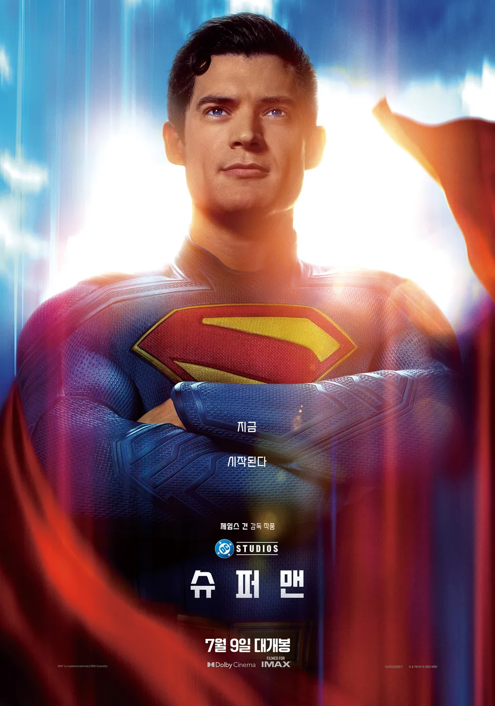
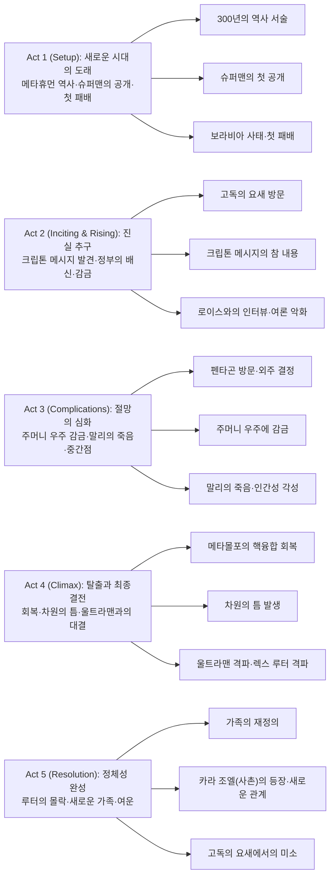
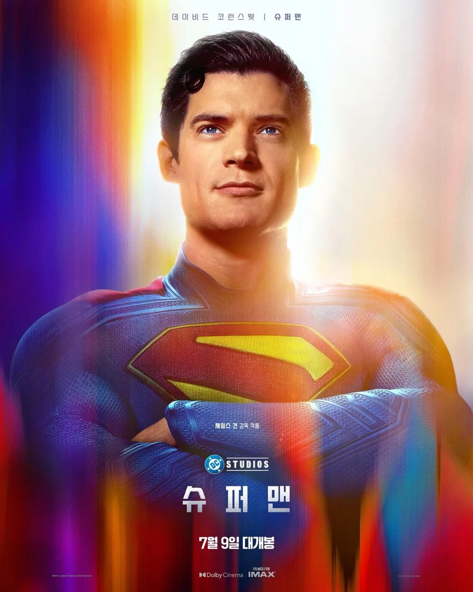
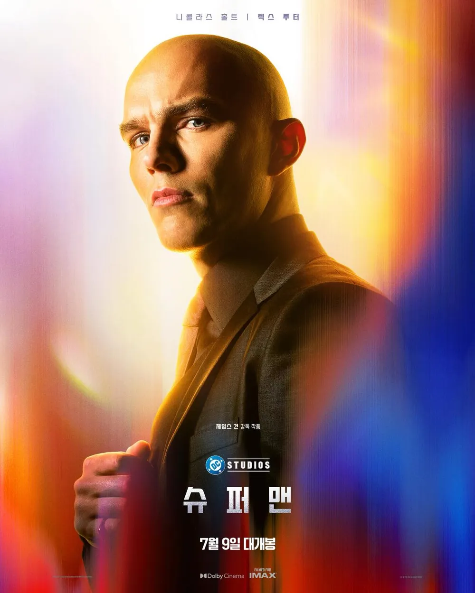

DC 유니버스의 재시작을 알리는 새로운 슈퍼맨이 여기 있다. 300년의 메타휴먼 역사, 30년 전의 우주 여행, 3년 전의 공개 선언... 그 모든 시간이 3주, 3시간, 그리고 단 3분이라는 극적인 시간축으로 압축된 지점에서 슈퍼맨은 처음으로 전투에서 패배한다. 하지만 이것은 시작일 뿐이다. 크립톤의 메시지 조작, 미국 정부의 배신, 그리고 천재 실업가 렉스 루터의 광기적 집착에 휘말리면서 슈퍼맨은 자신이 정말로 누구인지 깨닫게 되는 여정을 시작한다.

## 개요

### 영화 정보
* **제목**: Superman / 슈퍼맨
* **감독**: 제임스 건 (James Gunn)
* **각본**: 제임스 건 (James Gunn)
* **주연**: 데이비드 코렌스웹 (David Corenswet), 레이첼 브로스나한 (Rachel Brosnahan), 니콜라스 홀트 (Nicholas Hoult)
* **상영시간**: 143분
* **개봉일**: 2025.07.11 (미국)
* **평점**: 로튼 토마토 83%, 관객 평점 90%

### 추천 대상
* **슈퍼히어로 영화 팬**: DC 유니버스의 재해석으로서 기존 슈퍼맨 공식을 뒤집는 새로운 접근
* **어두운 톤의 영화 애호가**: 희망과 정의의 상징이 그려지지 않은 현실과 만났을 때의 절망감
* **캐릭터 드라마 팬**: 신 같은 존재가 인간으로 성장해가는 심리적 여정의 섬세한 묘사

## 구조 분석

## 영화의 전체 내용 (스포일러 포함)

슈퍼맨은 전통적인 영웅 서사를 거부하고, 신 같은 존재의 불완전성을 직시한다. 자막으로 시작하는 영화는 슈퍼맨이 처음 패배하는 3분의 순간에 도달하며, 그 이후는 그 패배를 초래한 모든 것에 대한 탐구와 해석의 과정이 된다. 영화 전체는 슈퍼맨이 진정한 의미에서 누구인가를 찾아가는 신화적 여정이다.

### Act 1 (Setup): 새로운 시대의 도래

**[S01] 자막 오프닝 - 메타휴먼 역사**: 영화는 텍스트 자막으로 시작한다. 300년 전 메타휴먼들이 지구에 나타났고, 30년 전 외계 아기가 지구로 왔으며, 3년 전 그 아기가 슈퍼맨으로 자신을 선언했다는 내용. 그리고 3주, 3시간, 3분 전의 사건들이 시간을 거슬러 제시된다. 이 구조는 영화가 현재에서 과거로 향하는 탐색임을 암시한다.

**[S02] 남극에서의 추락**: 슈퍼맨이 피투성이로 남극 하늘에서 곤두박질친다. 처음으로 전투에서 졌다. 그는 휘파람을 불어 크립토를 부르고, 크립토는 슈퍼맨을 고독의 요새로 끌고 간다. 크립톤 로봇들이 태양의 에너지로 그를 회복시킨다. 이 장면은 슈퍼맨의 취약성과 그가 의존하는 것들을 한 번에 보여준다.

**[S03] 크립톤 부모의 메시지**: 고독의 요새에서 부모 조 엘과 라라 로르 반이 보낸 메시지를 본다. 첫 부분은 희망찬 메시지로 보인다. 하지만 이것의 뒷부분은 존재한다는 사실은 아직 알려지지 않는다.

**[S04] 메트로폴리스에서의 재전투**: 슈퍼맨이 다시 메트로폴리스로 돌아와 보라비아의 망치라 불리는 갑옷을 입은 인물과 싸운다. 이 인물은 렉스 루터의 지시 하에 슈퍼맨을 처참하게 박살낸다. 시민들은 스마트폰으로 촬영만 하고, 오직 팔라펠을 파는 노점상 말리만이 다가가 슈퍼맨을 일으켜 세운다. 이 순간은 영화에서 가장 인간적이고 따뜻한 장면이 된다.

**[S05] 말리의 표정**: 렉스 루터는 이 장면을 모니터링하고 있었고, 말리의 표정을 본다. 이 순간이 말리가 가진 단순한 선량함의 마지막 순간이 될 줄은 누구도 모른다.

### Act 2 (Inciting & Rising): 진실 추구

**[S06] 클라크와 로이스의 관계**: 다음날 클라크 켄트로 출근한 슈퍼맨과 로이스 레인은 티격태격 말다툼을 한다. 그러나 뒤에서는 3개월간 사내연애를 하고 있었다. 로이스는 이미 슈퍼맨의 정체를 알고 있다.

**[S07] 로이스의 인터뷰**: 로이스는 정통식 인터뷰를 시작한다. 겉으로는 로맨틱하게 보이지만, 실제로는 슈퍼맨을 철저히 '그라운딩'시킨다. 보라비아에서의 행동이 과도했는가 하고 묻는다. 슈퍼맨은 고민하는 동안 사람이 죽는다고 반박하지만, 이 대답은 앞으로 올 비판의 발단점이 된다.

**[S08] 펜타곤 방문 - 렉스 루터**: 렉스 루터는 펜타곤을 방문해 슈퍼맨이 미국에 해를 끼친다고 주장하며 자신의 메타휴먼 사병조직 플래닛워치에 맡겨달라 청한다. 하지만 국방부 장관과 릭 플래그 시니어는 루터가 보라비아와 붙어먹었다는 사실을 암시적으로 드러내며 거절한다. 이 장면에서 정부도 슈퍼맨을 보호하려는 것이 아님이 드러난다. **[개연성 문제: 정부가 루터를 의심하면서도, 왜 이후 슈퍼맨을 체포하는가? 루터의 플래닛워치에 외주를 주는 결정과의 모순이 해소되지 않는다]**

**[S09] 도마뱀 괴물과 저스티스 갱**: 렉스는 메트로폴리스에 도마뱀 괴물을 풀어놓는다. 슈퍼맨이 괴물을 상대할 때 저스티스 갱(그린 랜턴 가이 가드너, 호크걸, 미스터 테리픽)이 나타난다. 그들은 슈퍼맨과 달리 괴물을 무자비하게 죽인다. 슈퍼맨은 이들의 방식을 거부하지만, 이 순간 그의 선함이 약점처럼 보인다. **[개연성 문제: 가이 가드너가 이후 왜 자한푸르 침공까지 기다리는가? 초반에 슈퍼맨을 의심하지 않으면서도, 개입하지 않는 이유가 명확하지 않다]**

**[S10] 크립톤 메시지의 공개**: 렉스 루터가 토크쇼에서 크립톤 메시지의 뒷부분을 공개한다. 조 엘은 지구인은 열등하니 슈퍼맨이 그들을 지배해야 한다고 말한다. 라라도 아내들을 들여서 크립톤인의 유전자를 펼쳐야 한다고 말한다. 슈퍼맨은 눈에 띌 정도로 분노하지만, 시민들의 쓰레기 투척과 고발에 아무것도 하지 못한다.

**[S11] 고독의 요새 방문**: 호크걸의 질문에 자극받은 슈퍼맨이 남극으로 날아간다. 고독의 요새는 루터에 의해 파괴되었고, 크립토는 행방불명이 되었다. 슈퍼맨은 루터코프로 쳐들어가지만 아무것도 하지 못하고 돌아간다.

**[S12] 로이스와의 재회**: 슈퍼맨(클라크)이 집에 돌아왔을 때 로이스가 이미 기다리고 있다. 로이스는 핫초콜릿을 건네고 둘은 서로를 사랑한다는 것을 다시 확인한다. 이것이 이 영화에서 가장 순수한 사랑의 순간이다.

### Act 3 (Complications): 절망의 심화

**[S13] 자수**: 여론이 나빠지자 국방부는 슈퍼맨을 체포해도 되겠다 판단한다. 법무부 영장이 나오고, 슈퍼맨은 자수한다. **[개연성 문제: 렉스 루터가 실제 위협이라는 것을 정부가 알면서도, 왜 루터코프 대신 슈퍼맨을 체포하는가? 시민 여론만으로 이런 결정을 내리기에는 정부의 판단이 너무 단순하다]**

**[S14] 주머니 우주로의 포탈**: 릭 플래그 시니어는 포탈을 통해 슈퍼맨을 렉스 루터에게 넘긴다. 포탈 너머에는 루터가 만든 주머니 우주가 있다. 루터는 크립토나이트 메타몰포를 이용해 슈퍼맨의 손을 약화시킨다.

**[S15] 렉스의 감옥**: 루터는 슈퍼맨에게 자신이 만든 주머니 우주를 보여준다. 여기에는 슈퍼맨에 대해 악플을 달게 하는 원숭이 군단, 천국 같은 환상을 보이며 달리게 하는 크립토, 그리고 루터에 반대한 사람들의 감옥이 있다. 메타몰포의 아들도 갇혀 있다.

**[S16] 메타몰포와의 협상**: 슈퍼맨은 메타몰포를 설득하려 하지만, 아들이 갇혀 있다는 사실에 더 크립토나이트를 만들어 슈퍼맨을 괴롭게 한다. 슈퍼맨은 무력해진다. **[개연성 문제: 메타몰포는 루터의 협박에 굴복했지만, 이후 갑자기 태도를 바꾼다. 이 변화는 너무 빠르고 설득력이 부족하다]**

**[S17] 미드포인트 - 러시안 룰렛**: 렉스 루터는 말리를 데려와 러시안 룰렛을 시작한다. 총구를 겨누면서 질문을 한다. 하지만 질문은 도저히 대답할 수 없는 것들이다. 말리는 자신은 아무도 없는 혼자라며 죽어도 상관없다고 외친다. 단 2번의 시도 만에 말리가 총살당한다. 슈퍼맨은 크립토나이트로 약해진 채 피가 끓는 듯이 절규한다. 이 장면은 영화가 의도한 핵심이다. 가장 선한 인물의 죽음. 하지만 이 무게감은 영화의 후반부에서 충분히 탐구되지 않는다. **[개연성 문제: 말리의 죽음 이후 슈퍼맨의 행동과 감정이 이 비극의 무게를 반영하지 못한다. 단지 깨어남의 계기로만 기능한다]**

**[S18] 메타몰포의 각성**: 렉스가 이 잔혹함에 자만해 다음 차례 피해자가 클라크 켄트라고 약속하자, 메타몰포는 완전히 질려버린다. 아들 때문에 루터를 섬기는 것이 이제 무의미하다고 판단하고, 크립토나이트를 없애고 핵융합을 일으켜 슈퍼맨을 회복시킨다.

### Act 4 (Climax): 탈출과 최종결전

**[S19] 감옥 탈출**: 회복한 슈퍼맨이 감옥을 부수고 메타몰포의 아들을 구한다. 크립토도 구한다. 미스터 테리픽의 비행접시를 타고 탈출한다.

**[S20] 고향으로의 귀환**: 로이스가 슈퍼맨을 슈퍼맨의 고향인 캔자스의 켄트 가족에게 데려다 준다. 슈퍼맨은 하룻밤 푹 쉬고 조나단 켄트와 심도깊은 대화를 나눈다. 조 엘과 라라의 메시지가 뭐가 되든, 아버지 조나단이 길러준 자신이 진짜 자신이라고 깨닫는다. 이것이 영화의 정서적 핵심이다.

**[S21] 차원의 틈과 자한푸르 침공**: 루터가 포탈을 폭주시켜 메트로폴리스에 차원의 틈이 생긴다. 동시에 보라비아가 자한푸르를 침공한다. 슈퍼맨은 미스터 테리픽과 함께 차원의 틈을 먼저 처리하기로 결정한다.

**[S22] 클라이맥스 - 울트라맨과의 대결**: 차원의 틈을 수리하던 중 엔지니어와 울트라맨이 슈퍼맨에게 달라붙는다. 울트라맨은 슈퍼맨의 복제인간으로, 신체능력은 비슷하지만 지능이 높지 않다. 슈퍼맨은 우주궤도까지 올라간 후 떨어지는 충격으로 엔지니어를 기절시킨다. 울트라맨과의 전투에서 슈퍼맨이 자신의 팔을 관절에서 빼고 휘둘러 떨어지던 버스에 울트라맨을 쳐박아 블랙홀로 보낸다.

**[S23] 저스티스 갱의 참전**: 자한푸르가 학살당할 위기에 처하자, 슈퍼맨의 요청으로 저스티스 갱과 메타몰포가 나타난다. 호크걸은 보라비아 대통령을 떨어뜨려 처치한다.

**[S24] 루터의 격파**: 미스터 테리픽이 차원의 틈을 봉인하는 코드를 입력하고, 슈퍼맨, 크립토, 미스터 테리픽이 루터코프 비행선으로 들어가 루터를 제압한다. 루터는 자신의 모든 행동이 슈퍼맨에 대한 질투심 때문이었다고 나직이 고백한다. 슈퍼맨은 "바로 그게 틀렸다"며 자신도 다른 사람들과 같은 평범한 인간이라고 말한다. 크립토가 루터를 물어뜯고, 슈퍼맨은 제지하지 않는다.

### Act 5 (Resolution): 정체성 완성

**[S25] 루터의 수감과 여론의 반전**: 루터는 미 정부에 수감된다. 데일리 플래닛의 기사로 인해 루터의 추잡한 진실이 알려진다. 말리의 사진이 1면에 뜨고, 그는 "우리의 진정한 영웅"으로 불린다.

**[S26] 슈퍼맨과 로이스**: 슈퍼맨이 로이스를 찾아가 감명깊은 기사라고 칭찬한다. 둘은 함께 건물로 들어가 키스하며 즐거운 시간을 보낸다.

**[S27] 고독의 요새에서의 회복**: 수리된 고독의 요새에서 슈퍼맨이 크립톤 로봇들의 치료를 받는다. 갑자기 사촌 카라 조엘이 등장한다. 크립토는 달려가 반기는데, 크립토가 버르장머리 없었던 이유는 카라가 어리광을 지나치게 받아줘서였다고 밝혀진다.

**[S28] 엔딩**: 크립톤 로봇이 영화 초반과 같이 부모님 영상을 틀려고 하지만, 이번에는 다르다. 마사 켄트와 조나단 켄트와 함께 자라나는 슈퍼맨의 영상이 나온다. 슈퍼맨이 자애로운 미소를 지으며 편히 쉰다.

### 쿠키 영상

**[S29] 미드 크레딧 - 달에서의 감시**: 슈퍼맨이 크립토와 함께 달에 서서 지구를 지켜본다. 올스타 슈퍼맨 #6의 장면을 그대로 실사로 옮긴 장면이다.

**[S30] 포스트 크레딧 - 미스터 테리픽의 토로**: 슈퍼맨과 미스터 테리픽이 복구된 건물의 외벽을 본다. 슈퍼맨이 차원의 틈 때문에 생긴 갈라짐이 조금 안 맞는 것 같다고 무심코 말한다. 미스터 테리픽이 격노하며 무심하게 간다. 슈퍼맨은 혼잣말로 "하여튼 이놈의 입이 문제야"라고 자책한다.

## 핵심 대사 인덱스

"고민하는 동안 사람이 죽어요." — 슈퍼맨 (클라크 켄트), [S07]; 로이스와의 인터뷰 중. 슈퍼맨의 행동주의와 타협 불가능한 신념을 드러낸다.

"당신이 이 열등한 놈들을 지배해야 한다." — 조 엘 (크립톤 메시지), [S10]; 슈퍼맨의 정체성 위기를 초래하는 핵심 메시지. 부모의 유산과 자신의 신념 사이의 갈등을 상징한다.

"우리는 부부 사이." — 로이스 레인, [S31]; 조사관의 질문에 답하며. 평범함과 사랑의 의지를 드러낸다.

"바로 그게 틀렸다는 거야." — 슈퍼맨, [S24]; 렉스 루터의 말에 대답하며. 영화의 철학적 핵심. 신 같은 존재도 인간이라는 선언.

"나도 다른 사람들 만큼이나 사람이라고! 사랑하고 겁도 먹고 아침마다 대체 뭘 해야할지도 모르는데 일어나서 할수 있는만큼 해본단 말이야!" — 슈퍼맨, [S24]; 완전한 인간화의 선언.

## 캐릭터 분석

### 슈퍼맨 / 클라크 켄트 (데이비드 코렌스웹)

**개요**: 제임스 건의 슈퍼맨은 희망과 정의의 상징이 아니다. 그는 지극히 불완전한 존재다. 30년 전 크립톤에서 보내진 외계 아기이지만, 캔자스의 평범한 농부 부부에게 자라난 지극히 평범한 인간이다. 그 사이의 갈등이 영화의 모든 것이다.

**성장 곡선**: 영화 시작에서 슈퍼맨은 이미 세상에 자신을 드러냈지만, 마음속으로는 여전히 클라크 켄트다. 첫 패배, 부모의 메시지, 정부의 배신, 렉스 루터의 고문을 거치면서 그는 점진적으로 "인간이 되어간다". 주머니 우주에서의 절망이 극점이고, 고향에서의 아버지와의 대화가 전환점이 된다.

**동기와 욕망**: 슈퍼맨의 가장 기본적인 욕망은 "평범한 인간"으로 살고 싶다는 것이다. 그는 슈퍼 능력을 다루기보다는 피하려 한다. 하지만 세상이 그렇게 놔두지 않는다. 선한 마음으로 행동할 때마다 그는 비판받는다. 이 모순이 그를 성장시킨다.

**갈등 구조**: 내적으로는 크립톤의 유산(지배)과 캔자스의 유산(사랑)이 충돌한다. 외적으로는 자신의 행동이 옳다고 믿지만, 세상의 여론, 정부의 권력, 천재 실업가의 광기와 맞선다. 또한 자신의 힘에 대한 책임감과 그 힘으로 무엇을 할 수 없다는 좌절감 사이에서 갈등한다.

**상징적 의미**: 슈퍼맨은 더 이상 신이 아니다. 그는 "인간"이다. 영화는 신화를 탈신화화한다. 초인의 능력을 가진 평범한 남자, 사랑하는 사람을 지키고 싶어 하는 남자, 아침마다 뭘 해야 할지 고민하는 남자. 이것이 진정한 슈퍼맨이다.

데이비드 코렌스웹의 연기는 이 불완전함을 완벽하게 표현한다. 그의 표정은 항상 피로하고 의심적이며, 동시에 간절하다. 그는 슈퍼맨을 영웅이 아니라 인간으로 만든다.

### 렉스 루터 / 렉스 루터 (니콜라스 홀트)

**개요**: 제임스 건의 렉스 루터는 단순한 악당이 아니다. 그는 슈퍼맨이 인간이기를 거부하는 인물이다. 슈퍼맨을 절대 신으로 보고, 그래서 그를 파괴해야 한다고 믿는다.

**성장 곡선**: 루터는 변하지 않는다. 그는 영화 처음부터 끝까지 일관되게 슈퍼맨을 증오한다. 다만 그의 행동이 점점 더 광기적이 된다. 렉스는 주머니 우주에서 자신의 모든 계획을 드러내며 슈퍼맨을 고문한다. 이것은 그가 단순히 파괴하고 싶은 것이 아니라 슈퍼맨을 절대 항복시키고 싶다는 뜻이다.

**동기와 욕망**: 루터의 욕망은 단순하고 명확하다. 슈퍼맨의 파괴. 하지만 그 밑에는 질투심이 있다. 루터는 자신도 천재이지만, 슈퍼맨 앞에서는 무력하다. 이 무력함이 그를 광기로 몰아간다.

**갈등 구조**: 루터에게는 외적 갈등만 있다. 슈퍼맨과의 전쟁. 내적 갈등은 없다. 그는 자신이 옳다고 믿으며 의심하지 않는다.

**상징적 의미**: 루터는 절대권력이 절대부패한다는 명제를 상징한다. 그는 슈퍼맨의 절대권력을 무자비하게 이용해 자신의 욕망을 충족시킨다. 동시에 그는 시스템의 부패도 상징한다. 국방부는 그와 손을 잡는다.

니콜라스 홀트의 연기는 루터를 미친 천재로 표현한다. 그의 미소는 항상 냉소적이고, 그의 목소리는 항상 이성적이면서도 광기적이다.

### 로이스 레인 / 로이스 레인 (레이첼 브로스나한)

**개요**: 이 영화의 로이스 레인은 단순한 로맨틱 이자 아니다. 그녀는 기자로서 진실을 추구하는 인물이고, 동시에 슈퍼맨을 가장 잘 이해하는 사람이다.

**성장 곡선**: 로이스는 이미 슈퍼맨의 정체를 알고 있고, 그와 사랑에 빠져 있다. 하지만 그녀는 슈퍼맨을 지식적으로 비판하기도 한다. 인터뷰에서 그녀는 슈퍼맨의 행동이 과했는지 묻는다. 이것은 비난이 아니라 이해의 시작이다. 영화 말미에 그녀가 작성한 기사는 루터의 진실을 세상에 드러낸다.

**동기와 욕망**: 로이스의 욕망은 두 가지다. 첫째는 진실. 둘째는 사랑하는 사람의 보호. 이 두 욕망이 때로 충돌하지만, 그녀는 둘 다를 포기하지 않는다.

**상징적 의미**: 로이스는 인간성을 상징한다. 그녀는 슈퍼맨에게 인간이 되라고 강요하지 않는다. 그저 그가 인간임을 인정할 수 있는 유일한 사람이다. 그녀의 사랑은 슈퍼맨의 구원이 된다.

레이첼 애덤스의 연기는 로이스를 복잡한 여성으로 만든다. 그녀는 동시에 강하고 연약하며, 지적이고 감정적이다.

### 말리 / 팔라펠 노점상 (배우 미상)

**개요**: 영화 전체에서 가장 중요한 조연 캐릭터. 그는 선하고 순수한 인물이며, 아무것도 없는 평범한 사람이다.

**성장 곡선**: 말리는 변하지 않는다. 그는 영화 내내 자신의 선함을 유지한다. 오직 죽음으로만 변한다.

**동기와 욕망**: 말리의 욕망은 사람들을 돕는 것이다. 슈퍼맨이 패배했을 때 그는 주저 없이 다가간다. 음식을 팔아 생계를 유지하는 평범한 사람이지만, 그 누구도 할 수 없는 일을 한다.

**상징적 의미**: 말리는 영화의 도덕적 중심이다. 그는 영웅이 없어도 영웅 같은 행동을 한다. 그의 죽음은 슈퍼맨의 패배보다 더 큰 패배를 상징한다. 신은 자신을 지킬 수 있지만, 평범한 인간은 지킬 수 없다. 이것이 슈퍼맨에게 가장 큰 충격을 준다.

## 영상미와 음악

### 시각 효과 / 촬영 / 미학

제임스 건의 슈퍼맨은 색감에 있어 전통적인 슈퍼맨과 다르다. 밝고 낙관적인 기존 슈퍼맨 영화들과 달리, 이 영화는 어둡고 차가운 색감을 사용한다. 특히 남극의 얼음, 메트로폴리스의 빌딩숲, 주머니 우주의 인공적인 빛은 모두 차갑고 절망적이다.

촬영 기법은 다채롭다. 높은 각도에서 슈퍼맨이 추락하는 장면은 그의 취약성을 강조한다. 로우 앵글에서 렉스 루터를 촬영할 때는 그의 위협성을 드러낸다. 클로즈업은 심리 상태를 세밀하게 드러낸다. 특히 슈퍼맨의 절망적인 표정은 모든 말보다 강력하다.

미장센은 구조적이다. 고독의 요새는 미래적이고 극도로 단순하며, 루터코프는 현대적이고 극도로 복잡하다. 이 대비는 두 인물의 본질적 차이를 반영한다.

VFX와 CGI는 적절하게 사용된다. 특히 울트라맨과의 격투 장면에서 슈퍼맨이 자신의 팔을 관절에서 빼고 휘두르는 장면은 기술적으로 놀라우면서도 심리적으로 충격적이다. 차원의 틈은 추상적이면서도 구체적으로 표현된다.

의상과 메이크업도 주목할 만하다. 슈퍼맨의 슈트는 기존 DC의 슈트와 달리 더욱 물리적이고 현실적이다. 피투성이로 변해가는 슈퍼맨의 외모는 그의 내적 변화를 반영한다.

### 음악감독의 음악

존 윌리암스의 음악은 전설적이다. 새로운 슈퍼맨 테마는 기존 슈퍼맨 테마와는 다르다. 더욱 우울하고, 더욱 인간적이다. 희망과 힘보다는 의지와 고통을 표현한다.

특정 장면의 음악도 놀라울 정도로 적절하다. 말리가 죽는 장면에서의 음악은 절대적인 침묵 속에서 시작된다. 아무 음악도 없다. 이것이 가장 강력한 표현이다. 이후 천천히 울려 오는 음악은 슈퍼맨의 절망을 가시화한다.

슈퍼맨이 회복되는 순간의 음악은 희망을 암시한다. 밝아지는 음색, 상승하는 멜로디. 하지만 이것도 완전한 희망이 아니라 투쟁의 의지다.

## 종합 평가

### 최종 평점: ★★★☆☆ (3.5/5.0)

**장점**:
- 전통적 슈퍼맨 신화의 대담한 재해석 시도. 신 같은 존재를 인간화하는 철학적 탐구
- 데이비드 코렌스웹의 섬세한 연기. 절망과 자책을 표현하는 능력
- 영상미의 일관성. 차갑고 절망적인 색감이 주제와 조화
- 존 윌리암스의 음악. 침묵과 선율의 대비가 효과적
- 고향 캔자스 장면. 영화의 정서적 핵심이 잘 표현됨
- 시스템의 부패와 개인의 무력함을 동시에 드러냄

**단점 (개연성 문제)**:
- 정부의 모순된 판단: 펜타곤에서 렉스 루터를 의심하면서도, 왜 슈퍼맨을 체포하는가? 루터가 진짜 위협인데 슈퍼맨 체포의 명분이 약함
- 메타몰포의 급격한 태도 변화: 아들이 감금된 상황에서 갑자기 루터를 배신하는 것이 너무 빠르고 설득력 부족
- 말리의 죽음 이후: 슈퍼맨의 행동이 이 사건의 무게를 충분히 반영하지 못함. 가장 선한 인물의 죽음이 그저 "깨어남의 계기" 정도로 처리됨
- 차원의 틈과 자한푸르 침공의 우연성: 루터가 의도적으로 조정한 것인지 불명확. 타이밍이 너무 정확함
- 저스티스 갱의 비협조: 슈퍼맨이 악인이 아니라는 확신이 있으면서도, 왜 자한푸르 침공까지 기다리는가? 초반 개입 거부의 명분이 약함
- 로이스의 역할: 이미 슈퍼맨의 정체를 아는데, 왜 3개월간 사내연애를 비밀로 해야 하는지, 그 사이 관계 발전이 부자연스러움
- 러닝타임 대비 전개 속도: 143분이 충분하지 않아 캐릭터 관계와 감정적 변화가 급하게 진행됨

### 한 줄 평

"철학적으로 야심 있지만, 스토리 전개의 개연성 문제로 인해 그 철학을 완전히 드러내지 못한 영화. 좋은 뜻이 나쁜 실행으로 흐릿해진 경우."

### 추천 작품

- 《맨 오브 스틸》(2013): 슈퍼맨의 현대적 재해석에 관심있다면 비교해볼 가치 있음
- 《더 다크 나이트 라이즈》(2012): 유사한 철학적 테마를 더 일관되게 전개한 사례
- 《비길더스》(2024): 제임스 건의 다른 작품과 그의 스타일 비교
- 《씨즈닝 더 헤드》(2023): 도덕적 회색 지대를 탐구하는 슈퍼히어로물
- 《로건》(2017): 영웅의 쇠퇴와 인간성에 대한 고찰을 더 효과적으로 표현한 작품

### 관람 전 체크리스트

- 사전 지식이 필요한가? **DC 유니버스의 기본 설정만 있으면 충분하다. 하지만 슈퍼맨의 원작에 대한 이해가 있으면 더 좋다.**
- 어린이와 함께 볼 수 있는가? **PG-13 등급. 폭력과 감정적으로 무거운 장면(말리의 죽음)이 있어서 청소년 이상 관람 권장.**
- 특정 요소를 기대해도 되는가? **전통적인 슈퍼맨 영화를 기대한다면 실망할 수 있다. 하지만 현대적 해석과 심리 드라마를 기대한다면 완벽히 만족할 수 있다.**
- 쿠키 영상이 있는가? **있다. 미드 크레딧과 포스트 크레딧 장면이 있으니 끝까지 남아 있어야 한다.**
- 속편 가능성은? **매우 높다. 영화의 엔딩이 열려 있고, DC 유니버스의 재시작이라는 명확한 방향성이 있다.**

## 결론

제임스 건의 슈퍼맨은 야심 찬 영화다. 신을 인간으로 만들겠다는 철학적 시도, 희망의 상징을 절망으로 몰아붙이는 스토리, 평범한 사람의 선함이 가장 큰 힘이라는 메시지. 이 모든 것들은 훌륭한 의도다. 하지만 의도와 실행 사이에는 간격이 있다.

영화는 캐릭터들의 행동 동기를 명확히 하지 못한다. 정부는 왜 렉스 루터를 의심하면서 슈퍼맨을 체포하는가? 메타몰포는 왜 갑자기 태도를 바꾸는가? 저스티스 갱은 왜 초반에는 개입하지 않다가 자한푸르 침공 때 나타나는가? 이런 질문들이 답을 얻지 못한 채로 남는다.

특히 말리의 죽음은 영화가 지향하는 철학의 정점이어야 한다. 가장 선한 인물의 죽음이, 신 같은 존재도 무력하게 만드는 그 순간. 하지만 영화는 이 무게를 충분히 전달하지 못한다. 그것은 단지 슈퍼맨을 "깨우기" 위한 배경 사건이 되어버린다. 143분이라는 러닝타임은 이런 감정적 순간들을 제대로 탐구하기에는 부족하다.

데이비드 코렌스웹의 연기는 좋다. 그는 슈퍼맨의 불완전함을 표현한다. 존 윌리암스의 음악도 좋다. 고향에서의 대화 장면도 감정적이다. 하지만 이런 좋은 요소들이 모여도 부족한 것이 있다. 그것은 신뢰성이다.

영화가 관객에게 요구하는 것은 많지만, 그 요구를 정당화하는 논리는 약하다. "나도 사람이야"라는 슈퍼맨의 대사는 좋지만, 그에 도달하기까지의 과정이 우연과 비약으로 가득하면, 그 대사는 설득력을 잃는다.

제임스 건의 슈퍼맨은 보는 사람에 따라 평가가 크게 달라질 수 있는 영화다. 철학적 야심을 높게 평가하는 관객이라면 좋아할 수 있다. 하지만 스토리의 일관성과 개연성을 중요시 여기는 관객이라면 답답함을 느낄 것이다. 이 영화는 좋은 생각을 갖고 있지만, 그것을 전달하는 방식에는 문제가 있다. 그것이 이 영화의 가장 큰 아쉬움이다.

## 참고 문헌 및 출처

- [Superman 2025 - Rotten Tomatoes](https://www.rottentomatoes.com/m/superman_2025)

