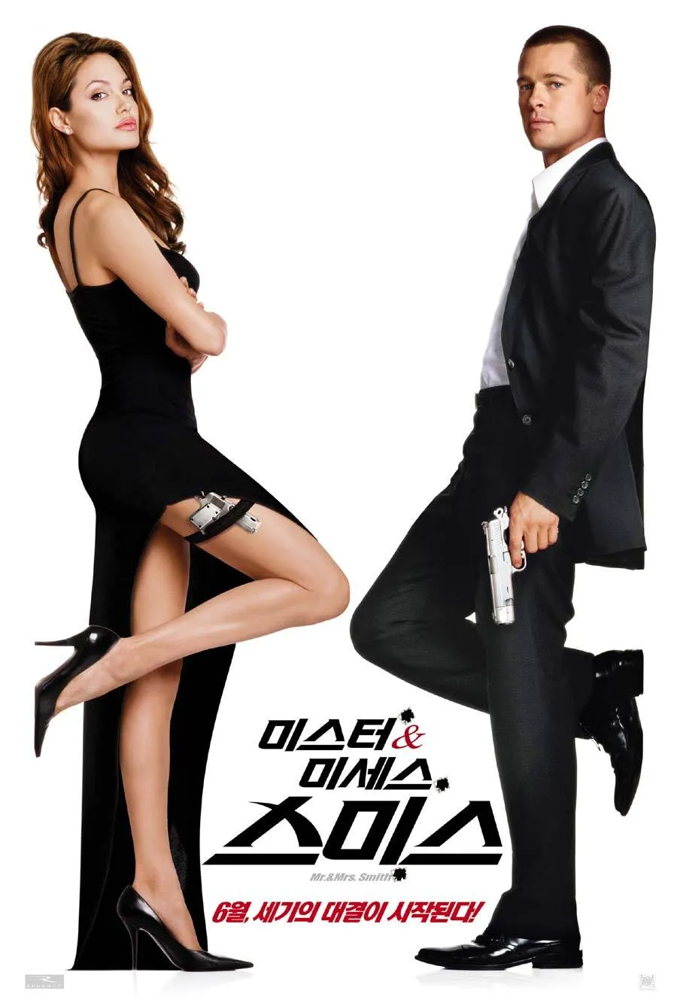
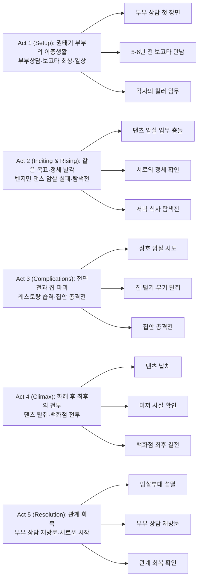

『미스터 앤 미세스 스미스』는 "부부싸움은 칼로 물 베기"라는 속담을 **총알과 폭탄으로 재해석**한 작품이다. 권태기에 빠진 평범한 부부처럼 보이지만 실제로는 서로 경쟁 중인 암살 조직의 최고 킬러인 존과 제인이, 같은 목표물을 제거하다 서로의 정체를 알게 되면서 벌어지는 이야기. 부부 상담 장면으로 시작해 백화점 총격전으로 끝나는, **결혼 생활을 액션으로 풀어낸 유쾌한 스릴러**다.

## 개요

### 영화 정보

* **제목**: Mr. & Mrs. Smith / 미스터 앤 미세스 스미스
* **감독**: Doug Liman
* **각본**: Simon Kinberg
* **주연**: Brad Pitt, Angelina Jolie, Vince Vaughn, Adam Brody, Kerry Washington, Keith David
* **음악**: John Powell
* **장르**: Action, Comedy, Romance, Thriller
* **상영시간**: 120분
* **개봉일**: 2005.06.10 (미국) / 2005.07.13 (한국)
* **제작사**: Regency Enterprises, New Regency, Summit Entertainment, Weed Road Pictures, Epsilon Motion Pictures
* **배급사**: 20th Century Fox
* **제작비**: 약 1억 1천만 달러
* **평점(참고)**: Rotten Tomatoes 60% / IMDb 6.5

### 추천 대상

* **액션 코미디 팬**: 총격전과 격투를 유머와 로맨스로 버무린 스타일리쉬한 액션
* **부부 영화 애호가**: 권태기 부부가 서로를 재발견하는 독특한 관계 회복 스토리
* **브래드 피트·안젤리나 졸리 팬**: 두 배우의 완벽한 케미스트리와 스타 파워

## 구조 분석

## 영화의 전체 내용

이 영화는 겉으로는 평범해 보이지만 실제로는 서로 경쟁하는 암살 조직에 소속된 부부가, 같은 목표물을 제거하다 서로의 정체를 알게 되면서 벌어지는 **액션 로맨스 코미디**다. 부부 상담 장면으로 시작해, 결혼 전 보고타에서의 만남, 현재의 권태기, 그리고 서로를 죽이려다 결국 다시 사랑을 확인하는 과정을 그린다.

### Act 1 (Setup): 권태기 부부의 이중생활

**[S01] 부부 상담 — 소통 부재**: 영화는 존 스미스와 제인 스미스가 부부 관계 컨설턴트 앞에 앉아 상담을 받는 장면에서 시작한다. 상담사가 "몇 년 동안 결혼 생활을 했나요?"라고 묻자, 두 사람은 동시에 "5년" "6년"이라고 각각 다른 대답을 한다. 이들은 서로에게 솔직하지 못하고, 권태기에 빠져 있으며, 제인이 설치한 커튼을 존이 싫어한다는 등 사소한 갈등이 쌓여 있다. 상담사가 "1부터 10까지 점수로 결혼 생활을 평가한다면?"이라고 묻자, 두 사람은 잠시 망설이다 "8"이라고 대답하지만, 표정에는 확신이 없다.

**[S02] 보고타 회상 — 5~6년 전 첫 만남**: 플래시백으로 극중 시점으로부터 5~6년 전, 콜롬비아 보고타의 한 호텔에서 존과 제인이 처음 만난 장면이 나온다. 두 사람은 같은 호텔 바에 앉아 있었고, 갑자기 콜롬비아 당국의 검문이 시작된다. 존과 제인은 서로를 모르는 사이였지만, 당국의 심문을 피하기 위해 즉흥적으로 부부인 척 연기한다. 존은 제인의 손을 잡고 키스하며 "우리는 신혼부부입니다"라고 둘러댄다. 위기를 모면한 후, 두 사람은 서로에게 강렬하게 끌리고 호텔 방에서 열정적인 밤을 보낸다. 이후 빠른 속도로 사랑에 빠지고 결혼에 이른다.

**[S03] 뉴욕 교외 생활 — 이중 신분**: 현재로 돌아오면, 존과 제인은 뉴욕 교외의 큰 Colonial Revival 스타일 저택에서 살고 있다. 존은 건축 회사 중역으로, 제인은 IT 헤드헌터로 위장하고 있다. 두 사람은 부유한 이웃들과 억지로 사교 모임을 하며 평범한 중산층 부부를 연기한다. 하지만 실제로는 둘 다 서로 다른 계약 살인 조직에 소속된 최고의 킬러다. 존은 남성적이고 직관적인 스타일의 암살자이고, 제인은 계획적이고 섬세한 스타일의 암살자다.

**[S04] 존의 임무 — 바주카포 암살**: 어느 날, 존은 조직으로부터 벤저민 댄츠(Benjamin "The Tank" Danz)라는 목표물을 제거하라는 임무를 받는다. 댄츠는 DIA(국방정보국) 수감자로, 교도소 이송 중에 제거해야 한다. 존은 바주카포를 준비하고 이송 경로에서 대기한다.

**[S05] 제인의 임무 — 폭탄 암살**: 같은 시각, 제인 역시 자신의 조직으로부터 같은 목표물인 댄츠를 제거하라는 명령을 받는다. 제인은 댄츠의 이동 경로에 폭탄을 설치하고 원격 폭파 준비를 한다.

**[S06] 우연한 충돌 — 노상방뇨와 폭탄 고장**: 존은 댄츠의 차량이 오기 전, 급하게 노상방뇨를 한다. 이때 습관적으로 다리를 턴다. 그런데 우연히도 존이 소변을 보는 과정에서 제인이 설치한 폭탄의 작동 장치를 건드려 폭탄이 작동하지 않게 된다. 존이 바주카포로 댄츠의 차량을 날리려던 순간, 작은 바위 산에서 저격이 날아온다. 제인은 이 남자를 자신의 임무를 방해하는 훼방꾼으로 판단하고 존을 저격한다.

**[S07] 바주카포 공격 — 상호 방해**: 존은 방탄복 덕분에 목숨을 건진다. 그는 즉시 저격수가 있는 바위 산 쪽으로 바주카포를 발사한다. 제인은 폭발 직전 오토바이를 타고 재빠르게 도망친다. 결국 공동의 목표였던 댄츠의 암살은 실패로 돌아간다.

**[S08] 노트북 잔해 발견 — 충격적 발견**: 존은 바주카포로 가격한 지점을 수색하던 중 노트북 잔해를 발견한다. 이를 통해 어떤 조직인지 파악에 나섰고, 분석 결과 'I-Temp Technology'로 가장한 그 회사의 CEO에 자신의 부인 제인 스미스가 떡하니 적혀 있다. 존은 충격에 빠진다.

**[S09] 촬영 영상 분석 — 뒤태 확인**: 제인 역시 촬영 영상을 분석하던 중 노상방뇨하는 남자의 뒤태를 보고 존임을 알아챈다. 존이 노상방뇨를 하며 다리를 터는 습관을 보고 어처구니없다는 표정을 짓는다.

### Act 2 (Inciting & Rising): 같은 목표, 정체 발각

**[S10] 저녁 7시 약속 — 탐색전 준비**: 둘은 저녁 7시에 집에서 저녁 식사를 하기로 한다. 본격적인 탐색전이 시작된다. 집에 들어서자마자 마티니 잔을 들고 존을 맞이한 제인은 메인 요리를 가지러 주방에 간다. 존은 그 틈을 타 식탁 위에 있던 나이프 하나를 숨겨놓는다.

**[S11] 바베큐 저녁 — 칼의 긴장**: 제인은 바베큐를 썰기 위해 살벌한 소리를 내며 식칼을 꺼내든다. 존은 당황하며 본인이 직접 썰겠다고 나섰으나, 제인은 또 다른 식칼을 앞주머니에서 꺼내며 빵을 썬다. 존은 제인에게 와인을 따라준 뒤 일부러 병을 떨어뜨린다. 제인은 본능적으로 재빠르게 잡아챈다. 

**[S12] 와인병 선전포고 — 전쟁 시작**: 제인은 존이 일부러 떨어뜨린 것임을 깨닫고, 자신도 일부러 와인병을 바닥에 떨어뜨리며 전쟁을 시작한다. 존이 총을 들고 나서자, 제인은 자신의 차를 타고 집에서 도망친다.

**[S13] 차량 추격 — 대화를 하자니까**: 존은 제인과 대화를 하기 위해 쫓아간다. 하지만 실수로 제인의 차 앞 유리에 총을 격발한다. 화가 끝까지 난 제인은 차에 달라붙은 존을 떨어뜨리기 위해 이리저리 곡예운전을 한다. 차 뒷좌석에 들어온 존을 보고는 운전석에서 뛰어내리는 제인. 벼랑에 떨어지는 제인의 차에 탄 존은 "얘기 좀 하자니까!(We need to talk!)"라며 공허한 외침을 날린다.

**[S14] 각자의 밤 — 죽이기 종용**: 난장판으로 끝난 탐색전 종료 후, 제인은 자신의 회사에서, 존은 자신의 킬러 친구 에디 집에서 밤을 지낸다. 존의 친구는 "6년 동안 네 아내는 널 갖고 논 거야. 책 한 권의 마지막은 네가 꾸미면 되지 않겠냐"며 죽이기를 종용한다. 제인의 직장 동료도 "그를 사랑하지 않는다면 그를 죽이는 게 제인에게 좋을 거야"라며 설득한다.

**[S15] 집 수색 — 증거 수집**: 이후 자신의 집에 돌아간 제인은 자신의 킬러 조직원들을 대동하여 존이 집에 숨겼을 만한 모든 증거들을 수집한다. 지하실에 있던 존의 무기고와 돈을 모두 털어간다. 그 후 존은 이웃집 남편을 방패 삼아 집을 구경시켜주는 척하며 제인의 행방을 찾기 위해 집을 수색하지만, 이미 제인의 수하들이 집을 털어간 뒤였다.

**[S16] 회사 잠입 — 협상 결렬**: 제인은 집에서 수집한 증거로 존을 찾으려 하지만, 이미 존은 제인의 회사에 잠입해 있었다. 존은 제인더러 도시를 떠나라는 협박 아닌 협상을 하게 되지만, 제인은 되려 존더러 떠나라 이야기를 한다. 서로를 용납하지 못하는 경쟁 업체다 보니 협상은 결렬된다.

**[S17] 새 사옥 습격 — 엘리베이터 함정**: 존은 친구의 집에서 제인의 회사에 있던 쓰레기 더미를 뒤지던 중 새로이 건설 중인 제인의 회사 사옥에 대한 정보를 입수하여 그곳으로 쳐들어간다. 제인은 엘리베이터에 타 있던 존을 함정에 가두고 당장 이 도시에서 떠나라면서 그러지 않으면 엘리베이터째로 폭파하겠다고 협박한다.

**[S18] 폭파와 좌절 — 진짜로**: 존은 할 수 있으면 해보라고 말싸움을 한다. 이를 옆에 있던 제인의 동료가 폭발 단추를 눌러버린다. 그러나 존은 함정인 3번 엘리베이터가 아닌 다른 엘리베이터에 타 있었고, 카메라를 해킹해 위치를 속였다. 그렇지만 존은 제인이 진짜로 폭파시켰다는 것에 좌절하여 머리를 싸맨다.

### Act 3 (Complications): 전면전과 집 파괴

**[S19] 레스토랑 재회 — 프로포즈 장소**: 존에게 프로포즈를 받은 레스토랑에서 홀로 눈물을 참던 제인의 옆에 정장을 빼입은 존이 나타난다. 웨이터가 "샴페인을 드릴까요?"라고 묻자 존은 "축하할 일 없으니 됐다"고 말한다. 이혼을 눈앞에 둔 부부답게 날선 대화를 나누고, 마지막이라면서 함께 춤을 춘다.

**[S20] 춤과 무장해제 — 폭탄 설치**: 춤을 추면서 서로 무장을 해제하고 티격태격하다, 결국 제인은 레스토랑을 폭파하고 그 와중에 존의 옷에도 폭탄을 설치한 채 탈출한다. 이쯤 되자 존도 화가 머리 끝까지 올라 리무진을 강탈해 제인을 추적한다.

**[S21 미드포인트] 집안 총격전 — 세상에서 가장 살벌한 부부싸움**: 겨우 집에 들어간 존과 제인은 주방기구는 물론이고 서로 상대방 몰래 집 안에 짱박아둔 무기들을 꺼내들어 세상에서 가장 살벌한 부부싸움을 시작한다. 식탁 위에 숨긴 권총, 주방 싱크대 밑의 샷건, 거실 소파 속의 자동소총까지 총동원된다. 총알과 유치한 말다툼이 오가는 가운데, 집은 완전히 난장판이 된다. 기둥은 부서지고, 가구는 박살 나고, 벽에는 총알 구멍이 뚫린다.

**[S22] 총구를 겨누다 — 죽일 수 없다**: 결국 두 사람은 서로 총구를 겨눈다. 방아쇠를 당기려는 순간, 아직 서로를 사랑하여 죽일 수 없다는 마음을 확인한다. 존은 먼저 총을 내려놓고, 제인도 총을 내려놓는다. 이후 찐한 사랑을 나누고 둘은 화해한다.

**[S23] 이웃의 방문 — 보수공사 중**: 간신히 화해한 즈음 사방에 울려퍼진 총성과 격투음을 들은 이웃집 부부가 경찰과 함께 괜찮냐고 조심히 물어본다. 둘이 더 없이 사이좋게 팔짱을 끼고 나오나, 문 너머 집 안은 난장판이 된 것과 풀어 헤쳐진 옷을 본 이웃들은 민망해한다. "보수 공사 중이냐"는 대사가 일품이다.

### Act 4 (Climax): 화해 후 최후의 전투

**[S24] 아침 식사 — 고백 타임**: 난장판인 집에 남은 식재료로 아침을 먹던 둘은 서로의 정체를 알게 된 이후 정체를 숨기기 위해 한 거짓말들을 고백한다. 제인은 고아라서 결혼식에 배우를 부모로 고용했고, 존은 결혼 경력이 있는 돌싱이라는 것이다. 서로의 진짜 모습을 처음으로 공유하는 순간이다.

**[S25] 조직의 연합 — 48시간 제한**: 이제 두 조직은 공동의 적인 존과 제인을 제거하기 위해 협동 모드에 들어간다. 48시간이 끝나기도 전에 조직에서는 두 사람을 제거하기 위한 부대를 보내고, 난장판인 집에 남은 식재료로 아침을 먹던 둘은 탈출한다.

**[S26] 이웃집 차 강탈 — 카체이싱**: 이웃집 차(미니밴)를 강탈해 도망치면서 카체이싱을 벌인다. 추격하는 암살자들의 고급 세단을 파괴하면서, 서로의 싸움 스타일과 개인 비밀에 대해 티격태격한다. 제인은 존의 전처에 대해 캐묻고, 존은 제인의 과거 남자친구 수를 따진다. 총격전 중에도 부부 싸움은 계속된다.

**[S27] 에디와의 만남 — 결혼 구하기**: 스미스 부부는 존의 친구이자 동료인 에디를 찾아간다. 에디는 두 사람에게 각각 $400,000의 현상금이 걸렸다고 알려준다. 하지만 에디는 현상금을 거절하고 두 사람을 돕기로 한다. 존과 제인은 조직과 협상하기 위해 원래 목표인 벤자민 댄츠를 잡기로 결정한다.

**[S28] 댄츠 납치 — 삼엄한 경비 뚫기**: 두 사람은 고도의 보안 시설에서 댄츠를 납치한다. 협동이 원활하지 않아 티격태격하지만, 결국 댄츠를 빼내는 데 성공한다. 댄츠를 차에 태우고 도주한다.

**[S29] 미끼의 진실 — 위치추적기**: 하지만 댄츠에게서 들은 진실은 충격적이다. 두 조직이 둘이 부부라는 걸 알고 둘을 제거하기 위해 함정을 판 것이고, 댄츠는 그저 미끼에 불과했다는 것이다. 댄츠가 미끼인 것은 지금도 마찬가지라, 허리띠에 위치추적기가 있어 주변은 조직의 암살부대가 헬기까지 동원해 포위한 상태였다.

**[S30] 선택의 순간 — 함께 싸우다**: 존과 제인은 각각 도주 수단을 갖춰 헤어지면 둘 다 살아남을 수는 있을 것이다. 하지만 그러고 싶지 않다. 존은 제인에게 "같이 가지 않을 거면 어디든 안 갈 거야(If you're not going with me, I'm not going anywhere)"라고 말한다. 제인도 마찬가지 마음이다. 둘은 함께 최후의 싸움에 들어가기로 한다.

**[S31 클라이맥스] 백화점 전투 — 암살부대 몰살**: 존과 제인은 가까운 가정용품 백화점(home decorating store)으로 들어가 진지를 구축한다. 조명, 주방용품, 가구, 페인트 통 등을 이용해 임시 방어선을 만든다. 중무장한 암살부대가 들이닥치고, 두 사람은 완벽한 호흡으로 수십 명의 암살자들을 상대한다. 제인은 정밀한 사격으로, 존은 강력한 화력으로 적들을 제압한다. 서로의 약점을 보완하고 강점을 살리는 완벽한 팀워크를 보여준다. 결국 모든 암살부대를 섬멸하는 데 성공한다.

### Act 5 (Resolution): 관계 회복

**[S32] 사후 정리 — 조직 처리**: 독특한 점은 조직을 처리하는 장면이 없다는 것이다. 암살부대를 몰살시킨 이후 두 조직이 어떻게 됐는지는 나오지 않는다. 영화는 존과 제인의 관계 회복에만 집중한다.

**[S33] 부부 상담 재방문 — 공동 활동**: 부부가 함께 조직의 암살부대를 몰살시킨 뒤, 시작 장면에 나온 부부 관계 컨설턴트에게 다시 찾아간다. 상담사가 "두 분의 관계가 어떻게 됐나요?"라고 묻자, 존과 제인은 눈빛을 교환하며 미소 짓는다. 존은 "공동 활동을 해서 사이를 회복시킬 수 있었습니다"라고 말한다. 제인은 "네, 우리는 많은 것을 함께 했어요"라고 덧붙인다.

**[S34] 상담사의 질문 — 결혼 점수**: 상담사가 다시 "1부터 10까지 점수로 결혼 생활을 평가한다면?"이라고 묻는다. 존과 제인은 서로를 바라보며 동시에 "10"이라고 대답한다. 이번에는 확신에 찬 표정이다.

**[S35] 새로운 시작 — 진짜 부부**: 영화는 두 사람이 상담실을 나서며 손을 잡고 걷는 모습으로 끝난다. 이제 그들은 더 이상 서로에게 거짓말을 하지 않는다. 킬러라는 정체를 알게 된 지금, 그들은 비로소 진짜 부부가 되었다. 영화는 "결혼 생활의 가장 큰 적은 권태와 거짓말이다"라는 메시지를 유쾌하게 전달하며 막을 내린다.

## 핵심 대사 인덱스

"We need to talk!" — 존 스미스, [S13]; 제인의 차가 벼랑으로 떨어지며 존이 외치는 대사. 부부싸움 중에도 대화를 원하는 존의 절박함을 보여준다.

"Happy endings are just stories that haven't finished yet." — 제인 스미스, [S19]; 레스토랑에서 존과 춤추며 하는 대사. 결혼 생활의 환상과 현실의 간극을 표현한다.

"I guess that's what happens when you marry someone you don't really know." — 존 스미스, [S24]; 아침 식사 중 서로의 거짓말을 고백하며 하는 대사. 관계의 본질에 대한 통찰을 담고 있다.

"Your aim's as bad as your cooking, sweetheart. And that's saying something." — 존 스미스, [S21]; 집안 총격전 중 존이 제인에게 하는 조롱. 부부싸움의 유머러스한 면을 보여준다.

"Come to Daddy." — 제인 스미스, [S21]; 총을 들고 존을 향해 다가가며 하는 대사. 치명적이면서도 관능적인 제인의 캐릭터를 보여준다.

"I never told you, but I was married once before." — 존 스미스, [S24]; 존이 제인에게 고백하는 과거. 서로의 진실을 공유하며 관계가 회복되는 순간.

"I was never in the Peace Corps." — 제인 스미스, [S24]; 제인이 자신의 거짓말을 고백하는 장면. 모든 위장 신분을 벗어던지는 순간이다.

"If you're not going with me, I'm not going anywhere." — 존 스미스, [S30]; 존이 제인에게 함께 싸우자고 제안하는 대사. 사랑의 본질을 담은 핵심 대사.

"I realized I never answered your question. To the best of my recollection, that's around the time we stopped talking." — 존 스미스, [S33]; 부부 상담에서 존이 하는 대사. 소통의 중요성을 강조한다.

## 캐릭터 분석

### 존 스미스 (John Smith) / 건축 회사 중역 위장 킬러 (Brad Pitt)

**개요**: 겉으로는 건축 회사 중역이지만, 실제로는 계약 살인 조직에 소속된 최고 킬러. 남성적이고 직관적인 스타일의 암살자로, 바주카포와 권총을 주로 사용한다. 5~6년 전 보고타에서 제인을 만나 결혼했지만, 결혼 생활에는 권태기가 찾아왔다. 자신의 정체를 숨기기 위해 평범한 교외 생활을 연기하지만, 이웃들과의 사교 모임은 지겹다고 느낀다.

**성장 곡선**: 권태기 남편(무관심) → 정체 발각(경계) → 전면전(분노) → 사랑 재확인(화해) → 진정한 파트너(신뢰). 존은 처음에는 제인에게 무관심했지만, 그녀가 킬러라는 사실을 알게 된 후 경계하고 분노한다. 하지만 집안 총격전 중 제인을 죽일 수 없다는 것을 깨닫고, 비로소 진정한 사랑을 재확인한다. 백화점 전투에서는 완벽한 팀워크를 보여주며 진정한 파트너가 된다.

**동기와 욕망**: 존이 추구하는 것은 '진짜 관계'다. 그는 킬러로서의 삶과 남편으로서의 삶을 분리해왔지만, 둘 다 거짓이었다. 제인과의 전투를 통해 비로소 자신의 진짜 모습을 드러내고, 상대방의 진짜 모습을 받아들인다. 존의 핵심 욕망은 "거짓말 없는 관계"다.

**핵심 갈등**: 킬러로서의 정체(비밀)와 남편으로서의 역할(가면)의 충돌. 존은 제인에게 자신의 정체를 숨기면서도, 진정한 관계를 원한다. 하지만 비밀을 유지하기 위해서는 거짓말을 계속해야 한다. 제인이 킬러라는 사실을 알게 된 후, 존은 처음으로 자신의 진짜 모습을 드러낼 수 있게 된다.

**상징적 의미**: 존은 '남성적 직관과 화력'을 상징한다. 그는 계획보다는 본능을 따르고, 섬세함보다는 강력함을 선호한다. 하지만 제인과의 협력을 통해 계획과 전략의 중요성을 배운다. 존의 변화는 "완벽한 팀워크는 서로의 차이를 인정하고 보완할 때 만들어진다"는 메시지를 전달한다.

브래드 피트는 존의 매력적인 미소와 액션 장면을 완벽하게 소화하며, 코미디와 진지함 사이의 균형을 잘 잡았다. 특히 집안 총격전에서 주방용품을 무기로 활용하는 장면이나, 백화점에서 페인트 통을 던지는 장면 등에서 브래드 피트 특유의 유머 감각이 돋보인다.

### 제인 스미스 (Jane Smith) / IT 헤드헌터 위장 킬러 (Angelina Jolie)

**개요**: 겉으로는 IT 리크루터이지만, 실제로는 존과 경쟁하는 암살 조직에 소속된 최고 킬러. 계획적이고 섬세한 스타일의 암살자로, 저격총과 폭탄을 주로 사용한다. 5~6년 전 보고타에서 존을 만나 결혼했지만, 서로에게 솔직하지 못한 결혼 생활에 불만이 쌓여 있다. 자신의 정체를 숨기기 위해 평범한 주부를 연기하지만, 속으로는 자유로운 킬러로서의 삶을 그리워한다.

**성장 곡선**: 권태기 아내(불만) → 정체 발각(경계) → 전면전(분노) → 사랑 재확인(화해) → 진정한 파트너(신뢰). 제인은 처음에는 존에게 불만이 많았지만, 그가 킬러라는 사실을 알게 된 후 경계하고 분노한다. 하지만 집안 총격전 중 존을 죽일 수 없다는 것을 깨닫고, 비로소 진정한 사랑을 재확인한다. 백화점 전투에서는 정밀한 사격으로 존을 보완하며 진정한 파트너가 된다.

**동기와 욕망**: 제인이 추구하는 것은 '진정한 자아'다. 그녀는 IT 리크루터로 위장하면서 자신의 진짜 모습을 억압해왔다. 결혼식에 부모 역할을 할 배우를 고용했다는 고백에서 알 수 있듯, 제인은 고아로 자랐고 진정한 가족을 갈망한다. 존과의 전투를 통해 비로소 자신의 진짜 모습을 드러내고, 상대방의 진짜 모습을 받아들인다.

**핵심 갈등**: 킬러로서의 정체(자유)와 아내로서의 역할(억압)의 충돌. 제인은 존에게 자신의 정체를 숨기면서도, 진정한 관계를 원한다. 하지만 비밀을 유지하기 위해서는 평범한 주부 역할을 계속해야 한다. 존이 킬러라는 사실을 알게 된 후, 제인은 처음으로 자신의 진짜 모습을 드러낼 수 있게 된다.

**상징적 의미**: 제인은 '여성적 섬세함과 계획'을 상징한다. 그녀는 본능보다는 계획을 따르고, 화력보다는 정밀함을 선호한다. 하지만 존과의 협력을 통해 본능과 즉흥성의 중요성을 배운다. 제인의 변화는 "완벽한 팀워크는 서로의 차이를 인정하고 보완할 때 만들어진다"는 메시지를 전달한다.

안젤리나 졸리는 제인의 치명적인 매력과 강인함을 완벽하게 표현했다. 특히 폭탄을 설치하는 장면, 오토바이를 타고 도망치는 장면, 백화점에서 정밀한 사격을 하는 장면 등에서 안젤리나 졸리 특유의 카리스마가 돋보인다. 브래드 피트와의 케미스트리도 뛰어나, 두 배우의 실제 연애설까지 불러일으켰다.

### 에디 (Eddie) / 존의 친구이자 동료 (Vince Vaughn)

**개요**: 존의 절친이자 같은 암살 조직의 동료. 유머러스하고 수다스러운 성격으로, 존에게 조언을 해주는 역할을 한다. 처음에는 존에게 제인을 죽이라고 종용하지만, 나중에는 두 사람을 돕기로 결심한다. 각각 $400,000의 현상금이 걸린 두 사람을 도와주는 것은 쉬운 결정이 아니었지만, 우정을 선택한다.

### 벤저민 "탱크" 댄츠 (Benjamin "The Tank" Danz) / 미끼 (Adam Brody)

**개요**: DIA(국방정보국) 수감자로, 존과 제인이 동시에 제거하라는 임무를 받은 목표물. 하지만 실제로는 두 조직이 둘을 제거하기 위해 설정한 미끼였다. 댄츠는 자신이 단순한 인턴이었을 뿐이라고 고백하며, 두 조직이 존과 제인이 부부라는 사실을 알고 함정을 판 것임을 밝힌다.

### 부부 관계 컨설턴트 (Marriage Counselor)

**개요**: 영화의 시작과 끝을 연결하는 프레임 장치. 존과 제인의 관계 변화를 측정하는 척도 역할을 한다. 처음 방문했을 때 두 사람은 "8점"이라고 대답했지만, 마지막에는 "10점"이라고 확신에 차서 대답한다.

## 영상미와 음악

### 시각 효과 / 촬영 / 미학

더그 라이먼 감독은 본(Bourne) 시리즈의 첫 작품인 『본 아이덴티티』(2002)로 액션 스타일을 확립한 인물이다. 『미스터 앤 미세스 스미스』에서도 그의 특징인 **핸드헬드 카메라와 빠른 컷 편집**이 돋보인다. 특히 집안 총격전 장면은 좁은 공간에서의 긴박한 전투를 생생하게 전달한다.

영화의 색감은 전반적으로 **세련되고 스타일리쉬**하다. 교외 저택의 밝고 깔끔한 톤은 두 사람의 위장 신분을 상징하고, 암살 조직의 사무실은 차갑고 어두운 톤으로 표현된다. 백화점 전투 장면은 형형색색의 페인트와 조명으로 시각적 재미를 더한다.

의상 디자인도 주목할 만하다. 제인의 블랙 드레스와 하이힐, 존의 슈트는 킬러로서의 우아함을 표현한다. 특히 레스토랑 장면에서 두 사람의 정장 차림은 영화의 아이코닉한 이미지가 되었다.

### 음악

존 파월(John Powell)의 음악은 **오케스트라와 전자음악을 혼합**한 스타일로, 액션의 긴박함과 로맨스의 감성을 동시에 담아낸다. 특히 백화점 전투 장면의 음악은 긴장감과 유머를 절묘하게 조화시킨다.

영화의 사운드트랙에는 **Used's "Mondo 77"**, **Peaches의 "Operate"**, **The Flaming Lips의 "Assassination of the Sun"** 등 다양한 록과 일렉트로닉 음악이 포함되어 있다. 특히 집안 총격전 장면에서 흐르는 음악은 부부싸움의 치명적이면서도 유쾌한 분위기를 강조한다.

## 종합 평가

### 최종 평점: ★★★★☆ (4.0/5.0)

**장점**:
- 브래드 피트와 안젤리나 졸리의 완벽한 케미스트리와 스타 파워
- 액션, 코미디, 로맨스를 균형 있게 혼합한 오락성
- 집안 총격전과 백화점 전투 등 독창적이고 스타일리쉬한 액션 시퀀스
- 부부 관계를 액션으로 은유한 독특한 설정
- 유머러스한 대사와 재치 있는 상황 연출

**단점**:
- 다소 얕은 캐릭터 깊이와 서사 구조
- 두 조직의 배경과 동기가 불분명
- 결말이 다소 급하게 마무리됨 (조직 처리 장면 생략)

### 한 줄 평

"권태기 부부가 총과 폭탄으로 사랑을 재확인하는 치명적이고 유쾌한 액션 로맨스 코미디."

### 추천 작품

- 《True Lies》(1994): 제임스 카메론 감독, 아놀드 슈워제네거·제이미 리 커티스 주연. 비밀 요원 남편과 평범한 주부 아내의 첩보 액션 코미디.
- 《Knight and Day》(2010): 톰 크루즈·카메론 디아즈 주연. 비밀 요원과 일반인이 얽히는 액션 로맨스.
- 《RED》(2010): 은퇴한 CIA 요원들이 다시 뭉쳐 싸우는 액션 코미디. 브루스 윌리스·헬렌 미렌 주연.
- 《Atomic Blonde》(2017): 냉전 시대 베를린을 배경으로 한 여성 스파이 액션. 샤를리즈 테론 주연.
- 《The Spy Who Dumped Me》(2018): 평범한 여성이 전 남자친구가 스파이였다는 사실을 알게 되며 벌어지는 액션 코미디.

### 관람 전 체크리스트

- 사전 지식이 필요한가? **아니오** (독립적인 스토리)
- 어린이와 함께 볼 수 있는가? **PG-13 등급** (폭력 장면과 성적 암시가 있으나 과도하지 않음)
- 쿠키 영상이 있는가? **아니오**
- 속편 가능성은? **TV 시리즈로 리메이크됨** (2024년 Amazon Prime Video에서 방영, Donald Glover·Maya Erskine 주연)

## 결론

『미스터 앤 미세스 스미스』는 부부 관계를 액션으로 은유한 독특한 작품이다. 권태기에 빠진 부부가 서로를 죽이려다 결국 진정한 사랑을 재확인한다는 설정은 신선하고 유쾌하다. 브래드 피트와 안젤리나 졸리의 케미스트리는 영화의 가장 큰 자산이며, 두 배우의 실제 연애설까지 불러일으키며 화제가 되었다.

영화의 메시지는 명확하다. "진정한 관계는 거짓말 없이 서로의 진짜 모습을 받아들일 때 시작된다." 존과 제인은 킬러라는 정체를 숨기며 평범한 부부를 연기했지만, 서로의 정체를 알게 된 후에야 비로소 진짜 부부가 된다. 집안 총격전은 부부싸움의 극단적 형태이고, 백화점 전투는 완벽한 팀워크의 은유다.

더그 라이먼 감독은 액션, 코미디, 로맨스를 절묘하게 혼합해 오락성 높은 영화를 만들어냈다. 집안 총격전에서 주방용품을 무기로 활용하는 장면, 백화점에서 페인트 통을 던지는 장면 등은 창의적이고 유머러스하다. 존 파월의 음악은 긴박한 액션과 감성적인 로맨스를 모두 담아내며 영화의 분위기를 완성한다.

다만 영화는 깊이 있는 서사보다는 오락성에 집중한다. 두 조직의 배경과 동기는 불분명하고, 결말은 다소 급하게 마무리된다. 조직을 처리하는 장면이 생략된 것도 아쉬운 부분이다. 하지만 이러한 약점들은 영화의 전반적인 재미를 크게 해치지 않는다.

『미스터 앤 미세스 스미스』는 부담 없이 즐길 수 있는 액션 로맨스 코미디다. 스타일리쉬한 액션, 유머러스한 대사, 매력적인 두 주연 배우의 조합은 관객들에게 즐거운 시간을 선사한다. 2024년에는 Donald Glover와 Maya Erskine 주연의 TV 시리즈로 리메이크되어 새로운 해석을 선보이기도 했다.

결혼 생활의 권태를 총과 폭탄으로 해결하는 이 영화는, 관계의 본질에 대한 재치 있는 코멘터리이자 순수한 오락의 즐거움을 선사하는 작품이다. 브래드 피트와 안젤리나 졸리의 완벽한 케미스트리를 보고 싶다면, 이 영화는 필수 관람작이다.

## 참고 문헌 및 출처

- [Mr. & Mrs. Smith — Wikipedia](https://en.wikipedia.org/wiki/Mr._%26_Mrs._Smith_(2005_film))
- [Mr. & Mrs. Smith (2005) — IMDb](https://www.imdb.com/title/tt0356910/)
- [Mr. & Mrs. Smith — Rotten Tomatoes](https://www.rottentomatoes.com/m/mr_and_mrs_smith)
- [미스터 앤 미세스 스미스 — 나무위키](https://namu.wiki/w/%EB%AF%B8%EC%8A%A4%ED%84%B0%20%EC%95%A4%20%EB%AF%B8%EC%84%B8%EC%8A%A4%20%EC%8A%A4%EB%AF%B8%EC%8A%A4)

