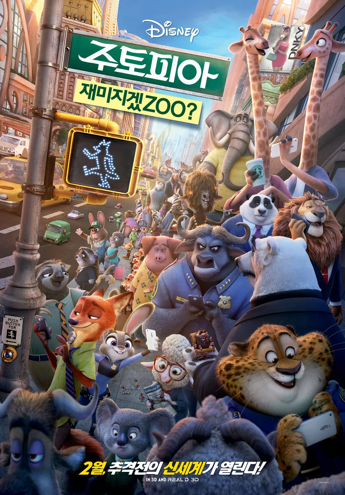
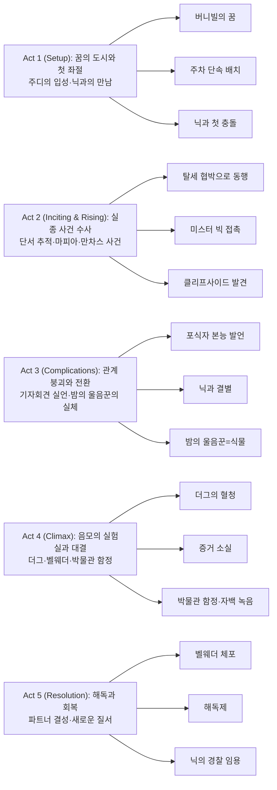

『주토피아』는 “누구나 무엇이든 될 수 있다”는 슬로건을 **도시의 홍보 문구가 아니라 수사의 출발점**으로 바꾸는 작품이다. 토끼 ‘최초’라는 타이틀에 기대는 성장담처럼 보이지만, 실제로는 **편견이 개인의 감정이 아니라 제도·여론·공포로 증식**하는 과정을 단계적으로 보여준다.

## 개요

### 영화 정보

* **제목**: Zootopia / 주토피아
* **감독**: Byron Howard, Rich Moore
* **각본**: Jared Bush, Phil Johnston
* **주연(목소리)**: Ginnifer Goodwin, Jason Bateman, Idris Elba, Jenny Slate, Nate Torrence, Alan Tudyk, Shakira
* **음악**: Michael Giacchino
* **장르**: Animation, Comedy, Mystery, Family (버디 수사극)
* **상영시간**: 108분
* **개봉일**: 2016.03.04 (미국) / 2016.02.17 (한국)
* **제작사**: Walt Disney Animation Studios
* **평점(참고)**: Rotten Tomatoes 98% / IMDb 8.0

### 추천 대상

* **가족 관객**: 추리·액션·개그가 균형 잡힌 ‘올타임’ 가족용 애니메이션
* **버디무비 팬**: 서로 불신하던 둘이 ‘사건’을 통해 관계를 재구성하는 정석
* **사회적 주제 영화 팬**: 편견의 작동 방식(공포–서사–제도화)을 서사로 해부

## 구조 분석

## 영화의 전체 내용

이야기의 뼈대는 "실종 사건"이지만, 사건의 엔진은 "편견"이다. 주디는 **'능력'으로 편견을 돌파하려 하고**, 닉은 **'편견은 변하지 않는다'는 학습된 체념**으로 버틴다. 둘이 함께 움직이기 시작할 때, 도시는 '이상향'에서 '증거가 남는 범죄 현장'으로 바뀐다.

### Act 1 (Setup): 꿈의 도시와 첫 좌절

**[S01] 프롤로그 — 동물 연극과 진화의 역사**: 어린 동물들이 무대에서 연극을 펼친다. 수천 년 전 포식자와 피식자로 나뉘었던 동물들이 오랜 시간 진화하며 원시적 본능을 극복하고 공존하게 되었다는 설정. '누구나 무엇이든 될 수 있다'는 주토피아의 모토가 소개된다. 하지만 각 동물에 대한 사회적 편견은 여전히 남아 있다는 전제가 깔린다.

**[S02] 버니빌 카니발 — 9살 주디의 꿈**: 토끼 마을 버니빌에서 자란 주디 홉스는 어릴 때부터 주토피아의 경찰이 되어 평등한 세상을 만들겠다는 꿈을 키워왔다. 부모님은 "노력하지 않으면 실패도 하지 않으니 행복해질 수 있다"며 홍당무 농사를 권유한다. 카니발에서 불량배 여우 기디온 그레이가 초식동물 친구들을 괴롭히며 티켓을 빼앗는 장면을 목격한 주디는 친구들을 위해 나선다.

**[S03] 기디온의 폭력 — 첫 상처와 결심**: 주디는 기디온에게 맞서지만 얼굴에 상처를 입고 "너같은 멍청한 토끼는 경찰이 될 수 없으니 홍당무 농사나 지어"라는 모욕을 듣는다. 하지만 주디는 빼앗긴 티켓을 되찾아주며 오히려 경찰의 꿈을 더욱 굳건히 다진다.

**[S04] 경찰학교 — 체급의 벽**: 15년 후, 주디는 경찰학교에 입학한다. 대형 동물 위주로 설계된 훈련 과정에서 체급과 체력의 격차로 매번 뒤쳐진다. "토끼는 경찰이 될 수 없다"는 편견에 시달리며 고된 시간을 보낸다.

**[S05] 경찰학교 — 응용과 성장**: 주디는 자는 시간까지 줄여가며 남들보다 배로 더 열심히 노력한다. 자신만의 방식으로 훈련을 응용해 다른 학생들을 뛰어넘는 실력을 갖추고, 마침내 수석으로 졸업한다. 라이언하트 시장의 특별 지시로 주토피아 경찰국 제1관할서에 발령받는다.

**[S06] 기차 안 — 여우 퇴치 세트와 편견**: 버니빌을 떠나는 날, 아버지는 여우 퇴치 세트를 선물로 건넨다. 토끼의 천적인 여우에 대한 편견을 드러낸 것. 주디는 처음엔 거부하지만 부모님의 마음을 헤아려 여우 퇴치 스프레이만 챙긴다. 기차 안에서 가젤의 「Try Everything」을 들으며 주토피아로 향한다.

**[S07] 주토피아 입성 — 도시의 스펙터클**: 주토피아에 도착한 주디는 사바나, 툰드라타운, 열대우림, 설치류 마을 등 다양한 구역이 공존하는 도시의 매력에 반한다. 자취방은 방음이 안 되는 낡은 단칸방이고 이웃은 까칠하지만, 주디는 꿈을 이뤘다는 기쁨에 침대에 드러눕는다.

**[S08] 첫 출근 — 스프레이를 챙기는 순간**: 다음 날 오전 5시 30분, 주디는 경찰서로 출근한다. 여우 퇴치 스프레이를 두고 가려 했지만 곧바로 다시 들어와 챙긴다. 부모님 앞에서는 여우가 위험하지 않다고 말했지만, 아직 선입견을 완전히 버리지 못한 것이다.

**[S09] ZPD 첫 브리핑 — '주차 단속' 배치**: 민원 담당관 클로하우저의 안내로 브리핑 룸에 들어간 주디는 옆자리 코뿔소 경관 맥혼과 인사를 나눈다. 보고 서장은 동료 경찰들에게 포유류 연쇄 실종 사건 수사를 지시하지만, 신입 주디에게는 주차 단속 임무만 맡긴다. 주디가 실종 사건을 맡겠다고 하자, 서장은 "남들이 사건 맡을 시간이면 딱지 100장은 끊을 수 있겠다"며 나간다.

**[S10] 주차 단속의 열정 — 201장**: 의욕이 불타오른 주디는 일을 시작한 지 2시간 만에 주차 딱지를 201장 끊는 데 성공한다. 201번째는 아이러니하게도 자신의 세 바퀴 차량이었다. 신명나게 단속하다가 본인마저 주차 제한 시간을 초과한 것이다.

**[S11] 아이스크림 가게 — 닉과 첫 만남**: 오전 근무를 마치고 휴식 중, 주디는 한 여우가 코끼리 아이스크림 가게로 들어가는 모습을 수상히 여긴다. 여우 닉은 사막여우 아들을 위해 코끼리용 점보 아이스크림을 사러 왔지만, 가게 주인 지미는 "손님을 거부할 권리가 있다"며 판매를 거절한다. 주디는 나타나 코끼리 직원들이 장갑도 끼지 않고 아이스크림을 뜨는 것이 식품위생법 위반이라 지적하며, 벌금 대신 여우 부자에게 아이스크림을 팔 것을 요구한다.

**[S12] 주디의 선의 — 아이스크림 구매**: 닉은 주디에게 감사하지만 지갑을 두고 와 계산하지 못한다. 주디는 자신의 돈으로 커다란 빨간 점보 아이스크림을 사준다. 닉은 자신을 닉 와일드라고 소개하며 고마움을 표하고, 주디는 코끼리가 되고 싶다는 꼬마 사막여우의 이마에 경찰 배지 스티커를 붙여주며 "주토피아에서는 누구나 무엇이든 될 수 있다"고 격려한다.

**[S13] 사하라 광장 — 닉의 사기 발각**: 오후 근무 중, 주디는 사하라 광장에서 닉과 사막여우를 다시 발견한다. 닉은 건물 지붕에서 점보 아이스크림을 녹이고, 사막여우는 밑에서 녹은 아이스크림을 병에 담아 밴에 싣고 있었다. 심지어 직접 운전까지 한다. 주디는 의심을 품고 미행한다.

**[S14] 툰드라타운 — 재가공 사기**: 닉과 사막여우는 밴을 툰드라타운으로 몰고 가 눈밭에 발자국 틀을 만들고, 녹인 아이스크림을 부어 작은 아이스크림들로 재가공한다. 이를 유기농 아이스크림이라 속여 레밍 브라더스 은행 앞에서 퇴근하는 레밍들에게 한 개당 2달러에 판매한다. 판매 후 버려진 나무 막대기는 회수하여 설치류 주택 단지 공사장에 건축 자재로 재판매한다. 감독이 나무가 왜 붉냐고 묻자, 닉은 "적송(Redwood)이라서 그렇다"고 둘러댄다.

**[S15] 닉의 냉소 — "타고난 건 못 바꿔"**: 사막여우는 사실 핀닉이라는 성인 남성이었다. 이 사실을 알게 된 주디는 격분해 닉을 무허가 영업 및 사기 혐의로 체포하려 하지만, 닉은 태연히 사업자 등록증과 판매 허가증을 제시한다. 닉은 "많은 동물들이 자기 꿈을 이루려고 주토피아에 와. 그런데 안 되지. 타고난 건 못 바꾸니까. 여우는 교활하고, 토끼는 멍청해"라며 주디를 조롱한다. "너같은 토끼는 경찰 따위 될 수 없으니 귀여운 단속원이나 해"라는 말에 주디는 깊은 상처를 받는다.

**[S16] 좌절의 밤 — 1인용 당근 간식**: 그날 밤, 주디는 혼자 방으로 돌아와 라디오를 켜지만 우울한 음악만 흘러나온다. 1인용 즉석 당근 간식을 꺼내지만 포장 사진과 달리 손가락만 한 크기에 실망해 버린다. 부모님의 영상 통화에서 부모님은 주차 단속 조끼를 보고 안전한 일이라 다행이라며 웃는다. 진정한 경찰이 되고 싶었던 딸의 속마음도 모른 채. 주디는 "내일은 다를 거야"라고 스스로를 위로하지만, 벽 너머 이웃은 "더 나쁠 수도 있다"는 냉소만 돌려준다.

**[S17] 듀크 위즐튼 추격 — '진짜 경찰'의 기회**: 다음 날, 주디는 엄격한 주차 단속으로 시민들에게 비난과 폭언을 듣게 된다. 의욕을 잃어가던 중, 족제비 듀크 위즐튼이 한 가게에서 양파처럼 생긴 작물 자루를 훔쳐 달아난다. 가게 주인이 "경찰이라면 저 도둑을 잡아야 하는 것 아니냐"고 외치자, 주디는 눈빛이 반짝이며 활기를 되찾는다. 진짜 경찰로서 해야 할 일이 생긴 것이다. 주디는 단속용 모자와 조끼를 벗어던지고 전속력으로 달려간다.

**[S18] 설치류 마을 추격 — 도넛 모형 구출**: 듀크는 설치류 마을에 난입해 마을을 아수라장으로 만든다. 주디는 작은 체구 덕분에 민첩하게 추격한다. 듀크가 거대한 도넛 모양 구조물을 발로 차서 주디를 따돌리려 하고, 도넛은 길을 건너던 땃쥐를 향해 굴러간다. 주디는 즉시 방향을 틀어 도넛을 붙잡아 세우며 시민을 구하고, 그 도넛으로 도망치려던 듀크를 내리꽂으며 극적으로 체포한다.

**[S19] 경찰서 — 서장의 꾸중과 수달의 호소**: 맥혼 경관과 함께 경찰서로 돌아온 주디는 칭찬을 기대하지만, 보고 서장은 오히려 그녀를 꾸짖는다. "주차 단속은 내팽개치고 썩은 양파 도둑 하나 잡겠다고 도시를 헤집었다"며 화를 낸다. 주디는 "저희 집이 농사를 지어서 잘 아는데, 저건 썩은 양파가 아니라 돌아뿌리 버럭시아스의 열매"라고 정정한다. 그때 수달 미세스 오터튼이 찾아와 실종된 남편 에밋 오터튼을 찾아달라고 간청한다. 보고 서장은 인력 부족과 관할 문제로 거절하지만, 주디는 자신이 직접 찾아주겠다고 나선다.

**[S20] 벨웨더의 개입 — 48시간 제한**: 보고 서장은 주디의 성급한 행동과 명령 불복종을 문제 삼아 즉시 해고하려 한다. 그러나 문 뒤에서 벨웨더 부시장이 대화를 듣고 있었다. 벨웨더는 "토끼가 실종 사건을 맡다니 전례 없는 일"이라며 시장에게 전화로 보고한다. 보고는 어쩔 수 없이 주디에게 임무를 맡기되, 48시간 안에 해결하지 못하면 해고하겠다고 말한다. 벨웨더는 주디에게 다가와 "작은 동물들끼리 서로 도와야죠, 안 그래요?"라며 격려한다.

### Act 2 (Inciting & Rising): 실종 사건 수사

**[S21] 사건 파일 — 닉이 목격자**: 주디는 클로하우저에게 실종 사건 파일을 받아 에밋 오터튼이 마지막으로 목격된 사진을 분석한다. 사진 속 오터튼의 손에는 닉이 판 빨간 점보 아이스크림이 들려 있다. 닉이 오터튼의 마지막 목격자임을 알게 된 주디는 다음 날 닉을 찾아간다.

**[S22] 탈세 협박 — 강제 파트너십**: 주디는 유모차를 끌고 출근하던 닉 앞에 나타나 수사 협조를 요청한다. 닉은 한숨을 내쉬며 자신이 얼마나 바쁜지 강조하고, "12살 때부터 단 하루도 빠짐없이 이 일을 해왔고, 지금도 하루에 200달러씩 번다"고 말한다. 주디는 즉석으로 계산해 닉이 약 146만 달러를 벌었음을 지적하고, 당근 모양 녹음펜에 녹음된 닉의 발언을 들려준다. 닉이 소득 신고를 하지 않아 탈세를 해왔다는 증거다. 주디는 "5년 징역형을 받기 싫으면 수사에 협조하라"고 종용하고, 48시간 안에 사건을 해결하면 녹음펜을 주겠다는 조건을 제시한다.

**[S23] 자연주의 클럽 — 차량 번호 확보**: 두 사람은 오터튼이 자주 갔다는 '자연주의 클럽'을 찾아가 단서를 찾는다. 오터튼이 탄 차량 번호 29THD03을 알아낸다. 주디가 차량 번호를 조회해야 한다고 하자, 닉은 "빠르게 조회할 수 있는 친구를 안다"며 차량관리국(DMV) 직원 플래시에게 데려간다.

**[S24] DMV — 플래시의 느림**: 플래시의 정체는 다름 아닌 나무늘보였다. 플래시와 직원들은 나무늘보답게 매우 느린 속도로 업무를 처리한다. 주디는 플래시의 업무 처리 속도가 너무 느려 조바심이 난다. 일이 거의 끝나갈 때쯤, 닉은 주디의 수사를 지연시킬 목적으로 플래시에게 농담을 건넨다. "혹이 세 개인 낙타를 뭐라고 하는지 알아? 임산부." 플래시는 그 농담을 동료 프리실라에게 다시 들려주는 바람에 시간을 더 끌게 된다. 마침내 차량이 툰드라타운 차량 대여점 소유라는 것을 알아내지만, 느린 처리 속도 때문에 시간은 이미 한밤중이 되어 있었다.

**[S25] 툰드라타운 대여점 잠입 — 현행범 함정**: 대여점을 찾아가지만 이미 문을 닫은 상태. 울타리를 넘으려면 수색 영장이 필요하다. 닉이 포기하라며 펜을 달라고 하자, 주디는 펜을 울타리 너머로 던진다. 닉이 펜을 주우려고 담을 넘어 들어가자, 주디는 "현행범 검거에는 영장이 필요 없다"며 뒤따라 들어간다. 주디는 닉이 담을 넘게 유도하여 현행범으로 만들고, 이를 명분으로 영장 없이 사유지에 합법적으로 진입한 것이다.

**[S26] 리무진 발견 — 미스터 빅의 흔적**: 두 사람은 오터튼이 탔던 리무진을 찾아내고 차 안으로 들어가 단서를 찾는다. 뒷좌석에는 발톱 자국이 여기저기 나 있었다. 닉은 차 안에서 쥐 음악 CD, 북극곰 털, 'B'라고 쓰인 비싼 유리잔을 찾아내고, 그 리무진이 툰드라타운 마피아 조직의 두목 미스터 빅의 차임을 알아챈다. 닉은 서둘러 도망가려 하지만, 미스터 빅의 북극곰 부하들이 나타나 둘을 잡아 미스터 빅에게 끌고 간다.

**[S27] 미스터 빅 — 과거의 배신**: 미스터 빅의 정체는 다름 아닌 아주 작은 땃쥐였다. 과거 닉이 미스터 빅에게 스컹크의 항문주위털로 만든 카펫을 비싼 카펫이라고 속여 판 일이 있었다. 그 카펫은 미스터 빅의 할머니 장례식 때 시신을 감싸는 용도였다. 미스터 빅의 할머니는 닉에게 음식까지 해줄 정도로 친밀한 사이였고, 미스터 빅 역시 닉을 'Nicky'라는 애칭으로 부르는 관계였다. 이 때문에 미스터 빅은 분노로 가득 차 둘을 얼음물에 담가버리려고 한다.

**[S28] 프루프루의 결혼식 — 목숨을 구한 은혜**: 미스터 빅의 딸 프루프루가 결혼식을 올리던 중 아빠와 춤출 차례라며 나타난다. 프루프루는 얼음물에 담기기 직전인 닉과 주디를 보고 "결혼식 날에는 아무도 죽이지 말자고 약속하지 않았냐"고 부탁한다. 하지만 미스터 빅은 어쩔 수 없다며 둘을 죽이려 든다. 그때 프루프루가 주디를 보고 어제 거대한 도넛으로부터 자신을 구해준 토끼라는 사실을 기억해낸다. 미스터 빅은 그에 대한 보답으로 둘을 살려준다.

**[S29] 만차스의 증언 — '밤의 울음꾼'**: 미스터 빅은 딸의 결혼식장에서 오터튼의 행방을 말해준다. 오터튼은 미스터 빅의 원예사였으며, 상담할 것이 있다고 해서 리무진을 보내 데려오려 했다. 그런데 오터튼이 리무진을 타고 오던 중 갑자기 야수처럼 변해 운전수를 공격하고 도망쳤다고 한다. 주디는 목격자인 운전수 레나토 만차스를 찾아간다.

**[S30] 열대우림 — 만차스의 상처**: 미스터 빅의 협조로 주디와 닉은 흑재규어 만차스를 찾아간다. 반쯤 열린 문틈 사이로 모습을 드러낸 만차스는 오른쪽 눈에 상처를 입은 상태였다. 당시 상황을 떠올리던 그는 오터튼이 야수로 돌변하기 직전 '밤의 울음꾼(Night Howler)'이라는 말을 외쳤다고 증언한다.

**[S31] 만차스의 야수화 — 10-91 코드**: 닉은 재빠르게 "'밤의 울음꾼'에 대해 조사하러 왔으니 아는 게 있으면 설명해달라"고 말한다. 만차스는 수긍하며 잠시 기다려 달라고 말하고 문을 닫는다. 그러나 곧 안쪽에서 비명 소리가 들려오고, 주디가 급히 문을 열자 만차스가 야수로 변해 닉과 주디를 공격한다. 두 사람은 간신히 몸을 피하며 경찰 본부에 지원을 요청한다. 클로하우저가 외친 지원 코드 '10-91'은 실제로 동물 관련 사고를 의미하는 경찰 무전 코드다. 가까스로 만차스를 묶어두는 데 성공한다.

**[S32] 닉의 변호 — 남은 10시간**: 잠시 후 보고 서장과 지원팀이 현장에 도착한다. 주디는 "동물들이 석기 시대의 야수처럼 변한다"고 설명하지만, 보고 서장은 믿지 않는다. 주디가 만차스를 묶어둔 곳으로 안내하지만, 만차스는 이미 감쪽같이 사라진 상태였다. 보고 서장은 한심하다는 듯 주디를 질책하며 "이틀이 지났으니 약속대로 경찰 배지를 내놓으라"고 명령한다. 그러자 닉이 주디를 변호한다. "그 광대 같은 조끼에다 꼬마 자동차 한 대 던져주고 이틀 안에 해결해라? 댁들이 2주 동안 손가락만 빤 사건에? 네, 오죽하면 여우의 도움을 받았을까. 도울 마음 없었잖아요? 어쨌든 서장님, 48시간을 주셨고, 그럼 엄밀히 말해 아직 10시간이 남았다 이겁니다." 둘의 관계가 '이용'에서 '동행'으로 넘어가는 지점이다.

**[S33] 케이블카 — 닉의 과거 고백**: 케이블카를 타고 열대우림 지역을 떠나 도시로 돌아가는 둘. 주디는 자신을 도와준 닉에게 고마움을 표현하고, 닉은 "주디가 순순히 당하는 꼴을 보고 옛날의 자신이 떠올라 보기 싫었다"고 말한다. 어릴 적 닉의 꿈은 레인저가 되는 것이었다. 8~9살 경 유일한 포식자 신분으로 레인저에 합격했고, 어머니는 어려운 형편에도 레인저 유니폼을 사주었다. 첫날 친구들 앞에서 당당히 선서를 하려던 닉은, "여우 같은 맹수는 믿을 수 없다"는 이유로 친구들에게 입마개를 씌우며 조롱당하고 집단 괴롭힘을 당했다. 충격을 받은 닉은 눈물을 흘리며 뛰쳐나왔고, 그날 이후 두 가지 교훈을 얻었다. 첫째, 절대로 남에게 약한 모습을 보이지 말 것. 둘째, 남들이 여우를 편견 어린 시선으로만 본다면, 어차피 그들은 변하지 않으니 굳이 그 시선을 바꾸려고 노력하지 말 것.

**[S34 미드포인트] CCTV 추적 — 벨웨더의 협조**: 케이블카를 타고 내려가던 닉과 주디는 거리 곳곳에 CCTV가 설치되어 있다는 사실을 깨닫고, 이를 이용해 실종자들의 행방을 추적하기로 한다. 하지만 주디는 아직 정식 경찰관이 아니어서 직접 CCTV를 조회할 권한이 없었다. 주디는 자신에게 호의적이었던 부시장 벨웨더를 찾아가 도움을 요청하고, 벨웨더는 흔쾌히 CCTV 영상을 보여준다. 닉과 주디는 영상을 분석해 만차스가 늑대들에게 포박되어 차량에 실려 갔음을 확인한다. 만차스가 언급했던 '밤의 울음꾼'이 바로 늑대들이라는 사실을 알아낸다.

**[S35] 클리프사이드 — 늑대의 습성 응용**: 닉은 늑대들이 CCTV가 없는 경로로 이동했을 것이라 추측하고, 자신이 알고 있는 샛길을 기준으로 추적을 이어간다. 그렇게 늑대들의 근거지인 '클리프사이드'를 찾아내는 데 성공한다. 건물 앞에 도착한 후, 닉은 간단한 수신호로 주디에게 계획을 전달하지만 주디는 제대로 이해하지 못한다. 늑대 중 한 마리가 닉의 냄새를 맡고 다가오자 위기에 처한 주디는 닉이 말해줬던 늑대들의 습성을 떠올린다. 늑대들은 한 마리가 울면 모두가 따라 운다. 주디는 직접 늑대 울음소리를 흉내 내어 모든 경비 늑대들이 동시에 울도록 유도하고, 경비를 따돌린 두 사람은 하수도를 통해 건물 내부로 진입한다.

**[S36] 클리프사이드 내부 — 실종자 발견**: 건물 안은 겉보기엔 폐쇄된 병원처럼 보였지만, 내부에는 최신 의료기기가 깔끔하게 정리되어 있었다. 유리벽 너머 수많은 우리에는 야수처럼 변한 동물들이 감금되어 있었다. 수달 오터튼을 비롯해 실종된 포식자 14마리와 만차스까지, 모든 실종자들이 수용되어 있었다.

**[S37] 라이언하트의 은폐 — 시장의 공포**: 누군가가 방 안으로 들어오자, 두 사람은 급히 빈 우리 속에 몸을 숨긴다. 들어온 사람은 다름 아닌 라이언하트 시장이었다. 시장은 오소리 의사와 대화를 나누며 포식자들만 야수로 변하고 있음을 이야기한다. 그리고 이 사실이 알려질 경우, 자신 역시 포식자로서 시장직을 잃을 것을 우려해 대중들에게 이 사실을 숨기고 있었음을 드러낸다.

**[S38] 변기 탈출 — 증거 확보**: 주디는 이 장면을 휴대폰으로 몰래 녹화하지만, 하필 그때 부모님의 전화가 걸려와 벨소리가 울리며 건물 내부에 침입자가 있음이 발각된다. 시장은 급히 자리를 떠나고 시설은 즉시 봉쇄된다. 닉과 주디가 있던 우리의 문 역시 자동으로 잠기고 경비원들이 들이닥친다. 주디는 재빨리 기지를 발휘해 휴대폰을 밀폐봉지에 넣고, 닉과 함께 변기를 통해 탈출한다. 경찰학교 시절 주디가 변기에 빠졌던 장면이 복선이었던 것이다. 두 사람은 경찰에 실종자들의 위치를 알리고 지원을 요청해, 결국 라이언하트 시장을 체포하는 데 성공한다.

### Act 3 (Complications): 관계 붕괴와 전환

**[S39] 경찰 지원서 — 파트너 제안**: 사건을 해결하고 범인을 체포한 주디는 닉과의 완벽한 호흡에 감탄하며, 닉에게 경찰이 되어 자신과 함께 일해보지 않겠냐고 제안한다. 주디는 닉에게 경찰 지원서를 건네며 펜까지 함께 준다. 이 펜은 닉의 탈세 자백이 녹음되어 있던 당근 모양의 녹음펜이었다.

**[S40] 기자회견 — 포식자 DNA 발언**: 주디는 보고 서장, 벨웨더가 있는 공식 기자회견에 참석해 사건 해결 과정을 발표한다. 기자들이 연이어 야수화 사건의 원인, 특히 "포식자들이 왜 변했는가"를 집요하게 묻자, 주디는 병원에서 들었던 말을 떠올리며 "포식자의 DNA와 생물학적 특성 때문에 원초적인 야수로 돌아간 것 같다"는 발언을 무심코 내뱉는다.

**[S41] 닉의 트라우마 재현 — 재갈 이미지**: 자료 화면에는 재갈이 물린 포식자들의 영상이 비춰지고, 이는 닉의 과거 트라우마를 자극한다. 기자회견장은 불안과 긴장으로 가득 차고, 벨웨더가 서둘러 회견을 마무리한다. 회견 후 닉은 주디에게 처음 만났을 때부터 여우 퇴치 스프레이를 들고 다니는 걸 알고 있었다며, "혹시 나도 미쳐서 널 잡아먹을까 봐 겁이 나냐?"라고 말한다. 이 장면은 어린 시절 주디가 여우 기디온에게 괴롭힘을 당하던 장면과 유사한 구도를 띤다.

**[S42] 관계의 파열 — 지원서를 버리다**: 주디는 순간적으로 움츠러들며 스프레이에 손을 올리고, 그 모습을 본 닉은 "너만은 날 믿어줄 거라 생각했어"라며 실망감을 드러낸다. 그는 주디가 건넸던 지원서를 던지고, 경찰 스티커를 구겨 버리며 기자회견장을 떠난다. 다만 주디가 준 당근 모양 녹음펜은 챙겨 간다. 지원서를 자세히 보면 작성이 다 완료된 상태였다.

**[S43] 도시의 균열 — 차별의 일상화**: 주토피아에서는 포식자들이 야수로 돌변하는 사건이 잇따라 발생하며, 시민들 사이에 포식자들에 대한 차별과 불신이 퍼지기 시작한다. 도시의 평화로운 분위기는 점점 무너지고, 거리에서는 초식동물들이 포식자를 피하는 장면이 일상처럼 그려진다.

**[S44] 가젤의 시위 — 폭력 사태**: 뉴스에서는 인기 가수 가젤이 주도한 차별 반대 시위가 폭력 사태로 번졌다는 소식이 전해진다. 하지만 시위에 참여한 이들은 겨우 열댓 명 정도이며, 시위대에 항의하러 모인 구경꾼들의 숫자가 어마무시해서 경찰들이 대거 출동해 시위대를 보호하기 위해 원형진을 세우기까지 한다. 한 돼지가 피켓을 든 표범에게 "숲속으로 돌아가, 이 포식자야!"라고 욕하자 표범이 "난 사바나 출신이야, 이 뚱보 자식아!"라고 소리치며 서로 대립하고, 주디가 필사적으로 말리는 장면이 뉴스로 나온다. 이는 미국 사회의 흑백 갈등을 패러디한 연출이다.

**[S45] 경찰의 얼굴 제안 — 주디의 자책**: 벨웨더와 보고는 주디에게 초식동물의 대표로서 경찰의 얼굴이 되어 달라고 제안한다. 하지만 주디는 자신의 꿈은 모두가 평등한 세상을 만드는 것이지, 경찰 그 자체가 되는 게 아니었다며 깊은 자책에 빠진다. 보고 서장은 "주토피아에는 자네같은 경찰이 꼭 필요하다"며 격려하지만, 결국 주디는 경찰 배지를 내려놓고 고향 버니빌로 돌아간다.

**[S46] 버니빌 귀향 — 기디온의 변화**: 고향에서 부모님과 함께 가게를 운영하던 주디는, 과거 자신을 괴롭혔던 여우 기디온이 부모님과 함께 일하는 모습을 보고 놀란다. 부모님은 기디온이 주디와의 일을 계기로 편견을 버리고 반성했다고 말하고, 기디온 역시 과거에 대해 사과하며 지금은 파이를 만들어 배달하며 성실히 살고 있다고 말한다. 과거 가해자가 변화한 모습은 "편견은 고정값이 아니다"라는 반증이 된다.

**[S47] 밤의 울음꾼의 정체 — 식물**: 이야기를 나누던 중, 주디의 부모님은 밭에서 뛰놀던 자식들에게 파란 방충용 꽃 '돌아뿌리 버럭시아스(Midnicampum holicithias)' 근처에 가까이 가지 말라고 주의를 준다. 그 꽃에는 독성이 있는데다 구근도 양파와 비슷하게 생겨서 그걸 먹은 주디의 삼촌이 한때 야수처럼 변한 적이 있었기 때문. 기디온이 자신네 집에선 그 정식 명칭이 복잡해서 '밤의 울음꾼(Night Howler)'이라고 부른다고 설명해주자, 주디는 밤의 울음꾼이 늑대를 지칭하는 것이 아닌 사건의 실마리였다는 것, 포식자들이 야수로 변한 이유가 원시적 본능 때문이 아니라 바로 밤의 울음꾼의 독성 때문임을 깨닫는다.

**[S48] 깨달음 — "토끼도 야수가 될 수 있어"**: 주디는 "토끼도 야수가 될 수 있어"라고 말하며, 야수화 사건이 단지 포식자만의 문제가 아니라 온순하다고 여겨지는 토끼를 포함해 모든 동물이 잠재적으로 변할 수 있는 문제임을 깨닫는다. 흥미로운 점은 시골 농부들조차 밤의 울음꾼의 위험성을 알고 있었음에도 불구하고 주토피아의 수사관이나 연구원들은 이 식물에 전혀 주목하지 않았다는 것이다. 과학자들과 경찰들은 이번 사건의 피해자들이 모두 포식자였다는 점에만 주목했고, 원인을 외부 물질이 아닌 유전적 특성이나 본능 같은 생물학적 요인에서 찾으려 했기 때문이다.

**[S49] 핀닉을 통한 추적 — 닉의 행방**: 사건의 실마리를 찾은 주디는 그 즉시 부모님의 야채트럭을 타고 급히 주토피아로 돌아가 닉을 찾는다. 핀닉을 통해 닉의 위치를 찾아낸다.

**[S50] 닉과의 재회 — 진심 어린 사과**: 주디는 자신이 알아낸 사실들을 닉에게 전한다. 그러나 닉은 "그것 참 흥미로운 이론인걸?"이라는 반어적인 말로 주디의 말을 가볍게 흘려보내며 냉담한 태도를 보인다. 주디는 자신의 경솔한 발언과 편견을 인정하며 잘못을 빈다. "날 용서하기 싫을 거야. 그래, 그건 당연해. 나라도 그랬을 거니까! 난 멍청하고 완전 편견으로 똘똘 뭉쳤어. 그러니까 포식자들이 나 때문에 고통받아서는 안 돼. 바로잡아야겠어. 그런데, 네가 필요해. 물론 이 일이 끝나면 날 미워해도 돼. 그래도 이해할게! 왜냐하면 나는 아주 끔찍한 친구니까! 너한테 상처를 줬어! 그러니 네가 그때 옳았다는 걸 확인하고 나서 가도록 해! 나는 정말로 멍청한 토끼가 맞아!"

**[S51] 녹음펜의 역전 — 48시간 안에 지워주겠다**: 닉은 주디가 "나는 정말로 멍청한 토끼가 맞아(I really am just a dumb bunny)"라고 말한 부분을 그녀가 준 당근 모양 녹음펜으로 재치 있게 녹음한 뒤 들려주고, "48시간 안에 이 녹음 지워주겠다"고 장난스럽게 말하며 주디를 용서한다. 주디는 감정이 북받쳐 눈물을 흘리며 닉에게 다가가고, 닉은 그런 주디를 끌어안은 채 위로하며 "지금 내 펜 뺏으려는 거야?"라고 농담을 건넨다. 주디는 웃으며 펜을 향해 손을 내밀고, 두 사람은 다시 관계를 회복한다. 닉이 주디가 떠난 후에도 당근펜을 계속 가지고 있었던 것으로 닉도 주디가 언젠가는 돌아오기를 진심으로 바라고 있었음을 알 수 있다.

### Act 4 (Climax): 음모의 실험실과 대결

**[S52] 듀크 위즐튼 재심문 — 미스터 빅의 협박**: 다시 협력하게 된 주디와 닉은 이전에 체포했던 족제비 듀크 위즐튼을 찾아간다. 듀크는 주디를 무시하며 도발하지만, 주디와 닉은 그를 미스터 빅에게 데려가 협박에 가까운 방식으로 자백을 유도한다. 이 과정에서 프루프루가 임신 중인 것을 볼 수 있으며, 미스터 빅은 자신의 손녀딸의 대모로 주디를 지목한다. 손녀딸의 이름도 주디의 이름을 따서 지을 거라고 말한다.

**[S53] 더그의 이름 — '거절하지 못할 제안'**: 듀크는 결국 밤의 울음꾼을 '더그'라는 양에게 비싼 값에 판매하기 위해 훔쳤다고 털어놓는다. 듀크에게 "거절하지 못할 제안"을 했다는 미스터 빅의 말은 영화 『대부』의 명대사 중 하나로, 미스터 빅의 모티브가 대부의 주인공 비토 콜레오네라는 것을 암시하는 마피아 개그다. 더그의 아지트가 폐쇄된 지하철역 안의 실험실이라는 사실을 알려준다.

**[S54] 폐 지하철 실험실 잠입 — 혈청 제조 발각**: 주디와 닉은 폐쇄된 지하철역에 잠입하여 몰래 더그를 엿본다. 더그가 누군가의 의뢰를 받아 밤의 울음꾼에서 추출한 독을 농축하여 총알 형태의 혈청으로 만들어 의도적으로 포식자에게만 발사하고 있었음을 알게 된다. 이 장면의 연출은 미국의 유명 드라마 『브레이킹 배드』의 마약 제조 장면을 연상시킨다. 때마침 등장한 더그의 동료들 이름도 월터와 제시다. 이로 인해 정상적인 포식자들이 야수로 변하고, 사회 전반에 혼란이 일어났던 것이다.

**[S55] 열차 탈출 — 승리의 뚜뚜**: 주디는 이 사실을 좌시할 수 없다고 판단해 더그 일당을 제압하고, 증거를 확보하기 위해 지하철 열차를 직접 움직여 경찰서로 향한다. 낡은 열차가 움직이는 건 기적에 가깝다며 말리던 닉은 실제로 열차가 움직이자 놀라움을 감추지 못하며 "할렐루야"라고 외칠 정도로 감탄한다. 신이 난 닉은 주디에게 기차의 경적소리를 울리는 승리의 뚜뚜를 한 번만 하게 해달라고 조르고, 주디는 "딱 한 번만"이라며 허락한다. 신나게 경적을 울리던 닉은 "버킷리스트에서 지울 일이 하나 생겼다"며 기뻐한다.

**[S56] 추격전 — 뚜뚜 취소**: 더그의 동료들이 전력선이 깔린 위험한 선로 위를 달리며 추격해온다. 닉은 "좀 전의 뚜뚜는 취소해야겠다"며 시무룩해한다. 울터가 천장 문을 몸무게를 이용하여 열고 들어오고, 정신없이 제시와 울터를 떨쳐내려고 애쓰던 둘은 마주 오는 화물열차와 충돌할 위기에 처한다.

**[S57] 열차 탈선 — 증거 소실**: 주디는 간신히 선로 분기기를 조작해 박물관 방향으로 진입하지만, 속도를 제어하지 못한 열차는 커브에서 탈선하며 폭발한다. 다행히 주디와 닉은 전복되기 직전 열차에서 뛰어내려 생존하지만, 열차가 폭발하는 바람에 모든 증거가 사라져 버린다. 그러나 닉이 탈출 직전 혈청이 장전된 권총이 담긴 가방을 챙긴 덕분에 마지막 단서를 보존할 수 있었다. 닉과 주디는 이 증거를 경찰서에 빠르게 전해주기 위해 자연사 박물관을 지름길로 가로질러 들어간다.

**[S58] 박물관 — 벨웨더의 등장**: 닉과 주디는 증거를 들고 자연사 박물관을 지나가던 중, 갑자기 벨웨더 부시장이 나타난다. 박물관 벽화에는 고대의 의인화된 원시 동물들과 창을 들고 있는 메머드들이 포식자(스밀로돈)를 위협하는 삽화가 나온다. 여기서 알 수 있는 점은 초식동물들이 육식동물들보다 진화가 더 빨리 됐다는 것이다. 벨웨더는 증거 가방을 자신이 직접 전달하겠다고 주장하지만, 주디는 그녀의 갑작스러운 등장에 의심을 품고 "여긴 어떻게 알고 왔냐"고 되묻는다.

**[S59] 벨웨더의 압박 — 도망**: 벨웨더가 끝내 증거를 넘기라고 압박하자 주디와 닉은 이를 거부하고 경찰서로 향하려 하지만, 출구를 막은 양 부하 때문에 박물관 안쪽으로 도망칠 수밖에 없는 상황이 된다.

**[S60] 부상과 응급처치 — 블루베리 손수건**: 도망치는 과정에서 주디는 뿔 모형에 다리를 긁혀 부상을 입고, 닉은 벽 뒤에 숨어 자신의 블루베리를 담고 다니던 빨간 손수건을 푼 뒤 그녀의 발에 묶어 응급처치를 해준다. 이 장면은 나중에 중요한 복선이 된다.

**[S61] 벨웨더의 음모 고백 — 공포 정치**: 벨웨더는 주디를 찾아 돌아다니며 자신의 목적을 드러낸다. "초식동물이 육식동물에게 늘 위협과 무시를 당하며 살아왔다"며, 밤의 울음꾼을 이용해 포식자들을 전부 야수화시켜 그들을 완전히 사회에서 쫓아내려는 계획을 세웠던 것이다. 그 뒤 초식동물에게 심어진 공포를 무기 삼아 그들을 통치하는 독재자가 될 것이라고 말한다.

**[S62] 토끼 모형 함정 — 가방 탈취**: 잠시 후 주디의 그림자가 보이자 벨웨더의 부하가 다가가지만, 그것은 토끼 모형이 만들어낸 함정이었다. 닉과 주디는 도망치려고 하지만 결국 부하들에게 밀쳐져 가방을 빼앗긴 채 전시실 아래로 떨어진다.

**[S63] 닉의 야수화 — 혈청 발사**: 벨웨더는 가방에 든 권총을 꺼낸 뒤, 닉에게 혈청이 든 총알을 발사해 닉이 주디를 공격하게 만든다. 벨웨더는 경찰에 연락해 "여우가 토끼를 공격하고 있다"고 거짓 신고를 하며, 마치 자신이 정의의 편에 선 영웅인 척 연기한다. 닉은 혈청의 영향을 받아 야수화되어 주디를 덮친다. 주디는 필사적으로 버티지만 벨웨더는 냉소적으로 웃으며 이 장면을 즐기듯 지켜본다. 결국 닉이 주디의 목을 물어버리고 주디의 비명이 울려 퍼진다.

**[S64 클라이맥스] 블루베리 반전 — 연기와 자백**: 그러나 곧 모든 것이 주디와 닉이 꾸민 함정이었다는 사실이 드러난다. 닉이 맞은 것은 혈청이 아니라 주디가 고향에서 가져온 블루베리 탄환이었으며, 두 사람은 벨웨더의 자백을 유도하기 위해 연기를 한 것이었다. 닉이 손수건을 풀어 주디의 다리를 응급처치할 때, 안에 담겨 있던 블루베리를 권총의 혈청과 바꿔 넣었던 것이다. 이 장면을 자세히 보면 주디와 닉이 연기를 한다는 것을 충분히 알 수 있는데, 작품 내 복선 중 하나인 주디의 코가 전혀 움직이지 않는다. 주디가 어릴 때 기디온한테 위협당할 때와 기자회견장에서 닉한테 위협당한다고 생각할 때도 움직이던 코가 전혀 움직이지 않는다. 게다가 이전에 혈청을 맞은 동물들은 눈알 전체가 검게 되거나 동공 색이 붉게 바뀌기도 하고 동공이 날카로운 형태로 변하기도 하는데, 닉은 혈청을 맞고도 녹색 눈과 원래 눈 모양을 멀쩡히 유지하고 있었다. 영화는 이 부분을 아예 천천히 클로즈업해주기 때문에 눈썰미가 좋다면 바로 알아차릴 수 있다.

**[S65] 당근 녹음펜 — 결정적 증거**: 벨웨더가 자신이 꾸민 음모를 자백하는 모든 말은 주디의 당근 모양 녹음펜에 그대로 녹음되고 있었다. 벨웨더는 상황을 눈치채고 도망치려 하지만, 그녀가 직접 신고한 덕분에 박물관 바로 뒤에 있는 주토피아 경찰청의 경찰들이 이미 현장에 도착해 있었다. 결국 벨웨더는 체포되고, 모든 사건의 배후가 밝혀진다.

### Act 5 (Resolution): 해독과 회복

**[S66] 사건 종결 — 벨웨더의 체포**: 벨웨더 부시장의 음모가 밝혀지며 모든 사건은 마침내 해결된다. 벨웨더는 체포되어 법의 심판을 받게 되고, 영화 후반부에서 감옥에 수감된 모습이 나온다. 옆에 앉은 덩치 큰 죄수가 벨웨더의 머리털을 만지자, 그녀는 질색하며 팔을 휘저으며 밀쳐낸다.

**[S67] 해독제 개발 — 도시의 정상화**: 야수화되어 감금됐던 동물들도 해독제가 개발되면서 모두 원래 모습으로 돌아온다. 사건 이후 주토피아는 다시 평화를 되찾고, 포식자와 피식자 간의 갈등 역시 점차 회복의 길로 들어선다. 갈등은 '완치'가 아니라 '회복'으로 이동한다.

**[S68] 경찰학교 졸업식 — 주디의 연설**: 몇 개월 후, 주디는 경찰학교 졸업식 무대에 서서 연설을 하게 된다. "제가 어렸을 때, 저는 주토피아가 완벽한 곳이라고 생각했죠. 모두 사이좋게 지내고 원하는 대로 될 수 있는 세상이라고요. 그러나 현실은 제가 상상하고 꿈꿔왔던 것과는 조금 달랐어요. 모든 게 혼란스러웠죠. 우린 모두 단점이 있고, 우린 모두 실수를 해요. 하지만 긍정적으로 생각해 보면 우리에겐 공통점도 많아요. 서로가 서로를 이해하려고 하면 할수록, 우리들은 더욱 특별해질 겁니다. 그러나 노력해야 합니다. 당신이 어떤 종의 동물이든, 그게 큰 코끼리든, 최초의 여우든 말이죠. 최선을 다해서 노력하세요. 노력하면, 보다 나은 세상을 만들 수 있어요. 자신의 내면을 들여다보세요. 그럼 알게 되겠죠. 변화의 시작은 당신이고, 바로 나라는 걸요. 정확히는 우리 모두죠." 그녀는 주토피아의 다양성과 협력의 중요성을 강조하며, 새로운 경찰로 임명된 닉에게 직접 경찰 배지를 달아준다.

**[S69] 닉의 임명 — 최초의 여우 경찰관**: 닉은 주토피아 최초의 여우 경찰관이 되어 당당히 동료들 앞에 선다. 이후 두 사람은 정식으로 파트너가 되어 순찰 임무를 수행한다. 초반부처럼 주차 단속을 맡는 줄 알았지만, 보고 서장은 장난스럽게 "농담이야!"라며 폭주족 검거 임무를 맡긴다.

**[S70] 순찰 출동 — "교활한 토끼, 멍청한 여우"**: 주디와 닉은 랜드로버 순찰차를 몰고 사바나 중심가를 질주하며 본격적인 수사 파트너로서의 첫 임무를 시작한다. 순찰 도중 닉이 "원래 토끼가 운전을 못해, 아니면 너만 못해?"라며 주디를 놀리자, 주디는 일부러 급브레이크를 밟아 닉을 골려준다. 닉은 "교활한 토끼(Sly bunny)"라고 말하고, 주디는 "멍청한 여우(Dumb fox)"라고 받아친다. 이 대사는 그들이 처음 만났을 때 닉이 냉소적으로 했던 말 "교활한 여우, 멍청한 토끼"를 뒤집은 것으로, 편견을 극복하고 서로를 진정한 동등한 동료로 인정하게 된 성장을 보여주는 장면이다. 닉이 "왜 이래, 날 사랑하면서?"라고 묻자, 주디는 "정말 그럴까? 그래. 그래, 맞아"라고 답한다.

**[S71] 플래시의 반전 — 폭주족 체포**: 그때 엄청난 속도로 질주하는 폭주 차량이 눈에 들어오고, 주디는 "185km/h(115mph)에 달한다"고 외친다. 두 사람은 곧바로 차량을 추격해 세운다. 운전석 창문이 열리자 뜻밖의 인물이 모습을 드러낸다. 운전자는 다름 아닌 DMV의 나무늘보 플래시. 평소 느릿한 그의 이미지와 정반대의 반전이 이 영화의 포인트를 완성한다. 플래시는 느리게 미소를 지으며 체포되고, 영화는 막을 내린다.

### 쿠키 영상

이 영화에는 별도의 미드 크레딧이나 포스트 크레딧 장면은 없으나, 엔딩 크레딧 자체가 공연 장면과 함께 진행된다.

**[S72] 가젤 콘서트 — 「Try Everything」**: 가젤의 「Try Everything」 콘서트가 열리고, 화려한 조명 아래에서 호랑이 백댄서들이 경쾌한 리듬에 맞춰 춤을 추기 시작한다. 이 무대를 배경으로 엔딩 크레딧이 시작되고, 주디와 닉을 비롯한 주인공들이 공연을 함께 즐긴다. 벨웨더는 감옥에서 TV를 통해 공연을 보며 찡그린 표정을 짓는다. 공연이 끝난 뒤, 화면에는 스태프롤이 올라가고, 야생의 소리를 곁들인 월트 디즈니 픽처스와 월트 디즈니 애니메이션 스튜디오 로고가 차례로 등장한다. 그렇게 영화는 주토피아의 활기찬 음악과 함께 따뜻한 여운을 남기며 끝을 맺는다.

## 핵심 대사 인덱스

"Everyone comes to Zootopia thinking they can be anything they want. Well, you can't. You can only be what you are. Sly fox. Dumb bunny." — 닉 와일드, [S15]; 편견에 대한 닉의 체념과 냉소를 드러내는 대사. 주디에게 "타고난 건 못 바꿔"라는 현실을 강요하며 그녀의 꿈을 조롱한다.

"I'm not a dumb bunny." — 주디 홉스, [S15]; 닉의 조롱에 대한 주디의 첫 반응. 이후 이 대사는 [S50]에서 주디가 스스로 "I really am just a dumb bunny"라고 말하며 자신의 편견을 인정하는 장면과 대비를 이룬다.

"Sorry, what I said was, 'No!' She will not be giving you that badge." — 닉 와일드, [S32]; 주디가 배지를 빼앗길 위기에 처했을 때 닉이 보고 서장에게 되받아치는 대사. 둘의 관계가 '이용'에서 '동행'으로 넘어가는 결정적 순간.

"I was ignorant, and irresponsible, and small-minded. But predators shouldn't suffer because of my mistakes." — 주디 홉스, [S50]; 자신의 편견을 인정하고 닉에게 진심으로 사과하는 장면. 주디의 성장과 책임감을 보여주는 핵심 대사.

"I really am just a dumb bunny." — 주디 홉스, [S50]; 주디가 자신의 무지와 편견을 완전히 인정하는 순간. 닉은 이 대사를 녹음해 "48시간 안에 지워주겠다"며 농담으로 화답하고 용서한다.

"When I was a kid, I thought Zootopia was this perfect place, where everyone got along and anyone could be anything. Turns out, real life is a little bit more complicated than a slogan on a bumper sticker." — 주디 홉스, [S68]; 졸업식 연설에서 주디가 현실을 깨닫고 성장한 과정을 요약하는 대사. 이상향의 슬로건과 복잡한 현실의 간극을 인정한다.

"The more we try to understand one another, the more exceptional each of us will be. But we have to try." — 주디 홉스, [S68]; 영화의 핵심 메시지를 담은 대사. 서로를 이해하려는 노력이 곧 변화의 시작임을 강조한다.

"Fear always works. And I'll dart every predator in Zootopia to keep it that way." — 벨웨더, [S61]; 벨웨더가 자신의 음모를 드러내는 장면. 공포 정치를 통해 권력을 장악하려는 의도를 명확히 보여준다.

"Sly bunny. / Dumb fox." — 주디 & 닉, [S70]; 처음 만났을 때 닉이 했던 "Sly fox. Dumb bunny"를 뒤집은 대사. 편견을 극복하고 서로를 동등한 동료로 인정하게 된 성장을 상징한다.

"You know you love me. / Do I know that? Yes. Yes, I do." — 닉 & 주디, [S70]; 파트너가 된 두 사람의 신뢰와 애정을 보여주는 대사. 농담처럼 들리지만 진심이 담겨 있다.

## 캐릭터 분석

### 주디 홉스 (Judy Hopps) / 토끼 (Ginnifer Goodwin)

**개요**: "최초"를 등에 업은 것이 아니라, 최초가 감당해야 할 **'상징 부담'**을 정면으로 끌어안는 캐릭터. 버니빌에서 자란 주디는 어릴 때부터 "누구나 무엇이든 될 수 있다"는 주토피아의 슬로건을 믿으며 경찰이 되는 꿈을 키웠다. 하지만 그녀가 마주한 현실은 대형 동물 위주로 설계된 제도, 토끼에 대한 편견, 그리고 주차 단속이라는 낮은 처우였다.

**성장 곡선**: 개인의 노력(경찰학교 수석 졸업) → 제도의 벽 인식(주차 단속 배치) → 실종 사건 해결(능력 증명) → 실언으로 만든 피해 직면(기자회견) → 사과/연대로 회복(닉과의 재회). 주디의 진짜 성장은 "토끼도 경찰이 될 수 있다"를 증명하는 데서 그치지 않고, 자신 역시 편견을 가지고 있었음을 인정하고 그것을 바로잡는 데 있다.

**동기와 욕망**: 주디가 추구하는 것은 단순히 '경찰'이라는 직업이 아니라 '평등한 세상'이다. 어린 시절 기디온에게 "너같은 멍청한 토끼는 경찰이 될 수 없다"는 말을 들었을 때, 그녀는 티켓을 되찾아주며 꿈을 포기하지 않았다. 이는 주디의 핵심 동기가 개인의 성공이 아니라 불의에 대한 저항과 타인을 돕고자 하는 정의감에 있음을 보여준다.

**핵심 갈등**: 정의감(행동)과 편견(무의식)의 충돌. 주디는 닉을 위해 아이스크림을 사주고 여우에 대한 차별을 제지하지만, 동시에 여우 퇴치 스프레이를 챙기는 이중성을 보인다. 기자회견에서 "포식자의 DNA와 생물학적 특성" 때문이라는 발언은 그녀의 무의식 속에 남아 있던 편견이 드러난 순간이다. '좋은 의도'만으로는 시스템을 바꿀 수 없다는 깨달음이 중요하다. 주디는 자신의 실수를 인정하고 "나는 정말로 멍청한 토끼가 맞아"라고 말하며 진심으로 사과한다. 이것이 주디의 진정한 성장이다.

**상징적 의미**: 주디는 '능력'과 '의지'로 편견을 돌파하려는 모든 소수자의 상징이다. 동시에 그녀는 선의를 가진 다수자 역시 무의식적 편견을 가질 수 있음을 보여준다. 주디의 여정은 개인의 성공이 아니라 '우리 모두가 편견을 가지고 있으며, 그것을 인정하고 바꾸려는 노력이 필요하다'는 메시지를 전달한다.

### 닉 와일드 (Nick Wilde) / 붉은여우 (Jason Bateman)

**개요**: 편견에 대한 '저항'이 아니라 '적응'으로 살아남은 인물. 교활함은 성격이 아니라 **생존 전략**이다. 닉은 어린 시절 레인저가 되려는 꿈을 가졌지만, 유일한 포식자라는 이유로 친구들에게 입마개를 씌우며 조롱당하고 집단 괴롭힘을 당했다. 그날 이후 닉은 두 가지 교훈을 얻었다. 첫째, 절대로 남에게 약한 모습을 보이지 말 것. 둘째, 남들이 여우를 편견 어린 시선으로만 본다면, 어차피 그들은 변하지 않으니 굳이 그 시선을 바꾸려고 노력하지 말 것.

**성장 곡선**: 냉소(방어) → 협력(실리) → 신뢰(관계) → 제도 진입(경찰 임용). 닉은 처음에는 주디를 탈세 협박으로 억지로 수사에 동행한다. 하지만 만차스가 사라진 후 주디가 배지를 빼앗길 위기에 처했을 때, 닉은 자신의 과거를 털어놓으며 그녀를 변호한다. "주디가 순순히 당하는 꼴을 보고 옛날의 자신이 떠올라 보기 싫었다"는 말은 닉이 주디에게 자신의 상처를 투영하고 있음을 보여준다. 주디가 경찰 지원서를 건넸을 때, 닉은 이미 작성을 완료한 상태였다. 그는 변화를 두려워하면서도 동시에 희망하고 있었던 것이다.

**동기와 욕망**: 닉이 추구하는 것은 '인정'이다. 어린 시절 레인저가 되려던 꿈은 사회에 받아들여지고 싶다는 욕망의 표현이었다. 하지만 입마개 사건 이후 그는 "어차피 여우는 교활하다고 생각한다면, 교활한 여우가 되어주겠다"며 사회의 기대에 맞춰 살기로 한다. 하루 200달러를 버는 사기꾼으로서의 삶은 성공이 아니라 방어기제였다. 주디를 만나면서 닉은 다시 한번 자신의 진짜 욕망과 마주하게 된다.

**핵심 갈등**: "변하지 않을 거야"라는 체념과 "그래도 한번 해보자"는 선택. 닉의 냉소는 상처받지 않기 위한 갑옷이었다. 하지만 주디가 "나는 정말로 멍청한 토끼가 맞아"라고 자신의 편견을 인정하고 사과했을 때, 닉은 더 이상 갑옷 뒤에 숨지 않는다. 그는 당근 녹음펜에 주디의 말을 녹음하며 "48시간 안에 지워주겠다"고 농담하지만, 그 안에는 진심 어린 용서가 담겨 있다. 닉이 주디가 떠난 후에도 당근펜을 계속 가지고 있었던 것은 그가 주디가 언젠가는 돌아오기를 진심으로 바라고 있었음을 보여준다.

**상징적 의미**: 닉은 편견과 차별에 지친 소수자의 상징이다. "어차피 안 될 거면 노력할 필요도 없다"는 학습된 무기력은 많은 이들이 경험하는 현실이다. 하지만 닉은 주디와의 만남을 통해 변화가 가능하다는 것, 그리고 그 변화는 서로를 이해하려는 노력에서 시작된다는 것을 깨닫는다. 마지막 장면에서 "교활한 토끼, 멍청한 여우"라는 대사는 편견을 뒤집고 서로를 동등한 동료로 인정하게 된 성장을 상징한다.

### 벨웨더 (Dawn Bellwether) / 양 (Jenny Slate)

**개요**: '약자'의 언어를 권력의 언어로 변환시키는 인물. 공포를 설계해 다수의 동의를 얻는다. 벨웨더는 주디에게 처음 등장할 때 "작은 동물들끼리 서로 도와야죠, 안 그래요?"라며 친근하게 다가온다. 그녀는 라이언하트 시장 밑에서 무시당하고 잡무만 맡는 부시장으로, 겉으로는 주디를 응원하는 것처럼 보인다. 하지만 실제로는 밤의 울음꾼을 이용해 포식자들을 야수화시켜 사회에서 쫓아내려는 음모를 꾸미고 있었다.

**동기와 욕망**: 벨웨더가 추구하는 것은 '권력'이다. 그녀는 박물관에서 주디에게 "초식동물이 육식동물에게 늘 위협과 무시를 당하며 살아왔다"며 자신의 음모를 정당화한다. 벨웨더는 포식자들을 전부 야수화시켜 사회에서 쫓아내고, 초식동물에게 심어진 공포를 무기 삼아 그들을 통치하려는 계획을 세웠다. "Fear always works"라는 그녀의 말은 공포 정치의 본질을 정확히 보여준다.

**핵심 기능**: 차별의 원인이 '본능'이 아니라 '정치'임을 확정한다. 벨웨더는 피해자 서사를 무기로 삼아 권력을 장악하려는 인물이다. 그녀는 초식동물의 불안과 공포를 조장하고, 그것을 자신의 권력 기반으로 삼는다. 벨웨더의 음모가 드러남으로써, 영화는 편견이 개인의 감정이 아니라 제도, 여론, 공포로 증식하는 정치적 문제임을 명확히 한다.

**상징적 의미**: 벨웨더는 '피해자 서사를 이용한 권력 장악'의 위험성을 경고하는 캐릭터다. 그녀는 약자의 위치에서 강자를 비판하지만, 실제로는 그 비판을 자신의 권력 욕망을 정당화하는 도구로 사용한다. 벨웨더는 "공포는 항상 효과가 있다"고 말하며, 공포 정치가 어떻게 사회를 분열시키고 차별을 정당화하는지 보여준다.

### 보고 서장 (Chief Bogo) / 아프리카물소 (Idris Elba)

**개요**: 제도의 수호자이자, 주디의 능력을 인정하지 않으려는 인물로 처음 등장한다. 그는 토끼가 경찰이 될 수 없다는 편견을 가지고 있으며, 주디에게 주차 단속만 맡긴다. 하지만 사건이 해결된 후 "주토피아에는 자네같은 경찰이 꼭 필요하다"며 주디를 격려한다. 보고 서장은 편견을 가진 인물이지만, 동시에 변화할 수 있는 인물이기도 하다.

### 라이언하트 시장 (Mayor Lionheart) / 사자 (J.K. Simmons)

**개요**: 포식자이면서 시장이라는 권력의 정점에 있는 인물. 그는 포식자들이 야수로 변하는 사건을 은폐하려 한다. 자신 역시 포식자로서 시장직을 잃을 것을 우려했기 때문이다. 라이언하트는 개인의 권력 유지를 위해 공공의 안전을 희생시킨 인물로, 권력의 부패를 상징한다.

### 미스터 빅 (Mr. Big) / 땃쥐 (Maurice LaMarche)

**개요**: 작은 땃쥐지만 툰드라타운 마피아 조직의 두목. 영화 『대부』의 비토 콜레오네를 패러디한 캐릭터로, 닉에게 배신당한 과거가 있지만 딸 프루프루가 주디에게 목숨을 구한 은혜로 둘을 살려준다. "거절하지 못할 제안"이라는 대사는 『대부』의 명대사를 오마주한 것이다.

### 기디온 그레이 (Gideon Grey) / 여우 (Phil Johnston)

**개요**: 어린 시절 주디를 괴롭혔던 불량배 여우. 하지만 주디가 버니빌로 돌아왔을 때, 기디온은 변화한 모습을 보여준다. 그는 과거에 대해 사과하며 지금은 파이를 만들어 배달하며 성실히 살고 있다. 기디온의 변화는 "편견은 고정값이 아니다"라는 메시지를 전달한다.

## 영상미와 음악

### 시각 효과 / 미학

주토피아는 구역(사바나/툰드라/열대우림/설치류 마을 등)이 단순한 관광지가 아니라 **사회적 층위의 지도**로 작동한다. 같은 도시지만 체온·속도·크기·노동이 다르고, 그 차이가 곧 편견의 재료가 된다.

### 음악

Michael Giacchino의 스코어는 ‘활기’와 ‘불안’을 번갈아 밀어 넣으며 수사의 톤을 만든다. Shakira의 **「Try Everything」**은 단순한 삽입곡이 아니라 주디의 세계관(실패를 포함한 시도)을 선언하는 테마다.

## 종합 평가

### 최종 평점: ★★★★★ (5.0/5.0)

**장점**:
- 편견을 “악당의 마음”이 아니라 “사회 시스템”으로 묘사하는 서사적 설계
- 버디 수사극으로 주제의 무게를 끝까지 견인하는 균형감
- 도시 세계관(스케일/구역/직업)이 메시지와 정확히 결합

**단점**:
- 은유가 명확한 만큼, 일부 관객에게는 ‘교과서적’으로 느껴질 수 있음

### 한 줄 평

“이상향의 포스터를 찢어, 그 뒷면에 적힌 편견의 사용법을 보여주는 수사극.”

### 관람 전 체크리스트

- 사전 지식이 필요한가? **아니오**
- 어린이와 함께 볼 수 있는가? **가능(주제는 무겁지만 표현은 가족 친화적)**
- 쿠키 영상이 있는가? **없음(엔딩 크레딧/에필로그 포함)**

## 참고 문헌 및 출처

- [Zootopia — Wikipedia](https://en.wikipedia.org/wiki/Zootopia)
- [Zootopia (2016) — IMDb Ratings](https://www.imdb.com/title/tt2948356/ratings/)
- [Zootopia — Rotten Tomatoes](https://www.rottentomatoes.com/m/zootopia)
- [Zootopia — Rotten Tomatoes (Cast & Crew)](https://www.rottentomatoes.com/m/zootopia/cast-and-crew)
- [주토피아/줄거리 — 나무위키](https://namu.wiki/w/%EC%A3%BC%ED%86%A0%ED%94%BC%EC%95%84/%EC%A4%84%EA%B1%B0%EB%A6%AC)
