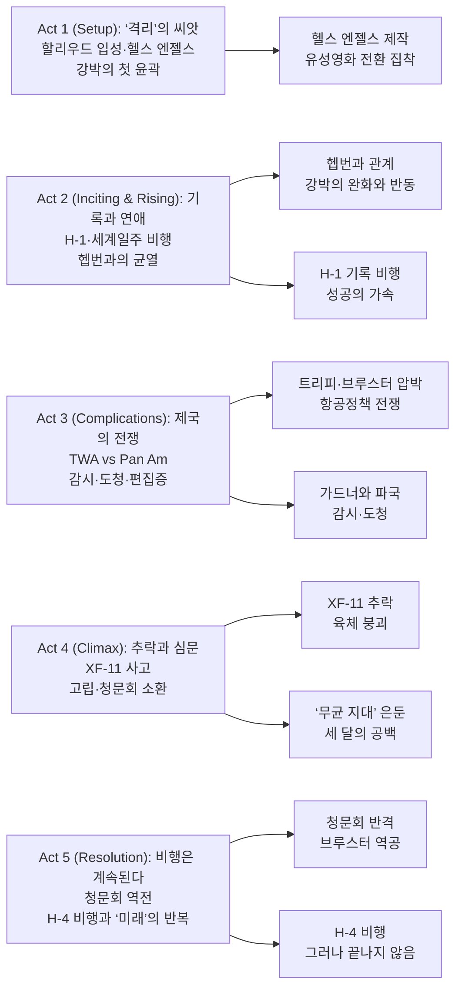

『에비에이터』는 하워드 휴즈를 “천재 사업가”나 “괴짜 억만장자”로 요약하지 않는다. 이 영화가 집요하게 파고드는 건 **성공을 만드는 ‘강박’이 어느 순간부터 삶을 무너뜨리는 ‘강박’으로 뒤집히는 지점**이다. 1927년부터 1947년까지, 영화 제작과 항공 개발이라는 두 전장에서 휴즈가 상승과 붕괴를 동시에 겪는 과정이 스코세이지 특유의 속도감과 디테일로 압축된다.

## 개요

### 영화 정보

* **제목**: The Aviator / 에비에이터
* **감독**: Martin Scorsese
* **각본**: John Logan
* **주연**: Leonardo DiCaprio, Cate Blanchett, Kate Beckinsale
* **조연**: John C. Reilly, Alec Baldwin, Alan Alda, Jude Law, Ian Holm, Danny Huston, Gwen Stefani, Willem Dafoe, Edward Herrmann 등
* **음악**: Howard Shore
* **촬영**: Robert Richardson
* **편집**: Thelma Schoonmaker
* **장르**: Biography, Drama (항공/할리우드 시대극)
* **상영시간**: 170분 (KMDb 기준 169분)
* **개봉일**: 2004.12.25 (미국, 와이드) / 2005.02.18 (한국)
* **제작비**: 약 1억 1천만 달러
* **월드 박스오피스**: 약 2억 1,372만 달러
* **평점(참고)**: Rotten Tomatoes 86% / IMDb 7.5 / Metacritic 77

### 추천 대상

* **스코세이지 팬**: 범죄가 아닌 “업(일)과 집착”을 다룬 스코세이지의 다른 얼굴을 보고 싶다면
* **전기영화 애호가**: “성공 서사”를 끝까지 밀어붙인 뒤 그 성공의 가격을 정면으로 보여주는 구조를 좋아한다면
* **항공·공학/영화사 관심자**: H-1, XF-11, H-4 등 ‘실물’과 ‘신화’가 만나는 지점을 시대 디테일로 체감하고 싶다면

## 구조 분석

## 영화의 전체 내용

**스포일러 100% 포함.** 영화는 “하워드 휴즈의 성공기”를 가장한 **강박의 전염 과정**에 가깝다. 초반엔 ‘완벽을 향한 집착’이 성과를 만든다. 그러나 중반부터 그 완벽은 타인을 밀어내고, 후반부엔 본인까지 봉인하는 감옥이 된다.

### Act 1 (Setup): ‘격리’의 씨앗

**[S01] 1913년의 욕실 — “Quarantine”**: 어린 휴즈는 어머니에게 ‘격리’라는 단어를 배우며 세균 공포의 씨앗을 심는다. 이 장면은 훗날 그의 OCD(강박장애, Obsessive-Compulsive Disorder)가 “성격”이 아니라 “기억”처럼 되살아나는 장치가 된다.

**[S02] 1927년, 할리우드 — 감독이자 사장**: 휴즈는 『헬스 엔젤스』를 “실물처럼” 찍겠다고 선언한다. 여기서 현실감은 예술적 신념이면서 동시에 통제 욕구의 다른 이름이다.

**[S03] 노아 디트리히 영입 — 제국의 관리자**: 디트리히는 휴즈의 ‘충동’을 ‘운영’으로 바꾸는 사람이다. 휴즈가 지르는 명령을 실행 가능한 일정과 돈으로 번역한다.

**[S04] 유성영화의 충격 — 『재즈 싱어』 이후**: 산업이 변하면 휴즈의 강박도 변한다. 그는 무성으로 찍던 영화를 유성으로 전환하며, 촬영과 후반을 끝없이 되감는다.

**[S05] 첫 성공, 그러나 ‘재편집’**: 대중의 찬사와 상관없이 휴즈는 만족하지 못한다. 승리가 “멈춤”을 허락하지 않는 순간, 성공은 이미 중독에 가까워진다.

### Act 2 (Inciting & Rising): 기록과 연애

**[S06] 캐서린 헵번과의 만남**: 헵번은 휴즈의 불안을 꿰뚫고도 밀어내지 않는다. 그는 처음으로 “통제”를 잠시 내려놓는 법을 배운다.

**[S07] 사랑이 주는 진정 효과**: 헵번과 함께 있는 시간엔 강박이 누그러진다. 하지만 그 안정은 곧 “다시 무너질까”라는 공포로 반동을 만든다.

**[S08] 1935년 — H-1 레이서 기록 비행**: 휴즈는 속도를 증명하려다 연료 부족으로 비상 착륙(사탕무밭)까지 감수한다. 위험을 ‘계산’하는 게 아니라 ‘증명’하는 비행이다.

**[S09] 기술이 욕망을 확장한다**: 기록은 숫자가 아니라 정체성으로 변한다. 휴즈는 더 빠르고, 더 멀고, 더 크게를 요구하며 주변을 밀어붙인다.

**[S10] 1938년 — 세계일주 비행**: 휴즈는 “4일”이라는 성취로 자신을 신화화한다. 언론의 스포트라이트는 그에게 보상인 동시에 불안을 키우는 연료다.

**[S11] 헵번의 이탈 조짐**: 휴즈의 삶에서 관계는 늘 ‘프로젝트’의 뒤에 밀린다. 헵번은 그의 열정을 사랑했지만, 그 열정이 자신을 소모품으로 만들자 떠날 준비를 한다.

**[S12] 스펜서 트레이시, 그리고 결별**: 헵번이 트레이시에게 돌아가면서 휴즈는 “통제 불가능한 변수”를 목격한다. 이후 그의 강박은 관계에서도 감시로 변질된다.

### Act 3 (Complications): 제국의 전쟁

**[S13] 항공사의 전장 — TWA 인수**: 휴즈는 TWA를 손에 넣으며 산업 플레이어가 된다. 이제 그의 집착은 예술과 비행을 넘어 정치·로비·규제의 전쟁으로 확장된다.

**[S14] 후안 트리피의 등장 — Pan Am의 라이벌**: 트리피는 휴즈와 거울처럼 닮았다. 다만 트리피는 ‘시스템’을 다루고, 휴즈는 ‘천재성’을 믿는다.

**[S15] 브루스터 의원 — 법이라는 칼**: 트리피는 정치권을 통해 휴즈를 압박한다. 전쟁은 하늘이 아니라 회의실에서 벌어진다.

**[S16] 새로운 연애 — 페이스 도머그, 그리고 에바 가드너**: 휴즈는 상실을 관계로 메우려 하지만, 강박은 사랑을 ‘안전장치’로 만들지 ‘안식처’로 만들지 못한다.

**[S17] 가드너와 열정, 그리고 충돌**: 가드너는 휴즈의 통제를 거부한다. 그녀의 자유로움은 휴즈에게 매력인 동시에 공포다.

**[S18] 도청과 마이크 — 사랑이 감시로 바뀌는 순간**: 휴즈는 불안을 ‘증거’로 누르려 한다. 하지만 증거가 늘수록 불안도 늘어난다.

**[S19] 전시 계약 — 정찰기와 수송기**: 전쟁은 휴즈에게 “국가 프로젝트”라는 명분을 준다. 동시에 실패가 곧 범죄가 되는 압박도 함께 준다.

**[S20 미드포인트] 강박의 폭주 — 손 씻기, 반복, 격리**: 휴즈의 OCD는 더 이상 주변 사람이 ‘달래’ 줄 수 없는 단계로 진입한다. 세균 공포는 세계를 적으로 만든다.

### Act 4 (Climax): 추락과 심문

**[S21] 1946년 — XF-11 첫 비행**: 완성된 정찰기를 직접 시험비행한다는 선택은 휴즈의 천재성과 무모함이 한 몸이라는 선언이다.

**[S22] 엔진 이상, 그리고 베벌리힐스 추락**: 사고는 육체를 파괴하고, 이후의 약물·통증·고립은 정신을 더 망가뜨린다.

**[S23] 군의 계약 취소 — H-4는 계속**: 국가는 비용 대비 효용을 따지지만, 휴즈에게 H-4는 ‘증명’이다. 그는 계약이 취소돼도 포기하지 않는다.

**[S24] 디트리히의 경고 — 항공사냐 비행선이냐**: 제국은 하나만 살릴 수 있다. 휴즈는 둘 다 살리려 하고, 그 선택은 TWA를 담보로 잡는 위험으로 이어진다.

**[S25] FBI 압수수색 — ‘증거’의 공포**: 집 안을 뒤지는 손길은 휴즈의 강박을 폭발시킨다. “오염”은 이제 세균만이 아니라 사람과 제도까지 포함한다.

**[S26] 브루스터의 거래 제안**: TWA를 트리피에게 넘기면 끝난다. 휴즈는 굴복하지 않고, 싸움을 택한다.

**[S27] ‘무균 지대’ 은둔 — 세 달**: 휴즈는 스스로 만든 격리실에 갇힌다. 외부는 오염이고, 내부는 반복과 주문뿐이다.

### Act 5 (Resolution): 비행은 계속된다

**[S28] 에바 가드너의 방문 — 재등장하는 ‘사람’**: 가드너는 휴즈를 씻기고 옷을 입힌다. 사랑이 아니라 생존의 손길이지만, 그 손길이 휴즈를 사회로 되돌린다.

**[S29] 청문회 출석 — 빈 의자를 깨다**: 모두가 오지 않으리라 확신한 자리에서 휴즈는 등장한다. 이 장면은 “복귀”라기보다 “의지의 마지막 불꽃”에 가깝다.

**[S30] 역공 — 트리피와 브루스터의 연결**: 휴즈는 자신을 범죄자로 몰아가는 프레임을 되돌려, 권력의 거래를 폭로한다.

**[S31 클라이맥스] “비행시키겠다”는 선언**: H-4가 날지 못하면 나라를 떠나겠다는 발언은 협박이 아니라 자기 자신에게 거는 최후의 계약이다.

**[S32] H-4 비행 — ‘지상효과’의 승리**: 수면 위로 떠오르는 거대한 비행선은 휴즈의 집착이 만들어낸 기적처럼 보인다. 그 순간만큼은 세상이 그를 인정한다.

**[S33] 미래의 제트라이너 — 끝없는 다음 목표**: 휴즈는 이미 다음 비행기를 본다. “성공”은 멈춤이 아니라 다음 강박의 출발점이다.

**[S34 엔딩] “the way of the future”**: 그는 보호복 환영을 보고 공황에 빠진다. 어린 시절의 ‘격리’가 되돌아오고, “미래의 방식”이라는 문장이 주문처럼 반복되며 영화는 끝난다.

## 핵심 대사 인덱스

"Quarantine." — 어린 하워드, [S01]; 세균 공포의 기원. 영화 전체의 ‘격리’ 모티프를 여는 단어.

"The way of the future." — 하워드 휴즈, [S34]; 진보와 집착이 분리되지 않는 인물의 마지막 주문.

## 캐릭터 분석

### 하워드 휴즈 (Howard Hughes) / 항공재벌·영화인 (Leonardo DiCaprio)

**개요**: 영화는 휴즈를 “광기”로 설명하기보다, 광기가 어떻게 **성과 중심의 강박**에서 출발했는지 추적한다.

**성장 곡선**: 완벽주의(영화) → 기록 집착(항공) → 시스템 전쟁(항공사/정치) → 육체 붕괴(추락) → 사회적 반격(청문회) → 재붕괴(반복).

**동기와 욕망**: “가능/불가능”의 경계를 깨는 증명. 문제는 그 증명이 타인의 인정이 아니라 자기 불안을 잠재우기 위한 의식이 되면서, 끝이 없어졌다는 점이다.

**상징적 의미**: ‘미래’라는 신념이 ‘강박’으로 전환될 때 천재가 어떻게 고립되는지 보여주는 인물.

### 캐서린 헵번 (Katharine Hepburn) / 배우 (Cate Blanchett)

**개요**: 휴즈의 불안을 이해하면서도, 그의 삶을 ‘치료’하려 들지 않는다. 다만 함께 있는 순간을 만든다.

**갈등 구조**: 사랑 vs 일(프로젝트). 휴즈의 세계에서 관계는 늘 “나중”으로 밀리고, 헵번은 결국 그 구조를 거부한다.

### 에바 가드너 (Ava Gardner) / 배우 (Kate Beckinsale)

**개요**: 휴즈의 통제 욕구가 가장 노골적으로 드러나는 관계. 열정이 곧 소유로 변하는 과정이 가드너를 통해 폭로된다.

**상징적 의미**: “자유”라는 단어가 휴즈에게는 ‘매력’이 아니라 ‘공포’임을 드러내는 거울.

### 노아 디트리히 (Noah Dietrich) / 경영 파트너 (John C. Reilly)

**개요**: 휴즈가 무너져도 제국이 굴러가도록 만드는 현실 담당자.

**핵심 기능**: “비행선 vs 항공사” 같은 선택의 순간마다, 휴즈의 강박이 실제 경제를 어떻게 파괴하는지 관객이 이해하도록 연결한다.

### 랠프 오언 브루스터 & 후안 트리피 / 정치·산업 권력 (Alan Alda, Alec Baldwin)

**개요**: 브루스터는 ‘법’, 트리피는 ‘시장’을 대표한다. 둘의 결합은 “천재”를 제도적으로 압박하는 방식의 전형이다.

## 영상미와 음악

### 시각 효과 / 촬영 / 미학

로버트 리처드슨의 촬영은 시대 재현에만 머물지 않는다. 초반부의 색감 변화(초기 컬러 프로세스 재현)와 후반부의 차가운 톤은, 휴즈의 정신 상태가 세계를 어떻게 “착색”하는지 시각화한다. 또한 비행 장면은 CG보다 모형/미니어처 기반의 물성으로 밀어붙여, 속도와 위험을 피부로 느끼게 만든다.

### 음악

하워드 쇼어의 음악은 영웅적 팡파르보다 **불안의 진동**에 가깝다. 상승 장면에서도 “안정”보다 “긴장”이 남아, 휴즈의 성공이 결코 평온을 주지 못한다는 사실을 끝까지 유지한다.

## 종합 평가

### 최종 평점: ★★★★☆ (4.5/5.0)

**장점**:

- **디테일의 설득력**: 할리우드/항공/정치가 맞물리는 시대 서사가 압도적
- **연기의 설득력**: 디카프리오의 OCD 표현은 과장보다 “반복”의 공포로 다가온다
- **테마의 일관성**: ‘미래’와 ‘격리’가 처음부터 끝까지 같은 선으로 이어진다

**단점**:

- **밀도 과잉**: 170분 러닝타임은 일부 관객에게 ‘정보의 폭격’으로 느껴질 수 있다
- **실화 압축의 한계**: 인물 관계(특히 연애 파트)는 기능적 요약으로 보일 때가 있다

### 한 줄 평

“하늘을 정복한 남자가 결국 자기 자신에게 격리되는 이야기.”

### 추천 작품

- 《Raging Bull》(1980): 강박이 재능을 밀어붙이고 동시에 파괴하는 스코세이지의 또 다른 초상
- 《The Wolf of Wall Street》(2013): ‘질주’가 멈춤을 허락하지 않을 때의 광기
- 《Oppenheimer》(2023): 개인의 천재성과 국가 시스템이 충돌하는 전기영화의 다른 형태

### 관람 전 체크리스트

- 사전 지식이 필요한가? **아니오** (다만 항공/영화사 관심이 있으면 더 재미있음)
- 어린이와 함께 볼 수 있는가? **15세 관람가(한국 기준)**, 주제와 러닝타임을 고려하면 성인 추천
- 쿠키 영상이 있는가? **아니오**

## 참고 문헌 및 출처

- [The Aviator (2004 film) — Wikipedia](https://en.wikipedia.org/wiki/The_Aviator_(2004_film))
- [The Aviator — KMDb](https://www.kmdb.or.kr/db/kor/detail/movie/F/09918)
- [The Aviator (2004) — IMDb](https://www.imdb.com/title/tt0338751/)
- [The Aviator — Rotten Tomatoes](https://www.rottentomatoes.com/m/aviator)
- [The Aviator — Box Office Mojo](https://www.boxofficemojo.com/release/rl742753793/)

