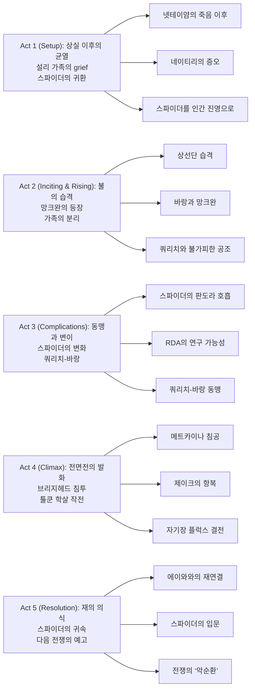

『Avatar: Fire and Ash』는 2편의 ‘물’ 이후, **불(증오)과 재(상실)**로 서사의 온도를 끌어올린다. 가족을 잃은 뒤 무너진 신념, 그리고 “적도 결국 누군가의 가족”이라는 불편한 질문이 판도라의 전쟁을 더 복잡하게 만든다.

특히 이번 편은 “누가 선이고 악인가”를 단순화하지 않으려 한다. 인간(RDA)의 침략이 계속되는 가운데, 나비족 내부에서도 에이와(Eywa)를 거부하는 망크완(Mangkwan)이 등장하고, 그 틈에서 쿼리치와 바랑의 동맹이 만들어진다.

## 개요

### 영화 정보

* **제목**: Avatar: Fire and Ash / 아바타: 불과 재
* **감독**: James Cameron (제임스 카메론)
* **각본**: James Cameron, Rick Jaffa, Amanda Silver
* **스토리**: James Cameron, Rick Jaffa, Amanda Silver, Josh Friedman, Shane Salerno
* **주연**: Sam Worthington(제이크), Zoe Saldaña(네이티리), Sigourney Weaver(키리/그레이스), Stephen Lang(쿼리치), Oona Chaplin(바랑), Kate Winslet(로날) 외
* **촬영**: Russell Carpenter
* **음악**: Simon Franglen
* **장르**: SF, 액션, 어드벤처, 에픽
* **상영시간**: 197분
* **개봉일**: 2025.12.19 (미국) / 2025.12.01 (월드 프리미어)
* **제작사**: Lightstorm Entertainment
* **배급사**: 20th Century Studios
* **제작비(보도치)**: 약 3.5~4억 달러
* **월드 박스오피스(보도치, 2026-01-01 기준)**: 약 8억 5,170만 달러
* **평점(참고)**: Rotten Tomatoes 66% / Metacritic 61 / CinemaScore A

### 추천 대상

* **아바타 세계관 팬**: 판도라의 ‘부족 정치’가 확장되며 전쟁의 결이 달라진다.
* **스펙터클 우선 관객**: 공중·해상·자기장 재난까지 한 편에 몰아넣는 대형 시퀀스가 강점.
* **가족 드라마 취향**: 상실 이후 가족의 윤리(특히 네이티리와 스파이더)가 전면으로 올라온다.

## 구조 분석

## 영화의 전체 내용 (스포일러 포함)

『Fire and Ash』의 핵심은 “전쟁이 계속될수록 누구의 윤리도 깨끗하게 남지 않는다”는 사실이다. 설리 가족은 또 한 번 이주와 전투를 겪지만, 이번에는 ‘외부의 적’만이 아니라 **내부의 증오**가 가족을 파열시키려 한다.

### Act 1 (Setup): 상실 이후의 균열

**[S01] 메트카이나의 바다, 장례의 여운**: 넷테이얌의 죽음 이후 설리 가족은 메트카이나와 함께 살지만, 애도의 방식은 모두 다르다. 제이크는 현실적인 생존을 선택하고, 네이티리는 분노를 끌어안는다.

**[S02] 네이티리의 ‘인간 혐오’가 굳어지다**: 네이티리는 인간과 인간의 문화(산소 마스크, 금속 장비 등)를 볼 때마다 상처가 재생된다. 스파이더를 향한 시선도 점점 날카로워진다.

**[S03] 비행 상선단의 도착**: 하늘을 가르는 거대한 상선단이 판도라로 들어오며 RDA의 물류·군사 확장이 본격화된다. 제이크는 “다음은 메트카이나”라고 직감한다.

**[S04] ‘스파이더를 인간 캠프로’라는 결정**: 제이크와 네이티리는 스파이더가 가족의 약점이 될 수 있음을 인정한다. 스파이더를 인간 과학자 캠프로 돌려보내되, 가족이 동행하기로 한다.

**[S05] 이동 준비와 불길한 징조**: 메트카이나의 바다를 떠나는 과정은 또 다른 이주의 시작이다. 아이들은 불안해하고, 제이크는 “이번엔 끝내야 한다”는 강박을 키운다.

### Act 2 (Inciting & Rising): 불의 습격

**[S06] 망크완의 기습**: 상선단이 협곡 지대를 지나던 순간, 에이와를 거부하는 망크완이 하늘에서 떨어지듯 덮친다. 불이 붙고, 연기가 시야를 삼킨다.

**[S07] 바랑의 등장**: 망크완의 차히크 바랑은 규율과 공포로 부족을 이끈다. 그녀의 전술은 약탈이 아니라 “본보기”에 가깝다.

**[S08] 선단의 파괴와 가족의 분리**: 불길 속에서 설리 가족은 흩어진다. 누가 어디로 끌려갔는지조차 확인하기 어렵다.

**[S09] 제이크와 네이티리의 생존**: 둘은 간신히 떨어져 나온 뒤 서로를 찾고, 아이들의 생존을 우선순위로 재정렬한다. 네이티리의 증오는 ‘결심’으로 바뀐다.

**[S10] 쿼리치와 와인플릿의 재등장**: 쿼리치와 와인플릿은 혼란을 이용해 제이크를 찾는다. “적이지만 서로가 필요하다”는 상황이 강제로 만들어진다.

**[S11] 불가피한 공조**: 아이들을 찾기 위해 제이크는 쿼리치와 잠정적인 협력을 받아들인다. 이 공조는 신뢰가 아니라 시간 벌기다.

**[S12] 스파이더의 산소 마스크 고장**: 이동 중 스파이더의 장비가 고장 나고 호흡이 급격히 무너진다. 인간의 몸이 판도라에서 얼마나 취약한지 다시 확인되는 순간.

**[S13] 키리의 트랜스와 땅의 ‘응답’**: 키리는 땅과 연결(큐를 통한 접속)해 트랜스 상태로 들어간다. 그녀의 행동은 기도처럼 보이지만, 결과는 의학처럼 현실적이다.

**[S14] 스파이더의 변이(첫 호흡)**: 스파이더의 몸은 균사(mycelia)로 “주입”되듯 변하고, 산소 없이도 판도라 대기를 들이마시기 시작한다. 가족에게는 기적이지만, 전쟁에는 무기가 된다.

### Act 3 (Complications): 동맹과 변이

**[S15] 아이들의 포획**: 망크완은 아이들을 인질로 만든다. ‘부족 전쟁’이 ‘가족 전쟁’으로 바뀌는 지점이다.

**[S16] 총을 든 바랑**: 쿼리치는 바랑에게 총기를 건네며 전술을 가르친다. 판도라의 전쟁에 지구식 살상 논리가 스며든다.

**[S17] 키리의 탈출 작전**: 키리는 식생을 움직여 경비를 무너뜨리고 탈출 통로를 만든다. 자연은 배경이 아니라 전투의 주체가 된다.

**[S18] 인간 과학자 캠프, 검사와 충격**: 노름과 맥스는 스파이더의 몸 안에서 ‘기생/공생’하는 생물을 발견한다. 이 발견은 RDA의 목표를 바꿀 수 있는 급의 돌파구다.

**[S19] ‘인간의 판도라 호흡’ 가능성**: 연구팀은 이 생물을 역공학하면 인간 전체가 판도라에 적응할 수 있다고 추론한다. 판도라 침략의 비용 구조가 바뀐다.

**[S20] 스파이더의 큐(신경 접속)의 성장**: 스파이더는 큐를 갖게 되어 나비처럼 동물과 접속할 수 있다. 그의 정체성은 더 이상 ‘인간/나비’로 나뉘지 않는다.

**[S21] 키리의 출생 비밀**: 키리는 자신이 에이와에 의해 ‘태어났다’는 사실을 더 강하게 확신하지만, 동시에 접속이 막히는 벽을 느낀다. 능력은 축복이자 고립이다.

**[S22] 쿼리치의 ‘거래’**: 쿼리치는 망크완에게 무기·화염방사기 등 보급을 제공하며 동맹을 제안한다. 전쟁의 구도가 “RDA vs 나비”에서 “RDA+망크완 vs 나비 연합”으로 재편된다.

**[S23 미드포인트 - 쿼리치와 바랑의 결속**: 쿼리치는 바랑과 관계를 맺으며 동맹을 감정적으로도 고정시킨다. 이 순간부터 ‘전쟁’은 되돌리기 어려운 길로 접어든다.

**[S24] 키리와 스파이더의 결속 훈련**: 키리는 스파이더가 야생 생명체와 접속하도록 돕는다. 전투 기술이 아니라 ‘소속’을 만드는 훈련이다.

**[S25] 매복과 납치**: 둘은 기습당하고, 스파이더는 쿼리치에게 붙잡힌다. 쿼리치는 그를 약점이자 열쇠로 본다.

### Act 4 (Climax): 전면전의 발화

**[S26] 메트카이나 침공**: 쿼리치와 망크완은 메트카이나 마을을 습격한다. 요구는 단순하다. “제이크를 내놔라.”

**[S27] 제이크의 항복**: 제이크는 전쟁을 막기 위해 스스로를 내준다. 그는 ‘부족’보다 ‘가족’을 먼저 택하지만, 그 선택은 더 큰 전쟁을 부를 수도 있다.

**[S28] 브리지헤드 시티로의 이송**: 제이크와 스파이더는 RDA의 거점 브리지헤드로 끌려간다. 망크완은 이제 그곳의 새로운 주민이 된다.

**[S29] 툴쿤의 ‘이익’과 사냥 계획**: 수백 마리 툴쿤이 짝짓기 철에 모이고, RDA는 이를 수익으로 계산한다. 가르빈은 반대하지만 묵살된다.

**[S30] 스파이더 실험과 ‘죽이지 못하는 인질’**: RDA는 스파이더를 해부하지 못한다. 그가 살아 있어야 ‘적응’의 기술이 완성될 수 있기 때문이다.

**[S31] 처형 예정의 제이크**: 제이크는 처형을 기다린다. ‘영웅’의 죽음이 아니라 ‘상징’의 처리가 전쟁처럼 진행된다.

**[S32] 네이티리의 침투**: 네이티리는 브리지헤드 내부로 들어와 제이크를 구할 계획을 세운다. 이 장면은 그녀가 증오를 ‘전술’로 바꾸는 전환점이다.

**[S33] 가르빈의 반란(불도저 탈취)**: 가르빈은 불도저를 훔쳐 제이크를 빼낸다. 인간 진영 내부에도 균열이 있음을 드러낸다.

**[S34] 스파이더의 ‘인간 방패’**: 스파이더는 과학자들이 자신을 죽일 수 없다는 걸 알고, 도망치는 제이크와 네이티리를 보호한다. 그는 가족을 지키기 위해 자신을 무기로 쓴다.

**[S35] 제이크의 살의와 멈춤**: 탈출 후 제이크는 스파이더가 인류의 침략에 ‘열쇠’가 될 수 있음을 깨닫고 극단을 고려한다. 그러나 끝내 멈추며, 네이티리도 마침내 스파이더를 가족으로 받아들인다.

**[S36] 툴쿤 평의회의 결단과 흔들림**: 제이크는 학살을 경고하지만, 툴쿤은 평화주의를 지키려 한다. 로아크는 파야칸과 ‘상처 입은 생존자’ 타녹을 데려와 논의를 뒤흔든다.

**[S37] 토루크 막토의 귀환**: 제이크는 다시 토루크와 결속해 전쟁을 준비한다. 이는 전설의 회복이자, “지금은 신화가 필요한 때”라는 선언이다.

**[S38 클라이맥스 - 함대 급습과 자연의 반격**: RDA 함대가 사냥을 시작하자 툴쿤과 나비 연합이 매복한다. 하지만 망크완과 쿼리치가 뒤통수를 치며 전장은 지옥으로 변한다.

**[S39] 로날의 죽음과 아이의 탄생**: 로날은 출산 중 치명상을 입고 죽는다. 네이티리는 아기 프릴을 안지만 곧 붙잡혀 RDA 기함으로 끌려간다.

**[S40] 키리의 ‘접속 해금’**: 키리는 에이와와의 연결을 열고 도움을 요청한다. 판도라의 야생 생명체가 인간 병력을 공격하며 전투의 규칙이 뒤집힌다.

**[S41] 바랑 vs 네이티리, 키리의 개입**: 바랑은 네이티리를 죽이려 하지만, 키리가 막아선다. “불(증오)”에 “연결(공감)”이 맞서는 구도다.

**[S42] 자기장 플럭스 붕괴**: 제이크의 토루크가 RDA 기함을 자기장 플럭스에 처박아 파괴한다. 전쟁의 클라이맥스가 ‘전투’가 아니라 ‘환경 재난’으로 폭발한다.

**[S43] 제이크 vs 쿼리치, 추락의 결투**: 둘은 플럭스 속에서 마지막으로 싸운다. 스파이더가 뒤따라오고, 총을 쏘지만 쿼리치는 떨어지며도 스파이더를 붙잡는다.

**[S44] 제이크의 구원, 쿼리치의 도약**: 제이크는 적임에도 스파이더를 위해 쿼리치를 끌어올린다. 그러나 쿼리치는 끝내 바위에서 뛰어내리며 사라진다. 죽음인지, 다음의 전쟁인지 확정되지 않는다.

### Act 5 (Resolution): 재의 의식

**[S45] 물속 영혼나무의 의식**: 스파이더와 메트카이나는 물속 영혼나무에 연결한다. 스파이더는 죽은 나비들을 만나며 ‘상실’의 의미를 다른 방식으로 이해한다.

**[S46] 그레이스와의 만남**: 키리는 스파이더를 자신의 어머니 그레이스에게 소개한다. 과거(그레이스)와 현재(스파이더)가 같은 의식 공간에 묶인다.

**[S47 엔딩] 스파이더의 입문**: 스파이더는 나비로서의 첫걸음을 내딛는다. 하지만 그의 몸에 남은 ‘인류의 열쇠’는 전쟁의 씨앗으로도 남는다.

## 캐릭터 분석

### 제이크 설리 / Jake Sully (Sam Worthington)

**개요**: “가족을 지키기 위해 전쟁을 피하려는 지도자”에서, “전쟁을 끝내기 위해 신화를 다시 꺼내는 전사”로 회귀한다.

**성장 곡선**: 회피(이주) → 공조(적과 협력) → 손실(침공) → 결단(항복) → 재각성(토루크 막토) → 구원(적을 살려서라도 가족을 지킴).

**갈등 구조**: 공동체의 지도자 vs 가족의 아버지. 스파이더를 향한 살의가 스스로의 윤리선을 시험한다.

### 네이티리 / Neytiri (Zoe Saldaña)

**개요**: ‘상실’이 그녀를 에이와의 길에서 멀어지게 만든다. 이번 편의 네이티리는 사랑보다 증오에 더 빨리 반응한다.

**동기와 욕망**: 잃어버린 것을 되돌릴 수 없기에, “가해자를 벌해야 한다”는 단순한 정의로 마음을 버틴다.

**상징적 의미**: 불(증오)의 인격화. 그녀가 마지막에 스파이더를 받아들이는 순간, 영화는 ‘재(상실)’가 증오로만 남지 않을 길을 잠깐 보여준다.

### 스파이더 / Miles “Spider” Socorro (Jack Champion)

**개요**: 인간이지만 나비에게 길러졌고, 이번 편에서는 생물학적으로도 판도라에 적응한다.

**성장 곡선**: ‘남겨진 아이’ → 변이(호흡/큐) → 실험 대상 → 인간 방패 → 입문 의식.

**갈등 구조**: 가족이 된다는 것은, 동시에 전쟁의 ‘키’가 된다는 뜻. 스파이더는 사랑을 증명할수록 더 위험한 존재가 된다.

### 쿼리치 / Miles Quaritch (Stephen Lang)

**개요**: 집요한 복수자이자, 스파이더를 통해 “관계”를 배우는 적.

**상징적 의미**: 인간 제국주의의 생존 본능. 다만 이번 편은 그를 단순 악당이 아니라, 다른 부족(망크완)과도 손을 잡는 ‘현실 정치’로 확장한다.

### 바랑 / Varang (Oona Chaplin)

**개요**: 고통을 겪은 부족의 지도자. 그녀에게 윤리는 사치일 수 있고, 생존은 명령이다.

**상징적 의미**: “나비도 절대선이 아니다”를 증명하는 캐릭터. 불은 인간이 아니라 나비 내부에서도 타오른다.

## 영상미와 음악

### 시각 효과 / 촬영 / 미학

카메라는 물(메트카이나)과 불(망크완)을 대비시키며, 판도라를 하나의 행성이라기보다 **서로 다른 생태/정치 구역이 충돌하는 대륙**처럼 보여준다. 대형 전투는 단순히 ‘더 큰’ 스케일이 아니라, 공중-해상-지상-환경 재난(자기장 플럭스)을 겹쳐 **전쟁의 통제 불가능성**을 시각화한다.

### 음악: Simon Franglen / 오리지널 송

사이먼 프랭글런의 스코어는 이전 편들의 테마를 확장해 “애도(저음)”와 “전투(고음)”를 교차시킨다. 엔딩 크레딧의 오리지널 곡 **「Dream as One」**은 서사의 종결이 아니라, ‘다음 편으로 이어지는 감정적 다리’로 배치된다.

## 종합 평가

### 최종 평점: ★★★★☆ (4.0/5.0)

**장점**:
- 판도라의 부족 구도를 확장하며 “선/악”을 단순화하지 않는 전쟁 서사
- 스파이더를 중심으로 한 생물학적·정치적 딜레마(“인류의 열쇠”)
- 압도적인 VFX와 전투 시퀀스의 설계(특히 자기장 플럭스)

**단점**:
- 전작들과 유사한 ‘침공-납치-구출’ 리듬이 반복처럼 느껴질 수 있음
- 일부 캐릭터(과학자·RDA 내부)의 선택이 기능적으로 보이는 구간 존재

### 한 줄 평

“불(증오)은 전쟁을 시작하고, 재(상실)는 전쟁을 반복시킨다.”

### 관람 전 체크리스트

- 사전 지식이 필요한가? **권장** (『Avatar』, 『The Way of Water』를 보면 감정선이 선명해진다)
- 어린이와 함께 볼 수 있는가? **부분적으로** (전투·잔혹 묘사/상실 서사 강함)
- 특정 요소를 기대해도 되는가? **가능** (초대형 VFX, 판도라 생태, 부족 전쟁, 가족 드라마)
- 쿠키 영상이 있는가? **미확인** (공식 정보 기준 확인 필요)
- 속편 가능성은? **매우 높음** (4·5편으로 이어지는 “사이클” 서사)

## 참고 문헌 및 출처

- [Avatar: Fire and Ash — Wikipedia](https://en.wikipedia.org/wiki/Avatar:_Fire_and_Ash)

