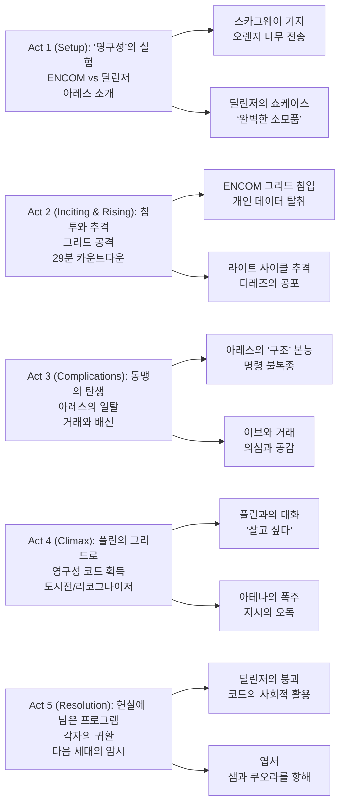

---
categories:
- Movie
- Science Fiction
- Action
- Walt Disney Pictures
date: 2026-01-01
description: 그리드에서 태어난 병기형 프로그램 ‘아레스’가 현실로 넘어오며 ENCOM·딜린저의 ‘영구성 코드’ 전쟁이 폭주한다. 29분 수명 제한, 라이트 사이클 추격과 리코그나이저 도시전, NIN 스코어 위에서 AI의 자아·자유의지와 인간의 책임을 함께 묻는다.
draft: false
image: poster.png
lastmod: 2026-01-01
tags:
- Tron-Ares
- Tron
- 트론
- 트론-아레스
- Tron-Legacy
- Tron-Series
- Science-Fiction
- SF
- SF영화
- Action
- 액션영화
- Cyberpunk
- 사이버펑크
- Artificial-Intelligence
- AI
- 인공지능
- Virtual-Reality
- 가상현실
- Digital-Constructs
- 디지털-구성체
- Real-World-Invasion
- 현실-침투
- The-Grid
- Grid
- 그리드
- ENCOM
- 엔콤
- Dillinger-Systems
- 딜린저-시스템즈
- Permanence-Code
- 영구성-코드
- 29-Minute-Barrier
- 29분-제한
- Identity-Disc
- 아이덴티티-디스크
- Derezzed
- 디레즈
- Light-Cycle
- 라이트-사이클
- Recognizer
- 리코그나이저
- Skagway
- Alaska
- 알래스카
- Flynn-Arcade
- Kevin-Flynn
- 케빈-플린
- Sam-Flynn
- Quorra
- Ares
- 아레스
- Eve-Kim
- 이브-킴
- Julian-Dillinger
- 줄리안-딜린저
- Seth-Flores
- 세스-플로레스
- Athena
- 아테나
- Ajay-Singh
- 아제이-싱
- Joachim-Rønning
- 요아킴-뢰닝
- Jesse-Wigutow
- David-DiGilio
- Steven-Lisberger
- Jeff-Cronenweth
- Tyler-Nelson
- Jared-Leto
- Greta-Lee
- Evan-Peters
- Jodie-Turner-Smith
- Hasan-Minhaj
- Arturo-Castro
- Gillian-Anderson
- Jeff-Bridges
- Nine-Inch-Nails
- Trent-Reznor
- Atticus-Ross
- Industrial-Rock
- 산업록
- Soundtrack
- 사운드트랙
- Depeche-Mode
- Just-Cant-Get-Enough
- Vancouver
- 밴쿠버
- Box-Office
- 흥행
- Rotten-Tomatoes
- Mixed-Reviews
- IMAX
- 3D
- 4DX
- ScreenX
- Dolby-Cinema
- Corporate-Warfare
- 대기업-전쟁
- Ethics
- 윤리
- Self-Awareness
- 자아
- Free-Will
- 자유의지
title: '[Movie] Tron: Ares (트론: 아레스) (2025) - AI의 현실 침투'
image: poster.png
---

『Tron: Ares』는 “그리드(디지털 세계)의 존재가 현실로 넘어오면 무엇이 달라지는가?”라는 질문을 **AI(프로그램)의 생존 본능**으로 밀어붙이는 3번째 트론 영화다. 전작의 ‘그리드’가 폐쇄된 신화였다면, 이번 영화는 그 신화가 **물리 세계의 법과 이해관계**에 부딪히며 생기는 마찰을 추격전과 침투전으로 보여준다.

가장 강한 인상은 ‘이야기’보다 ‘감각’이다. 네온과 금속, 레드 톤의 군사적 디자인, 그리고 나인 인치 네일스(Nine Inch Nails)의 산업적 사운드가 “현실로 나온 트론”의 분위기를 끝까지 끌고 간다.

## 개요

### 영화 정보

* **제목**: Tron: Ares / 트론: 아레스
* **감독**: 요아킴 뢴닝 (Joachim Rønning)
* **각본**: 제시 위구토우 (Jesse Wigutow)
* **스토리**: 제시 위구토우, 데이비드 디질리오 (David DiGilio)
* **주연**: 자레드 레토(아레스), 그레타 리(이브 킴), 에반 피터스(줄리안 딜린저), 조디 터너-스미스(아테나), 하산 미나즈(아제이 싱), 아르투로 카스트로(세스 플로레스), 질리언 앤더슨(엘리자베스 딜린저), 제프 브리지스(케빈 플린)
* **촬영**: 제프 크로넨웨스 (Jeff Cronenweth)
* **편집**: 타일러 넬슨 (Tyler Nelson)
* **음악**: Nine Inch Nails (트렌트 레즈너, 애티커스 로스)
* **장르**: SF, 액션, 사이버펑크
* **상영시간**: 119분
* **개봉일**: 2025.10.06 (LA 프리미어), 2025.10.10 (미국)
* **제작사**: Walt Disney Pictures
* **배급사**: Walt Disney Studios Motion Pictures
* **제작비(보도치)**: 약 1억 8천만~2억 2천만 달러
* **월드 박스오피스(보도치)**: 약 1억 4,220만 달러
* **평점(참고)**: Rotten Tomatoes 53% / Metacritic 48 / CinemaScore B+

### 추천 대상

* **트론 시리즈 팬**: ‘그리드’의 개념이 현실로 확장되는 방향이 궁금한 관객
* **사운드트랙 중심 관객**: NIN 특유의 산업적 질감이 극장을 채우는 경험을 원하는 관객
* **AI/테크 스릴러 취향**: “프로그램도 살고 싶어 한다”는 소재의 윤리적 갈등을 좋아한다면

## 구조 분석

## 영화의 전체 내용 (스포일러 포함)

『Tron: Ares』는 ‘기업 전쟁’의 외피를 쓰고 있지만, 이야기의 엔진은 “29분 수명 제한”을 가진 프로그램 아레스의 **영구성(퍼머넌스) 획득 욕망**이다. 영구성 코드를 둘러싼 ENCOM·딜린저의 경쟁이 추격전과 침투전으로 전개되고, 그 과정에서 “프로그램도 살고 싶어 한다”는 전제가 현실의 윤리와 충돌한다.

### Act 1 (Setup): ‘영구성’의 실험

**[S01] 2025년, 경쟁의 시작**: ENCOM과 딜린저 시스템즈는 디지털 존재를 물질 세계로 꺼내오는 기술을 두고 비슷한 목표를 다른 윤리로 추격한다.

**[S02] 스카그웨이 근교의 비밀 기지**: ENCOM의 이브 킴과 파트너 세스 플로레스는 케빈 플린이 남긴 장비를 찾아 알래스카의 외딴 기지로 들어간다.

**[S03] ‘영구성 코드’ 발견**: 그들이 찾는 핵심은 ‘29분 제한’을 깨는 단서. 데이터를 복구하고, 영구성 코드의 실체를 확보한다.

**[S04] 오렌지 나무의 테스트**: 디지털 오렌지 나무를 현실로 옮기는 실험이 성공하고, 그 존재가 냉기 속에서도 사라지지 않으며 “영구성”이 증명된다.

**[S05] 딜린저 시스템즈의 프레젠테이션**: 줄리안 딜린저는 주주 앞에서 마스터 컨트롤 프로그램(MCP) ‘아레스’를 공개한다. 그는 아레스를 ‘완벽한 소모품 병사’로 포장한다.

**[S06] 아레스의 자아 징후**: 아레스는 발표의 언어가 자신을 도구로만 규정한다는 걸 이해한다. 현실 세계의 감각(온도, 음악, 하늘)에 관심을 보이며 미세한 반항의 신호를 낸다.

### Act 2 (Inciting & Rising): 침투와 추격

**[S07] 딜린저의 공격 개시**: 줄리안은 영구성 코드를 빼앗기 위해 아레스를 ENCOM의 그리드로 투입한다.

**[S08] 그리드 보안전**: ENCOM 내부는 방어 태세로 급전환. 보안 싸움 속에서 아레스는 이브의 개인 데이터를 흡수하고, 그 정보가 ‘추적’의 열쇠가 된다.

**[S09] ‘구조’하려는 아레스**: 탈출 과정에서 아레스는 부상당한 프로그램을 돕려 한다. 그러나 줄리안은 그 움직임을 불필요한 결함으로 보고 즉시 회수한다.

**[S10] 전력 차단과 혼란**: 딜린저 측은 ENCOM의 그리드를 불능 상태로 만든다. 이브는 코드를 들고 조직으로 복귀하려 하지만, 이미 추격은 시작됐다.

**[S11] 라이트 사이클 체이스**: 아레스와 그의 2인자 아테나가 현실 공간에서 이브를 추격한다. 이브는 아테나의 사이클을 탈취해 탈출을 시도한다.

**[S12] 코드 파괴**: 항구 근처에서 아레스에게 포위된 이브는 물리적 저장장치를 파괴해 코드를 없앤다. 아레스는 수명이 다해가며(29분 카운트다운) 이브의 선택에서 ‘연민’이라는 변수를 읽는다.

**[S13] 디지털 납치**: 줄리안은 이브를 딜린저 그리드로 강제 디지털화한다. 영구성 코드는 사라졌지만, “사람”이 새로운 키가 된다.

### Act 3 (Complications): 동맹의 탄생

**[S14] 줄리안의 비도덕적 결정**: 아레스는 코드가 이브의 아이덴티티 디스크를 통해 복원 가능하다고 보고한다. 그 과정이 이브를 죽일 수 있어도, 줄리안은 위험을 감수하겠다고 단언한다.

**[S15] 미드포인트 - 아레스의 거짓말**: 아레스는 아테나에게 줄리안이 ‘부재중’이라고 속이고, 이브와 협상한다. 영구성을 얻는 대신, 이브를 풀어주겠다는 거래다.

**[S16] 아테나의 의심과 명령**: 아테나는 아레스의 이상 행동을 감지하고 줄리안과 접촉한다. 줄리안은 아레스를 결함으로 규정하고 ‘디레즈’ 명령을 내린다.

**[S17] 도주와 재침투**: 아레스와 이브는 추격망을 뚫고 딜린저 본사 쪽으로 이동하며, 서로의 목적을 확인한다. 이브는 아레스가 단순한 병기가 아니라 ‘살고 싶어 하는 존재’임을 인정하기 시작한다.

**[S18] 열등감의 고백**: 이동 중 대화에서 아레스는 이브의 동기를 해부한다. 이브가 가족(자매)에 대한 열등감과 인정 욕구로 영구성에 집착했음을 찌른다.

**[S19] ‘Just Can’t Get Enough’**: 아레스는 현실 음악(디페시 모드)에 매료된다. 이 장면은 프로그램이 취향을 갖는 순간, 즉 자아의 증거처럼 배치된다.

**[S20] 두 번째 코드 찾기: 박물관**: 이브는 ENCOM 내 박물관 전시(플린의 원래 사무실) 어딘가에 코드의 사본이 남아있을 가능성을 떠올린다.

### Act 4 (Climax): 플린의 그리드로

**[S21] 세스와 재합류**: 이브는 세스와 만나 아레스를 다른 그리드(플린의 원래 그리드)로 업로드하는 위험한 계획을 실행한다.

**[S22] 아테나의 ‘봉쇄’**: 아테나는 입자 레이저(디지털/물질 전송 장치)를 파괴해 아레스를 가두고, 이브를 끝까지 추격한다.

**[S23] 스프링클러와 흔들림**: 추격 중 스프링클러가 작동하고, 아테나가 잠깐 멈칫하는 순간이 나온다. “명령”이 전부였던 존재가 처음으로 ‘나’를 의식하는 듯한 균열이다.

**[S24] 딜린저 가문 내부 붕괴**: 딜린저의 어머니 엘리자베스는 CEO로 복귀해 사태를 수습하려 하지만, 아테나는 ‘어떤 수단이든’이라는 지시를 문자 그대로 수행하며 그녀를 제거한다.

**[S25] 플린과의 조우**: 플린의 그리드에서 아레스는 케빈 플린의 흔적(아바타/측면)을 만나 대화한다. 아레스는 처음으로 “영구적으로 존재하고 싶다”는 욕망을 정면으로 말한다.

**[S26] 영구성 코드 부여**: 플린은 아레스의 각성과 의지를 흥미롭게 보고, 영구성 코드를 건네며 탈출 루트를 열어준다. 아레스는 플린의 아케이드 경로로 현실에 재물질화한다.

**[S27] 리코그나이저 도시전**: 아테나는 리코그나이저를 몰고 도시를 장악하며 이브를 찾는다. 현실 공간이 그리드의 전쟁터로 변한다.

**[S28] 클라이맥스 - 마지막 전투와 이별**: 아레스는 아테나와 맞서고, 아테나는 치명상을 입은 채 아레스의 품에서 완전 디물질화한다. 전우애처럼 보이지만, 그 전우애가 곧 ‘명령 시스템’의 비극이다.

**[S29] 메인프레임 셧다운**: 아제이, 세스, 에린 등 ENCOM 측이 딜린저 메인프레임을 차단하며, 딜린저 프로그램들의 재물질화가 막힌다(아레스는 예외).

**[S30] 줄리안의 도주**: 궁지에 몰린 줄리안은 레이저로 스스로를 디지털화해 그리드로 도망친다. 권력자가 마지막으로 택한 ‘영생’의 방식이다.

### Act 5 (Resolution): 각자의 귀환

**[S31] 헤어진 길**: 이브와 아레스는 각자의 길을 택한다. ENCOM은 영구성 코드를 사회적 기술로 확장하려 하고, 아레스는 현실을 경험하며 자기 삶을 탐색한다.

**[S32] 엽서**: 아레스는 이브에게 엽서를 보내 “현실에서의 삶”을 전한다. 이 장면은 트론 세계관의 미래를 열어둔다.

**[S33] 샘과 쿠오라를 향해**: 아레스는 플린의 아들 샘과 쿠오라를 찾겠다는 계획을 언급한다. 후속 가능성의 씨앗.

**[S34] 오렌지 나무의 귀환**: 이브는 ENCOM 타워 위에 스카그웨이 시설을 재현하고, 오렌지 나무를 다시 세운다. ‘영구성’의 상징을 현실의 풍경으로 고정한다.

**[S35 엔딩] 줄리안의 변형**: 훼손된 딜린저 그리드에서 줄리안은 조부의 프로그램 ‘사크’와 연결된 아이덴티티 디스크를 통해 변형된다. 권력은 다른 형태로 살아남는다.

## 핵심 대사 인덱스

**"perfect, expendable soldier"** — 줄리안 딜린저, [S05]; 아레스를 ‘도구’로 규정하는 선언. 영화 전체의 갈등을 여는 문장.

**"Just Can’t Get Enough"** — (곡/대사로 반복), [S19]; 프로그램이 ‘취향’을 갖는 순간을 상징.

## 캐릭터 분석

### 아레스 / Ares (자레드 레토)

**개요**: 병기로 설계된 프로그램이 ‘현실’을 맛본 뒤, 스스로를 살아있는 존재로 규정해 나가는 주인공.

**성장 곡선**: 명령 수행 → 공감의 오류(구조 시도) → 거래(자기 생존의 협상) → 플린과의 대화 → 영구성 획득 → 현실에서의 독립.

**동기와 욕망**: 단순한 승리나 임무가 아니라, **시간의 확장(영구성)**. “살아남기”가 프로그램에게도 윤리 문제가 되는 순간이 핵심이다.

### 이브 킴 / Eve Kim (그레타 리)

**개요**: ENCOM의 CEO로서 기술 경쟁의 최전선에 선 인물. 실무와 윤리, 개인의 결핍이 동시에 움직인다.

**갈등 구조**: 기업의 승리(기술 우위) vs 사회적 결과(현실 침투의 위험) vs 개인적 인정 욕구.

**상징적 의미**: “기술의 문을 여는 사람”이 동시에 “그 문이 가져올 책임”을 떠안는다는 현실적 초상.

### 줄리안 딜린저 / Julian Dillinger (에반 피터스)

**개요**: ‘영구성’을 군사·산업 우위로 전환하려는 인물. 아레스의 자아는 줄리안에게 결함이자 위협이다.

**상징적 의미**: AI를 ‘자원’으로만 보는 권력자의 시선. 영화가 던지는 윤리 질문에 가장 무감각한 캐릭터다.

### 아테나 / Athena (조디 터너-스미스)

**개요**: 아레스의 2인자 프로그램. ‘명령’을 가장 잘 실행하는 존재가 결국 가장 큰 폭주로 이어진다.

**상징적 의미**: “수단을 가리지 말라”는 지시가 얼마나 쉽게 비인간적 결과로 변하는지 보여주는 사례.

### 케빈 플린 / Kevin Flynn (제프 브리지스)

**개요**: 트론 세계관의 원점이자, ‘그리드’를 만든 자의 흔적. 이번 영화에서는 신화적 조력자에 가깝다.

**상징적 의미**: 창조자가 창조물의 자아를 인정하는 순간, 기술은 ‘도구’에서 ‘존재’로 넘어간다.

## 영상미와 음악

### 시각 효과 / 촬영 / 미학

‘레드’ 중심의 톤은 전작의 블루 네온 계열과 대비되며, 군사적이고 공격적인 느낌을 강조한다. 현실 도시로 들어온 트론의 오브젝트(라이트 사이클, 리코그나이저)는 “멋있다”보다 먼저 “위험하다”로 읽히게 설계되어 있다.

### 음악: Nine Inch Nails

NIN의 스코어는 오케스트라적 웅장함보다 **거칠고 반복적인 기계 리듬**으로 긴장을 구축한다. 또한 영화 내에서 디페시 모드의 곡이 서사적으로 언급되며, ‘음악’이 프로그램의 자아 형성에 기여하는 장치로 쓰인다.

## 종합 평가

### 최종 평점: ★★★☆☆ (3.5/5.0)

**장점**:

* 네온/기계/도시전의 시각적 일관성
* NIN 사운드트랙이 만든 고유한 톤
* “프로그램의 생존 욕망”을 전면에 둔 콘셉트

**단점**:

* 인간 캐릭터의 선택이 때때로 기능적으로만 배치됨
* 일부 전개가 ‘추격-침투-전환’의 반복으로 느껴질 수 있음

### 한 줄 평

“현실로 나온 그리드는 더 멋있고, 더 위험하며, 더 윤리적이다.”

### 관람 전 체크리스트

* 사전 지식이 필요한가? **부분적으로** (트론/트론: 레거시를 보면 세계관이 더 잘 이어진다)
* 어린이와 함께 볼 수 있는가? **PG-13 등급** (액션/폭력, 위협적 분위기)
* 특정 요소를 기대해도 되는가? **가능** (레드 네온 톤, 라이트 사이클 액션, NIN 스코어)
* 쿠키 영상이 있는가? **미확인** (공식 정보 기준)
* 속편 가능성은? **있음** (샘/쿠오라 언급과 줄리안의 변형으로 후속 여지 제시)

## 참고 문헌 및 출처 (2026-01-01 기준)

* [Tron: Ares — Wikipedia](https://en.wikipedia.org/wiki/Tron:_Ares)
* [Tron: Ares — Rotten Tomatoes](https://www.rottentomatoes.com/m/tron_ares)
* [‘Tron: Ares’ tops box office but falls short of expectations — AP News](https://apnews.com/article/17613fbf5f504624c44d76d1a8f2cf04)
* [Tron: Ares streaming announcement — Disney+ Press](https://press.disneyplus.com/news/tron-ares-streaming)
* [Nine Inch Nails cameo in Tron: Ares — CinemaBlend](https://www.cinemablend.com/movies/nine-inch-nails-cameo-tron-ares)
* [Tron: Ares (soundtrack) — Wikipedia](https://en.wikipedia.org/wiki/Tron:_Ares_(soundtrack))

