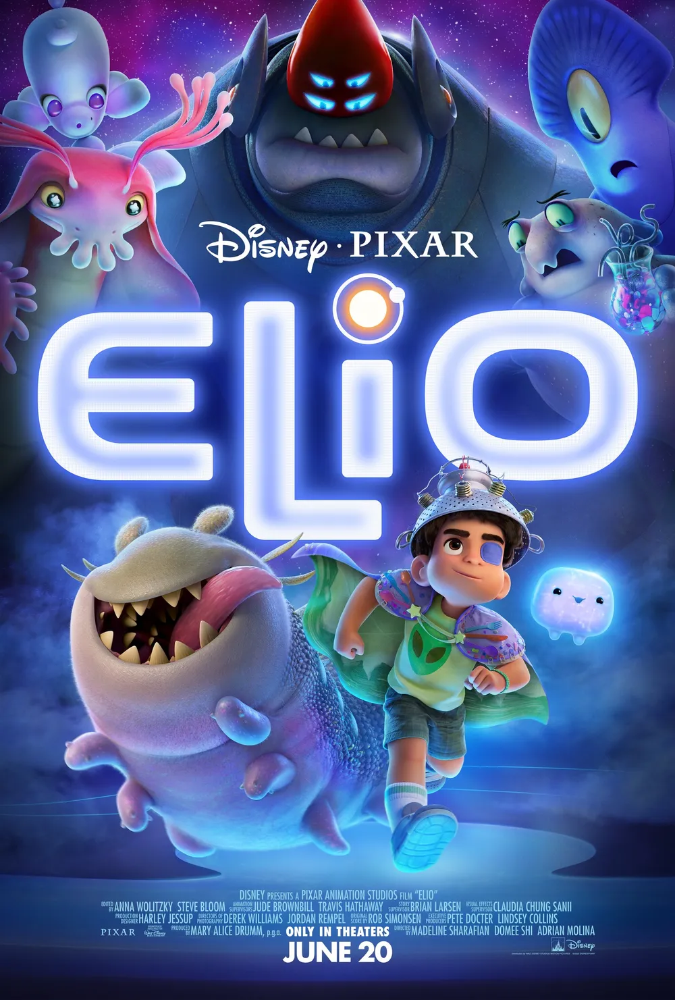
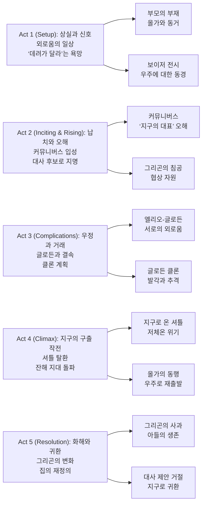

『Elio』는 “외계인에게 데려가 달라”는 한 아이의 소원이, 우주적 스케일의 **오해(지구 대표)**로 증폭되며 시작한다. 그런데 이 영화가 진짜로 밀어붙이는 건 거대 전쟁이 아니라, **외로움과 관계 맺기**다.

커뮤니버스의 눈부신 설정은 ‘도피처’처럼 보이지만, 이야기는 끝내 지구로 돌아온다. “어디로 가느냐”보다 “누구와 함께 있느냐”가 더 중요하다는, 픽사 특유의 정서적 착지를 (익숙한 공식으로) 다시 한 번 수행한다.

## 개요

### 영화 정보

* **제목**: Elio / 엘리오
* **감독**: Madeline Sharafian(매들린 샤라피안), Domee Shi(도미 시), Adrian Molina(아드리안 몰리나)
* **각본**: Julia Cho(줄리아 조), Mark Hammer(마크 해머), Mike Jones(마이크 존스)
* **주연(목소리)**: Yonas Kibreab(엘리오), Zoe Saldaña(올가), Remy Edgerly(글로든), Brad Garrett(그리곤), Jameela Jamil(퀘스타), Shirley Henderson(오오오오) 외
* **음악**: Rob Simonsen
* **장르**: 애니메이션, SF, 어드벤처
* **상영시간**: 98분
* **개봉일**: 2025.06.20 (미국)
* **제작사**: Pixar Animation Studios
* **배급사**: Walt Disney Pictures (미국)
* **제작비(보도치)**: 약 1억 5천만~2억 달러
* **월드 박스오피스(보도치)**: 약 1억 5,400만 달러
* **평점(참고)**: Rotten Tomatoes 83% / Metacritic 66 / CinemaScore A

### 추천 대상

* **‘외로움/상실’이 중심인 가족 영화가 보고 싶은 관객**: 우주 배경이지만 결론은 ‘관계’에 닿는다.
* **픽사식 세계관 놀이를 좋아하는 관객**: 커뮤니버스의 디자인과 설정 자체가 큰 볼거리다.
* **아이와 함께 볼 “큰 무서움 없는” SF 어드벤처**: 전쟁 위협은 있지만 톤은 대체로 따뜻하게 유지된다.

## 구조 분석

## 영화의 전체 내용 (스포일러 포함)

『Elio』의 플롯은 “오해로 얻은 역할(대사)”을 통해 “원래의 결핍(외로움)”을 드러내는 구조다. 엘리오는 커뮤니버스를 ‘새 가족’처럼 꿈꾸지만, 결국 그곳은 **도피가 아니라 성장의 거울**로 기능한다.

### Act 1 (Setup): 상실과 신호

**[S01] 올가의 선택**: 부모를 잃은 엘리오는 공군 장교인 이모 올가와 산다. 올가는 원래 꿈이 있었지만, 조카를 위해 삶의 궤도를 바꾼 인물로 설정된다.

**[S02] 박물관의 보이저 1**: 엘리오는 박물관의 보이저 전시에서 ‘우리가 혼자가 아닐지도 모른다’는 감각에 매혹된다. 우주에 대한 동경이 개인적 결핍과 결합한다.

**[S03] 해변의 대기**: 시간이 흐른 뒤, 엘리오는 매일 해변에서 납치를 기다린다. 현실의 관계가 불안정할수록, ‘우주’는 더 확실한 탈출구가 된다.

**[S04] 햄 라디오 사건과 부상**: 브라이스와 케일럽이 엘리오의 라디오를 건드리며 다툼이 벌어지고, 엘리오는 왼쪽 눈을 다친다. 엘리오가 ‘사회적 약자’로 놓이는 출발점이다.

**[S05] 군 기지의 회의, 멜맥 등장**: 올가의 직장에서 멜맥은 외계 신호를 주장하지만, 조직은 이를 일축한다. 엘리오는 “진짜가 있다”는 말에 더 깊게 빨려든다.

**[S06] 신호 송신과 정전**: 엘리오는 멜맥의 장치를 몰래 사용해 메시지를 보내고, 기지에 정전이 나며 올가가 곤란해진다. 올가의 ‘보호자 역할’이 위협받는다.

**[S07] 캠프행 통보**: 올가는 엘리오를 청소년 캠프로 보낸다. 엘리오에게는 ‘버려짐’의 반복으로 느껴지고, 엘리오의 도피 욕망은 더 커진다.

### Act 2 (Inciting & Rising): 납치와 오해

**[S08] 캠프에서의 추격**: 캠프에서 브라이스와 케일럽 일행이 엘리오를 괴롭히고, 엘리오는 도망친다. 엘리오의 ‘지구에서의 자리 없음’이 또 확인된다.

**[S09] 외계 신호의 답장**: 기지에는 엘리오의 메시지에 대한 반응으로 보이는 패턴들이 도착한다. 올가도 처음으로 “혹시”를 인정하게 된다.

**[S10] 납치**: 엘리오는 외계선에 의해 커뮤니버스로 끌려간다. 엘리오에게 납치는 공포가 아니라 ‘소원 성취’다.

**[S11] 오오오오와 커뮤니버스**: 액체 형태의 슈퍼컴퓨터 오오오오가 엘리오를 맞이하고, 다양한 종족의 ‘지식 교환 공간’이 소개된다. 세계관의 매력이 한 번에 열린다.

**[S12] ‘지구의 지도자’ 오해**: 외계인들은 엘리오를 지구의 대표로 오인하고, 보이저를 만든 인물로까지 상정한다. 엘리오는 진실을 말할 타이밍을 놓친다.

**[S13] 그리곤의 등장**: 거절당했던 전쟁 군주 그리곤이 커뮤니버스를 위협한다. 외계 사회의 ‘질서’가 흔들리며, 엘리오는 더 중요한 역할로 떠밀린다.

**[S14] 귀환 제안과 역제안**: 대사들은 엘리오를 지구로 돌려보내려 하지만, 엘리오는 ‘대사’ 자격을 조건으로 협상을 자청한다. 엘리오의 욕망이 서사를 전진시킨다.

**[S15] ‘다른 엘리오’ 생성**: 오오오오는 엘리오의 클론을 만들어 지구로 보낸다. 올가는 그 아이를 데려오지만, 어딘가 어색함을 감지한다.

### Act 3 (Complications): 우정과 거래

**[S16] 협상 실패와 감금**: 엘리오는 그리곤과의 대화에서 무심코 ‘나쁜 아버지’라는 뉘앙스를 건드리고, 감금된다. 엘리오의 미성숙이 위기를 키운다.

**[S17] 글로든과의 만남**: 탈출 과정에서 엘리오는 그리곤의 아들 글로든을 만나고, 그를 ‘협상 카드’로 삼기로 한다. 목적은 계산적이지만, 관계가 틈입한다.

**[S18] 체온 디스크와 거래 성립**: 엘리오는 글로든에게 체온 조절 디스크를 주고, 그리곤은 아들의 안전을 조건으로 철수에 동의한다.

**[S19 미드포인트 - 친구가 된 ‘인질’**: 엘리오와 글로든은 서로의 외로움을 고백한다. 엘리오는 이해받는 경험을 처음으로 ‘상호성’ 속에서 얻는다.

**[S20] 함께 있고 싶은 욕망**: 엘리오는 글로든과 계속 함께하기 위해 꼼수를 구상한다. 여기서부터 관계를 지키려는 욕망이 ‘정직함’과 충돌한다.

**[S21] 글로든 클론과 속임수**: 엘리오는 진짜 글로든을 셔틀에 숨기고, 클론을 그리곤에게 돌려준다. 계획은 성공처럼 보이지만, 불안정한 토대 위에 있다.

**[S22] 들통과 퀘스타의 개입**: 그리곤은 속임수를 간파하고, 마음을 읽는 퀘스타에게 글로든의 위치를 캐묻게 한다. 엘리오는 ‘대사’가 아니라 ‘아이’로 드러난다.

**[S23] 지구로 귀환, 셔틀의 오작동**: 퀘스타는 엘리오를 지구로 돌려보내고, 한편 글로든은 실수로 셔틀을 작동시켜 지구로 향한다. 두 세계의 위기가 결합된다.

### Act 4 (Climax): 지구의 구출 작전

**[S24] 올가의 의심과 확신**: 올가는 ‘다른 엘리오’가 진짜가 아님을 확신한다. 조카를 사랑하지만 ‘같음’과 ‘다름’을 구분할 수 있는 사람이 된다.

**[S25] 재회**: 엘리오는 해변에서 올가와 다시 만난다. 엘리오는 도피의 꿈이 아니라, 관계를 회복할 가능성을 처음으로 선택한다.

**[S26] 군 기지 침투**: 글로든의 셔틀이 기지에 포획되고, 엘리오와 올가는 구출을 결심한다. ‘다른 엘리오’가 희생을 택해 시간을 번다.

**[S27 클라이맥스 - 셔틀 탈환과 잔해 돌파**: 엘리오와 올가는 셔틀을 타고 커뮤니버스로 향한다. 브라이스, 멜맥, 그리고 전 세계 햄 라디오 사용자들이 경로 안내로 돕고, 우주 잔해 지대를 통과한다.

### Act 5 (Resolution): 화해와 귀환

**[S28] 글로든의 저체온 위기**: 지구 착륙 과정에서 디스크가 파손되어 글로든이 저체온으로 위험해진다. “구원”의 순간이 그리곤의 변화로 이어질 준비를 한다.

**[S29] 그리곤의 선택**: 커뮤니버스에서 그리곤은 전투 슈트를 찢어 아들을 감싸며 살리고, 사과한다. ‘전쟁 기계’로 만들려던 아들을 ‘지키는 아버지’로서 다시 본다.

**[S30 엔딩] 대사 제안 거절, 지구로 귀환**: 엘리오는 커뮤니버스의 제안을 거절하고 지구로 돌아간다. 마지막에는 햄 라디오를 통해 글로든과 다시 연결되며, “나는 혼자가 아니다”라는 테마를 현실의 관계로 귀결한다.

## 캐릭터 분석

### 엘리오 솔리스 / Elio Solís (Yonas Kibreab)

**개요**: 상실 이후 관계에서 미끄러진 아이. ‘외계 납치’는 인정받을 자리를 찾는 가장 큰 판타지다.

**성장 곡선**: 도피(우주로 떠나고 싶음) → 오해(대사 역할) → 우정(글로든) → 책임(구출/귀환) → 귀속(지구가 집임을 선택).

**동기와 욕망**: 혼자가 아니고 싶다는 욕망. “대사가 되고 싶다”는 목표는 사실 ‘내가 중요하다’는 감각의 다른 표현이다.

**갈등 구조**: 내적 갈등(소속감의 결핍)과 외적 갈등(그리곤의 위협, 군 기지, 오해의 책임)이 동시에 얽힌다.

**상징적 의미**: 픽사가 자주 쓰는 ‘결핍에서 출발한 상상력’의 화신. 상상은 현실을 대체하기보다 현실을 재구성하도록 돕는다.

### 올가 솔리스 / Olga Solís (Zoe Saldaña)

**개요**: 공군 장교이자 보호자. 자신의 꿈을 미뤄야 했고, 그 미뤄짐이 관계의 긴장으로 남아 있다.

**성장 곡선**: 규율과 보호(통제) → 이해(신호의 의미) → 동행(구출 작전)으로 이동한다.

**동기와 욕망**: 조카의 안전. 하지만 ‘안전’만으로는 아이의 마음을 붙잡지 못한다는 걸 배운다.

**갈등 구조**: 책임(현실) vs 공감(관계). 올가는 엘리오가 원하는 ‘세계’를 이해해야 한다.

### 글로든 / Glordon (Remy Edgerly)

**개요**: 그리곤의 아들. 아버지가 원하는 ‘전쟁의 후계자’가 되는 것을 거부한다.

**성장 곡선**: 순응 압박 → 탈출 욕망 → 엘리오와의 우정 → ‘아버지의 변화’로 귀결.

**동기와 욕망**: 자기 결정권. 전투 장비를 입는 대신 ‘친구’가 되고 싶다.

**상징적 의미**: “가족이란 무엇인가”를 다른 종족의 관계로 확장하는 거울 캐릭터.

### 그리곤 / Lord Grigon (Brad Garrett)

**개요**: 거절당한 전쟁 군주. 힘으로 인정받으려 한다.

**갈등 구조**: 권력 욕망 vs 아버지로서의 책임. 영화는 마지막에 그리곤을 ‘악’보다 ‘서툰 관계’로 정리한다.

## 영상미와 음악

### 시각 효과 / 촬영 / 미학

커뮤니버스는 “투명/발광/유동” 같은 질감으로 설계되어, 전통적인 우주 공간과 다른 촉감을 만든다. 제작진이 ‘College Project’라 부른 실험적 프로세스(수조 촬영, VR, 매크로 관찰 등)와, **Pixar의 Luna 라이팅 툴셋**이 빠르게 룩을 고정하는 데 사용되었다는 점이 흥미롭다.

또한 “가상 아나모픽 렌즈” 접근은, 실제 라이브액션처럼 빛 번짐이나 가장자리 왜곡을 의도적으로 남겨 **꿈 같은 우주**를 강화한다.

### 음악: Rob Simonsen

롭 시몬슨의 스코어는 ‘우주 어드벤처’의 웅장함보다, 엘리오의 정서에 가까운 멜로디로 장면을 끌고 간다. 커뮤니버스의 낯섦을 과잉 설명하지 않고, 감정의 방향을 안내하는 방식에 가깝다.

## 종합 평가

### 최종 평점: ★★★★☆ (4.0/5.0)

**장점**:
- “우주 외교”라는 외피로 **외로움/상실/소속감**을 안정적으로 묶어낸다.
- 커뮤니버스의 미술과 조명, 캐릭터 디자인이 세계관 체험으로서 충분히 강하다.
- 올가-엘리오 관계가 마지막에 ‘도피가 아닌 동행’으로 정리된다.

**단점**:
- 오해를 기반으로 한 서사가 익숙해, 후반의 감정 타격이 ‘예상 가능한 방향’으로 느껴질 수 있다.
- 조연(기지/햄 라디오 네트워크)의 해결 장치가 다소 편의적으로 보일 여지가 있다.

### 한 줄 평

“우주가 넓을수록, 집은 더 또렷해진다.”

### 추천 작품

- 《E.T. the Extra-Terrestrial》(1982): 어린이 시점의 ‘첫 접촉’과 이별의 정서를 가장 정직하게 다룬다.
- 《Contact》(1997): ‘신호’와 ‘믿음’을 어른의 드라마로 확장한 변주.
- 《WALL-E》(2008): 고독을 서사의 엔진으로 쓰는 방식에서 정서적 친연성이 있다.

### 관람 전 체크리스트

- 사전 지식이 필요한가? **아니오** (보이저/외계 신호를 몰라도 맥락은 충분히 제공된다)
- 어린이와 함께 볼 수 있는가? **예** (다만 괴롭힘/납치/전쟁 위협 장면은 보호자 설명이 도움 된다)
- 특정 요소를 기대해도 되는가? **가능** (우주 세계관, 픽사식 감정선, 관계 회복)
- 쿠키 영상이 있는가? **확인 필요** (공식적으로 널리 알려진 정보는 확인되지 않았다)
- 속편 가능성은? **낮음** (주제/서사 모두 ‘귀환’으로 종결된다)

## 참고 문헌 및 출처 (2026-01-05 기준)

- [Elio (film) — Wikipedia](https://en.wikipedia.org/wiki/Elio_(film))
- [Elio — Rotten Tomatoes](https://www.rottentomatoes.com/m/elio)
- [Elio — Metacritic](https://www.metacritic.com/movie/elio/)
- [Movie Review: An intergalactic, existential adventure about loneliness in Pixar's 'Elio' — AP News](https://apnews.com/article/373e91bf4d64126f2ef491cff94c0f98)
- [Elio movie review — RogerEbert.com](https://www.rogerebert.com/reviews/elio-disney-pixar-movie-review-2025)
