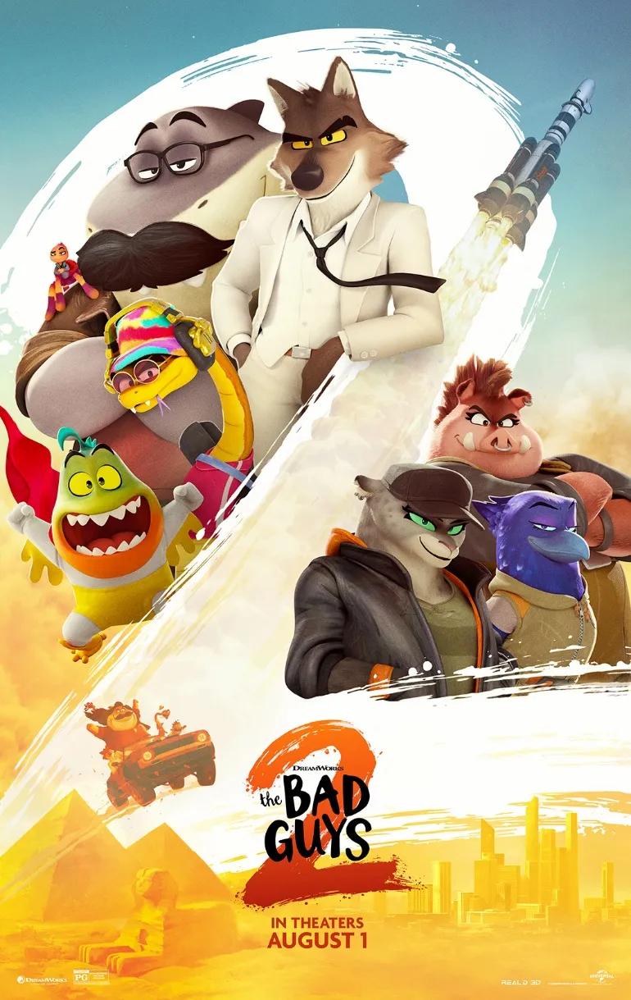
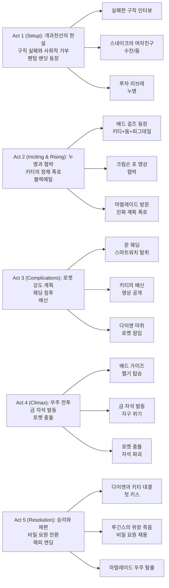

『The Bad Guys 2』는 "개과천선한 범죄자"라는 낙인이 얼마나 끈질기게 따라붙는지를, 그리고 **두 번째 기회를 얻어도 세상이 그것을 인정하지 않을 때** 사람은 어떻게 되는지를 다룬다. 이 영화의 핵심은 단순히 '또 한 번의 강도 작전'이 아니라, **사회가 전과자에게 부여하는 의심과, 그들이 그 의심을 깨기 위해 치러야 하는 대가**다.

전작의 스타일리시한 하이브리드 애니메이션을 더욱 강화하고, 캐릭터들 간의 관계를 확장하며, 우주까지 무대를 넓힌 속편이다. 비록 줄거리가 예측 가능하다는 비판이 있지만, 액션 시퀀스의 완성도와 캐릭터 애니메이션의 표현력, 그리고 전과자의 사회 복귀라는 무겁지 않지만 진지한 주제 의식이 작품을 지탱한다.

## 개요

### 영화 정보

* **제목**: The Bad Guys 2 / 배드 가이즈 2
* **감독**: Pierre Perifel (피에르 페리펠)
* **공동감독**: JP Sans (JP 산스)
* **각본**: Yoni Brenner (요니 브레너), Etan Cohen (이탄 코헨)
* **원작**: Aaron Blabey의 동명 아동 도서 시리즈
* **주연**: 
  * Sam Rockwell (미스터 울프 역)
  * Marc Maron (미스터 스네이크 역)
  * Awkwafina (미즈 타란튤라 / 웹스 역)
  * Craig Robinson (미스터 샤크 역)
  * Anthony Ramos (미스터 피라냐 역)
  * Zazie Beetz (다이앤 폭싱턴 역)
  * Danielle Brooks (키티 캣 역)
  * Natasha Lyonne (둠/수잔 역)
  * Maria Bakalova (피그테일 페트로바 역)
* **음악**: Daniel Pemberton (다니엘 펨버튼)
* **장르**: 애니메이션, 액션, 코미디, 강도
* **상영시간**: 104분
* **개봉일**: 2025.07.24 (아르헨티나), 2025.08.01 (미국)
* **제작사**: DreamWorks Animation (in partnership with Sony Pictures Imageworks)
* **배급사**: Universal Pictures (미국)
* **제작비**: 약 8천만 달러
* **박스오피스**: 약 2억 4천만 달러
* **평점**: Rotten Tomatoes 87% / Metacritic 64 / CinemaScore A

### 추천 대상

* **전작 팬**: 배드 가이즈 팀의 케미스트리가 더욱 심화되고, 울프와 다이앤의 로맨스가 본격화된다.
* **하이브리드 애니메이션 애호가**: 2D와 3D를 혼합한 스타일리시한 영상미가 전작보다 더욱 발전했다.
* **전과자의 사회 복귀 주제에 관심 있는 관객**: 가족 애니메이션 형식으로 재범과 사회적 편견이라는 무거운 주제를 다룬다.

## 구조 분석

## 영화의 전체 내용 (스포일러 포함)

『The Bad Guys 2』의 서사는 "착하게 살려 해도 세상이 믿지 않는다"는 전과자의 딜레마를, **새로운 범죄 조직과의 대결**과 **울프-다이앤 로맨스**의 두 축으로 전개한다. 영화는 개과천선이 단순히 '내가 변하는 것'이 아니라 **'남들이 나를 다르게 보도록 만드는 것'**임을 반복적으로 강조한다.

### Act 1 (Setup): 개과천선의 현실

**[S01] 5년 전 카이로 - 웹스의 첫 강도**: 영화는 5년 전, 웹스(타란튤라)가 배드 가이즈 팀에 합류한 첫 강도 작전을 회상 장면으로 시작한다. 카이로의 부호 솔리만으로부터 그들의 상징적인 자동차를 훔치는 화려한 액션 시퀀스다.

**[S02] 현재 - 출소 후의 삶**: 마멀레이드 교수를 물리치고 출소한 배드 가이즈는 개과천선을 선언했지만, 사회는 그들을 받아들이지 않는다. 울프, 샤크, 피라냐, 타란튤라는 구직에 실패하고, 스네이크는 자주 집을 비운다.

**[S03] 울프와 다이앤, 가까워지지만**: 울프는 주지사 다이앤 폭싱턴과 가까워지지만, 그의 전과자 신분과 다이앤의 공적 지위 때문에 관계를 발전시키지 못한다.

**[S04] 팬텀 밴딧 등장**: 새로운 범죄자 '팬텀 밴딧(유령 강도)'이 나타나 완벽한 범죄를 반복한다. 다이앤의 제안으로, 울프는 경찰국장으로 승진한 루긴스를 도와 팬텀 밴딧을 추적하기 시작한다.

**[S05] 스네이크가 용의자?**: 증거들이 스네이크를 팬텀 밴딧으로 지목한다. 울프는 친구를 의심하지만, 곧 스네이크가 새 여자친구 수잔(까마귀)과 함께 있었음을 알게 된다.

**[S06] 루차 리브레 토너먼트 - 함정**: 배드 가이즈는 루차 리브레(멕시코 레슬링) 경기장에서 팬텀 밴딧을 노출시키려 하지만, 야생 멧돼지가 그들을 팬텀 밴딧으로 몰아가며 누명을 씌운다.

**[S07] 탈출과 다이앤에게 전화**: 배드 가이즈는 간신히 탈출하고, 울프는 다이앤에게 전화해 무죄를 주장한다. 다이앤은 그들을 믿고 도와주기로 한다.

### Act 2 (Inciting & Rising): 누명과 협박

**[S08] 수잔의 납치 - 정체 폭로**: 수잔이 배드 가이즈를 납치한다. 그녀의 진짜 이름은 둠이며, 눈표범 키티 캣과 멧돼지 피그테일 페트로바와 함께 일한다는 것이 밝혀진다.

**[S09] 키티 캣의 협박 - 크림슨 포 영상**: 키티는 다이앤이 과거 범죄자 '크림슨 포(진홍 발톱)'였다는 증거 영상을 가지고 있으며, 이를 공개하지 않는 조건으로 배드 가이즈에게 실험용 로켓 MOON-X를 훔칠 것을 강요한다.

**[S10] 마멀레이드 방문 - 진짜 계획**: 다이앤은 감옥에 수감된 마멀레이드 교수를 찾아간다. 마멀레이드는 키티가 국제 우주정거장을 이용해 맥거핀나이트(MacGuffinite)라는 희귀 금속으로 전 세계의 금을 자석처럼 끌어당겨 훔치려 한다고 폭로한다.

**[S11] 억지로 동의**: 배드 가이즈는 다이앤을 보호하기 위해 마지못해 키티의 계획에 협력하기로 한다.

### Act 3 (Complications): 로켓 강도 계획

**[S12] 문 웨딩 - 표적 결혼식**: 배드 가이즈는 로켓 소유주인 문(Moon) 씨의 결혼식에 잠입한다. 그의 스마트워치가 로켓 접근 권한을 가지고 있기 때문이다.

**[S13] 스마트워치 탈취 성공**: 팀은 협업을 통해 결혼식장의 혼란 속에서 스마트워치를 성공적으로 훔친다.

**[S14] 키티의 약속 - 플래시 드라이브**: 키티는 약속대로 크림슨 포 영상이 담긴 플래시 드라이브를 울프에게 준다.

**[S15] 배신 - 함정에 빠진 배드 가이즈**: 배드 가이즈는 키티를 배신하려 하지만, 오히려 키티가 그들을 함정에 가두고 크림슨 포 영상을 인터넷에 업로드한 뒤 경찰에 그들의 위치를 제보한다.

**[S16] 다이앤의 대결 - 마취당함**: 다이앤은 배드 걸즈가 로켓에 탑승하기 직전 그들과 대결하지만, 키티에게 마취총을 맞는다. 반쯤 의식을 잃은 상태로 간신히 로켓에 잠입한다.

**[S17] 루긴스의 신뢰 - 재체포와 협력**: 루긴스는 배드 가이즈를 재체포하지만, 그들을 믿는다고 말하며 헬기로 발사 중인 로켓에 탑승할 수 있도록 돕는다.

### Act 4 (Climax): 우주 전투

**[S18] 로켓 안 - 둠과 피그테일의 이탈**: 배드 가이즈가 로켓에 잠입했음을 알게 된 둠과 피그테일은 그들을 공격하기를 거부한다. 키티는 동료들을 위협하며 계획을 강행한다.

**[S19] 금 자석 발동 - 전 세계 위기**: 키티는 맥거핀나이트 자석을 가동시켜 지구의 모든 금을 끌어당긴다. 심지어 마멀레이드가 타고 있던 리무진까지 우주로 끌려 올라간다. 수백만 명의 목숨이 위협받는다.

**[S20] 울프의 작전 - 스마트워치 탈취**: 울프는 키티와 대결하며 스마트워치를 빼앗는다. 키티는 자석의 리모컨을 부숴버린다.

**[S21] 로켓 충돌 - 자석 파괴**: 울프는 스마트워치로 로켓을 조종해 자석에 충돌시켜 파괴한다. 훔쳐졌던 금들이 지구로 돌아간다.

**[S22 클라이맥스 - 키티의 공격과 다이앤의 반격**: 분노한 키티는 울프를 죽이려 하지만, 의식을 되찾은 다이앤이 키티를 격렬하게 공격하며 제압한다.

**[S23] 첫 키스**: 울프와 다이앤은 행복하게 재회하며 첫 키스를 나눈다.

### Act 5 (Resolution): 승리와 재편

**[S24] 우주정거장 추락**: 배드 가이즈는 추락하는 우주정거장에서 팀을 재집결시킨다.

**[S25] 착륙 후 - 체포와 선고**: 추락 후, 키티는 체포되고 둠과 피그테일은 사회봉사 명령을 받는다.

**[S26] 루긴스의 계획 - 위장 죽음**: 루긴스는 배드 가이즈와 다이앤의 죽음을 위장해, 그들을 비밀 요원으로 채용한다. 이제 그들은 정부를 위해 일할 수 있다.

**[S27 엔딩] 마멀레이드의 탈출**: 여전히 궤도에 남아있던 마멀레이드는 리무진을 우주선으로 변형시켜 고향 행성으로 날아간다. 속편의 여지를 남긴다.

## 캐릭터 분석

### 미스터 울프 / Mr. Wolf (Sam Rockwell)

**개요**: 배드 가이즈의 리더. 소매치기와 도주 운전 전문가. 개과천선 후 사회로부터 계속 거부당하지만, 다이앤의 영감으로 "사람들에게 이유를 주는" 방법을 찾으려 한다.

**성장 곡선**: 전작에서 '좋은 사람'이 되기로 결심했지만, 이번 작품에서는 **'좋은 사람이 되는 것'과 '좋은 사람으로 인정받는 것'의 간극**을 마주한다. 구직 실패, 사회적 낙인, 누명이라는 시련을 거치며, 결국 '증명'은 한 번으로 끝나지 않음을 깨닫는다.

**동기와 욕망**: 팀과 자신이 진정으로 받아들여지는 것. 다이앤과의 관계. 신뢰의 회복.

**갈등 구조**: 
- **외적 갈등**: 사회의 편견, 키티의 협박, 누명
- **내적 갈등**: 스네이크를 의심했던 죄책감, 다이앤을 위험에 빠뜨릴 수 있다는 두려움

**상징적 의미**: 전과자의 사회 복귀 과정. '좋은 의도'만으로는 충분하지 않으며, 지속적인 행동과 증명이 필요함을 보여준다.

### 키티 캣 / Kitty Kat (Danielle Brooks)

**개요**: 눈표범. 배드 걸즈의 리더이자 팬텀 밴딧의 정체. 전 세계 금을 훔치려는 야심 찬 범죄자.

**성장 곡선**: 완벽한 범죄자에서 → 배신당한 리더(둠과 피그테일이 이탈) → 광기에 빠진 악당 → 체포.

**동기와 욕망**: 전 세계의 금을 독점하는 것. 권력과 부.

**연기**: Danielle Brooks는 감독의 지시로 Christoph Waltz의 『Inglourious Basterds』 연기를 참고했다고 밝혔다. 이는 키티의 세련되고 위협적이면서도 카리스마 넘치는 악당 이미지를 만드는 데 기여했다.

**상징적 의미**: 배드 가이즈의 '과거'를 반영하는 거울. 키티는 배드 가이즈가 개과천선하지 않았다면 도달했을 모습을 보여준다.

### 다이앤 폭싱턴 / Diane Foxington (Zazie Beetz)

**개요**: 붉은 여우. 주지사이자 전직 범죄자 '크림슨 포'. 울프의 로맨틱한 관심사.

**성장 곡선**: 전작에서 이미 개과천선을 완료한 인물. 이번 작품에서는 **과거가 폭로되는 위기**를 마주하고, 그럼에도 불구하고 울프와 배드 가이즈를 돕기 위해 위험을 감수한다.

**동기와 욕망**: 울프를 보호하는 것. 자신의 과거를 받아들이고 공개적으로 맞서는 것.

**갈등 구조**: 공적 지위와 과거의 범죄 이력 사이의 긴장. 울프와의 관계를 공개할 수 없는 사회적 압박.

**상징적 의미**: 성공적인 사회 복귀의 모델. 하지만 그녀의 과거가 폭로될 때, '완벽한 재활'도 쉽게 무너질 수 있음을 보여준다.

### 미스터 스네이크 / Mr. Snake (Marc Maron)

**개요**: 울프의 절친이자 팀의 금고 전문가. 새 여자친구 수잔(둠)과 사귀고 있다.

**성장 곡선**: 전작에서는 변화를 가장 거부했던 인물. 이번 작품에서는 **사랑에 빠지며** 개인적인 행복을 찾지만, 여자친구가 적으로 밝혀지는 배신을 겪는다.

**갈등 구조**: 둠에 대한 사랑과 그녀의 배신 사이의 감정적 갈등.

**상징적 의미**: 신뢰와 배신의 아이러니. 가장 냉소적이었던 인물이 사랑으로 상처받는다.

### 둠 / Doom (Natasha Lyonne)

**개요**: 까마귀. 본명은 수잔. 배드 걸즈의 일원이자 스네이크의 여자친구.

**성장 곡선**: 스네이크의 여자친구 → 납치범 → 키티의 부하 → 반란 (키티의 계획 거부) → 사회봉사 선고.

**동기와 욕망**: 처음에는 키티를 따르지만, 수백만 명을 위험에 빠뜨리는 계획에는 반대한다. 도덕적 선이 남아있음을 보여준다.

**상징적 의미**: 회색 지대의 캐릭터. 범죄자이지만 대량 살상에는 반대하는, '나쁜 사람 중 덜 나쁜 사람'.

### 루긴스 경찰국장 / Commissioner Luggins (Alex Borstein)

**개요**: 전작의 경찰서장에서 경찰국장으로 승진. 배드 가이즈를 오랫동안 쫓아왔지만, 이제는 그들을 신뢰한다.

**성장 곡선**: 집착적 추격자 → 의심하는 협력자 → 신뢰하는 동맹 → 비밀 요원 채용자.

**상징적 의미**: 편견의 변화. 가장 배드 가이즈를 증오했던 사람이 그들을 가장 믿게 되는 아이러니.

## 영상미와 음악

### 시각 효과 / 촬영 / 미학

『The Bad Guys 2』는 하이브리드 애니메이션의 새로운 경지를 보여준다. 감독 Pierre Perifel은 2D 애니메이션 출신답게 영화 전체에 **"2D와 3D 사이를 오가는" 시각적 언어**를 구축했다. Aaron Blabey의 원작 도서 표지의 그래픽적 특성과 『Spider-Verse』의 영향을 받았다.

**주요 시각 기법**:
- **손으로 그린 모션 블러(hand-drawn motion blur)**: 액션 장면에서 속도감을 극대화
- **스타일화된 나무와 텍스처**: 현실적인 디테일을 제거하고 평면화된 미학으로 더 과감한 포즈와 움직임 가능
- **애니메 연구**: 팀은 일본 애니메를 연구해 시각 스타일을 더욱 강화했다
- **자동화된 워크플로우**: 전작에서 수작업으로 했던 의상 설정 등을 자동화해, 아티스트들이 더 대담한 스타일 선택에 집중할 수 있게 했다

**오프닝 카이로 시퀀스**: 영화의 오프닝인 카이로 추격 장면은 복잡한 군중, 리깅, 스턴트를 여러 부서가 조율해 완성한 작품이다. 밀도 높은 도시 환경에서의 액션을 시각적으로 명료하게 전달한다.

**루차 리브레 시퀀스**: 레슬링 경기장의 혼란을 슬릭한 편집과 매끄러운 카오스 컨트롤로 표현했다. 비평가들은 이 시퀀스를 액션 하이라이트로 꼽았다.

**우주 시퀀스**: 무중력 환경에서의 액션과 금 자석의 시각 효과는 영화의 스케일을 극대화한다.

### 음악: Daniel Pemberton

Daniel Pemberton이 전작에 이어 다시 작곡을 맡았다. 40개 트랙으로 구성된 사운드트랙은 오케스트라 스코어와 현대적인 힙합/팝 사운드를 혼합한다.

**주요 곡**:
- **"GOODLIFE"** (Rag'n'Bone Man ft. WizTheMc): 영화의 메인 테마. 긍정적이고 에너지 넘치는 곡으로, 배드 가이즈의 새로운 삶을 표현한다.
- **"Taking Everything"** (Busta Rhymes): 강도 작전의 긴박함과 야심을 담은 곡.

**스코어 특징**:
- 전작의 재즈/펑크 영향을 유지하면서도, 우주 배경에 맞춰 신디사이저와 전자음을 추가
- 각 캐릭터의 테마를 더욱 발전시켰다
- 액션 시퀀스에서 음악과 편집이 완벽히 싱크되어 리듬감을 극대화

## 종합 평가

### 최종 평점: ★★★★☆ (3.8/5.0)

**장점**:
- 전작보다 발전한 하이브리드 애니메이션의 시각적 완성도
- 전과자의 사회 복귀라는 무겁지만 중요한 주제를 가족 영화 형식으로 자연스럽게 녹여냄
- 캐릭터 간 케미스트리와 관계 발전 (특히 울프-다이앤)
- 카이로, 루차 리브레, 우주 등 다양한 배경의 액션 시퀀스가 흥미진진하다
- 목소리 연기진의 열정과 몰입도
- Daniel Pemberton의 세련된 스코어

**단점**:
- 줄거리가 다소 예측 가능하고, 후반부로 갈수록 복잡해지며 산만해진다
- 새로운 악당 캐릭터들(배드 걸즈)이 주인공들에 비해 캐릭터 개발이 부족하다
- 유머가 과도한 방귀 개그와 진부한 대중문화 참조에 의존하는 경향이 있다
- "더 열심히 일하면 존중받는다"는 결말의 메시지가 다소 단순하고 보수적이다

### 한 줄 평

"개과천선은 한 번으로 끝나지 않는다 - 믿음은 증명의 반복으로 만들어진다."

### 추천 작품

- 《The Bad Guys》(2022): 당연히 전작부터 봐야 한다. 캐릭터의 개과천선 과정을 이해할 수 있다.
- 《Spider-Man: Into the Spider-Verse》(2018): 하이브리드 애니메이션 스타일의 선구자. 시각적 영향을 확인할 수 있다.
- 《Ocean's Eleven》(2001): 강도 영화의 고전. 팀워크와 계획, 배신의 재미를 담고 있다.
- 《Zootopia》(2016): 편견과 고정관념을 다루는 또 다른 동물 주인공 애니메이션.

### 관람 전 체크리스트

- 사전 지식이 필요한가? **예** (전작을 보는 것을 강력히 추천. 캐릭터 관계와 개과천선 배경을 이해해야 한다)
- 어린이와 함께 볼 수 있는가? **추천** (전체 관람가. 일부 액션 장면이 있지만 폭력적이지 않다. CinemaScore A 등급)
- 특정 요소를 기대해도 되는가? **가능** (스타일리시한 액션, 캐릭터 케미스트리, 하이브리드 애니메이션, 경쾌한 음악)
- 쿠키 영상이 있는가? **예** (포스트 크레딧에 마멀레이드의 우주 탈출 장면)
- 속편 가능성은? **높음** (엔딩의 마멀레이드 장면이 속편의 여지를 남긴다)

## 결론

『The Bad Guys 2』는 전작의 "나쁜 사람도 좋은 사람이 될 수 있다"는 메시지에서 한 걸음 더 나아가, **"좋은 사람이 되어도 세상은 쉽게 믿지 않는다"**는 더 현실적이고 복잡한 질문을 던진다. 이는 단순히 도덕적 변화의 문제가 아니라, 사회적 낙인과 구조적 편견의 문제다.

영화는 가족 애니메이션의 틀 안에서 재범률, 전과자 고용 차별, 사회적 재통합이라는 무거운 주제를 다루면서도, 유머와 액션, 로맨스로 균형을 맞춘다. 비록 줄거리가 예측 가능하고 악당 캐릭터가 덜 발전되었다는 비판이 있지만, 시각적 완성도와 캐릭터의 매력, 그리고 주제 의식의 진정성이 이를 상쇄한다.

무엇보다, 이 영화는 **신뢰는 한 번에 얻어지지 않으며, 지속적인 행동으로 증명해야 한다**는 것을 보여준다. 배드 가이즈는 세상을 또 한 번 구했지만, 그들의 '죽음'을 위장해야만 새로운 삶을 시작할 수 있었다. 이는 희망적이면서도 씁쓸한 결말이다. 진정한 두 번째 기회는, 때로는 첫 번째 정체성을 완전히 지워야만 가능하다는 것을.

DreamWorks Animation은 이 속편으로 액션, 유머, 스타일, 그리고 의미 있는 메시지를 성공적으로 결합했다. 가족 관객은 물론, 애니메이션 기술과 사회적 주제에 관심 있는 성인 관객 모두에게 추천할 만한 작품이다.

## 참고 문헌 및 출처

- [The Bad Guys 2 — Wikipedia](https://en.wikipedia.org/wiki/The_Bad_Guys_2)
- [The Bad Guys 2 — Rotten Tomatoes](https://www.rottentomatoes.com/m/the_bad_guys_2)
- [The Bad Guys 2 — Metacritic](https://www.metacritic.com/movie/the-bad-guys-2/)
- [The Bad Guys 2 Review — IGN](https://www.ign.com/articles/the-bad-guys-2-review)
- [The Bad Guys 2 Review — The Guardian](https://www.theguardian.com/film/2025/jul/25/the-bad-guys-2-review-gang-of-cuddly-animal-criminals-get-pulled-back-in-for-one-last-heist)
- [Danielle Brooks on channeling Tarantino for The Bad Guys 2 — Entertainment Weekly](https://ew.com/comic-con-preview-movie-the-bad-guys-2-bad-girls-11765859)
- [How The Bad Guys 2 approached stylization — Before & Afters](https://beforesandafters.com/2025/11/18/how-the-bad-guys-2-filmmakers-approached-stylization-and-combining-2d-and-3d-fx/)
- [Living Between 2D And 3D: The Bad Guys 2 — Cartoon Brew](https://www.cartoonbrew.com/feature-film/the-bad-guys-2-matt-baer-ben-willis-249562.html)