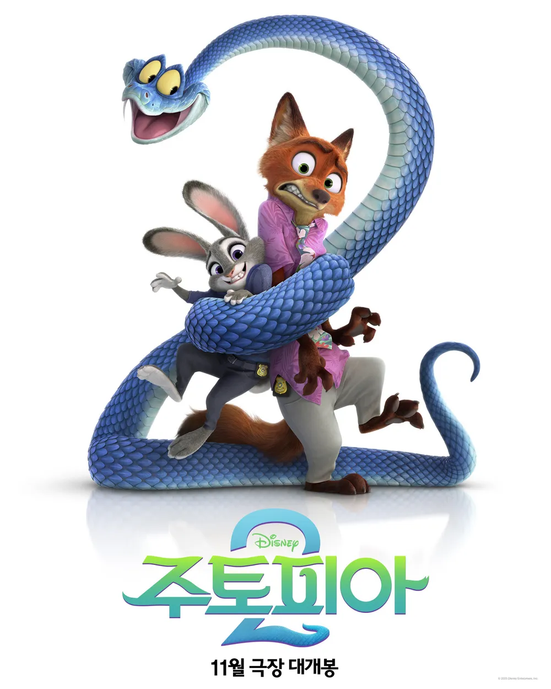
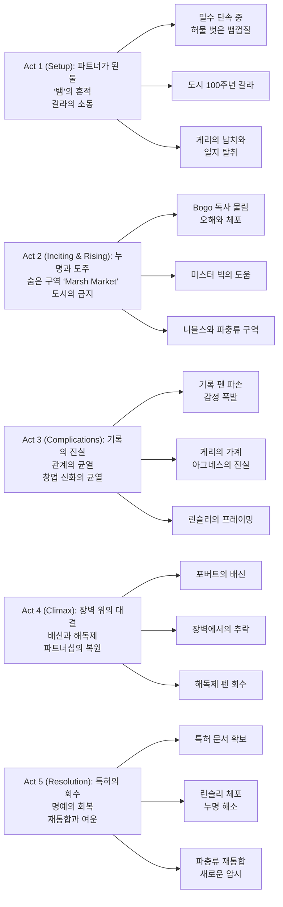

『Zootopia 2』는 전편의 “편견의 작동 방식”을 **도시의 역사**로 확장한다. 파트너가 된 주디와 닉이 쫓는 사건은 ‘뱀’ 게리의 등장으로 시작되지만, 곧 도시를 지탱해 온 **금지와 배제의 시스템**(날씨 장벽, 건국 신화, 평판 정치)으로 연결된다.

속편의 장점은 “새로운 종(파충류)”을 단순한 신선함으로 쓰지 않고, 주토피아가 어떤 방식으로 ‘규칙’을 만들고 ‘예외’를 생산해왔는지 추적하는 데 있다. 수사는 더 커지고, 버디 케미는 더 날카로워지고, 결론은 더 불편해진다.

## 개요

### 영화 정보

* **제목**: Zootopia 2 / 주토피아 2
* **감독**: Jared Bush, Byron Howard
* **각본**: Jared Bush
* **프로듀서**: Yvett Merino
* **주연(목소리)**: Ginnifer Goodwin, Jason Bateman, Ke Huy Quan, Fortune Feimster, Andy Samberg, Idris Elba, Shakira, Quinta Brunson 외
* **음악**: Michael Giacchino
* **장르**: Adventure, Animation, Comedy (버디 수사극)
* **상영시간**: 108분 (1h 48min)
* **개봉일**: 2025.11.26 (미국)
* **제작사**: Walt Disney Animation Studios
* **배급사**: Walt Disney Studios Motion Pictures
* **평점(참고)**: Rotten Tomatoes 91% / Metacritic 73 / CinemaScore A

### 추천 대상

* **전편 팬**: “누구나 무엇이든 될 수 있다”를 도시의 역사·제도로 확장한 후속 질문이 궁금하다면
* **버디 수사극 취향**: 파트너십의 균열과 복원이 수사와 정확히 맞물리는 구조를 좋아한다면
* **사회적 은유가 있는 애니메이션**: ‘금지된 종’이 만들어지는 논리와 책임을 이야기로 확인하고 싶다면

## 구조 분석

## 영화의 전체 내용 (스포일러 포함)

이야기는 “사건 해결”이 아니라 “도시가 숨긴 이유”로 수렴한다. 전편이 편견의 **현재형(여론·정치·제도)**을 보여줬다면, 이 속편은 그 편견이 **과거형(기원·기록·소유권)**에서 어떻게 설계되었는지를 파헤친다. 즉, 범인을 잡는 수사극이면서 동시에 “누가 도시의 규칙을 썼는가”를 묻는 역사 추적극이다.

### Act 1 (Setup): 파트너가 된 둘, 그리고 ‘뱀’의 흔적

**[S01] 파트너 1주차**: ZPD에서 공식 파트너가 된 주디와 닉은 호흡이 맞지 않는다. 닉은 즉흥적으로, 주디는 규정과 절차를 우선하며 충돌한다. 보고 서장은 둘이 합을 맞추지 못하면 분리하겠다고 경고한다.

**[S02] 밀수단 급습**: 단속 과정에서 주디는 ‘허물 벗은 뱀껍질’ 조각을 발견한다. 도시에 ‘뱀’이 존재한다는 가능성은 즉시 조롱거리로 취급된다. “뱀은 오래전부터 주토피아에 없다”는 통념이 더 강하다.

**[S03] 단서의 방향**: 주디는 뱀껍질과 사건 현장의 연결고리를 잡아 ‘도시 100주년’ 갈라를 의심한다. 닉은 지나친 비약이라 보지만, 주디는 “믿음은 증거로 만든다”며 밀어붙인다.

**[S04] 주토피아 100주년 갈라**: 갈라의 주최는 창업자의 후손인 린슬리 가문. 주디는 막내 포버트 린슬리를 만나고, 닉은 수상한 후드 인물을 포착한다. 분위기는 축제지만, ‘평판’이 모든 것을 지배하는 공간이다.

**[S05] 게리 드러나다**: 후드 인물은 독사 ‘게리 데스네이크’. 소동 속에서 게리는 린슬리 가문의 수장 밀턴을 인질로 삼아, 날씨 장벽 관련 과거 기록이 담긴 오래된 일지를 빼앗는다.

**[S06] 코너링과 설득**: 주디가 게리를 몰아붙이지만, 게리는 “뱀이 나쁜 동물이라는 전제 자체가 문제”라고 말하며 일지의 의미를 암시한다. 주디는 그 말에 흔들린다. 바로 이 ‘잠깐의 망설임’이 다음 프레이밍의 재료가 된다.

**[S07] 누명의 씨앗**: 밀턴은 일지를 없애고 게리를 처단하라 요구한다. 주디와 닉이 거부하자, 밀턴은 둘이 게리를 도왔다며 즉시 여론을 돌린다. 게리는 도망치다 보고 서장을 물고, 현장은 ‘둘이 저질렀다’는 쪽으로 기울어버린다.

**[S08] 탈출**: 주디와 닉은 체포 직전 일지를 들고 탈출한다. 게리는 정체불명의 오토바이 라이더에게 붙잡혀 사라진다. “증거(일지)”는 손에 쥐었지만, “공식성(신분)”을 잃는다.

### Act 2 (Inciting & Rising): 누명과 도주, 그리고 숨은 도시

**[S09] 도망자 신세**: 둘은 도시에 쫓기는 신세가 된다. 닉은 주디에게 “도시는 진실보다 이야기(서사)를 믿는다”고 말한다. 주디는 “그래도 기록이 있다”고 버틴다.

**[S10] 미스터 빅의 은혜**: 도주 중 미스터 빅과 프루프루가 둘을 숨겨준다. 전편에서의 관계가 여기서 ‘비공식 안전망’으로 작동한다. 주디는 처음으로 ‘제도 밖 도움’이 불가피함을 인정한다.

**[S11] 니블스 등장**: 둘은 파충류에 집착하는 팟캐스터 비버, 니블스 메이플스틱을 소개받는다. 그는 “도시에는 지도 밖 구역이 있다”는 음모론을 확신처럼 말하고, 그 확신은 실제 안내로 이어진다.

**[S12] Marsh Market**: 니블스가 안내한 곳은 파충류들이 숨어 사는 시장. 도시의 공식 홍보물에는 존재하지 않는 ‘공백’이다. 여기서 영화는 주토피아의 세계관을 한 번 더 확장하며, 동시에 “보이지 않게 만드는 방식”을 보여준다.

**[S13] 바실리스크 ‘헤수스’**: 숨은 공동체의 리더 헤수스는 파충류 구역이 툰드라타운 건설 과정에서 매몰되었고, 금지의 역사가 장벽처럼 덮였다고 말한다. 금지는 단지 법이 아니라 도시 개발과도 결합되어 있음을 드러낸다.

**[S14] 일지 탈취와 수로**: 게리가 나타나 일지를 되찾아 도주한다. 주디와 닉은 수로를 통해 추격하지만 실패한다. “증거”는 계속 손에서 미끄러진다.

**[S15] 산길과 오두막**: 둘은 단서를 따라 외곽의 버려진 오두막으로 향한다. 추위와 고립은 감정선을 증폭시킨다. 닉은 “우린 팀이 아니야”라고 말하고, 주디는 “팀이 되려고 노력 중이야”라고 받아친다.

### Act 3 (Complications): 기록의 진실, 관계의 균열

**[S16] 기록 펜의 파손**: 말다툼 끝에 둘이 공용으로 쓰던 녹음 펜이 부러진다. 전편에서 ‘결정적 증거’였던 펜이, 이번에는 ‘관계의 균열’로 깨진다. 주디는 펜을 사건보다 더 소중하게 여긴 자신을 깨닫고 복잡해진다.

**[S17] 오두막의 흔적**: 주디는 오두막에서 파충류가 과거 주토피아에서 평화롭게 살았던 증거를 발견한다. “원래부터 위험했다”는 통념이 무너진다. 도시가 만든 인식의 틀이 드러난다.

**[S18] ZPD의 체포**: 쫓아온 ZPD가 닉을 체포한다. 주디는 선택을 강요받는다. 이때 게리와 오토바이 라이더가 주디를 구출한다.

**[S19] 라이더의 정체**: 라이더는 포버트 린슬리. 그는 “가문이 숨기는 것을 더는 못 보겠다”며 주디 편에 선다. 하지만 그의 동기는 ‘정의’와 ‘인정 욕구’가 겹쳐 있어 불안하다.

**[S20] 아그네스의 진실**: 게리는 자신들의 조상 아그네스가 주토피아의 ‘진짜 창업자’였고, 현재의 창업자 에베니저가 공적을 훔쳤다고 말한다. 파충류 금지는 단지 공포가 아니라, **소유권(특허)과 명예**를 둘러싼 정치적 프레이밍의 결과였다.

**[S21] 프레임의 기술**: 과거에는 하녀 살해 누명을 씌워 아그네스를 몰아냈고, 현재에는 주디·닉에게 누명을 씌워 사건을 덮는다. 영화는 “프레이밍은 시대를 바꿔도 같은 논리로 반복된다”는 점을 강조한다.

**[S22 미드포인트] ‘도시의 문서’가 바뀌면 세계가 바뀐다**: 세 사람은 날씨 장벽의 원 특허가 아그네스의 집에 숨겨져 있다고 추정한다. ‘사건 해결’의 목표가 ‘기록 회수’로 전환되는 지점이다.

**[S23] 닉의 탈옥**: 니블스의 도움으로 닉이 감옥에서 탈출한다. 닉은 “주디가 혼자 남겨지는 건 싫다”며 되돌아온다. 이번에는 닉이 주디를 선택한다.

### Act 4 (Climax): 장벽 위의 대결, 배신과 해독제

**[S24] 장벽으로 집결**: 주디·게리·포버트는 장벽 근처의 오래된 시계탑을 작동시켜 묻힌 파충류 구역의 위치를 확정한다. 닉과 니블스도 합류한다.

**[S25] 포버트의 배신**: 포버트는 특허를 불태워 가문의 인정을 얻겠다고 돌변한다. “가문의 죄를 폭로해도, 결국 나는 가문이 필요하다”는 모순이 폭발한다. 그는 주디에게 독을 주입하고, 치료용 해독제 펜을 빼앗는다.

**[S26] 절벽 위 싸움**: 닉은 포버트를 막기 위해 장벽 위로 뛰어든다. 추격과 몸싸움은 물리적 위험을 ‘파트너십의 시험’으로 기능하게 한다.

**[S27 클라이맥스] 해독제 펜의 릴레이**: 닉이 해독제 펜을 되찾아 게리에게 던지고, 게리가 주디를 치료한다. 닉과 포버트는 장벽 아래로 추락한다. 주디는 닉을 구한다.

**[S28] ‘솔직함’이라는 복원**: 둘은 추락 직후 감정적으로 터진다. 영화는 파트너십의 핵심을 “능력”이 아니라 “취약함을 공유하는 솔직함”으로 잡는다. 주디와 닉은 서로의 불안과 방어를 인정하며 화해한다.

**[S29] 린슬리 본가의 붕괴**: 살아남은 포버트가 본가로 돌아가 계획을 알리지만, 일행이 뒤따라와 린슬리의 범죄를 폭로한다. 시장 윈댄서의 도움으로 가문은 무너진다.

### Act 5 (Resolution): 특허의 회수, 도시의 재통합

**[S30] 아그네스의 집**: 일행은 아그네스의 집에서 원 특허 문서를 찾아낸다. 문서는 단지 종이 한 장이 아니라, “누가 도시를 설계했는가”를 바꾸는 스위치다.

**[S31] 마지막 발악**: 포버트가 특허를 파괴하려 하지만 실패하고 제압된다. 영화는 배신자를 ‘완전히 악’으로만 두지 않고, 그가 왜 그런 선택을 했는지(가문의 인정·열등감)를 남긴 채 정리한다.

**[S32] 누명 해소**: 린슬리 가문이 체포되고, 주디와 닉은 모든 혐의에서 벗어난다. 보고 서장도 회복한다. “제도가 진실을 인정하는 순간”이지만, 그 순간은 개인들의 위험한 선택 위에 간신히 세워진다.

**[S33] 재통합**: 파충류들이 도시로 돌아온다. 게리는 가족과 재회하고, 아그네스는 진짜 창업자로 공인된다. ‘공존’은 슬로건이 아니라 “기록을 되찾는 과정”으로 구현된다.

**[S34] 파트너의 선물**: 닉은 수리된 녹음 펜을 주디에게 건넨다. 전편의 “증거의 펜”이, 이번에는 “관계의 펜”으로 다시 태어난다.

**[S35] 여운(새로운 그림자)**: 주디는 닉이 “사랑한다”고 말한 녹음을 재생한다. 이후 창밖으로 그림자가 지나가고 매의 깃털이 떨어진다. 다음 이야기를 암시하는, ‘도시 밖 위협(혹은 확장)’의 시드다.

### 쿠키 영상

**[S36] 포스트 크레딧 - 깃털**: 주디의 창가에 남은 매의 깃털이 ‘새’ 중심의 다음 미스터리를 암시한다.

## 캐릭터 분석

### 주디 홉스 / Judy Hopps (Ginnifer Goodwin)

**개요**: 전편의 주디가 “편견을 뚫고 들어간 최초”였다면, 속편의 주디는 “제도 바깥으로 밀려난 최초”다. ‘정당한 수사’가 순식간에 ‘도움 준 공범’으로 뒤집히는 경험은, 정의감이 제도에 의해 어떻게 소모되는지 보여준다.

**성장 곡선**: 규정과 증거에 대한 집착 → 누명으로 인한 제도 불신 → 기록(문서)의 정치성 이해 → 파트너십의 솔직함 회복 → 도시의 역사 수정에 참여.

### 닉 와일드 / Nick Wilde (Jason Bateman)

**개요**: 닉은 전편에서 “체념을 유머로 위장”했다면, 속편에서는 “두려움을 솔직함으로 교환”한다. 주디가 흔들릴 때 닉은 더 이상 뒷걸음치지 않고, ‘팀’의 자리를 선택한다.

**핵심 기능**: 닉은 도시가 믿는 서사(평판)와, 개인이 쌓는 신뢰(관계)의 차이를 끝까지 보여준다. 해독제 펜을 던지는 순간은 ‘살아남는 기술’이 ‘살려내는 선택’으로 전환되는 장면이다.

### 게리 데스네이크 / Gary De’Snake (Ke Huy Quan)

**개요**: 게리는 사건의 중심이면서도, 사실상 “도시가 숨긴 역사”의 증거다. 악역이 아니라, 악역으로 규정되어 온 종(種)의 대표이며, 영화의 질문을 한 문장으로 요약한다. “뱀은 왜 ‘없어야 했는가’?”

**상징**: 금지된 존재가 스스로의 자리를 되찾는 과정. ‘공포의 대상’에서 ‘기록의 주체’로 이동한다.

### 포버트 린슬리 / Pawbert Lynxley (Andy Samberg)

**개요**: 포버트는 ‘정의의 협력자’처럼 등장하지만, 결국 가문의 인정을 택한다. 그의 배신은 단지 반전이 아니라, “특권이 스스로를 지키는 방식”을 보여주는 장치다.

## 영상미와 음악

### 시각 효과 / 미학

주토피아의 미학은 “구역의 차이”로 메시지를 만든다. 속편은 그 구역을 **‘지도에 없는 곳’**까지 확장하며, 도시가 외부를 배제하는 방식(은폐·매립·개발)을 공간으로 구현한다. Marsh Market의 습지 톤은 ‘숨음’을, 날씨 장벽의 스케일은 ‘분리’를 시각화한다.

### 음악: Michael Giacchino & 주제가 “Zoo”

Giacchino의 스코어는 전편의 활기를 유지하면서도, “도시의 과거”를 파고드는 장면에서는 더 무겁고 서늘한 톤으로 전환된다. 샤키라의 신곡 “Zoo”는 전편의 “Try Everything”처럼 ‘도시의 에너지’를 대표하는 팝 트랙으로 기능하며, 속편의 리듬을 상업적 쇼맨십으로 고정한다.

## 종합 평가

### 최종 평점: ★★★★☆ (4.2/5.0)

**장점**:
* ‘편견’을 현재의 태도에서 과거의 기록·소유권으로 확장한 서사 설계
* 파트너십의 위기를 액션과 수사 진행에 정확히 결합
* “지도 밖 주토피아”를 보여주며 세계관을 물리적으로 확장

**단점**:
* 전편과 유사한 ‘프레이밍-도주-진실 폭로’ 리듬이 반복처럼 느껴질 수 있음
* 설정과 인물 수가 많아 일부 관객에게는 사건이 과밀하게 느껴질 수 있음

### 한 줄 평

“도시는 공존을 말하지만, 공존의 조건은 늘 ‘누가 기록을 갖는가’로 결정된다.”

### 관람 전 체크리스트

* 사전 지식이 필요한가? **부분적으로** (전편을 보면 파트너십의 변화가 더 선명해진다)
* 어린이와 함께 볼 수 있는가? **가능(PG)** (추격/위협 장면은 있으나 가족 관객 기준으로 설계)
* 쿠키 영상이 있는가? **있음(여운/암시)** (깃털로 다음 미스터리를 남긴다)
* 속편 가능성은? **높음** (엔딩 암시가 명확하다)

## 참고 문헌 및 출처

* [Zootopia 2 — Disney Movies](https://movies.disney.com/zootopia-2)
* [Zootopia 2 — Wikipedia](https://en.wikipedia.org/wiki/Zootopia_2)
* [New 'Zootopia 2' Trailer Teases “Zoo” By Shakira, Ed Sheeran — Deadline](https://deadline.com/2025/09/zootopia-2-trailer-disney-1236405913/)
* [OUT NOW! ZOOTOPIA 2 ORIGINAL SOUNDTRACK — Universal Music Canada](https://www.universalmusic.ca/press-releases/out-now-zootopia-2-original-soundtrack-featuring-grammy-award-winning-artist-shakira-and-academy-award-winning-composer-michael-giacchino/)
* [Korea Box Office: ‘Zootopia 2’ Commands Nearly 80% of Market on Debut — Variety](https://variety.com/2025/film/box-office/korea-box-office-zootopia-2-1236596091/)

