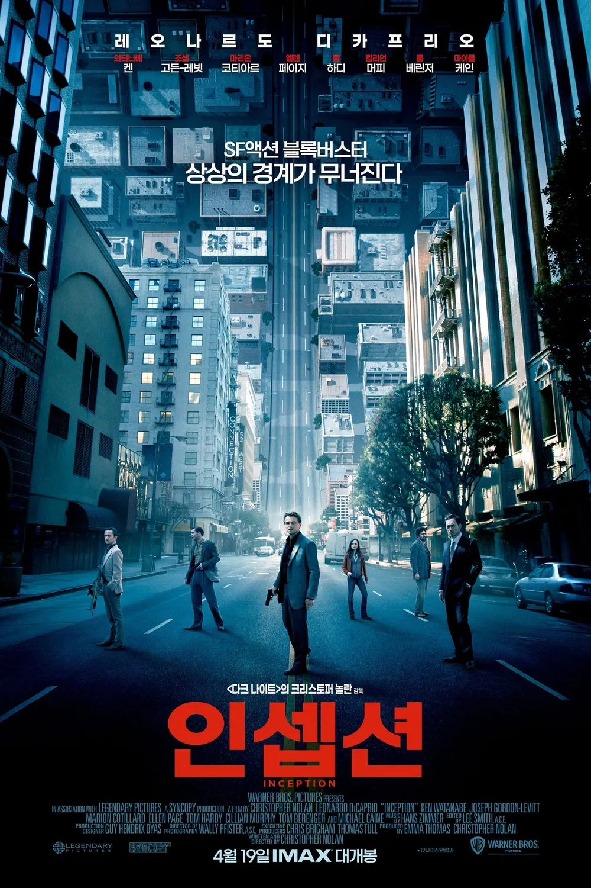
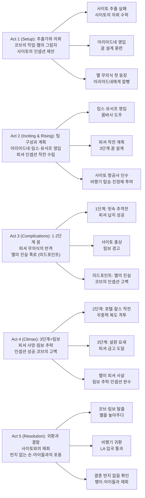

『인셉션』은 "당신의 마음이 범죄 현장이다(Your Mind Is the Scene of the Crime)"라는 태그라인 하나로 관객을 사로잡는다. 크리스토퍼 놀란이 무려 10년에 걸쳐 완성한 이 각본은, 꿈속의 꿈을 파고들며 인간의 무의식과 현실의 경계를 묻는다. 레오나르도 디카프리오가 연기한 추출가 코브는 아내를 잃은 죄책감을 안고, 생각을 훔치는 게 아니라 심어야 하는 불가능한 임무—인셉션—에 뛰어든다. 148분 내내 꿈의 층위가 쌓이고 시간이 20배씩 늘어나는 가운데, 팽이 하나와 반지 하나가 현실과 꿈의 유일한 나침반이 된다.

## 개요

### 영화 정보

* **제목**: Inception / 인셉션
* **감독**: Christopher Nolan (크리스토퍼 놀란)
* **각본**: Christopher Nolan (크리스토퍼 놀란)
* **제작**: Christopher Nolan, Emma Thomas
* **주연**:
  * Leonardo DiCaprio (돔 코브 역)
  * Ken Watanabe (사이토 역)
  * Joseph Gordon-Levitt (아서 역)
  * Marion Cotillard (맬 역)
  * Elliot Page (아리아드네 역)
  * Tom Hardy (임스 역)
  * Cillian Murphy (로버트 피셔 역)
  * Tom Berenger (피터 브라우닝 역)
  * Michael Caine (스티븐 마일즈 역)
  * Dileep Rao (유서프 역)
  * Pete Postlethwaite (모리스 피셔 역)
* **음악**: Hans Zimmer (한스 짐머)
* **촬영**: Wally Pfister (월리 피스터)
* **장르**: SF, 액션, 스릴러, 심리, 강도
* **상영시간**: 148분
* **개봉일**: 2010.07.16 (미국·영국), 2010.07.21 (한국)
* **제작사**: Legendary Pictures, Syncopy
* **배급사**: Warner Bros. Pictures
* **제작비**: 약 1억 6천만 달러
* **흥행**: 전세계 약 8억 3,900만 달러 / 한국 약 408만 관객
* **평점**: IMDb 8.8/10 (280만 명) / Metacritic 74 / Rotten Tomatoes 87%
* **수상**: 아카데미 4관왕 — 촬영상·음향편집상·음향믹싱상·시각효과상 (제83회)

### 추천 대상

* **복잡한 서사를 즐기는 관객**: 꿈이 3단계로 겹치고 시간 축이 동시에 교차 편집되는 구조를 따라가는 즐거움이 있다.
* **감정적 깊이를 원하는 관객**: 화려한 액션 뒤에 아내를 잃은 남자의 죄책감과 귀환 서사가 조용히 흐른다.
* **크리스토퍼 놀란 팬 또는 입문자**: 『메멘토』·『다크나이트』의 연장선으로, 놀란 필모그래피 중 가장 접근하기 쉬운 대작이다.

## 구조 분석

## 영화의 전체 내용 (스포일러 포함)

『인셉션』은 표면적으로 '꿈속의 꿈'을 파고드는 첩보·강도 영화지만, 그 핵심은 죄책감에 갇힌 한 남자가 진짜 현실로 돌아오는 여정이다. 코브는 자신이 아내 맬에게 인셉션을 했고 그것이 그녀의 죽음을 불렀다는 사실을 알면서도, 그 기억을 무의식 속에 봉인한 채 살아왔다. 영화는 그 봉인이 하나씩 열리는 과정을 3단계의 꿈과 림보라는 구조 안에 촘촘히 배치한다.

### Act 1 (Setup): 추출가와 의뢰

**[S01] 해변의 코브 — 영화의 첫 장면**: 만신창이가 된 남자가 해변에 쓰러져 있다. 일본인 경비원들이 그를 고성으로 데려가고, 노인이 된 일본인이 코브의 소지품 중 팽이를 집어들며 말한다. "이 팽이, 반쯤 잊혀진 꿈에서 본 적 있어." 이 장면은 영화 후반부 림보 장면과 연결되며, 전체 이야기의 액자 구조 역할을 한다.

**[S02] 사이토 추출 작전 — 꿈속의 꿈 실패**: 시점이 과거로 돌아간다. 코브는 아서, 내쉬와 함께 일본 기업가 사이토의 꿈에 침투해 기밀 추출을 시도한다. 그러나 코브의 무의식이 투영한 아내 맬이 갑자기 나타나 작업을 방해하고, 추출은 실패로 돌아간다. 꿈에서 깨어난 뒤 사이토를 인질로 잡으려 하지만, 사이토는 카펫의 재질 차이를 짚어내며 "꿈속의 꿈"을 역으로 간파한다.

**[S03] 사이토의 의뢰 — 인셉션 제안**: 오히려 코브의 실력에 감탄한 사이토는 코브 일행을 찾아내 역제안을 한다. 경쟁사 회장의 후계자 로버트 피셔의 머릿속에 "아버지의 제국을 스스로 해체하겠다"는 생각을 심어달라는 것. 성공하면 코브의 미국 수배를 풀어 집으로 돌아갈 수 있도록 해주겠다는 조건이다. 아서는 "코끼리를 생각하지 마"라며 불가능을 역설하지만, 코브는 과거에 한 번 해본 적이 있다며 수락한다.

**[S04] 아리아드네 영입 — 꿈 설계 훈련**: 코브는 장인 마일즈 교수를 찾아가 꿈 설계자를 소개받는다. 파리 건축과 대학원생 아리아드네는 순식간에 꿈 설계를 터득하지만, 코브의 무의식 투영체들에게 쫓기다 맬에게 칼빵을 맞고 꿈에서 깬다. 코브는 "한번 경험하면 그만두지 못한다"고 예언하고, 아리아드네는 곧 팀에 복귀한다.

**[S05] 임스·유서프 영입 — 몸바사 도주**: 코브는 케냐 몸바사에서 위조꾼 임스를 만나고, 코볼사의 킬러들에게 쫓기다 사이토의 도움으로 탈출한다. 이어서 강력한 진정제를 다루는 약제사 유서프를 합류시키며 팀이 완성된다. 임무 성공 여부를 직접 확인하겠다는 사이토도 꿈속으로 따라오기로 한다.

**[S06] 작전 수립 — 3단계 꿈 계획**: 아리아드네가 설계하는 3단계 꿈 구조가 확정된다. 1단계(유서프, 빗속 도시) → 2단계(아서, 호텔) → 3단계(임스, 설원 요새). 각 단계마다 아래 단계의 꿈꾸는 이들에게 음악으로 신호를 주고 동시에 추락("킥")하여 깨어나는 동기화 계획이 세워진다.

**[S07] 피셔 분석 — 작전의 씨앗**: 피셔의 아버지가 임종에 가깝다는 정보가 들어온다. 피셔와 아버지의 소원한 관계, 대부 브라우닝과의 복잡한 관계를 이용해 "아버지는 나에게 독립하길 원했다 → 회사를 분할해야 한다"는 생각으로 이어지는 감정적 논리를 심는 것이 핵심이다. 사이토가 혼자 항공사를 통째로 인수하여 피셔가 747 퍼스트 클래스에 탑승하도록 사전 준비를 마친다.

### Act 2 (Inciting & Rising): 팀 구성과 실행 개시

**[S08] 비행기 탑승 — 진정제 투여**: 피셔의 아버지가 사망하고, 피셔가 시드니에서 LA로 가는 항공편을 이용한다. 코브가 옆자리에 앉아 능청스럽게 피셔에게 진정제를 먹이는 데 성공한다. 팀은 전원 잠에 들며 공유 꿈에 진입한다.

**[S09] 1단계 꿈 진입 — 빗속의 도시**: 꿈의 주인 유서프가 이륙 전 공짜 샴페인을 너무 마신 탓에 원래 설계와 달리 도시 전체에 폭우가 쏟아진다. 피셔를 택시에서 납치하는 데 성공하지만, 피셔가 꿈 추출에 대비한 특수 훈련을 받은 터라 그의 무의식 속 무장 병사들이 코브 일행을 즉시 공격하기 시작한다.

**[S10] 사이토 총상 — 림보 경고**: 교전 중 사이토가 피셔의 무의식이 쏜 총알에 맞아 생명이 위독해진다. 임스가 "그냥 죽여서 깨우자"고 제안하지만, 코브는 유서프의 강력한 진정제 하에서는 꿈속에서 죽으면 깨어나는 게 아니라 '림보'—무의식의 끝없는 나락—로 떨어진다고 경고한다. 아서가 유서프에게 따지자 유서프는 코브가 자기 몫 전부를 준다고 해서 묵인했다고 털어놓는다. 이제 팀은 림보의 공포를 안고 임무를 강행할 수밖에 없다.

**[S11] 코브의 무의식 — 기차와 맬**: 코브의 무의식이 투영한 기차가 갑자기 도로 위에 나타나 차량을 박살낸다. 작전 초반부터 코브의 내면이 팀 전체를 위협하고 있음을 보여주는 장면이다.

### Act 3 (Complications): 꿈의 심연과 맬의 진실

**[S12] 찰스 작전 — 피셔를 낚다**: 2단계 꿈(아서의 꿈, 호텔)에 진입한 코브는 생각보다 강력한 피셔의 무의식 방어에 당황해 강경책 '찰스 작전'을 꺼낸다. 피셔에게 "당신은 지금 꿈을 꾸고 있고, 나는 당신의 무의식이 만들어낸 방어 요원 찰스"라고 직접 알리며 아군으로 포섭한다. 피셔는 대부 브라우닝이 회사를 빼앗으려는 음모를 꾸미고 있다는 거짓 정보를 믿게 된다.

**[S13] 무중력 복도 — 아서의 사투**: 1단계에서 유서프의 밴이 추격전 중 여러 번 굴러 충격이 전달되자, 2단계 호텔의 중력이 뒤틀리기 시작한다. 아서는 복도 안에서 투사체 2명과 싸우는 와중에 중력 방향이 계속 바뀌는 무중력 복도를 맨몸으로 헤쳐나간다. 이 장면은 100피트 길이의 복도를 실제로 회전시키는 실물 세트를 이용해 촬영한 것으로, 영화 최고의 스턴트 퍼포먼스로 꼽힌다.

**[S14] 미드포인트 — 맬의 진실이 폭로되다**: 아리아드네는 코브가 숨기고 있던 맬에 대한 진실을 캐낸다. 코브와 맬은 꿈의 최심층인 림보에서 약 50년을 함께 살았다. 현실로 돌아온 뒤 맬은 현실을 꿈으로 착각하기 시작했다. 코브는 맬을 림보에서 데려오기 위해 그녀의 토템(팽이)을 돌려 "이 세계는 가짜다"라는 생각을 심었다—그것이 코브 최초의 인셉션이었다. 문제는 그 믿음이 현실로 돌아온 뒤에도 사라지지 않았다는 것. 결국 맬은 "현실이라 착각하는 꿈에서 죽어야 탈출한다"며 자살했고, 코브에게 살인 누명까지 씌워놓았다. 코브가 아이들을 두고 미국을 떠난 이유가 여기 있었다.

**[S15] 1단계 브라우닝 조작 — 밑밥 깔기**: 임스가 브라우닝으로 변장해 "진짜 유언장이 있으니 회사를 쪼개라"는 거짓 정보를 흘리고, 피셔에게 임의의 숫자 "528491"을 비밀번호로 각인시킨다. 피셔가 아버지의 속뜻을 품고 있을 금고를 여는 번호라는 설정으로 2·3단계를 향한 떡밥이 깔린다.

### Act 4 (Climax): 설원 요새와 림보의 대결

**[S16] 3단계 꿈 — 눈 덮인 요새**: 임스의 꿈으로 진입한 3단계는 피셔의 무의식이 방어기제로 구축한 설원 속의 군사 요새다. 군인들이 경계를 서고 있어 팀은 치열한 전투를 벌이며 요새 안으로 침투해야 한다.

**[S17] 킥의 연쇄 실패 — 아서의 임기응변**: 1단계에서 유서프가 너무 일찍 밴을 난간에 들이받아 킥을 시도하지만, 타이밍이 맞지 않아 3단계 팀이 이를 놓친다. 밴이 다리에서 추락하며 공중에 떠 있는 10초가 2단계에서 약 3분, 3단계에서 약 1시간으로 증폭된다. 2단계는 밴의 낙하 영향으로 무중력 상태가 되어 아서는 폭발 낙하를 통한 인위적 킥을 새로 설계해야 한다.

**[S18] 피셔의 금고 — 맬의 등장**: 3단계에서 팀은 온갖 위기를 뚫고 피셔를 요새 심층의 금고 앞까지 데려간다. 그런데 코브가 머뭇거리는 순간 맬이 나타나 피셔에게 총을 쏜다. 피셔는 즉사하며 림보로 떨어지고 작전은 실패 직전에 처한다. 코브는 즉시 맬을 사살하지만 이미 늦었다.

**[S19] 림보로 강하 — 코브와 아리아드네**: 코브와 아리아드네는 피셔를 되살리기 위해 자진하여 림보로 진입한다. 한편 3단계에서 1단계 총상을 입고 버텨온 사이토가 결국 숨을 거두어 림보로 떨어진다.

**[S20] 림보의 집 — 코브의 고백**: 림보에서 코브와 아리아드네는 과거 코브와 맬이 50년을 보내며 직접 지은 건물들이 즐비한 도시에 도착한다. 코브는 그 집에서 맬의 투사체와 마주하며 아리아드네에게 충격적인 진실을 털어놓는다. 인셉션은 성공했지만 그 결과로 맬이 현실과 꿈을 혼동하게 됐고, 자신이 간접적으로 아내를 죽인 셈이라는 것. 죄책감이 맬의 형태로 무의식에 자리잡아 지금까지 임무마다 방해해왔다는 사실도 인정한다.

**[S21] 맬을 놓아주다 — 코브의 내면 치유**: 코브는 "무의식 속 맬은 진짜 맬이 아니라 내 죄책감의 그림자"임을 받아들이며 그녀를 내보내기로 한다. 맬의 투사체는 아리아드네가 쏜 총에 쓰러지고, 코브는 죽어가는 맬을 안은 채 "우리는 이미 함께 늙었다"고 속삭이며 이별을 고한다.

**[S22] 클라이맥스 — 피셔 소생 / 인셉션 완수**: 아리아드네가 피셔를 림보 건물에서 밀어 아래로 떨어뜨리면, 3단계에서 임스가 심장 마사지를 하며 대기한 덕에 피셔가 깨어난다. 되살아난 피셔는 요새 금고를 열고 그 안에서 아버지의 유언장과 함께 수제 바람개비(어린 시절 아버지와의 추억)를 발견한다. 임종의 아버지(피셔의 무의식이 만들어낸 투사체)는 "네가 나처럼 되려 했던 것이 실망스러웠다"며 홀로 일어서길 원했음을 고백한다. 피셔는 눈물을 흘리며 회사를 쪼개 독립하겠다는 결심을 굳힌다. 인셉션 성공.

**[S23] 동기화 킥 — 전원 귀환**: 한스 짐머의 음악(Non, je ne regrette rien의 저음 변주)이 울려 퍼지며 킥 타이밍이 온다. 3단계 폭발 → 2단계 엘리베이터 사출 → 1단계 밴이 강에 추락. 아리아드네를 포함한 팀원들이 차례로 1단계로, 이어 비행기 현실로 귀환한다. 코브만이 사이토를 찾기 위해 림보에 남는다.

### Act 5 (Resolution): 귀환과 결말

**[S24] 림보에서의 재회 — 늙은 사이토**: 림보를 헤매던 코브는 마침내 해변의 고성에서 완전히 늙어버린 사이토와 마주한다. 영화의 첫 장면이 바로 이 순간이었다. 사이토가 림보가 꿈임을 인식하지 못하고 수십 년을 실제 시간처럼 살았기 때문에 폭삭 늙어버린 반면, 현실임을 알고 있던 코브는 노화하지 않았다. 코브가 팽이를 꺼내 돌리며 "약속을 지키라고 설득할 셈인가?"라고 묻는 사이토에게 눈빛으로 답한다. 사이토가 총을 잡는 장면 이후 곧바로 비행기 장면으로 전환된다.

**[S25] 비행기 귀환 — 동료들의 눈빛**: 착륙 20분 전, 일행이 모두 잠에서 깬다. 팀원들이 서로 눈빛을 교환한다. 잠에서 깬 사이토는 어딘가에 전화를 건다. 코브는 그 모습을 조용히 바라본다.

**[S26] LA 입국 — 귀국 환영**: LA 공항에서 긴장된 표정으로 입국 심사를 받는 코브. 심사관이 여권에 도장을 찍으며 말한다. "귀국을 환영합니다, 코브 씨." 코브의 얼굴에 처음으로 안도의 빛이 흐른다.

**[S27] 집으로 — 팽이를 돌리다**: 마일즈 교수와 함께 집에 도착한 코브는 습관처럼 팽이를 꺼내 테이블 위에서 돌린다. 그리고 팽이가 쓰러지든 말든 확인도 하지 않고 정원으로 달려나간다.

**[S28 엔딩] 아이들과의 재회 — 해피엔딩 확정**: 마일즈 교수가 "누가 왔는지 보렴"이라고 부르자 아이들이 뒤를 돌아본다. 코브가 달려가 아이들을 안아든다. 카메라는 테이블 위에서 돌아가는 팽이를 비춘다. 팽이는 쓰러질 듯 흔들리다가... INCEPTION이라는 타이틀이 뜨며 영화가 끝난다.

---

### 결혼 반지: 놀란이 숨겨놓은 진짜 토템

영화는 팽이의 흔들림으로 끝나 수많은 관객에게 "꿈인가, 현실인가?"라는 논쟁을 남겼다. 그러나 놀란 감독이 팽이보다 훨씬 이른 시점부터 조용히 심어놓은 또 하나의 단서가 있다. 바로 **코브의 왼손 결혼 반지**다.

영화 전체를 다시 보면 패턴이 명확하다. **꿈속 장면에서 코브는 항상 결혼 반지를 끼고 있다.** 사이토 추출 작업, 1·2·3단계 꿈, 림보—모든 꿈 시퀀스에서 코브의 왼손 약지에는 반지가 있다. 반면 **현실 장면에서 코브는 맬이 죽은 이후 단 한 번도 반지를 끼지 않는다.** 아리아드네를 가르치는 장면, 몸바사에서의 도주 장면, 팽이를 돌릴 때—현실에서는 항상 맨손이다. 코브 본인도 모르는, 맬에 대한 죄책감이 무의식적으로 꿈속에서만 반지를 되살려내는 것이다.

**결정적 장면은 비행기에서 깨어난 이후다.** 자세히 보면 코브의 왼손에 반지가 없다. 더불어 입국 심사 장면에서 심사관의 왼손이 클로즈업되는데, 거기에는 결혼 반지가 있다. 코브의 손과 대비시키며 반지 없음을 눈치채도록 배려한 연출이다. LA에서 집으로 돌아와 팽이를 돌릴 때도, 아이들을 안을 때도 반지는 없다. **즉, 이 모든 귀환 장면은 현실이다.**

마이클 케인도 이를 뒷받침한다. 그는 인터뷰에서 "감독이 '당신이 등장하면 현실'이라고 알려줬다"고 밝혔다. 마일즈 교수는 꿈 장면에 한 번도 등장하지 않으며, 파리 대학교·귀가 장면 모두 현실이다. 아이들의 옷도 꿈속 기억에서와 다르고, 아이들 역할을 한 아역 배우도 크레딧에 두 쌍(어린 버전·성장한 버전)이 명시되어 있다. 코브가 오랫동안 집을 비운 사이 아이들이 자란 것이다.

결론적으로 팽이는 관객의 시선을 잡아두기 위한 장치이고, 결혼 반지가 놀란이 의도한 진짜 토템이다. **코브는 현실로 돌아왔고, 이 영화는 해피엔딩이다.**

## 캐릭터 분석

### 돔 코브 / Dom Cobb (Leonardo DiCaprio)

**개요**: 꿈속 기억 추출 전문가. 아내 맬의 죽음에 대한 죄책감으로 미국을 떠나 수배자 신세로 전 세계를 떠돌고 있다. 아이들에게 돌아가고 싶지만, 자신의 무의식이 모든 임무를 방해한다.

**성장 곡선**: 맬의 죽음을 '사고'로 억누르며 회피 → 아리아드네의 추궁으로 진실 직면 → 림보에서 자신이 심은 인셉션이 맬을 죽였음을 인정 → "이 맬은 진짜가 아니다"고 고백하며 내려놓음 → 아이들과의 재회.

**동기와 욕망**: 집으로 돌아가는 것, 즉 아이들의 얼굴을 보는 것. 그 욕망이 너무 강하기 때문에 꿈속에서도 아이들을 투영하면서 고통받는다.

**갈등 구조**: 외적 갈등은 인셉션 임무의 난이도이지만, 진짜 갈등은 내적—자신이 맬을 죽였다는 죄책감이 무의식에서 맬의 형태로 구현되어 임무를 방해한다. 토템으로 현실을 확인하면서도 정작 자신이 사용하는 토템이 맬의 것(맬의 팽이)이라는 아이러니가 있다.

**상징적 의미**: 무의식과 죄책감에 갇힌 현대인의 초상. 아무리 뛰어난 실력자라도 자신의 내면을 통제하지 못하면 모든 것을 잃는다는 메시지.

**디카프리오의 연기**: 화려한 액션 블록버스터 안에서도 내면의 상실감과 죄책감을 절제된 눈빛으로 표현한다. 림보에서 맬을 놓아주는 장면은 이 영화 최고의 감정 피크.

### 맬 / Mal (Marion Cotillard)

**개요**: 코브의 죽은 아내. 영화에서 맬은 두 가지 방식으로 존재한다. 하나는 코브의 기억 속 사랑스럽고 지적인 실제 맬, 다른 하나는 코브의 죄책감이 만들어낸 무의식 투영체—임무마다 나타나 작업을 방해하는 위험한 존재.

**성장 곡선**: 영화가 진행될수록 맬의 진실이 역순으로 밝혀진다. 처음에는 단순한 방해 요소처럼 보이다가, 이윽고 코브가 인셉션을 했던 피해자임이, 그리고 그것이 비극적 선택으로 이어졌음이 드러난다.

**동기와 욕망(실제 맬)**: 현실과 꿈을 혼동하는 상태에서 "코브와 함께 현실(=꿈이라고 믿는 공간)에서 탈출"하는 것. 코브가 따라오지 않자 법적·감정적 올가미를 만들어 강제하려 했다.

**상징적 의미**: 코브가 만든 인셉션이 가장 사랑하는 사람을 어떻게 파괴했는지를 보여주는 비극적 거울. 또한 무의식의 형태로 존재하는 맬은 코브의 자기 처벌 욕구를 상징한다.

**코티야르의 연기**: 놀란은 맬을 "팜므 파탈의 정수"라 표현했다. 코티야르는 사랑스럽고 치명적이며 비극적인 세 층위를 동시에 구현한다.

### 아리아드네 / Ariadne (Elliot Page)

**개요**: 마일즈 교수의 제자이자 꿈 설계자. 그리스 신화 속 테세우스를 미로에서 구한 공주의 이름처럼, 코브를 그의 내면 미로에서 구해내는 역할을 한다. 영화 내에서 관객의 시선을 대리하는 인물—관객과 함께 꿈의 규칙을 배우고, 코브의 비밀을 캐내며, 결정적 순간에 림보까지 동행한다.

**성장 곡선**: 호기심 많은 학생 → 꿈 세계에 매료 → 코브의 어둠에 직면 → 림보 동행 결정 → 맬의 투사체를 쏘고 코브의 치유를 돕는 적극적 역할자.

**상징적 의미**: 외부에서 코브의 무의식을 객관적으로 바라볼 수 있는 유일한 인물. 아리아드네가 없었다면 코브는 림보에서 사이토를 찾기 위해 떠나기 전에 자신의 트라우마를 정리하지 못했을 것이다.

### 사이토 / Saito (Ken Watanabe)

**개요**: 코브에게 인셉션 임무를 의뢰한 일본 기업가. 단순한 의뢰인으로 머물지 않고 꿈속에 직접 따라 들어온다. 3단계에서 총상을 버티며 피셔를 지키다 사망해 림보로 떨어지고, 림보에서 수십 년을 보내며 노인이 된다.

**성장 곡선**: 냉철한 의뢰인 → 위험 속에서도 약속을 재확인 → 림보에서 현실을 잃고 노화 → 코브의 팽이와 눈빛에 의해 각성.

**상징적 의미**: 림보가 현실이라 믿어 늙어버린 사이토는, 맬의 비극을 변형 반복한다. 코브가 맬에게 해준 것을 이번에는 코브가 사이토에게 해주어 돌아오게 만든다.

### 아서 / Arthur (Joseph Gordon-Levitt)

**개요**: 코브의 파트너로 임무 리서치와 관리를 담당. 현실적이고 냉정하며, 코브의 감정적 위험 요소를 가장 예민하게 경계한다.

**성장 곡선**: 호텔(2단계 꿈)에 혼자 남아 무중력 복도에서 킥을 준비하는 과정이 이 캐릭터의 하이라이트. 즉흥적 상황에서 엘리베이터를 폭파시켜 새로운 킥을 만들어내는 전문성을 발휘한다.

**상징적 의미**: 팀의 신뢰와 전문성의 근거. 코브가 감정으로 흔들릴 때 냉정하게 실행을 지탱한다.

### 임스 / Eames (Tom Hardy)

**개요**: 꿈속에서 타인으로 변신하는 위조꾼. 예리한 독설과 유머로 팀의 긴장을 풀어주는 역할도 한다.

**성장 곡선**: 브라우닝으로 변장해 피셔에게 밑밥을 깔고, 3단계 설원에서 적군과 교전하며 피셔에게 심장 마사지를 시행해 림보 탈출 신호를 보낸다.

**상징적 의미**: 꿈이라는 매체를 가장 자유롭게 다루는 인물. "이 미션엔 관광객 자리는 없다"고 했던 그가, 사이토가 죽어가며 그 대사를 되돌려줄 때의 쓸쓸한 미소가 압권이다.

## 영상미와 음악

### 시각 효과 / 촬영 / 미학

월리 피스터의 촬영은 아나모픽 35mm를 기본 포맷으로 사용하되, 주요 장면은 65mm로 담아낸다. 놀란은 "꿈을 다루는 영화일수록 현실감 있는 촬영이 필요하다"고 강조하며 IMAX 카메라를 의도적으로 배제했다.

**주요 촬영·특수효과 하이라이트**:
- **도시 접기 (파리 시퀀스)**: 아리아드네가 꿈속 파리를 반으로 접는 장면은 녹색 스크린과 CGI의 결합으로 구현됐다. 고압 질소로 실제 폭발 효과를 내고 6대의 고속 카메라로 촬영했다.
- **회전 복도 (2단계 꿈)**: 길이 30m의 복도 세트가 8개의 동심원 링에 매달려 두 개의 전동 모터로 360도 회전한다. 조셉 고든-레빗이 수주간 훈련하며 직접 스턴트를 소화했다. 스탠리 큐브릭의 『2001: 스페이스 오디세이』에서 영감을 얻은 기법이다.
- **밴 추락 (느린 모션)**: 밴을 대포로 쏘아 다리에서 강으로 떨어뜨리는 장면은 몇 달에 걸쳐 단속적으로 촬영됐다.
- **설원 요새 (3단계)**: 캐나다 앨버타의 폐쇄된 스키 리조트(Fortress Mountain)를 실제 세트로 활용했다. 눈보라가 오기를 3개월간 기다려 촬영했다.

전체적인 색감은 꿈 단계별로 미묘하게 구분된다. 1단계는 채도가 낮고 비가 내리는 청회색, 2단계는 따뜻한 호텔 톤, 3단계는 차갑고 대비가 강한 설백색이다. 림보는 황폐하고 빛바랜 모래빛으로 처리됐다.

### 음악: Hans Zimmer

한스 짐머는 영화의 사운드트랙 전체를 에디트 피아프의 샹송 "Non, je ne regrette rien(아무것도 후회하지 않아)"에서 추출한 단 하나의 음표 위에 세웠다. 피아프 원곡의 1960년 녹음에서 한 음을 꺼내, 그것의 다양한 배수·분수 템포로 전체 스코어를 구성한 것이다.

이는 영화 내부 장치와 정확히 맞물린다. 영화에서 꿈과 현실의 시간 비율이 1:20으로 팽창하는 것처럼, 원곡을 극단적으로 늘린 짐머의 스코어도 시간 팽창의 느낌을 청각적으로 재현한다.

특히 트랙 "Time"은 영화 최후의 귀환 장면에서 피아노 단선율로 시작해 오케스트라 전체로 폭발하며 감정의 정점을 이끌어낸다. 또한 마리옹 코티야르의 전작이 에디트 피아프의 전기 영화 『라 비 앙 로즈』(2007)라는 사실이 유쾌한 메타적 연결 고리를 만들어낸다.

## 종합 평가

### 최종 평점: ★★★★★ (5.0/5.0)

**장점**:
- 10년에 걸쳐 완성된 각본의 정밀함: 꿈의 규칙, 시간 팽창, 킥 동기화가 내부적으로 완벽하게 정합성을 갖는다
- 화려한 액션과 깊은 감정 서사가 148분 내내 균형을 잡는다
- 회전 복도·도시 접기 등 CGI보다 실제 촬영을 선호한 실물 특수효과의 압도적 완성도
- 한스 짐머의 스코어가 영화의 시간 구조 자체를 청각화한 독창적 접근
- 레오나르도 디카프리오를 비롯한 앙상블 캐스트 전원의 신뢰감 높은 연기
- 결혼 반지라는 숨겨진 단서를 통해 두 번 보는 재미를 설계한 세심한 연출

**단점**:
- 3단계 꿈이 설원 군사 작전으로 상대적으로 단순한 느낌을 주어 1·2단계에 비해 시각적 독창성이 떨어진다는 지적이 있다
- 등가 원리상 2단계가 무중력이라면 3단계도 무중력이어야 한다는 물리적 오류가 존재한다
- 유서프와 내쉬 등 일부 조연 캐릭터의 서사 비중이 상대적으로 약하다

### 한 줄 평

"팽이가 쓰러지든 말든—반지 없는 코브의 손이 이미 모든 것을 말하고 있다."

### 추천 작품

- 《메멘토》(Memento, 2000): 놀란의 비선형 서사 원형. 기억과 정체성을 다루는 방식에서 인셉션의 뿌리를 확인할 수 있다.
- 《이터널 선샤인》(Eternal Sunshine of the Spotless Mind, 2004): 기억과 사랑, 상실을 다룬 또 다른 걸작. 인셉션의 감정적 핵심과 공명한다.
- 《다크나이트》(The Dark Knight, 2008): 놀란이 인셉션을 만들기 위해 먼저 완성해야 했던 대작. 두 영화 모두 인간의 내면을 거대한 스케일로 펼친다.
- 《매트릭스》(The Matrix, 1999): 현실의 본질에 의문을 던지는 SF의 계보에서 인셉션의 전사(前史)를 이해할 수 있다.

### 관람 전 체크리스트

- 사전 지식이 필요한가? **아니오** (꿈의 규칙을 영화가 직접 설명한다. 아리아드네가 관객의 대리인)
- 어린이와 함께 볼 수 있는가? **주의** (12세 이상 관람가. 총기 액션과 심리적으로 복잡한 내용 포함)
- 특정 요소를 기대해도 되는가? **가능** (실제 촬영 특수효과, 반전 구조, 한스 짐머 음악, 감정적 카타르시스)
- 쿠키 영상이 있는가? **없음**
- 속편 가능성은? **없음** (놀란 감독이 열린 결말은 의도적이나 속편 계획은 없다고 밝힌 바 있다)

## 결론

『인셉션』은 2010년 이후 "꿈을 소재로 한 SF"의 기준선이 된 작품이지만, 그 핵심은 SF가 아니다. 꿈의 층위와 시간 팽창, 킥의 동기화라는 복잡한 구조는 결국 **아내를 잃고 아이들에게 돌아가지 못하는 한 남자의 죄책감**을 담기 위한 그릇이다. 놀란은 블록버스터 액션의 외피 안에 묵직한 상실의 서사를 숨겨놓았고, 관객은 꿈의 규칙을 따라가면서 자신도 모르게 코브의 내면 여정에 동승하게 된다.

팽이의 흔들림은 논쟁을 유발하기 위한 장치였지만, 놀란이 더 깊이 심어둔 단서—결혼 반지—는 명확한 답을 가리키고 있다. 코브는 현실로 돌아왔고, 아이들을 안았으며, 이 이야기는 해피엔딩이다. 그러나 놀란이 2023년 오펜하이머 인터뷰에서 말한 것처럼, 정말 중요한 것은 팽이의 결과가 아니라 **코브가 팽이를 두고 아이들에게 달려갔다는 사실**이다. 꿈이든 현실이든—그는 선택했다.

2025년, 미국 의회도서관은 인셉션을 문화적·역사적·미학적으로 유의미한 작품으로 선정해 국립 영화 등기소에 보존했다. 관람 후 14년이 지나도 팽이 이야기가 이어지는 영화. 그것으로 충분하다.

## 참고 문헌 및 출처

- [Inception — Wikipedia](https://en.wikipedia.org/wiki/Inception)
- [Inception (2010) — IMDb](https://www.imdb.com/title/tt1375666/)
- [Inception — Rotten Tomatoes](https://www.rottentomatoes.com/m/inception)
- [Inception — Metacritic](https://www.metacritic.com/movie/inception/)
- [Inception soundtrack created entirely from Edith Piaf song — The Guardian](https://www.theguardian.com/music/2010/jul/29/inception-soundtrack-edith-piaf)
- [Inception (soundtrack) — Wikipedia](https://en.wikipedia.org/wiki/Inception_(soundtrack))
- [인셉션 — 나무위키](https://namu.wiki/w/%EC%9D%B8%EC%85%89%EC%85%98)
- [인셉션 — 위키백과](https://ko.wikipedia.org/wiki/%EC%9D%B8%EC%85%89%EC%85%98)
