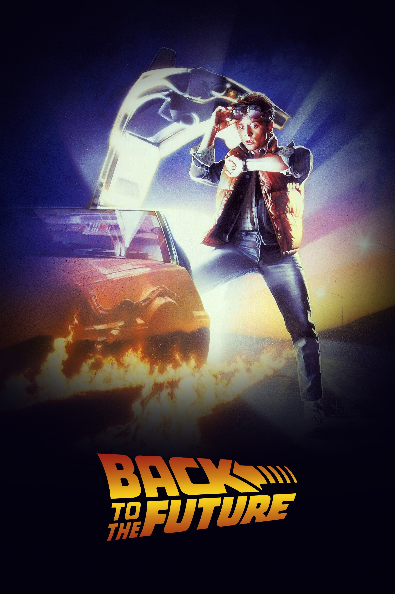
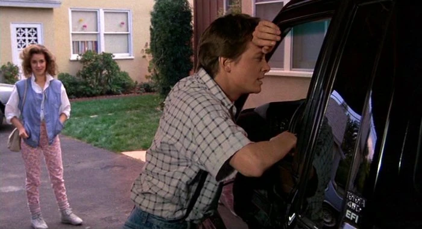
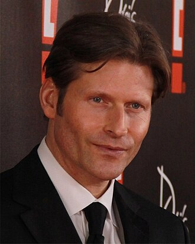

《Back to the Future》는 "시간여행"이라는 거대한 아이디어를 10대 성장담과 가족 코미디에 정확히 접합한 영화다. 거창한 세계관 설명보다 캐릭터의 욕망과 상황 충돌에 집중해, 40년이 지난 지금도 리듬이 전혀 낡지 않는다.

무엇보다 이 작품은 "원인-결과"를 감정적으로 체감하게 만든다. 부모의 첫 만남이 어긋나는 순간, 마티의 존재 자체가 흔들린다는 설정은 SF 장치이면서 동시에 가족 서사의 긴장 장치로도 완벽하게 작동한다.

## 등장인물 이미지 (영화 스틸컷)

## 개요

### 영화 정보
* **제목**: Back to the Future / 빽 투 더 퓨처
* **감독**: Robert Zemeckis (로버트 저메키스)
* **각본**: Robert Zemeckis, Bob Gale
* **주연**:
  * Michael J. Fox (Marty McFly)
  * Christopher Lloyd (Dr. Emmett Brown)
  * Lea Thompson (Lorraine Baines McFly)
  * Crispin Glover (George McFly)
  * Thomas F. Wilson (Biff Tannen)
* **음악**: Alan Silvestri
* **장르**: SF, 어드벤처, 코미디
* **상영시간**: 116분
* **개봉일**: 1985.07.03 (미국), 1987.07.17 (한국 초개봉)
* **제작사**: Amblin Entertainment
* **배급사**: Universal Pictures
* **평점**: IMDb 8.5/10, Rotten Tomatoes 비평가 93%

### 추천 대상
* **시간여행 서사를 좋아하는 관객**: 복잡하지 않지만 인과관계가 아주 촘촘하다.
* **가볍고 똑똑한 오락영화를 찾는 관객**: 코미디 타이밍과 서스펜스가 균형이 좋다.
* **고전 입문이 필요한 관객**: 80년대 영화 감성과 현대적 스토리텔링을 동시에 맛볼 수 있다.

## 영화의 전체 내용 (스포일러 포함)

### Act 1 (Setup): 1985년 힐 밸리, 불안한 현재

**[S01] 불량소년의 일상**: 마티 맥플라이는 밴드 오디션에서 탈락하고, 집에서는 무기력한 아버지와 잔소리 많은 현실을 견딘다.

**[S02] 브라운 박사의 호출**: 괴짜 과학자 독 브라운이 새 발명품 시연을 위해 밤중 쇼핑몰 주차장으로 마티를 부른다.

**[S03] 타임머신 공개**: 독은 드로리안 자동차에 플럭스 커패시터를 장착해 시간 이동이 가능해졌음을 보여준다.

### Act 2 (Inciting & Rising): 1955년으로의 추락

**[S04] 발단 사건 - 1955년 도착**: 테러리스트의 총격에서 도망치던 마티가 실수로 시간 이동을 실행해 1955년으로 떨어진다.

**[S05] 부모의 과거와 조우**: 젊은 시절의 조지와 로레인을 발견한 마티는 자신이 아버지 대신 차에 치이며 역사를 꼬이게 만든다.

**[S06] 존재 소멸의 징후**: 가족사진에서 형제자매가 사라지기 시작하고, 마티도 점차 현실에서 지워질 위기에 놓인다.

### Act 3 (Complications): 역사 복구 작전

**[S07] 1955년의 독 브라운**: 마티는 1955년의 독을 찾아가 자신의 상황을 설명하고 귀환 계획을 세운다.

**[S08] 미드포인트 - 부모 매칭 작전 시작**: 마티는 조지가 로레인과 사랑에 빠지도록 댄스파티를 중심으로 시나리오를 재구성한다.

**[S09] 비프의 난입**: 조지가 또다시 비프에게 위축되며 계획이 무너질 위기에 처하고, 마티는 개입 범위를 넓힌다.

**[S10] 조지의 각성**: 결정적 순간에 조지가 비프에게 주먹을 날리며 로레인 앞에서 처음으로 자기 목소리를 찾는다.

### Act 4 (Climax): 번개와 질주

**[S11] 시계탑 작전**: 독은 번개가 떨어지는 시각탑의 전력을 이용해 드로리안을 1985년으로 보낼 계획을 실행한다.

**[S12] 클라이맥스 - 88마일 성공**: 마지막 순간 케이블이 끊기는 변수 속에서도 독이 연결을 복구하고, 마티는 시속 88마일을 달성해 귀환한다.

**[S13] 한 발 늦은 경고**: 마티는 독에게 죽음 경고를 전하려 하지만, 시간차 때문에 과거의 총격 순간을 다시 맞닥뜨린다.

### Act 5 (Resolution): 달라진 1985년

**[S14] 변화된 가족**: 집으로 돌아온 마티는 자신감 있고 안정된 부모, 성공한 형제자매를 본다. 작은 개입이 가족의 방향을 바꿨다.

**[S15] 독의 생존과 후속 떡밥**: 독은 방탄조끼로 생존했고, 곧바로 미래의 자녀 문제를 해결하자며 마티와 제니퍼를 태우고 날아간다.

## 캐릭터 분석

### Marty McFly (Michael J. Fox)
**개요**: 반항적이지만 책임감 있는 10대 주인공.

**성장 곡선**: "현재를 불평하는 소년"에서 "가족의 역사를 바로잡는 행동가"로 변한다.

### Dr. Emmett Brown (Christopher Lloyd)
**개요**: 천재성과 광기를 동시에 가진 발명가.

**상징적 의미**: 과학 그 자체보다, 과학을 친구와 미래를 위해 쓰려는 윤리적 태도를 보여준다.

### George McFly (Crispin Glover)
**개요**: 소심하고 회피적인 가장.

**변화**: 과거의 한 선택을 통해 자신감과 주체성을 회복하며 가족 전체의 분위기를 바꾼다.

## 영상미와 음악

### 시각 효과 / 촬영 / 미학
- 1985년과 1955년의 미술·소품 대비로 시간 이동의 감각을 즉시 전달한다.
- 드로리안의 헤드라이트, 불꽃 궤적, 시계탑 수직 동선이 클라이맥스의 운동감을 만든다.

### 음악
- 앨런 실베스트리의 메인 테마는 모험성과 낙관을 한 번에 각인시키는 시리즈의 정체성이다.

## 종합 평가

### 최종 평점: ★★★★★ (5.0/5.0)

**장점**:
- 고개를 끄덕이게 만드는 인과 설계와 탁월한 템포.
- 캐릭터 코미디와 서스펜스를 동시에 살린 드문 각본.
- 시리즈 전체의 출발점으로서 완성도가 매우 높다.

**단점**:
- 80년대 표현 문법이 일부 관객에게는 다소 낯설 수 있다.

### 한 줄 평
"가장 유쾌한 시간여행 영화이자, 가장 촘촘한 가족 성장 영화."

## 참고 문헌 및 출처

- [Back to the Future - Wikipedia](https://en.wikipedia.org/wiki/Back_to_the_Future)
- [Back to the Future (1985) - IMDb](https://www.imdb.com/title/tt0088763/)
- [Back to the Future - Rotten Tomatoes](https://www.rottentomatoes.com/m/back_to_the_future)
- [Back to the Future - Box Office Mojo](https://www.boxofficemojo.com/title/tt0088763/)
