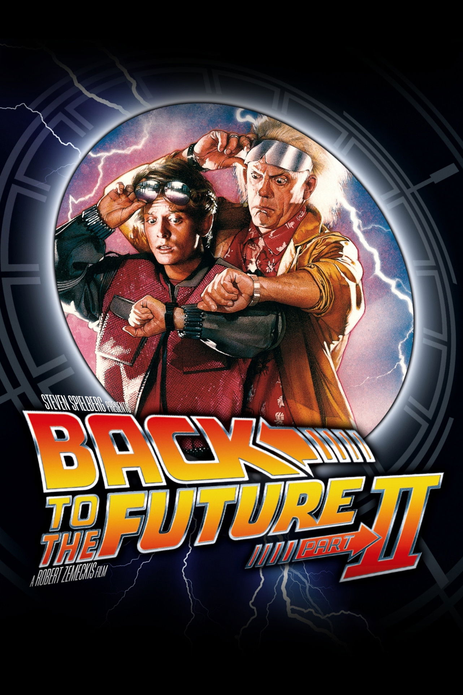

《Back to the Future Part II》는 전편의 성공 공식을 반복하지 않고, 같은 세계를 더 복잡한 시간 구조로 재조립한다. 2015년의 미래 풍경, 붕괴한 대체 1985년, 그리고 전편의 사건을 다시 통과하는 1955년이 하나의 연쇄로 맞물린다.

이 영화의 강점은 "혼란을 설계하는 능력"이다. 이야기 스케일은 커졌지만 핵심 갈등은 여전히 단순하다. 스포츠 연감 하나가 탐욕과 권력을 만나면 세계선이 얼마나 빠르게 오염되는지를 보여준다.

## 개요

### 영화 정보
* **제목**: Back to the Future Part II / 빽 투 더 퓨쳐 2
* **감독**: Robert Zemeckis (로버트 저메키스)
* **각본**: Bob Gale
* **주연**:
  * Michael J. Fox (Marty McFly)
  * Christopher Lloyd (Dr. Emmett Brown)
  * Thomas F. Wilson (Biff Tannen)
  * Elisabeth Shue (Jennifer Parker)
  * Lea Thompson (Lorraine)
* **음악**: Alan Silvestri
* **장르**: SF, 어드벤처, 코미디
* **상영시간**: 108분
* **개봉일**: 1989.11.22 (미국), 1990.07.07 (한국)
* **제작사**: Amblin Entertainment
* **배급사**: Universal Pictures
* **평점**: IMDb 7.8/10

### 추천 대상
* **전편을 재미있게 본 관객**: 전편 사건을 변주하는 메타적 재미가 크다.
* **타임라인 퍼즐을 좋아하는 관객**: 동일 사건의 다른 각도를 따라가는 재미가 있다.
* **80년대 미래 상상에 관심 있는 관객**: 당시 시점에서 그린 2015년 비전이 흥미롭다.

## 영화의 전체 내용 (스포일러 포함)

### Act 1 (Setup): 미래로 가야 하는 이유

**[S01] 직후의 출발**: 1편 엔딩 직후, 독은 마티와 제니퍼를 데리고 2015년으로 향한다.

**[S02] 가족 위기 예고**: 독은 마티의 미래 자녀가 범죄 사건에 엮인다고 설명하며 개입을 요청한다.

**[S03] 미래 힐 밸리 적응**: 마티는 2015년의 기술과 문화(호버보드, 자동화 서비스)에 당황하면서도 임무를 수행한다.

### Act 2 (Inciting & Rising): 연감의 유혹

**[S04] 발단 사건 - 연감 발견**: 마티는 스포츠 결과를 모은 연감이 과거에서 엄청난 부를 만들 수 있음을 깨닫는다.

**[S05] 독의 경고**: 독은 시간여행의 사적 이용이 재앙을 부른다고 단호히 막지만, 이를 엿본 노년의 비프가 음모를 꾸민다.

**[S06] 비프의 탈취**: 노년 비프는 드로리안을 훔쳐 1955년으로 가서 젊은 자신에게 연감을 넘긴다.

### Act 3 (Complications): 오염된 1985년

**[S07] 귀환 실패**: 마티와 독이 돌아온 1985년은 폭력과 부패가 지배하는 디스토피아가 되어 있다.

**[S08] 미드포인트 - 진실 확인**: 비프가 1955년부터 도박으로 권력을 축적했다는 사실이 밝혀지고, 세계선이 바뀌었음이 확정된다.

**[S09] 가족의 붕괴**: 마티의 아버지는 죽었고, 어머니는 비프와 강제적 결혼 상태다. 개인 비극이 타임 패러독스의 대가로 제시된다.

**[S10] 복구 계획 수립**: 두 사람은 연감 전달 시점을 저격하기 위해 다시 1955년으로 이동한다.

### Act 4 (Climax): 같은 날, 다른 시점

**[S11] 1955년 잠입**: 1편의 "시계탑 번개의 날" 한복판에 잠입해 전편 사건과 충돌하지 않게 행동해야 한다.

**[S12] 연감 회수 작전**: 마티는 젊은 비프를 추적하며 연감을 빼앗기 위해 호버보드 체이스를 벌인다.

**[S13] 클라이맥스 - 연감 소각**: 마티가 연감을 소각하면서 오염된 미래를 만든 핵심 원인을 제거한다.

### Act 5 (Resolution): 해결과 또 다른 위기

**[S14] 원래 시간선 회복**: 디스토피아 1985년이 정상화될 가능성이 열리고, 작전은 성공한 듯 보인다.

**[S15] 벼락 사고**: 귀환 직전 드로리안이 낙뢰를 맞고, 독은 1885년으로 사라진다.

**[S16] 후속 연결**: 웨스턴유니온 배달부가 70년 보관된 독의 편지를 전달하며 3편의 서사가 시작된다.

## 캐릭터 분석

### Marty McFly (Michael J. Fox)
**개요**: 즉흥적이지만 책임감 있는 행동파.

**갈등 구조**: "작은 욕심"이 얼마나 큰 역사 왜곡을 낳는지 직접 목격하며 성숙한다.

### Dr. Emmett Brown (Christopher Lloyd)
**개요**: 규칙을 설계하고도 예측 불가능성을 감당해야 하는 과학자.

**상징적 의미**: 통제 가능한 과학과 통제 불가능한 인간 욕망의 간극.

### Biff Tannen (Thomas F. Wilson)
**개요**: 탐욕과 폭력의 화신.

**상징적 의미**: 정보 비대칭(연감)이 권력으로 변환될 때 나타나는 타락의 속도를 체현한다.

## 영상미와 음악

### 시각 효과 / 촬영 / 미학
- 2015년 도시 디자인은 과장된 낙관과 소비 문화를 풍자적으로 시각화한다.
- 전편 장면을 재촬영/재배치해 "같은 공간의 다른 시간"이라는 컨셉을 명확히 보여준다.

### 음악
- 실베스트리 테마의 변주가 모험 톤을 유지하면서도 위기감을 더한다.

## 종합 평가

### 최종 평점: ★★★★☆ (4.6/5.0)

**장점**:
- 속편으로서 스케일 확장과 세계관 실험이 대담하다.
- 전편과의 교차 구조가 팬에게 강력한 보상으로 작동한다.
- 비프 캐릭터를 통해 사회 풍자를 선명하게 만든다.

**단점**:
- 전편 미시청 관객에게는 정보량과 구조가 다소 복잡할 수 있다.

### 한 줄 평
"속편이 할 수 있는 가장 영리한 선택, 전편을 다시 통과해 미래를 고친다."

## 참고 문헌 및 출처

- [Back to the Future Part II - Wikipedia](https://en.wikipedia.org/wiki/Back_to_the_Future_Part_II)
- [Back to the Future Part II (1989) - IMDb](https://www.imdb.com/title/tt0096874/)
- [Back to the Future Part II - Box Office Mojo](https://www.boxofficemojo.com/title/tt0096874/)
- [Back to the Future Trilogy - Official Site](https://www.backtothefuture.com/)
