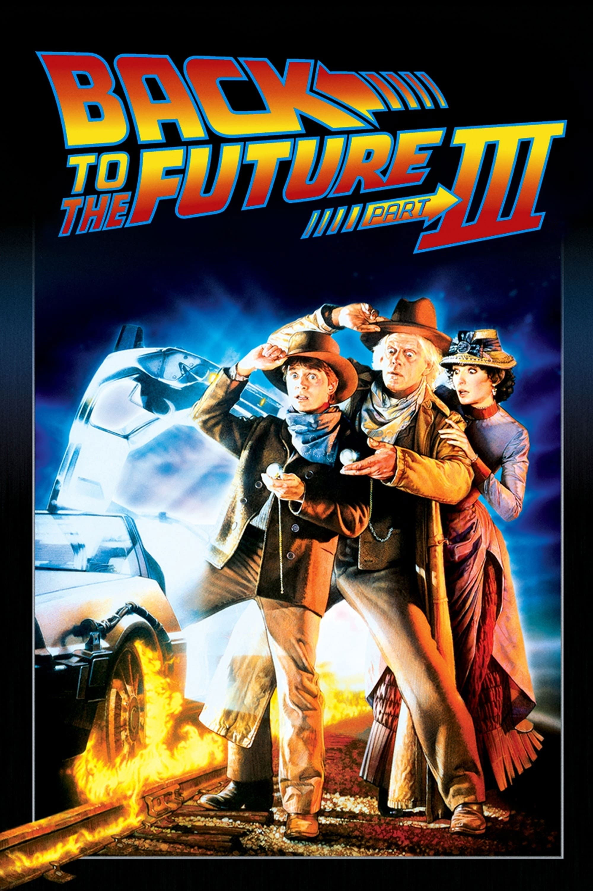
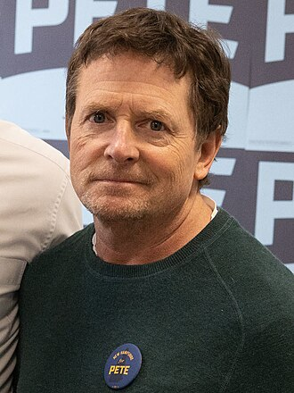
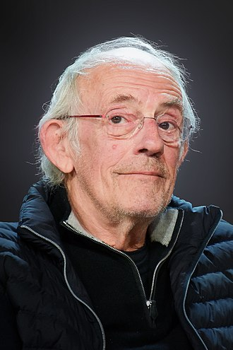
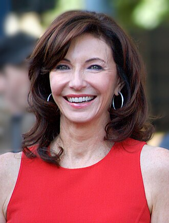
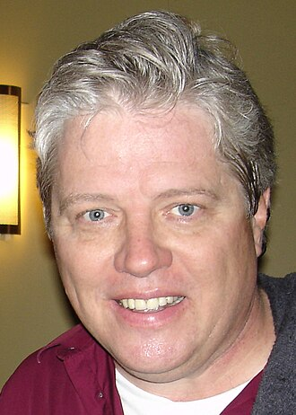

《Back to the Future Part III》는 시리즈의 마지막을 "더 크게"가 아니라 "더 따뜻하게" 선택한 영화다. 미래 도시 대신 1885년 서부 개척시대로 무대를 옮기면서, 이야기의 중심을 마티보다 독 브라운의 감정선에 둔다.

그 결과 3편은 액션 스케일보다 관계의 마무리에 집중한다. 독의 사랑, 마티의 성숙, 그리고 두 인물이 서로를 놓아주는 순간이 웨스턴 장르의 낭만과 어울리며 시리즈에 좋은 엔딩 톤을 부여한다.

## 등장인물 이미지

## 개요

### 영화 정보
* **제목**: Back to the Future Part III / 빽 투 더 퓨쳐 3
* **감독**: Robert Zemeckis (로버트 저메키스)
* **각본**: Bob Gale
* **주연**:
  * Michael J. Fox (Marty McFly)
  * Christopher Lloyd (Dr. Emmett Brown)
  * Mary Steenburgen (Clara Clayton)
  * Thomas F. Wilson (Buford "Mad Dog" Tannen)
* **음악**: Alan Silvestri
* **장르**: SF, 웨스턴, 어드벤처
* **상영시간**: 118분
* **개봉일**: 1990.05.25 (미국), 1990.12.22 (한국)
* **제작사**: Amblin Entertainment
* **배급사**: Universal Pictures
* **평점**: IMDb 7.4/10

### 추천 대상
* **시리즈 완결의 감정선을 중시하는 관객**: 캐릭터 관계의 종결이 좋다.
* **웨스턴 장르를 좋아하는 관객**: 총잡이 대결, 증기기관차, 개척시대 미장센이 살아 있다.
* **독 브라운 캐릭터 팬**: 독의 인생 선택이 본격적으로 중심에 선다.

## 영화의 전체 내용 (스포일러 포함)

### Act 1 (Setup): 편지 한 장에서 시작된 구조 임무

**[S01] 1955년의 충격**: 2편 직후, 마티는 1885년에서 온 독의 편지를 받고 독이 과거에 고립됐음을 알게 된다.

**[S02] 드로리안 발굴**: 1955년의 독과 함께 묻혀 있던 드로리안을 꺼내 수리 계획을 세운다.

**[S03] 죽음의 기록 발견**: 신문 기사에서 독이 "매드독 태넌에게 총살"당한다는 사실이 드러난다.

### Act 2 (Inciting & Rising): 1885년으로의 재진입

**[S04] 발단 사건 - 연료 문제**: 마티는 1885년으로 이동하지만 연료 라인이 손상돼 즉시 귀환이 불가능해진다.

**[S05] 힐 밸리의 과거**: 마티는 조상인 맥플라이 가문과 조우하고, 당시의 가혹한 생존 환경을 체감한다.

**[S06] 독과 재회**: 독은 이미 지역 대장장이로 정착해 있었고, 두 사람은 귀환과 생존을 동시에 고민한다.

### Act 3 (Complications): 사랑과 임무의 충돌

**[S07] 클라라의 등장**: 독은 교사 클라라 클레이턴을 만나 예상하지 못한 사랑에 빠진다.

**[S08] 미드포인트 - 결심의 분열**: 독은 미래로 돌아갈 기회를 앞두고도 클라라를 떠날지 갈등한다. 임무와 감정이 정면으로 충돌한다.

**[S09] 매드독의 압박**: 태넌 일당은 마티를 계속 도발하고, 마티는 "겁쟁이" 트리거를 이겨내지 못해 위험을 키운다.

**[S10] 결투 강요**: 마티는 태넌과의 결투를 피하기 어려운 상황에 몰리며, 귀환 계획 전체가 흔들린다.

### Act 4 (Climax): 기차 질주와 작별

**[S11] 기관차 계획**: 휘발유 대신 증기기관차의 추진력을 이용해 드로리안을 시속 88마일까지 끌어올리는 작전을 세운다.

**[S12] 결투의 반전**: 마티는 판초 속 철판으로 총격을 막고, 태넌을 제압해 생존과 명예를 동시에 지킨다.

**[S13] 클라이맥스 - 레일 위 88마일**: 독과 마티는 불타는 레일 위에서 임계 속도를 만들고, 마티는 가까스로 1985년으로 귀환한다.

### Act 5 (Resolution): 각자의 시간으로

**[S14] 마티의 변화**: 1985년에 돌아온 마티는 레이스 도발을 거절하며 과거와 다른 선택을 한다.

**[S15] 독의 귀환**: 폐선된 선로에 증기기관차형 타임머신이 나타나고, 독은 클라라 및 아이들과 함께 등장한다.

**[S16] 엔딩 - 미래는 쓰는 것**: 독은 "미래는 정해진 게 없다"고 말하며 떠난다. 시리즈는 개방적이면서도 따뜻한 여운으로 닫힌다.

## 캐릭터 분석

### Dr. Emmett Brown (Christopher Lloyd)
**개요**: 시리즈의 발명가이자 이번 편의 정서적 주인공.

**성장 곡선**: 과학적 호기심 중심 인물에서, 사랑을 선택하고 삶의 균형을 찾는 인물로 확장된다.

### Marty McFly (Michael J. Fox)
**개요**: 본능적 반응으로 움직이던 청년.

**변화**: "겁쟁이"라는 자극에 반응하지 않는 법을 배우며, 충동보다 선택을 우선하는 성숙을 획득한다.

### Clara Clayton (Mary Steenburgen)
**개요**: 독의 삶에 새로운 시간축을 여는 인물.

**상징적 의미**: 시간여행의 기술적 모험에 인간적 정착과 미래 설계라는 다른 답을 제시한다.

## 영상미와 음악

### 시각 효과 / 촬영 / 미학
- 서부의 황갈색 팔레트와 광활한 로케이션이 전작과 확연히 다른 질감을 만든다.
- 열차 시퀀스는 미니어처와 실물 촬영의 결합으로 시리즈 최고 수준의 물리적 쾌감을 준다.

### 음악
- 실베스트리 테마에 웨스턴 악기 질감을 섞어 "시리즈 정체성 + 장르 전환"을 자연스럽게 연결한다.

## 종합 평가

### 최종 평점: ★★★★☆ (4.5/5.0)

**장점**:
- 시리즈를 감정적으로 마무리하는 캐릭터 중심 설계가 뛰어나다.
- 웨스턴과 SF를 충돌이 아니라 조화로 풀어낸 장르 결합이 인상적이다.
- 독 브라운의 서사를 확장해 삼부작 전체 의미를 풍부하게 만든다.

**단점**:
- 1편의 속도감과 코미디를 기대하면 톤 변화가 다르게 느껴질 수 있다.

### 한 줄 평
"시간여행 삼부작의 마지막 답은, 기술이 아니라 사람의 선택이었다."

## 참고 문헌 및 출처

- [Back to the Future Part III - Wikipedia](https://en.wikipedia.org/wiki/Back_to_the_Future_Part_III)
- [Back to the Future Part III (1990) - IMDb](https://www.imdb.com/title/tt0099088/)
- [Back to the Future Part III - Box Office Mojo](https://www.boxofficemojo.com/title/tt0099088/)
- [Back to the Future Trilogy - Official Site](https://www.backtothefuture.com/)
