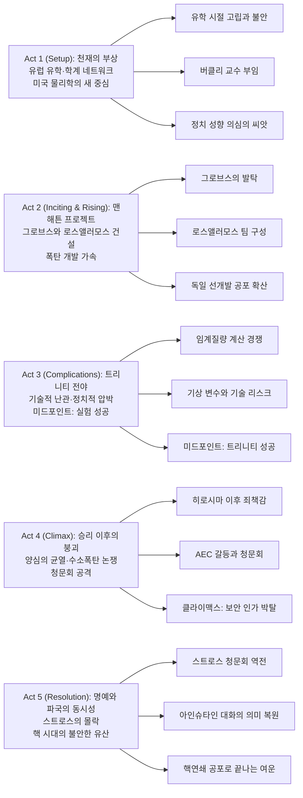

『오펜하이머』는 "원자폭탄의 아버지"라는 별칭 뒤에 가려진 인간 J. 로버트 오펜하이머의 내면을 파헤치는 영화다. 이 작품은 단순한 위인전이 아니라, 과학적 성취가 어떻게 정치 권력과 결합해 개인을 소비하는지 보여주는 180분짜리 압축 드라마에 가깝다.

핵심은 폭탄의 성공이 아니라 그 이후다. 트리니티 실험의 환호가 끝난 자리에서, 영화는 죄책감·정치 보복·명예 회복이라는 서로 다른 시간축을 교차시키며 "정말 누가 역사를 만들고, 누가 대가를 치르는가"를 묻는다.

## 개요

### 영화 정보
* **제목**: Oppenheimer / 오펜하이머
* **감독**: Christopher Nolan (크리스토퍼 놀란)
* **각본**: Christopher Nolan (카이 버드·마틴 셔윈 저서 기반)
* **주연**:
  * Cillian Murphy (J. Robert Oppenheimer)
  * Emily Blunt (Kitty Oppenheimer)
  * Robert Downey Jr. (Lewis Strauss)
  * Matt Damon (Leslie Groves)
  * Florence Pugh (Jean Tatlock)
* **음악**: Ludwig Goransson (루드비그 고란손)
* **장르**: 전기, 드라마, 역사, 스릴러
* **상영시간**: 180분
* **개봉일**: 2023.07.21 (미국), 2023.08.15 (한국)
* **제작사**: Syncopy, Atlas Entertainment
* **배급사**: Universal Pictures
* **제작비**: 약 1억 달러
* **흥행**: 전 세계 약 9.7억 달러
* **평점**: IMDb 8.3/10, Rotten Tomatoes 평론가 93%

### 추천 대상
* **인물 중심 드라마를 좋아하는 관객**: 전쟁영화보다 "한 인간의 책임"에 집중하는 서사가 강점이다.
* **놀란식 구조 편집을 좋아하는 관객**: 흑백/컬러와 서로 다른 청문회 시간축이 맞물리며 긴장감을 만든다.
* **과학사·정치사에 관심 있는 관객**: 맨해튼 프로젝트 이후 미국 권력 구조의 변화를 밀도 있게 보여준다.

## 구조 분석

## 영화의 전체 내용 (스포일러 포함)

이 영화는 "폭탄을 만들었다"에서 멈추지 않고, 그 폭탄이 만들어낸 정치적 파장까지 끝까지 추적한다. 특히 컬러(오펜하이머의 주관)와 흑백(스트로스 중심의 상대 시점)을 교차시키며, 한 인물의 기억과 국가 권력의 기록이 어떻게 다르게 쓰이는지 보여준다.

### Act 1 (Setup): 천재의 부상

**[S01] 케임브리지의 젊은 물리학도**: 오펜하이머는 유럽에서 양자역학을 배우지만, 정서적으로 불안정하고 사회적으로도 고립되어 있다. 그는 지적 성취와 자기 파괴 충동 사이를 오간다.

**[S02] 괴팅겐 네트워크 형성**: 당대 최고 과학자들과 교류하며 물리학의 최전선에 진입한다. 이 시기의 인맥이 훗날 맨해튼 프로젝트 핵심 인력 풀로 이어진다.

**[S03] 미국 귀환과 버클리 정착**: 오펜하이머는 이론 물리학을 미국 학계 중심으로 끌어오며 영향력을 키운다. 동시에 좌파 성향 지인들과의 관계가 훗날 정치적 약점으로 남는다.

**[S04] 진 태틀록과의 관계**: 진과의 지적·정서적 관계는 오펜하이머의 내면에 강한 흔적을 남긴다. 이 개인사는 후반 청문회에서 공격 소재가 된다.

**[S05] 전쟁의 그림자**: 나치 독일의 핵개발 가능성이 현실 위협으로 제시되며, 미국 정부는 과학자 동원을 본격화한다.

### Act 2 (Inciting & Rising): 맨해튼 프로젝트

**[S06] 그로브스의 선택**: 레슬리 그로브스 장군은 예상 외로 오펜하이머를 총책임자로 발탁한다. 보안 리스크보다 통합 리더십을 높게 평가한 결정이다.

**[S07] 로스앨러모스 건설**: 사막 한가운데 비밀 연구도시가 세워지고, 수많은 과학자와 가족이 이주한다. 영화는 이 공간을 "국가가 만든 거대한 실험실"로 묘사한다.

**[S08] 과학적 병목과 조직 갈등**: 이론·실험·공학 팀이 충돌하며 일정이 흔들린다. 오펜하이머는 조정자로서 능력을 발휘하지만, 압박은 점점 커진다.

**[S09] 하이젠베르크 변수**: 독일이 먼저 핵무기를 완성할지 모른다는 공포가 프로젝트를 더 공격적으로 밀어붙인다. 목적의 정당성이 이 시점에서 최고조에 달한다.

**[S10] 개인과 국가의 경계 붕괴**: 키티와의 결혼, 진과의 기억, 동생 프랭크 문제까지 겹치며 오펜하이머의 사적 영역이 국가안보 논리 안으로 흡수된다.

### Act 3 (Complications): 트리니티 전야

**[S11] 임계질량 계산 전쟁**: 플루토늄 내폭 장치의 기술 난제가 드러나고, 팀은 수치와 실험을 반복하며 한계까지 몰린다.

**[S12] 기상 창과 실패 공포**: 실험 당일 기상조건이 흔들리며 일정과 안전성 판단이 충돌한다. 작은 변수 하나가 국가 전략 전체를 뒤엎을 수 있는 상황이 된다.

**[S13] 카운트다운의 침묵**: 영화는 긴 설명 대신 얼굴과 소리, 정적을 통해 압박을 축적한다. 과학자들은 성공 기대와 재앙 상상을 동시에 견딘다.

**[S14] 미드포인트 - 트리니티 성공**: 폭발은 인류가 만든 새로운 힘의 탄생을 선언한다. 환호가 터지지만, 동시에 오펜하이머의 표정은 이미 승리 이후의 공포를 암시한다.

### Act 4 (Climax): 승리 이후의 붕괴

**[S15] 히로시마·나가사키 이후**: 전쟁 종결 논리와 민간인 피해 현실이 충돌한다. 오펜하이머는 "내 손에 피가 묻었다"는 감각에서 벗어나지 못한다.

**[S16] 워싱턴의 정치 게임**: AEC 내부 권력 구도에서 오펜하이머는 점점 부담스러운 존재가 된다. 특히 수소폭탄 개발 반대 입장이 적을 만든다.

**[S17] 스트로스의 원한 축적**: 루이스 스트로스는 오펜하이머와의 갈등을 개인적 모욕으로 받아들이고, 기회를 기다리며 정치적 반격을 준비한다.

**[S18] 비공개 청문회 개시**: 과거 교류, 사생활, 발언이 모두 보안 리스크로 재해석된다. 사실 검증이 아니라 "신뢰 불가 인물" 프레임을 만드는 절차가 진행된다.

**[S19] 클라이맥스 - 보안 인가 박탈**: 오펜하이머는 법적으로 처벌받지 않지만, 과학 정책 중심에서 사실상 퇴출된다. 국가는 그를 영웅으로 소비한 뒤 정치적으로 폐기한다.

### Act 5 (Resolution): 명예와 파국의 동시성

**[S20] 스트로스 상원 청문회**: 영화의 흑백 시간축에서, 스트로스 인준 과정이 역으로 그의 계산을 무너뜨린다. 증언들이 쌓이며 보복 정치의 흔적이 드러난다.

**[S21] 아인슈타인 대화의 재맥락화**: 초반에 오해처럼 보였던 장면이 후반에 의미를 회복한다. 대화의 핵심은 개인 감정이 아니라 핵시대 전체에 대한 경고였다.

**[S22] 대통령 훈장과 공허한 명예**: 오펜하이머는 뒤늦은 상징적 복권을 받지만, 실질적 복원과는 거리가 멀다. 영화는 "명예 회복"의 한계를 냉정하게 보여준다.

**[S23 엔딩] 핵연쇄의 상상**: 오펜하이머의 시선은 지구적 파멸 가능성으로 확장된다. 개인 드라마가 문명사적 불안으로 번지며 영화가 끝난다.

## 캐릭터 분석

### J. Robert Oppenheimer (Cillian Murphy)
**개요**: 천재 물리학자이자 맨해튼 프로젝트의 상징적 얼굴.

**성장 곡선**: 과학적 야망의 중심 인물에서, 자신의 성취가 낳은 파장을 견디는 증언자로 이동한다.

**동기와 욕망**: 전쟁을 끝낼 기술적 우위를 확보하고자 했지만, 이후에는 통제되지 않는 핵경쟁을 두려워한다.

**갈등 구조**: 국가안보 논리와 개인 윤리의 충돌. 영웅 서사와 위험 인물 프레임 사이에서 정체성이 분열된다.

### Lewis Strauss (Robert Downey Jr.)
**개요**: 정책 권력의 언어를 체화한 실무 정치인.

**성장 곡선**: 조력자처럼 보이지만, 점차 오펜하이머의 공적 위상을 제거하려는 대립축으로 전면화된다.

**상징적 의미**: 과학의 사실보다 정치의 해석이 더 큰 힘을 갖는 현실.

### Kitty Oppenheimer (Emily Blunt)
**개요**: 오펜하이머의 배우자이자 후반부의 강한 균형추.

**역할**: 청문회 장면에서 방어적 태도를 거부하고 정면 대응을 요구하며, 오펜하이머의 주저함을 깨운다.

**상징적 의미**: 사적 관계가 공적 파국을 통과하며 보여주는 생존 의지.

## 영상미와 음악

### 시각 효과 / 촬영 / 미학
- 대형 포맷 촬영은 인물 클로즈업에서도 압박감을 극대화한다.
- 트리니티 장면은 과장된 CGI보다 실물 효과와 사운드 지연을 활용해 체감 공포를 만든다.
- 컬러/흑백의 교차는 단순 미학이 아니라 시점의 정치성을 드러내는 장치다.

### 음악
- 루드비그 고란손의 스코어는 바이올린 중심의 불안한 리듬으로 심리적 긴장을 누적시킨다.
- 폭발 순간보다 "폭발 이후"의 감정 잔향을 강조해 영화의 윤리적 질문을 확장한다.

## 종합 평가

### 최종 평점: ★★★★☆ (4.7/5.0)

**장점**:
- 전기영화 문법을 정치 스릴러와 결합해 밀도를 극대화했다.
- 배우 앙상블, 특히 킬리언 머피와 로버트 다우니 주니어의 연기 충돌이 압도적이다.
- 사운드·편집·시점 구조가 "과학의 성공 뒤에 남는 공포"를 설득력 있게 전달한다.

**단점**:
- 대사 정보량이 많아 초반 진입 장벽이 높다.
- 여성 캐릭터 서사 비중이 상대적으로 제한적이라는 아쉬움이 남는다.

### 한 줄 평
"세상을 바꾼 순간보다, 그 순간 이후를 더 오래 응시하는 영화."

### 추천 작품
- 《다크 아워》(2017): 국가적 위기에서 정치적 선택이 갖는 무게를 비교해 보기 좋다.
- 《이미테이션 게임》(2014): 전쟁기 과학자의 공헌과 개인적 대가를 함께 다룬다.
- 《퍼스트맨》(2018): 역사적 업적 뒤의 고독과 내면을 섬세하게 포착한 전기영화.

### 관람 전 체크리스트
- 사전 지식이 필요한가? **부분적으로 예** (맨해튼 프로젝트 기본 맥락을 알면 더 잘 보인다)
- 어린이와 함께 볼 수 있는가? **권장하지 않음** (정보량·긴장도·성인 주제 비중이 높다)
- 쿠키 영상이 있는가? **없음**
- 속편 가능성은? **없음** (완결형 전기영화)

## 참고 문헌 및 출처

- [Oppenheimer (film) — Wikipedia](https://en.wikipedia.org/wiki/Oppenheimer_(film))
- [Oppenheimer (2023) — IMDb](https://www.imdb.com/title/tt15398776/)
- [Oppenheimer — Rotten Tomatoes](https://www.rottentomatoes.com/m/oppenheimer_2023)
- [Oppenheimer — Box Office Mojo](https://www.boxofficemojo.com/title/tt15398776/)
- [J. Robert Oppenheimer — Encyclopaedia Britannica](https://www.britannica.com/biography/J-Robert-Oppenheimer)
