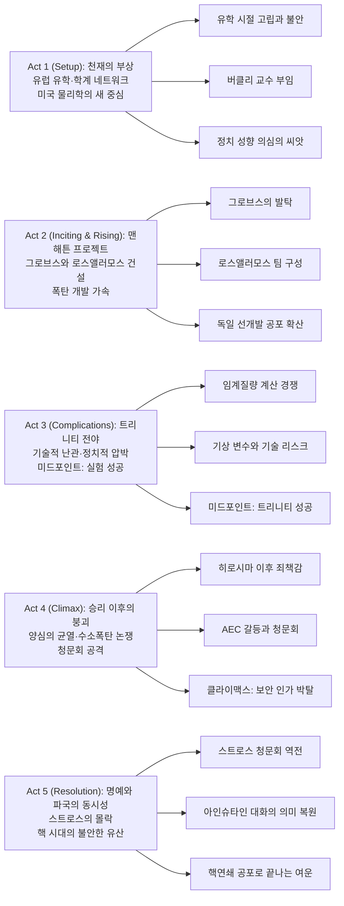

『오펜하이머』는 "원자폭탄의 아버지"라는 별칭 뒤에 가려진 인간 J. 로버트 오펜하이머의 내면을 파헤치는 영화다. 이 작품은 단순한 위인전이 아니라, 과학적 성취가 어떻게 정치 권력과 결합해 개인을 소비하는지 보여주는 180분짜리 압축 드라마에 가깝다.

핵심은 폭탄의 성공이 아니라 그 이후다. 트리니티 실험의 환호가 끝난 자리에서, 영화는 죄책감·정치 보복·명예 회복이라는 서로 다른 시간축을 교차시키며 "정말 누가 역사를 만들고, 누가 대가를 치르는가"를 묻는다.

## 개요

### 영화 정보
* **제목**: Oppenheimer / 오펜하이머
* **감독**: Christopher Nolan (크리스토퍼 놀란)
* **각본**: Christopher Nolan (카이 버드·마틴 셔윈 저서 기반)
* **주연**:
  * Cillian Murphy (J. Robert Oppenheimer)
  * Emily Blunt (Kitty Oppenheimer)
  * Robert Downey Jr. (Lewis Strauss)
  * Matt Damon (Leslie Groves)
  * Florence Pugh (Jean Tatlock)
* **음악**: Ludwig Goransson (루드비그 고란손)
* **장르**: 전기, 드라마, 역사, 스릴러
* **상영시간**: 180분
* **개봉일**: 2023.07.21 (미국), 2023.08.15 (한국)
* **제작사**: Syncopy, Atlas Entertainment
* **배급사**: Universal Pictures
* **제작비**: 약 1억 달러
* **흥행**: 전 세계 약 9억 7,580만 달러
* **평점**: IMDb 8.3/10, Rotten Tomatoes 평론가 93%, Metacritic 90/100

### 추천 대상
* **인물 중심 드라마를 좋아하는 관객**: 전쟁영화보다 "한 인간의 책임"에 집중하는 서사가 강점이다.
* **놀란식 구조 편집을 좋아하는 관객**: 흑백/컬러와 서로 다른 청문회 시간축이 맞물리며 긴장감을 만든다.
* **과학사·정치사에 관심 있는 관객**: 맨해튼 프로젝트 이후 미국 권력 구조의 변화를 밀도 있게 보여준다.

## 구조 분석

## 영화의 전체 내용 (스포일러 포함)

이 작품은 단순한 연대기 전개가 아니라, 서로 다른 세 시간대를 교차 편집해 의미를 완성한다. 컬러 파트는 오펜하이머의 주관적 체험을, 흑백 파트는 스트로스가 구성한 정치적 서사를 보여주며 같은 사건을 전혀 다른 진실처럼 보이게 만든다.

핵심 줄기는 "원자폭탄을 만든 과정"보다 "그 이후 누가 책임을 정의하는가"에 있다. 영화는 과학적 승리와 정치적 처벌이 하나의 연쇄반응으로 이어진다는 점을 오프닝부터 엔딩까지 집요하게 밀어붙인다.

### 오프닝: 프로메테우스의 불

**[S01] 불의 비유**: 영화는 프로메테우스 인용으로 시작해, 지식의 획득이 곧 형벌의 시작이라는 프레임을 제시한다. 초반 물결과 빛의 이미지, 후반 핵폭발 환영이 서로 대응되며 "발견의 순간"과 "대가의 시간"을 겹쳐 놓는다.

### 시간대 #1 (컬러): 젊은 시절에서 트리니티까지

**[S02] 케임브리지와 괴팅겐**: 오펜하이머는 실험물리보다 이론물리에 적합한 성향을 보이며 유럽 학계에서 급성장한다. 동시에 불안정한 정서와 자기파괴 충동이 드러나며, 그의 천재성이 순수한 영웅 서사로만 읽히지 않도록 만든다.

**[S03] 버클리 네트워크와 사적 관계**: 귀국 후 버클리에서 학문적 영향력을 넓히고, 진 태틀록·하콘 슈발리에 등 좌익 성향 인맥과 얽힌다. 이 시기 인연들은 이후 청문회에서 정치적 약점으로 재활용된다.

**[S04] 맨해튼 프로젝트 발탁**: 그로브스 장군은 보안 리스크를 알면서도 오펜하이머를 로스앨러모스의 얼굴로 선택한다. 이유는 학문적 명성보다, 분열된 과학자 집단을 하나의 목표로 묶는 조직 능력이다.

**[S05] 로스앨러모스의 압축된 전시 체제**: 도시 전체가 기밀 공간이 되고, 연구·가정·정치가 분리되지 않은 채 공존한다. 내폭 설계, 기폭 동기화, 임계질량 계산 같은 난제가 이어지고, 연구자들은 기술적 실패와 윤리적 불안을 동시에 견딘다.

**[S06] 트리니티 직전의 공포**: "대기 점화 가능성" 같은 극한 가설이 농담처럼 오가지만, 그 농담 자체가 모두의 공포를 드러낸다. 카운트다운 장면은 대사보다 정적과 지연된 폭음으로 긴장을 구축한다.

**[S07] 미드포인트 - 트리니티 성공**: 실험 성공은 프로젝트의 정당성을 확보한 사건이지만, 영화는 이를 승리의 정점이 아니라 죄책감의 출발점으로 처리한다. 환호 직후 오펜하이머의 표정이 이미 후반부의 붕괴를 예고한다.

**[S08] 히로시마·나가사키 이후의 균열**: 폭탄 투하 소식이 전해진 뒤 연구소는 축제와 침묵으로 분열된다. 오펜하이머는 공개적으로는 국가적 성공의 얼굴이지만, 내면에서는 "내 손에 피가 묻었다"는 감각에 잠식된다.

### 시간대 #2 (컬러): 1954년 비공개 보안 청문회

**[S09] 냉전 질서와 수소폭탄 논쟁**: 전후 핵정책이 군비경쟁 국면으로 이동하자, 오펜하이머의 신중론은 정치적으로 위험한 입장으로 취급된다. 과거 인맥과 사생활, 발언 기록이 보안 문제라는 명목으로 재조립된다.

**[S10] 형식은 심사, 실체는 제거**: 청문회는 법정처럼 보이지만, 실제 목적은 유무죄 판단보다 정책 영향력 박탈에 가깝다. 증언은 맥락보다 인상에 의해 소비되고, 오펜하이머는 국가 영웅에서 국가 리스크로 재정의된다.

**[S11] 클라이맥스 - 보안 인가 박탈**: 최종적으로 그는 형사 처벌 없이도 공적 의사결정 중심에서 퇴출된다. 영화는 이것을 개인의 몰락보다 "국가가 만든 상징을 절차적으로 폐기하는 과정"으로 묘사한다.

### 시간대 #3 (흑백): 1959년 스트로스 인준 청문회

**[S12] 스트로스의 불안한 승리 시나리오**: 상무장관 인준은 통과 의례처럼 보이지만, 숨겨진 증언들이 등장하며 분위기가 뒤집힌다. 스트로스가 설계한 서사에서 누락된 동기와 감정이 공개적으로 드러나기 시작한다.

**[S13] 데이비드 힐의 증언과 역전**: 과학자 사회를 대표한 증언은 오펜하이머 공격이 공익보다 사적 원한에 가까웠음을 부각한다. 결과적으로 스트로스는 자신이 타인에게 사용했던 정치적 메커니즘에 의해 되치기를 당한다.

### 결말: 명예 회복 이후에도 남는 공포

**[S14] 아인슈타인 대화의 의미 복원**: 영화 전반에 흩어져 있던 두 사람의 장면은 엔딩에서 하나로 연결된다. 대화의 핵심은 개인 감정이 아니라, 인류가 이미 비가역적 핵연쇄의 시대를 시작했다는 자각이다.

**[S15] 페르미상과 공허한 복권**: 뒤늦은 훈장은 상징적 화해를 제공하지만, 오펜하이머가 잃은 시간과 정책 영향력은 돌아오지 않는다. 작품은 복권이 곧 구원은 아니라는 점을 분명히 남긴다.

**[S16 엔딩] "이미 시작된 것"**: 마지막 이미지에서 오펜하이머의 공포는 개인 윤리 차원을 넘어 문명 전체의 위기 감각으로 확장된다. 영화는 과거를 재현하는 데서 끝나지 않고, 핵무기 시대의 현재를 향한 경고로 닫힌다.

## 캐릭터 분석

### J. Robert Oppenheimer (Cillian Murphy)
**개요**: 천재 물리학자이자 맨해튼 프로젝트의 상징적 얼굴.

**성장 곡선**: 과학적 야망의 중심 인물에서, 자신의 성취가 낳은 파장을 견디는 증언자로 이동한다.

**동기와 욕망**: 전쟁을 끝낼 기술적 우위를 확보하고자 했지만, 이후에는 통제되지 않는 핵경쟁을 두려워한다.

**갈등 구조**: 국가안보 논리와 개인 윤리의 충돌. 영웅 서사와 위험 인물 프레임 사이에서 정체성이 분열된다.

### Lewis Strauss (Robert Downey Jr.)
**개요**: 정책 권력의 언어를 체화한 실무 정치인.

**성장 곡선**: 조력자처럼 보이지만, 점차 오펜하이머의 공적 위상을 제거하려는 대립축으로 전면화된다.

**상징적 의미**: 과학의 사실보다 정치의 해석이 더 큰 힘을 갖는 현실.

### Kitty Oppenheimer (Emily Blunt)
**개요**: 오펜하이머의 배우자이자 후반부의 강한 균형추.

**역할**: 청문회 장면에서 방어적 태도를 거부하고 정면 대응을 요구하며, 오펜하이머의 주저함을 깨운다.

**상징적 의미**: 사적 관계가 공적 파국을 통과하며 보여주는 생존 의지.

## 영상미와 음악

### 시각 효과 / 촬영 / 미학
- 대형 포맷 촬영은 인물 클로즈업에서도 압박감을 극대화한다.
- 트리니티 장면은 과장된 CGI보다 실물 효과와 사운드 지연을 활용해 체감 공포를 만든다.
- 컬러/흑백의 교차는 단순 미학이 아니라 시점의 정치성을 드러내는 장치다.

### 음악
- 루드비그 고란손의 스코어는 바이올린 중심의 불안한 리듬으로 심리적 긴장을 누적시킨다.
- 폭발 순간보다 "폭발 이후"의 감정 잔향을 강조해 영화의 윤리적 질문을 확장한다.

## 역사적 정확성과 해석 포인트

영화는 핵심 사건의 큰 흐름에서는 높은 정확도를 유지하지만, 극적 긴장을 위해 일부 장면은 압축·재구성되어 있다. 실제 역사와의 차이를 함께 보면 작품의 의도와 한계를 더 선명하게 읽을 수 있다.

- 트루먼과의 면담 직후 "crybaby" 발언이 나오는 구성은 드라마적 압축이며, 실제로는 이후 서신에서 확인되는 표현으로 알려져 있다.
- 교토 폭격 제외 사유는 "신혼여행지" 일화로 대중적으로 소비됐지만, 실제 기록에서는 문화·정치적 파장에 대한 전략적 판단이 더 핵심으로 거론된다.
- 히로시마·나가사키 직접 묘사를 배제한 연출은 윤리적으로 논쟁적이다. 일부 평론은 "부재를 통한 고발"로 해석하고, 다른 평론은 "피해 재현의 결핍"으로 비판한다.
- 오펜하이머의 내면 묘사는 사실 재현과 심리적 상상 사이에 놓인다. 이 지점이 영화를 다큐멘터리보다 "해석적 전기영화"에 가깝게 만든다.

## 흥행·수상 맥락 요약

`오펜하이머`는 R등급 전기영화의 상업적 한계를 크게 넘어선 사례로 기록됐다. 동시기 `Barbenheimer` 현상은 단순 밈을 넘어 극장 관람 자체를 이벤트화했고, 영화의 장기 흥행 지속력에도 영향을 줬다.

- 2023년 전 세계 흥행 3위권, 전기영화 사상 최고 흥행권 성적을 기록했다.
- 아카데미 시상식에서 작품상·감독상·남우주연상·남우조연상을 포함한 7관왕을 달성했다.
- 기술 부문(촬영·편집·음악) 수상 결과가 본문에서 강조한 시청각 연출의 완성도를 객관적으로 뒷받침한다.

## 종합 평가

### 최종 평점: ★★★★☆ (4.7/5.0)

**장점**:
- 전기영화 문법을 정치 스릴러와 결합해 밀도를 극대화했다.
- 배우 앙상블, 특히 킬리언 머피와 로버트 다우니 주니어의 연기 충돌이 압도적이다.
- 사운드·편집·시점 구조가 "과학의 성공 뒤에 남는 공포"를 설득력 있게 전달한다.

**단점**:
- 대사 정보량이 많아 초반 진입 장벽이 높다.
- 여성 캐릭터 서사 비중이 상대적으로 제한적이라는 아쉬움이 남는다.

### 한 줄 평
"세상을 바꾼 순간보다, 그 순간 이후를 더 오래 응시하는 영화."

### 추천 작품
- 《다크 아워》(2017): 국가적 위기에서 정치적 선택이 갖는 무게를 비교해 보기 좋다.
- 《이미테이션 게임》(2014): 전쟁기 과학자의 공헌과 개인적 대가를 함께 다룬다.
- 《퍼스트맨》(2018): 역사적 업적 뒤의 고독과 내면을 섬세하게 포착한 전기영화.

### 관람 전 체크리스트
- 사전 지식이 필요한가? **부분적으로 예** (맨해튼 프로젝트 기본 맥락을 알면 더 잘 보인다)
- 어린이와 함께 볼 수 있는가? **권장하지 않음** (정보량·긴장도·성인 주제 비중이 높다)
- 쿠키 영상이 있는가? **없음**
- 속편 가능성은? **없음** (완결형 전기영화)

## 참고 문헌 및 출처

- [Oppenheimer (film) — Wikipedia](https://en.wikipedia.org/wiki/Oppenheimer_(film))
- [Oppenheimer (2023) — IMDb](https://www.imdb.com/title/tt15398776/)
- [Oppenheimer — Rotten Tomatoes](https://www.rottentomatoes.com/m/oppenheimer_2023)
- [Oppenheimer — Metacritic](https://www.metacritic.com/movie/oppenheimer/)
- [Oppenheimer — Box Office Mojo](https://www.boxofficemojo.com/title/tt15398776/)
- [J. Robert Oppenheimer — Encyclopaedia Britannica](https://www.britannica.com/biography/J-Robert-Oppenheimer)
