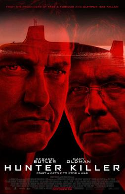
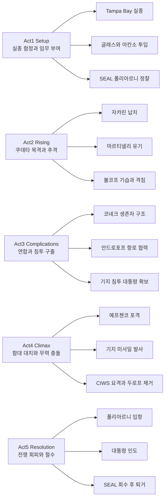

『크림슨 타이드』와 『붉은 10월』(The Hunt for Red October)가 떠오르는 잠수함 스릴러 클리셰를 한꺼번에 실은 작품이 바로 2018년의 **헌터 킬러(Hunter Killer)**다. 제라드 버틀러가 연기한 조 글래스는 “실전에서 한 번도 잠수함을 지휘해 본 적 없는” 이례적인 함장으로, 바렌츠해의 침몰 사건이 러시아 국내 쿠데타·핵 대치로 이어지는 가운데 잠수함과 네이비실을 아우르며 대통령 구출이라는 말도 안 되는 임무를 떠맡는다. 비평가 점수는 낮았지만 관객 반응은 그보다 온화했고, 잠수함 판타지를 즐기는 이에게는 여전히 한 번쯤 볼 만한 B급 스펙터클이다.

||
|:---:|
|*Hunter Killer (2018) — theatrical poster (fair use, Wikipedia)*|

## 개요

### 영화 정보

* **제목**: Hunter Killer / 헌터 킬러
* **감독**: Donovan Marsh (도노번 마시)
* **각본**: Arne Schmidt, Jamie Moss
* **원작**: George Wallace, Don Keith 소설 *Firing Point* (2012)
* **주연**: Gerard Butler (조 글래스 함장), Gary Oldman (합참의장 찰스 도너건), Common (존 피스크 해군 소장), Michael Nyqvist (세르게이 안드로포프 함장), Linda Cardellini (제인 노퀴스트, NSA), Toby Stephens (빌 비먼 SEAL 대장)
* **조연·기타**: Zane Holtz (마르티넬리), David Gyasi (COB 월라시), Michael Gor (듀로프 국방장관), Alexander Dyachenko (자카린 대통령) 등
* **촬영**: Tom Marais
* **편집**: Michael J. Duthie
* **음악**: Trevor Morris
* **장르**: 액션, 스릴러, 전쟁(군사 스펙터클)
* **상영시간**: 121분
* **등급**: 미국 R / 한국 15세 이상 (배급 시점 기준 참고)
* **개봉일**: 2018.10.26(미국), 2018.10.19(영국), 2018.12.06(한국)
* **제작**: Millennium Media, Original Film, G-BASE 등
* **배급**: Summit Premiere(라이언스게이트)
* **제작비·흥행**: 제작비 약 4,000만 달러, 전 세계 매출 약 3,170만 달러(흥행 부진으로 보고됨)
* **평점(참고)**: Rotten Tomatoes 비평가 38%대(집계 시점에 따라 변동), Metacritic 메타스코어 43/100, IMDb 가중 평균 약 6.6/10, 북미 개봉 주말 약 670만 달러 수준

### 추천 대상

* **잠수함·군사 스릴러 매니아**: 소나·어뢰·수압의 긴장을 좋아하는 관객
* **제라드 버틀러 액션 팬**: 『올림포스 데 오브』 시리즈와 비슷한 톤의 밀리터리 히어로 서사를 기대하는 경우
* **냉전 이후 미·러 판타지 플롯**: “서로 맞서지만 결국 대화와 구출로 위기를 넘긴다”는 단순화된 지정학 드라마를 가볍게 보고 싶은 경우

## 구조 분석 (Act 5)

## 영화의 전체 내용 (스포일러 포함)

이하는 이미 관람한 독자를 위한 **완전 스포일러** 재구성이다. 바렌츠해에서 미 해군 로스앤젤레스급 잠수함 USS Tampa Bay가 러시아 아쿨라급 RFS Konek을 추적하다 연락이 두절된다. 해군 소장 존 피스크는 버지니아급 USS Arkansas의 지휘를, 실전 지휘 경험이 없는 **조 글래스**에게 맡긴다. 동시에 빌 비먼이 이끄는 네이비실 팀이 머만스크 주 **폴리아르니** 러시아 해군 기지를 은밀히 관찰하러 간다.

### Act 1 (Setup): 북극해의 공백

**[S01] 바렌츠해 추적**: Tampa Bay가 Konek을 따라가다 신호가 끊기며 실종된다.

**[S02] 새 함장 투입**: 피스크는 글래스를 Arkansas 함장으로 임명하고, 사건 조사·대응을 명한다.

**[S03] SEAL 정찰 개시**: 비먼 팀이 폴리아르니 외곽에서 기지 동태를 포착하기 시작한다.

### Act 2 (Inciting & Rising): 쿠데타와 추격

**[S04] 쿠데타 목격**: 국방장관 **드미트리 두로프**가 쿠데타를 일으켜 **니콜라이 자카린** 대통령을 체포한다. SEAL들은 이것이 전쟁 도발의 전주곡임을 직감한다.

**[S05] 마르티넬리 유기**: 러시아 측 무전 점검과 총격이 이어지고, 다리에 총상을 입은 **폴 마르티넬리**를 팀은 떠나며 남겨 둔다.

**[S06] Tampa Bay의 잔해**: Arkansas가 Tampa Bay 잔해를 발견하나 생존자는 없다.

**[S07] Konek의 침몰**: 침몰한 Konek이 외부 타격이 아닌 **내부 파손** 흔적을 보인다는 점이 밝혀진다.

**[S08] 얼음 아래 매복**: 또 다른 아쿨라급 **RFS Volkov**가 빙산 밑에 숨어 Arkansas를 기습한다. Volkov가 Tampa Bay를 어뢰로 격침했음이 드러난다.

**[S09] 역습**: 글래스가 반격에 성공하고 전투가 종료된다.

### Act 3 (Complications): 적과의 항로

**[S10] 러시아 생존자**: Arkansas는 Konek 생존자를 구조하고, 그중 함장 **세르게이 안드로포프**가 글래스 앞에 선다.

**[S11] 워싱턴의 결단**: 미 정부가 쿠데타를 파악하고, 합참의장 도너건은 전쟁 준비를 주장하지만 피스크·글래스 노선은 **자카린 구출** 쪽으로 기운다.

**[S12] 미드포인트 - 안드로포프의 항로**: 글래스는 안드로포프를 설득해, 기지 인근 수로와 기뢰밭을 안내하게 한다. 러시아 함장의 지식이 미국 잠수함의 생존 열쇠가 된다.

**[S13] 함내 신뢰**: 승조원들은 함에 오른 러시아 장교를 불신하지만, 글래스는 협력을 관철한다.

**[S14] 오레그 구출**: 비먼 팀이 자카린을 지키다 부상당한 경호 요원 **오레그**를 구출해 협력 관계를 만든다.

**[S15] 기지 침투와 희생**: 팀은 기지에 잠입해 자카린을 확보하나 **오레그**, **데빈 홀**, **맷 존스톤**이 전사한다.

**[S16] DSRV 이송**: 마르티넬리가 저격으로 엄호하고, 비먼은 부상한 대통령을 **심해 구조함(DSRV)**으로 Arkansas까지 옮긴다.

**[S17] 동료 회수**: 비먼이 다시 기지로 돌아가 마르티넬리를 데려온다.

### Act 4 (Climax): 함포와 미사일 사이

**[S18] 함대 동원**: 미·러 함대가 충돌 직전의 대치에 들어간다.

**[S19] 예프첸코의 공격**: 우달로이급 구축함 **RFS Yevchenko**가 술트레프 함장 지휘로 Arkansas를 공격한다. 술트레프는 두로프 일파다.

**[S20] 신호**: 안드로포프가 옛 부하들에게 **대통령이 잠수함에 있다**는 사실을 알린다.

**[S21] 기지에서의 미사일**: 두로프는 떠오른 Arkansas를 향해 기지에서 미사일 발사를 명한다.

**[S22] 글래스의 판단**: 글래스는 맞미사일로 맞대응하지 않기로 해, 도발의 고리를 끊으려 한다.

**[S23] 클라이맥스 - 함교의 반란**: Yevchenko 승조원이 명령을 거역하고 **CIWS**로 날아오는 미사일을 요격한다. 이어 함포·미사일로 기지 사령부를 타격해 **두로프를 제거**한다.

### Act 5 (Resolution): 폴리아르니에서의 종료

**[S24] 입항과 인도**: 전면전을 피한 뒤 Arkansas가 폴리아르니에 입항해 자카린과 Konek 생존자들을 러시아 측에 넘긴다.

**[S25] 철수**: 비먼과 마르티넬리를 승선시키고, 러시아 해군의 호위 아래 기지를 빠져나간다.

### 쿠키 영상

극장 일반판 기준 **미드·포스트 크레딧 쿠키는 없다**고 보는 것이 타당하다.

## 캐릭터 분석

### 조 글래스 (Gerard Butler)

**개요**: 버지니아급 잠수함의 함장으로, 스크린에서는 “경험 부족”이 강조되지만 곧바로 냉정한 판단과 임기응변으로 무장한다.

**성장 곡선**: 개인의 불안에서 출발해, 러시아 함장과의 신뢰·승조원 설득·발사 거부 같은 도덕적 선택을 통해 “개인이 전쟁 기계를 멈추는” 서사 축을 맡는다.

**동기와 욕망**: 임무 완수와 승조원 생존, 그리고 확전 방지라는 명령 체계 안에서의 최선.

**갈등 구조**: 펜타곤의 강경론(도너건의 태도)과의 간극, 함내 반러시아 정서와의 충돌.

**상징적 의미**: 톰 랜시식 “전문가 영웅”의 단순화된 버전—관객이 군사 판타지에 쉽게 동화되도록 설계된 아바타에 가깝다.

### 세르게이 안드로포프 (Michael Nyqvist)

**개요**: 패배한 러시아 잠수함의 지휘관으로, 적국 함정에 구조되지만 결국 공동 작전의 핵심 안내자가 된다.

**성장 곡선**: “적”에서 “필연적 동맹”으로 이동하며, 개인적 명예와 조국 지도자 구출이라는 목표가 겹친다.

**상징적 의미**: 냉전 이후 할리우드가 반복해 온 **“선한 러시아 장교”** 아키타입—체제 전체를 비난하지 않고, 권위주의적 반역자만 배제한다는 서사적 편의가 분명하다. 니크비스트는 본작이 개봉하기 전 사망한 배우로, 본 역은 그의 **말년 필모그래피**에서 의미 있는 조연이다.

### 찰스 도너건 (Gary Oldman)

**개요**: 합참의장으로, 위기 상황에서 고함과 독설로 긴장을 높인다.

**갈등 구조**: 즉각 보복과 전쟁 준비를 외치는 **강경 파**의 얼굴이지만, 서사 후반에서는 피스크·글래스 라인이 실질적 해결책이 된다.

**상징적 의미**: 관객에게 “지금 정말 핵이 날아갈 뻔했다”는 인상을 주는 연출 장치에 가깝고, 올드먼의 연기 에너지는 B급 각본의 설득력을 끌어올린다.

### 빌 비먼 (Toby Stephens)과 SEAL 팀

**개요**: 지상·기지 팀 액션을 담당하며 잠수함 파트와 교차 편집된다.

**성장 곡선**: 전술적 희생(동료 유기와 재진입)을 통해 “말 안 되는 임무”의 인간 비용을 보여 준다.

## 상징과 메타포 분석

### 시각적 상징

* **잠수함 내부의 청·적 조명과 좁은 통로**: 클로스트로포비아는 단순한 미학이 아니라 “정보와 명령이 지연·왜곡되는 군사 조직”의 은유로 기능한다.
* **빙산·북극해**: 보이지 않는 적(Volkov)과 가시성 제로의 전장—현대 전쟁 담론에서 늘 반복되는 **투명성 부재**를 자연 환경으로 상징화한다.

### 서사적 메타포

* **“대통령 구출”**: 지정학적 현실의 복잡성을 잠시 내려놓고, **한 번의 특수 작전으로 역사를 되돌린다**는 비현실적 위안을 제공하는 판타지 구조다.
* **두로프 대 자카린**: “반역자 국방장관 vs 온건한 지도자”의 이분법은 서사를 단순하게 유지하기 위한 장치다.

### 사회적·문화적 맥락

2014년 이후 악화된 서방·러시아 관계 속에서, 본작은 우크라이나·러시아에서 **상영 허가 논란**을 겪었다(우크라이나는 “침략국 군대의 긍정적 묘사” 우려, 러시아는 심의·제출 일정 문제 등이 보도됨). 즉 작품은 단순한 오락을 넘어 **당시 정치 담론과 충돌**하기도 했다.

## 제작 비화

### 기획과 제작 과정

원안은 2008년 무렵 릴래티비티가 스펙 각본을 인수한 뒤로 거슬러 올라가며, 필립 노이스, 앙투안 퓨쿠아, 마틴 캠벨 등 여러 감독이 거론되다 **개발 지옥**을 거쳤다. 2016년 **도노번 마시**가 연출을 맡고 런던·불가리아에서 촬영이 진행되었다.

### 기술·로케이션

* **이일링 스튜디오**: 미 해군 승인 도면을 바탕으로 버지니아급 내부 세트를 짓되, 카메라 워크를 위해 공간을 약간 확장했다. **짐벌**로 흔들림을 재현했다는 보도가 있다.
* **핀우드·리브스던 수조**: 외부 잠수함·수중 촬영에 대형 수조를 사용했다.
* **불가리아 뉴보야나**: 러시아 기지 내부 세트를 소피아 인근 스튜디오에서 구축하고, 바르나 해군 기지 일대가 외경으로 쓰였다는 자료가 있다.
* **미 해군 협력**: 감독이 샌디에이고 인근에서 실제 핵추진 공격 잠수함을 시찰했다는 보도와 함께, 군사 고문·장비 정확도를 내세운 홍보가 이어졌다.

### 디테일 논란

위키백과 등에 따르면 SEAL 복장에 **실제 미 해군이 쓰지 않는 위장 무늬**가 쓰였다는 지적도 있다—밀리터리 팬에게는 감점 요인이 될 수 있다.

## 감독 분석

### 도노번 마시의 위치

남아프리카 출신으로 TV·영화를 오간 마시는 『스퍼드』 시리즈, 『데스 레이스 2』 등에서 장르적 연속성을 쌓아 왔다. 본작은 그의 할리우드 스튜디오급 **군사 액션** 진입작에 해당한다.

### 이 작품에서의 연출

* **교차 편집**: 잠수함의 서늘한 긴장과 SEAL의 지상 액션을 맞물려 러닝타임 내내 속도를 유지하려 한다.
* **군사 클리셰의 자기 인식 부족**: 비평에서 지적되듯 『붉은 10월』 『크림슨 타이드』 『론 서바이버』 등을 오마주 수준으로 겹쳐 놓았다는 평이 많다—재미는 있으나 신선함은 제한적이다.

## 영상미와 음악

### 시각·미장센

푸른·회색 톤의 함내 조명, HUD·소나 디스플레이의 반복, 폭발과 물보라의 디지털 합성이 **할리우드 표준 밀리터리 룩**을 완성한다. 실제 세트와 탱크 촬영이 합쳐져, TV 무비 이상의 스케일은 확보된다.

### 트레버 모리스의 음악

모리스는 버틀러 주연의 밀리터리 액션과 인연이 깊다(『올림포스 데 오브 폴른』 등). 본작에서는 **저음 현악·타악의 구동 리듬**으로 잠수함 추격과 펜타곤 씬의 시계 초침 같은 긴박함을 보강한다. 사운드트랙 음반은 2018년 10월 26일 무렵 디지털 발매(레이크쇼어 레이블)로 정리된다.

## 종합 평가

### 최종 평점: ★★★☆☆ (3.5/5.0)

**장점**:

* 잠수함 대 잠수함, 기뢰밭 돌파, 최종 함대 대치까지 **장르적 욕망을 충실히 채우는** 전개
* 버틀러·니크비스트의 상호 신뢰 라인이 감정적 닻 역할
* 실제 세트·해군 자문을 내세운 **디테일과 스케일**

**단점**:

* 지정학·군사 절차를 지나치게 단순화한 각본
* 올드먼 캐릭터의 과장된 분노 연기가 취향을 탄다
* 비평가 기준으로는 클리셰·모방 논쟁에서 자유롭지 못함

### 한 줄 평

“클리셰를 정직하게 쌓아 올린, 차가운 바다판 올림포스 데 오브.”

### 추천 작품

* [《크림슨 타이트》(1995)](https://en.wikipedia.org/wiki/Crimson_Tide_(film)): 잠수함 함내 쿠데타와 핵 위기의 고전
* [《The Hunt for Red October (붉은 10월)》(1990)](https://en.wikipedia.org/wiki/The_Hunt_for_Red_October_(film)): 러시아 잠수함·지정학 스릴러의 원조 격
* [《캡틴 필립스》(2013)](https://en.wikipedia.org/wiki/Captain_Phillips_(film)): 해상·특수부대 현실 톤을 원할 때

### 관람 전 체크리스트

* 사전 지식이 필요한가? **특수하지 않음**—미·러 대립과 잠수함 용어만 대략 알면 충분하다.
* 어린이와 함께 볼 수 있는가? **미국 R 등급·폭력·잔혹 묘사**를 고려해 가족 관람은 신중히.
* 특정 요소를 기대해도 되는가? **잠수함 액션, 지상 특수부대, 펜타곤 정치 씬**을 기대하면 맞는다.
* 쿠키 영상이 있는가? **없음**(일반 극장 기준).
* 속편 가능성은? **낮음**—박스오피스와 완결적 에필로그로 보아 시리즈화 가능성은 제한적이다.

## 참고 문헌 및 출처

- [Hunter Killer (film) — Wikipedia](https://en.wikipedia.org/wiki/Hunter_Killer_(film))
- [Hunter Killer — The Movie Database (TMDB)](https://www.themoviedb.org/movie/399402-hunter-killer)
- [Hunter Killer — Rotten Tomatoes](https://www.rottentomatoes.com/m/hunter_killer)
- [Hunter Killer Reviews — Metacritic](https://www.metacritic.com/movie/hunter-killer/)
- [Hunter Killer (2018) — Box Office Mojo](https://www.boxofficemojo.com/title/tt1846589/)
- [Hunter Killer Soundtrack Details — Film Music Reporter](https://filmmusicreporter.com/2018/10/25/hunter-killer-soundtrack-details/)
