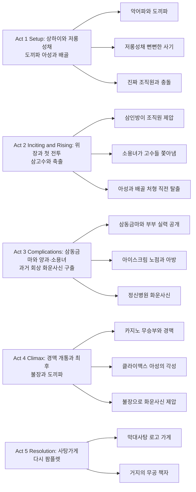

《Kung Fu Hustle (쿵푸 허슬)》(2004)는 주성치(Stephen Chow)가 감독·공동각본·제작을 맡고 주인공 **아성**(阿星, 영문 자막명 **싱**·Sing)으로 출연한 홍콩·중국 합작 무협 액션 코미디다. 1940년대 상하이를 배경으로 도끼파(Axe Gang)와 빈민가 **저롱성채**(猪籠城寨, 통칭 **돼지촌**·Pigsty Alley)의 충돌을 그리되, 숨은 무술 고수들과 과장된 만화적 특효, 쇼브라더스 시대 무협에 대한 오마주가 한데 섞인다. 《소림축구》(2001) 이후 컬럼비아 픽처스 아시아와 손잡고 제작 규모를 키운 작품으로, 홍콩 영화 금상장 작품상·무술지휘상 등과 금마장 감독상을 비롯해 국제 비평에서도 높은 평가를 받았다.

## 개요

### 영화 정보

* **제목**: Kung Fu Hustle / 쿵푸 허슬 (功夫; 통칭 **쿵푸허슬**로도 검색·표기됨)
* **감독**: Stephen Chow (주성치)
* **각본**: Stephen Chow, Huo Xin, Chan Man-keung, Tsang Kan-cheung (스토리: 주성치)
* **주연**: Stephen Chow (아성·싱), Danny Chan Kwok-kwan (브라더 섬·琛哥), Yuen Wah (양과·저롱성채 집주인), Yuen Qiu (소용녀·여주인), Leung Siu-lung (화운사신), Huang Shengyi (아방·팡)
* **무술 지휘**: 초반 촬영은 Sammo Hung (삼고홍)이 맡았으나 중도 하차 후 Yuen Woo-ping (원우평)이 이어받음
* **촬영**: Poon Hang-sang (항상푼)
* **편집**: Angie Lam (임안아)
* **음악**: Raymond Wong (황영화), 홍콩 중악단 연주 중심
* **장르**: Martial arts, Action comedy, Wuxia parody
* **상영시간**: 약 98분(영문 위키 기준) / 100분(한국어 위키·국내 안내에 따라 상이할 수 있음)
* **개봉일**: 2004.12.23 (홍콩·중국 등), 2005.01.25 (미국 일반 개봉), 2005.01.14 (대한민국, 한국어 위키 기준)
* **제작·배급**: Columbia Pictures Film Production Asia, Star Overseas 등 제작; 지역별로 화이브라더스·컬럼비아 트라이스타 등 배급
* **제작비**: 약 2,000만 달러(다수 출처 공통)
* **흥행**: 전 세계 약 1억 달러대 매출(출처별 소수 자리 차이), 북미에서는 2005년 최고 수익 외국어 영화 중 하나로 기록
* **평점(참고)**: Rotten Tomatoes 비평가 지지율 약 90%대, Metacritic Metascore 78/100, IMDb 사용자 평점 약 7.7/10 부근(집계 시점에 따라 변동)

### 추천 대상

* **홍콩 무협·코미디 팬**: 쇼브라더스풍 미장센과 《사조영웅전》 캐릭터 오마주, 과장된 액션 개그
* **특촬·만화적 연출을 좋아하는 관객**: 로드 러너식 추격, 《매트릭스 리로디드》식 군중전 오마주 등
* **《소림축구》 이후 주성치 필모를 이어 보고 싶은 관객**: 스케일과 브랜드 유머가 한층 확장된 작품

## 구조 분석 (Act 5단계)

## 영화의 전체 내용 (스포일러 포함)

이하는 관람 후 독자를 위한 장면별 정리다.

### Act 1 (Setup): 악명 높은 도시와 하찮은 사기꾼

**[S01] 악어파와 도끼파**: 1940년대 상하이, 경찰까지 누르던 악어파가 클럽에서 도끼파에 포위당하고, 브라더 섬이 이끄는 도끼파가 잔혹하게 조직을 소탕한다.

**[S02] 저롱성채(돼지촌)**: 도끼파의 칼날이 닿지 않는 빈민가 저롱성채. **아성**과 그 오른팔 **배골**(排骨·Bone)은 도끼파 행세로 주민들에게 돈을 뜯으려 하지만 실제로는 싸움도 못 하는 허세다.

**[S03] 도화선**: 아성이 도끼파 **부두목** 머리에 폭죽을 던지며 진짜 조직원들이 개입하고, 주민을 죽이려던 부두목이 정체불명의 힘에 날아가 쓰러진다. 도끼파 본대가 들이닥친다.

**[S04] 세 명의 주민**: **고력강**(짐꾼·Coolie)·**재봉승**(재단사·Tailor)·**유작귀**(분식집 주인·찐빵·Donut)로 불리는 세 입주자가 사실 각기 다른 문파의 고수임이 드러나 도끼파를 순식간에 제압한다.

**[S05] 소용녀의 결정**: 도끼파의 보복을 두려워한 저롱성채 **소용녀**(여주인)가 세 고수를 마을에서 쫓아낸다.

### Act 2 (Inciting & Rising): 가입 조건과 어린 시절의 상처

**[S06] 사칭의 대가**: 도끼파에게 잡힌 아성과 배골은 브라더 섬에게 처형당할 뻔하나 자물쇠 따기로 탈출해 “누군가를 죽이면 입단” 제안을 받는다.

**[S07] 회상**: 아성은 어릴 적 거지에게 속아 무공 책자를 샀고, 불장을 연습해 말 못하는 소녀 **아방**(阿芳·통칭 **팡**)을 구하려다 오히려 맞고 굴욕당했음을 떠올린다. “영웅은 이기지 못한다”는 믿음 아래 악당이 되기로 한다.

**[S08] 실패한 암살**: 두 사람이 소용녀를 노리고 돌아오지만 칼은 아성에게 꽂히고 뱀에게 물리는 등 개그처럼 실패하고, 소용녀에게 쫓겨난다.

**[S09] 신비한 회복**: 교통 안전대 위로 도망친 아성의 상처가 순식간에 아문다.

### Act 3 (Complications): 삼동금마, 부부 고수, 화운사신

**[S10] 삼동금마(고금 암살자)**: 브라더 섬이 거문고(고쟁)를 무기로 쓰는 **삼동금마** 형제—**천잔**(天殘)·**지결**(地缺)—를 고용해 세 고수를 제거한다.

**[S11] 양과와 소용녀**: 그러나 **소용녀**와 남편 **양과**(집주인)가 숨은 실력자로서 암살자를 무너뜨린다.

**[S12] 아이스크림과 아방**: 다음 날 아성이 노점을 털려다 상인이 아방임을 알고, 그녀가 건네는 막대사탕을 과거의 수치로 기억하며 부순 뒤 떠난다.

**[S13] 화운사신**: 브라더 섬은 아성에게 정신병원에 갇힌 전설의 살수 **화운사신**(火雲邪神, 별칭 **야수**·The Beast)을 풀어오면 즉시 입단시키겠다고 한다. 아성은 성공한다.

**[S14] 총알과 무승부**: 느슨한 차림의 화운사신이 총알을 잡아 멈추는 모습에 도끼파가 굴복하고, 화운사신은 양과·소용녀 부부와 카지노에서 격전을 벌이나 팽팽한 무승부로 끝난다.

### Act 4 (Climax): 경맥, 도끼파, 불장

**[S15] 미드포인트 이후 전환**: 잘못을 깨달은 아성이 브라더 섬과 화운사신을 향해 덤비고, 화운사신의 반격이 오히려 아성의 임맥·독맥을 열어 잠재된 무재를 깨운다.

**[S16] 브라더 섬의 최후**: 화운사신이 분노한 브라더 섬을 제거하고 도끼파 수장 자리를 차지한다.

**[S17] 클라이맥스 - 각성**: 저롱성채에서 깨어난 아성은 타고난 무술 천재로 거듭나 수백 명의 도끼 조직원을 압도한다.

**[S18] 불장 대 화운사신**: 화운사신과의 최종 대결에서 아성은 압도적인 **불장(如來神掌 계열)** 으로 그를 굴복시킨다.

### Act 5 (Resolution): 다시 선택하는 길

**[S19] 사탕가게**: 아성과 배골은 아방의 막대사탕을 로고로 한 가게를 연다. 아방이 찾아와 두 사람은 어린 시절처럼 손을 잡는다.

**[S20] 엔딩 - 책장수**: 아성에게 책자를 팔았던 거지가 길에서 또 다른 무공 비급을 파는 장면으로 마무리된다.

## 상징과 메타포 분석

### 시각적 상징

* **저롱성채(돼지촌)**: 화려한 도시의 그늘에 남은 공동체이자, 《칠십이가거방》(1973) 등 홍콩 빈민 밀집 주거의 영화적 재현에 가깝다. 일각에서는 구 **구룡성채**의 상상적 대응으로 읽기도 한다.
* **나비(도입부)**: 변신과 각성의 암시로 자주 거론되는 시각 모티프다.
* **만화적 왜곡**: 신체·속도·충돌을 과장해 “사실적 무협”이 아니라 **장르 자체를 놀이**로 드러낸다.

### 서사적 메타포

* **영웅과 악당**: 아성의 회상은 “선이 이긴다”는 동화적 믿음이 현실에서 깨지는 경험을 보여 주고, 성장 서사는 다시 **선택**으로 되돌아온다.
* **양과·소용녀와 《사조영웅전》**: 신조협려의 **양과**·**소용녀**에 빗대 자칭하는 장면은 무협 텍스트를 관객과 공유하는 **쌍방향 농담**이다.

### 핵심 주제 의식

* **표면 주제**: 약자의 반격, 숨은 재능, 조폭 조직에 맞선 연대.
* **심층 주제**: 홍콩·중국 영화가 무술 영화 전통을 **오마주와 패러디**로 재가공하며 글로벌 관객과 대화하는 방식.
* **문화적 맥락**: 2000년대 초반 합작·할리우드 자본이 들어온 대작 한편으로, 주성치 특유의 **모이레토우(無厘頭)** 유머와 액션 블록버스터 문법이 접합된다.

## 제작 비화

* **Pigsty Alley 설계**: 주성치는 어린 시절 홍콩의 밀집 주거 경험과 《칠십이가거방》 등에서 영감을 얻어 세트를 약 4개월간 건축했고, 골동품 가구를 전국에서 모았다는 설명이 전해진다.
* **무술 팀 교체**: 삼고홍이 야외 촬영·건강·다른 프로젝트·제작진과의 마찰 등으로 이탈한 뒤 원우평이 투입되어 《와호장룡》《매트릭스》 계열 경험을 가져왔다.
* **캐스팅 에피소드**: 원추(소용녀)는 오디션이 아니라 지인 시사 중 담배를 피우는 모습이 감독 눈에 들어 캐스팅되었다는 일화가 알려져 있다. 양소룡(화운사신)은 오랜 공백 뒤 복귀작으로, 첫 화운사신 장면은 여러 테이크를 거친 것으로 보도된다.
* **CGI**: Centro Digital Pictures 등이 《소림축구》《킬 빌》 등에서 쌓은 경험을 이어받아 와이어와 합성을 결합했고, 최종 색 보정 데이터를 미국에서 마스터링하기도 했다.
* **오디션 규모**: 아방 역의 황성의는 수천 명 규모 오디션에서 뽑혔다는 인터뷰가 있다.

## 감독 분석

* **주성치의 필모**: 《대내탐영지령》에서 다져진 코미디 연기에서 《소림축구》로 판타지 스포츠를 열고, 《쿵푸 허슬》에서는 **무협 장르 전체**를 놀이터로 확장한다.
* **연출 선택**: 한 장면 한 장면이 개별 **스케치**처럼 강하지만, 도입부부터 엔딩 거지까지 **아성의 욕망(조직원 되기 → 진짜 무인 되기)** 이 서사의 축을 이룬다.
* **간접 인용의 밀도**: 《샤이닝》《스파이더맨》《대부》《매트릭스 리로디드》 등 서구 블록버스터와 홍콩 영화를 한 타임라인에 겹쳐, 숙련된 관객에게는 **쌍코드**로 읽힌다.

## 캐릭터 분석

### 아성 (주성치)

**개요**: 조직에 들어가 “나쁜 놈”이 되고 싶은 하류 사기꾼이지만 몸은 이미 천재 무인의 재질을 갖는다. 옆에서 민폐 개그를 담당하는 동료 **배골**(임자총)과 짝을 이룬다.

**성장 곡선**: 영웅 실패의 트라우마 → 악당 행세 → 죄책과 연민(아방) → 경맥 개통 후 자아 통합.

**동기와 욕망**: 처음은 인정욕과 생존, 후반은 보호와 속죄에 가깝다.

**갈등 구조**: 바깥의 조폭 논리와 안의 도덕적 기억 사이.

**상징적 의미**: 무협 영화가 즐겨 쓰는 **천재형 주인공**을 코미디 톤으로 풀어, 장르 클리셰를 비꼬면서도 완성한다.

### 양과·소용녀 (원화·원추)

**개요**: 저롱성채 **집주인 양과**와 **여주인 소용녀**. 층간소음과 욕설로 코믹한 부부이자 각각 태극권·사자후(대나팔 초식으로 증폭)에 능한 최종병기급 고수. 과거 아들을 잃은 뒤 강호를 떠나 은둔했으나 도끼파와 삼동금마·화운사신의 위협으로 다시 실력을 드러낸다.

**성장 곡선**: 정체만 공개될 뿐 심리 성장은 적고, **공동체 방패** 역할에 집중한다.

**상징적 의미**: 노장 무술 영화의 **은둔 고수** 원형을 과장과 가정 코미디로 비튼다.

### 화운사신 (양소룡)

**개요**: 정신병원에 갇힌 전설의 살수 **화운사신**. 작중 별칭 **야수**(The Beast). 겉모습과 달리 압도적 파괴력.

**갈등 구조**: 힘에 대한 자신감과 패배 인정 사이.

**상징적 의미**: 무협에서 “마교”적 위험 인물에 가깝게 그리되, 최후에는 굴복과 화해 쪽으로 무게를 둔다.

### 브라더 섬 (진국곤)

**개요**: 도끼파의 야망 있는 두목. 《무간도》 한심(韓琛)에서 따온 이름 설정으로, 홍콩 갱스터 영화와의 대화를 노골화한다.

**상징적 의미**: 조직 폭력의 **이데올로기 없는 잔혹함**을 대표한다.

## 영상미와 음악

### 시각 효과 / 촬영 / 미학

* **2.35:1 와이드**에 가까운 시네마 스코프 비율과 35mm 촬영이 클래식 무협 스펙터클을 연상시킨다.
* **항상푼**의 조명·구도는 액션과 코미디가 동시에 읽히도록 인물과 군중의 실루엣을 살린다.
* **의도적으로 눈에 띄는 CGI**: 사실 재현보다 **만화적 관성과 변형**을 선택해 《톰과 제리》·로드 러너식 추격과 무협을 접목한다.

### 음악

* **황영화**의 편곡은 1940년대 무협 영화 음악을 연상시키는 관현악과 민속 선율을 섞고, **사라사테《집시의 노래》**, **하차투리안《칼춤》** 등 서양 클래식 인용이 장면의 희극성·비장함을 동시에 부추긴다.
* 성의가 부른 **《只要為你活一天》**(옛 가요)는 엔딩의 향수를 고조시킨다.
* 사운드트랙은 지역별로 트랙 수가 다른 버전이 출시되었다.

## 종합 평가

### 최종 평점: ★★★★★ (4.7/5.0)

**장점**:

* 무협·갱스터·슬랩스틱·특촬 오마주를 한 편에 녹여 **관람 밀도**가 매우 높다.
* 원화·원추·양소룡 등 **전성기 홍콩 액션 세대**의 부활이 기록적이다.
* 비평·흥행 모두에서 주성치 작품의 **국제적 도약**을 입증했다.

**단점**:

* 캐릭터 심리는 **원색적**이라 깊은 드라마를 기대하면 빈곤하게 느껴질 수 있다.
* 오마주를 모르면 일부 개그가 **순간적으로만** 웃긴다.

### 한 줄 평

“홍콩 무협을 만화와 블록버스터 문법으로 재부팅한, 주성치식 장르 총합 엔터테인먼트.”

### 추천 작품

* 《Shaolin Soccer (소림축구)》(2001): 직전 작으로 같은 **과장 특효·팀전개**의 맛을 이어 볼 수 있다.
* 《Crouching Tiger, Hidden Dragon (와호장룡)》(2000): “진지한 무협 스펙터클” 쪽 대비축으로 보면 《쿵푸 허슬》의 패러디 각이 선명해진다.
* 《The Matrix Reloaded (매트릭스 2: 리로디드)》(2003): 군중 복제 전투 오마주의 원전을 짚고 보면 재미가 배가된다.

### 관람 전 체크리스트

* 사전 지식이 필요한가? **필수는 아니다. 다만 홍콩 무협·할리우드 블록버스터를 알수록 인용이 보인다.**
* 어린이와 함께 볼 수 있는가? **한국에서는 15세 관람가로 안내된 사례가 많다. 폭력·코미디적 잔혹 묘사가 잦다.**
* 특정 요소를 기대해도 되는가? **과장 액션, 슬랩스틱, B급 감성의 특효를 기대하면 만족도가 높다.**
* 쿠키 영상이 있는가? **극장판 기준 전통적 의미의 쿠키는 없고, 본편 마지막 거지 장면이 여운을 담당한다.**
* 속편 가능성은? **당시 속편 논의가 있었으나 장기 공백 뒤 《쿵푸 허슬 2》는 별도 프로젝트로 간헐히 보도되는 수준이다(확정 개봉 일정은 변동 가능).**

## 결론

《쿵푸 허슬》은 “무술 영화를 존중하는가, 놀리는가”라는 가짜 이분법을 깨고 **둘 다 해낸** 작품이다. 저롱성채(돼지촌)의 웃픈 일상은 곧바로 피와 소음의 스펙터클로 전환되고, 그 뒤에는 다시 막대사탕과 손잡음 같은 **동화적 이미지**가 놓인다. 한국에서도 2005년 개봉 당시 홍콩 영화로서 이례적인 흥행을 기록했고, 이후 OTT와 리마스터·3D 재개봉을 통해 세대를 넘겨 받을 만한 **현대 무협 코미디의 기준점**으로 남아 있다.

## 참고 문헌 및 출처

* [Kung Fu Hustle — Wikipedia (English)](https://en.wikipedia.org/wiki/Kung_Fu_Hustle)
* [쿵푸 허슬 — 위키백과 (한국어)](https://ko.wikipedia.org/wiki/%EC%BF%B5%ED%91%B8_%ED%97%88%EC%8A%AC)
* [Kung Fu Hustle — IMDb](https://www.imdb.com/title/tt0373074/)
* [Kung Fu Hustle — Rotten Tomatoes](https://www.rottentomatoes.com/m/kung_fu_hustle)
* [Kung Fu Hustle (soundtrack) — Wikipedia](https://en.wikipedia.org/wiki/Kung_Fu_Hustle_(soundtrack))
