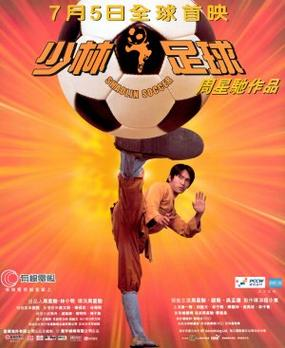
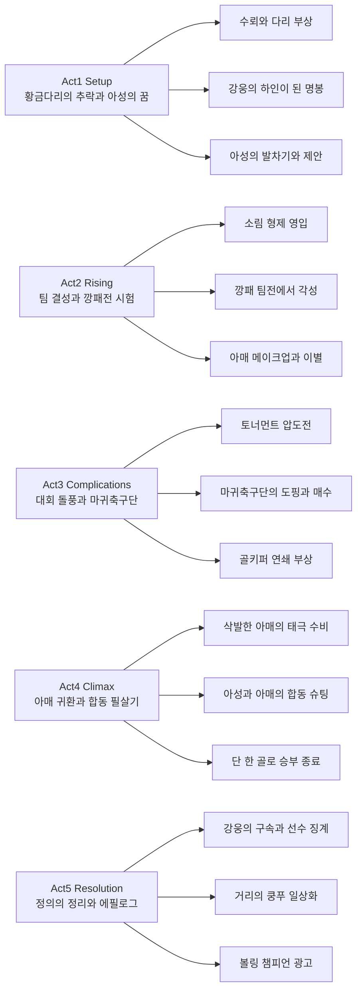

《**소림축구**》(영어 제목 *Shaolin Soccer*)는 “축구 경기”라기보다 **쿵푸 쇼가 골대까지 확장된 스펙터클**에 가깝다. 주성치(Stephen Chow)가 감독·각본·주연을 맡아 소림 무술을 현대 스포츠에 겹쳐 놓고, 관객이 “이게 말이 되나?”라고 말하는 순간을 오히려 **웃음의 트리거**로 쓴다. 2000년대 초 홍콩에서 흥행 기록을 경신한 뒤 해외에서도 컬트적 인기를 얻었고, 오늘날까지 **스포츠·무술·코미디를 한 번에 긁어 주는 입문 텍스트**로 자주 회자된다.

||
|:---:|
|*Shaolin Soccer (2001) — theatrical poster (fair use; Wikipedia: ShaolinSoccerFilmPoster.jpg)*|

## 개요

### 영화 정보

* **제목**: Shaolin Soccer / 《소림축구》(한국 개봉·비디오·OTT 통용 표기)
* **감독·각본·주연**: Stephen Chow (주성치)
* **각본 공동**: Tsang Kan-cheung (증근창)
* **주연·주요 출연**: **아성**(阿星, 주성치), **명봉**(明鋒, 오맹달·일명 ‘황금다리’), **아매**(阿梅, 조위), **강웅**(強雄, 사현), 소림축구단(대사형 **아비** 황일비, 이사형 **묘자** 막미림, 삼사형 **전계** 전계문, 사사형 **소룡** 진국곤, 막내 **비자총** 임자총 등), 마귀축구단(9번 **석자운**, 골키퍼 **조화** 등)
* **음악**: Lowell Lo (盧冠廷), Raymond Wong Ying-wa (黃英華 등 표기)
* **촬영**: Kwen Pak-Huen, Kwong Ting-wo (관백유·광정화 등 표기 이질 있음)
* **무술 연출**: Ching Siu-tung (경소동) 등(시상·크레딛 기준)
* **장르**: 스포츠 코미디, 무술 액션, 판타지에 가까운 과장 VFX
* **상영시간**: **편집·배급판에 따라 상이**(영어 위키 기준 홍콩 상영 약 112분; 한국어 위키 등에는 DVD·미국판 등 더 짧은 러닝타임 병기)
* **개봉일**: 2001년 7월 중순(홍콩, 자료에 따라 12일·21일 등 상이) / 2002.05.17(대한민국, 한국어 위키 기준) 등 지역별 상이
* **제작·배급**: Star Overseas Ltd, Universe Entertainment Ltd(홍콩) 등; 미국에서는 Miramax가 판권·편집 배급에 관여
* **제작비·흥행(참고)**: 제작비 약 1,000만 달러, 전 세계 매출 약 4,280만 달러(영어 위키); 홍콩에서는 당시 **역대 최고 매출**을 기록했다가 이후 《쿵푸 허슬》에 넘겼다는 서술이 일반적이다.

### 추천 대상

* **홍콩 코미디·주성치 입문**: 《코미디의 왕》《쿵푸 허슬》로 이어지는 톤의 “과장 개그 + 액션”을 한 번에 보고 싶은 관객
* **축구 영화이지만 리얼리티는 기대하지 않는 사람**: 경기 규칙보다 **비주얼 개그**를 즐기는 쪽이 만족도가 높다.
* **2000년대 초 CGI·홍콩 영화사 흐름에 관심 있는 사람**: VFX와 코미디의 결합, 그리고 제목·심의를 둘러싼 **중국 본토 배급 논란** 등 당대 맥락을 함께 읽을 수 있다.

### 등장 인물 (한국어 자막·출연표에서 흔한 표기)

1. **주요 인물**
   * **아성**(阿星) — 주성치(周星馳)
   * **명봉**(明鋒) — 오맹달(吳孟達)
   * **아매**(阿梅) — 조위(赵薇)
   * **강웅**(強雄) — 사현(謝賢)
2. **소림축구단**
   * 대사형 **아비**(阿飛) — 황일비(黃一飛)
   * 이사형 **묘자** — 막미림(莫美林)
   * 삼사형 **전계** — 전계문(田启文)
   * 사사형 **소룡** — 진국곤(陳國坤)
   * 막내 **비자총** — 임자총(林子聰)
   * 기타 선수 — 단역·엑스트라 다수
3. **마귀축구단**
   * 등번호 9번 — 석자운(释子云)
   * 골키퍼 — 조화(曹华)
4. **기타**
   * 심판 — 단역
   * 만터우 가게 주인 — 서미나(徐美娜)
   * 미용실 주인 — 이건인(李健仁)
   * 동네 깡패 축구단 주장 — 풍면항(馮勉恆)
   * **장폭**(醬爆) — 하문휘(何文輝)
   * 돼지장수 아저씨(豬肉佬) — 양능(楊能)
   * 산서 두부팀 주장 — 곡덕소(谷德昭)
   * 옥면쌍비룡 7번 — 장백지(張柏芝)
   * 옥면쌍비룡 11번 — 막문위(莫文蔚)

## 구조 분석 (Act 5)

## 영화의 전체 내용 (스포일러 포함)

이하는 **이미 관람한 독자**를 위한 장면별 정리다. 웹백과·한국어 위키 등의 플롯 서술을 교차해 맞췄다.

### Act 1 (Setup): 황금 다리의 몰락과 아성

**[S01] 과거, ‘황금다리’ 명봉의 선택**: 홍콩 축구의 스타였던 명봉은 동료 강웅이 건넨 수표를 받고 **의도적으로 패배**한다. 분노한 관중들에게 둘러싸여 다리가 부러지고, 그는 평생 절뚝이는 몸이 된다.

**[S02] 20년 뒤, 권력의 하인**: 성공한 사업가가 된 강웅의 밑에서 명봉은 **굴욕적인 심부름꾼**으로 지낸다. 그는 강웅의 팀 코치 자리를 바라지만 조롱만 돌려받고, 강웅은 과거 **가짜 수표**와 **의도적 보복**까지 고백하며 명봉을 완전히 깎아 내린다.

**[S03] 아성과의 만남**: 술에 절어 거리를 헤매던 명봉은 소림 쿵푸를 대중에게 알리고 싶어 하지만 **초라한 처지**로 무시당하는 아성을 만난다. 아성은 여드름이 심한 아매의 만터우를 훔치는 장면에서 **태극권으로 반죽을 돌리는** 그녀의 솜씨와 대비된다.

**[S04] 발차기의 설득력**: 명봉은 아성의 다리에서 **압도적인 파괴력**을 본다. “쿵푸를 축구로 보여 주자”는 아이디어가 성립하고, 아성은 명봉을 코치로 받아들이며 팀 창단을 결심한다.

### Act 2 (Inciting & Rising): 팀 결성과 첫 시험대

**[S05] 소림 형제들의 재기**: 아성은 스승이 세상을 떠난 뒤 흩어진 **다섯 ‘형제’**(무술 계통의 동문)를 찾아간다. 한때 절기가 달랐던 이들은 청소부·빚쟁이 등으로 전락해 있지만, 결국 아성의 설득(과 코믹한 밀당) 끝에 뜻을 모은다.

**[S06] 깡패 팀과의 시험 경기**: 명봉이 주선한 첫 상대는 **풍면항**이 이끄는 동네 깡패 축구단처럼 **비열한 반칙**으로 악명 높은 팀이다. 초반엔 압도적으로 맞고 쓰러지지만, 소림 팀은 **각자의 절기**(철두, 갈고리 다리, 철포 등)를 되살려 역전한다. 패배한 깡패들은 오히려 **팀에 합류**해 인원을 채운다.

**[S07] 아매와의 로맨스 선**: 아성은 아매를 데리고 백화점에서 화려한 드레스를 입혀 보며 **외면적 변신**을 돕는다. 그러나 과장된 스타일은 팀과 상사의 비아냥을 산다. 아매가 애틋한 기색을 내비치자 아성은 **“친구로 지내자”**고 선을 긋고, 아매는 상사에게 해고당한 뒤 **자취를 감춘다**.

### Act 3 (Complications): 토너먼트와 마귀축구단

**[S08] 오픈컵의 돌풍**: 소림축구단(Team Shaolin)은 대회에서 **초현실적인 플레이**로 상대를 압도한다. 공은 직선이 아니라 **회오리·포물선 폭탄**처럼 날아가고, 경기는 스포츠라기보다 **특촬 쇼**에 가깝다.

**[S09] 미드포인트 - 마귀축구단의 그림자**: 결승 상대는 강웅이 조종하는 **마귀축구단**이다. 선수들은 미국산 **성능 향상 약물**로 육체가 비틀릴 정도로 강화되어 있고, 심판까지 매수되어 **편파 판정**이 이어진다.

**[S10] 연쇄 부상**: 마귀축구단은 소림축구단 골키퍼들을 **의도적으로 부상**시키며 숫자와 폭력으로 몰아붙인다. 절기를 잃은(또는 두려움에 눌린) 멤버들이 도망치면서 팀은 **기권 직전**까지 몰린다.

### Act 4 (Climax): 아매의 귀환과 단 하나의 골

**[S11] 클라이맥스 - 삭발 골키퍼**: 기권 직전, **머리를 민 아매**가 골문 앞에 선다. 마귀축구단 스트라이커 **석자운**(9번)의 **불꽃 같은 슈팅**을 그녀는 태극권의 원·유연함으로 받아 낸다.

**[S12] 합동 필살 슈팅**: 아성과 아매는 힘을 합쳐 공을 **로켓처럼 가속**시킨다. 공은 마귀축구단 수비 라인을 휩쓸고 골망을 터뜨리며, **단 한 골**이 승부 전체를 가른다.

### Act 5 (Resolution): 여운과 풍자의 마침표

**[S13] 처벌과 정화**: 강웅은 **도핑 혐의**로 감옥에 가고, 마귀축구단 선수들은 **출전 정지** 등의 징계를 받는다.

**[S14] 꿈의 일상화**: 아성은 조깅을 하며 사람들이 길거리에서 **쿵푸를 실용 기술처럼** 쓰는 모습을 본다. 그의 유년의 꿈이 코믹하면서도 진지하게 ‘성취’된다.

**[S15] 엔딩 - 볼링 챔피언 광고**: 마지막에는 거대한 옥외 광고가 **아성과 아매가 볼링 세계 챔피언이 됐다**는 식의 에피소드로 장난스럽게 이어지며, 영화가 스포츠를 **하나의 장르 코스튬**처럼 바꿔 입는 유머를 다시 확인시킨다.

## 캐릭터 분석

### 아성 / ‘강철 다리’ (주성치)

**개요**: 소림 계통의 절기를 몸에 익혔지만 **생계와 대중성** 앞에서 무력한 청년. 축구는 그에게 쿵푸를 ‘설명’하는 언어다.

**성장 곡선**: 혼자 외치던 이념에서 팀 스포츠의 리더로 이동한다. 아매와의 관계에선 **로맨스보다 동료 의식**을 우선하다가, 결승에서 그녀의 기술과 **완전한 합일**을 이룬다.

**상징적 의미**: “전통”이 죽은 것이 아니라 **무대만 바뀌면** 살아난다는 낙관—다만 그 무대는 현실 축구가 아니라 **과장된 영화 문법**이다.

### 명봉 / ‘황금다리’ (오맹달)

**개요**: 한때 영웅이었으나 **타락의 대가**로 몸을 망가뜨린 코치형 인물. 강웅에게 복종하면서도 축구에 대한 열정은 남아 있다.

**성장 곡선**: 가해자(과거의 수뢰)이자 피해자(다리)인 이중성에서, 아성을 통해 **다시 ‘공을 통한 정의’**를 상상한다.

**상징적 의미**: 프로 스포츠를 둘러싼 **부패와 보복**을 알레고리로 압축한 존재.

### 아매 (조위)

**개요**: 태극권과 반죽의 원리를 연결하는 **숨은 고수**. 외모에 대한 조롱과 직장 내 굴욕을 겪는다.

**성장 곡선**: 변신과 거절 이후 잠복했다가, 삭발·골키퍼라는 극적 선택으로 **주체성**을 되찾는다.

**상징적 의미**: 부드러움이 방패이자 무기라는 **동양 무술 담론**의 코믹한 결실.

### 강웅 / 마귀축구단 (사현)

**개요**: 자본과 폭력, 약물, 심판 매수를 동시에 동원하는 **악덕 시스템의 얼굴**.

**상징적 의미**: “이기기 위해 규칙 전체를 사는 자본”의 과장된 만화적 표현.

## 상징과 메타포 분석

### 시각적 상징

* **불타는 슛과 회오리 공**: 현실 축구의 물리를 일부러 파괴함으로써, 관객에게 “이건 리그가 아니라 **쇼의 문법**”이라고 못 박는다.
* **아매의 삭발**: 불교적 상징(근의)과 코미디 캐릭터 디자인이 겹치며, **각성의 의식**처럼 읽힌다.

### 서사적 메타포

* **약물 강화 팀**: 스포츠 도핑 논란을 **몸이 변형되는 만화**로 과장해, 윤리 문제를 판타지로 가시화한다.
* **깡패 팀의 합류**: “악은 악으로 맞선다”가 아니라 “웃기면 동료”가 되는 **주성치식 화해**로 처리된다.

### 핵심 주제 의식

* **표면 주제**: 패배자들의 재기와 팀워크.
* **심층 주제**: 전통 무술의 현대적 번역 가능성—그러나 번역 매체는 **CGI 시네마**다.
* **사회·문화적 맥락**: 영화 밖에서는 제목의 ‘소림’ 표기를 둘러싼 **본토 심의·사찰 측 논쟁** 등이 얽혀, 작품이 말하는 ‘전통’이 **상품·브랜드·민족 서사**와 충돌할 수 있음을 보여 준다(영어·한국어 위키의 “China ban”·제목 논란 서술 참고).

## 제작 비화

### 기획과 영감

* 주성치는 인터뷰에서 **일본 만화 《캡틴 츠바사》**의 과장된 움직임을 **실사+CG**로 구현할 기술적 성숙을 기다렸다고 밝힌 바 있다(영어 위키 인용).
* “홍콩 시장만으로는 한계”라며 **국제 관객**을 염두에 둔 프로젝트였다는 서술도 함께 전해진다.

### 캐스팅 에피소드

* 다수의 조연은 **연기 경력이 짧거나 제작진 출신**인 경우가 있었고, 주성치는 캐스팅 현장에서 웃겼던 포인트를 그대로 영화에 이식했다고 말했다(영어 위키·Premiere 인용).
* 조위(Zhao Wei)는 드라마 《还珠格格》(환주공주) 시리즈로 주목받던 시기 **아매** 역으로 캐스팅됐다는 보도·인터뷰가 남아 있다.

### 기술과 편집

* 홍콩 DVD 등에서는 **삭제 장면**(아매와의 댄스 시퀀스 등)과 **제작 다큐** 형태의 부가 영상이 제공되었다는 기록이 있다(영어 위키).
* 미국 Miramax 판은 **대폭 편집·더빙**이 이뤄졌고, 이후 스트리밍·재발매를 통해 **홍콩판** 접근성이 나아졌다는 흐름이 정리돼 있다.

## 감독 분석

### 주성치 필모그래피 속 위치

《**코미디의 왕**》(1999)의 자기분해적 개그와 《**쿵푸 허슬**》(2004)의 스케일 업된 액션 코미디 사이에 놓인 작품으로, **‘현실의 가난한 영웅’과 ‘만화적 액션’의 비율**이 가장 스포츠에 치우쳐 있다.

### 이 작품만의 연출적 선택

* **무리한 CG를 코미디의 정당화 장치로 쓴다**: 설득력이 아니라 **리듬과 놀람**이 우선이다.
* **악역의 투명함**: 강웅과 마귀축구단은 복잡한 심리 대신 **만화적 사악**으로 그려져, 관객이 윤리 판단 대신 **환호와 해소**에 집중하게 한다.

## 영상미와 음악

### 시각 효과·촬영·미학

* 초현실적인 공의 궤적, 선수들이 **대포알처럼 날아가는** 충돌 연출 등은 스포츠 영화라기보다 **홍콩 무협의 필드 버전**에 가깝다.
* 색채는 팀 유니폼·마귀축구단의 **비인간적 윤곽** 대비로 선명한 만화 톤을 유지한다.

### 음악

* Lowell Lo·Raymond Wong Ying-wa의 스코어는 **코믹한 전환**과 **대결의 웅장함**을 오가며, 장면의 현실감보다 **템포**를 책임진다.

## 종합 평가

### 최종 평점: ★★★★☆ (4.5/5.0)

**장점**:

* 무술과 스포츠를 결합한 **장르 실험**이 여전히 신선하고, 웃음 포인트의 밀도가 높다.
* 명봉·아매·아성을 잇는 **감정선**이 과장 속에서도 읽힌다.
* 홍콩 영화사·아시아 대중영화사에서 **흥행 사례**로 끊임없이 인용된다.

**단점**:

* 현실 축구 팬에게는 **룰과 물리**가 거슬릴 수 있다.
* 유머 중 일부는 **성별·외모 스테레오타입**에 기대어 있어 시대적으로 거친 인상을 줄 수 있다.
* 지역·시기에 따라 **편집본 차이**가 커, 첫 관람에서 어떤 버전을 보느냐에 따라 경험이 달라진다.

### 한 줄 평

“쿵푸가 골망을 찢는 소리는 물리가 아니라 **관객의 웃음 파동**이다.”

### 추천 작품

* 《**King of Comedy (코미디의 왕)**》(1999): 주성치가 **자기 희화**와 서사를 결합한 전기적 코미디.
* 《**Kung Fu Hustle (쿵푸 허슬)**》(2004): 《소림축구》의 VFX·액션 코미디를 **도시 판타지**로 키운 후속작.
* 《**Scott Pilgrim vs. the World (스콧 필그림 vs. 더 월드)**》(2010): 비디오게임·만화 문법으로 **액션을 코미디의 문장**처럼 쓴 작품으로, 과장 액션의 쾌감을 좋아했다면 결이 맞을 수 있다(에드가 라이트가 영향을 언급했다는 2차 자료가 있다).

### 관람 전 체크리스트

* 사전 지식이 필요한가? **아니오**(축구·무술 입문자도 가능).
* 어린이와 함께? **가드 필요**(폭력·과장된 부상 묘사·코믹한 성적 농닉 등 편집본에 따라 상이).
* 무엇을 기대하면 좋은가? **과장 VFX 코미디**; 리얼한 경기 재현은 아니다.
* 쿠키 영상이 있는가? **중요한 미드/포스트 크레딧 전통은 약함**(편집본별 상이).
* 속편 가능성은? **관련 기획·파생작 논의**는 수시로 보도되나, 본편 직속 속편이라기보다 **정신적 후속**(예: 《소림소녀》)·새 프로젝트 언급이 많다.

## 참고 문헌 및 출처

* [Shaolin Soccer — English Wikipedia](https://en.wikipedia.org/wiki/Shaolin_Soccer)
* [소림축구 — 한국어 위키백과](https://ko.wikipedia.org/wiki/%EC%86%8C%EB%A6%BC%EC%B6%95%EA%B5%AC)
* [Shaolin Soccer — Rotten Tomatoes](https://www.rottentomatoes.com/m/shaolin_soccer)
* [Shaolin Soccer — Metacritic](https://www.metacritic.com/movie/shaolin-soccer)
* [Film Review: ‘Shaolin Soccer’ — Variety (2001)](https://variety.com/2001/film/reviews/shaolin-soccer-1200469743/)
* [Shaolin Soccer as a Reflection of Eastern Culture: An Analysis — Samrat Shukla](https://samratshukla.com/shaolin-soccer-as-a-reflection-of-eastern-culture-an-analysis/)
* [Shaolin Soccer — Box Office Mojo](https://www.boxofficemojo.com/movies/?id=shaolinsoccer.htm)
