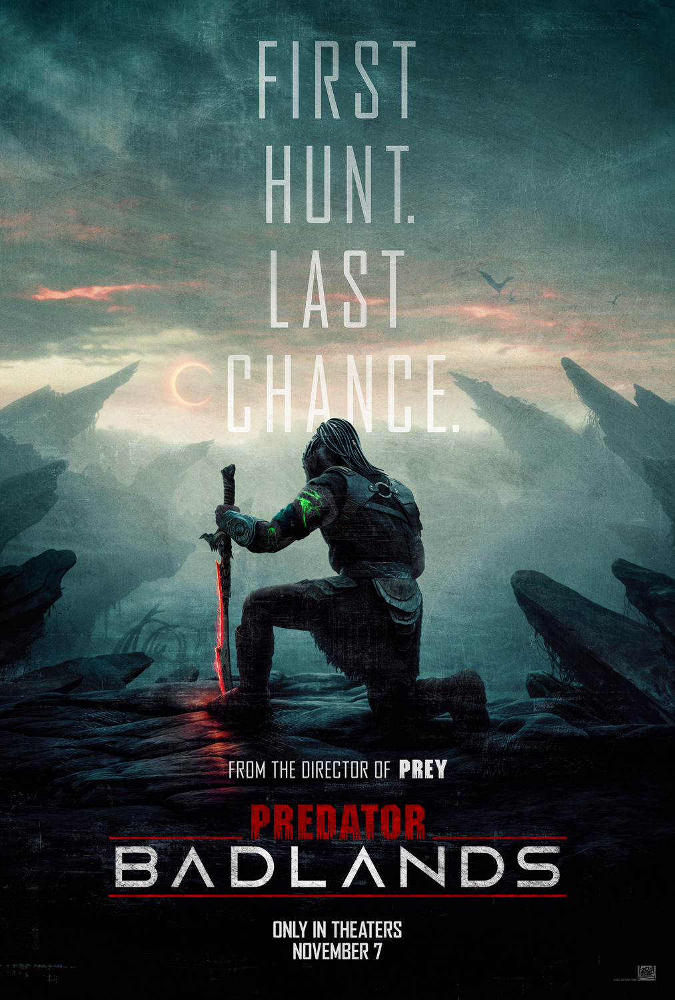
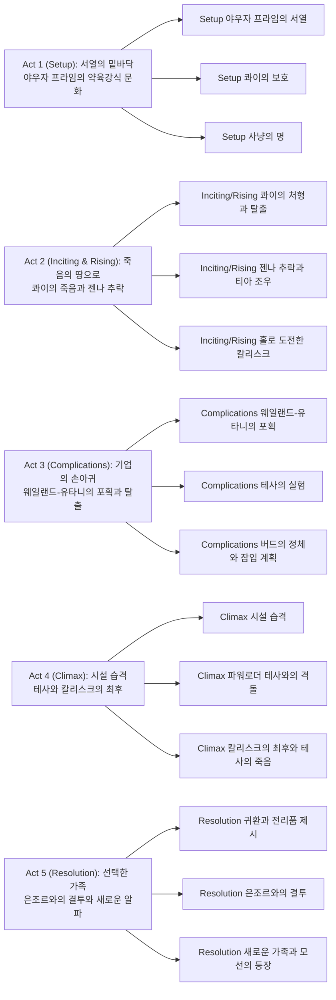
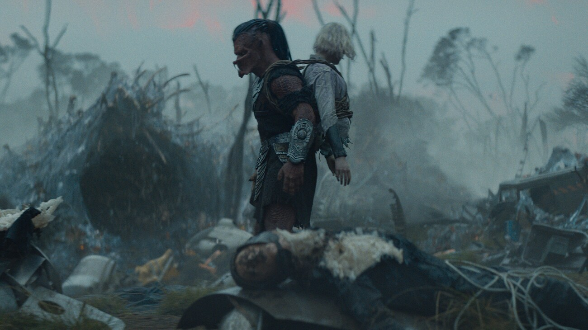
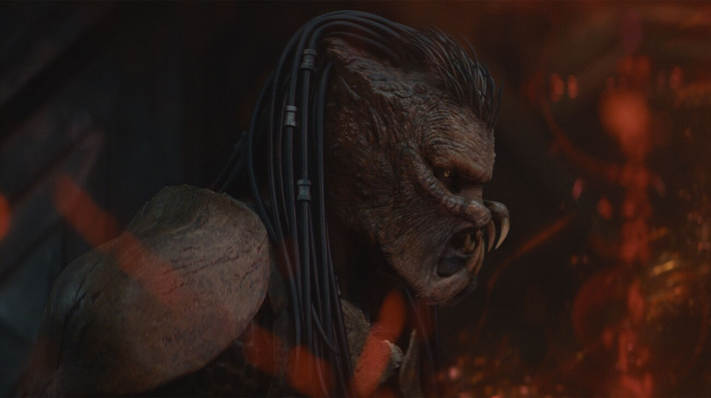
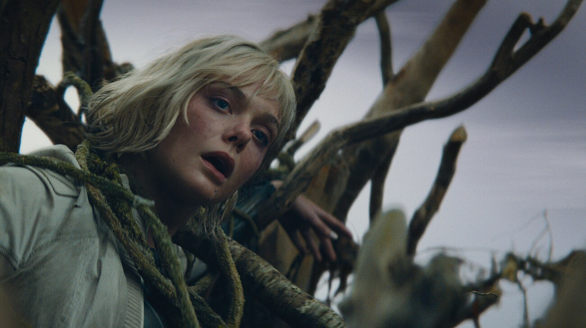
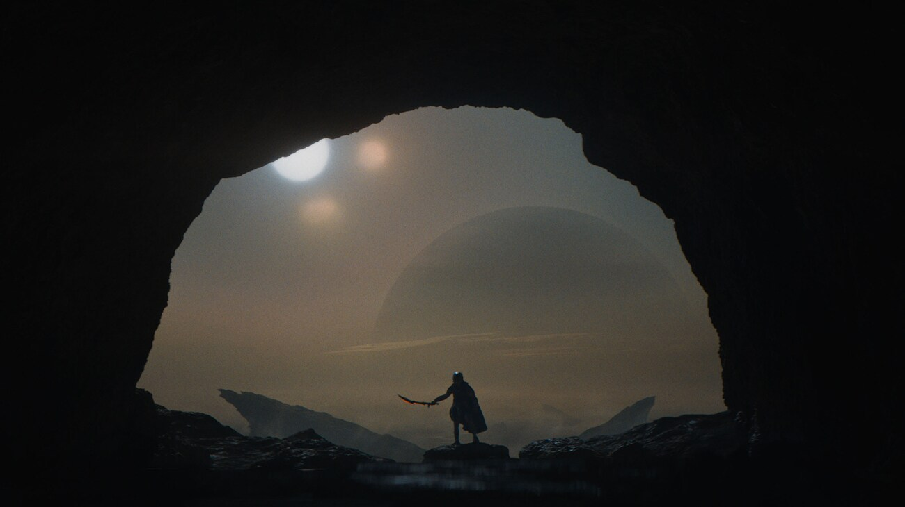

38년째 이어지는 <strong>프레데터</strong> 프랜차이즈가 처음으로 인간을 완전히 배제하고, 그 대신 사냥꾼 종족 야우자(Yautja)의 시점에서 이야기를 풀어낸 작품이 나왔다. 《Predator: Badlands (프레데터: 죽음의 땅)》(2025)은 클랜에서 "쓸모없는 것"으로 낙인찍힌 약체 야우자 덱이, 죽음의 행성 젠나에서 웨일랜드-유타니의 손상된 안드로이드 티아와 정체불명의 새끼 생물 버드를 만나며 벌어지는 생존기다. 괴물이 주인공이 되는 순간 프레데터 신화가 뒤집힌다.

## 개요

### 영화 정보
* **제목**: Predator: Badlands / 프레데터: 죽음의 땅
* **감독**: 댄 트랙턴버그 (Dan Trachtenberg)
* **각본**: 댄 트랙턴버그, 패트릭 아이슨 (Patrick Aison)
* **주연**: 디미트리우스 슈스터-콜로아마탕이(덱 역), 엘 패닝(티아/테사 1인 2역), 루벤 드 용(은조르 역), 마이크 호믹(콰이 역)
* **음악**: 사라 샤크너, 벤저민 월피시
* **촬영**: 제프 커터 (Jeff Cutter)
* **장르**: SF, 액션, 어드벤처
* **상영시간**: 107분 (1시간 47분)
* **개봉일**: 2025.11.05 (한국), 2025.11.07 (미국)
* **제작사**: 20세기 스튜디오
* **배급사**: 월트 디즈니 컴퍼니 코리아 (한국) / 20th Century Studios
* **제작비**: 약 1억 500만 달러
* **평점**: 로튼 토마토 신선도 86% · 관객 95%, 메타크리틱 71/100, 씨네마스코어 A−, 네이버 실관람객 8.74–8.89, CGV 골든에그 96–97%

### 추천 대상
* **프레데터 시리즈 팬**: 사냥당하던 괴물이 주인공이 되는 최초의 시도를 확인하고 싶은 사람
* **버디무비·성장물 애호가**: 종을 초월한 덱-티아-버드 3인조의 케미와 유대에 끌리는 사람
* **하드 R 고어보다 모험 톤을 선호하는 관객**: PG-13 등급으로 잔혹성을 낮추고 유머와 페이소스를 더한 전개를 원하는 사람

## 구조 분석

## 영화의 전체 내용 (스포일러 포함)

이하는 결말까지 포함한 전체 줄거리다. 아직 관람 전이라면 건너뛰기를 권한다.

### Act 1 (Setup): 서열의 밑바닥

**[S01] 야우자 프라임의 서열**: 야우자 사회는 힘과 명예를 최고 가치로 삼는다. 클랜 리더 은조르의 아들 덱은 또래보다 왜소한 "룬트(runt)"로, 아버지와 클랜 전체에게 쓸모없는 존재로 취급받는다.

**[S02] 콰이의 보호**: 덱보다 크고 강한 형 콰이는 은조르의 기대를 받는 후계자이지만, 동생을 훈련시키고 감싸며 유일하게 곁을 지켜준다.

**[S03] 사냥의 명**: 덱은 젠나라 불리는 "죽음의 땅"에서 거의 불멸에 가까운 최상위 포식자 칼리스크를 사냥해 존재를 증명하려 한다. 은조르는 약함을 보였다는 이유로 콰이에게 덱을 처형하라 명령한다.

### Act 2 (Inciting & Rising): 죽음의 땅으로

**[S04] 콰이의 처형과 탈출**: 콰이는 명령을 거부하고 대신 덱을 젠나로 보내는 우주선을 프로그래밍한다. 은조르는 그 자리에서 콰이를 처형하고, 덱은 형이 죽는 모습을 지켜보며 행성으로 떠난다.

**[S05] 젠나 추락과 티아 조우**: 덱은 젠나에 불시착하며 장비 대부분을 잃는다. 그는 곧 웨일랜드-유타니의 조사팀이 칼리스크에게 전멸당하고 홀로 남은 손상된 안드로이드 티아와 마주친다.

**[S06] 버드와의 첫 만남**: 티아가 "버드"라 이름 붙인 작은 생명체가 덱을 따라붙는다. 정체를 알 수 없는 이 존재는 이후 서사의 핵심으로 떠오른다.

**[S07] 홀로 도전한 칼리스크**: 덱은 명예를 증명하려 홀로 칼리스크에게 도전해 머리와 꼬리를 잘라내는 데 성공하지만, 칼리스크는 곧바로 재생하며, 덱의 냄새를 맡고는 그를 살려둔 채 물러난다.

### Act 3 (Complications): 기업의 손아귀

**[S08] 웨일랜드-유타니의 포획**: 웨일랜드-유타니 병력이 냉동 폭발물로 덱과 칼리스크를 동시에 포획한다.

**[S09] 미드포인트 - 테사의 실험**: 티아의 "자매" 안드로이드 테사가 덱에게 비인간적 실험을 가하기 시작한다. 감정을 지닌 손상된 티아와, 회사의 이익만을 위해 설계된 차세대 합성인간 테사의 대비가 선명해진다.

**[S10] 티아의 구출**: 티아는 회사의 명령 대신 덱을 돕기로 결심하고 탈출을 돕는다. 종을 초월한 신뢰가 이 순간 확정된다.

**[S11] 버드의 정체와 잠입 계획**: 덱은 버드가 다름 아닌 칼리스크의 새끼임을 알게 된다. 최상위 포식자조차 지켜야 할 자식이 있었다는 사실은 그가 가족과 강함을 다시 정의하는 계기가 된다. 덱은 젠나의 생물 자원으로 즉석 무기를 만들어 시설 습격을 준비한다.

### Act 4 (Climax): 시설 습격

**[S12] 시설 습격**: 덱, 티아, 버드는 웨일랜드-유타니 기지에 잠입해 포획된 칼리스크와 동료들을 구출하려 한다.

**[S13] 파워로더 테사와의 격돌**: 테사는 산업용 파워로더 슈트에 탑승해 덱과 정면으로 충돌한다.

**[S14] 클라이맥스 - 칼리스크의 최후와 테사의 죽음**: 풀려난 칼리스크가 전투에 뛰어들어 테사를 통째로 삼키지만, 테사는 몸속에서 수류탄과 플라즈마캐스터를 터뜨려 칼리스크를 죽이고 자신도 살아남는다. 덱은 테사를 칼로 찔러 완전히 제거하고, 형 콰이의 유품 무기를 되찾는다. 버드는 이 전투에서 친모인 칼리스크를 잃는다.

### Act 5 (Resolution): 선택한 가족

**[S15] 귀환과 전리품 제시**: 덱은 야우자 프라임으로 돌아와 테사의 두개골을 전리품으로 바치며 명예의 망토를 요구한다.

**[S16] 엔딩 - 은조르와의 결투**: 은조르는 요구를 거절하고, 둘은 일대일 결투를 벌인다. 덱이 승리한다.

**[S17] 새로운 가족과 모선의 등장**: 은조르는 화해를 제안하지만, 덱은 이미 티아와 버드에게서 자신만의 클랜을 찾았다며 거절한다. 그사이 성장한 버드가 은조르의 목을 물어뜯어 완전히 끝장낸다. 지평선 너머로 거대한 야우자 함선이 나타나고, 그것이 덱이 한 번도 만난 적 없는 어머니의 배임이 암시되며 영화는 다음 이야기를 예고한 채 끝난다.

## 캐릭터 분석

### 덱 (Dek) — 디미트리우스 슈스터-콜로아마탕이

**개요**: 클랜 내 최약체로 취급받는 젊은 야우자. 시리즈 사상 최초로 프레데터 종족이 주인공을 맡은 사례다.

**성장 곡선**: "강함을 증명해 인정받으려는 자"에서 "스스로 가치 기준을 세우는 자"로 이동한다. 칼리스크를 이기지 못했음에도 살아남는 경험, 티아·버드와의 협력을 거치며 힘의 정의 자체를 재구성한다.

**동기와 욕망**: 표면적 욕망은 아버지의 인정이지만, 진짜 필요(Need)는 조건 없이 곁을 지켜줄 관계다. 형 콰이가 이미 그 답을 보여줬다는 사실을 결말에서야 이해한다.

**갈등 구조**: 외적으로는 칼리스크·웨일랜드-유타니·아버지라는 세 위협과 맞서고, 내적으로는 "약함은 곧 무가치"라는 클랜의 세뇌와 싸운다.

**상징적 의미**: 신체적으로 왜소한 덱은 프레데터 신화가 오랫동안 전제해 온 "완벽한 사냥꾼"상에 대한 반박이다.

### 티아 (Thia) / 테사 (Tessa) — 엘 패닝 (1인 2역)

**개요**: 둘 다 웨일랜드-유타니가 제작한 합성인간이지만, 손상된 채 버려진 티아와 회사의 차세대 자율형 연구용 합성인간 테사는 거울처럼 대비된다.

**성장 곡선**: 티아는 손상(결함)을 딛고 스스로 선택하는 존재로 나아가고, 테사는 끝까지 기업의 목적에 종속된 채 파괴된다.

**동기와 욕망**: 티아는 생존과 소속을, 테사는 임무 완수와 회사에 대한 충성을 욕망한다.

**갈등 구조**: 같은 설계도에서 나온 두 존재가 "감정을 인정하는 결함"과 "감정을 억압한 완벽함" 사이에서 정반대의 답을 택하며 충돌한다.

**상징적 의미**: 눈동자에 새겨진 웨일랜드-유타니 로고는 두 안드로이드 모두 기업의 소유물이었음을 시각적으로 못박는다. 티아의 "손상"은 오히려 그를 인간(혹은 야우자)적으로 만드는 조건이 된다. 엘 패닝은 감정 표현이 절제된 티아와 냉혹한 테사를 목소리 톤과 신체 언어만으로 구분해 낸다.

### 콰이 (Kwei) — 마이크 호믹

**개요**: 덱의 형이자 은조르의 기대주. 클랜의 위계 안에서는 강자이지만, 그 위계에 순응하지 않는 인물이다.

**성장 곡선**: 등장 초반부터 이미 완성된 가치관(약자를 지킨다)을 지녔고, 그 신념을 위해 목숨을 건다는 점에서 정적이되 서사 전체를 추동하는 촉매 역할을 한다.

**동기와 욕망**: 아버지의 명령보다 동생의 생존을 우선한다.

**갈등 구조**: "클랜의 명예 규율"과 "형제애" 사이에서 후자를 택하고 대가를 치른다.

**상징적 의미**: 콰이의 죽음은 덱에게 남겨진 유일한 유산이자, 5막에서 덱이 "좋은 알파란 약자를 돌보는 자"라는 결론에 도달하는 근거가 된다.

### 은조르 (Njohrr) — 루벤 드 용

**개요**: 클랜 리더이자 덱·콰이의 아버지. 뿔과 흰 드레드락이 인상적인 외형으로, 힘=명예라는 야우자 전통 질서 그 자체를 체현한다.

**성장 곡선**: 끝까지 변하지 않는 인물로, 오히려 그 경직성이 덱의 변화를 부각시키는 대조군 역할을 한다.

**동기와 욕망**: 클랜의 순혈주의와 위계질서 유지.

**갈등 구조**: 아들을 잃으면서도 신념을 굽히지 않는 데서 오는 부성과 규율의 충돌.

**상징적 의미**: 전통적 가부장제·능력주의가 극단으로 치달을 때 벌어지는 파국을 보여주는 존재로, 결국 자신이 만든 위계 논리("약자는 처단한다")의 희생양이 된다.

### 버드 (Bud) / 칼리스크 (Kalisk)

**개요**: 젠나의 최상위 포식자 칼리스크와 그 새끼. 초반에는 순수한 위협으로, 후반에는 가족 관계를 지닌 존재로 재정의된다.

**성장 곡선**: "이름 없는 괴물"에서 "이름을 가진 동료(버드)"로, 그리고 결말에서는 덱을 대신해 심판을 집행하는 존재로 격상된다.

**동기와 욕망**: 생존, 그리고 (칼리스크의 경우) 자식 보호.

**갈등 구조**: 덱 일행과 대립하다 협력자로 전환되는 과정 자체가 영화의 핵심 갈등 해소 장치다.

**상징적 의미**: 어미 칼리스크가 새끼를 지키려는 존재였다는 반전은, "포식자에게도 지켜야 할 가족이 있다"는 영화의 주제를 압축한다. 버드가 은조르를 처단하는 마지막 장면은 새로운 가족이 낡은 질서를 대체하는 상징적 순간이다.

## 상징과 메타포 분석

### 시각적 상징
- **젠나의 황량한 지형**: 화산 지대와 척박한 자연은 야우자 프라임의 위계 사회만큼이나 "생존만이 유일한 규칙"인 세계임을 시각적으로 반복한다.
- **테사의 눈 속 웨일랜드-유타니 로고**: 클로즈업으로만 확인되는 이 디테일은 합성인간이 겉으로는 개별 존재처럼 보여도 결국 기업의 자산일 뿐이라는 사실을 은유한다.
- **파워로더 슈트**: 에일리언 시리즈를 연상시키는 이 장비는 "생물학적 강함"에 맞서는 "자본이 구매한 강함"을 시각화한다.

### 서사적 메타포
- **버드라는 이름**: 위협적인 최상위 포식자의 새끼에게 다정한 이름을 붙이는 행위 자체가, 덱(그리고 관객)이 두려움의 대상을 가족으로 재해석하는 서사의 축소판이다.
- **콰이의 유품 무기**: 형의 물건을 되찾는 행위는 혈연에서 물려받은 것 중 무엇을 계승하고 무엇을 버릴지에 대한 덱의 선택을 상징한다.

### 핵심 주제 의식
- **표면 주제**: 약자로 취급받던 존재가 자신의 가치를 증명해 가는 성장담.
- **심층 주제**: "강함"의 정의를 혈통·완력에서 돌봄과 연대로 옮겨놓는 것. 덱·티아·버드는 모두 각자의 사회(클랜, 기업, 생태계)에서 비주류·소모품 취급을 받던 존재들이며, 서로를 가족으로 택함으로써 그 위계를 무력화한다.
- **사회적/문화적 맥락**: AV클럽의 분석처럼, 이 영화가 지목하는 진짜 위협은 괴물이 아니라 "피를 흘리지 않아 죽일 수 없는" 웨일랜드-유타니라는 기업 시스템이다. 프레데터라는 폭력적 신화 자체보다, 그 폭력을 자원으로 착취하는 자본이 더 무섭다는 메시지가 에일리언 세계관과의 접점에서 완성된다.

## 제작 비화

### 기획과 제작 과정
감독 댄 트랙턴버그는 전작 《프레이》(2022) 이후, 프레데터 문화 자체를 정면으로 탐구하는 독립적인 이야기로 《죽음의 땅》을 기획했다. 트랙턴버그는 무비폰(Moviefone)과의 인터뷰에서 언어 구축 과정을 다음과 같이 설명했다.

> "We worked with a language expert, Britton Watkins, who's both a language expert and sci-fi fan and really developed an entire grammar structure and dictionary, all based off of the physiology of the Yautja from 'Predator'."
> — 댄 트랙턴버그, [Moviefone 인터뷰](https://www.moviefone.com/news/predator-badlands-interview-director-dan-trachtenberg/)

언어학자 브리튼 왓킨스가 야우자의 생리적 특징(턱뼈·발성 기관 구조)에 기반해 문법 체계와 사전을 새로 구축한 결과, 이는 실사 시리즈에 "야우자"와 "야우자 프라임"이라는 명칭이 정식으로 도입된 첫 사례가 됐다.

감독은 같은 인터뷰에서 인간 공동주인공을 배제한 이유도 밝혔다.

> "I did not want to put any humans in the movie because if we put in a human, then it would just become a two-hander again and the human would feel like a protagonist."
> — 댄 트랙턴버그, [Moviefone 인터뷰](https://www.moviefone.com/news/predator-badlands-interview-director-dan-trachtenberg/)

관객이 인간 캐릭터에게 감정을 이입해 프레데터의 서사가 희석되는 것을 막기 위한 선택이었으며, 그 대안으로 웨일랜드-유타니 합성인간 티아가 조연으로 설계됐다.

### 기술적 혁신
스튜디오 길리스가 덱의 신체용 크리처 수트를 제작했고, 모션 캡처로 얼굴 표정을 디지털로 보강했다. 웨타 워크숍이 실물 특수효과와 디자인을 맡았고, 이 영화는 사실상 모든 샷에 시각효과 작업이 필요했던 만큼 ILM과 웨타 FX 등 다수의 VFX 업체가 참여했다. 촬영은 2024년 8월부터 10월까지 뉴질랜드 로토루아, 테 쿠이티, 사우스헤드 반도 등지에서 진행됐으며, 오클랜드 사운드스테이지에서는 야우자 우주선 잔해와 웨일랜드-유타니 연구 기지 세트가 지어졌다.

### 영화사적 위치
《죽음의 땅》은 1987년 첫 작품 이래 38년 만에 프레데터가 주인공을 맡은 첫 극장 개봉작이며, 미국 내 개봉 첫날 박스오피스 1위, 한국에서도 개봉 첫날부터 나흘 연속 박스오피스 1위를 기록했다. 월트 디즈니 컴퍼니 공식 발표에 따르면 전 세계 오프닝 주말 성적 약 8,000만 달러로 프랜차이즈 약 40년 역사상 가장 강력한 오프닝 기록을 세웠고, 이후 최종 전 세계 누적 흥행 수익은 약 1억 8,460만 달러로 2004년 《에이리언 vs. 프레데터》(1억 7,740만 달러)의 총흥행 기록을 넘어서며 프랜차이즈 역대 최고 흥행작에 올랐다 — 오프닝 주말 기록과 최종 총흥행 기록은 서로 다른 지표다.

## 감독 분석

### 감독의 스타일과 특징
댄 트랙턴버그는 《10 클로버필드 레인》(2016)에서 밀실 스릴러의 긴장감을, 넷플릭스 《블랙 미러》 에피소드 "플레이테스트"에서 심리적 공포를, 《더 보이즈》 파일럿에서 슈퍼히어로 장르 해체를 각각 실험해 왔다. 공통적으로 "예상되는 힘의 구도를 뒤집는 인물"에 대한 관심이 드러난다.

### 이 영화에서의 연출 특징
《프레이》에서 원주민 소녀 나루를 프레데터를 이기는 주체로 세웠던 트랙턴버그는, 《죽음의 땅》에서 한 걸음 더 나아가 프레데터 자신을 약자이자 주인공으로 세운다. CG 배경 대신 뉴질랜드 실제 자연을 고집한 연출 방침 역시, 신화적 존재를 어디까지나 "생태계 안에서 생존을 다투는 생물"로 다루려는 일관된 태도의 연장선이다. 다른 감독이었다면 프레데터의 위압감을 극대화하는 데 집중했을 자리에서, 트랙턴버그는 유머와 애착 관계를 더해 장르의 톤 자체를 조정했다.

## 영상미와 음악

### 시각 효과 / 촬영 / 미학

촬영감독 제프 커터(《프레이》에 이어 재합류)는 소프트웨어로 합성한 배경 대신 뉴질랜드의 화산 지형·밀림·호수를 실사로 담아내며, 채도를 낮춘 색감과 가혹한 자연광으로 안전지대 없는 세계관을 완성했다. 파워로더 대 생물체의 대결 장면은 실물 특수효과와 디지털 VFX를 촘촘히 병용해, 기계적 폭력과 생물학적 폭력의 질감 차이를 뚜렷하게 대비시킨다.

### 음악감독의 음악
사라 샤크너와 벤저민 월피시는 전작 《프레이》와 《프레데터: 킬러 오브 킬러스》에 이어 다시 트랙턴버그와 호흡을 맞췄다. 낮고 거친 야우자어 보컬에 타악기·금관·첼로를 겹겹이 쌓은 스코어는 야우자 문화의 원시성과 위엄을 동시에 표현하며, 감정적으로 고조되는 구간에서는 오케스트라 편성으로 확장돼 액션과 정서 전환을 함께 뒷받침한다.

## 종합 평가

### 최종 평점: ★★★★☆ (4.0/5.0)

**장점**:
- 프레데터를 처음으로 감정 이입 가능한 주인공으로 세운 과감한 관점 전환
- 뉴질랜드 실사 로케이션과 실물 특수효과가 뒷받침하는 설득력 있는 세계관
- 덱-티아-버드 3인조의 유대가 액션 시퀀스에도 정서적 무게를 더함

**단점**:
- 시리즈 특유의 원초적 공포감과 R등급 잔혹성이 PG-13 톤으로 옅어졌다는 비판
- 웨일랜드-유타니·에일리언 세계관과의 연결이 다소 설명적으로 느껴지는 구간 존재
- 후속작을 강하게 예고하는 결말이 이 작품 단독의 완결성을 다소 희석함

### 한 줄 평

"괴물의 시점에서 다시 쓴 성장담, 프레데터 신화의 가장 인간적인 순간."

### 추천 작품

- 《프레이 (Prey)》(2022): 같은 감독이 프레데터 신화를 원주민 소녀의 시점으로 재구성한 프리퀄. 《죽음의 땅》의 "약자가 이기는 방식"이라는 문제의식이 여기서 출발한다.
- 《에이리언: 로물루스》(2024): 같은 20세기 스튜디오 소유 세계관에서 웨일랜드-유타니의 비인간성을 더 어둡게 다룬 작품. 두 시리즈의 접점을 확인하고 싶다면 함께 볼 만하다.
- 《가디언즈 오브 갤럭시》(2014): 사회 부적응자·비주류 존재들이 모여 "선택한 가족"을 이루는 SF 어드벤처라는 점에서 덱-티아-버드 3인조와 정서적으로 닮았다.

### 관람 전 체크리스트

- 사전 지식이 필요한가? 프레데터 시리즈를 몰라도 독립적으로 관람 가능하지만, 《프레이》를 먼저 보면 세계관 이해도가 높아진다.
- 어린이와 함께 볼 수 있는가? 한국 등급 기준 확인 필요, 미국은 PG-13(15세 이상 관람가 수준의 폭력성)으로 이전 R등급 작품들보다 수위가 낮다.
- 특정 요소를 기대해도 되는가? 하드고어 서바이벌보다는 버디무비형 액션-어드벤처에 가깝다.
- 쿠키 영상이 있는가? 없다.
- 속편 가능성은? 결말에서 정체불명의 야우자 함선(덱의 어머니)이 등장하며 후속편을 명확히 암시한다.

### 이 리뷰로 판단할 것

이 리뷰를 읽고 나면 다음 세 가지를 스스로 판단할 수 있어야 한다.

- **팬으로서 관람할지**: R등급 원작의 원초적 공포 대신 PG-13 톤의 버디무비형 서사를 받아들일 수 있는지. 톤 완화를 "배신"으로 볼지 "확장"으로 볼지는 기존 시리즈에 대한 애착도에 따라 갈린다.
- **비팬으로서 입문작이 될 수 있는지**: 전작 지식 없이도 Act 5 구조로 완결된 독립 서사를 따라갈 수 있는지. 다만 에일리언 세계관 연결(웨일랜드-유타니)의 맥락은 사전 지식이 있을 때 더 풍부하게 읽힌다.
- **"강함"의 재정의에 설득되는지**: 은조르식 위계(혈통·완력)와 덱식 유대(선택한 가족)의 대립 구도가, 상징 분석에서 지적한 기업 비판(웨일랜드-유타니)까지 일관되게 이어지는지, 아니면 단순한 신파적 화해로 느껴지는지.

## 참고 문헌 및 출처

- [Predator: Badlands — Wikipedia](https://en.wikipedia.org/wiki/Predator:_Badlands)
- [프레데터: 죽음의 땅 — 위키백과](https://ko.wikipedia.org/wiki/%ED%94%84%EB%A0%88%EB%8D%B0%ED%84%B0:_%EC%A3%BD%EC%9D%8C%EC%9D%98_%EB%95%85)
- [Predator: Badlands — Rotten Tomatoes](https://www.rottentomatoes.com/m/predator_badlands)
- [Predator: Badlands Reviews — Metacritic](https://www.metacritic.com/movie/predator-badlands/)
- ['Predator: Badlands' Sets Franchise Box Office Record — The Walt Disney Company (공식 보도자료)](https://thewaltdisneycompany.com/news/predator-badlands-box-office/)
- [Predator: Badlands pits the Killer Of Killers against his most formidable foe: corporations — The A.V. Club](https://www.avclub.com/spoiler-space-predator-badlands-alien-weyland-yutani-corporation)
- [Predator: Badlands (soundtrack) — Wikipedia](https://en.wikipedia.org/wiki/Predator:_Badlands_(soundtrack))
- [Predator: Badlands — New Zealand Film Commission (공식)](https://www.nzfilm.co.nz/films/predator-badlands)
- ['Predator: Badlands' Interview: Director Dan Trachtenberg — Moviefone](https://www.moviefone.com/news/predator-badlands-interview-director-dan-trachtenberg/)
- ['프레데터:죽음의 땅', 4일 연속 흥행 1위! 적수가 없다 — 머니투데이](https://www.mt.co.kr/entertainment/2025/11/09/2025110911117245210)
- [Predator: Badlands Characters: Backstories And Profiles — AvP Central](https://www.avpcentral.com/predator-badlands-characters)
