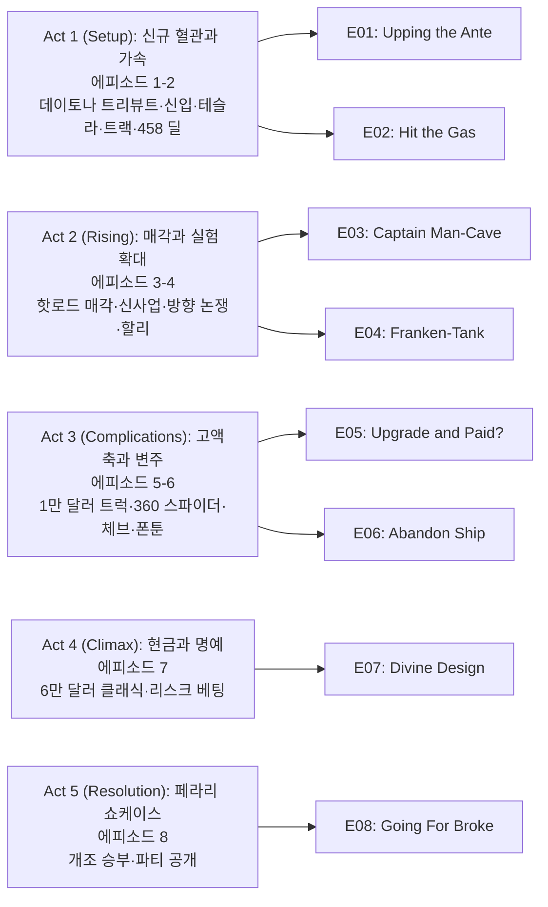

《Car Masters: Rust to Riches》 시즌 5는 **고담 개러지(Gotham Garage)**가 단순한 복원을 넘어 **고액 매각·트레이드 업** 서사를 전면에 내세운다. **Mark Towle(마크 타울)**이 상상하는 과감한 스타일링과 **Shawn Pilot(숀 파일럿)**의 딜, **Tony Quinones(토니 퀴노네스)**의 팹, **Constance Nunes(콘스탄스 누네스)**·**Michael "Caveman" Pyle(마이클 "케이브맨" 파일)**의 현장 조립이 한데 묶이고, 시즌 5에서는 **Brian Reich(브라이언 라이시)**와 **Jake Cerveny(제이크 서버니)**가 패브리케이터로 가세하며 **Nick Smith(닉 스미스)**가 럭셔리 브로커 축을 보강한다. 2023년 12월 13일 넷플릭스에 **8편이 동시 공개**되며, 클라이맥스는 **페라리 360 스파이더**를 둘러싼 고위험 커스터마이징과 공개 행사로 수렴한다.

## 시즌 개요

### 시리즈 정보

* **제목**: Car Masters: Rust to Riches / 《카마스터즈: 녹에서 부로》(넷플릭스 한국어 표기 기준)
* **시즌**: 시즌 5 (총 8 에피소드, 일괄 스트리밍)
* **쇼러너**: 전통적 드라마 쇼러너 개념보다는 리얼리티 제작 구조가 맞고, **executive producers**로 Rotten Tomatoes 등에 **Mark Kadin**, **Will Ehbrecht**, **Rob Hammersley**, **Michael Lutz**, **John Stokel**, **Scott Popjes** 등이 올라와 있다.
* **주요 출연(본인 출연)**: Mark Towle, Shawn Pilot, Tony Quinones, Constance Nunes, Michael "Caveman" Pyle, Nick Smith; 시즌 5부터 **Brian Reich**, **Jake Cerveny**가 제작진 소개와 캐스트 가이드에서 패브리케이터로 반복 언급된다.
* **장르**: Reality TV, Automotive / Special Interest (Rotten Tomatoes·넷플릭스 메타 기준)
* **에피소드 러닝타임**: 약 31–40분(위키백과 제작 정보), JustWatch 등은 약 39분 전후로 표기한다.
* **방영일(시즌 5)**: 2023.12.13 (전 회차 동일 날짜 일괄 공개)
* **방영 채널/플랫폼**: Netflix
* **제작**: **Mak Pictures** 등(위키백과 제작사 필드), 촬영지는 **캘리포니아**로 정리되는 자료가 많다.
* **평가 참고**: Rotten Tomatoes 시즌 5 페이지에 따르면 **Tomatometer**는 제한적 표본(예: 2 리뷰, 36%대)으로 표시되고, **Popcornmeter**는 표본이 적다는 안내가 붙는다. 본 글은 **평가 점수 자체를 절대적 진리로 고정하지 않고**, 매체·관객 반응의 **분산**을 종합 평가에서 다룬다.
* **시리즈 후속**: 위키백과는 시즌 6(2024년 10월 공개) 이후 **넷플릭스에서 6시즌으로 종료**되었다는 보도를 인용 형태로 정리한다. 시즌 5 리뷰 시점에서는 **그 이후 시즌이 존재**한다는 점만 참고하면 된다.

### 시즌 주제

시즌 5는 **인력 확장**(브라이언·제이크)과 **브로커 라인 강화**(닉 스미스)로 **상품 단가와 리스크**를 동시에 끌어올린다. **전기차(테슬라)**나 **바이크(할리 데이나)**, **플로팅 파티 버스** 같은 비(非)전형 프로젝트가 끼어들어 작업실 리듬을 바꾸고, 중반 이후 **페라리 360 스파이더** 매입·개조는 **가게의 명예와 현금 흐름**을 한 번에 건 도박으로 프레이밍된다. 편집은 **딜 클로징·트랙 주행·파티 데뷔**처럼 관객이 결과를 한눈에 판별할 수 있는 **이벤트**에 클로즈업을 맞춘다.

### 추천 대상

* **커스텀·클래식 카를 거래·복원 단계로 보고 싶은 시청자**: 트레이드 업과 매각 논의 비중이 크다.
* **리얼리티 제작 방식에 관심 있는 시청자**: 비평·관객 리뷰에서 반복되는 **현실성·마감 퀄리티** 논쟁을 메타로 읽을 여지가 있다.
* **시리즈를 몰아보기 좋아하는 시청자**: 8편 일괄 공개라 **하루 만에 시즌 아크**를 완주하기 쉽다.

## 구조 분석 (Act-first 보조 도식)

시즌은 **8화**이므로 Act를 **2-2-2-1-1**로 나누고, **미드포인트**를 E04–E05 경계의 **가게 방향 논쟁·페라리 매입 시도** 쪽에 두며, **클라이맥스**를 E07–E08의 **현금 압박·페라리 올인**에 둔다.

## 에피소드 가이드

| 회차 | 제목 | 방영일 | 한 줄 요약 |
|------|------|--------|------------|
| E01 | Upping the Ante | 2023.12.13 | 1969 닷지 차저 데이토나 **트리뷰트**·브라이언·제이크 실력 입증·숀의 **458 이탈리아** 딜 시도 |
| E02 | Hit the Gas | 2023.12.13 | 의뢰인의 **테슬라** 이례 개조·변신한 **닷지**를 **트랙**에 올림 |
| E03 | Captain Man-Cave | 2023.12.13 | 숀이 **이례적 핫로드** 바이어를 찾고 가게는 **수익형 신규 벤처**를 검토 |
| E04 | Franken-Tank | 2023.12.13 | 크루가 **가게 방향**을 우려·**할리 데이나** 다크 스타일·마크는 **기괴 차량** 의뢰에 고민 |
| E05 | Upgrade and Paid? | 2023.12.13 | 토니 **1만 달러** **듀얼캡 브릭노즈**를 **랫로드**로·마크·숀 **360 스파이더** 매입 검토(리스크 언급) |
| E06 | Abandon Ship | 2023.12.13 | 페라리 소식 대기 속 **폰툰 보트** **파티 버스**·**1969 셰벨** 현대화 |
| E07 | Divine Design | 2023.12.13 | 마크가 **큰 리스크**·가게 **현금 급구**·고객이 **약 6만 달러** **미국 클래식**을 확인 |
| E08 | Going For Broke | 2023.12.13 | **페라리** **대담 개조**와 **혈통 존중** 사이에서 승부·**파티 데뷔**로 결막 |

### 에피소드별 핵심 사건 요약

* **E01 "Upping the Ante"**: 신규 패브리케이터가 **데이토나 트리뷰트**로 실력을 증명하는 동선이 깔리고, 숀은 **페라리 458 이탈리아**를 노린 **상류 딜**을 밀어 붙인다.
* **E02 "Hit the Gas"**: **테슬라**에 흔치 않은 커스터마이징 요구가 들어오고, 병행해서 **닷지** 쪽 빌드는 **서킷**에서 성능·연출을 확인한다.
* **E03 "Captain Man-Cave"**: **핫로드** 매각 압박과 **새로운 수익 모델** 탐색이 겹치며, 숀의 **브로커리지** 역할이 전면에 선다.
* **E04 "Franken-Tank"**: **조직 방향**에 대한 크루의 불안이 드러나고, **할리** 프로젝트와 **노벨티 차량** 의뢰가 마크의 판단을 시험한다.
* **E05 "Upgrade and Paid?"**: 토니는 **제한 예산** 안에서 **트럭**을 **랫로드** 쪽 미학으로 재구성하고, 마크와 숀은 **360 스파이더**를 두고 **리스크 대비 보상**을 계산한다.
* **E06 "Abandon Ship"**: **페라리** 진행 상황이 쉬어 가는 동안 **보트**를 **파티 플랫폼**으로 바꾸고 **셰벨**은 현대 파워·편의 쪽으로 업데이트한다.
* **E07 "Divine Design"**: **재무 리스크**가 노골화되고, **고가 매물** 앞에서 고객의 **재방문·검수**가 긴장 포인트가 된다.
* **E08 "Going For Broke"**: **페라리**에 **과감한 변경**을 가하되 **브랜드 헤리티지** 논리를 유지하려는 장면들이 쌓이고, **파티**에서 **공개 성패**가 정리된다.

## 시즌의 전체 내용 (스포일러 포함)

시즌 전체는 **저단가·다품종 빌드**에서 시작해 **브로커·고액차 축**으로 스테이크를 높이고, 마지막에 **페라리 한 대**에 **가게의 이미지와 현금**을 동시에 겨눈다. **미드포인트** 부근에서 **크루가 가게 방향을 문제 삼는** 장면이 나오면서, 단순한 "멋진 차" 나열이 아니라 **조직 운영·신뢰** 서사가 얇게 깔린다. **클라이맥스**는 **6만 달러급 미국 클래식**과 **페라리 개조**가 맞물리며, **관객이 결과를 사회적 이벤트(파티)로 검증**하게 만드는 전개로 수렴한다.

### Act 1 (Setup): 팀 재편과 가속 — [E01–E02]

**요약**: 신입이 **데이토나 트리뷰트**로 몸을 던지고, **테슬라·닷지·트랙**이 쇼의 속도감을 만든다.

#### [E01] "Upping the Ante" — 상세 장면 분석

**[E01-S01] 데이토나 트리뷰트와 신입 시험대**: 작업장 한쪽에서는 **브라이언**과 **제이크**가 **1969 닷지 차저 데이토나**를 향한 **트리뷰트 빌드**로 시선을 끈다. 용접·판금·조립이 **카메라 클로즈업**으로 묶이면서, 시즌 5가 **손 숫자를 늘린 생산 라인**임을 시각적으로 고지한다. **마크**는 과장된 실루엣과 색 대비로 **쇼카 성격**을 강화하려 하고, 현장은 **시간 압박**과 **품질 논쟁**을 동시에 안는다.

**[E01-S02] 숀의 458 파이프라인**: **숀**은 **페라리 458 이탈리아**를 겨냥한 **상류층 거래**를 구체적인 **전화·미팅·조건** 장면으로 밀어 붙인다. **브로커**로서의 말빨과 **네트워크**가 **가게의 다음 한 방**을 예고하고, **마크**의 스타일 실험이 **누가 비용을 감당하는가**라는 질문으로 되돌아온다.

**[E01-S03] 시즌 톤 세팅**: 첫 회는 **여러 벨트가 동시에 돈다**는 인상을 남긴다. **데이토나**는 **관객 친화적 아이콘**이고, **458**는 **브랜드 리스크**를 예고하는 **후킹**이다. 다음 화의 **전기차·트랙** 조합으로 **기술 스펙트럼**이 확장될 여지를 남긴다.

#### [E02] "Hit the Gas" — 상세 장면 분석

**[E02-S01] 테슬라 의뢰의 이단성**: 의뢰인은 **테슬라**에 대해 **상용 튜닝 시장에서도 흔하지 않은** 방향을 요구한다. **배터리·전장·차체**를 건드리는 결정이 **안전·보증·잔존 가치**와 충돌할 수 있음을 크루가 짧게 언급하며, 쇼는 그 긴장을 **드라마 연료**로 쓴다.

**[E02-S02] 닷지의 트랙 검증**: **변신한 닷지**는 **레이스 트랙**에 올라가 **속도·핸들링·브레이크**를 **관객이 이해하기 쉬운 언어**(타임·연출)로 보여 준다. **트랙**은 **거래 전 검수 무대**이자 **촬영상 화려한 B 롤**의 장소다.

**[E02-S03] 병렬 편집의 의미**: 같은 화 안에서 **전기차 실내 작업**과 **내연 트랙 주행**이 교차하면, 시즌이 **하나의 미학**에 고정되지 않는다는 메시지가 된다. **고담 개러지**는 **플랫폼**이 아니라 **쇼맨십**으로 브랜드를 팔고 있다는 인상이 강화된다.

### Act 2 (Rising): 매각과 실험 확대 — [E03–E04]

#### [E03] "Captain Man-Cave" — 요약

**숀**은 **독특한 핫로드**의 **바이어**를 찾아 **현금화 시한**을 맞추려 한다. **가게**는 **장기적으로 수익을 키울 만한 벤처**를 검토하며, **브로커리지**와 **제작**이 같은 테이블에 올라온다. **마크**는 새로운 아이디어에 **과투자**할 위험을 안고, **숀**은 **현실적인 출구**를 찾아야 한다.

#### [E04] "Franken-Tank" — 요약

크루가 **가게의 방향**에 대해 **불만·우려**를 드러내며 **리얼리티** 파트의 **갈등 축**이 표면화된다. **할리 데이나**는 **다크·슬릭** 쪽 비주얼로 **바이크 라인**을 보여 주고, **마크**는 **기괴한(노벨티) 차량** 의뢰에 **창의성 vs 수익성**을 저울질한다. **미드포인트** 직전, **조직 신뢰**와 **리더십 스타일**이 동시에 흔들린다.

### Act 3 (Complications): 예산·고액차·변주 — [E05–E06]

#### [E05] "Upgrade and Paid?" — 상세 장면 분석

**[E05-S01] 1만 달러 브릭노즈 랫로드**: **토니**는 **1만 달러**라는 **명시 예산** 안에서 **듀얼캡 브릭노즈 트럭**을 **랫로드** 미학으로 재탄생시킨다. **컷·랩·노출 메카니즘**이 **저예산 쇼카**의 **정직한 재미**를 만들고, **마크**의 **하이엔드 실험**과 **대비**된다.

**[E05-S02] 360 스파이더 매입 논의**: **마크**와 **숀**은 **페라리 360 스파이더**를 **사들이는 시나리오**를 두고 **차량 컨디션·서류·수리 비용**을 따진다. **"짐(baggage)"**이라는 표현이 Rotten Tomatoes·위키백과 줄거리에 반복되듯, 이 차는 **깨끗한 승리**가 아니라 **하자와 변수**를 안은 **도박**으로 프레이밍된다.

**[E05-S03] 시즌 후반 예고**: **360**이 **파이프라인**에 들어오면, 이후 화의 **보트·셰벨**은 **호흡**을 주고 **페라리**는 **클라이맥스 예산**을 잡아먹는 **중심 객체**가 된다.

#### [E06] "Abandon Ship" — 요약

**페라리** 쪽 **뉴스**를 기다리는 텀에 **폰툰 보트**를 **파티 버스**로 바꿔 **이벤트 장비**를 만든다. **1969 셰벨**은 **21세기식** 파워트레인·편의 개념을 얹어 **클래식 팬**과 **현대 일상** 사이를 잇는다. **물과 육상**을 오가는 편성은 **쇼가 지루해지지 않게 토픽을 순환**시키는 역할을 한다.

### Act 4 (Climax): 현금 압박과 고가 검수 — [E07]

#### [E07] "Divine Design" — 상세 장면 분석

**[E07-S01] 마크의 재무 베팅**: **마크**는 **가게 재무**에 **직접적인 리스크**를 건다. **작업대·부품·인건비**가 **현금 유출**로 잡히고, 편집은 **계산기·장표·짧은 충돌 대사**로 **압박**을 가시화한다.

**[E07-S02] 6만 달러 클래식의 반환 검수**: **고객**이 **복원된 미국 클래식**을 **약 6만 달러** 전후의 **가격 태그** 앞에서 **재방문**한다. **도장·간극·주행감**이 **카메라에 들어오는 포인트**가 되고, **만족·흥정·재작업 위협**이 **클라이맥스 전 긴장**을 만든다.

**[E07-S03] E08로의 브리지**: **현금**이 빠듯한 상태에서 **페라리** 작업이 **남은 카드**가 된다. **성공**은 **브랜드 신용 회복**, **실패**는 **시즌 내내 쌓인 "올인" 내러티브의 붕괴**로 이어질 수 있음을 관객이 예상하게 만든다.

### Act 5 (Resolution): 페라리 쇼케이스 — [E08]

#### [E08] "Going For Broke" — 상세 장면 분석

**[E08-S01] 개조 철학의 줄다리기**: 크루는 **페라리**에 **과감한 변경**을 가하면서도 **마라넬로 전통·브랜드 계보** 같은 **헤리티지 담론**을 **편집 몽타주**로 반복한다. **관객**에게는 **존중 vs 파괴**의 **윤리적 미세 긴장**이, **바이어**에게는 **희소성·화제성**이 동시에 팔린다.

**[E08-S02] 작업장 클라이맥스**: **도색·휠·에어로·실내**가 **짧은 시간 압축**으로 묶이고, **마크**의 **시그니처 과장**과 **토니**의 **팹 정밀**이 **한 대**에 겹친다. **닉**·**숀**의 **세일즈 톤**은 **가격 담론**을 **감정적 하이라이트**로 끌어올린다.

**[E08-S03] 파티 데뷔와 시즌 결막**: **파티**는 **조명·군중·카메라 플래시**로 **성패가 공개 연극**이 되는 장소다. **바이어 반응·박수·침묵** 같은 **청각 신호**가 **한 시즌의 판정**처럼 배치되고, **시즌 6**으로 이어질 **고액차 라인**을 **제작진이 의도적으로** 남긴다(위키백과·Screen Rant 시즌 6 요약과 연결).

## 캐릭터 분석

### Mark Towle / 오너·디자이너

**개요**: **고담 개러지** 창업자로 **헐리우드 소품·차량** 경험을 **쇼카 스타일**에 녹인다. **마크**는 **과감한 실루엣**과 **화제성**을 우선할 때 **예산·일정**과 충돌한다.

**성장 곡선(시즌 5)**: **신규 인력**과 **브로커**를 받아들이며 **스케일 업**을 꿈꾸지만, **E04**의 **방향 논쟁**과 **E07**의 **재무 리스크**에서 **리더로서의 베팅**이 드러난다.

**갈등 구조**: **창의성 vs 운영 안정성**, **브랜드 이미지 vs 현금 흐름**.

### Shawn Pilot / 브로커

**개요**: 연기 경력을 뒤로하고 **고가차 거래**에 특화. **숀**은 **458**, **360**, **파티 클로징**에서 **딜 플로우**를 이끈다.

**성장 곡선**: **핫로드 매각**(E03)부터 **페라리 파이프라인**까지 **상류 시장**으로 체급을 올린다.

**갈등 구조**: **낙관적 클로징**과 **차량 컨디션 리스크** 사이에서 **신뢰**를 관리한다.

### Tony Quinones / 수석 팹리케이터

**개요**: **마크**의 스케치를 **금속**으로 옮긴다. **E05**의 **저예산 트럭**은 **토니**의 **실속 쇼맨십**을 드러낸다.

**갈등 구조**: **정밀 작업 시간** vs **방송 일정**.

### Constance Nunes / 메카닉

**개요**: **엔진·어셈블리**에서 **성별 편견**을 깨는 **쇼 아이덴티티**를 유지한다. 시즌 5에서도 **다양한 파워트레인** 작업에 참여하며 **팀의 기술 신뢰**를 받는다.

### Michael "Caveman" Pyle / 메카닉

**개요**: **거친 캐릭터 톤**과 **장기 현장 경험**으로 **중간 관층**을 막는다. **보트·트럭** 같이 **묵직한 빌드**에 강세.

### Nick Smith / 럭셔리 브로커

**개요**: Screen Rant·위키백과류 자료는 **닉**을 **고액 거래**와 **부유층 클라이언트** 연결로 묘사한다. **시즌 5**에서 **브로커 라인**이 두꺼워지는 서사와 맞물린다.

**갈등 구조**: **클라이언트 기대**와 **가게의 실제 출력 속도** 사이의 **간극**.

### Brian Reich & Jake Cerveny / 패브리케이터

**개요**: **시즌 5** 신규 **패브**로 **작업 분산**과 **난이도 상승**을 담당한다. **E01** **데이토나**와 **E08** **페라리**처럼 **난이도 피크**에 배치된다.

## 드라마에 숨겨진 내용 분석

### 서브텍스트·암시

* **트레이드 업 포맷**은 "기술 다큐"라기보다 **성공 서사**를 **반복 시청**하게 만드는 **게임 룰**에 가깝다. Rotten Tomatoes의 시리즈 소개처럼 **"녹슨 잔해 → 캔디 컬러 핫로드"** 변환은 **계급 상승 환상**을 **자동차 언어**로 번역한다.
* **관객 리뷰**(Rotten Tomatoes Popcorn 코멘트 등)에서 반복되는 **마감·도장 퀄리티** 지적은, 쇼가 의도한 **"리얼한 공방"** 이미지와 **실제 화면 정보** 사이의 **긴장**을 드러낸다. 이는 **진위 논쟁**이 아니라 **시청 각도**(기술 교육 vs 엔터테인먼트)를 가르는 **해석 축**으로 읽을 수 있다.

### 상징·소품·배경

* **트랙·파티**는 **검증의 무대**다. **서킷**은 **객관적 성능**을, **파티**는 **사회적 가치**를 상징한다.
* **테슬라 vs 클래식 V8** 병치는 **자동차 문화의 세대·동력 이념**을 **한 시즌 안에 압축**한다.

### 복선·회수

* **E01**의 **458** 딜 시도는 **E05–E08**의 **360·페라리 쇼케이스**로 **고액 라인**이 이어진다.
* **E04**의 **방향 논쟁**은 **E07** **재무 압박**에서 **운영 논리**로 회수된다.

### 제작진 의도·해석

* 넷플릭스 공식 카피는 **"다양한 차와 트럭을 개조해 큰 돈을 벌 목표"**로 **이익 동기**를 노골한다. 이는 **교육 목적**보다 **성취감·환희**를 노린 **포맷 선언**에 가깝다.

## 종합 평가

### 최종 평점: ★★★☆☆ (3.0/5.0)

**장점**:

* **토픽 폭**(전기차·바이크·보트·페라리)이 넓어 **시청 피로**를 분산한다.
* **트랙·파티** 같은 **이벤트 클로징**이 **한 화의 목표**를 분명히 한다.
* **신규 인물**(브라이언·제이크·닉)이 **작업·딜 씬**에 **변주**를 준다.

**단점**:

* Rotten Tomatoes **크리틱 표본**이 작고 점수가 낮게 보일 수 있어, **비평적 확증**을 찾는 시청자에게는 **근거 부족**으로 느껴진다.
* 일부 **관객 리뷰**가 지적하듯 **마감·도장**이 **프레임 안 정보**로 드러날 때 **몰입이 깨질** 수 있다.
* **리얼리티**라는 장르 전제 자체가 **거래 연출**에 대한 **의심**을 동반한다.

### 한 줄 평

**"고담 개러지가 스케일 업을 말로만이 아니라 페라리 한 대에 걸어 보여 주는 시즌."**

### 추천 작품

* 《Rust Valley Restorers》(넷플릭스): **복원 과정**에 더 긴 호흡을 원할 때.
* 《Tex Mex Motors》(넷플릭스): **매입·플립** 리듬이 비슷한 **자동차 리얼리티**를 찾을 때.

### 시청 전 체크리스트

* 사전 지식이 필요한가? **아니오**이나, **트레이드 업 포맷**을 이해하면 **반복 구조**가 읽힌다.
* 어린이와 함께 볼 수 있는가? **넷플릭스 TV-14**·가이드의 **TV-PG** 표기 차이를 확인하고, **성인 유머·비즈니스 압박** 묘사를 기준으로 판단한다.
* 몰아보기 vs 천천히? **8편 동시 공개**라 **몰아보기**에 최적화.
* 특정 요소를 기대해도 되는가? **하이엔드 커스텀 쇼**와 **딜 클로징**을 기대하면 맞고, **공방 교육 다큐**를 기대하면 어긋날 수 있다.
* 다음 시즌은? **시즌 6**(2024년 공개)이 이어지며, 위키백과·업계 보도에 따르면 **시리즈는 6시즌으로 종료**된 것으로 정리된다.

## 외부 리캡 인용 (장면·사실 확인용)

> "There is much that remains fascinating and visceral about witnessing the transformation of an abandoned heap into a streamlined, candy-colored hot rod. Or whatever."

— John Anderson, *[Car Masters: Rust to Riches: Season 5 — Rotten Tomatoes Critics](https://www.rottentomatoes.com/tv/car_masters_rust_to_riches/s05)* (2023; WSJ 리뷰를 Rotten Tomatoes가 인용 형태로 요약)

## 참고 문헌 및 출처

- [Car Masters: Rust to Riches — Netflix](https://www.netflix.com/title/80194704)
- [Season 5 — Rotten Tomatoes](https://www.rottentomatoes.com/tv/car_masters_rust_to_riches/s05)
- [Car Masters: Rust to Riches — Rotten Tomatoes (시리즈)](https://www.rottentomatoes.com/tv/car_masters_rust_to_riches)
- [Season 5 Episode List — TVmaze](https://www.tvmaze.com/seasons/161539/car-masters-rust-to-riches-season-5/episodes)
- [Upping the Ante (5x01) — TVmaze](https://www.tvmaze.com/episodes/2712008/car-masters-rust-to-riches-5x01-upping-the-ante)
- [Season 5 Episodes — TV Guide](https://www.tvguide.com/tvshows/car-masters-rust-to-riches/episodes-season-5/1000150991/)
- [Season 5 (2023) — JustWatch](https://www.justwatch.com/us/tv-show/car-masters-rust-to-riches/season-5)
- [Car Masters: Rust To Riches Cast Guide — Screen Rant](https://screenrant.com/gotham-garage-cast-guide-car-masters-rust-riches/)
- [Who Is Nick Smith — The Cinemaholic](https://thecinemaholic.com/who-is-nick-smith-everything-we-know-about-car-masters-salesperson/)
- [Car Masters: Rust to Riches — Wikipedia](https://en.wikipedia.org/wiki/Car_Masters:_Rust_to_Riches)
