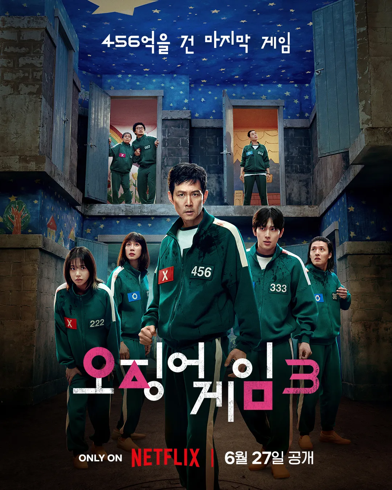
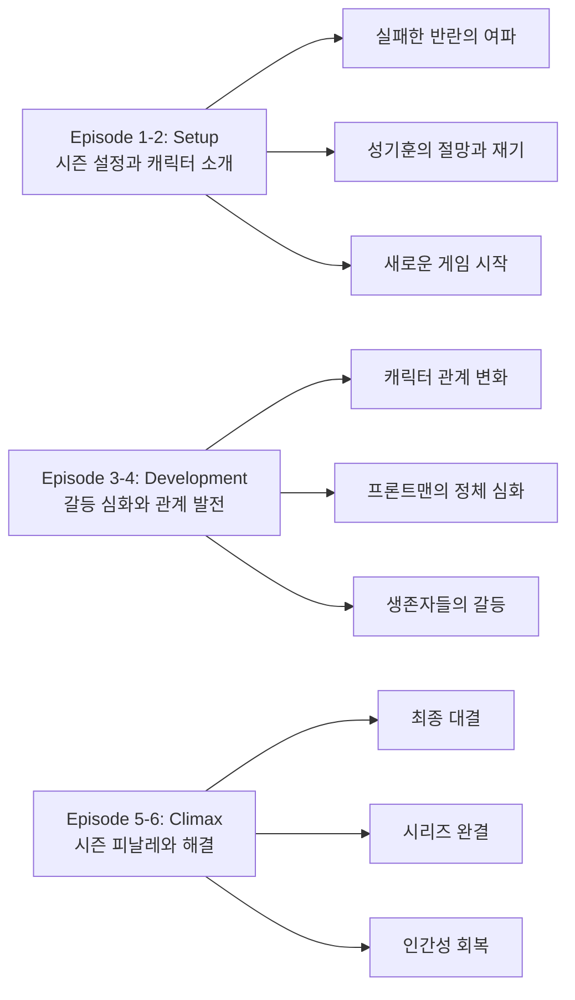
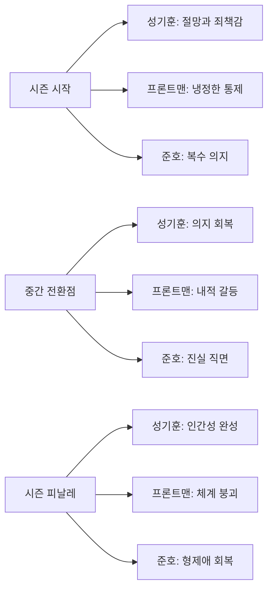
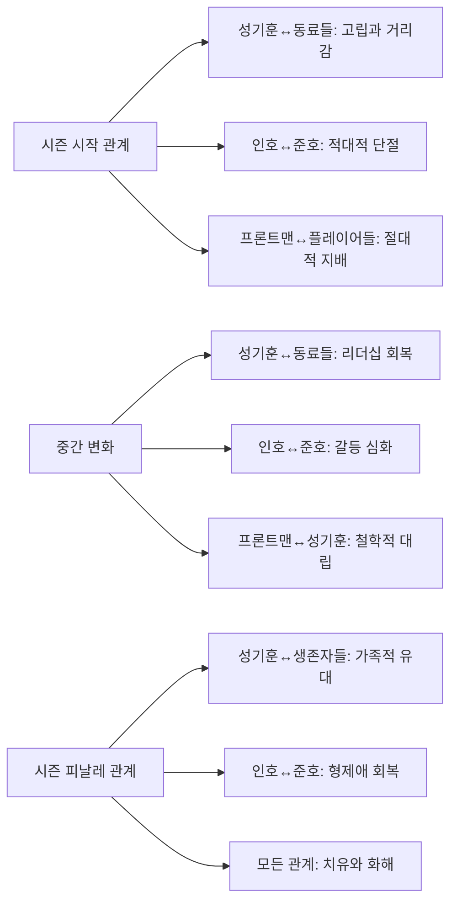

2025년 6월 27일, 전 세계를 열광시킨 오징어게임이 마침내 그 대서사시의 막을 내렸다. 시즌3는 456번 성기훈의 절망적인 상황에서 시작해, 프론트맨과의 최종 대결까지 6개의 에피소드에 압축적으로 담아낸 완결편이다. 실패한 반란, 친구의 죽음, 그리고 비밀스러운 배신의 여파 속에서 성기훈은 인생 최악의 순간을 맞이한다. 하지만 오징어게임은 누구를 위해서도 멈추지 않는다.

||
|:---:|
||

 

## 시즌3 게임 일람 및 결과(스포일러)

| 게임 | 등장 에피소드 | 핵심 룰/형식 | 주요 사건 | 결과/영향 |
|:--|:--:|:--|:--|:--|
| 영희와 철수(변형 ‘무궁화’) | 5 | 두 인형이 번갈아 명령, 패턴 인지·정지 | 배신/동맹 교차, 용식–금자 서사 심화 | 대규모 솎아내기, 파벌 재편 |
| 미로 게임 | 5 | 제한 시간 내 탈출, 함정 회피 | 팀 분리·재결합, 희생 누적 | 생존자 축소, 감정선 고조 |
| 하늘 오징어게임 | 6 | 공중 3기둥 영역 밀쳐내기, 봉·버튼 기믹 | 명기의 아기 인질극, 성기훈의 칼 단절 | 성기훈의 최종 선택(희생), 시스템 붕괴 시작 |

주: 시즌 내 ‘숨바꼭질(술래 vs 은신·탈출)’ 등 변형 규칙들이 복합적으로 삽입되어 동맹·배신 서사를 증폭한다.

## 주요 사망/생존 현황(스포일러)

| 인물 | 최종 상태 | 비고 |
|:--|:--:|:--|
| 성기훈 | 사망(자기희생) | 아기를 살리고 투신 |
| 이명기 | 사망 | 하늘 오징어게임 최종 국면 |
| 김준희 | 사망 | 아기 출산 후 투신으로 결단 |
| 장금자 | 사망 | 모성·희생의 클라이맥스 |
| 박용식 | 사망 | 금자와의 비극적 충돌 |
| 황인호(프론트맨) | 생존 | 시스템 자폭·회수 지시, 사후 정리 |
| 황준호 | 생존 | 잠입 라인 완결(후일 행보 암시) |
| 아기(준희의 아이) | 생존 | 최종 생존자로 보호 대상 |

## 결말 정리(스포일러)

- 최종 무대에서 성기훈은 아이를 살리고 스스로를 희생해 ‘우리는 사람’이라는 선언을 행동으로 완결한다.
- 시스템은 해경 접근·자폭 시퀀스로 붕괴 국면에 들어가고, 프론트맨은 잔여 정리를 수행한다.
- 사후: 경석의 일상 복귀, 우승 상금의 외부 이동(가영 향), 거리의 ‘딱지치기’ 암시로 세계관의 잔존을 남긴다.

## 시즌 개요

### 드라마 정보
* 제목: Squid Game Season 3 / 오징어게임 시즌3
* 시즌: Season 3 (최종 시즌)
* 총 에피소드: 6화
* 방영 기간: 2025.06.27 (Netflix 전 세계 동시 공개)
* 에피소드 평균 길이: 약 61분
* 감독: 황동혁
* 주연: 이정재, 이병헌, 위하준, 임시완, 조유리
* 장르: 스릴러, 드라마, 생존게임

### 시즌 위치와 연속성
* **전체 시리즈에서의 위치**: 3번째이자 최종 시즌
* **이전 시즌과의 연결점**: 시즌2의 실패한 반란 직후부터 시작
* **다음 시즌을 위한 복선**: 시리즈 완결로 다음 시즌 없음

### 시청률과 반응
* **제작 예산**: 공식 미공개
* **Netflix 글로벌 공개**: 전 세계 동시 스트리밍
* **시청자 반응**: 시리즈 완결에 대한 높은 관심과 기대
* **시즌 갱신 여부**: 시리즈 완결편

### 추천 대상
* **시즌1-2 시청자**: 시리즈의 완전한 결말을 원하는 기존 팬들
* **스릴러 애호가**: 고도의 긴장감과 심리적 서스펜스를 즐기는 시청자
* **사회비판 드라마 선호자**: 자본주의와 불평등에 대한 깊은 성찰을 원하는 시청자

## 시즌 전체 서사 아크

**🎬 스포일러 전체 공개 - 이미 시즌을 모두 본 독자를 위한 완전한 서사 분석**

### 시즌 메인 아크 구조

### 에피소드별 핵심 포인트

**Episode 1: "Keys and Knives" (열쇠와 칼)**
반란 실패 직후의 절망적 상황에서 성기훈이 의료실 침대에 수갑으로 묶인 채 깨어난다. 가장 친한 친구 정배의 죽음을 목격한 충격으로 완전히 무너진 상태에서 시작하며, "당신은 아직 게임이 끝나지 않았습니다"라는 차가운 대답이 시즌의 톤을 설정한다.

황준호의 최종 침입 계획과 강노을의 양심적 갈등이 병행되며, 시즌3의 주요 갈등 축을 제시한다. 특히 임신한 준희를 보호하려는 다른 플레이어들의 모습에서 인간애의 회복 가능성을 암시한다.

**Episode 2: "The Starry Night" (별이 빛나는 밤)**
성기훈과 생존자들의 재회가 이루어지며, 정배의 빈자리가 남긴 상처를 통해 상실과 애도의 과정을 그린다. 프론트맨과 VIP들의 긴급 회의에서 오징어게임의 진정한 목적이 드러나기 시작한다 - 단순한 도박이 아닌 인간 본성에 대한 거대한 실험이었다는 것이다.

지하 연구 시설의 공개를 통해 수십 년간 축적된 게임 데이터와 플레이어 행동 패턴 분석이 밝혀지며, 시리즈 전체의 더 큰 그림을 제시한다.

**Episode 3: "It's Not Your Fault" (당신 잘못이 아니야)**
성기훈의 내면 여행이 중심이 되는 에피소드로, 정배의 환상을 통한 죄책감과 용서의 과정을 그린다. "형, 이건 형 잘못이 아니야. 우리가 싸워야 할 건 서로가 아니라 이 시스템이야"라는 꿈속 정배의 위로가 시즌의 핵심 메시지를 전달한다.

다른 플레이어들의 과거 이야기가 플래시백으로 전개되며, 각자의 절망적 상황과 인간적 연대의 가능성을 동시에 보여준다. 성기훈의 정배 죽음 수용과 남은 사람들을 위한 재기 의지가 형성된다.

**Episode 4: "222" (222)**
김준희(222번)를 중심으로 한 에피소드로, 임신 8개월인 그녀의 절망적 상황과 모성애를 섬세하게 그린다. 조산 위험 상황에서 다른 플레이어들의 자발적 보호와 연대가 형성되며, 진정한 인간적 유대의 모습을 보여준다.

"엄마가 너를 위해 얼마나 많은 것을 포기했는지, 얼마나 사랑하는지 알아줬으면 좋겠다"는 준희의 편지는 시청자들에게 깊은 감동을 전한다. 명기의 변화된 모습을 통해 진정한 성장과 책임감의 의미를 탐구한다.

**Episode 5: "⭘△☐" (동그라미, 세모, 네모)**
오징어게임의 상징인 세 도형이 제목이 된 이 에피소드는 최종 게임을 앞둔 긴장감이 절정에 달한다. 새로운 게임 "영희와 철수"에서 두 인형의 복잡한 패턴은 플레이어들을 더욱 극한 상황으로 몰아넣는다.

용식의 어머니 금자를 위한 희생은 "어머니, 이제 빚은 다 갚았어요"라는 마지막 말과 함께 가족애의 숭고함을 보여준다. 프론트맨의 직접 등장과 거대한 하늘 플랫폼 공개로 최종 대결을 예고한다.

**Episode 6: "Humans Are..." (인간은...)**
90분 영화급 스케일의 시리즈 피날레로, 황준호의 섬 침입과 하늘 오징어게임이 동시에 진행된다. 성기훈과 프론트맨의 철학적 대결에서 "인간은 본질적으로 이기적인 존재인가, 아니면 선한 존재인가?"라는 근본적 질문이 제기된다.

준호와 인호 형제의 최종 대면을 통한 가족 비극의 완성과, 성기훈의 게임 종료 성공으로 "게임은 끝났지만, 인간다움은 계속된다"는 메시지로 시리즈가 마무리된다.

### 핵심 대사 모음
- "당신은 아직 게임이 끝나지 않았습니다" (Episode 1)
- "형, 이건 형 잘못이 아니야. 우리가 싸워야 할 건 서로가 아니라 이 시스템이야" (Episode 3)
- "엄마가 너를 위해 얼마나 많은 것을 포기했는지, 얼마나 사랑하는지 알아줬으면 좋겠다" (Episode 4)
- "어머니, 이제 빚은 다 갚았어요" (Episode 5)
- "인간은 본질적으로 이기적인 존재인가, 아니면 선한 존재인가?" (Episode 6)
- "게임은 끝났지만, 인간다움은 계속된다" (Episode 6)

### 상징적 장면 분석
꽃 패턴이 그려진 바닥에서 펼쳐지는 최종 게임은 아름다움과 잔혹함의 대비를 통해 오징어게임만의 독특한 미학을 완성시킨다. 생과 사의 경계에서 피어나는 희망의 은유로, 절망적 상황에서도 인간다움을 잃지 않으려는 의지를 상징한다.

### 줄거리 요약 (나무위키 기반)

본 요약은 나무위키 ‘오징어 게임/줄거리’ 시즌3 문단(2025-08-09 갱신) 내용을 바탕으로 핵심 서사를 압축 정리했습니다.

- 시즌2 반란 직후, 성기훈은 의료실에서 깨어나 다시 게임에 휘말린다.
- VIP와 프론트맨(황인호)은 확장된 실험을 준비하고, 황준호는 재잠입해 진실을 추적한다.
- ‘열쇠와 칼’, ‘별이 빛나는 밤에’를 거치며 생존 구도와 갈등이 재편된다.
- ‘숨바꼭질’·‘영희와 철수’·‘미로’ 등 변형 게임이 이어지며 희생과 배신이 교차한다.
- 김준희의 출산, 금자의 희생, 명기의 양가적 부성 등 인물선이 정점에 이른다.
- 최종 ‘하늘 오징어게임’에서 성기훈은 아기를 살리고 스스로를 희생한다.
- 형제(황준호·황인호)의 비극과 시스템 붕괴, “우리는 사람이야”라는 메시지로 마무리된다.

### 에피소드별 상세 줄거리

#### 1화: "Keys and Knives" (열쇠와 칼)

반란이 실패한 직후, 성기훈은 의료실 침대에 수갑으로 묶인 채 깨어난다. 가장 친한 친구 정배가 자신의 눈앞에서 프론트맨에게 총살당하는 장면이 머릿속에서 계속 재생된다. 절망에 빠진 성기훈은 간병인들에게 자신을 죽여달라고 애원하지만, 게임 운영진은 그를 살려둔다. "당신은 아직 게임이 끝나지 않았습니다"라는 차가운 대답만이 돌아온다.

한편 섬 밖에서는 황준호가 박 선장과 함께 최종 침입 계획을 세우고 있다. 시즌2에서 실패했던 경험을 바탕으로 더욱 정교한 작전을 준비한다. 무기와 장비를 점검하며, 이번에는 반드시 형 인호를 구출하겠다는 의지를 불태운다.

섬 내부에서는 강노을이 양심의 갈등을 겪기 시작한다. 북한에 남겨진 딸 미나를 구하기 위해 병사가 되었지만, 무고한 플레이어들이 죽어가는 모습을 보며 점점 괴로워한다. 특히 임신한 준희를 보호하려는 다른 플레이어들의 모습에서 인간애를 느끼며, 자신의 선택에 대해 회의하기 시작한다.

#### 2화: "The Starry Night" (별이 빛나는 밤)

성기훈이 드디어 다른 생존자들과 재회한다. 현주, 준희, 용식, 금자 등 시즌2에서 함께했던 동료들이 그를 반갑게 맞이하지만, 정배의 빈자리는 모두의 마음에 큰 상처를 남긴다. 성기훈은 처음에는 무기력했지만, 동료들의 격려와 함께 다시 게임을 끝내겠다는 의지를 조금씩 되찾는다.

같은 시간, 프론트맨 황인호는 VIP들과 긴급 회의를 소집한다. 지하 벙커의 럭셔리한 회의실에서 전 세계에서 온 VIP들이 홀로그램으로 참석한다. 리차드 VIP는 "게임의 재미가 떨어지고 있다"며 불만을 표하고, 인호는 "최종 시즌에 걸맞은 특별한 게임을 준비했다"고 대답한다. 이때 처음으로 오징어게임의 진정한 목적이 드러나기 시작한다 - 단순한 도박이 아닌, 인간 본성에 대한 거대한 실험이었다는 것이다.

에피소드 말미에는 섬의 지하 깊숙한 곳에 있는 거대한 연구 시설이 공개된다. 수십 년간 축적된 게임 데이터와 플레이어들의 행동 패턴이 분석되고 있으며, 이 모든 것이 어떤 거대한 목적을 위한 것임이 암시된다.

#### 3화: "It's Not Your Fault" (당신 잘못이 아니야)

성기훈의 내면 여행이 시작되는 에피소드다. 밤마다 정배의 환상이 나타나 그를 괴롭힌다. 꿈속에서 정배는 성기훈에게 "형이 나를 죽였어"라고 말하며, 성기훈은 극심한 죄책감에 시달린다. 

하지만 어느 날 밤, 꿈속의 정배가 다른 모습으로 나타난다. "형, 이건 형 잘못이 아니야. 우리가 싸워야 할 건 서로가 아니라 이 시스템이야"라며 성기훈을 위로한다. 이 장면에서 이서환 배우의 깊은 연기력이 빛을 발하며, 시청자들의 눈물샘을 자극한다.

동시에 다른 플레이어들의 과거 이야기가 플래시백으로 전개된다. 현주의 성전환 수술을 위한 노력, 준희와 명기의 과거 연애사, 용식과 금자 모자의 빚더미 이야기 등이 세밀하게 그려진다. 특히 용식이 도박 중독으로 가족을 파탄 낸 과거와 어머니 금자의 희생적인 사랑이 감동적으로 묘사된다.

에피소드의 클라이맥스에서 성기훈은 드디어 정배의 죽음을 받아들이고, 남은 사람들을 위해 다시 싸우겠다는 결심을 한다.

#### 4화: "222" (222)

이 에피소드는 전적으로 김준희(222번)를 중심으로 전개된다. 임신 8개월인 그녀의 절망적인 상황이 섬세하게 그려진다. 명기와 헤어진 후 혼자 아이를 키우려고 했지만, 의료비와 생활비 때문에 결국 게임에 참여하게 된 배경이 상세히 설명된다.

게임 중에 준희가 배가 아프기 시작하고, 조산의 위험이 생긴다. 다른 플레이어들은 그녀를 보호하기 위해 자발적으로 방패막이가 되고, 현주는 자신의 의료 지식을 동원해 준희를 돕는다. 이 과정에서 플레이어들 간의 진정한 연대가 형성된다.

가장 감동적인 순간은 준희가 아이에게 편지를 쓰는 장면이다. "엄마가 너를 위해 얼마나 많은 것을 포기했는지, 얼마나 사랑하는지 알아줬으면 좋겠다"며 눈물을 흘리는 모습은 시청자들에게 깊은 여운을 남긴다.

명기는 준희와 아이를 지키기 위해 목숨을 걸고 다른 플레이어들과 맞선다. 과거의 이기적인 모습에서 벗어나 진정한 아버지가 되려는 그의 변화가 감동적으로 그려진다.

#### 5화: "⭘△☐" (동그라미, 세모, 네모)

오징어게임의 상징인 세 도형이 제목이 된 이 에피소드는 시리즈 전체에서 가장 긴장감 넘치는 에피소드다. 최종 게임을 앞두고 플레이어들은 마지막 선택의 기로에 선다.

새로운 게임 "영희와 철수"가 시작된다. 시즌1의 영희 인형에 더해 남자 인형 철수가 등장한다. 두 인형이 번갈아 가며 "무궁화 꽃이 피었습니다"와 "김치 맛있게 드세요"를 외치며, 플레이어들은 더욱 복잡한 패턴을 파악해야 한다.

게임 도중 배신과 동맹이 복잡하게 얽힌다. 일부 플레이어들은 살아남기 위해 약한 동료들을 밀쳐내고, 다른 이들은 끝까지 서로를 보호하려 한다. 이 과정에서 인간의 본성이 적나라하게 드러난다.

가장 충격적인 순간은 용식이 어머니 금자를 구하기 위해 자신을 희생하는 장면이다. "어머니, 이제 빚은 다 갚았어요"라는 마지막 말과 함께 제거당하는 모습은 시청자들에게 큰 충격을 준다.

에피소드 말미에는 프론트맨이 직접 게임장에 나타나 최종 게임을 예고한다. "이제 진짜 오징어게임이 시작됩니다"라는 그의 말과 함께 거대한 하늘 플랫폼이 공개된다.

#### 6화: "Humans Are..." (인간은...)

시리즈의 대미를 장식하는 최종 에피소드는 90분의 영화급 스케일로 제작되었다. 

황준호의 섬 침입 작전이 본격적으로 시작된다. 정교한 계획에 따라 섬의 보안 시스템을 뚫고 내부로 잠입하는 과정이 액션 영화 수준의 긴장감으로 그려진다. 하지만 이미 그의 침입을 예상한 프론트맨이 함정을 준비하고 있었다.

한편 하늘 오징어게임이 시작된다. 거대한 공중 플랫폼에서 펼쳐지는 최종 게임은 시각적으로도 압도적이다. 성기훈, 현주, 준희, 명기 등 주요 인물들이 마지막 생존을 위해 치열하게 경쟁한다.

클라이맥스에서는 성기훈과 프론트맨의 일대일 대결이 펼쳐진다. 물리적인 싸움을 넘어선 철학적 대화가 이어진다. "인간은 본질적으로 이기적인 존재인가, 아니면 선한 존재인가?"라는 근본적인 질문을 두고 두 사람이 대립한다.

준호와 인호 형제의 최종 대면도 감동적으로 그려진다. "형은 왜 이런 일을 했어?"라는 준호의 절규와 "세상을 바꾸려고 했다"는 인호의 대답이 형제의 비극을 완성한다.

하늘 오징어게임의 마지막 순간, 성기훈은 철근을 붙잡고 기둥 위로 다시 올라왔지만 알고 보니 게임 시작 버튼이 눌러져있지 않은 상태였다. 결국 자신과 준희의 아기 중 하나는 탈락해야 끝나는 상황에 놓이게 된다. 성기훈은 아이를 안고 절벽에 서서 VIP들을 한참 동안 응시한 후, 아이에게 한 번 입맞춤을 한 뒤 공항에서 프론트맨에게 했듯이 자신들은 말이 아니라는 전언을 남기며 준희의 아이를 남겨 두고 스스로 절벽에서 몸을 던져 생을 마감한다.

시리즈는 성기훈의 숭고한 희생으로 마무리된다. 하지만 진정한 승리는 게임을 이기는 것이 아니라 인간다움을 지키는 것이었다는 메시지가 전해진다. 성기훈의 최종 선택은 생명을 보호하는 것이 그 어떤 승리보다 소중하다는 것을 보여주며, "게임은 끝났지만, 인간다움은 계속된다"는 메시지로 시리즈가 완성된다.

## 캐릭터 성장 아크 (시즌 전체)

### 시즌별 캐릭터 변화도

### **주요 캐릭터 시즌 아크**

**성기훈 - 456번 (이정재) - 시즌 전체 성장**

**시즌 시작점**
* 상황: 실패한 반란과 정배의 죽음으로 인한 극도의 절망 상태
* 목표: 자살 충동과 게임 종료에 대한 이중적 갈망
* 갈등: 생존자로서의 죄책감과 시스템에 대한 분노
* 관계: 동료들과의 거리감, 고립된 상태

**시즌 중간 전환점**
* 변화: 정배의 환상을 통한 용서와 자기 수용 과정
* 성장: 개인적 복수에서 시스템 자체를 향한 투쟁으로 전환
* 관계 변화: 생존자들과의 재결속, 리더십 회복
* 갈등 심화: 프론트맨과의 철학적 대립 본격화

**시즌 피날레 완성**
* 최종 상태: 진정한 의미의 승리자, 인간다움의 수호자
* 성장 완성: 복수가 아닌 시스템 종료를 통한 치유 선택
* 관계 완성: 생존자들과의 새로운 가족적 유대 형성
* 미래 전망: 시리즈 완결로 평화로운 일상 복귀 암시

**캐릭터 아크의 의미**
성기훈의 성장은 개인적 트라우마를 극복하고 더 큰 선을 위해 싸우는 영웅적 여정의 완성을 보여준다. 복수가 아닌 치유를 선택함으로써 진정한 인간성의 승리를 구현한다.

**황인호 - 프론트맨/001번 (이병헌) - 시즌 전체 변화**

**시즌 시작점**
* 상황: 게임 운영의 절대적 통제자로서의 냉정함 유지
* 목표: 시스템의 완벽한 운영과 실험 완료
* 갈등: 동생 준호에 대한 감정적 갈등 억압
* 관계: 모든 관계에서의 감정적 차단 상태

**시즌 중간 전환점**
* 변화: 성기훈과의 대화를 통한 내적 균열 시작
* 성장: 시스템에 대한 회의와 인간적 감정의 부활
* 관계 변화: 동생에 대한 감정적 갈등 심화
* 갈등 심화: 시스템 수호자 vs 인간적 형으로서의 이중성

**시즌 피날레 완성**
* 최종 상태: 시스템의 붕괴와 함께 인간성 회복
* 성장 완성: 통제자에서 구원받는 자로의 전환
* 관계 완성: 동생과의 화해와 형제애 재확인
* 미래 전망: 시스템에서 벗어난 새로운 삶의 가능성

**캐릭터 아크의 의미**
절대권력의 타락에서 인간성 회복으로의 여정을 통해 구원의 가능성을 보여준다. 시스템의 가해자도 결국 피해자였음을 드러내며 용서와 치유의 메시지를 전달한다.

**황준호 (위하준) - 시즌 전체 성장**

**시즌 시작점**
* 상황: 형에 대한 복잡한 감정과 정의에 대한 신념 갈등
* 목표: 형의 구출과 시스템 폭로
* 갈등: 형에 대한 사랑과 그의 행동에 대한 분노
* 관계: 형과의 단절된 관계, 외로운 투쟁

**시즌 중간 전환점**
* 변화: 형의 진정한 동기와 고통에 대한 이해 시작
* 성장: 단순한 정의 집행에서 치유와 구원으로 목표 전환
* 관계 변화: 성기훈과의 동맹 형성
* 갈등 심화: 법적 정의 vs 인간적 용서의 딜레마

**시즌 피날레 완성**
* 최종 상태: 형을 구원한 진정한 경찰관
* 성장 완성: 복수가 아닌 구원을 선택한 성숙한 형
* 관계 완성: 형과의 진정한 화해와 이해
* 미래 전망: 형과 함께하는 새로운 삶의 시작

**캐릭터 아크의 의미**
정의와 사랑의 조화를 통해 진정한 구원이 무엇인지를 보여준다. 법적 처벌보다 인간적 회복이 더 큰 의미를 갖는다는 메시지를 전달한다.

## 관계도 변화 역학

### 시즌별 관계 변화도

### 주요 관계 변화 분석

**성기훈과 생존자들의 관계**

**시즌 시작**
* 관계 상태: 정배의 죽음으로 인한 깊은 죄책감과 고립
* 갈등 요소: 리더로서의 책임감 vs 개인적 절망감
* 발전 가능성: 서로의 상처를 통한 더 깊은 유대 형성 가능성
* 상호작용: 거리감 있는 소통, 회피적 행동 패턴

**시즌 중간**
* 변화 과정: 현주, 준희 등의 지지를 통한 점진적 회복
* 갈등 심화/해소: 개인적 죄책감에서 집단적 연대감으로 전환
* 새로운 요소: 보호자 역할에서 동등한 동료 관계로 발전
* 상호작용 변화: 일방적 책임감에서 상호 지지로 변화

**시즌 피날레**
* 최종 상태: 혈연을 넘어선 진정한 가족적 유대 형성
* 해결/미해결: 모든 갈등 해소, 상호 신뢰 완성
* 관계의 의미: 트라우마를 공유한 생존자들 간의 치유적 관계
* 미래 전망: 게임 종료 후 새로운 삶을 함께할 동반자 관계

**관계 변화의 드라마적 효과**
개인적 고립에서 집단적 연대로의 변화는 시청자들에게 희망과 치유의 메시지를 전달하며, 인간관계의 회복이 개인적 성장의 핵심임을 보여준다.

**황인호와 황준호 형제 관계**

**시즌 시작**
* 관계 상태: 적대적 대립, 완전한 감정적 단절
* 갈등 요소: 정의 vs 시스템, 형제애 vs 법적 의무
* 발전 가능성: 과거 형제애의 회복 가능성
* 상호작용: 일방적 추격과 회피의 관계

**시즌 중간**
* 변화 과정: 인호의 과거와 동기에 대한 준호의 이해 시작
* 갈등 심화/해소: 분노에서 연민으로의 감정 변화
* 새로운 요소: 구원과 용서의 가능성 등장
* 상호작용 변화: 적대에서 대화 가능성으로 전환

**시즌 피날레**
* 최종 상태: 진정한 형제애의 회복과 상호 이해
* 해결/미해결: 모든 오해와 갈등 해소
* 관계의 의미: 무조건적 사랑과 용서의 힘
* 미래 전망: 함께 새로운 삶을 시작할 진정한 형제

**관계 변화의 드라마적 효과**
법과 정의를 넘어선 가족적 사랑의 승리를 보여주며, 어떤 죄도 무조건적 사랑 앞에서는 용서받을 수 있음을 전달한다.

**성기훈과 프론트맨의 대립 관계**

**시즌 시작**
* 관계 상태: 절대적 지배자와 반항자의 관계
* 갈등 요소: 개인적 복수 vs 시스템적 통제
* 발전 가능성: 철학적 대화를 통한 상호 이해
* 상호작용: 일방적 권력 관계

**시즌 중간**
* 변화 과정: 대화를 통한 서로의 동기와 신념 이해
* 갈등 심화/해소: 개인적 적대에서 이념적 대립으로 심화
* 새로운 요소: 상호 존중과 철학적 토론의 가능성
* 상호작용 변화: 권력 관계에서 사상가 간의 대화로 전환

**시즌 피날레**
* 최종 상태: 적이 아닌 다른 길을 선택한 두 인간의 이해
* 해결/미해결: 이념적 차이는 인정하되 인간적 존중 확립
* 관계의 의미: 선택의 차이가 만드는 인생의 갈림길
* 미래 전망: 각자의 길에서 서로를 기억하는 관계

**관계 변화의 드라마적 효과**
절대적 선악 구조를 넘어 복잡한 인간성과 선택의 무게를 보여주며, 적도 이해할 수 있는 존재임을 깨닫게 한다.

## 새로운 게임들

### 하늘 오징어게임 (Sky Squid Game)

시즌3의 하이라이트인 최종 게임. 거대한 공중 플랫폼에서 펼쳐지는 오징어게임으로, 기존의 평면적인 게임과는 완전히 다른 3차원적인 공간에서 진행된다. 높이에 대한 공포와 함께 더욱 긴장감 넘치는 게임이 펼쳐진다.

### 영희와 철수 (Young-hee and Cheol-su)

시즌2 마지막에 예고되었던 두 번째 인형 철수가 등장한다. 무궁화 꽃이 피었습니다와 비슷하지만, 두 인형이 번갈아 가며 지시를 내리는 더욱 복잡한 게임이다.

### 미로 게임

거대한 미로에서 펼쳐지는 새로운 게임. 플레이어들은 제한 시간 내에 미로를 탈출해야 하며, 곳곳에 숨겨진 함정들을 피해야 한다.

## 시대적 배경과 메시지

시즌3는 코로나19 팬데믹 이후의 세계를 배경으로, 더욱 심화된 사회적 불평등과 절망을 다룬다. 암호화폐 폭락, 부동산 거품 붕괴, 그리고 전 세계적인 경제 위기 속에서 게임에 참여하는 사람들의 동기가 더욱 절실해진다.

특히 시즌3에서는 '인간다움'이라는 주제가 더욱 강조된다. 극한 상황에서 인간은 과연 어떤 선택을 하는가? 생존을 위해 타인을 희생할 것인가, 아니면 인간다움을 지킬 것인가? 이러한 철학적 질문들이 게임 전반에 걸쳐 지속적으로 제기된다.

## 작품 평가

### 연출과 연기

황동혁 감독은 시즌3에서 더욱 성숙한 연출력을 보여준다. 특히 심리적 긴장감을 표현하는 방식이 한층 정교해졌으며, 액션 시퀀스와 감정적인 드라마 사이의 밸런스가 완벽하다.

이정재는 시즌1의 순진한 성기훈에서 시즌3의 어둡고 결연한 성기훈으로의 변화를 설득력 있게 표현했다. 이병헌은 프론트맨으로서의 냉정함과 인호로서의 내적 갈등을 동시에 보여주며 뛰어난 연기력을 과시했다.

### 시각적 완성도

시즌3는 시리즈 중 가장 뛰어난 시각적 완성도를 자랑한다. 하늘 오징어게임의 웅장한 스케일, 미로 게임의 정교한 세트 디자인, 그리고 폭발적인 액션 시퀀스들이 시청자들을 압도한다.

특히 꽃 패턴이 그려진 바닥에서 펼쳐지는 최종 게임 장면은 아름다움과 잔혹함이 공존하는 오징어게임만의 독특한 미학을 완성시킨다.

### 스토리텔링

시즌3는 6개 에피소드라는 짧은 분량에도 불구하고 모든 떡밥을 깔끔하게 회수하며 만족스러운 결말을 제공한다. 성기훈의 성장 아크, 황인호 형제의 갈등, 그리고 오징어게임이라는 시스템의 종료까지 모든 이야기가 유기적으로 연결된다.

## 시즌3만의 특별함

### 감정적 깊이

시즌1이 충격과 신선함으로, 시즌2가 확장된 세계관으로 주목받았다면, 시즌3는 감정적 깊이로 승부한다. 등장인물들의 내적 성장과 변화가 세밀하게 그려지며, 시청자들에게 깊은 여운을 남긴다.

### 액션의 진화

시즌3의 액션 시퀀스는 단순한 게임을 넘어선 전쟁 영화 수준의 스케일을 보여준다. 특히 준호의 섬 침입 시퀀스와 최종 대결 장면은 시리즈 최고의 액션으로 평가받는다.

### 철학적 메시지

"인간은 무엇인가?"라는 근본적인 질문으로 마무리되는 시즌3는 단순한 서바이벌 스릴러를 넘어 인간 존재에 대한 깊은 성찰을 제공한다.

## 숨겨진 레이어

### 상징적 의미
오징어게임 시즌3는 '꽃'이라는 상징을 통해 절망 속에서 피어나는 희망을 표현한다. 최종 게임의 꽃 패턴 바닥은 죽음과 생명, 절망과 희망의 경계를 시각적으로 구현하며, 인간의 존재 자체가 아름다운 기적임을 암시한다.

### 사회적/문화적 맥락
코로나19 이후 심화된 사회적 불평등과 절망을 배경으로, 시즌3는 개인의 트라우마를 넘어 사회 전체의 치유 가능성을 탐구한다. 게임 시스템의 종료는 단순한 개인적 승리가 아닌 잘못된 사회 구조의 해체를 상징한다.

### 현대적 메시지
'인간다움'이 무엇인지에 대한 근본적 질문을 통해, 물질적 성공보다 인간적 가치의 중요성을 강조한다. 성기훈의 최종 선택은 복수보다 치유를, 개인적 만족보다 집단적 회복을 선택하는 현대적 영웅상을 제시한다.

### 시즌 테마의 심화
'용서와 구원'이라는 시즌3의 핵심 테마는 기존 시즌의 '생존과 경쟁', '반항과 저항'을 한 단계 승화시킨 것이다. 개인적 트라우마의 극복과 사회적 갈등의 해소를 동시에 다루며 시리즈의 완성도를 높인다.

## 드라마 이론 적용 (최소 3개)

- 3막 구조(Three-Act Structure):
  - Act I(1-2화): 실패한 반란의 여파, 목표·갈등 재설정, 새로운 게임 선언
  - Act II(3-4화): 연대/배신의 진자운동, 인물 내면 갈등 심화, 형제 서사의 균열
  - Act III(5-6화): 변형 게임 총집(⭘△☐)과 하늘 오징어게임, 도덕적 선택의 결말
- 영웅 여정(Monomyth): 소환(1화) → 시련(2-5화) → 최종 시련과 자기희생(6화) → 귀환의 부재이지만 메시지의 전승(유아 보호)
- 체호프의 총(Chekhov’s Gun): 시즌2 말미 ‘철수’ 암시, 공중 플랫폼·버튼 기믹·꽃 패턴 등 사전 제시 요소가 피날레에서 기능적 회수
- 아리스토텔레스의 카타르시스: 비극적 선택을 통한 정화가 관객 감정의 해소로 귀결, 가족·연대 테마의 윤리적 승리

## 비교 분석 (3편 이상)

| 작품 | 공통점 | 차별점 | 시즌3의 강점 |
|:--|:--|:--|:--|
| Alice in Borderland S2 | 데스게임 구조, 팀·배신·연대 | 퍼즐 중심 두뇌전 비중 | 감정선·철학 질문을 결말 중심에 배치 |
| The Hunger Games: Catching Fire | 체제 비판, 쇼-화된 폭력 | 청소년 톤, 영웅서사 | 도덕 딜레마와 집단 치유를 통한 어른 드라마 |
| Black Mirror: White Bear | 관음·형벌 윤리 | 단편 옴니버스 | 시즌 전체를 관통하는 윤리 질문의 누적과 해소 |

## 제작 비하인드

### 시즌 제작 과정의 특별함
시즌2와 동시 촬영된 시즌3는 6개월간의 집중적인 제작 과정을 거쳤다. 황동혁 감독은 "시즌2와 3을 하나의 큰 이야기로 구상했다"며 연속적인 서사 구조의 중요성을 강조했다.

### 캐스팅 스토리
위하준의 시즌3 비중 확대는 시즌2에서의 아쉬웠던 스크린 타임에 대한 제작진과 팬들의 피드백이 반영된 결과다. 그는 "더 큰 이야기의 일부였다"며 시즌3에서의 활약을 예고했었다.

### 기술적 혁신
하늘 오징어게임을 위한 공중 플랫폼 세트는 시리즈 역사상 가장 복잡하고 규모가 큰 세트로, 실제 높이감과 위험성을 구현하기 위해 특수 안전 장비와 촬영 기법이 동원되었다.

### 시청자 반응과 제작진의 대응
글로벌 팬들의 시리즈 완결에 대한 우려에 대해 황동혁 감독은 "성기훈의 이야기는 여기서 끝나지만, 오징어게임 세계관은 계속될 수 있다"며 향후 가능성을 열어두었다.

## 시즌 종합 평가

### 시즌 완성도 평가

**최종 평점: ★★★★☆ (4.0/5)**

### 한 줄 평
절망의 끝에서 찾은 인간다움의 승리, 완벽한 시리즈 피날레의 새로운 기준을 제시한 걸작

### 추천 작품
이 시즌을 좋아할 만한 시청자들에게 추천하는 작품들:
- **Breaking Bad Season 5**: 완벽한 시리즈 피날레의 예술
- **The Good Place**: 철학적 깊이와 감동적 완결
- **Dark Season 3**: 복잡한 서사의 만족스러운 마무리
- **Chernobyl**: 인간 드라마와 사회적 메시지의 조화

### 관람 전 체크리스트
이 시즌을 보기 전에 반드시 확인해야 할 사항들:
- **시즌1-2 완주 필수**: 캐릭터 관계와 복선 이해 필요
- **스포일러 주의**: 시리즈 완결편으로 중요한 결말 포함
- **감정적 준비**: 강렬한 감정적 클라이맥스와 이별 준비
- **철학적 내용**: 인간 존재에 대한 깊은 성찰 내용 포함

오징어게임 시즌3는 세계적인 현상이 된 시리즈의 완벽한 마무리다. 압축적이면서도 여운 깊은 스토리텔링, 최고 수준의 시각적 완성도, 그리고 뛰어난 연기가 조화를 이루어 시리즈 최고작이라 할 만하다.

시즌1이 던진 사회적 메시지, 시즌2가 확장한 세계관, 그리고 시즌3가 완성한 인간에 대한 깊은 성찰은 오징어게임을 단순한 엔터테인먼트를 넘어선 문화적 유산으로 만들어냈다.

456번 성기훈의 여정이 마침내 끝났지만, 오징어게임이 남긴 메시지는 오랫동안 우리 곁에 남을 것이다. 인간다움을 잃지 않고 살아가는 것의 소중함, 그리고 희망을 포기하지 않는 것의 중요함을 다시 한번 깨닫게 해주는 걸작이다.

*"게임은 끝났지만, 인간다움은 계속된다."* 