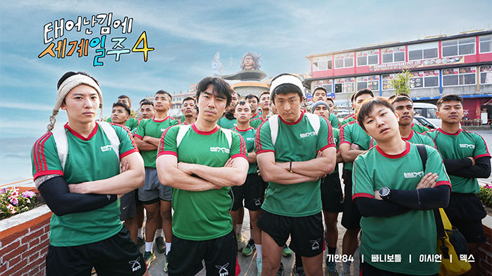

시즌4는 “멀리서 보면 동화, 가까이서 보면 다큐”였던 네팔 히말라야의 현실을 정면으로 마주한 여정이다. 루클라의 짧고 가파른 활주로로 상징되는 위험, 이마끈으로 수십 kg을 받쳐 나르는 셰르파의 노동, 해발 고도에 무릎 꿇는 몸과 익숙해지려는 마음. 그 한복판에서 네 사람은 각자 다른 속도로 숨을 고르고, 결국 같은 곳을 바라보게 된다. 본 글은 다시보지 않아도 될 만큼 자세한 스포일러 중심의 회차별 전편 정리다.

||
|:---:|
||

## 프로그램 정보

- 방송사: MBC (일요일 21:10)
- 시즌: 4
- 회차: 총 8부작
- 방영: 2025.05.11 ~ 2025.06.29
- 출연: 기안84, 이시언, 빠니보틀, 덱스
- 주요 콘셉트: 네팔 히말라야 고산 루트(일명 ‘차마고도’)를 따라가며 셰르파의 삶, 티베트 불교 문화, 네팔 로컬 식·의·주와 마주하는 여행 다큐 예능

## 시즌 요약(한눈에)

- 시작: 카트만두에서 루클라 경유, 남체바자르로 이어지는 고산 적응 루트 돌입
- 전개: 기안84의 ‘짐꾼 체험’ 동행, 네팔 로컬 식문화·전통 의상 체험, 안나푸르나 뷰 캠핑과 팀 합류 완전체 케미
- 클라이맥스: 고산 트레킹 분투, 오체투지·사원 방문, 가족사진 촬영으로 현지 문화와 깊이 접속
- 마무리: 네팔 풀빌라 힐링과 서로를 위한 선물·메시지, “여정은 끝나도 마음은 남는다”는 결론

## 에피소드별 상세 줄거리 (완전 스포일러)

### 1화 — 루클라로 가는 길, 셰르파의 어깨 위에서 시작되다
카트만두 공항에서 환전·유심·장비 점검을 끝낸 기안84는 소형기·헬기를 타고 루클라에 내린다. ‘세계에서 가장 위험한 활주로’라는 경고처럼 착륙 순간부터 손에 땀을 쥐게 한다. 트레일 초입에서 만난 MZ 세대 셰르파 ‘타망’과 합류한 기안84는 이마끈으로 무게를 지탱하는 전통 방식에 직접 도전한다. 처음엔 20kg도 버겁지만, 호흡·보폭을 맞추며 한 걸음씩 남체바자르를 향한다. 타망은 티베트 불교 기도 깃발 ‘타르초’의 의미(바람이 돌면 소원이 번진다)를 설명하고, 해 질 녘 쿡서 차를 나눠 마시며 하루를 마감한다.

### 2화 — 남체바자르 입성, 타르초 아래에서 맺은 약속
고소 적응을 위해 ‘느리게, 오래’의 리듬을 택한다. 돌계단마다 심박이 치솟고, 어지러움이 밀려온다. 타망은 “페이스가 전부”라며 배낭 무게 분산과 이마끈 각도를 잡아준다. 마을 입구에서 기안84는 타망에게 한국 라면을 끓여주며 서로의 음식을 바꿔 먹는다. 작별을 앞두고 타망은 자신의 고향집에 전시된 가족 사진을 보여주며 “당신도 가족”이라는 말을 건넨다. 밤, 타르초 사이로 별이 흐른다. 다음 회차에 다시 만날 사람들을 떠올리며, 기안84는 비워진 숨을 채운다.

### 3화 — 완전체 재결합: 빠니보틀·이시언, 그리고 깜짝 덱스
카트만두 시내에서 빠니보틀·이시언과 재회. 여행 베테랑 빠니보틀은 이동 동선을 다듬고, 이시언은 특유의 입담으로 분위기를 끌어올린다. 휴대폰 너머 “곧 간다”던 목소리와 함께 덱스가 깜짝 합류하면서 비로소 팀 케미가 완성된다. 네 사람은 로컬 식당에서 달밧·모모를 먹고, 거리 시장에서 난전 흥정도 배운다. ‘구르카 트레이닝’ 체험장에서 베이직 체력 테스트를 받는 장면은 폭소와 자괴를 동시에 선사한다. 저녁, 게스트하우스 공용 주방에서는 ‘통파쌈 삼합’(대파·수육·김치) 즉석 요리가 탄생한다.

### 4화 — 차마고도 트레킹: 숨의 길 위에서 서로를 고정하다
본격 트레킹. 돌길과 현수교, 폭이 좁은 절벽길이 이어진다. 짐 분배를 두고 실랑이가 나지만 곧 ‘가벼운 사람은 앞, 무거운 사람은 뒤’ 원칙으로 정리된다. 고산 두통과 메스꺼움이 덮치자 빠니보틀이 수분·염분·당 보충 루틴을 제안하고, 이시언은 속도를 낮춰 ‘말 걸기 호흡’을 유도한다. 덱스는 후미 보호를 맡는다. 어느 마을 사원 앞에서 오체투지를 수행하는 수행자들을 만난다. 기안84는 “몸을 낮추니 마음이 비워진다”고 적는다. 하산길에 만난 12살 셰르파 소년의 슬리퍼 등굣길은 침묵의 여운을 남긴다.

### 5화 — 안나푸르나 뷰 캠핑: 불·칼·냄비, 그리고 웃음
안나푸르나 트레킹 루트의 전망 포인트로 이동해 텐트를 친다. 빠니보틀이 불과 바람의 각도를 잡고, 덱스는 고기 손질을 맡는다. 기안84는 ‘통파쌈 삼합’과 김치찌개에 재도전하는데, 간 맞추기와 위생 강박 사이에서 허둥댄다. 이시언은 출국 전 아내 서지승이 싸준 반찬 6종을 꺼내 모두를 울컥하게 한다. 바람이 거세지자 텐트 팩을 옮기고 레이아웃을 바꾸는 등 팀워크가 빛난다. 새벽, 구름이 벗겨지며 설산 능선이 불타듯 물드는 ‘골든 아워’가 화면을 가른다.

### 6화 — 전통 의상 ‘가족사진’과 거리 런웨이, 낯선 도시의 우리가 가족이 되는 법
카트만두의 전통 사진관에서 네팔 의상으로 갈아입고 정식 가족사진을 촬영한다. 기안84의 과감한 포즈, 이시언의 포멀, 빠니보틀의 소박함, 덱스의 카리스마가 기묘하게 어울린다. 거리로 나오자 즉석 ‘런웨이’가 열린다. 상점 주인들은 박수를 치고, 아이들은 카메라 앞에서 장난을 친다. 사진관 사장님은 인화된 사진을 건네며 “여행의 가족에게”라고 적어준다. 저녁에는 티베트 마을에서 만난 상인과 차를 나누며, 오체투지의 의미(몸·말·마음의 합일)를 다시 듣는다.

### 7화 — 힐링 스테이: 네팔 풀빌라에서 꺼내는, 서로를 위한 선물
덱스가 형들을 위해 예약한 풀빌라로 이동한다. 따뜻한 물, 푹신한 침대, 침묵이 흐르는 밤. 이시언은 한 사람씩 불러 몰래 준비한 선물을 전한다. 기안84에겐 호흡을 기록하는 작은 노트, 빠니보틀에겐 밤새 옮겨붙인 동선 메모의 가죽 커버, 덱스에겐 “늘 뒤에서 밀어줘 고맙다”는 편지. 덱스는 “형들이 있어 내가 있다”고 답한다. 기안84는 컨디션 난조로 잠시 말이 줄지만, 셋의 배려와 농담이 그의 웃음을 되찾아준다.

### 8화 — 귀환: 타르초는 계속 흔들리고, 우리의 일상도 계속된다
마지막 날, 각자의 ‘첫 장면’으로 돌아가 소원을 빈다. 기안84는 루클라 활주로를 내려다보며 “처음엔 두려웠고, 지금도 두렵다. 그래도 간다”라고 말한다. 네 사람은 카트만두의 분주한 소음 속에서 마지막 달밧을 먹고, 서로의 등을 두드린다. 공항에서 포옹으로 끝. 자막은 “유종의 미를 거뒀다”는 한 줄로 여행의 끝을 기록한다. 하지만 화면 밖, 타르초는 계속 흔들린다.

## 하이라이트/명장면

- ‘이마끈 첫날’의 탄식과 웃음: 무게에 짓눌리던 허리가 리듬을 찾는 순간
- 남체바자르의 밤하늘: 타르초 사이로 흐르는 성운 타임랩스
- 오체투지: 몸을 낮추는 동작이 네 사람의 말수를 줄인 장면의 힘
- 안나푸르나 골든 아워: 경이 앞에서 아무 말도 못 하던 1분
- 전통 의상 가족사진: 흩어진 네 사람의 캐릭터가 한 장에 수렴하는 순간
- 풀빌라 선물 교환: 예능의 탈을 쓴 다큐가 되는 지점

## 제작 비하인드/포맷 포인트

- 고산 촬영: 낮은 산소·강풍·불규칙한 일사량으로 인한 장비 셋업 변환(배터리·메모리 관리 루틴 강화)
- 동선 운영: 고산 적응(상승·휴식·하강) 주기와 예능 리듬(몰입·완화)의 균형
- 팀 캐릭터: 빠니의 ‘동선·물자’, 이시언의 ‘정서·완충’, 덱스의 ‘체력·후미’, 기안84의 ‘주제·시점’이 퍼즐처럼 맞물림

## 여행 인사이트/문화 포인트

- 셰르파의 노동 윤리: ‘천천히·오래·함께’가 안전을 만든다
- 오체투지: 수행의 기술이자 일상의 예절. 몸·말·마음의 일치를 배우는 체험
- 타르초: 기도가 바람을 타는 상징. 떠난 마음이 남는 곳
- 로컬 식문화: 달밧의 밸런스(탄수·단백·염분), 모모의 지역별 변주, 차이의 온기

## 총평

예능의 웃음을 빌리되, 마지막엔 사람과 풍경이 남는다. 시즌4는 ‘누가 더 멀리 갔는가’가 아니라 ‘누가 더 곁에 있었는가’를 묻는다. 그래서 돌아왔지만 비어 있지 않다. 타르초처럼, 여전히 흔들리지만.

## 참고/출처

- [경향신문 스포츠 — 태어난 김에 세계일주4 네팔 히말라야 고산 여정 관련 보도](https://sports.khan.co.kr/article/202505120828003)
- [경향신문 스포츠 — 기안84 네팔 셰르파 동행 및 히말라야 체험 기사](https://sports.khan.co.kr/article/202505140630006)
- [EToday 연예 — 안나푸르나 탕팅 캠핑·풀빌라 힐링 관련 보도](https://enter.etoday.co.kr/news/view/278568)
- [MBC 뉴스 — ‘태어난 김에 세계일주’ 시즌 관련 리포트](https://imnews.imbc.com/replay/2025/nwtoday/article/6714235_36807.html)
- [네이트 뉴스 — 시즌4 방영 및 차마고도 언급 기사](https://news.nate.com/view/20250511n19376)
- [코리아데일리 — 네팔 에피소드 요약·현지 체험 기사](https://www.koreadaily.com/article/20250608171149947)

