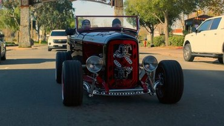
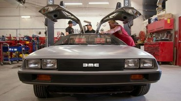
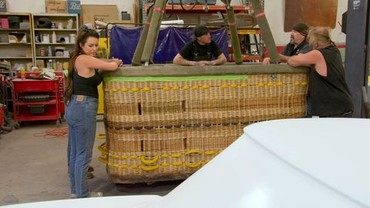
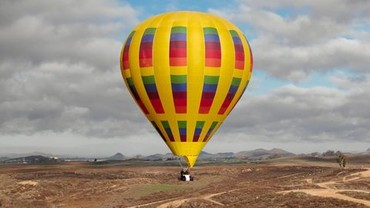
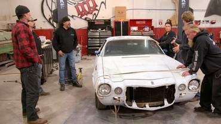
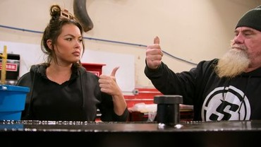
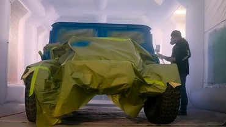
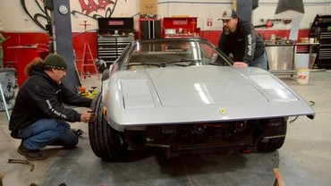

시즌6는 고담 개러지가 “럭셔리 시장”으로 방향타를 돌리며 창의와 클라이언트 요구 사이에서 줄다리기를 벌이는 8부작이다. 두 대의 페라리 패키지, 인플루언서의 맥라렌, 드로리언 리스톰드, 브롱코 6x6 테이스팅룸, 데모크로스 카마로, 바이오디젤 험비, 재규어 XK-E 트레이드, 그리고 최종 ‘매그넘 P.I.’ 헌정 308까지. “업그레이드 앤 트레이드”는 변주되고, 팀은 다시 자신들의 본령으로 귀환할 길을 모색한다.

## 프로그램 정보

- 플랫폼: Netflix (글로벌 동시 공개)
- 시즌/회차: 시즌 6 / 8부작
- 공개: 2024.10.23 (일괄 공개)
- 평균 러닝타임: 31–40분
- 출연: Mark Towle, Shawn Pilot, Constance Nunes, Tony Quinones, Michael “Caveman” Pyle, Nick Smith
- 포맷 키워드: Upgrade & Trade, 의뢰형 커스텀, 쇼카·프로모션 카, 럭셔리/하이엔드 시장 공략

## 시즌 요약(한눈에)

- 시작: 두 대의 페라리 ‘패키지 딜’과 카지노 프로모션용 ’32 포드 로드스터로 럭셔리·프로모션 병행 시동
- 전개: 맥라렌 커스텀 제동, ‘백 투 더 퓨처’식 드로리언 리스톰드, 데모크로스·위스키 브랜드 협업, 대형 트레이드 체인 가동
- 클라이맥스: 바이오디젤 험비→재규어 XK-E→$200K급 빅딜을 노리다 ‘샐비지 카드’와 78년식 308로 충돌
- 마무리: ‘매그넘 P.I.’ 헌정 308 + 007식 기믹으로 ‘노스탤지어 빌드’ 노선 선언

## 빌드/프로젝트 핵심 목록

- Ferrari F8 Tributo(화이트), Ferrari 488 GTB(옐로): 패키지 입고→클라이언트 제약 속 ‘휠·배기·디테일’ 중심 (E1~E2)
- ’32 Ford Roadster: Pechanga 리조트 카지노 프로모션 빌드(슬롯머신 기믹) (E1)
- McLaren(인플루언서): 급제동된 와이드바디 구상→부친의 반대으로 OEM 존중 노선 확인 (E2)
- DeLorean DMC-12: 배기·디퓨저·프론트 에어댐·휠 + 랩핑(논쟁적)으로 “보존 vs 변형” 시험대 (E2~E3)
- ‘Dangerous Dan’ 데모크로스 카마로 & 1970 Camaro SS(454 논쟁): 레이스/머슬의 두 방향성 (E3~E5)
- Ford Bronco 1981 6×6(위스키 브랜드): 테이스팅룸 콘셉트로 B2B형 커스텀 (E4)
- Humvee(바이오디젤 컨버전): Tony의 친환경 솔루션 + 업트레이드 허브 (E6)
- Jaguar XK-E: 트레이드 피봇의 분기점 (E7)
- Ferrari 308(1978): ‘매그넘 P.I.’ + 007식 기믹의 ‘노스탤지어 빌드’ 1호 (E7~E8)

## 에피소드별 상세 줄거리 (완전 스포일러)

### 1화 — Doubling Down

두 대의 페라리를 ‘패키지 가격’에 들여오며 시즌이 시작된다. 하이엔드 시장에서의 존재감은 커지지만, 클라이언트 제약 조건이 창의와 충돌한다. 병행 과제로 카지노 프로모션용 ’32 포드 로드스터를 제작. Tony는 슬롯머신 기믹을 적용해 쇼카의 재미를 끌어올리고, Mark는 “고객 만족 vs 아티스트의 자유” 사이에서 균형점을 모색한다.

### 2화 — The Future is Now

인플루언서 의뢰의 맥라렌 커스텀이 Nick의 영업 논리와 충돌한다. Mark의 카본/테이프 목업이 막 들어갈 즈음, 실제 오너(부친)가 등장해 “집 진입로도 못 올라갈 스플리터”라며 제동. 동시에 ‘백 투 더 퓨처’식 드로리언 리스톰드가 병행되며, “보존/아이코닉 존중 vs 퍼포먼스·스타일 변형”의 난제를 실전에서 시험한다.

### 3화 — Hot Air

팀은 공중·에어본 콘셉트(핫에어·기믹)로 취향 저격형 사이드 프로젝트에 뛰어든다. Caveman이 데모크로스 드라이버 ‘Dangerous Dan’과의 빌드를 들고 오고, 레이스 셋업의 실전성·안전성·내구성에서 Tony와 Caveman의 하드스킬이 빛난다. ‘드로리언 랩’의 찬반 논쟁이 온라인에서도 분화된다.

### 4화 — A Bit of a Stretch

위스키 메이커의 급한 요청에 따라 ’81 브롱코를 6×6 ‘모바일 테이스팅룸’으로 확장 제작. 동시에 Dan의 야드에서 1970 카마로 SS를 발견한 Mark·Shawn은 딜을 모색한다. 브랜드 협업(B2B)의 견고함과 머슬카 ‘감성 가치’가 한 회차에 교차하며, ‘돈 되는 일’과 ‘하고 싶은 일’의 간극이 선명해진다.

### 5화 — Muscle Memory

업그레이드 앤 트레이드가 비틀리며 1970 카마로 SS에 454 빅블록 스왑을 요구하는 조건이 붙는다. Shawn과 Constance가 협상·조달·기술 타당성 사이를 조정하고, Mark는 “가게의 미래”를 진지하게 고민한다. “넘버스 매칭”의 보존 가치 vs ‘빅블록의 로망’이 맞부딪히는 대표 회차.

### 6화 — A Green New Deal

Tony가 Humvee에 바이오디젤 컨버전 시스템을 설계·적용한다. 친환경 동력화를 통해 상업적 매력과 스토리텔링을 동시에 확보. Mark는 아버지와의 기억을 소환하는 대형 세미 트럭(시즌4의 켄워스) 에피소드로 ‘개인적 서사’와 ‘사업적 판단’의 교차로에 선다.

### 7화 — The Salvage Card

재규어 XK-E 트레이드를 성사시키기 위해 가게는 오버타임으로 품질·납기·예산을 동시에 방어한다. 그러나 ‘78 페라리 308 딜이 끼어들며 팀 내부 마찰이 재점화. Nick의 영업 노선과 Shawn의 상인 감각, Mark의 창의가 서로 다른 벡터로 당겨지며 관계 역학이 흔들린다.

### 8화 — Tomorrow’s Throwback

Mark는 가게의 ‘다음 챕터’를 선언한다. 첫 번째 ‘노스탤지어 빌드’는 매그넘 P.I. 헌정 308. 단순 복원에 그치지 않고 007식 기믹(스파이 가젯)과 이탈리안 레이싱 헤리티지 디테일을 섞어, 엔터테인먼트형 쇼카의 정체성을 강화한다. Shawn은 레전드 할리우드 카 2대를 더 잡으려 시도하며, 시즌 7의 방향성을 예고한다.

## 하이라이트/명장면

- 페라리 패키지 딜의 ‘현실 가격’ 논쟁: 쇼의 서사와 시장 시세의 괴리를 드러낸 오프닝 이슈
- 맥라렌 부친의 한마디: “이 차는 원래 완벽했다”—럭셔리 고객군의 리얼 니즈 체감
- ’32 로드스터 슬롯머신 기믹: 프로모션 카의 페르소나를 선명하게 만든 아이디어
- 드로리언 랩·디퓨저: ‘아이코닉 보존 vs 리스톰드’ 논쟁의 압축판
- 브롱코 6×6 테이스팅룸: B2B 협업이 만들어낸 견고한 결과물
- 1970 카마로 SS 454 스왑 협상: 보존가치와 로망의 전면 충돌
- 험비 바이오디젤: 친환경 동력화의 실전 적용과 설득력
- 매그넘 308 + 007 기믹: ‘노스탤지어 빌드’ 노선 천명

## 업그레이드·트레이드 타임라인(핵심 체인)

- Balloon 기믹 → Bronco 6×6(브랜드 협업) → Dangerous Dan(데모크로스) → 1970 Camaro SS(454 논쟁) → Humvee(바이오디젤) → Jaguar XK-E → $200K급 빅딜 도전

## 인물/팀 다이내믹

- Mark Towle: “이익보다 창의”를 밀어붙이며 가게의 색을 잃지 않으려는 ‘아티스트 CEO’
- Shawn Pilot: 재고·현금흐름·딜 리스크를 수치로 보는 ‘상인’의 관점
- Constance Nunes: 파워트레인·페인트·위생·품질에서 실무의 기준선 유지
- Tony Quinones: 워터젯·가공·친환경 컨버전 등 기계가공·시스템 설계의 실전가
- Caveman Pyle: ‘현장성/내구성’이 필요한 레이스·데모 프로젝트의 실행축
- Nick Smith: 하이엔드 고객군의 ‘현실’과 쇼의 ‘창의’를 중재하려는 외부 브로커

## 제작 비하인드/장비 포인트

- Flow Mach 500 워터젯 도입: 정밀 패널·브라켓·가젯 부품 제작에 고정밀 물제트 커팅을 활용. 복잡한 형상과 반복 정합이 필요한 럭셔리/쇼카 제작 효율 향상.
- 럭셔리 카 커스텀의 리스크: 브랜드 가치 훼손·감가·C&D(제조사 경고) 등, ‘창의의 자유’가 곧바로 경제적 리스크로 환산되는 영역임을 시즌 내내 시사.

## 시즌 메시지/인사이트

- **창의 vs 고객 가치**: 쇼의 매력(파격·과감)과 하이엔드 고객군의 니즈(신뢰·재판매가치)는 자주 어긋난다.
- **보존 vs 변형**: 드로리언·카마로·308처럼 ‘아이코닉’일수록 가벼운 변형에도 커뮤니티의 반발이 크다.
- **B2B 협업의 안정성**: 위스키/카지노 등 기업 의뢰형은 예산·납기·성과 지표가 명확해 팀 운영에 안정성을 준다.
- **친환경 동력화의 실용성**: 바이오디젤 험비처럼 ‘서사+실익’을 동시에 만들면 트레이드 체인에서 레버리지로 작동한다.

## 총평

하이엔드 시장의 ‘현실’과 쇼의 ‘창의’가 충돌한 시즌. 전반부는 제약에 시달리지만, 후반부 ‘노스탤지어 빌드’ 선언으로 팀의 다음 장을 선명히 그린다. **별점: 4.0/5** — 과감함을 잃지 않으면서도 고객가치를 배우려는 ‘학습의 시즌’.

## 에피소드·타이틀(참고)

- E1 Doubling Down — 2024-10-23
- E2 The Future is Now — 2024-10-23
- E3 Hot Air — 2024-10-23
- E4 A Bit of a Stretch — 2024-10-23
- E5 Muscle Memory — 2024-10-23
- E6 A Green New Deal — 2024-10-23
- E7 The Salvage Card — 2024-10-23
- E8 Tomorrow’s Throwback — 2024-10-23

## 참고/출처

- [Netflix — Car Masters: Rust to Riches 타이틀 페이지](https://www.netflix.com/title/80194704)
- [IMDb — Car Masters: Rust to Riches Season 6 Episode List](https://www.imdb.com/title/tt8893550/episodes/?season=6)
- [Rotten Tomatoes — Season 6 Hub](https://www.rottentomatoes.com/tv/car_masters_rust_to_riches/s06)
- [Wikipedia — Car Masters: Rust to Riches (시즌별 공개일·에피소드)](https://en.wikipedia.org/wiki/Car_Masters:_Rust_to_Riches)
- [HotCars — Here’s What We Know About Season 6 (Oct 25, 2024)](https://www.hotcars.com/heres-what-we-know-about-car-masters-rust-to-riches-season-6/)
- [What’s on Netflix — Season 6 리뉴얼 기사 (Jun 13, 2024)](https://www.whats-on-netflix.com/news/netflix-renews-car-masters-rust-to-riches-for-season-6-and-tex-mex-motors-for-season-2/)
- [FFJournal — Flow Mach 500 워터젯 파트너십(Oct 22, 2024)](https://www.ffjournal.net/industry-news/5-news/flow-partners-with-netflixs-car-masters-rust-to-riches-for-season-6-bringing-waterjet-precision-to-customer-car-builds)
- [YouTube — Season 6 Official Clip (Netflix)](https://www.youtube.com/watch?v=OFVjW9fjXD8)
- [Instagram — gotham.garage: Season 6 예고(Oct 23rd)](https://www.instagram.com/reel/DAWyrE5S99m/)
- [Instagram — 공식 계정 @carmastersrusttoriches](https://www.instagram.com/carmastersrusttoriches/)
- [Gran Touring Motorsports — Season 6 상세 리뷰/분석(Nov 1, 2024)](https://www.gtmotorsports.org/car-masters-season-6-rust-free-creativity/)

