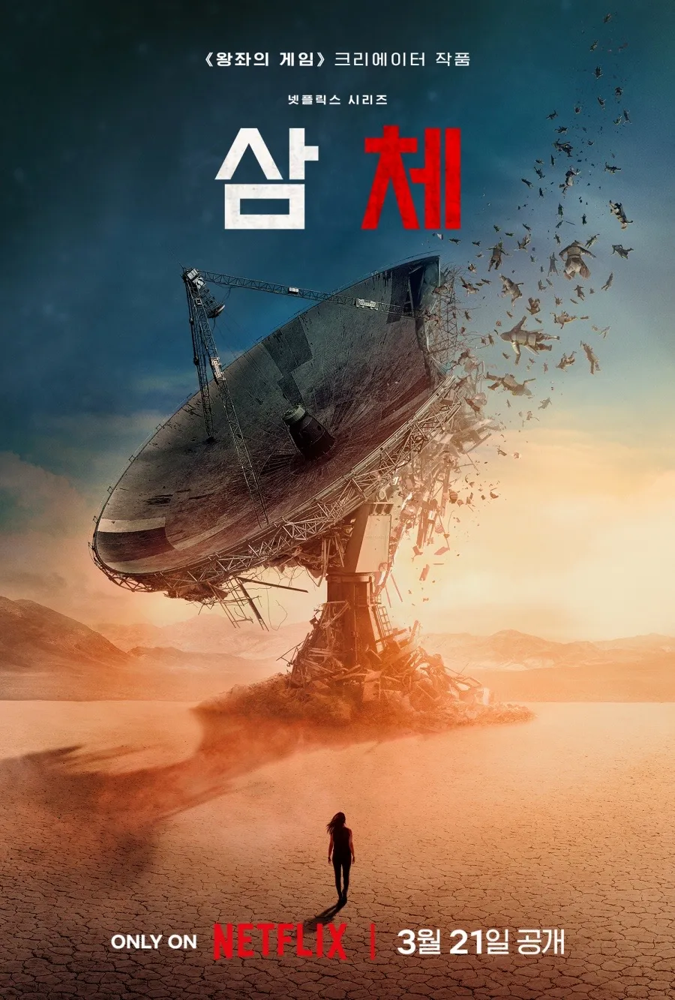
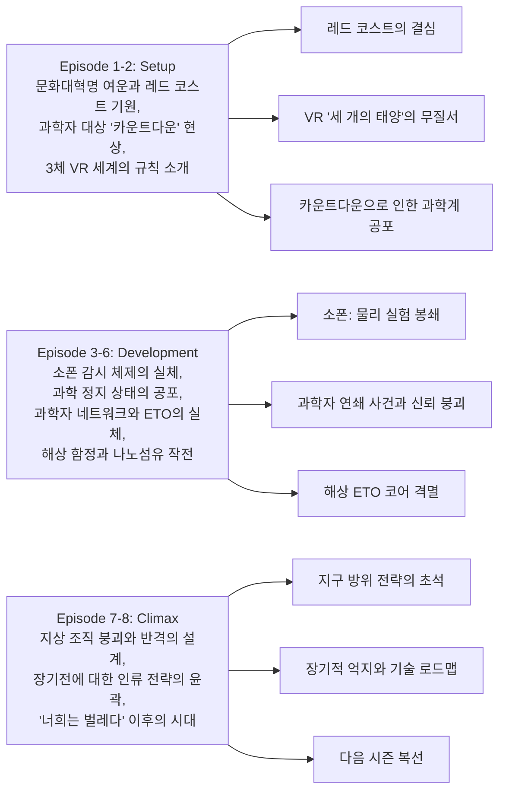

삼체 시즌1은 물리 법칙의 흔들림이라는 거대한 미스터리를 통해 “문명 대 문명”의 충돌을 그리는 하이-컨셉 SF 스릴러다. 데이비드 베니오프, D. B. 와이스, 알렉산더 우가 공동 제작했고, 류츠신의 『지구의 과거』 3부작 첫 권을 토대로 8부작으로 구성되었다. 음악은 라민 자와디가 맡았다. 기본 정보와 일부 줄거리 맥락은 공식 자료를 바탕으로 정리했다.

||
|:---:|
||

## 시즌 개요

### 드라마 정보
* 제목: 3 Body Problem / 삼체
* 시즌: Season 1
* 총 에피소드: 8화
* 방영 기간: 2024.03.21 (전편 공개)
* 에피소드 평균 길이: 약 60분
* 제작/크리에이터: David Benioff, D. B. Weiss, Alexander Woo
* 음악: Ramin Djawadi
* 주연: Jess Hong, Jovan Adepo, John Bradley, Eiza González, Alex Sharp, Benedict Wong, Zine Tseng, Rosalind Chao, Jonathan Pryce, Liam Cunningham
* 장르: Science Fiction, Mystery Thriller, Fantasy Drama
* 원작: Liu Cixin, Remembrance of Earth's Past

### 추천 대상
* **하드 SF와 미스터리 스릴러의 결합을 선호하는 시청자**: 과학적 상상력과 추적 서사가 균형을 이룬다
* **세계관 구축과 철학적 테마에 관심 있는 시청자**: 존재론·윤리적 딜레마와 장기전의 공포를 다룬다
* **원작 팬과 중국 SF에 관심 있는 시청자**: 문화적 배경과 현대 과학의 접점을 다층적으로 그린다

## 시즌 메인 아크 구조

## 에피소드별 줄거리

아래 줄거리는 각 화의 공식 개요를 바탕으로 구성했다. 세부 정보 출처: [Wikipedia — 3 Body Problem (TV series)](https://en.wikipedia.org/wiki/3_Body_Problem_(TV_series)).

### Episode 1 — "Countdown" (카운트다운)
1960년대 중국, 문화대혁명 속에서 예 원제는 공개 투쟁 과정에서 아버지의 죽음을 목격한다. 금서로 지정된 『침묵의 봄』이 발각된 뒤, 그녀는 거대 전파망원경을 보유한 비밀 군사 기지로 이송된다. 현재(영국 옥스퍼드)에서는 예의 딸 베라 예가 투신하고, 베라의 제자였던 ‘옥스퍼드 파이브’(아기 살라자르, 잭 루니, 진 청, 솔 듀랑, 윌 다우닝)가 과학 실험의 난맥상을 논한다. 아기는 시야에만 보이는 ‘카운트다운’을 목격하고, 정체불명의 여성(타티아나)에게 나노섬유 연구를 중단하라는 협박을 받는다. 자정이 되자 하늘 전체가 카운트다운 패턴과 동기화되어 물리 법칙을 공공연히 위반한다.

### Episode 2 — "Red Coast" (레드 코스트)
아기는 나노섬유 기술 시연에 성공하지만 즉시 연구를 중단하고, 카운트다운은 사라진다. 진은 예가 남긴 VR 헤드셋으로 ‘3체’ 게임을 진입하고, 잭도 초대를 받아 참여한다. 1970년대 중국에서 예 원제는 태양을 송신 증폭원으로 활용하는 방안을 고안해 몰래 우주로 신호를 보낸다. 그녀는 급진 환경주의자 마이크 에반스와 조우하고, 곧 ‘평화주의’ 외계인으로부터 “다시는 연락하지 말라, 동족이 침략할 것”이라는 경고를 수신한다. 예는 인간 사회에 환멸을 느끼고 “인류는 스스로 구원할 수 없다”며 응답, 외계 문명을 지구로 불러들인다.

### Episode 3 — "Destroyer of Worlds" (세계의 파괴자)
아기는 잭의 헤드셋을 시도하다 강제로 퇴출되고, 나노섬유 설비를 재가동하자 카운트다운이 재등장해 다시 셧다운한다. 진과 잭은 게임의 2·3 레벨을 협력 클리어하고, 이 헤드셋이 사실 마이크 에반스의 ‘선발·포섭 도구’임이 드러난다. 레벨 4는 현실 공간에서 진행되며, 감시 카메라에 전혀 잡히지 않는 타티아나가 접촉한다. 외계 문명의 모성은 ‘세 개의 태양’이 만들어내는 예측불가능한 천체역학으로 문명이 주기적 멸망과 재건을 반복했고, 결국 지구로 향했다는 진상이 제시된다. 잭은 이를 거부하고 게임을 떠나지만, 곧 자택에서 타티아나에게 살해된다. 현장에는 18대의 내부 카메라와 요원이 있었지만 누구도 그녀를 포착하지 못한다.

### Episode 4 — "Our Lord" (아워 로드)
1984년 북대서양, 에반스는 예 원제를 거대 선박 ‘저지먼트 데이’로 데려가 위성 시스템으로 ‘산티’(Trisolarans)와 교신한다. 2024년 잭의 피살 이후 웨이드와 클라랜스는 진에게 침투 임무를 맡기고, 영지의 비밀 모임에서 예가 ‘지구-트리솔라리스(ETO)’의 지도자임이 드러난다. 급습 과정에서 타티아나는 진 암살을 시도하나 실패하고 도주, 예를 포함한 다수가 체포된다. 한편 에반스는 산티 연락관에게 ‘빨간 모자’ 이야기를 들려주지만, 산티는 ‘허구’와 ‘거짓’의 개념을 이해하지 못한 채 인간의 기만성을 위협으로 규정하고 공존 불가를 결론내린다.

### Episode 5 — "Judgment Day" (심판의 날)
예는 심문에서 “산티가 더는 자신을 필요로 하지 않아 일부러 체포되게 했다”고 진술한다. 에반스의 선박 ‘저지먼트 데이’가 파나마 운하를 통과할 예정이 되자, 웨이드는 왕립해군팀(지휘: 라지·진의 연인)과 아기를 동원해 선박의 ‘데이터 디스크’를 탈취한다. 작전 핵심은 아기의 나노섬유를 수평으로 전개해 선체를 ‘슬라이싱’하는 것으로, 승선자는 전원 사망한다. 복호화 끝에 진과 웨이드는 VR 인터페이스로 디스크 파일을 열고 ‘소폰’의 정체를 확인한다. 소폰은 단일 양성자를 고차원으로 전개해 만든 지적 슈퍼컴퓨터로, 입자물리 실험을 교란하고 전지구적 감시·즉시 통신을 수행한다. 곧 전 지구의 전자 스크린에 “YOU ARE BUGS(너희는 벌레다)”가 표출되고, 산티의 존재와 힘이 대중 앞에 각인된다.

### Episode 6 — "The Stars Our Destination" (별들이 우리의 목적지)
‘하늘의 눈(Eye in the Sky)’ 쇼크로 전 세계가 혼란에 빠지자, PDC(행성방위위원회)는 산티 함대를 선제적으로 요격할 방안을 논의한다. 최소 광속의 1%로 가속된 탐사체가 200년 뒤 산티 함대에 도달한다는 가정 아래, 진은 수천 기의 핵폭발을 펄스 추진으로 사용하는 ‘계단(Staircase) 프로젝트’와 방사선 돛 구상을 제안한다. 파나마 작전 공로로 라지는 PDC에 합류하고, 아기는 자신의 기술이 대량 살상에 사용된 충격으로 협력을 중단한다. 클라랜스는 베라의 자살 배경을 캐묻고, 예는 오래된 서신을 통해 딸이 자신의 산티 공조 사실을 알게 되었음을 인정한다. 말기 암으로 환각을 겪는 윌은 진에게 별 DX3906을 선물하기 위해 재단을 찾아 명의 구입을 진행한다.

### Episode 7 — "Only Advance" (오직 전진)
DX3906 소유 증서는 발신자 미상으로 진에게 전달된다. 웨이드는 동면에서 깨어난 침팬지를 시연하며 “산티 도착 시점(약 400년 후)에 직접 맞서야 한다”고 선언, 스스로도 냉동수면에 들 계획임을 밝힌다. 핵탄두 수가 부족해 탐사체 탑재량은 ‘인간의 뇌’ 한 개 분으로 축소되고, 아기는 논란 속에 나노섬유 연구를 전면 공개한 뒤 출국한다. 임종을 앞둔 윌에게 웨이드는 ‘계단 프로젝트의 두뇌 후보’를 제안하고, 윌은 솔과 함께 안락사를 선택한다. 진은 DX3906이 윌의 선물이었음을 뒤늦게 알고 병원으로 달려오지만 이미 뇌 적출이 끝난 뒤다. 예는 레드 코스트 안테나로 돌아가 자살을 결심하나, 타티아나가 산티의 지시에 따라 ‘고통 없는 죽음’을 제안하며 마지막 노을을 함께 지켜본다.

### Episode 8 — "Wallfacer" (월페이서)
하룻밤 인연을 맺은 상대가 돌진 차량에 치여 사망하자, 솔은 자신이 표적이었다는 사실을 통보받고 보호 관찰 하에 UN으로 이송된다. 산티가 인간의 ‘마음 읽기’를 할 수 없음을 역이용하는 ‘월페이서 프로젝트’가 발표되고, 솔은 세 명의 월페이서 중 한 명으로 지명된다. 그는 사양하고 UN 건물을 빠져나오다 저격당하지만 방탄 의류 덕분에 생존, 산티가 굳이 자신을 제거하려는 이유를 다시 생각한다. 한편 웨이드와 진은 윌의 뇌를 장착한 탐사선을 발사하지만 방사선 돛이 오작동해 궤도가 틀어지고, 산티 연락관은 실패를 조롱한다. 클라랜스는 낙담한 진과 솔을 매미 떼가 우글거리는 들판으로 데려가 ‘근절하려 해도 살아남는 존재’의 은유를 보여주며, 인류의 끈질김을 상기시킨다.

## 핵심 대사 모음
* “You are bugs.” — 압도적 우위에서의 냉혹한 선언, 정체성 붕괴의 촉발점
* “과학이 멈추면, 문명은 믿음을 잃는다.” — 소폰 체제의 본질을 요약하는 인식

## 상징적 장면 분석
* **세 개의 태양**: 예측 불가능성(카오스)과 문명의 취약성 상징
* **망막 카운트다운**: 실재/지각 경계를 침범하는 공포, '보는 자'가 '보여지는 자'가 되는 역전
* **해상 나노섬유 장면**: 지식이 곧 무기라는 사실, 기술 윤리의 무게

## 종합 평가

**최종 평점: ★★★★☆ (4.5/5)**

**한 줄 평**  
과학이 멈춘 세계에서 시작되는 문명의 ‘긴 밤’. 스릴러의 박자와 사색의 밀도가 공존한다.

---

참고: [Wikipedia — 3 Body Problem (TV series)](https://en.wikipedia.org/wiki/3_Body_Problem_(TV_series))

