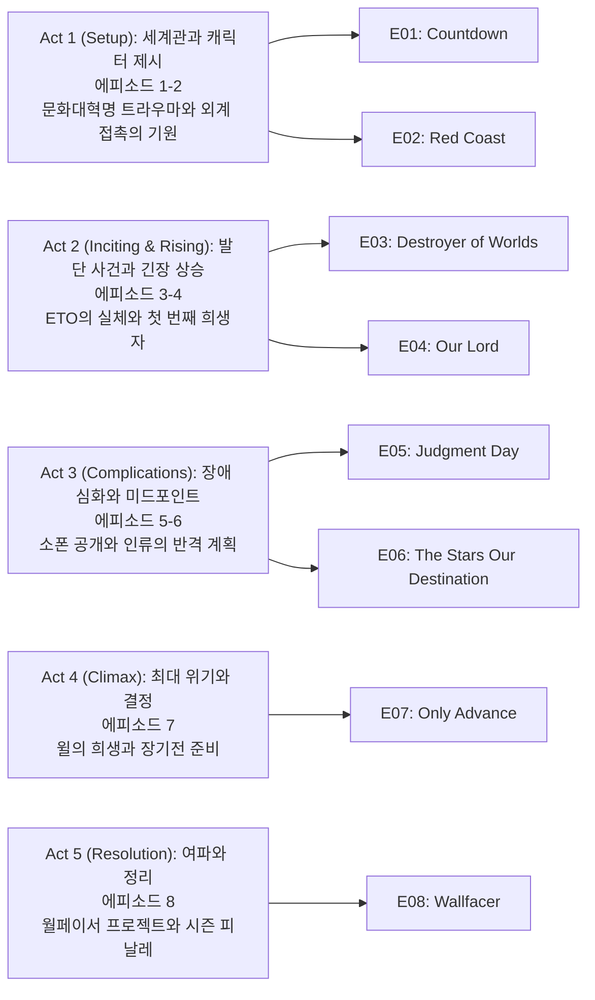

삼체 시즌1은 물리 법칙의 흔들림이라는 거대한 미스터리를 통해 "문명 대 문명"의 충돌을 그리는 하이-컨셉 SF 스릴러다. 데이비드 베니오프, D. B. 와이스, 알렉산더 우가 공동 제작했고, 류츠신의 『지구의 과거』 3부작 첫 권을 토대로 8부작으로 구성되었다. 음악은 라민 자와디가 맡았다. 기본 정보와 일부 줄거리 맥락은 공식 자료를 바탕으로 정리했다.

## 시즌 개요

### 시리즈 정보
* **제목**: 3 Body Problem / 삼체
* **시즌**: 시즌 1 (총 8 에피소드)
* **쇼러너**: David Benioff, D. B. Weiss, Alexander Woo
* **감독**: Derek Tsang (E01-E02), Andrew Stanton (E03), Minkie Spiro (E04-E06), Jeremy Podeswa (E07-E08)
* **주연**: Jess Hong, Jovan Adepo, John Bradley, Eiza González, Alex Sharp, Benedict Wong, Zine Tseng, Rosalind Chao, Jonathan Pryce, Liam Cunningham
* **음악**: Ramin Djawadi
* **장르**: Science Fiction, Mystery Thriller, Fantasy Drama
* **에피소드 러닝타임**: 평균 60분
* **방영 기간**: 2024.03.21 (전편 공개)
* **방영 채널/플랫폼**: Netflix
* **제작사**: Netflix, Plan B Entertainment, Primitive Streak
* **원작**: Liu Cixin, Remembrance of Earth's Past (지구의 과거 3부작)
* **평점**: Rotten Tomatoes 78%, Metacritic 70/100, IMDb 7.6/10
* **제작비**: 시즌 1 총 $160M (에피소드당 약 $20M)
* **촬영**: 영국 런던, 2021년 10월 ~ 2022년 중반 (9개월)

### 시즌 주제

이 시즌은 문화대혁명의 트라우마에서 시작된 한 과학자의 선택이 인류 전체의 운명을 바꾸는 거대한 서사를 그린다. 예 원제의 외계 문명 초대 결정은 400년 후 도래할 산티(San-Ti) 침략의 씨앗이 되고, 현재의 과학자들은 물리 법칙이 왜곡되는 현실과 맞서야 한다. 소폰(Sophon)이라는 양성자 기반 감시 체제는 인류의 과학 발전을 봉쇄하고, 인류는 장기전을 준비해야 하는 상황에 처한다. 과학과 철학, 선택과 책임, 문명의 존속이라는 무게 있는 주제를 8화에 압축하여 제시한다.

### 추천 대상
* **하드 SF와 미스터리 스릴러의 결합을 선호하는 시청자**: 과학적 상상력과 추적 서사가 균형을 이룬다
* **세계관 구축과 철학적 테마에 관심 있는 시청자**: 존재론·윤리적 딜레마와 장기전의 공포를 다룬다
* **원작 팬과 중국 SF에 관심 있는 시청자**: 문화적 배경과 현대 과학의 접점을 다층적으로 그린다

## 구조 분석 (Act-first 보조 도식)

## 시즌의 전체 내용 (스포일러 포함)

이 시즌은 문화대혁명의 트라우마에서 시작된 예 원제의 선택이 400년 후 도래할 외계 침략의 씨앗이 되는 과정을 그린다. 현재 시점의 과학자들은 물리 법칙이 왜곡되는 현실과 맞서며, 소폰이라는 감시 체제와 ETO라는 지구 내부의 배신자 조직을 발견한다. 시즌 피날레에서는 인류가 장기전을 준비하며 월페이서 프로젝트를 시작하는 것으로 마무리된다.

### Act 1 (Setup): 세계관과 캐릭터 제시 — [E01-E02]

#### [E01] "Countdown" (카운트다운) — 상세 장면 분석

**[E01-S01] 문화대혁명의 트라우마**: 1960년대 중국, 예 원제는 공개 투쟁 과정에서 아버지 예 철태가 붉은 위병들에게 구타당해 사망하는 장면을 목격한다. 이 장면은 시리즈 전체의 정서적 기반을 마련하며, 예 원제가 인류에 대한 환멸을 느끼게 되는 결정적 계기가 된다.

**[E01-S02] 레드 코스트 기지로의 이송**: 금서로 지정된 『침묵의 봄』이 발각된 뒤, 예 원제는 거대 전파망원경을 보유한 비밀 군사 기지 '레드 코스트'로 이송된다. 이 기지는 냉전 시대 우주 통신 경쟁의 일환으로, 다른 국가들과 경쟁하며 외계 문명과의 첫 접촉을 시도하는 곳이다.

**[E01-S03] 옥스퍼드 파이브와 과학의 붕괴**: 현재 시점(2024년 영국 옥스퍼드)에서 예 원제의 딸 베라 예가 투신하고, 그녀의 제자였던 '옥스퍼드 파이브'(아기 살라자르, 잭 루니, 진 청, 솔 듀랑, 윌 다우닝)가 과학 실험들이 더 이상 의미를 갖지 못하는 현상에 대해 논의한다. 입자 가속기 실험 결과가 무작위로 변하는 등 물리 법칙 자체가 왜곡되고 있음을 발견한다.

**[E01-S04] 카운트다운의 등장**: 나노섬유 연구를 진행 중인 아기는 시야에만 보이는 '카운트다운' 타이머를 목격한다. 정체불명의 여성(타티아나)이 나타나 연구를 중단하라고 협박하며, 자정에 하늘을 보라고 한다. 자정이 되자 하늘 전체가 카운트다운 패턴과 동기화되어 깜빡이며, 이는 물리 법칙을 공공연히 위반하는 현상이다.

#### [E02] "Red Coast" (레드 코스트) — 상세 장면 분석

**[E02-S01] 나노섬유 기술 시연과 중단**: 아기는 나노섬유 기술 시연에 성공하지만 즉시 연구를 중단한다. 카운트다운이 사라지면서 이 현상이 나노섬유 연구와 직접적으로 연관되어 있음을 확인한다. 기술의 윤리적 딜레마가 처음으로 제시되는 순간이다.

**[E02-S02] 3체 VR 게임의 시작**: 진은 예 원제가 남긴 VR 헤드셋으로 '3체' 게임에 진입한다. 게임은 중국 고대 왕조를 배경으로 하며, 세 개의 태양이 예측 불가능하게 움직이는 세계를 보여준다. 잭도 초대를 받아 게임에 참여하며, 이 헤드셋이 사실 선발 도구임을 암시한다.

**[E02-S03] 태양 증폭 송신**: 1970년대 중국 레드 코스트 기지에서 예 원제는 태양을 송신 증폭원으로 활용하는 방안을 고안한다. 동료가 이 아이디어를 자신의 것으로 주장하지만, 예는 몰래 계획을 실행하여 우주로 신호를 보낸다. 이는 인류 역사상 가장 중요한 결정 중 하나가 되는 순간이다.

**[E02-S04] 외계인의 경고와 예 원제의 응답**: 예는 급진 환경주의자 마이크 에반스와 조우하고, 곧 '평화주의' 외계인으로부터 "다시는 연락하지 말라, 동족이 침략할 것"이라는 경고를 수신한다. 그러나 예는 인간 사회에 대한 깊은 환멸을 느끼고 "인류는 스스로 구원할 수 없다"며 응답한다. 이 선택이 400년 후 도래할 침략의 시작이 된다.

### Act 2 (Inciting & Rising): 발단 사건과 긴장 상승 — [E03-E04]

#### [E03] "Destroyer of Worlds" (세계의 파괴자) — 상세 장면 분석

**[E03-S01] VR 게임의 거부와 나노섬유 재가동**: 아기는 잭의 헤드셋을 시도하다 강제로 퇴출된다. 나노섬유 설비를 재가동하자 카운트다운이 재등장해 다시 셧다운한다. 이는 소폰이 특정 과학 연구를 감시하고 제어할 수 있음을 보여준다.

**[E03-S02] 게임 레벨 2-3 클리어**: 진과 잭은 게임의 2·3 레벨을 협력하여 클리어한다. 게임을 통해 외계 문명의 모성이 '세 개의 태양'이 만들어내는 예측불가능한 천체역학으로 인해 문명이 주기적 멸망과 재건을 반복했음을 알게 된다. 이 헤드셋이 사실 마이크 에반스의 '선발·포섭 도구'임이 드러난다.

**[E03-S03] 레벨 4와 타티아나의 등장**: 레벨 4는 현실 공간에서 진행되며, 감시 카메라에 전혀 잡히지 않는 타티아나가 접촉한다. 그녀는 ETO의 일원으로, 소폰의 기술을 활용하여 감시를 회피할 수 있다. 외계 문명이 결국 지구로 향하고 있다는 진상이 제시된다.

**[E03-S04] 잭의 거부와 살해**: 잭은 외계 침략의 서사를 거부하고 게임을 떠난다. 그러나 곧 자택에서 타티아나에게 살해된다. 현장에는 18대의 내부 카메라와 요원이 있었지만 누구도 그녀를 포착하지 못한다. 이는 ETO의 위험성과 소폰 기술의 공포를 보여주는 첫 번째 희생자다.

#### Episode 4 — "Our Lord" (아워 로드)

1984년 북대서양, 에반스는 예 원제를 거대 선박 '저지먼트 데이'로 데려가 위성 시스템으로 '산티'(Trisolarans)와 교신한다. 2024년 잭의 피살 이후 웨이드와 클라랜스는 진에게 침투 임무를 맡기고, 영지의 비밀 모임에서 예가 '지구-트리솔라리스(ETO)'의 지도자임이 드러난다. 급습 과정에서 타티아나는 진 암살을 시도하나 실패하고 도주, 예를 포함한 다수가 체포된다. 한편 에반스는 산티 연락관에게 '빨간 모자' 이야기를 들려주지만, 산티는 '허구'와 '거짓'의 개념을 이해하지 못한 채 인간의 기만성을 위협으로 규정하고 공존 불가를 결론내린다.

### Act 3 (Complications): 장애 심화와 미드포인트 — [E05-E06]

#### [E05] "Judgment Day" (심판의 날) — 상세 장면 분석

**[E05-S01] 예 원제의 심문**: 예는 심문에서 "산티가 더는 자신을 필요로 하지 않아 일부러 체포되게 했다"고 진술한다. 이는 그녀가 더 이상 ETO의 지도자가 아니며, 산티가 새로운 단계로 진입했음을 의미한다.

**[E05-S02] 파나마 운하 작전**: 에반스의 선박 '저지먼트 데이'가 파나마 운하를 통과할 예정이 되자, 웨이드는 왕립해군팀(지휘: 라지·진의 연인)과 아기를 동원해 선박의 '데이터 디스크'를 탈취한다. 작전 핵심은 아기의 나노섬유를 수평으로 전개해 선체를 '슬라이싱'하는 것으로, 승선자는 전원 사망한다. 이 장면은 기술이 무기로 전환되는 순간을 보여주며, 아기에게 깊은 트라우마를 남긴다.

**[E05-S03] 소폰의 정체 공개**: 복호화 끝에 진과 웨이드는 VR 인터페이스로 디스크 파일을 열고 '소폰'의 정체를 확인한다. 소폰은 단일 양성자를 고차원으로 전개해 만든 지적 슈퍼컴퓨터로, 입자물리 실험을 교란하고 전지구적 감시·즉시 통신을 수행한다. 이는 시즌의 미드포인트로, 적의 정체와 능력이 완전히 드러나는 순간이다.

**[E05-S04] "YOU ARE BUGS" 메시지**: 곧 전 지구의 전자 스크린에 "YOU ARE BUGS(너희는 벌레다)"가 표출되고, 산티의 존재와 힘이 대중 앞에 각인된다. 이는 인류가 처한 상황의 심각성을 전 세계에 알리는 계기가 된다.

#### Episode 6 — "The Stars Our Destination" (별들이 우리의 목적지)

'하늘의 눈(Eye in the Sky)' 쇼크로 전 세계가 혼란에 빠지자, PDC(행성방위위원회)는 산티 함대를 선제적으로 요격할 방안을 논의한다. 최소 광속의 1%로 가속된 탐사체가 200년 뒤 산티 함대에 도달한다는 가정 아래, 진은 수천 기의 핵폭발을 펄스 추진으로 사용하는 '계단(Staircase) 프로젝트'와 방사선 돛 구상을 제안한다. 파나마 작전 공로로 라지는 PDC에 합류하고, 아기는 자신의 기술이 대량 살상에 사용된 충격으로 협력을 중단한다. 클라랜스는 베라의 자살 배경을 캐묻고, 예는 오래된 서신을 통해 딸이 자신의 산티 공조 사실을 알게 되었음을 인정한다. 말기 암으로 환각을 겪는 윌은 진에게 별 DX3906을 선물하기 위해 재단을 찾아 명의 구입을 진행한다.

### Act 4 (Climax): 최대 위기와 결정 — [E07]

#### [E07] "Only Advance" (오직 전진) — 상세 장면 분석

**[E07-S01] DX3906의 선물**: DX3906 소유 증서는 발신자 미상으로 진에게 전달된다. 웨이드는 동면에서 깨어난 침팬지를 시연하며 "산티 도착 시점(약 400년 후)에 직접 맞서야 한다"고 선언, 스스로도 냉동수면에 들 계획임을 밝힌다. 이는 인류가 장기전을 준비하고 있음을 보여준다.

**[E07-S02] 계단 프로젝트의 축소**: 핵탄두 수가 부족해 탐사체 탑재량은 '인간의 뇌' 한 개 분으로 축소된다. 아기는 논란 속에 나노섬유 연구를 전면 공개한 뒤 출국한다. 기술의 공개는 윤리적 딜레마를 제시하며, 아기의 성장을 보여준다.

**[E07-S03] 윌의 희생**: 임종을 앞둔 윌에게 웨이드는 '계단 프로젝트의 두뇌 후보'를 제안하고, 윌은 솔과 함께 안락사를 선택한다. 진은 DX3906이 윌의 선물이었음을 뒤늦게 알고 병원으로 달려오지만 이미 뇌 적출이 끝난 뒤다. 이는 시즌의 감정적 클라이맥스로, 사랑과 희생의 주제를 다룬다.

**[E07-S04] 예 원제의 마지막**: 예는 레드 코스트 안테나로 돌아가 자살을 결심하나, 타티아나가 산티의 지시에 따라 '고통 없는 죽음'을 제안하며 마지막 노을을 함께 지켜본다. 이는 그녀의 이야기의 종결이자, 선택의 대가를 보여주는 순간이다.

### Act 5 (Resolution): 여파와 정리 — [E08]

#### [E08] "Wallfacer" (월페이서) — 상세 장면 분석

**[E08-S01] 솔에 대한 암살 시도**: 하룻밤 인연을 맺은 상대가 돌진 차량에 치여 사망하자, 솔은 자신이 표적이었다는 사실을 통보받고 보호 관찰 하에 UN으로 이송된다. 이는 솔이 특별한 이유로 산티의 표적이 되었음을 암시한다.

**[E08-S02] 월페이서 프로젝트 발표**: 산티가 인간의 '마음 읽기'를 할 수 없음을 역이용하는 '월페이서 프로젝트'가 발표되고, 솔은 세 명의 월페이서 중 한 명으로 지명된다. 그는 사양하고 UN 건물을 빠져나오다 저격당하지만 방탄 의류 덕분에 생존한다. 산티가 굳이 자신을 제거하려는 이유를 다시 생각한다.

**[E08-S03] 계단 프로젝트의 실패**: 웨이드와 진은 윌의 뇌를 장착한 탐사선을 발사하지만 방사선 돛이 오작동해 궤도가 틀어지고, 산티 연락관은 실패를 조롱한다. 이는 인류의 첫 번째 반격 시도가 실패했음을 보여주며, 앞으로의 어려움을 암시한다.

**[E08-S04] 매미의 은유**: 클라랜스는 낙담한 진과 솔을 매미 떼가 우글거리는 들판으로 데려가 '근절하려 해도 살아남는 존재'의 은유를 보여주며, 인류의 끈질김을 상기시킨다. 이는 시즌 피날레의 희망적 메시지로, 다음 시즌으로의 전환점이 된다.

## 에피소드 가이드

| 회차 | 제목 | 방영일 | 한 줄 요약 |
|------|------|--------|-----------|
| E01 | "Countdown" | 2024.03.21 | 문화대혁명의 트라우마와 카운트다운 현상으로 시작되는 미스터리 |
| E02 | "Red Coast" | 2024.03.21 | 예 원제의 외계 신호 송신과 3체 VR 게임의 시작 |
| E03 | "Destroyer of Worlds" | 2024.03.21 | 잭의 살해와 ETO의 실체가 드러나는 전환점 |
| E04 | "Our Lord" | 2024.03.21 | ETO 지도자 예 원제의 체포와 산티의 공존 불가 선언 |
| E05 | "Judgment Day" | 2024.03.21 | 소폰의 정체 공개와 "YOU ARE BUGS" 메시지 (미드포인트) |
| E06 | "The Stars Our Destination" | 2024.03.21 | 계단 프로젝트 제안과 인류의 반격 계획 수립 |
| E07 | "Only Advance" | 2024.03.21 | 윌의 희생과 예 원제의 마지막 (클라이맥스) |
| E08 | "Wallfacer" | 2024.03.21 | 월페이서 프로젝트 발표와 시즌 피날레 |

## 핵심 대사 인덱스

"You are bugs." — 산티 연락관, [E05-S04]; 압도적 우위에서의 냉혹한 선언, 정체성 붕괴의 촉발점

"인류는 스스로 구원할 수 없다." — 예 원제, [E02-S04]; 외계 문명 초대 결정의 핵심 동기

"과학이 멈추면, 문명은 믿음을 잃는다." — 진 청, [E05-S03]; 소폰 체제의 본질을 요약하는 인식

"Don't play with God." — 예 원제, [E07-S04]; 솔에게 전달하는 우주 사회학의 경고

## 캐릭터 분석

### Ye Wenjie (예 원제) / Rosalind Chao, Zine Tseng

**개요**: 천체물리학자로, 문화대혁명에서 아버지의 죽음을 목격한 트라우마를 안고 있다. 레드 코스트 기지에서 외계 문명과의 첫 접촉을 담당하며, 인류에 대한 환멸로 인해 산티를 지구로 초대하는 결정을 내린다. ETO의 창립자이자 초대 지도자다.

**성장 곡선**: 시즌 초반에는 트라우마에 시달리는 젊은 과학자로, 중반에는 ETO의 지도자로, 후반에는 산티에게 버려진 과거의 인물로 그려진다. 시즌 피날레에서는 자신의 선택의 대가를 깨닫고 자살을 결심하지만, 타티아나와 함께 마지막 노을을 지켜보며 종결된다.

**동기와 욕망**: 인류 문명의 근본적 변화를 원한다. 문화대혁명의 폭력과 환경 파괴를 목격한 그녀는 인류가 스스로를 구원할 수 없다고 믿고, 외계 문명의 개입을 통해 문명을 재건하고자 한다.

**갈등 구조**: 내적 갈등은 트라우마와 책임감 사이에서, 외적 갈등은 인류와 산티 사이에서, 그리고 딸 베라와의 관계에서 발생한다. 베라의 자살은 그녀의 선택이 가져온 직접적인 결과다.

**상징적 의미**: 선택의 무게와 책임을 상징한다. 한 개인의 결정이 인류 전체의 운명을 바꾸는 순간을 보여주며, 트라우마가 어떻게 극단적인 선택으로 이어질 수 있는지를 탐구한다.

### Jin Cheng (진 청) / Jess Hong

**개요**: 이론물리학자로, 옥스퍼드 파이브의 일원이다. 베라 예의 제자였으며, 예 원제가 남긴 VR 헤드셋을 통해 3체 게임에 진입한다. 웨이드의 요청으로 ETO에 침투하여 정보를 수집한다.

**성장 곡선**: 시즌 초반에는 과학 실험의 이상 현상에 당황하는 연구자로 시작하지만, 점차 위기의 중심에 서게 된다. ETO 침투 작전을 통해 용기를 보여주고, 계단 프로젝트를 제안하는 등 인류의 희망으로 성장한다. 시즌 후반에는 윌의 죽음과 계단 프로젝트의 실패를 겪으며 성숙해진다.

**동기와 욕망**: 과학적 진실을 추구하고, 인류의 생존을 위해 싸운다. 베라 예의 죽음에 대한 의문을 품고 있으며, 진실을 밝히고자 한다.

**갈등 구조**: 과학자로서의 신념과 군사 작전에 참여해야 하는 현실 사이의 갈등, 윌에 대한 감정과 그를 잃어야 하는 상황, 그리고 인류의 미래에 대한 책임감이 주요 갈등이다.

**상징적 의미**: 인류의 희망과 회복력을 상징한다. 과학적 탐구 정신과 인류애를 대표하며, 어려운 상황에서도 포기하지 않는 인류의 의지를 보여준다.

### Saul Durand (솔 듀랑) / Jovan Adepo

**개요**: 연구 조교로, 옥스퍼드 파이브의 일원이다. 물리학에 대한 열정은 있지만 자신의 능력에 대해 불확신을 가지고 있다. 시즌 피날레에서 월페이서로 지명된다.

**성장 곡선**: 시즌 대부분 동안 조연으로 등장하지만, 시즌 후반에 중요한 역할을 맡게 된다. 산티가 그를 제거하려는 이유를 알 수 없는 상태에서, 월페이서 프로젝트의 일원이 된다. 윌의 마지막 순간을 함께하며 진정한 친구임을 보여준다.

**동기와 욕망**: 물리학에 대한 순수한 열정을 가지고 있으며, 진실을 알고 싶어 한다. 자신이 왜 특별한지, 왜 산티가 자신을 표적으로 삼는지 궁금해한다.

**갈등 구조**: 자신의 능력에 대한 불확신과 중요한 역할을 맡게 되는 상황 사이의 갈등, 그리고 친구들의 죽음과 위험에 처한 상황에서의 선택이 주요 갈등이다.

**상징적 의미**: 숨겨진 잠재력과 예상치 못한 영웅을 상징한다. 평범해 보이지만 특별한 이유로 선택받는 인물로, 다음 시즌의 핵심 인물로 성장할 가능성을 보여준다.

### Thomas Wade (토마스 웨이드) / Liam Cunningham

**개요**: MI6 수장이자 전략 정보 기관의 책임자다. 냉철하고 전략적인 사고를 가진 인물로, 인류의 생존을 위해 모든 수단을 동원한다. 산티 도착 시점에 직접 맞서기 위해 냉동수면을 계획한다.

**성장 곡선**: 시즌 내내 강력하고 결단력 있는 리더로 그려진다. 계단 프로젝트를 주도하고, 인류의 장기전 전략을 수립한다. 실용주의적 접근을 취하지만, 인류의 존엄성을 지키려는 의지도 보여준다.

**동기와 욕망**: 인류의 생존과 승리를 최우선으로 한다. 단기적 승리보다는 장기적 전략을 중시하며, 400년 후의 전쟁을 준비한다.

**갈등 구조**: 실용주의와 윤리적 딜레마 사이의 갈등, 그리고 인류를 구하기 위한 선택과 그 선택의 대가 사이의 갈등이 주요 갈등이다.

**상징적 의미**: 인류의 의지와 전략적 사고를 상징한다. 절망적인 상황에서도 포기하지 않고 장기적인 전략을 수립하는 인류의 능력을 보여준다.

## 종합 평가

### 최종 평점: ★★★★☆ (4.5/5.0)

**장점**:
- **거대한 스케일의 서사**: 문화대혁명부터 400년 후의 미래까지, 시간과 공간을 넘나드는 거대한 서사 구조가 인상적이다.
- **과학적 정확성과 상상력의 균형**: 하드 SF의 과학적 엄밀성과 상상력이 잘 결합되어 있다. 소폰, 계단 프로젝트 등 과학적 개념이 설득력 있게 제시된다.
- **다층적 캐릭터**: 예 원제의 복잡한 동기와 트라우마가 잘 그려져 있으며, 옥스퍼드 파이브의 각 캐릭터도 개성 있게 묘사된다.
- **시각적 완성도**: 높은 제작비가 반영된 시각 효과와 촬영 기법이 뛰어나다. 특히 VR 게임 속 세 개의 태양 장면이 인상적이다.
- **철학적 깊이**: 선택과 책임, 문명의 존속, 과학과 윤리 등 무게 있는 주제를 다루며 사색의 여지를 제공한다.

**단점**:
- **페이싱 문제**: 초반 몇 에피소드에서 정보 전달이 밀도 높아 일부 시청자에게는 부담스러울 수 있다.
- **캐릭터 개발의 불균형**: 일부 캐릭터(예: 솔, 아기)의 배경과 동기가 상대적으로 덜 탐구된다.
- **원작과의 차이**: 원작 팬들에게는 캐릭터의 변경(옥스퍼드 파이브)과 설정 변경이 아쉬울 수 있다.

### 한 줄 평

과학이 멈춘 세계에서 시작되는 문명의 '긴 밤'. 스릴러의 박자와 사색의 밀도가 공존한다.

### 추천 작품

- 《The Expanse》(2015-2022): 하드 SF와 정치적 스릴러를 결합한 작품으로, 외계 문명과의 접촉과 인류의 대응을 다룬다.
- 《Dark》(2017-2020): 시간 여행과 운명론을 다루는 독일 SF 드라마로, 복잡한 서사 구조와 철학적 깊이를 제공한다.
- 《Arrival》(2016): 외계 문명과의 첫 접촉을 다루는 영화로, 언어와 소통의 문제를 깊이 있게 탐구한다.

### 시청 전 체크리스트

- 사전 지식이 필요한가? **아니오** (원작 소설을 읽지 않아도 이해 가능하지만, 읽으면 더 깊이 있는 감상이 가능하다)
- 어린이와 함께 볼 수 있는가? **아니오** (폭력 장면과 성인적 주제가 포함되어 있어 15세 이상 관람가)
- 몰아보기 vs 천천히? **천천히** (복잡한 과학 개념과 다층적 서사를 이해하기 위해 천천히 보는 것을 권장)
- 특정 요소를 기대해도 되는가? **하드 SF, 철학적 주제, 복잡한 서사 구조, 높은 제작 품질**
- 다음 시즌 예정은? **시즌 2와 3이 확정되었으며, 시즌 2는 2026년 방영 예정**

## 결론

3 Body Problem 시즌 1은 하드 SF의 과학적 엄밀성과 철학적 깊이를 결합한 야심찬 작품이다. 문화대혁명의 트라우마에서 시작된 한 과학자의 선택이 인류 전체의 운명을 바꾸는 거대한 서사를 8화에 압축하여 제시한다. 소폰이라는 감시 체제와 ETO라는 배신자 조직을 통해 인류가 처한 절망적인 상황을 생생하게 그려내며, 동시에 인류의 회복력과 의지를 보여준다.

시즌 피날레에서 시작되는 월페이서 프로젝트는 다음 시즌에 대한 기대를 높이며, 솔 듀랑이라는 캐릭터가 어떻게 인류의 희망이 될 수 있을지 궁금증을 자아낸다. 원작 소설의 복잡한 개념들을 시각적으로 잘 구현했으며, 특히 VR 게임 속 세 개의 태양과 소폰의 정체 공개 장면은 시리즈의 하이라이트다.

일부 페이싱 문제와 캐릭터 개발의 불균형이 있지만, 전반적으로 높은 완성도와 야심찬 서사 구조로 인해 SF 장르 팬들에게 강력히 추천할 만한 작품이다.

---

## 참고 문헌 및 출처

- [Wikipedia — 3 Body Problem (TV series)](https://en.wikipedia.org/wiki/3_Body_Problem_(TV_series))
- [Netflix — 3 Body Problem Official Site](https://www.netflix.com/title/81026318)
- [Rotten Tomatoes — 3 Body Problem Reviews](https://www.rottentomatoes.com/tv/3_body_problem)
- [Metacritic — 3 Body Problem Reviews](https://www.metacritic.com/tv/3-body-problem)
- [Liu Cixin — The Three-Body Problem (Original Novel)](https://en.wikipedia.org/wiki/The_Three-Body_Problem_(novel))
