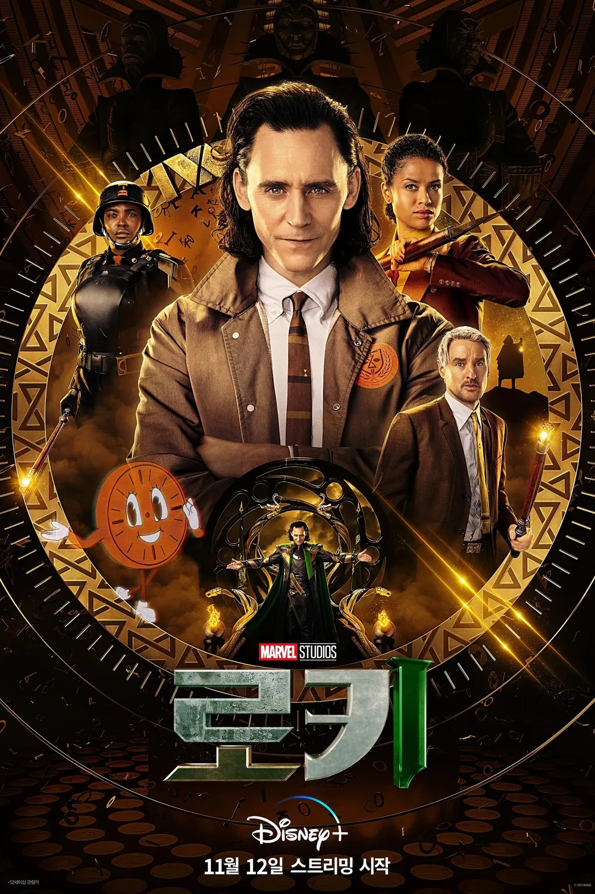
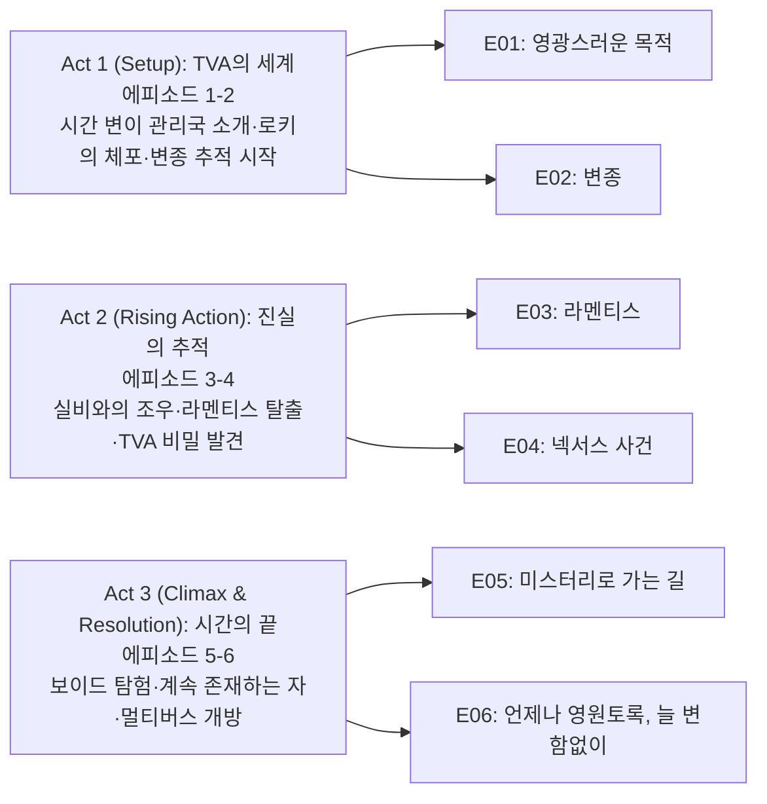

마블 시네마틱 유니버스(MCU)가 디즈니+를 통해 선보인 `로키` 시즌 1은 단순한 슈퍼히어로 드라마를 넘어, 시간과 자유의지, 정체성에 대한 철학적 질문을 던지는 야심찬 작품이다. 2012년 뉴욕 전투에서 테서랙트를 손에 넣고 도망친 로키가 시간 변이 관리국(TVA)에 체포되면서 시작되는 이 이야기는, 그 어느 마블 작품보다도 복잡하면서도 매혹적인 시간 여행 서사를 펼쳐낸다.

톰 히들스턴의 카리스마 넘치는 연기와 레트로 퓨처리즘 스타일의 독특한 비주얼, 그리고 멀티버스라는 거대한 개념을 MCU에 본격적으로 도입한 이 작품은, 로키라는 캐릭터의 새로운 차원을 보여주며 동시에 향후 MCU의 방향성을 제시하는 중요한 작품이 되었다.

## 시즌 개요

### 시리즈 정보

* **제목**: Loki / 로키
* **시즌**: 시즌 1 (총 6 에피소드)
* **쇼러너**: 마이클 월드론 (Michael Waldron)
* **감독**: 케이트 헤론 (Kate Herron, 전 에피소드)
* **주연**: 톰 히들스턴 (로키), 소피아 디 마르티노 (실비), 오웬 윌슨 (모비우스), 구구 음바타-로 (라보나 렌슬레이어), 조나단 메이저스 (계속 존재하는 자)
* **음악**: 나탈리 홀트 (Natalie Holt)
* **장르**: SF, 판타지, 액션, 드라마, 슈퍼히어로
* **에피소드 러닝타임**: 평균 45-54분
* **방영 기간**: 2021.06.09 - 2021.07.14
* **방영 채널/플랫폼**: Disney+
* **제작사**: Marvel Studios
* **평점**: 로튼 토마토 92% (신선도), IMDb 8.2/10

### 시즌 주제

`로키` 시즌 1의 핵심은 "자유의지 vs 운명"이라는 철학적 주제다. 신성한 시간선을 관리한다는 명목 하에 무수한 변종들을 제거하는 TVA는, 개인의 자유의지를 억압하는 관료주의적 시스템의 은유다. 로키는 이 시스템 안에서 자신의 정체성과 존재의 의미를 탐구하며, "로키를 로키답게 만드는 것은 무엇인가?"라는 질문에 직면한다.

시즌 전반에 걸쳐 로키는 자신이 "영광스러운 목적(Glorious Purpose)"이라 믿었던 것이 실은 정해진 각본에 불과했다는 사실을 깨닫는다. 그리고 또 다른 자신인 실비와의 만남을 통해, 정해진 운명에서 벗어나 자신만의 길을 선택할 수 있다는 가능성을 발견한다. 이는 단순히 로키 개인의 성장을 넘어, 시스템에 대한 저항과 자아 발견이라는 보편적 주제로 확장된다.

레트로 퓨처리즘적 미학과 관료주의적 분위기가 공존하는 TVA의 독특한 세계관은, 이러한 주제를 시각적으로 강화한다. 70년대 사무실을 연상케 하는 아날로그적 분위기 속에서 시간을 관리한다는 역설적 설정은, 작품의 독특한 톤을 만들어낸다.

### 추천 대상

* **마블 팬**: MCU의 멀티버스 사가를 이해하는 데 필수적인 작품으로, `스파이더맨: 노 웨이 홈`, `닥터 스트레인지: 대혼돈의 멀티버스` 등 이후 작품들의 배경을 제공한다.
* **SF 및 시간 여행 애호가**: 복잡하면서도 논리적인 시간 여행 설정과 멀티버스 개념을 좋아하는 시청자에게 적합하다. 단순한 액션이 아닌, 시간의 본질과 인과율에 대한 탐구가 돋보인다.
* **캐릭터 중심 드라마 선호자**: 로키라는 복잡한 캐릭터의 내면과 성장 과정을 심도 있게 다루며, 톰 히들스턴의 섬세한 연기를 감상할 수 있다. 액션보다는 캐릭터 간의 대화와 관계에 초점을 맞춘 드라마를 선호하는 시청자에게 추천한다.

## 에피소드 목록

| 회차 | 제목 | 방영일 | 한 줄 요약 |
|------|------|--------|-----------|
| E01 | "Glorious Purpose (영광스러운 목적)" | 2021.06.09 | 테서랙트로 도망친 로키가 TVA에 체포되어 자신의 운명을 마주하다 |
| E02 | "The Variant (변종)" | 2021.06.16 | 로키가 모비우스와 협력해 변종 로키를 추적하며 실비를 만나다 |
| E03 | "Lamentis (라멘티스)" | 2021.06.23 | 로키와 실비가 멸망 직전의 라멘티스에 갇혀 서로를 알아가다 |
| E04 | "The Nexus Event (넥서스 사건)" | 2021.06.30 | TVA의 진실이 드러나고 타임키퍼가 허상임이 밝혀지다 |
| E05 | "Journey Into Mystery (미스터리로 가는 길)" | 2021.07.07 | 보이드에서 다양한 로키 변종들을 만나고 알리오스를 무력화하다 |
| E06 | "For All Time. Always (언제나 영원토록, 늘 변함없이)" | 2021.07.14 | 계속 존재하는 자를 만나고 실비의 선택으로 멀티버스가 개방되다 |

## 시즌 구조 분석

## 시즌 내용 (스포일러 포함)

`로키` 시즌 1은 6개의 에피소드로 구성되어 있으며, 각 에피소드는 로키의 자아 발견 여정과 TVA의 비밀을 점진적으로 밝혀내는 과정을 따라간다. 2012년 뉴욕에서 시작된 로키의 예상치 못한 탈출은, 시간의 끝에서 멀티버스의 탄생으로 이어지는 장대한 서사의 출발점이 된다.

이 시즌은 단순히 선과 악의 대결이 아닌, 자유의지와 통제, 개인과 시스템, 운명과 선택이라는 복잡한 주제들을 탐구한다. 로키는 자신이 악당이 될 운명이라고 믿었지만, TVA에서의 경험을 통해 그것이 누군가에 의해 쓰여진 각본이었음을 깨닫는다. 그리고 실비와의 만남을 통해, 자신의 이야기를 스스로 쓸 수 있다는 가능성을 발견한다.

### Act 1 (Setup): TVA의 세계 — [E01-E02]

시즌의 시작은 로키가 TVA라는 전혀 새로운 세계에 적응하는 과정을 그린다. 자신을 신이라고 믿었던 로키는, TVA에서 자신의 마법이 무력화되고 인피니티 스톤조차 쓸모없는 문진으로 전락한 현실을 마주한다. 이는 로키의 자존심에 큰 타격을 주며, 동시에 그의 세계관을 근본적으로 뒤흔든다.

#### [E01] "영광스러운 목적 (Glorious Purpose)"

**[E01-S01] 고비 사막에서의 체포**: 2012년 뉴욕 전투 직후, 테서랙트를 손에 넣은 로키는 고비 사막 한가운데로 순간이동한다. 영어가 통하지 않는 몽골 주민들 앞에서 당황하던 로키는, 갑자기 나타난 TVA 요원들에게 제압당한다. 신의 힘을 가진 로키조차 손쉽게 제압하는 TVA의 등장은, 이들의 막강한 힘을 암시하는 동시에 로키의 힘이 상대적임을 보여준다. 슬로우 모션으로 처리된 로키의 제압 장면은, 그의 오만함이 무너지는 순간을 극적으로 연출한다.

**[E01-S02] TVA 재판과 모비우스의 개입**: 판사 라보나 렌슬레이어 앞에서 재판을 받는 로키는, 자신이 시간선을 어지럽힌 것이 아니라 어벤져스라고 항변한다. 하지만 렌슬레이어는 어벤져스의 행동은 예정되어 있었지만 로키의 탈출은 아니었다며 유죄를 선고한다. 이는 "누구의 행동은 허용되고 누구의 행동은 금지되는가?"라는 자의적 기준에 대한 의문을 제기한다. 바로 그 순간, 모비우스가 등장해 로키를 데려간다. TVA의 관료주의적 분위기와 레트로한 미장센이 인상적으로 드러나는 장면이다.

**[E01-S03] 로키의 인생 영상**: 모비우스는 로키에게 그의 과거와 미래가 담긴 영상을 보여준다. 로키는 자신이 어머니 프리가의 죽음을 초래했고, 결국 토르와 화해한 뒤 타노스에게 죽임을 당한다는 사실을 알게 된다. "너는 패배할 운명이야"라는 말을 듣고 충격받던 로키는, 메인 타임라인의 자신이 "나는 로키, 오딘의 아들이며 영광스러운 목적을 지녔다"고 말하며 죽는 장면을 본다. 이 순간 로키는 자신의 "영광스러운 목적"이 실은 죽음으로 끝난다는 잔인한 진실을 마주한다.

**[E01-S04] 인피니티 스톤의 무의미함**: 탈출을 시도하던 로키는 TVA 직원의 서랍에서 인피니티 스톤들이 문진처럼 굴러다니는 것을 발견한다. 우주를 지배할 수 있는 힘의 원천이 TVA에서는 아무런 가치가 없는 물건이라는 사실은, TVA의 절대적 권력과 로키가 믿었던 가치의 상대성을 극적으로 보여준다. 로키의 표정에서 충격과 혼란이 교차하며, 그의 세계관이 근본적으로 흔들리는 순간이다.

**[E01-S05] 모비우스와의 협력**: 자신의 미래를 보고 돌아온 로키는 모비우스에게 "나는 약함과 공포를 이용하는 속임수를 쓸 수밖에 없었다"고 고백한다. 모비우스는 로키에게 또 다른 로키 변종이 TVA 요원들을 죽이고 있다며, 이를 잡는 데 협력해달라고 제안한다. 로키의 관점이 필요하다는 모비우스의 말은, 로키를 단순한 악당이 아닌 복잡한 캐릭터로 인정하는 첫 신호다.

#### [E02] "변종 (The Variant)"

**[E02-S01] 1985년 오클라호마 습격**: 1985년 중세 축제장에서 넥서스 이벤트가 발생하고, TVA 요원들이 출동한다. 하지만 보니 타일러의 "Holding Out for a Hero"가 흐르는 가운데, 두건을 쓴 변종 로키가 요원들을 전멸시킨다. 80년대 팝송과 중세 축제, 그리고 TVA의 미래적 장비가 뒤섞인 이 장면은 시리즈의 독특한 미학을 잘 보여준다. 또한 변종 로키의 강력함과 계획성을 암시한다.

**[E02-S02] 폼페이 실험**: 로키는 모비우스에게 "종말이 예정된 장소에서는 어떤 변수를 만들어도 모두 파괴되니 넥서스 이벤트가 발생하지 않는다"는 가설을 제시한다. 이를 증명하기 위해 두 사람은 서기 79년 베수비오 화산 폭발 직전의 폼페이로 간다. 로키는 라틴어로 종말을 예언하고 양을 풀어주며 온갖 기행을 벌이지만, 예상대로 넥서스가 발생하지 않는다. 모비우스의 식사를 망친 것에 대한 사과로 "종말"을 선사했다는 로키의 유머와, 두 사람의 케미스트리가 돋보이는 장면이다.

**[E02-S03] 2050년 로크스카트 마트**: 로키의 추리에 따라 TVA는 2050년 허리케인으로 멸망할 앨라배마로 향한다. 그곳에서 로키는 변종 로키와 대면하게 되는데, 변종은 여러 사람의 몸을 오가며 로키와 대화한다. 로키가 TVA를 장악하자고 제안하지만, 변종은 "나는 TVA를 장악하는 데 관심 없어"라고 거절한다. 그리고 수많은 리셋 차지를 여러 시간선에 동시에 뿌려 다중 넥서스를 만들어낸다.

**[E02-S04] 실비의 정체 공개**: 혼돈 속에서 변종 로키가 두건을 벗자, 그는 여성의 모습이었다. 포털을 열고 떠나려는 그녀의 뒤를, 로키는 모비우스를 배신하고 따라간다. 이 순간 로키의 선택은, 안정적인 TVA와의 협력보다 자신과 같은 존재에 대한 호기심을 택한 것이다. 시즌의 첫 번째 중요한 전환점이자, 로키와 실비의 관계가 시작되는 순간이다.

### Act 2 (Rising Action): 진실의 추적 — [E03-E04]

두 번째 막에서는 로키와 실비의 관계가 발전하며, TVA의 본질적인 비밀이 서서히 드러나기 시작한다. 라멘티스에서의 고난은 두 로키가 서로를 이해하고 신뢰하는 계기가 되며, 그들의 관계가 만들어낸 넥서스 이벤트는 TVA 시스템의 한계를 보여준다.

#### [E03] "라멘티스 (Lamentis)"

**[E03-S01] TVA 침입과 도주**: 실비는 리셋 차지들로 만든 혼돈을 틈타 TVA 본부에 침입한다. 헌터들을 제압하며 깽판을 놓던 그녀를, 로키가 뒤쫓아온다. 둘은 격투를 벌이다가 렌슬레이어의 추격을 받게 되고, 로키가 실비의 템패드를 훔쳐 무작위로 선택한 장소로 탈출한다. 하지만 그곳은 2077년, 12시간 후 행성과 충돌할 위성 라멘티스-1이었다. 게다가 템패드의 동력이 바닥난 상태. 최악의 장소에 갇힌 두 로키의 당혹스러운 표정이 코믹하면서도 긴박하다.

**[E03-S02] 실비의 과거**: 라멘티스를 헤매며 로키와 실비는 서로에 대해 알아간다. 실비는 자신도 아스가르드 출신이지만, "장난의 여신"으로 태어난 것이 신성한 시간선과 달라 어린 시절 TVA에 체포되었다고 밝힌다. 하지만 재판 직전 탈출에 성공했고, 이후 멸망한 세계들을 떠돌며 살아왔다. "이제 난 로키가 아니야. 실비야"라는 그녀의 말은, TVA에 의해 정체성마저 부정당한 그녀의 고통을 드러낸다.

**[E03-S03] 기차 안의 대화**: 탈출선으로 가는 기차에 탄 로키와 실비는 아스가르드와 어머니, 마법에 대해 이야기를 나눈다. 로키가 "문을 등지고는 못 앉는다"고 하자 실비도 같다고 말하는데, 정작 문은 양방향에 있어서 어디에 앉아도 문을 등지게 된다. 같은 본질을 가진 두 존재의 유사성을 코믹하게 보여주는 장면이다. 하지만 로키가 술에 취해 아스가르드 노래를 부르며 난동을 피우는 바람에, 둘은 기차에서 쫓겨나고 템패드마저 박살난다.

**[E03-S04] 탈출선의 파괴**: 온갖 고난 끝에 탈출선 발사지점에 도착한 둘이지만, 이미 탈출선은 유성에 맞아 폭발한 상태였다. 종말을 앞두고 체념한 채 앉아있는 두 사람. 실비가 "로키를 로키답게 만드는 것이 패배할 운명인 걸까?"라고 묻자, 로키는 "우리가 패배할지도 모르지만 죽진 않아. 넌 어린아이였지만 시간을 다스리는 조직을 무너뜨릴 뻔했잖아. 넌 멋졌어"라고 위로한다. 이때 실비가 로키의 손을 잡고, 로키가 손을 마주잡는 순간, 거대한 넥서스 이벤트가 발생한다. 두 로키의 연결이 만들어낸 이 이례적인 사건은, 로맨스가 시스템을 넘어설 수 있음을 암시한다.

#### [E04] "넥서스 사건 (The Nexus Event)" — 미드포인트

**[E04-S01] 시프의 기억 감옥**: TVA에 재체포된 로키는 과거의 나쁜 기억을 무한 반복하는 감옥에 갇힌다. 시프가 나타나 머리카락을 자른 것에 대해 욕하며 로키의 급소를 가격하는 장면이 끝없이 반복된다. 처음엔 허세를 부리던 로키는 결국 무너져, "난 관심을 갈구해. 왜냐면 난 나르시시스트이고, 혼자 있는 게 두렵기 때문이야"라고 고백한다. 시프는 "넌 혼자가 맞아. 그리고 항상 혼자일 거야"라고 잔인하게 말한다. 로키의 가장 깊은 두려움을 드러내는 강렬한 장면이다.

**[E04-S02] 헌터 C-20의 심문 영상**: 모비우스는 렌슬레이어의 템패드를 훔쳐 헌터 C-20의 심문 영상을 본다. 실비에게 정신 조작당했던 C-20는 자신이 지구에서 살았던 기억을 떠올리며, TVA 직원들이 모두 변종이라는 사실을 알게 되었다. 하지만 렌슬레이어는 이 사실을 묵살하고 C-20를 제거한다. 이 장면은 TVA의 진실과 렌슬레이어의 공모를 확인시켜주는 중요한 전환점이다. (미드포인트)

**[E04-S03] 모비우스의 희생**: 진실을 알게 된 모비우스는 로키를 풀어주고 함께 탈출하려 하지만, 렌슬레이어가 이미 상황을 파악하고 헌터들을 대동해 온다. 모비우스는 "제거해!"라는 렌슬레이어의 명령에 따라 소멸당한다. 눈앞에서 친구를 잃은 로키의 슬픔과 분노는, 그가 더 이상 혼자가 아니었음을 역설적으로 보여준다. 모비우스가 죽기 직전 "내 이전 삶으로 돌아가고 싶어. 그땐 제트스키를 가졌을지도 모르지"라고 한 말은, 그의 순수함과 TVA에 의해 빼앗긴 삶을 상징한다.

**[E04-S04] 타임키퍼의 정체**: 타임키퍼들 앞으로 끌려간 로키와 실비는 헌터 B-15의 도움으로 탈출해 타임키퍼들과 대면한다. 실비가 한 타임키퍼의 목을 베자, 그것은 안드로이드였다. 타임키퍼들은 허상이었던 것이다. 실망하는 실비에게 로키가 다가가 "우리가 함께 답을 찾을 거야"라고 위로하려는 순간, 렌슬레이어에게 소멸당한다. 분노한 실비는 렌슬레이어를 제압하고 모든 진실을 털어놓으라고 위협하며 에피소드가 끝난다.

### Act 3 (Climax & Resolution): 시간의 끝 — [E05-E06]

시즌의 마지막 막은 보이드라는 독특한 공간에서 시작해, 시간의 끝에 존재하는 성에서 절정을 맞는다. 로키는 다양한 자신의 변종들을 만나며 "로키다움"의 본질을 탐구하고, 결국 계속 존재하는 자라는 진정한 흑막과 대면한다.

#### [E05] "미스터리로 가는 길 (Journey Into Mystery)"

**[E05-S01] 다양한 로키들과의 조우**: 소멸당한 로키가 눈을 뜬 곳은 보이드, TVA가 삭제한 모든 것들이 오는 쓰레기장이었다. 그곳에서 로키는 흑인 로키, 소년 로키(키드 로키), 클래식 로키, 그리고 악어 로키를 만난다. "넌 왜 잘렸어?"라는 질문에 키드 로키는 "토르를 죽여서"라고 답하고, 클래식 로키는 "토르와 타노스를 속이고 도망쳐서"라고 답한다. 각자 다른 이유로 TVA에 의해 제거된 로키들은, 신성한 시간선에서 벗어난 모든 가능성을 상징한다.

**[E05-S02] 로키들의 배신**: 대통령 로키가 무법자 로키들을 이끌고 지하 벙커를 습격한다. 흑인 로키는 키드 로키를 인질로 잡고 대통령 로키와 거래했음을 밝히지만, 대통령 로키 역시 배신하고 부하들마저 그를 배신한다. 악어 로키가 대통령 로키의 손을 뜯어먹는 가운데, 로키들은 서로를 공격하며 난장판을 벌인다. "로키를 믿지 마"라는 아이러니한 상황 속에서, 로키는 배신이 본질인 존재들의 비극을 목격한다.

**[E05-S03] 클래식 로키의 희생**: 실비가 알리오스에게 주술을 걸려 할 때, 클래식 로키는 거대한 아스가르드 환영을 만들어 알리오스의 주의를 끈다. MCU 역사상 가장 강력한 로키의 마법이 펼쳐지는 장면은 시각적으로 압도적이다. 힘이 다한 클래식 로키는 양손을 들고 "영광스러운 목적이로다!(Glorious Purpose!)"라고 외치며 호탕하게 웃으면서 알리오스에게 삼켜진다. 자신의 이기심을 버리고 다른 로키들을 위해 희생하는 그의 모습은, 로키가 도달할 수 있는 최고의 경지를 보여준다.

**[E05-S04] 알리오스 무력화**: 클래식 로키의 희생 덕분에 로키와 실비는 함께 주술을 걸어 알리오스를 무력화시킨다. 처음엔 주술을 할 줄 모른다던 로키가, 실비의 격려로 성공하는 장면은 둘의 연결과 로키의 성장을 상징한다. 구름이 걷히며 시간의 끝에 있는 고성이 드러나고, 두 사람은 손을 잡고 그곳으로 향한다.

#### [E06] "언제나 영원토록, 늘 변함없이 (For All Time. Always)" - 클라이맥스

**[E06-S01] MCU 역사의 인트로**: 에피소드는 "It's Been A Long, Long Time"이 흐르는 가운데 MCU의 명장면들과 대사들이 교차 편집되는 독특한 인트로로 시작한다. 아이언맨부터 캡틴 아메리카, 닥터 스트레인지까지, 모든 영웅들의 대사가 흐르고, 마지막에 클래식 로키와 실비의 대사로 신성한 시간선을 벗어난다. 지금까지의 MCU가 모두 하나의 시간선 안에서 일어난 일이었음을 상기시키는 강렬한 오프닝이다.

**[E06-S02] 계속 존재하는 자의 제안**: 성에 도착한 로키와 실비는 계속 존재하는 자(조나단 메이저스)를 만난다. 평범한 인간의 모습을 한 그는, 자신이 31세기 과학자였으며 멀티버스 전쟁을 끝내기 위해 신성한 시간선을 만들었다고 설명한다. 그리고 자신은 이제 지쳤으니, 로키와 실비가 TVA를 관리하라고 제안한다. 거절하면 자신의 변종들이 다시 멀티버스 전쟁을 일으킬 것이라고 경고한다. 절대 권력을 가진 존재가 그 권력을 내려놓으려 한다는 역설적 상황이다. (클라이맥스)

**[E06-S03] 로키와 실비의 갈등**: 실비는 계속 존재하는 자를 죽여 복수하고 싶어하지만, 로키는 그의 말이 사실일 수도 있다며 신중해야 한다고 주장한다. "넌 TVA의 왕좌를 원하는 거야"라는 실비의 비난에, 로키는 "난 네가 괜찮길 원해"라고 답한다. 둘의 목표가 어긋나며 격투가 벌어지고, 로키는 "나도 이건 해본 적이 없어서"라며 고백하려 하지만, 실비는 그에게 키스한 후 템패드로 TVA로 밀어내고 계속 존재하는 자를 찔러 죽인다. 사랑과 복수 사이에서 실비는 복수를 선택한 것이다.

**[E06-S04] 멀티버스의 개방과 변화된 TVA**: 계속 존재하는 자가 죽자, 신성한 시간선은 수많은 가지로 분기되기 시작한다. 멀티버스가 개방된 것이다. 한편 TVA로 튕겨나온 로키는 모비우스를 찾지만, 모비우스는 로키를 알아보지 못한다. 주변을 둘러본 로키는 타임키퍼 동상 자리에 계속 존재하는 자의 얼굴을 한 동상이 서 있는 것을 발견하고 경악한다. TVA는 이미 계속 존재하는 자의 변종에 의해 장악된 상태였다. 로키는 실비를 잃고, 친구를 잃고, 아는 세계마저 잃은 채 홀로 남겨진다.

## 캐릭터 분석

### 로키 / Loki (톰 히들스턴)

**개요**: 아스가르드의 장난의 신이자 토르의 동생. 2012년 뉴욕 전투에서 테서랙트를 훔쳐 도망친 변종으로, TVA에 체포되어 시간 범죄 수사에 협력하게 된다. 자신을 악당이라 규정했지만, TVA에서의 경험을 통해 진정한 자아를 탐구한다.

**성장 곡선**: 시즌 1의 로키는 MCU 역사상 가장 큰 변화를 겪는다. 시작에서 그는 "영광스러운 목적"을 위해 지구를 정복하려던 악당이었다. 하지만 모비우스가 보여준 자신의 미래 영상을 통해, 자신이 결국 토르와 화해하고 희생한다는 사실을 알게 된다. 이는 로키에게 정체성의 위기를 가져온다. "난 악당이 될 운명이야"라고 믿었던 그에게, 선택의 가능성이 열린 것이다.

실비와의 만남은 결정적 전환점이다. 자신과 같으면서도 다른 존재, 어린 시절부터 TVA에 쫓기며 살아온 실비는, 로키에게 "로키임에도 다를 수 있다"는 가능성을 보여준다. 라멘티스에서 죽음을 앞두고 손을 잡던 순간, 로키는 처음으로 타인과 진정으로 연결되는 경험을 한다. 시프의 기억 감옥에서 "난 혼자 있는 게 두렵다"고 고백하던 로키는, 시즌 말미에 실비를 위해 자신의 야망을 포기하는 선택을 한다.

**동기와 욕망**: 초반 로키의 동기는 명확했다. TVA를 이용해 타임키퍼들을 만나 권력을 얻는 것. 하지만 점차 그의 욕망은 변한다. 실비와 함께 진실을 찾고, TVA의 거짓을 폭로하고, 실비가 "괜찮길" 바라는 것으로. "나도 이건 해본 적이 없어서"라며 사랑을 고백하려던 순간은, 권력보다 관계를 택한 로키의 변화를 상징한다.

**갈등 구조**: 로키의 외적 갈등은 TVA와 계속 존재하는 자라는 시스템과의 싸움이다. 하지만 더 중요한 것은 내적 갈등이다. "난 악당일 수밖에 없어"라는 자기 규정과 "난 변할 수 있어"라는 가능성 사이의 갈등. "영광스러운 목적"이라는 허상과 진정한 연결이라는 실재 사이의 갈등. 마지막 에피소드에서 로키는 권력보다 실비를 택하지만, 실비는 복수를 택하며 둘은 갈라선다. 이는 로키가 성장했음에도 불구하고 혼자 남겨지는 비극적 아이러니를 만든다.

**상징적 의미**: 로키는 자유의지와 정체성의 상징이다. "로키는 항상 배신한다", "로키는 항상 진다"라는 고정된 서사에 갇혀있던 그가, 그 서사를 거부하고 자신만의 이야기를 쓰려 한다. 하지만 그 과정에서 그는 모든 것을 잃는다. 이는 시스템에 저항하는 자의 고독과, 변화의 대가를 상징한다. 동시에 로키는 "불완전한 영웅"의 원형이다. 완벽하지 않지만, 노력하고, 실패하고, 다시 일어서는 존재.

### 실비 라우페이도티르 / Sylvie Laufeydottir (소피아 디 마르티노)

**개요**: 로키의 여성 변종으로, "장난의 여신"으로 태어났다는 이유로 어린 시절 TVA에 체포될 뻔했으나 탈출에 성공했다. 이후 평생을 TVA에 쫓기며 살아왔고, 복수를 위해 TVA를 파괴하려 한다. 자신을 "로키"라 부르는 것을 거부하며 "실비"라는 이름을 택했다.

**성장 곡선**: 실비의 여정은 복수에서 시작해 복수로 끝난다. 하지만 그 과정에서 그녀도 변화한다. 처음 실비는 철저히 혼자였다. 누구도 믿지 않고, 오직 TVA를 파괴하겠다는 목표만 있었다. 하지만 로키와의 만남은 그녀를 흔든다. 라멘티스에서 로키가 "넌 멋졌어"라고 말할 때, 실비는 처음으로 인정받는 경험을 한다. 손을 잡고 죽음을 기다리던 순간, 그녀는 혼자가 아니었다.

하지만 마지막 순간, 실비는 로키보다 복수를 택한다. 이는 후퇴처럼 보이지만, 사실 그녀의 일관성이다. 실비에게 TVA는 어린 시절, 정체성, 인생 전부를 빼앗은 존재다. 로키가 "신중하게 생각하자"고 할 때, 실비는 "넌 며칠 동안만 경험했지만 난 평생을 겪었어"라고 답한다. 그녀의 선택은 트라우마에서 비롯된 것이며, 동시에 자기 결정권의 행사다. 누군가(로키조차)의 설득이 아닌, 자신의 의지로 선택한 것이다.

**동기와 욕망**: 실비의 유일한 목표는 TVA를 파괴하고 배후를 죽이는 것이다. 이는 복수이자 동시에 해방이다. TVA가 존재하는 한, 그녀는 영원히 쫓기는 존재이기 때문이다. 로키와의 관계는 그녀에게 새로운 욕망을 제시한다. 함께할 누군가, 이해받는 경험. 하지만 최종적으로 실비는 복수를 택한다.

**갈등 구조**: 실비의 외적 갈등은 TVA, 특히 계속 존재하는 자와의 대결이다. 내적 갈등은 복수와 관계 사이의 선택이다. 로키는 그녀에게 처음으로 자신을 이해하는 존재지만, 계속 존재하는 자를 살려두는 것은 그녀가 평생 추구한 복수를 포기하는 것이다. 결국 실비는 복수를 택하고 로키를 밀쳐낸다. 이는 그녀의 트라우마가 사랑보다 강했음을 보여준다.

**상징적 의미**: 실비는 시스템의 희생자이자 저항자다. 태어난 것 자체가 범죄가 된 존재, 정체성마저 부정당한 존재. 그녀는 "정해진 것"을 거부하는 자유의지의 극단을 상징한다. 로키가 시스템 안에서 협력하려 한다면, 실비는 시스템 자체를 파괴하려 한다. 하지만 그녀의 승리는 공허하다. 계속 존재하는 자를 죽였지만, 멀티버스 전쟁이 시작되고, 로키를 잃고, 홀로 남겨진다. 이는 복수의 공허함과, 트라우마가 가져오는 비극을 상징한다.

### 모비우스 M. 모비우스 / Mobius M. Mobius (오웬 윌슨)

**개요**: TVA의 베테랑 요원으로, 시간 범죄를 수사하고 변종들을 추적한다. 제트스키에 대한 애정이 있으며, 로키를 단순한 범죄자가 아닌 복잡한 인물로 보고 협력을 제안한다. 진실을 알게 된 후, TVA에 저항하다 렌슬레이어에 의해 소멸당한다.

**성장 곡선**: 모비우스는 TVA의 충실한 일꾼으로 시작한다. 타임키퍼들과 신성한 시간선을 믿으며, 자신의 임무에 자부심을 가진다. 하지만 로키와의 교류를 통해 점차 의문을 갖기 시작한다. 로키가 "TVA는 너희를 속이고 있어"라고 했을 때 처음엔 믿지 않지만, C-20의 심문 영상을 보고 진실을 깨닫는다. 이는 모비우스에게 정체성의 위기를 가져온다. 자신이 믿었던 모든 것이 거짓이었고, 자신의 인생조차 TVA가 만들어낸 것이었다.

모비우스의 선택은 명확하다. 진실을 알게 된 순간, 그는 로키 편에 선다. 렌슬레이어에게 "내 이전 삶으로 돌아가고 싶어. 제트스키를 가졌을지도 모르지"라고 말하는 장면은, 빼앗긴 인생에 대한 그의 그리움을 보여준다. 그는 진실을 위해 목숨을 잃지만, 5화에서 실제로는 보이드로 보내졌음이 밝혀진다.

**동기와 욕망**: 모비우스의 초기 동기는 임무 수행이다. 변종 로키를 잡아 시간선을 보호하는 것. 하지만 로키와의 우정을 통해, 그의 욕망은 진실을 찾는 것으로 변한다. 그리고 궁극적으로는 자신의 인생을 되찾는 것. 제트스키는 단순한 취미가 아니라, 자유롭고 선택할 수 있는 삶의 상징이다.

**갈등 구조**: 모비우스의 갈등은 충성심과 진실 사이의 선택이다. TVA에 대한 믿음과 로키에 대한 믿음 사이에서, 그는 결국 진실을 택한다. 하지만 이는 그에게 큰 대가를 요구한다. 렌슬레이어와의 관계 파탄, 소멸, 그리고 보이드에서의 고립.

**상징적 의미**: 모비우스는 "깨어나는 자"의 상징이다. 시스템을 믿고 따르던 사람이 진실을 알고 저항하는 과정. 그는 또한 로키에게 있어 "좋은 영향"의 상징이다. 로키를 악당이 아닌 복잡한 인물로 봐주고, "넌 선량한 사람도 될 수 있어"라고 격려하는 유일한 존재. 모비우스의 제트스키는 꿈과 자유의 상징이며, 그가 결코 타보지 못한 제트스키는 TVA에 의해 빼앗긴 수많은 인생들을 대표한다.

### 계속 존재하는 자 / He Who Remains (조나던 메이저스)

**개요**: 시간의 끝에 존재하는 성에 홀로 살고 있는 인물. 31세기의 과학자였으며, 멀티버스 전쟁을 끝내기 위해 알리오스를 무기화하고 신성한 시간선을 만들어 TVA를 조직했다. 로키와 실비에게 자신의 뒤를 이으라고 제안하지만, 실비에게 살해당한다.

**성장 곡선**: 계속 존재하는 자의 여정은 에피소드 6에서만 드러나지만, 그의 과거는 방대하다. 자신의 변종들과의 멀티버스 전쟁을 겪으며, 그는 "통제만이 평화를 가져온다"는 신념에 도달했다. 하지만 영겁의 시간 동안 혼자 시간선을 관리하며, 그는 지쳐버렸다. 로키와 실비에게 권력을 넘기려는 것은, 책임에서 벗어나고 싶은 욕망이다. 그는 자신이 죽으면 무슨 일이 벌어질지 알면서도, 차라리 그것을 택한다. "다시 보자고"라는 마지막 말은, 자신의 변종이 다시 돌아올 것을 암시한다.

**동기와 욕망**: 계속 존재하는 자의 동기는 모순적이다. 멀티버스 전쟁을 막는 것이 목표였지만, 이제는 그 짐에서 벗어나고 싶어한다. 동시에 그는 로키와 실비를 시험하고 있다. 자신을 죽이면 전쟁이 일어난다는 것을 알리면서도, 선택권을 준다. 이는 그가 진정으로 자유의지를 존중하는지, 아니면 단순히 지쳐서 포기한 것인지 모호하게 만든다.

**갈등 구조**: 계속 존재하는 자의 갈등은 질서와 자유 사이의 선택이다. 신성한 시간선을 유지하면 평화롭지만 억압적이고, 멀티버스를 개방하면 자유롭지만 혼돈스럽다. 그는 이 딜레마를 로키와 실비에게 넘긴다. 하지만 실비의 선택은 명확했고, 그는 기꺼이 죽음을 받아들인다.

**상징적 의미**: 계속 존재하는 자는 "선의를 가진 독재자"의 상징이다. 전쟁을 막기 위해 자유를 억압하는 자, 질서를 위해 무수한 생명을 희생시키는 자. 그는 또한 "지친 신"의 상징이다. 절대 권력을 가졌지만 행복하지 않고, 영원히 살지만 삶의 의미를 잃었다. 그의 존재는 "통제는 평화를 가져오는가?"라는 질문을 던진다. 그리고 그의 죽음은 "자유에는 대가가 따른다"는 메시지를 전한다.

## 종합 평가

### 최종 평점: ★★★★☆ (4.3/5.0)

**장점**:
- 톰 히들스턴의 깊이 있는 연기와 로키라는 캐릭터의 다층적 탐구
- 레트로 퓨처리즘 미학과 독창적인 비주얼 스타일
- 자유의지, 운명, 정체성에 대한 철학적 주제 탐구
- 복잡하면서도 논리적인 시간 여행 및 멀티버스 설정
- 나탈리 홀트의 감성적이고 웅장한 오케스트라 음악
- 로키와 모비우스, 로키와 실비 간의 훌륭한 캐릭터 케미스트리
- MCU의 세계관을 확장하며 향후 작품들의 기반을 마련
- 예상을 뒤엎는 반전과 긴장감 있는 서사 전개

**단점**:
- 3화의 느린 전개로 일부 시청자들의 지루함 유발 가능
- TVA의 설정과 규칙이 복잡해 이해하기 어려울 수 있음
- 6개 에피소드로는 다소 급하게 느껴지는 결말 처리
- 일부 캐릭터(렌슬레이어, B-15)의 동기가 충분히 탐구되지 않음

### 한 줄 평

"로키는 자유의지와 운명에 대한 질문을 던지며, 장난의 신을 비극적 영웅으로 재탄생시킨 마블의 가장 야심찬 실험이다."

### 추천 작품

- 《닥터 후 (Doctor Who)》(2005-): 시간 여행과 복잡한 서사, 철학적 주제를 좋아한다면. 영국 SF의 대표작으로 비슷한 톤을 가진다.
- 《릭 앤 모티 (Rick and Morty)》(2013-): 멀티버스와 허무주의적 유머, 철학적 질문을 다룬 애니메이션. 보다 코믹하지만 유사한 주제의식을 가진다.
- 《다크 (Dark)》(2017-2020): 복잡한 시간 여행 서사와 운명론적 주제. 보다 어둡고 진지한 톤의 독일 드라마.
- 《원더비전 (WandaVision)》(2021): 같은 MCU 디즈니+ 시리즈로, 트라우마와 정체성을 탐구하는 실험적 작품.

### 시청 전 체크리스트

- 사전 지식이 필요한가? **권장**: `토르` 시리즈와 `어벤져스` 시리즈, 특히 `어벤져스: 엔드게임`을 시청하면 로키의 배경과 시작점을 이해하는 데 도움이 된다. 하지만 독립적으로도 즐길 수 있도록 구성되어 있다.
- 어린이와 함께 볼 수 있는가? **12세 이상 권장**: 폭력적이거나 선정적인 장면은 거의 없지만, 복잡한 주제와 철학적 대화가 많아 어린 아이들에게는 지루할 수 있다. 청소년 이상에게 적합하다.
- 몰아보기 vs 천천히? **몰아보기 추천**: 6개 에피소드가 하나의 연속된 이야기로 구성되어 있어, 몰아보기가 서사의 흐름을 이해하는 데 유리하다. 에피소드 간 연결이 긴밀하다.
- 특정 요소를 기대해도 되는가? **캐릭터 드라마와 철학적 대화**: 액션보다는 대화와 캐릭터 간의 관계에 초점을 맞춘다. 화려한 액션 장면을 기대한다면 실망할 수 있지만, 깊이 있는 캐릭터 탐구를 원한다면 만족할 것이다.
- 다음 시즌 예정은? **시즌 2 공개됨**: 2023년 10월 시즌 2가 공개되었으며, 시즌 1의 열린 결말을 이어간다. 계속 존재하는 자의 변종과 멀티버스 전쟁이 본격적으로 다뤄진다.

## 결론

`로키` 시즌 1은 마블 시네마틱 유니버스가 슈퍼히어로 장르의 한계를 넘어 철학적 드라마로 진화할 수 있음을 증명한 작품이다. 톰 히들스턴은 10년 넘게 연기해온 로키 캐릭터에 전례 없는 깊이를 부여하며, 악당에서 비극적 영웅으로의 변화를 섬세하게 그려낸다. 자유의지와 운명, 정체성과 시스템이라는 무거운 주제를 다루면서도, 로키 특유의 유머와 카리스마를 잃지 않는다.

케이트 헤론 감독의 레트로 퓨처리즘 미학은 작품에 독특한 정체성을 부여한다. 70년대 관료주의적 사무실 분위기의 TVA, 종말을 앞둔 라멘티스의 네온 불빛, 보이드의 황량한 풍경까지, 각 공간은 뚜렷한 시각적 특징을 가지며 이야기를 강화한다. 나탈리 홀트의 오케스트라 음악은 감정적 순간들을 극대화하며, 특히 "TVA 테마"는 작품의 상징적 음악이 되었다.

시즌 1의 가장 큰 성취는 MCU의 세계관을 근본적으로 확장했다는 점이다. 멀티버스의 개념을 본격적으로 도입하며, `스파이더맨: 노 웨이 홈`, `닥터 스트레인지: 대혼돈의 멀티버스`, `앤트맨과 와스프: 퀀텀매니아` 등 이후 작품들의 기반을 마련했다. 계속 존재하는 자라는 캐릭터를 통해 강 더 컨커러(Kang the Conqueror)를 예고하며, 멀티버스 사가의 서막을 열었다.

하지만 무엇보다 이 작품의 진정한 가치는 로키라는 캐릭터의 인간적 탐구에 있다. "넌 혼자가 맞아. 그리고 항상 혼자일 거야"라는 저주 같은 예언 앞에서, 로키는 실비와 손을 잡으며 "혼자가 아닐 수도 있다"는 가능성을 발견한다. 비록 마지막에 다시 혼자가 되지만, 그 과정에서 로키는 변화했다. 권력보다 사랑을, 왕좌보다 친구를 택할 수 있는 존재로.

`로키` 시즌 1은 완벽하지 않다. 일부 에피소드의 느린 전개와 복잡한 설정은 진입 장벽이 될 수 있다. 하지만 이 작품이 제시하는 질문들 - "우리는 정해진 운명을 거부할 수 있는가?", "시스템의 안정은 개인의 자유보다 중요한가?", "우리를 우리답게 만드는 것은 무엇인가?" - 은 장르를 넘어 보편적 울림을 가진다.
3ㄷㅈㄷㅇ
마블 팬이든 아니든, 복잡한 캐릭터와 철학적 주제를 사랑하는 시청자라면, `로키` 시즌 1은 충분히 시간을 투자할 가치가 있는 작품이다. 이것은 단순한 슈퍼히어로 드라마가 아니라, 정체성과 자유에 대한 현대적 우화이며, 로키라는 캐릭터를 향한 러브레터다.

## 참고 문헌 및 출처

- [Loki (TV series) — Wikipedia](https://en.wikipedia.org/wiki/Loki_(TV_series))
- [Loki Season 1 Reviews — Rotten Tomatoes](https://www.rottentomatoes.com/tv/loki/s01)
- [Loki — IMDb](https://www.imdb.com/title/tt9140554/)
- [Loki Season 1 — Marvel Cinematic Universe Wiki](https://marvelcinematicuniverse.fandom.com/wiki/Loki_(TV_series))
- [Loki Episode Guide — Disney+](https://www.disneyplus.com/series/loki)

