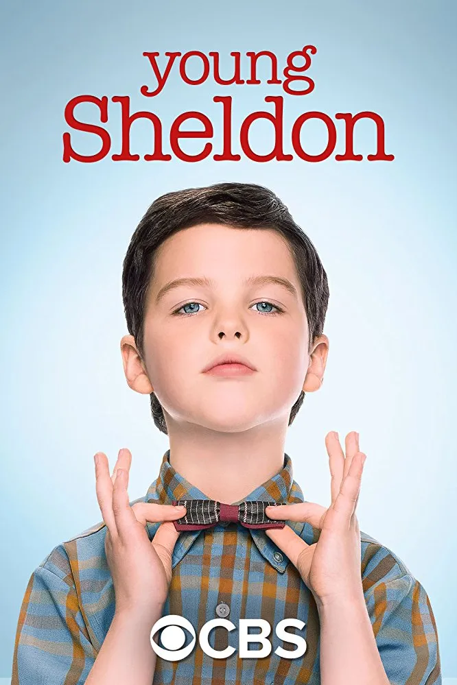

`Young Sheldon`은 전 세계적으로 사랑받은 시트콤 `The Big Bang Theory`의 프리퀄 스핀오프로, 천재 물리학자 셸던 쿠퍼의 어린 시절을 그린 작품이다. 2017년부터 2024년까지 7시즌 141편으로 완결된 이 시리즈는, 1989년 가을 9세의 셸던이 텍사스 메드포드의 고등학교에 입학하면서 시작해, 1994년 14세에 캘리포니아 공과대학(Caltech) 대학원에 입학하기 위해 집을 떠나는 순간까지를 다룬다.

척 로어와 스티븐 몰라로가 창작한 이 작품은, 빅뱅 이론에서 성인 셸던을 연기한 짐 파슨스가 내레이터이자 총괄 프로듀서로 참여하며 연속성을 유지한다. 아이언 아미티지가 연기하는 어린 셸던은, 뛰어난 지능과 사회성 부족 사이에서 균형을 잡으려 애쓰는 천재 소년의 모습을 사랑스럽고 유머러스하게 그려낸다. 독실한 기독교인 어머니 메리(조 페리), 현실적인 아버지 조지 시니어(랜스 바버), 평범한 형 조지(몬타나 조던), 쌍둥이 여동생 미시(리건 레보드), 그리고 셸던을 "문파이"라 부르며 아끼는 할머니 미마우(애니 포츠)와 함께하는 가족의 이야기는, 웃음과 감동을 동시에 선사한다.

## 시리즈 개요

### 시리즈 정보

* **제목**: Young Sheldon / 영 셸던
* **전체 시즌**: 7시즌 (총 141 에피소드)
* **쇼러너**: Chuck Lorre (척 로어), Steven Molaro (스티븐 몰라로), Steve Holland (스티브 홀랜드)
* **감독**: 에피소드별 다수의 감독 (싱글카메라 시트콤)
* **주연**: Iain Armitage (셸던 쿠퍼), Zoe Perry (메리 쿠퍼), Lance Barber (조지 쿠퍼 시니어), Montana Jordan (조지 쿠퍼 주니어), Raegan Revord (미시 쿠퍼), Annie Potts (코니 터커/미마우), Jim Parsons (성인 셸던 내레이션)
* **내레이터**: Jim Parsons (짐 파슨스)
* **음악**: Jeff Cardoni (제프 카르도니), John Debney (존 데브니)
* **오프닝 테마**: "Mighty Little Man" by Steve Burns
* **장르**: 가족 코미디, 성장 드라마, 싱글카메라 시트콤
* **에피소드 러닝타임**: 18-21분
* **방영 기간**: 2017.09.25 - 2024.05.16
* **방영 채널**: CBS
* **제작사**: Chuck Lorre Productions, Warner Bros. Television
* **평점**: IMDb 7.7/10, 로튼 토마토 평균 75%

### 시리즈 주제

`Young Sheldon`의 핵심 주제는 "다름"과 "소속감" 사이의 긴장이다. 셸던은 9세의 나이에 고등학교에 입학할 만큼 지적으로 뛰어나지만, 바로 그 뛰어남 때문에 또래들과 어울리지 못하고 가족 내에서도 이질감을 느낀다. 과학적 무신론자인 셸던과 독실한 침례교 신자인 어머니 메리 사이의 갈등은, 종교와 과학이라는 큰 주제를 가족이라는 사적 영역으로 끌어와 따뜻하게 풀어낸다.

시리즈는 또한 "가족의 의미"를 깊이 탐구한다. 셸던의 뛰어난 지능은 가족 모두에게 도전이 된다. 아버지 조지는 아들을 이해하지 못해 좌절하고, 형 조지는 끊임없이 비교당하며, 어머니 메리는 아들을 보호하려다 과잉보호의 늪에 빠진다. 하지만 이 모든 갈등 속에서도 쿠퍼 가족은 서로를 사랑하고 지지한다. 할머니 미마우는 셸던의 가장 든든한 후원자로, 그를 있는 그대로 받아들이고 격려한다.

1980-90년대 텍사스라는 시대적, 공간적 배경도 중요하다. 냉전 종식, 컴퓨터의 보급, MTV 문화 등 시대적 변화 속에서 소도시 텍사스의 보수적 가치관과 천재 소년의 진보적 사고방식이 충돌하고 조화를 이루는 과정은, 세대 간 이해와 변화에 대한 메시지를 전한다. 조지 시니어가 고등학교 풋볼 코치로서 겪는 현실적 어려움, 가족의 경제적 어려움, 그리고 결국 조지 시니어의 이른 죽음까지, 시리즈는 코미디의 외피 속에 깊은 인간 드라마를 담아낸다.

### 추천 대상

* **빅뱅 이론 팬**: 셸던 쿠퍼의 기원 이야기를 알고 싶은 팬들에게 필수 시청작. 성인 셸던의 특이한 습관과 성격이 어떻게 형성되었는지, 그가 자주 언급하던 가족들의 실제 모습을 볼 수 있다.
* **가족 드라마 애호가**: 웃음과 감동이 조화를 이룬 따뜻한 가족 이야기를 좋아하는 시청자에게 적합. 현대 가족 시트콤의 걸작인 `Modern Family`, `The Middle` 등을 좋아했다면 즐길 수 있다.
* **교육 관심층**: 영재 교육, 천재 아동의 사회화 문제, 가족 내 역할 등에 관심 있는 부모나 교육자들에게 흥미로운 관점을 제공한다. 셸던의 특수성과 보편성이 공존하는 모습에서 많은 교훈을 얻을 수 있다.

## 시리즈 전체 내용 (스포일러 포함)

`Young Sheldon`은 총 7시즌에 걸쳐 셸던 쿠퍼의 9세부터 14세까지 약 5년간의 성장을 다룬다. 141개 에피소드를 통해 셸던의 학문적 성취, 가족 관계의 변화, 그리고 쿠퍼 가족 전체의 희로애락을 세밀하게 그려낸다. 시리즈는 크게 세 시기로 나눌 수 있다: 초기 적응기(시즌 1-3), 전환기(시즌 4-5), 그리고 종결기(시즌 6-7).

### 시즌 1-3 (1989-1991): 천재 소년의 적응기

**시즌 1 (2017, 22편)**: 1989년 가을, 9세의 셸던은 초등학교를 건너뛰고 바로 메드포드 고등학교 9학년에 입학한다. 파일럿 에피소드 "Pilot"에서 셸던은 첫날부터 선생님들의 수업 내용에 오류를 지적하며 미움을 사고, 또래 학생들에게는 괴짜 취급을 받는다. 하지만 집에서는 가족들이 그를 감싸준다. 특히 할머니 미마우는 셸던을 "문파이"라 부르며 아낀다.

셸던은 고등학교에 다니면서도 대학 물리학 수업을 청강하기 시작한다. 이스트 텍사스 공대의 존 스터지스 박사(월레스 쇼운)가 가르치는 수업에 참여하며, 셸던은 처음으로 자신과 지적 대화를 나눌 수 있는 어른을 만난다. 스터지스 박사는 미마우와 연애를 시작하며, 셸던에게는 멘토이자 준-할아버지 역할을 한다.

형 조지(별명 "조지")는 아버지의 관심을 독차지하는 셸던을 질투하며, 학업에서도 항상 비교당하는 것에 피로를 느낀다. 하지만 풋볼에서는 뛰어난 재능을 보이며 아버지와의 유대를 형성한다. 쌍둥이 여동생 미시는 셸던과 지적으로는 비교가 안 되지만, 사회성과 통찰력이 뛰어나다. 그녀는 종종 셸던의 감정적 조언자 역할을 하며, "나 없이는 완전하지 않다"고 고백하는 셸던의 유일한 동반자다.

어머니 메리는 독실한 침례교 신자로, 셸던의 무신론적 과학 추구와 충돌한다. 하지만 동시에 아들을 과잉보호하며, 학교에서 셸던이 문제를 겪을 때마다 적극적으로 개입한다. 아버지 조지 시니어는 고등학교 풋볼 코치로, 지적으로는 셸던을 따라가지 못하지만 나름의 방식으로 아들을 이해하려 노력한다. 그는 재정적 압박과 코칭 성적 부진으로 스트레스를 받으며, 메리와의 결혼 생활도 긴장 상태에 놓인다.

시즌 1의 주요 에피소드로는 "A Therapist, a Comic Book, and a Breakfast Sausage"가 있다. 셸던이 처음으로 만화책 가게를 발견하고 코믹북의 세계에 빠져드는 이야기로, 베트남계 미국인 친구 탐 응우옌(라이언 퐁)을 만나게 된다. 탐은 셸던에게 코믹북, 롤플레잉 게임 등 비과학적 취미를 소개하며, 셸던의 유일한 학교 친구가 된다.

**시즌 2 (2018, 22편)**: 셸던은 10세가 되고, 학교 생활에 점차 적응한다. 이 시즌에서 중요한 전환점은 셸던과 같은 천재 소녀 페이지 스완슨(맥케나 그레이스)과의 만남이다. 페이지는 셸던과 비슷한 지능을 가졌지만 가정 환경이 불안정하다. 부모의 이혼 후 페이지는 점차 방황하며, 셸던은 그녀를 경쟁자이자 친구로 여긴다. 둘의 관계는 시리즈 내내 복잡하게 전개된다.

스터지스 박사는 정신 건강 문제로 입원하게 되고, 이는 미마우에게 큰 충격을 준다. 셸던 역시 자신의 멘토가 무너지는 모습에 혼란을 느낀다. 스터지스 박사는 결국 회복하지만, 미마우와의 관계는 끝이 난다.

조지는 점차 성숙해지며 여자친구에 관심을 갖기 시작한다. 베로니카 던컨(이사벨 메이)이라는 문제아 소녀에게 끌리지만, 그녀가 기독교로 개종한 후 조지에게 흥미를 잃자 좌절한다. 미시는 야구 선수로 활동하며 자신만의 정체성을 찾으려 노력한다.

이 시즌의 백미는 "A Swedish Science Thing and the Equation for Toast"로, 셸던이 노벨상 후보에 오른 과학자의 논문에서 오류를 발견하고 지적하는 에피소드다. 이는 성인 셸던이 결국 노벨상을 받게 되는 빅뱅 이론의 결말과 연결되는 복선이다.

**시즌 3 (2019-2020, 21편)**: 셸던은 11세가 되어 고등학교를 졸업하고 최우등 졸업생(valedictorian)이 된다. 졸업 연설에서 셸던은 가족에 대한 감사를 표현하며, 특히 항상 자신을 믿어준 미마우에게 고마움을 전한다. 이제 셸던은 풀타임으로 이스트 텍사스 공대에 다니게 된다.

대학생활의 시작은 순탄치 않다. 셸던은 기숙사에 배정받지만, 룸메이트들과의 갈등으로 곧 집으로 돌아온다. 이는 빅뱅 이론에서 셸던이 룸메이트 계약서에 집착하는 이유를 설명해준다. 대학에서 셸던은 다양한 교수들과 만나며, 그중 일부는 그의 재능을 인정하지만, 일부는 그의 오만함에 질려한다.

스터지스 박사는 정신 건강 문제로 인해 대학에서 해고되고, 슈퍼콜라이더 프로젝트에서도 해고된 후 식료품점에서 일하게 된다. 셸던은 멘토의 몰락을 지켜보며 과학계의 냉혹함을 배운다. 한편, 미마우는 스포츠 용품점 주인 데일 발라드(크레이그 T. 넬슨)와 새로운 연애를 시작한다.

조지는 17세에 고등학교를 자퇴하고 풀타임으로 일하기로 결정한다. 이는 메리에게 큰 충격이지만, 조지는 자신이 학업보다는 세일즈에 재능이 있다고 확신한다. 그는 데일의 가게에서 일하기 시작하며, 나중에 빅뱅 이론에서 나온 것처럼 타이어 체인점 사업가가 되는 기반을 다진다.

조지 시니어의 건강이 서서히 악화되기 시작하는 암시가 나타난다. 스트레스, 과음, 건강하지 못한 생활습관이 누적되고 있다. 메리는 교회의 젊은 목사 롭(댄 바이드)에게 감정적으로 끌리며, 결혼 생활에 위기가 찾아온다. 하지만 메리는 결국 선을 넘지 않는다.

### 시즌 4-5 (2020-2022): 격변의 시기

**시즌 4 (2020-2021, 18편)**: 셸던의 대학 생활이 본격화되고, 가족 내 변화가 가속화된다. 이 시즌은 코로나19 팬데믹으로 인해 18편으로 단축되었지만, 중요한 이야기들이 담겨있다.

셸던은 대학 기숙사로 다시 돌아가 독립적인 생활을 시도한다. 룸메이트들인 다렌과 오스카와는 비디오 게임을 함께 하며 어느 정도 친분을 쌓는다. 하지만 여전히 사회적 기술은 부족하고, 종종 집으로 돌아가 어머니의 위로를 받는다.

스터지스 박사는 대학으로 복귀하며, 다시 셸던의 멘토 역할을 한다. 하지만 그의 정신 건강은 여전히 불안정하다. 미마우는 데일과의 관계가 진지해지며, 데일의 전부인 준(레바 맥엔타이어)과도 친구가 된다.

조지는 나이가 많은 일기예보 진행자 맨디 맥앨리스터(에밀리 오스먼트)와 우연히 만나 끌리게 된다. 맨디는 조지보다 약 12세 연상이지만, 둘은 서로에게 호감을 느낀다. 조지는 자신의 나이를 속이고 관계를 이어가지만, 결국 진실이 밝혀진다. 그럼에도 불구하고 둘의 관계는 계속된다.

이 시즌의 중요한 에피소드는 "A Second Prodigy and the Hottest Tips for Pouty Lips"로, 페이지 스완슨이 재등장한다. 페이지는 부모의 이혼 이후 방황하며 학업을 포기한 상태다. 셸던은 그녀를 다시 과학으로 돌아오게 하려 하지만 실패한다. 이는 천재성이 환경에 의해 얼마나 영향을 받는지 보여주는 슬픈 이야기다.

**시즌 5 (2021-2022, 22편)**: 이 시즌은 시리즈에서 가장 드라마틱한 전환점들을 담고 있다. 조지와 맨디의 관계가 심각해지고, 조지 시니어의 건강이 더욱 악화되며, 셸던은 대학에서 중요한 학문적 성취를 이룬다.

시즌 5의 가장 큰 사건은 맨디의 임신이다. 조지가 17세에 맨디를 임신시키면서, 쿠퍼 가족은 큰 혼란에 빠진다. 메리는 처음에는 충격과 분노로 맨디를 거부하지만, 점차 받아들이고 지지하게 된다. 조지 시니어는 아들의 책임감을 강조하며, 조지가 성숙해지도록 돕는다. 조지는 학교를 그만두고 일에 전념하며, 맨디와의 관계에 진지하게 임한다.

셸던은 대학에서 프로톤 붕괴 실험에 참여하며, 이는 그의 학문적 경력에서 중요한 이정표가 된다. 또한 셸던은 동료 학생들과의 갈등, 교수들과의 관계 등에서 점차 사회적 기술을 배워간다. 이 시즌에서 하워드 월로위츠(사이먼 헬버그)가 내레이션으로 카메오 출연하며, 셸던이 공학을 "과학이 아닌 기술"이라고 멸시하게 된 계기를 설명한다.

조지 시니어는 가벼운 심장마비를 겪으며, 가족들에게 경고 신호를 보낸다. 그는 생활습관을 바꾸려 노력하지만, 스트레스와 재정적 압박은 계속된다. 메리는 교회에서 더욱 활발히 활동하며, 젊은 목사 롭과의 감정적 긴장도 높아진다. 하지만 메리는 결국 유혹을 뿌리치고 가족에게 충실하기로 한다.

미시는 사춘기에 접어들며 남자친구 마커스(런던 체셔)와 데이트를 시작한다. 그녀는 점차 자신만의 정체성을 찾아가며, 셸던의 그림자에서 벗어나려 노력한다. 미마우는 데일과의 관계가 안정되며, 쿠퍼 가족의 든든한 후원자 역할을 계속한다.

시즌 5 피날레 "A Clogged Pore, a Little Spanish and the Future"에서 조지 시니어는 라이스 대학교(휴스턴 소재)의 명문 코칭 자리를 제안받는다. 이는 가족에게 더 나은 미래를 줄 수 있는 기회지만, 동시에 텍사스를 떠나야 한다는 의미다. 가족들은 이 제안을 놓고 고민한다.

### 시즌 6-7 (2022-2024): 이별과 새로운 시작

**시즌 6 (2022-2023, 22편)**: 시즌 6는 맨디의 출산, 조지와 맨디의 결혼, 그리고 조지 시니어의 건강 악화를 중심으로 전개된다.

맨디는 딸을 출산하고, 조지와 맨디는 아기의 이름을 할머니 코니(미마우)의 이름을 따서 콘스탄스(별명 "씨씨")로 짓는다. 조지는 아버지가 되면서 눈에 띄게 성숙해지고 책임감을 보인다. 맨디의 부모, 특히 아버지 짐 맥앨리스터(윌 사소)는 처음에는 조지를 못마땅해하지만, 점차 그의 성실함과 노력을 인정하게 된다.

셸던은 학사 학위를 받고 대학원 진학을 준비한다. 그는 다양한 대학원 프로그램에 지원하며, 특히 캘텍(Caltech)에 관심을 갖는다. 이는 빅뱅 이론에서 셸던이 캘텍 교수로 일하게 되는 것과 연결된다. 셸던은 박사 과정에 입학하기엔 아직 어리다는 우려도 있지만, 그의 뛰어난 능력은 부인할 수 없다.

가족 관계에서는 메리와 조지 시니어 사이의 긴장이 완화된다. 조지 시니어는 가족을 위해 라이스 대학 제안을 받아들이기로 하고, 가족은 휴스턴으로의 이사를 준비한다. 하지만 이 모든 계획은 곧 비극으로 바뀐다.

페이지는 다시 한 번 등장하며, 여전히 방황 중이지만 셸던과의 우정은 유지한다. 스터지스 박사는 대학에서 안정적으로 가르치며, 셸던에게 계속 조언을 제공한다. 미마우는 데일과의 관계가 깊어지며, 때로는 가족 회의에도 데일을 데려온다.

이 시즌에서 중요한 에피소드는 "A Tornado, a 10-Hour Flight and Boiled Denim"으로, 토네이도가 메드포드를 강타하며 쿠퍼 가족의 집이 피해를 입는다. 이로 인해 확대 가족이 한 집에 모여 살게 되고, 갈등과 화합이 교차한다. 토네이도는 또한 가족의 취약성과 유대감을 시험하는 상징적 사건이다.

**시즌 7 (2024, 14편)**: 시리즈의 마지막 시즌은 2023년 11월에 발표되었고, 2024년 2월부터 5월까지 방영되었다. 총 14편으로 구성된 이 시즌은 조지 시니어의 죽음과 셸던의 출발이라는 두 가지 중대한 사건을 다룬다.

시즌 7의 12번째 에피소드 "A New Home and a Traditional Texas Torture"에서 조지 시니어는 직장에서 심장마비로 사망한다. 가족들은 집에서 가족사진을 찍기 위해 그를 기다리고 있었지만, 그는 돌아오지 않는다. 조지 시니어의 죽음은 화면 밖에서 일어나며, 가족들이 소식을 듣는 장면으로 처리된다. 이는 빅뱅 이론에서 셸던이 아버지의 죽음에 대해 이야기할 때 감정적으로 힘들어하던 것과 일치한다.

조지 시니어의 장례식 후, 가족들은 슬픔 속에서도 앞으로 나아가야 한다. 메리는 홀로 남겨진 상황에서 강인함을 보이며, 아이들을 지키려 노력한다. 조지는 가장으로서의 책임감을 느끼며 맨디와 씨씨를 더욱 잘 돌본다. 미시는 아버지의 부재를 힘들어하지만, 가족의 지지로 극복한다.

셸던은 14세의 나이에 캘텍 대학원에 합격한다. 하지만 아버지의 죽음 직후 가족을 떠나는 것은 쉽지 않은 결정이다. 메리는 처음에는 셸던이 집에 머물기를 바라지만, 결국 아들의 꿈을 위해 보내주기로 한다. 미마우는 셸던에게 "넌 위대한 일을 할 거야. 하지만 가족을 잊지 마"라고 조언한다.

시리즈 피날레 "Memoir"는 1시간 특별 에피소드로, 성인 셸던(짐 파슨스)이 실제로 등장한다. 피날레는 셸던이 자신의 어린 시절 회고록을 쓰고 있는 장면으로 시작하며, 아내 에이미 패러 파울러(메임 비알릭)와 두 자녀, 아들 레너드와 딸이 함께 있다. 셸던은 회고록을 통해 자신이 얼마나 가족에게 빚졌는지 깨닫는다.

피날레에서 젊은 셸던은 캘리포니아로 가는 비행기에 탄다. 비행기 안에서 그는 어머니가 준 편지를 읽는다. 메리는 편지에서 셸던이 특별하며, 그를 사랑하고 자랑스럽게 여긴다고 쓴다. 셸던은 눈물을 흘리며, 처음으로 가족을 떠나는 것의 의미를 이해한다.

피날레는 또한 쿠퍼 가족의 미래를 암시한다. 조지는 맨디의 아버지 짐과 함께 타이어 사업을 시작하며, 결국 빅뱅 이론에서 나온 것처럼 성공한 사업가가 된다. 미시는 고등학교를 계속 다니며, 정상적인 십대 생활을 즐긴다. 메리는 남편의 죽음을 애도하지만, 교회와 가족의 지지로 힘을 얻는다. 미마우는 데일과 함께 인생을 즐기며, 손자들을 계속 지원한다.

성인 셸던은 회고록의 마지막 줄을 쓴다: "나는 내가 혼자 힘으로 여기까지 왔다고 생각했다. 하지만 돌아보니, 나를 여기까지 이끈 것은 가족의 사랑이었다." 시리즈는 쿠퍼 가족의 사진들이 슬라이드쇼로 나오며, 스티브 번스의 "Mighty Little Man"이 흐르는 가운데 끝난다.

에필로그에서는 조지와 맨디의 스핀오프 시리즈 `Georgie & Mandy's First Marriage`가 2024년 10월에 방영될 것임이 암시된다. 이는 쿠퍼 가족의 이야기가 계속됨을 보여준다.

## 캐릭터 분석

### 셸던 리 쿠퍼 / Sheldon Lee Cooper (아이언 아미티지 / 내레이션: 짐 파슨스)

**개요**: 시리즈의 주인공으로, 9세에 고등학교에 입학한 천재 소년. 수학과 과학에 뛰어나지만 사회적 기술이 부족하고, 종종 타인의 감정을 이해하지 못한다. 독실한 무신론자로, 어머니의 종교적 신념과 충돌한다. 14세에 캘텍 대학원에 입학하기 위해 가족을 떠난다.

**성장 곡선**: 셸던의 성장은 지적 성장과 감정적 성장 두 축에서 진행된다. 지적으로는 고등학교 졸업, 학사 취득, 대학원 입학 등 꾸준히 발전한다. 그는 물리학에서 뛰어난 업적을 쌓으며, 노벨상 수상자의 논문 오류를 찾아내는 등 이미 어린 나이에 학계의 주목을 받는다.

감정적으로는 더 복잡하다. 초기 셸던은 극도로 자기중심적이며, 타인의 감정에 무관심하다. 하지만 시리즈가 진행되며 점차 변화한다. 탐과의 우정, 페이지와의 경쟁적 우정, 스터지스 박사의 정신 건강 문제 목격, 그리고 무엇보다 아버지의 죽음은 셸던에게 타인의 고통을 이해하는 법을 가르친다.

셸던의 가장 큰 성장은 가족의 가치를 깨닫는 것이다. 초기에는 가족을 당연하게 여겼지만, 시리즈 말미에는 자신의 성공이 가족의 희생 위에 있음을 이해한다. 피날레에서 성인 셸던이 "가족의 사랑이 나를 여기까지 이끌었다"고 고백하는 것은, 그의 여정의 핵심이다.

**동기와 욕망**: 셸던의 일차적 욕망은 지식 추구와 과학적 업적이다. 그는 노벨상 수상을 꿈꾸며(이는 빅뱅 이론에서 실현된다), 과학의 발전에 기여하고 싶어한다. 하지만 더 깊은 욕망은 인정받고 싶은 것이다. 셸던은 자신이 특별하다는 것을 알지만, 동시에 그 특별함 때문에 소외된다. 그는 자신을 있는 그대로 받아들여주는 사람들을 갈망한다.

**갈등 구조**: 셸던의 외적 갈등은 사회적 부적응이다. 또래들과 어울리지 못하고, 선생님들과 충돌하며, 심지어 가족들과도 이해의 간극이 있다. 내적 갈등은 자신의 특수성과 보편적 인간 욕구 사이의 긴장이다. 셸던은 특별하고 싶지만 동시에 소속되고 싶어한다. 그는 논리적이고 싶지만 감정을 완전히 무시할 수 없다.

**상징적 의미**: 셸던은 "영재 아동"의 상징이자, 동시에 "이방인"의 상징이다. 그의 여정은 다름을 받아들이고, 그 다름 속에서도 연결과 소속을 찾는 보편적 이야기다. 셸던은 또한 순수한 지적 추구의 상징이며, 동시에 그것이 인간적 따뜻함과 조화를 이룰 때 비로소 완전해짐을 보여준다.

### 메리 쿠퍼 (조 페리)

**개요**: 셸던, 미시, 조지의 어머니. 독실한 남침례교 신자로, 교회에서 활발히 활동한다. 셸던의 무신론과 끊임없이 충돌하지만, 동시에 아들을 누구보다 사랑하고 보호한다. 과잉보호 경향이 있으며, 가족을 위해 많은 희생을 한다. 조 페리는 빅뱅 이론에서 메리를 연기한 로리 멧캐프의 실제 딸이다.

**성장 곡선**: 메리는 시리즈 초반에는 통제적이고 과잉보호적인 어머니다. 셸던이 학교에서 문제를 겪으면 즉시 달려가 개입하고, 아들을 세상으로부터 보호하려 한다. 하지만 시간이 지나며 메리는 아이들이 성장하고 독립해야 함을 받아들이는 법을 배운다.

메리의 가장 큰 시련은 조지 시니어와의 결혼 생활이다. 둘은 지적 수준, 신앙심, 양육 방식에서 차이가 있으며, 재정적 압박과 스트레스로 관계가 긴장된다. 메리는 젊은 목사 롭에게 감정적으로 끌리지만, 결국 유혹을 뿌리친다. 이는 그녀의 도덕적 강인함을 보여준다.

조지 시니어의 죽음 후, 메리는 과부로서 가족을 이끌어야 한다. 이는 그녀에게 엄청난 슬픔과 부담이지만, 동시에 내면의 강인함을 발견하는 계기가 된다. 메리는 셸던을 캘텍으로 보내는 결정을 내리며, 아들의 꿈과 자신의 슬픔 사이에서 아들을 선택한다.

**동기와 욕망**: 메리의 일차적 욕망은 가족의 안전과 행복이다. 특히 셸던이 세상에서 상처받지 않기를 바란다. 그녀는 또한 신앙을 통해 의미와 위안을 찾으며, 아이들도 신앙을 가지기를 원한다. 하지만 셸던의 무신론은 그녀에게 깊은 걱정거리다.

**갈등 구조**: 메리의 주된 갈등은 신앙과 과학, 보호와 독립 사이의 균형 찾기다. 그녀는 셸던을 보호하고 싶지만, 그가 성장하려면 실수할 자유가 필요함을 알아야 한다. 남편과의 결혼 생활 갈등도 중요한 축이며, 사랑과 실망 사이에서 균형을 잡는다.

**상징적 의미**: 메리는 "희생하는 어머니"의 원형이자, 동시에 신앙의 힘을 상징한다. 그녀는 불완전한 세상에서 도덕적 나침반 역할을 하며, 가족에게 사랑과 안정성을 제공한다. 메리는 또한 전통적 가치와 현대적 도전 사이에서 길을 찾는 많은 부모들의 상징이다.

### 조지 쿠퍼 시니어 / George Cooper Sr. (랜스 바버)

**개요**: 셸던, 미시, 조지의 아버지. 메드포드 고등학교의 풋볼 헤드 코치이자 베트남 참전 용사. 지적으로는 셸던을 따라갈 수 없지만, 나름의 방식으로 아들을 이해하고 사랑한다. 재정적 압박과 코칭 압박으로 스트레스를 받으며, 건강하지 못한 생활습관을 가지고 있다. 시즌 7에서 심장마비로 사망한다.

**성장 곡선**: 조지 시니어는 초기에 셸던과의 관계에서 좌절감을 느낀다. 아들과 대화가 통하지 않고, 아들의 관심사를 이해하지 못한다. 하지만 시간이 지나며 조지는 자신만의 방식으로 셸던을 지지하는 법을 배운다. 그는 셸던의 학업을 직접 돕지는 못하지만, 안전한 환경을 제공하고 재정적으로 뒷받침한다.

조지 시니어의 또 다른 성장은 아버지로서의 역할 이해다. 큰아들 조지가 방황할 때, 그는 아들을 비난하기보다 이해하려 노력한다. 조지가 맨디를 임신시켰을 때, 조지 시니어는 분노하기보다 아들에게 책임을 가르친다. 그는 완벽하지 않지만, 최선을 다하는 아버지다.

조지 시니어의 비극은 그가 변화하고 성장하는 바로 그 순간에 죽는다는 것이다. 라이스 대학 제안을 받아 가족에게 더 나은 미래를 제공하려던 순간, 심장마비로 쓰러진다. 이는 인생의 불확실성과 시간의 소중함을 강조한다.

**동기와 욕망**: 조지 시니어의 욕망은 가족을 부양하고 존중받는 코치가 되는 것이다. 그는 성공적인 풋볼 시즌을 원하며, 이를 통해 자존감을 얻는다. 하지만 더 깊은 욕망은 가족과의 연결이다. 그는 아이들, 특히 셸던과 더 가까워지고 싶어하지만 방법을 모른다.

**갈등 구조**: 조지 시니어의 주된 갈등은 현실적 압박이다. 재정적 어려움, 코칭 성적 부진, 건강 악화 등이 그를 짓누른다. 내적으로는 자신이 좋은 아버지이자 남편인지에 대한 의구심이 있다. 메리와의 결혼 생활 긴장도 중요한 갈등이다.

**상징적 의미**: 조지 시니어는 "평범한 영웅"의 상징이다. 그는 천재도 아니고, 부자도 아니며, 완벽하지도 않다. 하지만 매일 일어나 가족을 위해 일하고, 최선을 다한다. 그의 죽음은 빅뱅 이론에서 암시된 바 있지만, Young Sheldon에서 그의 캐릭터에 깊이와 존엄성을 부여하며, 시청자들에게 깊은 감동을 준다.

### 조지 "조지" 쿠퍼 주니어 / George "Georgie" Cooper Jr. (몬타나 조던)

**개요**: 셸던과 미시의 형. 학업에는 재능이 없지만 사회성과 세일즈 능력이 뛰어나다. 끊임없이 셸던과 비교당하며 자라지만, 점차 자신만의 길을 찾는다. 17세에 고등학교를 자퇴하고, 12세 연상의 맨디를 임신시켜 젊은 나이에 아버지가 된다. 결국 성공한 타이어 체인점 사업가가 된다.

**성장 곡선**: 조지의 여정은 자기 발견과 성숙의 이야기다. 초기에는 셸던에 대한 질투와 자신의 학업 부진으로 자존감이 낮다. 부모의 관심이 항상 셸던에게 쏠려있다고 느끼며, 특히 어머니가 셸던을 과잉보호하는 것에 불만이 많다.

하지만 조지는 점차 자신의 강점을 발견한다. 그는 사람들과 쉽게 친해지고, 세일즈에 천부적 재능이 있다. 데일의 스포츠 용품점에서 일하며 이를 증명한다. 고등학교 자퇴 결정은 메리에게 충격이지만, 조지에게는 올바른 선택이다.

맨디의 임신과 아버지 되기는 조지의 결정적 전환점이다. 처음에는 겁에 질리지만, 점차 책임감을 받아들인다. 딸 씨씨가 태어난 후, 조지는 눈에 띄게 성숙해진다. 그는 더 이상 셸던의 그늘에 사는 형이 아니라, 자신만의 가족을 가진 남자가 된다.

**동기와 욕망**: 조지의 욕망은 인정받는 것이다. 특히 부모로부터. 그는 셸던처럼 똑똑하지 않아도 가치 있는 사람임을 증명하고 싶어한다. 또한 맨디와 씨씨에게 좋은 파트너이자 아버지가 되고 싶어한다.

**갈등 구조**: 조지의 주된 갈등은 열등감과 자기 가치 사이의 투쟁이다. 셸던과의 끊임없는 비교는 그에게 상처를 주지만, 동시에 자신만의 길을 찾게 하는 동기가 되기도 한다. 젊은 나이의 부모 되기는 또 다른 도전이며, 성인으로서의 책임과 십대로서의 욕구 사이에서 균형을 잡아야 한다.

**상징적 의미**: 조지는 "다른 형태의 성공"을 상징한다. 학업적 성공이 전부가 아니며, 사회성, 성실함, 책임감도 중요한 가치임을 보여준다. 그의 이야기는 영재 형제를 둔 평범한 아이들에게 희망의 메시지를 전한다.

### 미시 쿠퍼 / Melissa "Missy" Cooper (리건 레보드)

**개요**: 셸던의 쌍둥이 여동생. 지적으로는 셸던에 미치지 못하지만, 사회성과 감성 지능이 뛰어나다. 셸던과 티격태격하지만 깊은 유대감이 있으며, 종종 셸던의 감정적 조언자 역할을 한다. 야구 선수로 활동하며 자신만의 정체성을 찾는다.

**성장 곡선**: 미시는 초기에 셸던의 그림자에 가려진 평범한 아이로 보인다. 하지만 시리즈가 진행되며 그녀의 독특한 강점이 드러난다. 미시는 사람들의 감정을 읽고, 복잡한 사회적 상황을 직관적으로 이해한다. 이는 셸던에게는 없는 능력이다.

미시는 사춘기를 거치며 자신의 정체성을 탐구한다. 야구에서 재능을 보이며, 남자 친구와 데이트도 한다. 그녀는 셸던처럼 특별하지 않아도 괜찮다는 것을 받아들이며, 자신만의 가치를 찾는다. 셸던이 떠날 때, 미시는 슬퍼하지만 동시에 드디어 자신만의 공간을 가질 수 있다는 안도감도 느낀다.

**동기와 욕망**: 미시의 욕망은 자신의 정체성을 확립하는 것이다. 셸던의 쌍둥이라는 꼬리표에서 벗어나, 미시라는 개인으로 인정받고 싶어한다. 그녀는 또한 평범한 십대의 경험들을 원한다. 친구들과 어울리고, 연애하고, 정상적인 학교생활을 즐기는 것.

**갈등 구조**: 미시의 주된 갈등은 셸던과의 비교다. 부모와 교사들은 종종 그녀를 셸던의 기준으로 평가하며, 이는 그녀에게 상처가 된다. 하지만 미시는 점차 비교를 거부하고 자신만의 기준을 세운다. 사춘기의 일반적인 갈등들(정체성, 또래 압력, 부모와의 충돌)도 미시의 이야기에 포함된다.

**상징적 의미**: 미시는 "평범함의 가치"를 상징한다. 천재가 아니어도, 특별하지 않아도, 충분히 가치 있고 사랑받을 자격이 있다는 메시지를 전한다. 그녀는 또한 감성 지능과 사회적 기술의 중요성을 보여주며, 이것들이 IQ만큼, 혹은 그보다 더 중요할 수 있음을 시사한다.

### 코니 "미마우" 터커 / Constance "Meemaw" Tucker (애니 포츠)

**개요**: 메리의 어머니이자 셸던, 미시, 조지의 할머니. 셸던을 "문파이"라 부르며 특별히 아낀다. 독립적이고 직설적인 성격으로, 사위 조지 시니어를 종종 놀리지만 가족을 깊이 사랑한다. 스터지스 박사, 데일 발라드 등과 연애하며 활발한 사회생활을 즐긴다.

**성장 곡선**: 미마우는 시리즈를 통틀어 가장 일관된 캐릭터 중 하나지만, 그녀도 변화를 겪는다. 스터지스 박사와의 관계는 그녀에게 깊은 감정적 투자였으며, 그의 정신 건강 문제와 이별은 그녀에게 상처를 준다. 하지만 미마우는 회복력이 강하며, 데일과의 새로운 관계에서 행복을 찾는다.

미마우는 또한 할머니로서의 역할을 깊이 이해한다. 그녀는 셸던의 가장 큰 옹호자이지만, 다른 손주들도 소홀히 하지 않는다. 조지가 아버지가 되었을 때, 미마우는 증조할머니가 되며, 이는 그녀에게 새로운 기쁨을 준다.

**동기와 욕망**: 미마우의 욕망은 가족의 행복과 자신의 독립적인 삶이다. 그녀는 손주들, 특히 셸던이 꿈을 이루도록 돕고 싶어하며, 동시에 자신만의 삶(연애, 사회활동, 도박 등)도 즐기고 싶어한다.

**갈등 구조**: 미마우의 갈등은 주로 외적이다. 사위 조지 시니어와의 긴장(주로 유머러스하게 표현됨), 연인들과의 관계 문제, 손주들의 문제에 어떻게 개입할지 등. 하지만 내적으로는 나이 들어가는 것과 관련된 불안도 있으며, 특히 스터지스와의 이별 후 사랑을 다시 찾을 수 있을지에 대한 두려움도 있다.

**상징적 의미**: 미마우는 "무조건적 사랑"의 상징이다. 그녀는 셸던을 있는 그대로 받아들이며, 그의 특이함을 문제가 아닌 특별함으로 본다. 미마우는 또한 "활력 있는 노년"의 상징으로, 나이가 들어도 연애하고, 모험하고, 삶을 즐길 수 있음을 보여준다.

## 종합 평가

### 최종 평점: ★★★★½ (4.5/5.0)

**장점**:
- 따뜻하고 유머러스한 가족 이야기로, 웃음과 감동을 동시에 선사
- 아이언 아미티지의 뛰어난 연기로 셸던 쿠퍼라는 복잡한 캐릭터를 설득력 있게 구현
- 빅뱅 이론의 프리퀄로서 성공적이며, 성인 셸던의 배경을 풍부하게 제공
- 1980-90년대 향수를 자극하는 시대적 디테일과 음악
- 천재 아동, 가족 역학, 종교와 과학의 충돌 등 의미 있는 주제 탐구
- 7시즌 동안 일관된 품질 유지하며 만족스러운 결말 제공
- 조지 시니어의 캐릭터에 깊이를 부여하며, 빅뱅 이론에서의 부정적 이미지를 재평가하게 함
- 가족 구성원 각자의 성장과 변화를 섬세하게 그려냄
- 싱글카메라 시트콤 형식으로 웃음 트랙 없이 자연스러운 코미디 구현

**단점**:
- 일부 에피소드는 예측 가능한 시트콤 공식을 따르며 신선함이 부족
- 빅뱅 이론을 보지 않은 시청자에게는 일부 참조와 복선이 의미가 덜할 수 있음
- 조지 시니어의 죽음이 화면 밖에서 처리되어 일부 시청자들에게는 아쉬움
- 후반 시즌에서 일부 캐릭터(페이지, 탐 등)의 이야기가 충분히 마무리되지 않음
- 때때로 지나치게 감상적이거나 교훈적으로 느껴질 수 있음

### 한 줄 평

"Young Sheldon은 천재 소년의 성장기를 넘어, 불완전한 가족의 완벽한 사랑을 그린 따뜻한 걸작이다."

### 추천 작품

- 《The Middle》(2009-2018): 중산층 가정의 일상을 유머러스하게 그린 가족 시트콤. 평범함 속의 비범함을 발견하는 따뜻한 이야기.
- 《Everybody Hates Chris》(2005-2009): 코미디언 크리스 락의 어린 시절을 바탕으로 한 성장 드라마. 내레이션과 시대적 배경이 Young Sheldon과 유사.
- 《The Wonder Years》(1988-1993): 1960-70년대를 배경으로 한 성장 드라마의 고전. 향수와 성장통을 섬세하게 그려냄.
- 《Parenthood》(2010-2015): 확대 가족의 이야기를 다룬 드라마로, 가족 간의 갈등과 화해를 깊이 있게 탐구.
- 《The Goldbergs》(2013-2023): 1980년대를 배경으로 한 가족 시트콤으로, 시대적 향수와 가족애를 결합.

### 시청 전 체크리스트

- 사전 지식이 필요한가? **권장하지만 필수는 아님**: `The Big Bang Theory`를 봤다면 참조와 복선을 더 잘 이해할 수 있지만, Young Sheldon은 독립적으로도 충분히 즐길 수 있다. 오히려 Young Sheldon을 먼저 보고 빅뱅 이론을 나중에 보는 것도 흥미로운 경험이 될 수 있다.

- 어린이와 함께 볼 수 있는가? **전 연령 가능**: 미국 등급 TV-PG로, 가족이 함께 보기에 적합하다. 폭력, 선정성, 욕설이 거의 없으며, 오히려 교육적 가치도 있다. 다만 일부 성인 유머나 주제(임신, 사망 등)가 있어 어린 자녀와 함께 볼 경우 설명이 필요할 수 있다.

- 몰아보기 vs 천천히? **천천히 감상 추천**: 각 에피소드가 18-21분으로 짧아 몰아보기도 가능하지만, 가족 드라마의 감성을 제대로 느끼려면 천천히 보는 것이 좋다. 에피소드당 독립적인 이야기가 있으면서도 시즌 전체의 아크가 있어, 적당한 속도로 보면서 캐릭터들의 변화를 음미하는 것을 추천한다.

- 특정 요소를 기대해도 되는가? **가족 중심 코미디 드라마**: 화려한 비주얼 이펙트나 액션은 없으며, 대부분의 이야기가 가정과 학교를 배경으로 한다. 조용하고 따뜻한 유머, 캐릭터 간의 관계, 일상의 작은 문제들이 주를 이룬다. 빅뱅 이론의 빠른 농담과 과학 유머를 기대한다면 다소 실망할 수 있지만, 더 따뜻하고 감성적인 접근을 원한다면 만족할 것이다.

- 후속작이 있는가? **스핀오프 방영 중**: 2024년 10월부터 `Georgie & Mandy's First Marriage`가 방영 중이다. 조지와 맨디의 결혼 생활을 다루며, Young Sheldon의 세계관을 이어간다. 멀티카메라 시트콤 형식으로, 웃음 트랙이 있다.

## 결론

`Young Sheldon`은 빅뱅 이론의 프리퀄로 시작했지만, 곧 그 이상의 것이 되었다. 7시즌 141편에 걸쳐, 이 시리즈는 천재 소년의 성장기를 넘어 미국 중산층 가정의 보편적 이야기를 그려냈다. 쿠퍼 가족은 완벽하지 않다. 재정적으로 어렵고, 서로를 이해하지 못할 때가 많으며, 갈등도 끊이지 않는다. 하지만 그들은 서로를 사랑하며, 그 사랑이 모든 차이와 어려움을 넘어선다.

셸던 쿠퍼라는 캐릭터는 빅뱅 이론에서 때로 일차원적인 천재 괴짜로 그려졌지만, Young Sheldon에서는 훨씬 더 인간적이고 복잡한 모습을 보인다. 우리는 그가 왜 특정 습관을 가지게 되었는지, 왜 감정 표현이 서툰지, 왜 가족에 대해 복잡한 감정을 가지는지 이해하게 된다. 아이언 아미티지의 연기는 놀라울 정도로 섬세하며, 어린 나이에도 불구하고 셸던의 지적 우월감과 감정적 취약성을 동시에 표현해낸다.

하지만 이 시리즈의 진정한 심장부는 가족이다. 조 페리의 메리는 믿음과 사랑으로 가득하지만 완벽하지 않은 어머니를 설득력 있게 그려낸다. 랜스 바버의 조지 시니어는 빅뱅 이론에서 부정적으로 묘사된 인물을 재평가하게 만들며, 그의 죽음은 시리즈에서 가장 감동적인 순간 중 하나다. 애니 포츠의 미마우는 무조건적 사랑의 화신으로, 시청자들이 가장 사랑하는 캐릭터 중 하나가 되었다.

몬타나 조던과 리건 레보드가 연기한 조지와 미시는 천재 형제의 그늘에서 자신의 정체성을 찾는 평범한 아이들의 이야기를 대표한다. 그들의 여정은 많은 시청자들에게 공감을 불러일으키며, "특별하지 않아도 충분히 가치 있다"는 중요한 메시지를 전한다.

시리즈의 시대적 배경인 1980-90년대는 단순한 배경을 넘어 캐릭터와 이야기의 일부가 된다. 냉전의 종식, 컴퓨터의 보급, MTV 문화, 그리고 보수적인 텍사스 소도시의 분위기는 셸던의 성장에 영향을 미친다. 시대적 디테일과 음악(오프닝 테마인 "Mighty Little Man"부터 각 에피소드에 삽입된 80-90년대 히트곡까지)은 향수를 자극하며 몰입감을 높인다.

`Young Sheldon`의 가장 큰 성취는 코미디와 드라마의 균형이다. 시리즈는 매 에피소드마다 웃음을 선사하지만, 동시에 깊은 감정적 진실을 담고 있다. 조지 시니어의 죽음, 스터지스 박사의 정신 건강 문제, 조지의 10대 임신 등 무거운 주제들을 다루면서도, 절망에 빠지지 않고 희망과 회복력을 강조한다.

시리즈 피날레는 완벽한 마무리를 제공한다. 성인 셸던이 등장해 회고록을 쓰는 프레임은, 전체 시리즈가 셸던의 기억과 성찰이었음을 확인시켜준다. "나를 여기까지 이끈 것은 가족의 사랑이었다"는 깨달음은, 141편의 여정을 하나의 의미 있는 이야기로 묶어낸다. 셸던이 캘리포니아로 떠나는 비행기 안에서 어머니의 편지를 읽으며 눈물 흘리는 장면은, 성장의 기쁨과 이별의 슬픔을 동시에 담아내며 시청자들의 마음을 울린다.

`Young Sheldon`은 단순한 스핀오프를 넘어, 독자적인 정체성과 가치를 가진 작품이다. 빅뱅 이론 팬들에게는 사랑하는 캐릭터의 기원 이야기를, 일반 시청자들에게는 따뜻하고 재미있는 가족 드라마를 제공한다. 천재성과 평범함, 과학과 신앙, 개인의 꿈과 가족의 책임 사이의 긴장을 탐구하며, 궁극적으로는 사랑과 수용의 힘을 노래한다.

7시즌 동안 한 번도 보지 않았다면, 지금이라도 늦지 않았다. 이미 봤다면, 다시 보면서 미처 발견하지 못했던 디테일과 복선들을 찾는 것도 즐거운 경험이 될 것이다. `Young Sheldon`은 그런 재시청의 가치가 있는, 진정으로 특별한 시리즈다.

## 참고 문헌 및 출처

- [Young Sheldon — Wikipedia](https://en.wikipedia.org/wiki/Young_Sheldon)
- [Young Sheldon — IMDb](https://www.imdb.com/title/tt6226232/)
- [Young Sheldon — Rotten Tomatoes](https://www.rottentomatoes.com/tv/young_sheldon)
- [List of Young Sheldon episodes — Wikipedia](https://en.wikipedia.org/wiki/List_of_Young_Sheldon_episodes)
- [Young Sheldon Series Finale Recap — Various Entertainment Sources](https://www.hollywoodreporter.com/tv/tv-news/young-sheldon-series-finale-recap-1235901234/)
- [The Big Bang Theory — Wikipedia (for context)](https://en.wikipedia.org/wiki/The_Big_Bang_Theory)
- [Young Sheldon Season 7 — CBS Official Site](https://www.cbs.com/shows/young-sheldon/)

