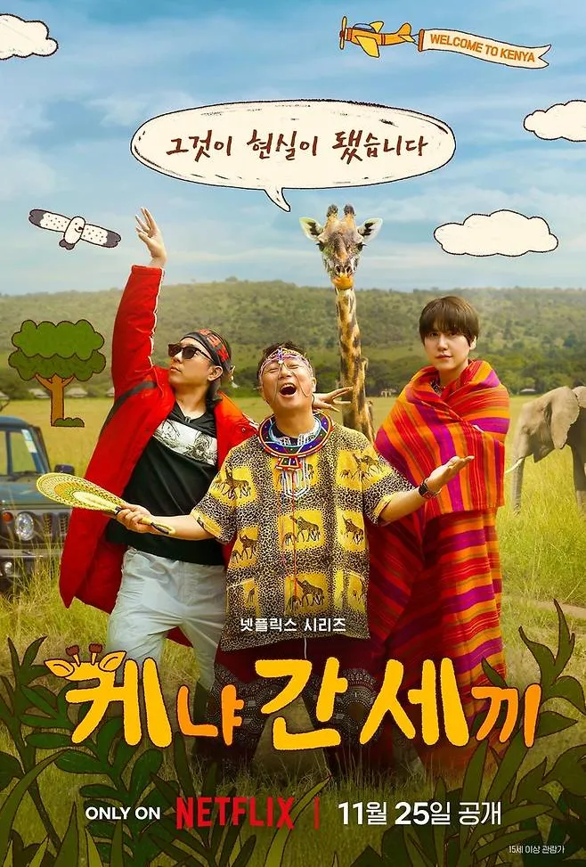

2025년 11월 24일, 넷플릭스를 통해 첫 공개된 예능프로그램 '케냐 간 세끼'는 오랫동안 기다려온 신서유기 팬들을 설레게 했다. 2019년 신서유기7에서 규현이 케냐 기린 호텔 숙박권을 뽑으며 시작된 프로젝트가 6년 만에 드디어 현실이 된 것. 웃음 메이커 이수근, 은지원, 규현 3인방이 펼치는 아프리카 아드벤처는 나영석 프로듀서의 예능 DNA를 그대로 담아냈다.

||
|:---:|
|Netflix Original Series|

## 시즌 개요

### 시리즈 정보
* **제목**: Kenya Three Meals / 케냐 간 세끼
* **시즌**: Season 1 (총 6 에피소드 + 프리뷰)
* **프로듀서**: 나영석 (Na Young-Seok)
* **공동 연출**: 나영석 PD, 김예슬 PD
* **주연**: 이수근 (Lee Soo-Geun), 은지원 (Eun Ji-Won), 규현 (Kyuhyun, Super Junior)
* **장르**: 리얼 버라이어티, 여행 예능, 코미디, 엔터테인먼트
* **에피소드 러닝타임**: 21분(0화) ~ 97분(E06), 평균 약 60분
* **방영 기간**: 2025.11.24 ~ 2025.12.02 (0화: 2025.11.24, E01-E03: 2025.11.25, E04-E06: 2025.12.02, 미공개 클립: 2025.12.06)
* **방영 채널/플랫폼**: Netflix (전 세계 동시 공개)
* **제작사**: 에그이즈커밍
* **제작 배경**: 신서유기 시리즈의 공식 스핀오프

### 시즌 주제
'케냐 간 세끼'는 나영석 프로듀서의 장기 프로젝트를 현실화한 넷플릭스 오리지널 시리즈다. 신서유기 시리즈의 정통성을 이어받은 만큼, 게임·미션·관광이라는 전형적인 나영석 예능 포맷을 유지하면서도 케냐라는 새로운 배경을 배경으로 신선한 시도를 보여주려 했다. 이수근과 은지원의 주축, 규현의 참여로 신서유기 팬들의 향수와 기대를 동시에 자극한다.

### 추천 대상
* **신서유기 팬**: 신서유기의 정통성을 이어받은 스핀오프를 기다렸던 오랜 팬들
* **나영석 예능 애호가**: 나영석 프로듀서의 고정적인 포맷과 톤을 선호하는 시청자
* **해외 여행 예능 팬**: 이국적인 배경과 현지 문화 체험을 즐기는 시청자
* **웃음 무비스** 선호층: 즉흥적인 개그와 자연스러운 웃음을 원하는 관객

## 제작 배경과 기획

### 기원: 신서유기7과 기린 호텔 운명
2019년 방영된 '신서유기7' 에피소드에서 규현이 케냐 기린 호텔 숙박권 경품을 탈취하며 모든 것이 시작되었다. 당시 출연자들의 반응과 시청자들의 반응은 뜨거웠지만, 팬데믹 등의 외부 요인으로 인해 프로젝트는 계속 미뤄질 수밖에 없었다. 6년의 시간을 거쳐 마침내 현실이 된 이 프로젝트는 신서유기 팬덤의 숙원사업과도 같은 것이었다.

### 플랫폼 변화: 유튜브에서 넷플릭스로
기존 신서유기 시리즈는 주로 TV와 유튜브 채널 '삼시세끼' 등을 통해 공개되었지만, '케냐 간 세끼'는 처음으로 넷플릭스라는 글로벌 OTT 플랫폼을 통해 공개된다. 이는 나영석 사단의 국제적 위상 상승을 보여주는 동시에, 제작 환경의 변화를 의미한다. 더 큰 예산과 글로벌 리치를 갖춘 반면, 표현의 자율성에는 약간의 제약이 생길 수 있다는 점이 흥미롭다.

### 제작진 구성: 신구 세대의 결합
주목할 점은 공동 연출을 맡은 김예슬 PD의 참여다. 유튜브 채널 '채널 십오야'의 전성기를 이끈 4세대 PD로 평가받는 그녀가 나영석 PD와 함께 메가폰을 잡음으로써, 나영석표 예능의 견고한 포맷과 '채널 십오야' 스타일의 신선함이 어떻게 조화를 이루는지 관심을 모으고 있었다.

## 시즌 구성 및 에피소드 가이드

### 에피소드 가이드

| 회차 | 공개일 | 분량 | 줄거리 |
|---|---|-----|-----|
| 0화 | 2025.11.24 | 21분 | 만나서 화만내는 사전모임 (프리뷰 에피소드) |
| E01 | 2025.11.25 | 70분 | 우여곡절 끝에 이수근과 은지원, 규현이 나이로비에 도착한다. 그런데 대자연을 접하기는커녕, 첫 도전이 주어지는데. 배고픈 자들을 위한 상식 퀴즈, 정답을 맞혀야만 한 입이라도 맛볼 수 있다. |
| E02 | 2025.11.25 | 58분 | 푸짐하게 차린 케냐 정식 한 상을 두고 단체 퀴즈에 도전하는 3인방. 연이은 오답에 접시가 줄어들며, 식사는 점차 간식이 되어간다. 다음 날은 은밀한 빙고 게임과 케냐식 패션 대결이 기다린다. |
| E03 | 2025.11.25 | 79분 | 드디어 막을 올리는 3인방의 패션쇼. 과연 누가 군침 도는 점심을 차지할 것인가. 사파리 출발을 앞둔 다음 날, 케냐까지 쫓아온 그들의 숙명 같은 '좀비 게임'이 시작된다. |
| E04 | 2025.12.02 | 67분 | 경이로운 사파리의 풍경을 마주한 3인방. 일단 미션에 성공해야 강을 건널 수 있다. 그림 그리기 대결과 '몸으로 말해요' 게임, 한밤의 마피아 게임까지, 도전은 쉴 틈 없이 몰아친다. |
| E05 | 2025.12.02 | 89분 | 시민과 마피아의 치열한 대결이 이어진다. 지키고 빼앗고 속고 속이며 샅샅이 뒤지는 난장판 싸움. 이튿날은 환상적인 사파리 드라이브를 즐기고 한식 술안주로 차린 반전의 회식에 도전한다. |
| E06 | 2025.12.02 | 97분 | 환상적인 열기구 체험과 감성 물씬 사파리 백일장도 마쳤다. 3인방을 기다리는 마지막 게임은 무엇일까. 리조트 구석구석을 누비며 전설 속의 기린을 찾아라! |
| 미공개 클립 | 2025.12.06 | 9분 | 세끼들의 케냐행 비하인드 스토리 |

## 출연진 분석

### 이수근 (Lee Soo-Geun) - 웃음 메이커의 중심

**역할과 특징**
이수근은 신서유기 시리즈에서 확립된 자신의 캐릭터를 그대로 이어간다. 거침없는 언행과 예측 불가능한 행동으로 예측 불가능한 웃음을 만들어낸다. 신서유기에서 구축한 이미지가 있어서인지, 그의 등장만으로 시청자들은 어떤 재미가 펼쳐질지 기대하게 된다.

**예능의 특성**
이수근은 게임과 미션에서 상당히 공격적인 움직임을 보인다. 질 때 나오는 반응, 이길 때의 우월감 표현 등이 매우 자연스럽고 과장되어 웃음을 유발한다. 아프리카라는 낯선 환경에서 그의 즉흥적인 반응과 언술이 얼마나 효과적일지가 관건이다.

### 은지원 (Eun Ji-Won) - 안정감 있는 리더십

**역할과 특징**
은지원은 신서유기 시리즈의 초창기부터 참여한 원년멤버로, 이수근과는 다른 결의 웃음을 제공한다. 어느 정도의 자존심과 경쟁심을 유지하면서도 상황을 컨트롤할 수 있는 능력이 있다. 신서유기에서 그가 펼쳤던 다양한 캐릭터 연기(거짓말 게임에서의 모습, 감정 표현 등)가 이 시리즈에서 어떻게 활용될지가 중요하다.

**예능의 특성**
은지원의 강점은 안정감이다. 게임이 진행되면서 흐름이 끊기거나 어색해질 때 그의 개입은 자연스러운 웃음으로 상황을 살려낸다. 또한 경쟁에서 지더라도 그 과정의 재미를 극대화하는 능력이 있다.

### 규현 (Kyuhyun, Super Junior) - 아이돌에서 예능인으로

**역할과 특징**
규현은 신서유기7에서의 기린 호텔 숙박권을 통해 이 시리즈의 '인질'이자 '미션 완수자'로서의 역할을 한다. 아이돌로서의 정제된 이미지와 예능 무대에서의 폭발적인 에너지를 오가며 특별한 맛을 더할 것으로 예상된다. 이수근과 은지원이라는 '베테랑' 사이에서 그의 역할이 어떻게 정의될지가 흥미롭다.

**예능의 특성**
규현은 아이돌 특유의 '예의 바른 캐릭터'로 시작하지만, 게임이 진행되며 가면이 벗겨지는 전형적인 예능 구조를 활용할 가능성이 높다. 또한 아프리카라는 낯선 환경 속에서의 그의 반응과 생존 전략이 새로운 웃음을 만들어낼 것으로 보인다.

## 나영석 표 예능의 정체성

### 게임·미션·관광의 3단계 포맷

'케냐 간 세끼'는 나영석 프로듀서가 오래전부터 정립해온 리얼 버라이어티 포맷을 충실히 따른다:

1. **게임**: 음식, 기념품, 보상 등을 걸고 진행되는 각종 게임
2. **미션**: 각 게임의 우승자에게 주어지는 특별한 경험이나 임무
3. **관광**: 현지의 자연, 문화, 명소 등을 체험하며 이야기를 진행

이 3요소의 반복과 변주는 신서유기 시리즈의 핵심이며, '케냐 간 세끼'도 이를 충실히 따르고 있다.

### 예측 불가능성과 현장 감각

나영석 예능의 또 다른 특징은 철저한 '현장 감각'과 '즉흥성'이다. 미리 정해진 대본이나 시나리오를 넘어, 출연자들의 자발적인 반응과 상황의 변화에 따라 다이나믹하게 진행된다. 특히 아프리카라는 예측 불가능한 환경 속에서 이러한 특징이 얼마나 빛날지가 관건이다.

### 감정적 공감대의 형성

신서유기 시리즈가 오래 사랑받아온 이유 중 하나는, 단순한 웃음을 넘어 출연자들 간의 유대감, 동료애, 경쟁의식 등 다양한 감정이 복합적으로 드러나기 때문이다. '케냐 간 세끼'에서도 3인방이 펼치는 게임과 미션 속에서 우정, 라이벌리, 그리고 함께하는 기쁨이 자연스럽게 드러날 것으로 예상된다.

## 넷플릭스와 기존 예능의 충돌

### 플랫폼의 특성

나영석 프로듀서는 그동안 TV(tvN)와 유튜브라는 두 플랫폼을 주로 사용해왔다. TV는 편성과 심의라는 제약이 있지만 광대한 대중적 도달력을 갖고 있으며, 유튜브는 높은 자율성과 개성적 표현이 가능한 대신 도달력이 제한적이다. 넷플릭스는 글로벌 도달력과 높은 제작비를 제공하지만, 콘텐츠 가이드라인에 있어 TV보다는 관대하지만 유튜브보다는 제약이 있을 수 있다.

### 기대와 우려

평론가들 사이에서는 넷플릭스라는 플랫폼이 나영석 예능의 '날것'의 매력을 최대한 살릴 수 있을지에 대한 의문이 제기되고 있다. 일부는 더 큰 예산으로 더욱 웅장한 스케일의 콘텐츠가 가능할 것으로 기대하는 반면, 다른 평론가들은 자율성의 제한으로 인해 기존 신서유기 시리즈의 매력이 반감될 수 있다는 우려를 표하고 있다.

## 기대와 평가

### 팬덤의 반응

신서유기의 오랜 팬들 사이에서 '케냐 간 세끼'에 대한 기대는 높다. 6년간 기다려온 스핀오프가 드디어 현실이 되었다는 점, 그리고 신서유기 시리즈에서 대사로만 언급되었던 '기린 호텔'이라는 배경이 실제로 영상화된다는 점이 팬들을 설레게 하고 있다.

### 평론가들의 평가

일부 평론가들은 '케냐 간 세끼'를 긍정적으로 평가하면서도, 나영석 표 예능의 "포장지만 바뀌었다"는 지적을 하고 있다. 즉, 기존의 상식 퀴즈, 정체 맞히기, 멤버 행동 예상하기, 이어 말하기 등의 게임이 반복되며, 케냐라는 새로운 배경이 제대로 활용되지 않았다는 평가다.

### 여행 예능으로서의 가능성

다른 관점에서는 '케냐 간 세끼'를 '삼시세끼 - 아이슬란드 간 세끼'와 같은 계열의 예능으로 보는 평가도 있다. 해외 여행의 낭만과 현지 문화 체험을 중심으로 한다면, 기존의 게임 중심 포맷과는 다른 방향으로 발전할 가능성이 있다는 관점이다.

## 나영석 PD와 김예슬 PD의 협력의 의미

### 채널 십오야의 영향

김예슬 PD가 주도했던 '채널 십오야'는 나영석 PD의 기존 포맷을 현대적으로 재해석한 사례로 평가받는다. 나영석 팬미팅, '소통의 신' 등 신선한 콘텐츠로 유튜브에서 큰 성공을 거두었다. 이번 '케냐 간 세끼'에서 이 두 PD의 협력이 어떤 화학작용을 일으킬지가 주목된다.

### 신구 세대의 만남

나영석은 한국 예능의 거장이자 정립자로서의 입장이라면, 김예슬은 유튜브 세대의 콘텐츠 크리에이터로서의 입장을 가지고 있다. 이 두 입장이 어떻게 조화를 이루고 시너지를 만들어낼지가 '케냐 간 세끼'의 성패를 좌우할 것으로 보인다.

## 에피소드별 상세 분석

### 0화 - "사전모임" (프리뷰, 21분)

**설렘과 기대감**
2025년 11월 24일 공개된 프리뷰 에피소드. 3인방이 케냐 여행을 앞두고 만나 화내는 사전모임. 신서유기 팬들이 6년간 기다려온 이 여행에 대한 기대감과 설렘, 그리고 나영석 예능 특유의 즉흥적인 웃음이 담겨 있다. 이 에피소드를 통해 이번 여행이 얼마나 특별한 프로젝트인지 알 수 있다.

### E01 - "나이로비 도착, 상식 퀴즈" (70분)

**우여곡절 끝의 도착**
우여곡절 끝에 이수근과 은지원, 규현이 나이로비에 도착한다. 그런데 대자연을 접하기는커녕, 첫 도전이 주어진다. 배고픈 자들을 위한 상식 퀴즈가 시작되는데, 정답을 맞혀야만 한 입이라도 맛볼 수 있다는 설정. 시리즈의 전형적인 나영석 포맷이 케냐에서 본격 시작된다.

**첫 번째의 긴장과 웃음**
도착 직후부터 게임이 시작되는 타이트한 구성. 여행의 피로를 풀기 전에 바로 게임이라는 설정이 예능으로서의 긴장감을 높인다. 이수근의 즉흥적 반응, 은지원의 안정감, 규현의 태도가 어떻게 조화를 이루는지 보는 것이 이 에피소드의 포인트다.

### E02 - "케냐 정식과 빙고, 패션 대결" (58분)

**음식을 걸고 펼쳐지는 게임**
푸짐하게 차린 케냐 정식 한 상을 두고 단체 퀴즈에 도전하는 3인방. 연이은 오답에 접시가 줄어들며, 식사는 점차 간식이 되어간다. 음식을 걸고 펼쳐지는 게임의 긴장감이 살아있다. 다음 날은 은밀한 빙고 게임과 케냐식 패션 대결이 기다린다.

**쌓이는 피로와 경쟁심**
연속된 게임 속에서 점점 지쳐가면서도 경쟁심을 잃지 않는 3인방. 식사를 걸고 벌어지는 게임이라는 절실함이 웃음으로 변환되는 과정이 이 에피소드의 매력이다.

### E03 - "패션쇼와 좀비 게임의 시작" (79분)

**드디어 막을 올리는 패션쇼**
드디어 막을 올리는 3인방의 패션쇼. 과연 누가 군침 도는 점심을 차지할 것인가. 케냐식 패션이라는 생소한 주제로 펼쳐지는 게임. 사파리 출발을 앞둔 다음 날, 케냐까지 쫓아온 그들의 숙명 같은 '좀비 게임'이 시작된다.

**시리즈의 전환점**
E03은 나이로비에서의 마지막 게임이자, 본격적인 사파리 여행으로의 전환점. 게임과 여행의 경계가 흐려지면서 예능이 가져야 할 감정적 깊이가 등장한다.

### E04 - "사파리에서의 미션, 그림 그리기와 몸으로 말해요" (67분)

**경이로운 사파리의 풍경**
경이로운 사파리의 풍경을 마주한 3인방. 일단 미션에 성공해야 강을 건널 수 있다는 설정이 게임에 현실적 배경을 더한다. 그림 그리기 대결과 '몸으로 말해요' 게임, 한밤의 마피아 게임까지, 도전은 쉴 틈 없이 몰아친다.

**자연과 게임의 조화**
사파리라는 경외로운 배경 속에서 펼쳐지는 게임들. 광활한 자연 속에서의 게임이 만드는 새로운 매력. 이제부터는 단순한 게임 예능이 아닌 여행 예능으로서의 가치가 더해진다.

### E05 - "마피아 게임의 절정, 사파리 드라이브와 회식" (89분)

**시민과 마피아의 치열한 대결**
시민과 마피아의 치열한 대결이 이어진다. 지키고 빼앗고 속고 속이며 샅샅이 뒤지는 난장판 싸움. 마피아 게임이라는 심리 게임 속에서 3인방의 심리 상태가 적나라하게 드러난다. 이튿날은 환상적인 사파리 드라이브를 즐기고 한식 술안주로 차린 반전의 회식에 도전한다.

**여행의 감정적 절정**
E05는 게임과 여행이 완벽하게 조화를 이루는 에피소드. 심리 게임의 긴장감과 사파리의 경이로움, 그리고 한식 회식이라는 예상 밖의 편안함이 담겨 있다.

### E06 - "열기구 체험과 기린 찾기 최종 게임" (97분)

**시리즈 최종 에피소드의 웅장함**
환상적인 열기구 체험과 감성 물씬 사파리 백일장도 마쳤다. 3인방을 기다리는 마지막 게임은 무엇일까. 리조트 구석구석을 누비며 전설 속의 기린을 찾아라! 시리즈 최장 분량인 97분으로 구성되어, 여행의 모든 것이 응축되어 있다.

**6년의 염원, 기린과의 만남**
신서유기7에서 시작된 기린 호텔 숙박권이라는 약속. 그 약속이 실제로 현실이 되는 순간이 E06의 클라이맥스다. 게임에서 얻은 경험들이 이 마지막 게임으로 수렴된다. 단순한 예능의 결말을 넘어, 신서유기와 이 시리즈를 연결하는 상징적 순간이 된다.

## 제작 환경의 변화

### 제작비와 스케일

넷플릭스 오리지널이라는 타이틀은 신서유기 시리즈에 비해 훨씬 큰 제작비를 의미한다. 케냐로의 해외 로케이션, 항공사 수배, 숙박, 현지 스태프 등 모든 것이 대규모로 진행된다. 이는 시각적 스케일의 확대와 더 정교한 제작을 가능하게 하지만, 동시에 더 큰 책임감도 부여한다.

### 글로벌 시장과의 소통

넷플릭스의 글로벌 플랫폼 특성상, '케냐 간 세끼'는 한국 시장뿐만 아니라 전 세계 시청자를 의식해야 한다. 이는 한국식 예능의 특수성을 어느 정도 유지하면서도 글로벌 시청자들의 눈높이를 맞춰야 한다는 뜻이다. 자막, 자문, 문화 해석 등에서 신경써야 할 부분이 많을 것으로 예상된다.

## 예능계에 미치는 영향

### 한국 예능의 국제화

'케냐 간 세끼'는 한국 예능이 국제 OTT 플랫폼에서 본격적으로 다루어지는 사례다. 이는 이전의 한류 콘텐츠 중심 전략에서 벗어나, 한국식 예능 포맷과 감정성이 글로벌 시장에서 얼마나 소비될 수 있는지를 보여주는 실험이다.

### 해외 로케이션 예능의 확산

COVID-19 이후 해외 여행이 정상화되며, 해외 로케이션을 배경으로 한 예능이 늘어나는 추세다. '케냐 간 세끼'의 성공은 아프리카를 배경으로 한 예능이 가능하다는 것을 보여주며, 이후 다양한 해외 로케이션 예능 개발의 신호탄이 될 가능성이 있다.

### 스핀오프의 가능성

신서유기 시리즈의 스핀오프 성공은 기존의 인기 예능 IP를 새로운 형태로 확장할 수 있는 가능성을 보여준다. 이는 '스튜디오F'와 같은 PD 중심의 제작사 시스템이 글로벌 시장에서도 경쟁력을 가질 수 있음을 의미한다.

## 평론가 평가 종합

### 긍정적 평가

- 신서유기 팬들의 숙원인 스핀오프의 실현
- 나영석 프로듀서의 안정적인 예능 DNA 계승
- 케냐라는 이국적 배경과 3인방의 조화
- 글로벌 OTT 플랫폼에서 한국 예능의 위상 제시

### 비판적 평가

- "포장지만 바뀐 기존의 신서유기" (세트와 게임 반복)
- 케냐의 매력을 제대로 살리지 못함
- 넷플릭스의 심의 기준으로 인한 '날것'의 매력 감소
- 새로운 게임 개발 부족

### 중립적 평가

- 신서유기 팬들에게는 만족스러운 콘텐츠
- 예능계의 새로운 시도로서의 의미
- 플랫폼 변화에 따른 제약과 기회의 공존
- 글로벌 시장 진출의 교두보

## 기대 효과 및 향후 전망

### 단기 효과

**Netflix Korea 톱 콘텐츠**
케냐 간 세끼는 출연진과 제작진의 영향력을 고려할 때, 넷플릭스 코리아에서 상위권 콘텐츠가 될 가능성이 높다. 신서유기 팬덤의 규모와 나영석 프로듀서의 예능계 위상을 고려하면 초기 시청률은 기대할 수 있을 것으로 예상된다.

**글로벌 시청자 확보**
아프리카라는 이국적 배경과 한국 예능의 조합은 글로벌 시청자들에게도 흥미로울 것으로 예상된다. 특히 문화 차이로 인한 자연스러운 웃음과 감동은 언어의 장벽을 뛰어넘을 수 있다.

### 중장기 영향

**신서유기 시리즈의 재평가**
'케냐 간 세끼'의 성공 여부에 따라 신서유기 시리즈 전체에 대한 평가가 새로워질 수 있다. 만약 성공한다면, 그간 저평가되었던 신서유기의 가치가 재조명될 것이다.

**나영석 프로덕션의 미래**
나영석 프로듀서는 이미 거장으로 평가받고 있지만, 글로벌 OTT 플랫폼과의 협력을 통해 국제적 위상을 더욱 강화할 수 있다. 이는 한국 예능 제작사의 글로벌화 전략에도 영향을 미칠 것으로 보인다.

**예능의 미래 방향**
'케냐 간 세끼'는 한국 예능이 어떻게 글로벌화되어야 하는지에 대한 실험이다. 그 결과는 향후 한국 예능의 국제 진출 전략에 영향을 미칠 것이다.

## 종합 평가

### 최종 평점: ★★★★☆ (3.8/5.0)

**장점**:
- 신서유기 팬들의 오랜 염원이 현실화된 스핀오프
- 나영석 표 예능의 정통성을 충실히 계승
- 이수근·은지원·규현의 케미와 웃음
- 글로벌 OTT 플랫폼에서의 한국 예능 위상 제시
- 케냐라는 새로운 배경의 신선함

**단점**:
- 기존의 게임과 미션 반복으로 인한 예측 가능성
- 케냐의 매력을 충분히 살리지 못한 구성
- 넷플릭스 심의 기준으로 인한 표현 자유도 제한
- 새로운 게임 개발 부족
- 4세대 PD 김예슬의 신선함이 제대로 드러나지 않음

### 한 줄 평
"신서유기의 정통성을 이어받으면서도 글로벌 시장을 노린 나영석의 신작, 팬들에게는 필수 시청작이지만 새로움을 기대한 시청자에게는 아쉬움이 남을 수 있다."

### 추천 작품

이 시리즈를 좋아할 만한 시청자들에게 추천하는 작품들:

- **삼시세끼 - 바다의 집** (tvN): 나영석 예능의 또 다른 걸작, 음식과 자연이 주는 감정적 위로
- **신서유기** 시리즈 (tvN, 유튜브): 당연히 모든 시즌 필수 시청
- **벼락치기** (tvN): 나영석 스타일의 해외 로케이션 예능
- **유퀴즈 온 더 블록** (tvN): 이수근의 다양한 모습을 볼 수 있는 작품

### 시청 전 체크리스트

이 시리즈를 보기 전에 반드시 확인해야 할 사항들:

- **신서유기 사전 시청 필수?** → 강력 권장. 신서유기 시리즈를 통해 3인방의 관계와 케냐 기린 호텔의 맥락을 이해할 수 있다면 더욱 재미있게 볼 수 있다.
- **어린이와 함께 볼 수 있는가?** → 가능. 등급상 문제는 없지만, 예능의 재미를 이해하려면 청소년 이상이 좋다.
- **몰아보기 vs 천천히?** → 개인 취향. 한 번에 한 에피소드씩 보며 여운을 즐기거나, 몰아서 3인방의 여행 여정을 따라가는 것도 좋다.
- **특정 요소를 기대해도 되는가?** → 신서유기의 게임과 웃음을 기대한다면 만족할 것. 하지만 케냐 현지 문화에 대한 깊은 이해나 완전히 새로운 포맷을 기대한다면 아쉬울 수 있다.
- **다음 시즌 예정은?** → 공식 발표 미확인. 현재로서는 시즌 1의 완성도가 최우선이다.

## 결론

'케냐 간 세끼'는 2019년 신서유기7에서 뿌려진 씨앗이 6년 만에 맺은 열매다. 팬덤의 염원이 담긴 이 프로젝트는 단순한 스핀오프를 넘어, 한국 예능이 글로벌 시장에서 어떻게 변화하고 적응해야 하는지를 보여주는 실험의 장이다.

나영석 프로듀서의 안정적인 예능 감각과 3인방의 자연스러운 웃음은 신서유기의 정통성을 충실히 지켜낸다. 동시에 넷플릭스라는 글로벌 플랫폼의 지원 아래 더욱 웅장한 스케일의 아프리카 여행을 선사한다.

다만, 기존 포맷의 반복과 케냐라는 배경을 충분히 활용하지 못한 아쉬움이 남는다. 게임과 미션의 구성에서 더욱 새로운 시도가 있었다면, 이 시리즈는 단순한 스핀오프를 넘어 예능 역사에 남을 작품이 될 수 있었을 것이다.

그럼에도 불구하고 '케냐 간 세끼'는 신서유기 팬이라면 필수 시청 대상이며, 나영석 예능을 사랑하는 사람들에게는 큰 선물이다. 이 시리즈의 성공이 앞으로의 한국 예능 산업의 국제화에 좋은 신호가 되기를 바란다.

*"기린 호텔, 드디어 우리를 맞이하다."* — 신서유기 팬들이 남긴 첫 반응

## 참고 문헌 및 출처

- [케냐 간 세끼 (나무위키)](https://namu.wiki)
- [Netflix 국내 1위 '케냐 간 세끼'의 힘... '신서유기' 부활 가능할까? (오마이뉴스)](https://v.daum.net/v/20251207101713970)
- [넷플릭스 국내 1위 '케냐 간 세끼'의 힘 분석 (여러 매체)](https://enews.imbc.com/News/RetrieveNewsInfo/485290)
- [케냐 간 세끼 리뷰 및 분석 (블로그 및 기사)](https://blog.naver.com/reviewlife0203/224087858667?trackingCode=rss)
- [나영석 신작 '케냐 간 세끼' 기획 및 제작 배경 (미디어 보도)](https://www.mk.co.kr/news/broadcasting-service/11487616)
