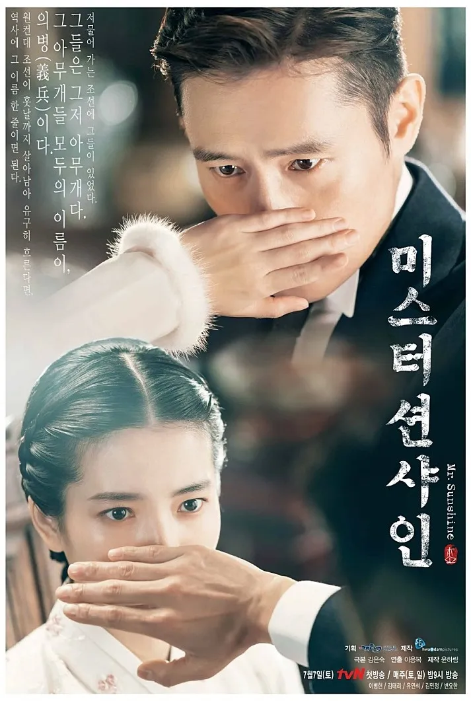
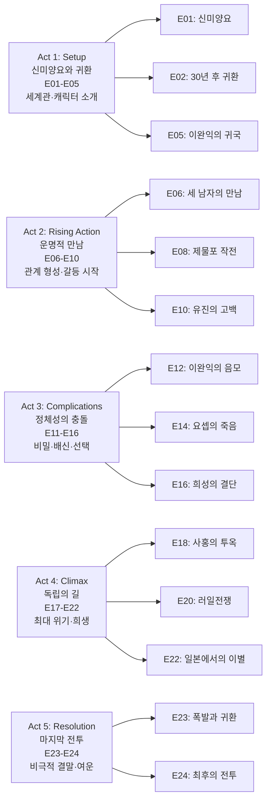
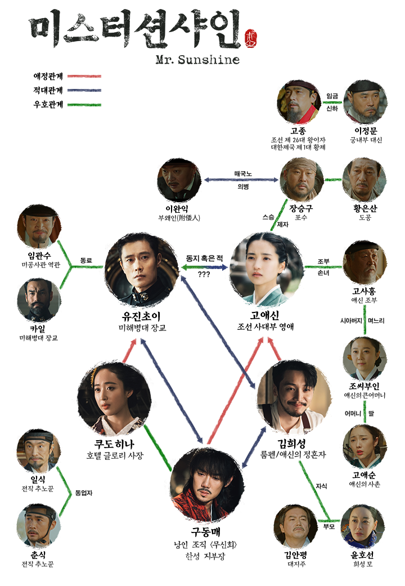

2018년 7월, tvN을 통해 첫 방송된 '미스터 션샤인'은 한국 드라마사에 길이 남을 대작으로 평가받는다. 김은숙 작가의 치밀한 서사와 이응복 감독의 압도적 영상미가 결합되어, 1871년 신미양요부터 1907년 정미의병까지 격동의 시대를 가로지르는 장대한 역사 로맨스를 완성했다. 노비의 아들로 태어나 미국 해병대 장교가 된 유진 초이(이병헌)와 사대부 가문의 딸이자 조국의 독립을 위해 싸우는 의병 고애신(김태리)의 운명적 사랑은, 개인의 로맨스를 넘어 한 나라의 운명과 맞닿아 있다.

전체 24부작으로 구성된 이 드라마는 단순한 시대극을 넘어, 역사의 소용돌이 속에서 각자의 신념과 사랑을 지키려는 인간 군상의 치열한 드라마다. 이병헌, 김태리, 유연석, 김민정, 변요한 등 최정상급 배우들의 열연과 함께, 당대 조선을 둘러싼 미국, 일본, 러시아의 국제 정치 역학을 정교하게 재현했다.

## 시즌 개요

### 시리즈 정보

* **제목**: Mr. Sunshine / 미스터 션샤인
* **시즌**: Season 1 (총 24 에피소드)
* **작가**: 김은숙 (Kim Eun-Sook)
* **연출**: 이응복 (Lee Eung-Bok)
* **주연**: 이병헌 (유진 초이/최유진 역), 김태리 (고애신 역), 유연석 (구동매/이시다 쇼 역), 김민정 (쿠도 히나/이양화 역), 변요한 (김희성 역)
* **조연**: 최무성 (장승구 역), 김갑수 (황은산 역), 이호재 (고사홍 역), 조우진 (임관수 역), 데이비드 맥기니스 (카일 무어 역)
* **음악**: 남혜승
* **장르**: 역사 로맨스, 시대극, 멜로드라마, 액션, 정치 스릴러
* **에피소드 러닝타임**: 평균 75분 (최단 60분, 최장 90분)
* **방영 기간**: 2018.07.07 - 2018.09.30
* **방영 채널**: tvN (토일 21:00)
* **제작사**: 화앤담픽쳐스
* **스트리밍**: Netflix (글로벌 동시 공개)
* **평점**: 네이버 9.33/10, IMDb 8.7/10, 로튼 토마토 97%

### 시즌 주제

'미스터 션샤인'은 한국 근대사의 가장 격동적인 시기인 1871년부터 1907년까지를 배경으로, 개인의 운명과 국가의 운명이 교차하는 지점을 탐구한다. 노비 신분에서 벗어나 미국 장교가 된 유진 초이의 정체성 혼란, 양반 가문의 딸로 태어났지만 조국을 위해 총을 든 고애신의 각성, 백정의 아들로서 차별과 복수 사이에서 갈등하는 구동매의 고뇌는 모두 당대 조선인들이 겪었던 실존적 질문들을 대변한다.

이 드라마는 세 가지 핵심 주제를 중심으로 전개된다. 첫째, **정체성과 소속의 문제**다. 조선인으로 태어났지만 미국인으로 살아온 유진, 여성이지만 남성의 영역에 도전하는 애신, 친일파의 딸이지만 조선인의 정체성을 찾는 히나는 모두 '나는 누구인가'라는 질문과 씨름한다. 둘째, **사랑과 조국 사이의 선택**이다. 애신과 유진의 로맨스는 개인의 행복과 민족의 운명 사이에서 끊임없이 갈등한다. 셋째, **계급과 신분을 넘어선 연대**다. 노비, 백정, 양반, 친일파가 각자의 입장에서 조선의 미래를 고민하며 예상치 못한 연대를 형성한다.

드라마는 역사적 사실(신미양요, 러일전쟁, 군대 해산, 정미의병)과 허구적 인물을 교묘히 결합하여, 거대 서사 속에서도 개인의 감정과 선택이 역사를 만들어간다는 메시지를 전달한다.

### 추천 대상

* **한국 근대사에 관심 있는 시청자**: 신미양요부터 정미의병까지, 교과서에서만 배웠던 역사를 생생한 드라마로 경험할 수 있다.
* **김은숙 작가 팬**: '도깨비', '태양의 후예'로 이어지는 김은숙표 로맨스의 정점을 보여주는 작품이다.
* **웅장한 시대극 애호가**: 영화적 스케일의 전투 장면, 정교한 시대 고증, 압도적 영상미를 선호하는 관객에게 추천한다.
* **캐릭터 중심 드라마 선호층**: 5명의 주요 인물이 각자의 서사를 가지고 성장하며 교차하는 복합적 구조를 즐길 수 있다.
* **비극적 로맨스 팬**: 이루어질 수 없는 사랑, 숭고한 희생, 여운 깊은 결말을 선호하는 시청자에게 적합하다.

## 시즌의 전체 내용 (스포일러 포함)

이 문서에 스포일러가 포함되어 있습니다. 이 섹션은 드라마를 이미 시청한 독자를 대상으로 하며, 주요 줄거리와 결말을 상세히 다룹니다.

### Act 5단계 구조 분석

### Act 1 (Setup): 신미양요와 귀환 — E01-E05

Act 1은 드라마의 세계관을 구축하고 주요 인물들을 소개하는 단계다. 1871년 신미양요와 1902년 조선이라는 두 시간대를 오가며, 유진 초이의 과거와 현재, 그리고 그가 조선으로 돌아온 이유를 밝힌다.

#### [E01] "신미양요" — 운명의 시작

**[E01-S01] 1871년 강화도 광성보 전투**: 드라마는 1871년 6월, 미국과 조선의 충돌인 신미양요로 시작한다. 미 해군의 압도적 화력 앞에서 조선군은 무기력하게 무너지고, 그 전투의 한가운데 9살 소년 유진이 있다. 그는 노비의 아들로, 양반 김판서 집안에서 태어났다. 아버지는 주인의 횡포에 반항하다 살해당하고, 어머니 역시 같은 운명을 맞는다.

**[E01-S02] 미 군함 콜로라도호 승선**: 부모를 잃고 도망치던 어린 유진은 우연히 미 군함 콜로라도호에 숨어든다. 배 안에서 발견된 그는 미국 수병들에게 구조되고, 그렇게 조선을 떠나 미국으로 향한다. 배 창밖으로 보이는 건설 중인 브루클린 브릿지는 유진의 새로운 삶의 시작을 상징한다.

**[E01-S03] 1902년, 미 해병대 대위 유진 초이**: 30년 후, 유진(이병헌)은 미 해병대 대위로 조선에 돌아온다. 그는 한성 주재 미국 공사관의 무관으로 부임한 것이다. 검은 머리의 미국 장교, 그는 조선인이면서도 조선인이 아닌 이방인으로 자신의 고국 땅을 밟는다. 첫날 밤, 종로에 불을 밝히는 600개의 가로등을 보며 그는 변화한 조선과 변하지 않은 조선을 동시에 목격한다.

**[E01-S04] 고애신의 첫 등장**: 같은 시각, 한 여인이 포수와 함께 사격 연습을 하고 있다. 그녀는 고애신(김태리), 사대부 집안의 외동딸이면서 동시에 조선의 독립을 위해 싸우는 의병이다. 그녀의 부모는 친일파 이완익을 암살하려다 실패하고 죽었으며, 애신은 할아버지 고사홍(이호재) 밑에서 자랐다. 그녀는 표면적으로는 양반 규수의 삶을 살지만, 밤이 되면 윈체스터 소총을 들고 조선의 미래를 위해 싸운다.

#### [E02] "30년 후 귀환" — 운명적 만남

**[E02-S01] 유진과 애신의 첫 만남**: 한성 거리에서 유진과 애신이 처음 마주친다. 애신은 일본군의 횡포를 목격하고 개입하려다 유진과 부딪힌다. 유진은 애신을 보는 순간 이상한 끌림을 느끼지만, 애신은 미국 군복을 입은 그를 경계한다. 이 첫 만남은 우연처럼 보이지만, 두 사람의 운명이 얽히는 시작점이다.

**[E02-S02] 글로리 호텔**: 드라마의 또 다른 무대인 글로리 호텔이 등장한다. 이 호텔의 주인은 쿠도 히나(김민정), 겉으로는 일본인 사업가지만 실제로는 친일파 이완익의 딸 이양화다. 그녀는 조선인이라는 정체성을 숨기고 일본식 이름으로 살아가며, 호텔을 통해 조선의 정보를 수집하는 동시에 자신만의 생존 전략을 펼친다.

**[E02-S03] 구동매의 등장**: 백정의 아들로 태어난 구동매(유연석)가 일본에서 돌아온다. 그는 일본 이름 이시다 쇼를 사용하며 무신회 한성지부장으로 활동한다. 그의 목적은 명확하다: 돈을 벌고, 힘을 얻고, 자신을 멸시했던 조선 사회에 복수하는 것. 하지만 그의 내면 깊숙이는 아직 애신에 대한 어린 시절의 기억이 남아 있다.

#### [E03] "나루터의 재회" — 정체 드러내기

**[E03-S01] 나루터에서의 대화**: 유진과 애신이 나루터에서 다시 만난다. 이번에는 우연이 아니라 서로를 의식한 만남이다. 애신은 유진에게 "당신은 조선 사람입니까, 미국 사람입니까?"라고 묻고, 유진은 "미국 사람입니다"라고 대답한다. 하지만 그의 눈빛에는 확신이 없다.

**[E03-S02] 애신의 정체 노출**: 유진은 우연히 애신이 총을 다루는 모습을 목격한다. 양반집 규수가 소총을 능숙하게 다루는 모습에 충격을 받은 유진은 그녀가 단순한 여인이 아님을 직감한다. 애신 역시 자신의 비밀이 들킨 것을 알지만, 유진을 믿기로 결심한다.

**[E03-S03] 동매와 애신의 과거**: 진고개 거리에서 동매는 애신을 마주친다. 그는 손을 떨며 애신의 치맛자락을 잡았던 과거를 회상한다. 애신은 동매의 눈빛에서 그가 누구인지 알아본다. 이 장면은 두 사람 사이에 흐르는 복잡한 감정—증오와 연민, 그리고 숨겨진 애정—을 암시한다.

#### [E05] "이완익의 귀국" — 위기의 전조

**[E05-S01] 이완익의 등장**: 매국노 이완익(김의성)이 조선으로 돌아온다. 그는 일본을 등에 업고 조선의 황실을 위협하며 자신의 권력을 확대하려 한다. 그의 귀국은 모든 등장인물에게 위기를 불러오며, 특히 자신의 부모를 죽인 원수인 애신에게는 가장 큰 위협이 된다.

### Act 2 (Rising Action): 운명적 만남 — E06-E10

Act 2에서는 주요 인물들의 관계가 깊어지고 갈등이 본격화된다. 유진, 동매, 희성 세 남자의 기묘한 관계가 형성되고, 유진은 애신에 대한 자신의 감정을 자각한다.

#### [E06] "세 남자의 만남" — 글로리 호텔의 술자리

**[E06-S01] 바보, 등신, 쪼다**: 유진, 동매, 희성 세 남자가 글로리 호텔에서 우연히 합석하게 된다. 서로 다른 배경과 목적을 가진 이들은 애신이라는 공통분모를 통해 묘한 동질감을 느낀다. "조선에서 제일 안전한 곳은 내 옆이오"라며 애신을 지키려는 그들의 신경전은 드라마의 긴장감을 높이면서도 유머러스한 장면을 연출한다.

**[E06-S02] 희성의 정체성 고민**: 김희성(변요한)은 일본 유학을 마치고 돌아왔지만, 자신의 집안이 저지른 악행에 괴로워하며 방황한다. 그는 룸펜을 자처하며 현실을 도피하려 하지만, 애신을 만나며 변화하기 시작한다.

#### [E08] "제물포 작전" — 러브의 시작

**[E08-S01] 의병 구출 작전**: 애신은 동료 의병을 구하기 위해 제물포로 향한다. 위험에 처한 그녀를 돕기 위해 유진은 가면을 쓰고 작전에 개입한다. 그는 미군 저격수로서의 실력을 발휘하여 일본군의 추격을 저지하고 애신을 탈출시킨다.

**[E08-S02] 정체 확인과 침묵**: 작전 중 유진은 애신이 의병임을 다시 한번 확인하고, 애신 역시 그 가면 쓴 남자가 유진임을 직감한다. 두 사람은 서로의 정체를 알면서도 묵인하며, 말하지 않아도 통하는 깊은 유대감을 형성한다. "합시다, 러브. 나랑 같이." 유진의 이 대사는 두 사람의 관계를 정의하는 명대사다.

#### [E010] "유진의 고백" — 신분의 벽

**[E10-S01] 빙판길 고백**: 얼어붙은 강 위에서 유진은 애신에게 자신의 과거를 고백한다. "나는 노비였소." 양반인 애신에게 이 고백은 충격으로 다가온다. 조선 사회에서 신분의 벽은 절대적이었기 때문이다. 애신의 혼란스러운 표정과 유진의 담담한 고백은 두 사람의 사랑이 순탄치 않을 것임을 예고한다.

### Act 3 (Complications): 정체성의 충돌 — E11-E16 (미드포인트)

Act 3에서는 갈등이 최고조에 달하며, 인물들은 선택의 기로에 선다. 이완익의 악행이 극에 달하고, 유진의 아버지와 같은 요셉 선교사의 죽음은 그를 각성하게 한다.

#### [E12] "이완익의 음모" — 위기의 고조

**[E12-S01] 고사홍의 위기**: 이완익은 고사홍 대감을 압박하며 조선의 철도 부설권을 일본에 넘기려 한다. 고사홍은 이에 맞서지만, 이완익의 계략으로 가문 전체가 위기에 처한다. 이 과정에서 애신의 의병 활동이 발각될 위기에 놓인다.

#### [E14] "요셉의 죽음" — 유진의 분노

**[E14-S01] 아버지의 죽음**: 유진에게 아버지이자 구원자였던 요셉 선교사가 이완익의 사주로 살해당한다. 유진은 요셉의 시신 앞에서 오열하며 복수를 다짐한다. 이 사건은 유진이 더 이상 방관자가 아닌, 조선의 운명에 개입하는 주체로 변화하는 결정적인 계기가 된다.

#### [E16] "희성의 결단" — 파혼

**[E16-S01] 납채서와 파혼**: 희성은 애신을 사랑하지만, 그녀의 마음이 유진에게 있음을 알고 놓아주기로 결심한다. 그는 애신에게 납채서를 돌려주며 파혼을 선언한다. "그대는 나아가시오. 나는 한걸음 물러나니." 희성의 이 희생은 애신이 자신의 길을 갈 수 있도록 돕는 숭고한 사랑의 표현이다.

### Act 4 (Climax): 독립의 길 — E17-E22

Act 4에서는 일본의 침략이 노골화되고, 이에 맞서는 의병들의 투쟁이 격렬해진다. 유진과 애신은 헤어짐을 반복하며 각자의 자리에서 싸운다.

#### [E18] "사홍의 투옥과 죽음" — 가문의 몰락

**[E18-S01] 고사홍의 최후**: 고사홍 대감은 일제의 만행을 규탄하다 투옥되고, 결국 단식 끝에 숨을 거둔다. 애신은 할아버지의 죽음 앞에서 오열하지만, 슬픔을 딛고 의병으로서의 의지를 더욱 불태운다. 고씨 가문은 풍비박산 나지만, 그 정신만은 애신에게 이어진다.

#### [E20] "러일전쟁 발발" — 격랑 속으로

**[E20-S01] 일본군의 진주**: 러일전쟁이 발발하자 일본군은 조선을 병참 기지화하며 더욱 노골적으로 주권을 침해한다. 유진은 미군으로서 중립을 지켜야 하지만, 조선을 유린하는 일본군의 만행을 보며 고뇌한다. 동매와 히나 역시 각자의 방식으로 일본에 저항하기 시작한다.

#### [E22] "일본에서의 이별" — 결혼

**[E22-S01] 일본으로의 탈출**: 애신은 의병 활동 중 위기에 처해 일본으로 피신한다. 유진은 그녀를 돕기 위해 미국행을 포기하고 일본으로 향한다. 두 사람은 일본에서 잠시나마 평화로운 시간을 보내며, 사진관 앞에서 결혼 반지를 끼고 기념 사진을 남긴다. 이것이 그들의 유일한 결혼식이자 마지막 추억이 된다.

### Act 5 (Resolution): 마지막 전투 — E23-E24

Act 5는 비극적이지만 장엄한 결말로 향한다. 모든 등장인물은 자신의 운명을 받아들이고 최후의 선택을 한다.

#### [E23] "폭발과 귀환" — 히나의 희생

**[E23-S01] 글로리 호텔 폭파**: 히나는 일본군이 주둔한 글로리 호텔을 폭파하며 자폭을 시도한다. 그녀는 자신의 모든 것인 호텔과 함께 일본군을 없애려 한다. 동매는 폭발 속에서 히나를 구해내지만, 그녀는 결국 동매의 등에서 숨을 거둔다. "다른 사내를 기다리는 여인을 기다리는 사내"였던 동매에게 마지막 고백을 남기고 떠나는 히나의 죽음은 깊은 여운을 남긴다.

#### [E24] "최후의 전투" — 굿바이 미스터 션샤인

**[E24-S01] 기차 안의 희생**: 애신과 의병들이 탄 평양행 기차에 일본군이 들이닥친다. 유진은 애신을 살리기 위해 남은 총알 하나를 사용하여 기차 연결 고리를 끊는다. 일본군이 있는 칸에 홀로 남은 유진은 빗발치는 총탄을 맞으며 애신을 바라본다. "그대는 나아가시오. 나는 한걸음 물러나니." 유진의 죽음과 함께 기차는 떠나고, 애신은 오열한다.

**[E24-S02] 동매의 최후**: 동매 역시 일본 낭인들과의 마지막 전투 끝에 숨을 거둔다. 그는 마지막 순간까지 애신이 준 동전을 손에 쥐고 있었다. 희성은 사진기자로서 일제의 만행을 기록하다 고문 끝에 옥사한다. 세 남자 모두 애신과 조선을 위해 자신의 목숨을 바쳤다.

**[E24-S03] 2년 후, 만주**: 2년 후, 만주에서 의병들을 훈련시키는 애신의 모습으로 드라마는 끝을 맺는다. "굿바이 미스터 션샤인, 독립된 조국에서 씨 유 어게인." 그녀의 독백은 끝나지 않은 싸움과 희망을 암시한다.

## 에피소드 가이드

| 회차 | 제목 | 방영일 | 한 줄 요약 |
|:---:|:---|:---:|:---|
| E01 | 신미양요 | 2018.07.07 | 1871년 신미양요, 어린 유진이 미국으로 탈출하다. |
| E02 | 30년 후 귀환 | 2018.07.08 | 1902년 미군 대위가 된 유진, 한성에서 애신과 만나다. |
| E03 | 나루터의 재회 | 2018.07.14 | 애신이 의병임을 알게 된 유진, 정체를 묻다. |
| E04 | 잃어버린 총 | 2018.07.15 | 사라진 총 한 자루를 두고 벌어지는 심리전. |
| E05 | 이완익의 귀국 | 2018.07.21 | 매국노 이완익의 귀환, 애신의 부모 이야기가 밝혀지다. |
| E06 | 세 남자의 만남 | 2018.07.22 | 유진, 동매, 희성이 술자리에서 묘한 동맹을 맺다. |
| E07 | 러브의 제안 | 2018.07.28 | 유진이 애신에게 '러브'를 제안하다. |
| E08 | 제물포 작전 | 2018.07.29 | 애신을 구하기 위해 복면을 쓴 유진의 활약. |
| E09 | 의병의 길 | 2018.08.04 | 애신이 의병으로서의 정체성을 고민하다. |
| E10 | 유진의 고백 | 2018.08.05 | "나는 노비였소." 유진의 충격적인 신분 고백. |
| E11 | 엇갈린 운명 | 2018.08.11 | 신분의 차이로 멀어지는 두 사람. |
| E12 | 이완익의 음모 | 2018.08.12 | 이완익이 고사홍 대감을 압박하기 시작하다. |
| E13 | 고사홍의 경고 | 2018.08.18 | 고사홍이 유진에게 애신을 떠날 것을 요구하다. |
| E14 | 요셉의 죽음 | 2018.08.19 | 유진의 아버지 요셉 선교사가 살해당하다. |
| E15 | 복수의 서막 | 2018.08.25 | 유진이 요셉의 죽음을 파헤치며 이완익을 쫓다. |
| E16 | 희성의 결단 | 2018.08.26 | 희성이 애신과의 파혼을 선언하고 그녀를 놓아주다. |
| E17 | 일본군 진주 | 2018.09.01 | 일본군의 횡포가 심해지고 의병들이 결집하다. |
| E18 | 가문의 몰락 | 2018.09.02 | 고사홍 대감의 죽음과 고씨 가문의 몰락. |
| E19 | 모리 타카시 | 2018.09.08 | 악랄한 일본군 대좌 모리 타카시의 등장. |
| E20 | 러일전쟁 | 2018.09.09 | 러일전쟁 발발, 조선의 위기가 고조되다. |
| E21 | 의병장 유진 | 2018.09.15 | 유진이 의병들을 도우며 일본군과 맞서다. |
| E22 | 일본행 | 2018.09.16 | 애신을 구하기 위해 유진이 일본으로 향하다. |
| E23 | 불꽃 속으로 | 2018.09.29 | 히나의 호텔 폭파와 비극적인 죽음. |
| E24 | 굿바이 미스터 션샤인 | 2018.09.30 | 유진의 희생과 남은 이들의 끝나지 않은 싸움. |

## 캐릭터 분석

### 유진 초이 (이병헌)

**개요**: 노비의 아들로 태어나 부모를 잃고 미국으로 도망친 후, 미 해병대 장교가 되어 돌아온 인물. "조선은 나를 버렸으나 미국은 나를 품었다"는 대사처럼 조국에 대한 애증을 가지고 있다.

**성장 곡선**: 처음에는 조선을 멸망시키러 왔다고 말할 정도로 냉소적이었으나, 애신을 만나고 의병들의 치열한 싸움을 목격하며 점차 조선을 돕는 '이방인 의병'으로 변화한다. 마지막 순간에는 자신의 목숨을 바쳐 사랑하는 여인과 조국을 구한다.

### 고애신 (김태리)

**개요**: 사대부 가문의 영애이자, 밤에는 총을 드는 의병. "어차피 피어났다 질 꽃이면 제일 뜨거운 불꽃이고 싶다"는 신념을 가진 주체적인 여성상이다.

**동기와 욕망**: 부모의 피를 이어받아 조선의 독립을 열망한다. 양반 규수로서의 안락한 삶을 거부하고, 험난한 가시밭길을 선택한다. 유진과의 사랑 앞에서도 조국을 포기하지 않는 강인함을 보여준다.

### 구동매 (유연석)

**개요**: 백정의 아들로 태어나 짐승보다 못한 취급을 받다 일본으로 건너가 야쿠자가 된 인물. 조선에 대한 복수심으로 돌아왔으나, 어린 시절 자신을 유일하게 사람으로 대해준 애신을 잊지 못한다.

**갈등 구조**: 애신을 사랑하지만, 그녀의 세계(양반, 의병)를 증오하는 모순적인 감정 속에서 괴로워한다. 결국 애신을 지키기 위해 자신의 모든 것을 내던진다.

### 쿠도 히나 / 이양화 (김민정)

**개요**: 친일파 이완익의 딸로, 일본인 거부에게 팔려가듯 시집갔다가 호텔 글로리의 상속녀가 된 인물. 화려한 외모 뒤에 깊은 상처를 감추고 있다.

**상징적 의미**: 시대의 희생양이자 생존자다. 아버지에 대한 증오와 조선에 대한 연민 사이에서 줄타기를 하며, 자신만의 방식으로 정보전을 펼친다.

### 김희성 (변요한)

**개요**: 조선 최고 갑부 집안의 외동아들. 집안의 업보에 괴로워하며 10년간 일본에서 유학 생활을 했다. 유머러스하고 낭만적인 성격 뒤에 깊은 고뇌를 숨기고 있다.

**성장 곡선**: 처음에는 무기력한 룸펜이었으나, "글의 힘"을 깨닫고 신문사를 차려 일본의 만행을 기록하는 언론인으로 성장한다. 총이나 칼 대신 펜으로 싸우는 또 다른 형태의 의병이다.

## 역사적 배경 및 고증

### 신미양요와 정미의병

드라마는 1871년 신미양요(미국의 강화도 침공)에서 시작하여 1907년 정미의병(군대 해산 후의 의병 전쟁)으로 끝난다. 이는 조선 말기 외세의 침략이 시작된 시점과 국권 피탈 직전의 가장 치열했던 저항기를 연결하는 구조다.

### 고증 이슈

* **무기**: 당시 사용된 모신나강 소총, 게이틀링 건 등의 무기가 비교적 정교하게 재현되었다. 특히 애신이 사용하는 윈체스터 소총은 캐릭터의 상징이 되었다.
* **복식**: 한복과 양장이 공존하던 개화기의 의상을 아름답게 재현했다. 다만, 일부 현대적인 디자인이 가미되었다는 지적도 있다.
* **친일 미화 논란**: 방영 초기 구동매 캐릭터가 소속된 단체(흑룡회 등)가 명성황후 시해와 관련된 단체라는 지적이 있어 수정되기도 했다.

## 제작 및 기술적 요소

* **영상미**: 이응복 감독 특유의 영화 같은 연출이 돋보인다. 특히 전투 장면, 계절의 변화, 한성의 야경 등은 한국 드라마의 수준을 한 단계 높였다는 평가를 받는다.
* **음악**: 남혜승 음악감독의 OST는 서정적이면서도 웅장한 드라마의 분위기를 완벽하게 살렸다. 박효신의 '그 날', 김윤아의 '눈물 아닌 날들' 등이 큰 사랑을 받았다.

## 종합 평가

### 최종 평점: ★★★★☆ (4.5/5.0)

**장점**:
* **압도적인 스케일과 영상미**: 매 회가 영화를 보는 듯한 퀄리티를 자랑한다.
* **배우들의 명연기**: 이병헌의 눈빛 연기, 김태리의 발성, 유연석의 처절함 등 연기 구멍이 없다.
* **깊이 있는 서사**: 단순한 로맨스를 넘어 시대의 아픔을 어루만지는 묵직한 메시지가 있다.

**단점**:
* **초반의 느린 전개**: 세계관 설명과 아역 분량이 길어 초반 몰입에 시간이 걸릴 수 있다.
* **역사 왜곡 논란**: 픽션과 역사의 경계에서 오는 일부 설정(구동매 등)에 대한 호불호가 갈렸다.

### 한 줄 평

"불꽃처럼 타오르다 스러져간 이름 없는 의병들에게 바치는 헌사."

### 추천 작품

* **《각시탈》(2012)**: 일제강점기를 배경으로 한 또 다른 영웅 서사.
* **《암살》(2015)**: 1930년대 독립군 저격수의 이야기를 다룬 영화.

### 시청 전 체크리스트

* **사전 지식이 필요한가?** 구한말 역사(신미양요, 을사늑약 등)를 알면 더 재미있지만, 몰라도 이해하는 데 무리는 없다.
* **어린이와 함께 볼 수 있는가?** 15세 관람가이나, 고문이나 전투 장면 등 다소 잔인한 묘사가 포함되어 있어 주의가 필요하다.
* **몰아보기 vs 천천히?** 감정선이 깊고 호흡이 길어 천천히 음미하며 보는 것을 추천한다.

## 참고 문헌 및 출처

* [Mr. Sunshine (TV Series 2018) - IMDb](https://www.imdb.com/title/tt7094780/)
* [미스터 션샤인 - 나무위키](https://namu.wiki/w/%EB%AF%B8%EC%8A%A4%ED%84%B0%20%EC%85%98%EC%83%A4%EC%9D%B8)
* [Mr. Sunshine - Wikipedia](https://en.wikipedia.org/wiki/Mr._Sunshine_(2018_TV_series))
