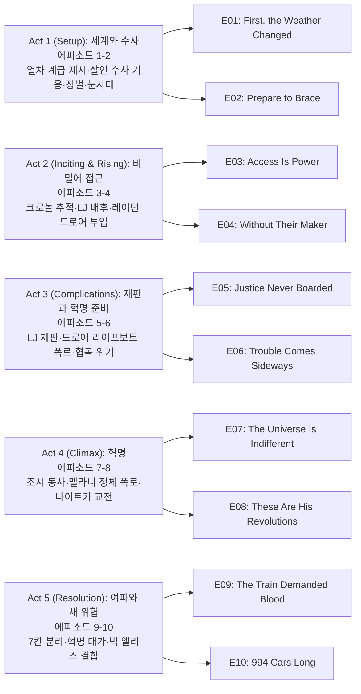

TNT의 `설국열차(Snowpiercer)` 시즌 1은 봉준호 영화(2013)와 동일한 프랑스 그래픽노블 『Le Transperceneige』를 원작으로, 빙하기가 된 지구를 영원히 달리는 1001칸 열차 안의 계급 사회와 혁명을 그린 디스토피아 스릴러다. 꼬리칸의 유일한 살인 수사관 앙드레 레이턴(Daveed Diggs)이 살인 사건 수사를 빌미로 혁명 정보를 수집하고, 호텔리티 책임자 멜라니 캐빌(Jennifer Connelly)이 윌포드 선장의 비밀을 지키며 열차를 운영하는 이중 서사가 한 시즌 안에 격돌한다. 시즌 말 빅 앨리스(Big Alice)의 등장과 멜라니의 정체 폭로는 시즌 2로 이어지는 강렬한 클리프행어를 만든다.

## 시즌 개요

### 시리즈 정보

* **제목**: Snowpiercer / 설국열차
* **시즌**: 시즌 1 (총 10 에피소드)
* **쇼러너**: 그레이엄 맨슨 (Graeme Manson), 조시 프리드먼 (Josh Friedman, 파일럿)
* **감독**: 제임스 호스, 샘 밀러, 헬렌 셰이버, 제임스 호스 등 (에피소드별 상이)
* **주연**: 데이빗 디그스(앙드레 레이턴), 제니퍼 코넬리(멜라니 캐빌), 앨리슨 라이트(루스), 미키 섬너(베스 틸), 수잔 박(진주), 이도 골드버그(베넷), 케이티 맥기니스(조시), 셰일라 밴드(자라)
* **음악**: 벤자민 벨퍼드, 닉 케이브 & 워렌 엘리스(테마)
* **장르**: SF, 스릴러, 미스터리, 드라마, 디스토피아
* **에피소드 러닝타임**: 평균 45–66분
* **방영 기간**: 2020.05.17 - 2020.07.12
* **방영 채널/플랫폼**: TNT (미국), 넷플릭스(국제 스트리밍)
* **제작사**: Tomorrow Studios, Marty Adelstein, CJ Entertainment, Studio T
* **원작**: Jacques Lob, Jean-Marc Rochette — Le Transperceneige (그래픽노블); 봉준호 영화 Snowpiercer (2013)와 동일 세계관 확장
* **평점**: 로튼 토마토 시즌1 약 70%대, IMDb 7.0/10

### 시즌 주제

시즌 1의 축은 **계급 불평등과 질서 유지의 정당성**이다. 1등급·3등급·꼬리칸(수용 구역)으로 나뉜 열차는 자원과 접근 권한으로 계급을 재현하고, "윌포드 선장"의 이름으로 유지되는 질서는 실제로는 멜라니의 엔지니어링과 희생 위에 서 있다. 레이턴은 살인 수사를 통해 앞칸의 구조와 비밀을 파악하고 꼬리칸 혁명을 이끌며, "정의"와 "안정" 사이에서 둘 다 피로 물드는 선택을 하게 된다. 시즌 말 "994 Cars Long"과 빅 앨리스의 등장은 열차 사회의 경계가 열차 밖(다른 열차, 외부 세계)까지 넓어짐을 보여 주며, 권력과 생존의 게임이 새 국면으로 들어감을 암시한다.

### 추천 대상

* **디스토피아·계급 서사 선호자**: 열차 = 사회 알레고리, 꼬리칸 vs 1등급 구도가 명확하게 드러난다.
* **살인 미스터리 + 정치 스릴러 선호자**: 한 건의 연쇄 살인 수사가 열차 전체의 권력 구조와 혁명으로 확장된다.
* **원작·영화 설국열차 팬**: TV판은 열차 내부 세계와 캐릭터를 확장해 미스터리와 권력 다툼에 비중을 둔다.

## 구조 분석 (Act-first 보조 도식)

## 에피소드 가이드

| 전체 | 시즌 내 회차 | 제목 | 연출 | 극본 | 방영일 | 미국 시청자(백만) |
|------|--------------|------|------|------|--------|-------------------|
| 1 | 1 | "First, the Weather Changed" | James Hawes | Graeme Manson (TV story: Josh Friedman, Graeme Manson) | 2020.05.17 | 1.94 |
| 2 | 2 | "Prepare to Brace" | Sam Miller | Donald Joh | 2020.05.24 | 1.16 |
| 3 | 3 | "Access Is Power" | Sam Miller | Lizzie Mickery | 2020.05.31 | 1.22 |
| 4 | 4 | "Without Their Maker" | Frederick E. O. Toye | Hiram Martinez | 2020.06.07 | 1.19 |
| 5 | 5 | "Justice Never Boarded" | Frederick E. O. Toye | Chinaka Hodge | 2020.06.14 | 1.18 |
| 6 | 6 | "Trouble Comes Sideways" | Helen Shaver | Aubrey Nealon, Tina de la Torre | 2020.06.21 | 0.96 |
| 7 | 7 | "The Universe Is Indifferent" | Helen Shaver | Donald Joh | 2020.06.28 | 1.20 |
| 8 | 8 | "These Are His Revolutions" | Everardo Gout | Tina de la Torre (TV story: Hiram Martinez, Tina de la Torre) | 2020.07.05 | 1.14 |
| 9 | 9 | "The Train Demanded Blood" | James Hawes | Aubrey Nealon | 2020.07.12 | 1.27 |
| 10 | 10 | "994 Cars Long" | James Hawes | Graeme Manson | 2020.07.12 | 1.18 |

### 에피소드별 핵심 사건 요약

- **E01 "First, the Weather Changed"**: 지구 동결 이후 7년, 인류 생존자가 설국열차에 갇혀 계급 사회를 형성한 현실이 제시된다. 멜라니는 전직 강력계 형사 레이턴을 살인 사건 수사에 투입하고, 레이턴은 수사와 혁명 준비를 병행한다. 마지막에는 멜라니가 실제로는 윌포드 역할을 대행하고 있음을 드러낸다.
- **E02 "Prepare to Brace"**: 거친 선로와 눈사태로 열차가 흔들리며 자원 손실과 블랙아웃 위기가 발생한다. 꼬리칸 관련 가혹한 처벌, 드로어(서랍칸) 운용, 살인 수사 단서가 동시에 전개된다. 레이턴은 희생자 중 한 명이 윌포드 측 정보원이었음을 파악한다.
- **E03 "Access Is Power"**: 멜라니는 격투 이벤트로 불만을 분산시키려 하지만 폭동으로 번진다. 레이턴은 살인 사건이 암시장 마약 크로놀과 연결되어 있음을 확인하고, 진범으로 의심되는 인물의 윤곽을 좁힌다. 조시에게는 상층 접근용 임플란트를 전달해 반란 준비를 진전시킨다.
- **E04 "Without Their Maker"**: 니키가 살해되고 용의자 에릭이 제3칸에 갇히면서 수사 범위가 좁혀진다. 사건 배후가 폴저 가문, 특히 LJ와 연결되며 계급 특권 문제가 노골화된다. 레이턴이 윌포드 부재를 눈치채자 멜라니는 그를 약물 처리해 드로어에 넣는다.
- **E05 "Justice Never Boarded"**: LJ 재판이 열리며 1등급·2등급·3등급 이해관계가 정면 충돌한다. 배심 구조에 3등급 대표가 포함되지만, 최종 판결은 "윌포드"의 개입으로 뒤집힌다. 조시·틸이 레이턴 구출에 성공하며 반란 재점화의 발판이 마련된다.
- **E06 "Trouble Comes Sideways"**: 레이턴이 회복하는 동안 드로어 수용 대상 블랙리스트의 실체가 드러난다. 열차 유압 시스템 고장으로 전복 위기에 몰리지만 멜라니가 직접 해결한다. 멜라니는 드로어가 단순 감금이 아닌 비상 생존 계획의 일부라고 설명한다.
- **E07 "The Universe Is Indifferent"**: 마일스가 엔진 견습으로 승격되어 반란 핵심 자원으로 편입된다. 멜라니는 레이턴 추적 과정에서 조시를 잔혹하게 고문하고, 조시는 탈출 직후 냉동사한다. 레이턴은 멜라니의 비밀을 상층·중층 세력에 거래 카드로 제시한다.
- **E08 "These Are His Revolutions"**: 마일스와 LJ를 통해 멜라니의 정체가 폭로되며 루스가 멜라니를 구금한다. 레이턴 진영과 잭부츠가 나이트카에서 대규모 교전을 벌이며 혁명이 본격화된다. 드로어 해제가 진행되지만 내부 배신과 이탈 변수도 동시에 발생한다.
- **E09 "The Train Demanded Blood"**: 1등급 진영은 포로 처형으로 레이턴에게 항복을 강요한다. 멜라니는 탈출 후 레이턴과 손잡고 분리 스위치를 이용한 전술을 제안한다. 레이턴은 포로 희생을 감수하고 7칸 분리를 실행해 폴저·그레이·잭부츠 주력을 제거한다.
- **E10 "994 Cars Long"**: 혁명 직후 레이턴이 새 통치 구상을 시작하고 꼬리칸 주민들은 해방감을 누린다. 시카고 접근 중 미지 신호의 정체가 보급열차 빅 앨리스로 밝혀지고, 설국열차에 강제 결합한다. 멜라니의 딸 알렉산드라가 윌포드 측 대표로 등장하며 시즌이 마무리된다.

## 시즌의 전체 내용 (스포일러 포함)

시즌 1은 "빙하기 이후 인류의 마지막 보루"인 설국열차 안에서, 한 건의 살인 사건 수사가 계급 구조의 적나라한 모순을 들춰내고, 결국 무장 혁명과 열차 분리라는 돌이킬 수 없는 결과로 치닫는 과정을 그린다. 꼬리칸 출신 전직 형사 Andre Layton(앙드레 레이턴)은 Melanie Cavill(멜라니 캐빌)의 요청으로 수사권을 얻어 앞칸으로 이동하고, 그 여정에서 "Mr. Wilford(윌포드 선장)"의 실체, 드로어(Drawers)의 비밀, 상층의 정치적 균열을 차례로 파악한다. 중반 재판과 엔지니어링 위기가 계급 갈등을 전면전으로 전환시키고, 후반에는 칸 분리라는 극단적 선택과 Big Alice(빅 앨리스)의 결합으로 시즌 2의 새로운 권력전이 예고된다.

### Act 1 (Setup): 세계와 수사 — [E01–E02]

열차의 계급 구조(1등급·2등급·3등급·꼬리칸), "윌포드 선장" 신화, 그리고 연쇄 살인이 동시에 제시된다. 멜라니는 전직 강력계 형사 레이턴을 수사에 투입하고, 레이턴은 사건 해결과 혁명 준비를 병행한다. 이 구간은 설국열차 세계관과 핵심 갈등(질서 유지 vs 계급 해방)을 가장 선명하게 세팅하는 단계다. 프리미어 에피소드 시청자 194만 명은 시즌 최고 수치로, 시리즈에 대한 초기 관심이 집중되었음을 보여 준다.

#### [E01] "First, the Weather Changed" — 상세 장면 분석

**[E01-S01] 빙하기와 설국열차 세계관**: 지구 온난화를 역전시키려 대기에 살포된 화학물질이 예상을 완전히 벗어나 전 세계를 얼린다. 7년 후, 인류 최후의 생존자들은 수수께끼의 억만장자 윌포드가 설계하고 엘리트·탑승권 구매자들이 자금을 댄 1001칸짜리 설국열차에서 살아간다. 1등급은 호화, 3등급은 노동, 꼬리칸은 탑승권 없이 강제로 탄 사람들("Tailies")의 수용 구역으로, 열악한 환경과 반복되는 반란 진압이 일상이다.

**[E01-S02] 살인과 레이턴 기용**: 열차 안에서 잔인한 살인이 발생하고, "열차의 목소리(Voice of the Train)"인 멜라니 캐빌이 레이턴을 수사에 기용한다. 레이턴은 꼬리칸 유일의 전직 살인 수사관으로, 수사를 수락하는 대가로 꼬리칸 처우 개선을 협상한다. 수사 과정에서 용의자 중 한 명인 전처 Zarah(자라)와 재회하며, 개인적 과거와 계급 정치가 얽히는 서사의 기초가 놓인다.

**[E01-S03] 꼬리칸 자살과 반란 진압**: 꼬리칸에서 한 주민이 자살하자 나머지 주민들이 분노해 즉각 반란을 시도한다. 레이턴은 무력 충돌을 저지하고 그들을 설득한다. 수사를 수행하면서 앞칸의 구조를 파악하고 동맹을 확보하겠다는 장기 전략을 택하는 이 장면은, 레이턴이 충동적 반란자가 아닌 전략가임을 보여 주는 시즌 첫 번째 분기점이다.

**[E01-S04] 멜라니의 비밀 — 운전실**: 에피소드 말미, 멜라니가 직접 설국열차의 운전을 인수하는 장면이 등장한다. 그녀가 사실상 윌포드 선장의 자리를 대행하고 있다는 첫 번째 복선이 심어지며, "윌포드"가 목소리와 이름으로만 존재하는 절대자라는 구도에 균열이 생긴다. 시청자에게는 비밀이 공개되지만 열차 승객 대부분은 이 사실을 모른 채 시즌이 진행된다.

#### [E02] "Prepare to Brace" — 상세 장면 분석

**[E02-S01] 징벌과 공포 통치**: 꼬리칸 반란 지도자들이 드로어(냉동 동면 장치)에 투입되고, Ruth(루스)가 감독하는 징벌 장면이 이어진다. 어린 소녀가 처벌 대상에 오르자 어머니가 대신 자기 팔을 내민다. 영하 137°C 외기에 팔을 노출한 뒤 해머로 파쇄하는 이 잔혹한 장면은 열차 체제의 폭력성을 가장 직접적으로 드러내는 시즌 1의 상징적 이미지다.

**[E02-S02] 눈사태와 공급망 붕괴**: 거친 산악 구간의 선로가 눈사태를 유발하고, 충격파로 가축칸 유리창이 파손된다. 지구 최후의 소 떼와 일부 도축 인력이 영하의 외기에 동사하면서 식량 공급망에 치명적 타격이 가해진다. 순환 정전과 배급 압박이 뒤따르며, 계급 간 자원 격차가 더욱 첨예해진다. 레이턴은 도축업자들이 시체를 식량으로 전용했을 가능성을 추론하며, 열차 내부의 생존 윤리에 첫 번째 의문을 던진다.

**[E02-S03] 정보원 단서와 수사의 전환**: 드로어에서 꺼낸 Nikki(니키)가 각성에 문제를 보이는 가운데, 레이턴과 Till(틸)의 공동 수사는 살인 피해자가 사실 윌포드 측 정보원이었다는 결론에 도달한다. 멜라니는 정보원이 고문 과정에서 어떤 비밀을 누설했는지 불안해하며, 수사의 핵심 질문은 "누가 죽였는가"에서 "무엇을 알았기에 죽었는가"로 전환된다.

### Act 2 (Inciting & Rising): 비밀에 접근 — [E03–E04]

수사는 암시장 마약 Kronole(크로놀), 상층 특권층, 치안 조직까지 확장되며 단순 살인 사건을 넘어 체제의 부패 구조를 드러낸다. 레이턴은 용의자 Erik(에릭)과 LJ Folger(LJ 폴저) 라인에 접근하고, 동시에 멜라니의 지시 체계가 윌포드 부재를 전제로 작동한다는 의심에 도달한다. E04 말미 레이턴의 드로어 투입은 수사 스릴러를 권력 스릴러로 전환하는 시즌의 미드포인트가 된다.

#### [E03] "Access Is Power" — 요약

멜라니가 긴장 완화를 위해 연 격투 이벤트(승자 2등급 승격)가 폭동으로 번진다. 레이턴은 피해자 Sean(숀)이 암시장 마약 크로놀 — 드로어 동면 약물의 거리 변종 — 을 추적하다 살해되었으며, 열차 의사가 공급원임을 확인한다. 자라의 도움으로 청소·암시장 두목 Terence(테런스)를 접촉해 숀과 밀접하게 접촉한 1등급 승객의 윤곽을 좁힌다. 레이턴은 Josie(조시)에게 키스를 빌미로 열차 상층 접근용 임플란트를 전달하며 반란 준비를 진전시킨다. 한편 회복 중인 니키에게 테런스가 묘사한 인상착의와 일치하는 남성이 방문하며, 차기 에피소드의 살인으로 이어지는 복선이 깔린다.

#### [E04] "Without Their Maker" — 상세 장면 분석

**[E04-S01] 니키 살해와 용의자 특정**: 니키가 병실을 찾은 방문자에게 살해된다. 폭동 여파로 칸 사이 경계가 봉쇄되면서 범인은 3등급에 고립되고, 레이턴과 틸은 범인을 Folger(폴저) 가문의 경호원 에릭으로 특정한다. 1등급이 에릭을 보호할 것을 우려하지만, 서민 출신이기도 한 멜라니가 정의 구현에 협조하는 듯한 태도를 보여 긴장이 형성된다.

**[E04-S02] LJ 폴저 — 진범 발각과 추격**: 레이턴은 에릭이 단독범이 아니라 LJ 폴저의 지시를 받은 도구에 불과하다는 결론에 도달한다. 추격전 끝에 에릭은 잭부츠(Jackboots)에 의해 사살되고, LJ가 체포된다. 1등급 가문의 딸이 쾌락 목적으로 살인을 사주했다는 사실은 계급 특권이 생명까지 좌우하는 체제의 병폐를 노골적으로 보여 준다.

**[E04-S03] 레이턴 드로어 투입 — 미드포인트**: 조시는 임플란트를 이용해 꼬리칸에서 앞쪽으로 잠입하고, 이전 꼬리칸 출신 Astrid(아스트리드)에게 연락한다. 그러나 레이턴이 1등급 및 멜라니와의 교류 과정에서 윌포드의 실제 부재를 눈치채자, 멜라니는 비밀 유지를 위해 레이턴을 약물로 제압하고 비밀리에 드로어에 투입한다. 시즌의 주인공이 중반부에 강제 퇴장당하는 이 충격적 전개가 수사 미스터리를 권력 스릴러로 전환하는 결정적 미드포인트이며, 이후 혁명 서사의 방향을 완전히 바꾼다.

### Act 3 (Complications): 재판과 혁명 준비 — [E05–E06]

재판 에피소드에서 계급 갈등이 공개적으로 폭발하고, 레이턴 구출 작전이 성공하며 반란 준비가 재개된다. 이어지는 엔지니어링 위기에서 멜라니가 열차를 직접 구해 "체제의 거짓"과 "운영 능력의 필요"가 충돌하는 역설이 드러난다. 멜라니가 드로어의 진짜 목적 — 질서 붕괴 시 400명을 살리기 위한 라이프보트 — 을 밝히면서 도덕적 경계가 더욱 흐려진다.

#### [E05] "Justice Never Boarded" — 상세 장면 분석

**[E05-S01] LJ 재판과 사법의 붕괴**: LJ 재판이 열리면서 1등급·2등급·3등급의 이해관계가 정면 충돌한다. Audrey(오드리)의 청원으로 배심에 3등급 대표가 포함되고, 배심원단은 만장일치로 유죄를 선고한다. 그러나 "윌포드 선장" 명의의 개입으로 형이 감면되고, LJ는 멜라니에게 비밀을 지키겠다고 약속한다. 법 절차가 권력의 도구에 불과하다는 것이 확인되며, 하층 계급의 분노가 임계점에 도달한다.

**[E05-S02] 폴저 가문의 반란 모의와 조시의 수색**: 폴저 가문은 윌포드에 대항하는 반란을 모의하지만, 충성파 1등급 승객 Martin Colvin(마틴 콜빈)이 멜라니에게 경고한다. 한편 조시는 테런스를 포섭해 레이턴을 찾으려 하지만, 테런스는 약물을 탈취한 뒤 조시를 버린다. 그럼에도 조시는 독자적으로 레이턴이 갇힌 드로어의 위치를 특정한다. 이 시점에서 반(反)멜라니 세력이 꼬리칸뿐 아니라 1등급 내부에서도 형성되어, 혁명의 동력이 다층화된다.

**[E05-S03] 레이턴 구출과 반란 재점화**: 틸과 Oz(오즈)가 순찰 중 조시를 발견한다. 틸은 오즈를 배신하고 조시와 함께 레이턴을 드로어에서 꺼낸다. 구출된 레이턴은 자라에게 도움을 요청하며 반란의 불씨가 되살아난다. 체제의 치안 조직 내부에서 양심적 이탈이 시작되었음을 보여 주는 시즌의 중요한 전환점이다.

#### [E06] "Trouble Comes Sideways" — 요약

Dr. Pelton(펠턴 의사)에게 인도된 레이턴은 드로어 수용 대상 블랙리스트의 실체를 알게 된다. 리스트에는 레이턴, 조시, 펠턴 자신이 포함되어 있으며, 체제가 위험 인물을 선제적으로 제거해 왔음을 뜻한다. 단락 사고로 유압 계통이 고장나 열차가 협곡 교량에서 탈선 직전까지 가지만, 멜라니가 직접 기술 판단으로 전복을 막는다. 레이턴은 멜라니를 죽이려 접근하지만, 멜라니는 드로어가 단순 감금이 아니라 질서 붕괴 시 400명의 전문 인력을 살리기 위한 "라이프보트(lifeboat)"라고 폭로한다. 열차를 살려야 하는 상황에서 레이턴은 멜라니를 놓아줄 수밖에 없고, 이후 조시와 관계를 깊게 하며 멜라니의 진실을 전한다. 오즈가 틸을 협박하지만 틸은 근사 체험 직후 거절하고, Suzanne(수잔)의 죽음 이후 꼬리칸 주민들은 프로젝터를 설치해 처음으로 바깥 세상을 바라본다. 멜라니는 꼬리칸 소년 Miles(마일스)의 공학 재능에 주목하며, 이후 엔진 견습 승격으로 이어지는 복선이 놓인다.

### Act 4 (Climax): 혁명 — [E07–E08]

레이턴은 멜라니의 비밀(윌포드 사칭)을 정치적 무기로 사용해 3등급과 나이트카 세력을 끌어들인다. 멜라니는 레이턴 색출 과정에서 폭력 수위를 극단으로 올리고, 조시의 죽음 이후 갈등은 돌이킬 수 없는 단계로 넘어간다. E08의 대규모 교전과 멜라니 구금은 시즌 1 서사의 클라이맥스다.

#### [E07] "The Universe Is Indifferent" — 상세 장면 분석

**[E07-S01] 마일스의 엔진 견습 승격**: 멜라니가 마일스를 엔진 견습 엔지니어로 승격시켜 엔진실로 데려간다. 마일스는 조시에게 다가올 반란에서 자기 역할을 다하겠다고 약속하며, 이후 엔진 접근권은 혁명의 핵심 레버리지가 된다. 동시에 폴저 가문과 Commander Grey(그레이 사령관)가 루스를 자기편 혁명에 끌어들이려 하고, 루스는 멜라니에게 경고하지만 멜라니가 무시하자 태도를 바꾸는 듯한 모습을 보인다.

**[E07-S02] 조시 고문과 동사**: 멜라니는 자라를 위협해 조시가 레이턴 탈출을 도왔다는 사실을 캐낸다. 멜라니는 조시를 잔혹하게 고문하고, 양심의 가책을 느낀 틸이 도우면서 조시는 구속에서 풀려난다. 그러나 격투 중 외부 문이 열리며 영하의 외기가 유입되고, 조시는 동사한다. 멜라니는 간신히 탈출하면서도 자신이 저지른 폭력의 무게에 흔들린다. 이 장면은 시즌 1에서 가장 잔인한 순간이자, 혁명이 돌이킬 수 없는 단계로 넘어가는 감정적 전환점이다.

**[E07-S03] 비밀 폭로의 서막과 LJ 거래**: 레이턴은 멜라니의 정체(윌포드 사칭)를 오드리가 신뢰하는 3등급 지도자들에게 공개한다. 테런스는 어느 쪽에도 가담하지 않겠다고 선언한다. 틸에게서 조시의 죽음을 전해 들은 레이턴은 LJ에게 접근해 "이 열차에서 가장 더러운 비밀"을 알려주겠다고 거래를 제안한다. 이 거래는 멜라니의 몰락을 가속시킬 도화선이 되며, 시즌 최대 반전으로 이어진다.

#### [E08] "These Are His Revolutions" — 상세 장면 분석

**[E08-S01] 멜라니 정체 폭로와 구금**: 마일스가 LJ에게 멜라니의 비밀을 보여 주고, LJ는 부모 폴저 부부에게 전달한다. 루스가 멜라니를 배신해 구금하고 처형 절차를 밟는다. 마일스와 엔진 기술자 Bennett(베넷)은 엔진실에 틀어박히고, Javi(하비)는 폴저 쪽에 합류한다. 멜라니는 루스에게 탑승 당시 실제 윌포드를 승차 거부시켜 남겨 두고 떠났다고 고백한다 — 윌포드의 이기적 본성이 인류를 파멸시킬 것이라 믿었기 때문이다. 이 고백은 "가짜 선장"의 동기를 처음으로 설명하며, 멜라니의 행위에 대한 도덕적 판단을 시청자에게 넘긴다.

**[E08-S02] 나이트카 대규모 교전**: 레이턴의 혁명이 시작되고, 틸과 Henry Klimpt(헨리 클림프트)가 합류한다. Roche(로슈)와 브레이크맨들은 싸우지 않고 물러나지만, 그레이 사령관과 잭부츠는 끝까지 저항한다. 나이트카에서 양측의 대규모 교전이 벌어지며 Big John(빅 존), Patterson(패터슨) 등이 전사하고 교착 상태에 이른다. 이 전투는 시즌 1에서 가장 큰 규모의 액션 시퀀스로, 혁명의 비용이 피로 치러진다는 시즌의 핵심 메시지를 시각적으로 각인시킨다.

**[E08-S03] 드로어 해제와 내부 분열**: Last Australian(라스트 오스트레일리언)과 클림프트가 드로어에 갇힌 사람들을 해방시킨다. 그러나 Pike(파이크)는 이미 폴저 세력에 의해 먼저 풀려나 있었다. 파이크는 레이턴에게 경고한다 — 온정적인 성격으로는 혁명이 압박 속에서 무너질 것이라고. 혁명의 승리와 내부 분열의 씨앗이 동시에 뿌려지며, 파이크의 경고는 E09에서 레이턴이 직면할 냉혹한 선택을 정확히 예언한다.

### Act 5 (Resolution): 여파와 새 위협 — [E09–E10]

혁명은 승패보다 "어떤 희생을 감수할 것인가"의 문제로 귀결된다. 레이턴은 포로를 구하지 못한 채 칸 분리를 허용하고, 멜라니는 그 선택이 지도자의 현실이라고 못 박는다. 피날레에서는 빅 앨리스가 설국열차에 결합하고 Alexandra(알렉산드라)가 등장해, 권력 축이 내부 계급전에서 열차 간 패권전으로 이동한다. E09는 시즌 최고 시청률(127만)을 기록하며 시리즈의 감정적 절정을 찍는다.

#### [E09] "The Train Demanded Blood" — 상세 장면 분석

**[E09-S01] 포로 처형 위협과 항복 요구**: 1등급 진영은 포획한 혁명군을 처형하며 파이크를 통해 레이턴에게 최후통첩을 전달한다. 항복하지 않으면 포로 전원이 죽는다는 압박이다. 레이턴은 자라가 자신의 아이를 임신 중이라는 사실을 알게 되고, 개인적 책임감과 혁명 지도자로서의 의무 사이에서 갈등한 끝에 거래에 응하기로 결심한다. 이 순간은 레이턴이 처음으로 "승리"보다 "생존"을 우선시하려는 유혹에 빠지는 장면이다.

**[E09-S02] 멜라니 탈출과 역전 전술**: Jinju(진주)와 하비 — 1등급 진영의 잔혹한 전술에 반감을 갖고 이탈 — 의 도움으로 멜라니가 처형 직전 탈출한다. 멜라니는 분기 선로에서 열차 일부를 분리하는 역전 전술을 제안하며, 양쪽 안전 스위치를 동시에 해제해야 한다고 설명한다. 레이턴은 로슈의 협력으로 전방에 침투하고, 라스트 오스트레일리언 및 드로어에서 구출된 혁명군과 합세해 그레이의 포위를 돌파한다.

**[E09-S03] 7칸 분리의 대가**: 레이턴은 분리될 칸에 아군 포로들이 여전히 갇혀 있다는 것을 알지만, 구출할 시간이 없다. 안전장치를 해제하고 베넷과 마일스가 7칸을 분리 실행한다. 폴저 부부(LJ 제외), 그레이, 잭부츠 주력, 그리고 포로들이 절단된 칸과 함께 죽음을 맞는다. 멜라니는 레이턴이 포로를 희생해야 한다는 것을 미리 알고 있었다고 밝힌다. 혁명은 승리와 죄책감을 동시에 남기며, 레이턴은 멜라니가 줄곧 겪어 온 "안정을 위한 희생"이라는 딜레마를 직접 체험한다. "열차는 피를 요구했다(The Train Demanded Blood)"라는 제목이 비유가 아닌 사실로 귀결되는 순간이다.

#### [E10] "994 Cars Long" — 상세 장면 분석

**[E10-S01] 혁명 직후 — 새 질서의 시작**: 멜라니가 공식적으로 레이턴에게 지휘권을 이양하고, 레이턴은 민주적 자치 정부를 구상한다. 꼬리칸 주민들은 처음으로 해방감을 누리며 열차 곳곳을 돌아다닌다. 파이크는 폴저 가문의 호화 객실을 접수해 파티를 열고, 고아가 된 LJ를 내쫓는다. LJ는 오즈와 유대를 형성하며, 혁명 직후의 사회에서 이미 새로운 균열과 권력 공백이 싹트고 있음을 암시한다.

**[E10-S02] 빅 앨리스의 접근과 결합**: 시카고 인근에서 엔진이 미지의 신호를 포착한다. 정체는 윌포드의 프로토타입 영구 엔진(Eternal Engine)으로 가동되는 보급 열차 빅 앨리스다. 빅 앨리스가 설국열차에 강제 결합하며 제어권 장악을 시도하고, 베넷은 빅 앨리스의 자원을 확보하기 위해 의도적으로 속도를 줄였다는 사실이 밝혀진다. 멜라니는 업링크를 절단하려 열차 외부로 나가지만, 빅 앨리스가 시카고에서 열차를 정지시키면서 밖으로 튕겨나간다.

**[E10-S03] 알렉산드라 등장 — 클리프행어**: 빅 앨리스에서 젊은 여성이 나와 윌포드의 이름으로 설국열차의 항복을 요구한다. 그녀는 자신을 Alexandra Cavill(알렉산드라 캐빌)이라 밝힌다 — 멜라니가 죽은 줄 알았던 자신의 딸이다. "진짜 윌포드"의 귀환, 두 열차의 대립, 그리고 모녀 관계의 충격이 겹치며, 시즌 1은 열차 내 계급전에서 열차 간 패권전으로 확장되는 강렬한 클리프행어로 마무리된다. 1001칸이었던 설국열차가 994칸이 되었다는 제목 자체가, 혁명의 대가와 축소된 세계를 상징한다.

## 캐릭터 분석

### 앙드레 레이턴 / Andre Layton (데이빗 디그스)

**개요**: 꼬리칸에 갇힌 전직 살인 수사관이자 반란의 중심 인물. 멜라니에 의해 "선장의 명령"으로 살인 수사에 기용되며 앞칸에 접근하고, 수사를 빌미로 혁명 정보를 모아 무장 봉기를 이끈다.

**성장 곡선**: 시즌 초반에는 "꼬리칸의 정의"를 외치며 수사관 역할과 혁명가 역할을 병행한다. 재판과 엔지니어링 위기를 거치며 "질서를 지키는 쪽"(멜라니)과 "질서를 뒤엎는 쪽"(자신)의 모호함을 경험하고, E08–E09에서 칸을 분리하는 등 냉정한 선택을 하며 동료를 잃는다. 시즌 말에는 지도자로서의 책임과 개인적 비극(조시의 죽음, 자라의 임신)을 동시에 짊어진다.

**동기와 욕망**: 꼬리칸과 하층 계급의 해방, "정의"가 통치 원리인 사회. 하지만 혁명 과정에서 "안정"을 위해 희생을 강요하는 입장에 서게 되며, 멜라니에 대한 이해가 조금씩 늘어난다.

**갈등 구조**: 외적으로는 1등급·호텔리티·브레이크맨과의 대립, 내적으로는 "정의로운 혁명"과 "냉정한 통치자" 사이의 갈등. 조시를 지키지 못한 죄책과 자라와의 과거·임신이 관계적 갈등을 만든다.

**상징적 의미**: 계급 사회 안에서 "아래"의 목소리를 대변하는 저항자이자, 권력을 잡은 뒤에는 "위"와 비슷한 어려운 선택을 하게 되는 리더의 전형이다.

### 멜라니 캐빌 / Melanie Cavill (제니퍼 코넬리)

**개요**: 호텔리티 책임자이자 실제로는 "윌포드 선장"을 사칭하며 설국열차의 운영과 기술적 결정을 책임지는 인물. 엔지니어이자 정치적 중심이다.

**성장 곡선**: 시즌 내내 "선장님의 지시"를 앞세워 질서를 유지하지만, 레이턴의 수사와 혁명으로 비밀이 탄로난다. 재판과 엔지니어링 위기에서 그녀만이 열차를 구할 수 있음이 드러나고, 봉기 후에는 권위를 잃고 "적"에서 "생존을 위한 협력자"에 가까운 위치로 밀린다. 시즌 말 그녀의 과거(딸 알렉산드라를 남긴 것)가 드러나고, 빅 앨리스와 "윌포드"의 귀환이 그녀의 이야기를 시즌 2로 넘긴다.

**동기와 욕망**: 열차와 인류 잔존의 "안정". 윌포드 신화를 유지해 내란을 막고, 한편으로는 딸에 대한 그리움과 죄책을 품고 있다.

**갈등 구조**: "거짓 선장"으로서의 질서 유지 vs 진실이 드러났을 때의 붕괴, 그리고 개인적 트라우마(딸)와 공적 역할의 충돌.

**상징적 의미**: "제작자 없이" 돌아가는 시스템을 유지해 온 엔지니어이자, 독재자 신화를 연기한 희생자에 가까운 인물로, 권력과 도덕성의 경계를 보여 준다.

### 루스 / Ruth (앨리슨 라이트)

**개요**: 호텔리티 소속으로 "선장님"과 질서에 충성하는 관료. 1등급과 선장 신화를 옹호하며 꼬리칸을 "무단 탑승자"로 규정한다.

**성장 곡선**: 시즌 내내 멜라니/윌포드 체제의 충실한 실행자로, 재판과 봉기 과정에서 "위에서 내려온 규율"을 고수한다. 혁명 후에는 권력이 바뀐 상황에 적응해야 하는 위치에 서며, 시즌 1에서는 완전한 전환보다는 충격과 저항이 강조된다.

**동기와 욕망**: 질서, 계급, "선장님"에 대한 신뢰. 혼란보다는 규칙에 따른 안정을 선호한다.

**갈등 구조**: 레이턴과 꼬리칸에 대한 적대 vs 나중에 바뀐 권력 구조와의 공존 가능성.

**상징적 의미**: 체제를 믿고 그 체제를 유지하는 "관리자" 계층의 대표로, 혁명 서사에서 "변하지 않는 충성"의 얼굴이다.

## 드라마에 숨겨진 내용 분석

### 서브텍스트·암시

- "선장님의 목소리"와 멜라니의 목소리가 동일하다는 연출은 초반부터 은근히 반복되어, 시청자로 하여금 "윌포드 = 멜라니"를 추론하게 한다.
- 레이턴이 "정의"를 말할수록 나중에는 멜라니와 비슷한 "희생을 강요하는" 선택을 하게 되는 대비가, 권력과 정의의 모호함을 암시한다.
- W와 M 문양(윌포드/멜라니)의 시각적 유희는 일부 에피소드에서 문이나 소품을 통해 암시되며, 정체성과 권위의 이중성을 보여 준다.

### 상징·소품·배경

- **열차와 칸**: 열차 = 닫힌 사회, 칸의 순서 = 계급. 앞으로 나아가는 "진격"은 사회 이동·혁명의 은유다.
- **음식·배급**: 1등급의 호화 식사와 꼬리칸의 단백질 블록(원작·영화에서의 극단적 대비)은 자원 격차와 신체 통제를 상징한다.
- **빅 앨리스**: "다른 열차"의 등장은 설국열차 사회의 경계가 "밖"으로 열림을 의미하고, 윌포드의 귀환은 "원래 주인"과 "가짜 주인"의 대립을 시즌 2로 넘긴다.

### 복선·회수

- 멜라니가 엔진실에서 직접 시스템을 조작하는 장면들은 "진짜 운영자" 복선이고, E08에서 "윌포드 = 멜라니"로 회수된다.
- 레이턴의 "우리는 정의를 위해 싸운다"는 말은 E09–E10에서 "칸 분리"와 동료 희생으로 인해 스스로에게 의문이 되는 선택으로 회수된다.
- 멜라니의 딸(알렉산드라)에 대한 암시나 회상은 E10 빅 앨리스와의 연결로 회수된다.

### 이스터에그·오마주

- 원작 그래픽노블과 봉준호 영화의 "열차 = 계급 사회" 알레고리를 TV판이 미스터리·정치 스릴러로 재해석한다.
- "994 Cars Long" 제목은 열차 길이(칸 수)를 직접 언급해, 혁명 후에도 "열차" 자체가 유일한 세계임을 강조한다.

### 제작진 의도·해석

- 쇼러너 그레이엄 맨슨은 원작/영화의 세계관을 확장하면서 "살인 미스터리"와 "권력 다툼"을 앞세워 TV만의 서사를 만들었다고 밝힌 바 있다. "윌포드 부재"와 멜라니의 이중 역할은 TV 시리즈의 핵심 설정이다.

## 종합 평가

### 최종 평점: ★★★★☆ (4.0/5.0)

**장점**:
- 살인 수사와 계급 혁명을 한 시즌 안에 잘 엮은 구조
- 데이빗 디그스와 제니퍼 코넬리의 대비되는 캐릭터 연기
- "윌포드 = 멜라니" 반전과 빅 앨리스 등장으로 이어지는 클리프행어
- 원작·영화와 다른 "미스터리·정치" 중심의 TV만의 톤
- 열차 내부 세트와 계급별 공간 연출로 세계관이 분명히 전달됨

**단점**:
- 10화 분량에 수사·혁명·캐릭터가 모두 들어가 일부 전개가 다소 빠르게 느껴질 수 있음
- 1등급·3등급 내부의 세부 캐릭터는 시즌 1에서 제한적으로만 다뤄짐
- 영화 설국열차의 극단적 폭력·상징주의에 비해 TV판은 상대적으로 완화된 폭력과 서사적 설명에 치중

### 한 줄 평

"꼬리칸 수사관의 살인 수사가 혁명으로 번지고, '선장'의 비밀이 열차를 뒤흔든 뒤, 빅 앨리스가 등장해 설국열차 시즌 1을 강하게 마무리한다."

### 추천 작품

- 《설국열차》(2013, 봉준호): 동일 원작의 영화. 열차 = 계급 알레고리와 폭력적 이미지가 더 극단적으로 그려진다.
- 《디 오아 (The OA)》(2016–2019): 닫힌 공간과 신비·권력 구조를 다루는 넷플릭스 SF 드라마.
- 《웨스트월드 (Westworld)》(2016–): 계급·의식·반란을 다루는 SF 스릴러로, "질서 vs 혁명" 테마에서 설국열차와 겹치는 면이 있다.

### 시청 전 체크리스트

- 사전 지식이 필요한가? **선택**: 영화나 원작을 보면 세계관 이해에 도움이 되지만, TV판만으로도 시청 가능하다.
- 어린이와 함께 볼 수 있는가? **15세 이상 권장**: 폭력·살인·정치적 억압 묘사가 있어 청소년 이상을 권한다.
- 몰아보기 vs 천천히? **몰아보기 추천**: 10화가 한 번에 수사→혁명→반전으로 이어져 연속 시청이 흐름에 유리하다.
- 특정 요소를 기대해도 되는가? **미스터리 + 계급 스릴러**: 액션보다는 수사와 권력 다툼, 캐릭터 관계에 비중이 있다.
- 다음 시즌 예정은? **시즌 2–4 제작·방영됨**: 빅 앨리스와 윌포드, 멜라니·알렉산드라 관계가 이어진다.

## 결론

`설국열차` 시즌 1은 "살인 수사"와 "꼬리칸 혁명"을 한 줄기에 묶어, 열차라는 닫힌 사회에서 계급과 권력이 어떻게 유지되고 뒤집히는지 보여 준다. 레이턴의 성장(저항자에서 냉정한 지도자로)과 멜라니의 비밀(윌포드 사칭)이 시즌의 축을 이루고, 빅 앨리스와 "진짜 윌포드"의 등장은 시즌 2 이후의 권력 재편을 예고한다. 원작·영화의 알레고리를 유지하면서도 TV만의 미스터리·정치 스릴러로 재구성한 작품으로, 디스토피아와 계급 서사를 좋아하는 시청자에게 추천한다.

## 참고 문헌 및 출처

- [Snowpiercer (TV series) — Wikipedia](https://en.wikipedia.org/wiki/Snowpiercer_(TV_series))
- [Snowpiercer — IMDb](https://www.imdb.com/title/tt6156584/)
- [Snowpiercer Season 1 — Rotten Tomatoes](https://www.rottentomatoes.com/tv/snowpiercer/s01)
- [Snowpiercer — Episode Guide — TVmaze](https://www.tvmaze.com/shows/23030/snowpiercer/episodeguide)
- [Snowpiercer Season 1 Recap and Ending Explained — The Cinemaholic](https://thecinemaholic.com/snowpiercer-season-1-recap-and-ending-explained/)
- [Snowpiercer Season 1 — Snowpiercer Wiki — Fandom](https://snowpiercer.fandom.com/wiki/Season_1)
- [Snowpiercer (TV) — Episodes — IMDb](https://www.imdb.com/title/tt6156584/episodes?season=1)
- [Le Transperceneige — Wikipedia](https://en.wikipedia.org/wiki/Le_Transperceneige)
- [Snowpiercer (2013 film) — Wikipedia](https://en.wikipedia.org/wiki/Snowpiercer)
- [Class Warfare on a Train: Analysing the Socioeconomic Allegory in 'Snowpiercer' — Indigo Music](https://indigomusic.com/feature/class-warfare-on-a-train-analysing-the-socioeconomic-allegory-in-snowpiercer)
- [The Portrayal of Class Conflict and Inequality in Snowpiercer — Medium](https://medium.com/@lufimhr/a-the-portrayal-of-class-conflict-and-inequality-as-a-reflection-of-societys-life-in-the-film-47247bdbc389)
- [Snowpiercer — Plex Episode List](https://watch.plex.tv/show/snowpiercer/season/1/episode/1)
