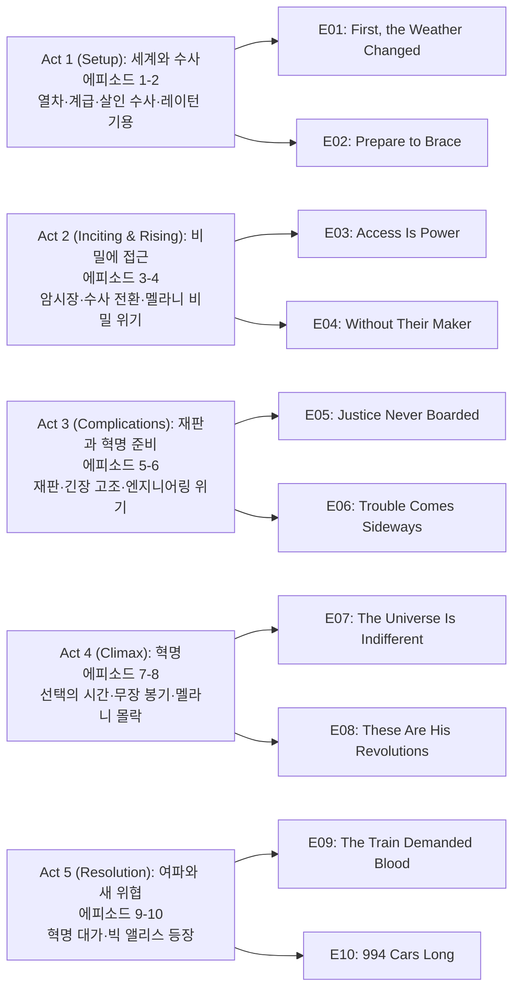

TNT의 `설국열차(Snowpiercer)` 시즌 1은 봉준호 영화(2013)와 동일한 프랑스 그래픽노블 『Le Transperceneige』를 원작으로, 빙하기가 된 지구를 영원히 달리는 1001칸 열차 안의 계급 사회와 혁명을 그린 디스토피아 스릴러다. 꼬리칸의 유일한 살인 수사관 앙드레 레이턴(Daveed Diggs)이 살인 사건 수사를 빌미로 혁명 정보를 수집하고, 호텔리티 책임자 멜라니 캐빌(Jennifer Connelly)이 윌포드 선장의 비밀을 지키며 열차를 운영하는 이중 서사가 한 시즌 안에 격돌한다. 시즌 말 빅 앨리스(Big Alice)의 등장과 멜라니의 정체 폭로는 시즌 2로 이어지는 강렬한 클리프행어를 만든다.

## 시즌 개요

### 시리즈 정보

* **제목**: Snowpiercer / 설국열차
* **시즌**: 시즌 1 (총 10 에피소드)
* **쇼러너**: 그레이엄 맨슨 (Graeme Manson), 조시 프리드먼 (Josh Friedman, 파일럿)
* **감독**: 제임스 호스, 샘 밀러, 헬렌 셰이버, 제임스 호스 등 (에피소드별 상이)
* **주연**: 데이빗 디그스(앙드레 레이턴), 제니퍼 코넬리(멜라니 캐빌), 앨리슨 라이트(루스), 미키 섬너(베스 틸), 수잔 박(진주), 이도 골드버그(베넷), 케이티 맥기니스(조시), 셰일라 밴드(자라)
* **음악**: 벤자민 벨퍼드, 닉 케이브 & 워렌 엘리스(테마)
* **장르**: SF, 스릴러, 미스터리, 드라마, 디스토피아
* **에피소드 러닝타임**: 평균 45–66분
* **방영 기간**: 2020.05.17 - 2020.07.12
* **방영 채널/플랫폼**: TNT (미국), 넷플릭스(국제 스트리밍)
* **제작사**: Tomorrow Studios, Marty Adelstein, CJ Entertainment, Studio T
* **원작**: Jacques Lob, Jean-Marc Rochette — Le Transperceneige (그래픽노블); 봉준호 영화 Snowpiercer (2013)와 동일 세계관 확장
* **평점**: 로튼 토마토 시즌1 약 70%대, IMDb 7.0/10

### 시즌 주제

시즌 1의 축은 **계급 불평등과 질서 유지의 정당성**이다. 1등급·3등급·꼬리칸(수용 구역)으로 나뉜 열차는 자원과 접근 권한으로 계급을 재현하고, “윌포드 선장”의 이름으로 유지되는 질서는 실제로는 멜라니의 엔지니어링과 희생 위에 서 있다. 레이턴은 살인 수사를 통해 앞칸의 구조와 비밀을 파악하고 꼬리칸 혁명을 이끌며, “정의”와 “안정” 사이에서 둘 다 피로 물드는 선택을 하게 된다. 시즌 말 “994 Cars Long”과 빅 앨리스의 등장은 열차 사회의 경계가 열차 밖(다른 열차, 외부 세계)까지 넓어짐을 보여 주며, 권력과 생존의 게임이 새 국면으로 들어감을 암시한다.

### 추천 대상

* **디스토피아·계급 서사 선호자**: 열차 = 사회 알레고리, 꼬리칸 vs 1등급 구도가 명확하게 드러난다.
* **살인 미스터리 + 정치 스릴러 선호자**: 한 건의 연쇄 살인 수사가 열차 전체의 권력 구조와 혁명으로 확장된다.
* **원작·영화 설국열차 팬**: TV판은 열차 내부 세계와 캐릭터를 확장해 미스터리와 권력 다툼에 비중을 둔다.

## 구조 분석 (Act-first 보조 도식)

## 에피소드 가이드

| 회차 | 제목 | 방영일 | 한 줄 요약 |
|------|------|--------|-----------|
| E01 | "First, the Weather Changed" | 2020.05.17 | 살인 사건으로 꼬리칸 수사관 레이턴이 기용되고 열차 계급 구조가 제시된다 |
| E02 | "Prepare to Brace" | 2020.05.24 | 레이턴은 수사와 혁명 정보 수집을 병행하고, 멜라니는 자원 위기를 맞는다 |
| E03 | "Access Is Power" | 2020.05.31 | 레이턴과 틸이 암시장을 탐색하고, 멜라니는 격투 시합으로 긴장을 분산시킨다 |
| E04 | "Without Their Maker" | 2020.06.07 | 살인 수사가 전환되며 레이턴은 멜라니의 큰 비밀에 가까워진다 |
| E05 | "Justice Never Boarded" | 2020.06.14 | 설국열차 살인범 재판이 열리고 3등급과 1등급 간 긴장이 폭발한다 |
| E06 | "Trouble Comes Sideways" | 2020.06.21 | 레이턴은 동지들과 혁명 준비를 하고, 엔지니어링 비상사태가 열차 전체를 위협한다 |
| E07 | "The Universe Is Indifferent" | 2020.06.28 | 멜라니가 레이턴 수색을 강화하고, 레이턴은 그 비밀을 무기화하며 3등급에 선택을 강요한다 |
| E08 | "These Are His Revolutions" | 2020.07.05 | 레이턴이 하층 계급을 이끌고 무장 봉기를 일으키고 멜라니의 권위가 무너진다 |
| E09 | "The Train Demanded Blood" | 2020.07.12 | 반란군이 밀리며 위험한 동맹이 생기고, 열차를 장악하려는 계획이 모두를 위험에 빠뜨린다 |
| E10 | "994 Cars Long" | 2020.07.12 | 혁명 직후 레이턴과 멜라니가 생존자들을 이끌지만, 가장 큰 위협이 열차 밖에서 다가온다 |

## 시즌의 전체 내용 (스포일러 포함)

시즌 1은 “빙하기 이후 인류의 마지막 보루”인 설국열차 안에서, 한 건의 잔인한 살인이 계급 갈등의 도화선이 되고, 꼬리칸의 레이턴이 그 수사를 빌미로 혁명을 준비하며 앞칸의 비밀—멜라니가 윌포드 선장을 사칭하며 열차를 운영해 왔다는 것—에 접근하는 구조다. 수사와 혁명이 겹치면서 레이턴은 동료(조시 등)의 죽음과 자신의 “정의” 사이에서 냉정한 선택을 하고, 시즌 말에는 멜라니의 정체가 탄로나고 빅 앨리스가 설국열차에 결합하며 “진짜 윌포드”의 귀환이 예고된다. 이미 시청한 독자가 나중에 내용을 떠올리기 위한 상세 정리이다.

### Act 1 (Setup): 세계와 수사 — [E01–E02]

열차의 계급 구조(1등급·3등급·꼬리칸), “윌포드 선장”에 대한 맹신, 그리고 연쇄 살인 사건이 한꺼번에 소개된다. 멜라니는 유일한 살인 수사관인 꼬리칸의 레이턴을 “선장의 명령”으로 기용하고, 레이턴은 수사권을 이용해 앞칸 지형과 정보를 파악하며 혁명의 기반을 닦는다.

#### [E01] "First, the Weather Changed" — 상세 장면 분석

**[E01-S01] 서론: 빙하기와 설국열차**: 레이턴의 내레이션으로 기후 재앙 이후 인류가 설국열차에 갇혀 7년째 살아가고, 1001칸이 계급별로 나뉘어 있다는 세계관이 제시된다. 1등급은 호화, 3등급은 노동, 꼬리칸은 “무단 탑승” 수용 구역으로 묘사된다.

**[E01-S02] 살인과 레이턴 기용**: 열차 안에서 잔인한 살인이 발생하고, 호텔리티 책임자 멜라니 캐빌이 “선장님의 지시”를 내세워 꼬리칸의 반란 지도자이자 유일한 살인 수사관인 앙드레 레이턴을 수사에 기용한다. 레이턴은 조건(꼬리칸 완화 등)을 걸고 수사를 수락하며, 동시에 앞칸 구조를 파악할 기회로 활용한다.

**[E01-S03] 앞칸과 꼬리칸의 대비**: 레이턴이 1등급·3등급 구역을 통과하며 접근 권한, 음식, 공간의 격차가 시각적으로 강조된다. 루스(호텔리티)와 브레이크맨·치안의 역할이 소개되고, “윌포드 선장”은 목소리와 이름으로만 존재하는 절대자로 그려진다.

#### [E02] "Prepare to Brace" — 요약

레이턴은 수사관 자격으로 열차를 이동하며 살인 단서를 추적하는 동시에 혁명을 위한 정보(통로, 브레이크맨, 자원 배치)를 수집한다. 멜라니는 자원 부족과 배급 문제로 열차 전체에 영향을 줄 결정을 앞두고, 레이턴과의 협력과 대립이 동시에 깊어진다.

### Act 2 (Inciting & Rising): 비밀에 접근 — [E03–E04]

수사가 암시장과 다양한 계급을 가로지르며 전개되고, 레이턴은 살인범의 정체와 “제작자 없이” 돌아가는 시스템에 대한 의심에 도달한다. 동시에 멜라니가 “윌포드”와 동일시되는 장면들이 늘어나 그녀의 비밀이 위협받기 시작한다.

#### [E04] "Without Their Maker" — 미드포인트

**[E04-S01] 수사의 전환**: 살인 수사가 추적과 대결 단계로 넘어가고, 레이턴과 틸은 범인에 가까워진다. 수사 과정에서 “선장”이나 “제작자”가 실제로 열차를 통제하는지에 대한 의문이 구체화된다.

**[E04-S02] 멜라니 비밀 접근**: 레이턴이 엔진 구역이나 통제 구조에 더 가까이 다가가면서, 멜라니가 “윌포드”의 목소리와 결정을 대신하고 있음을 암시하는 단서가 쌓인다. 멜라니의 비밀이 드러나면 질서가 무너질 수 있다는 위기가 Act 2의 미드포인트를 이룬다.

### Act 3 (Complications): 재판과 혁명 준비 — [E05–E06]

재판 에피소드에서 계급 갈등이 공개적으로 폭발하고, 레이턴은 꼬리칸과 3등급 동지들과 함께 혁명 계획을 구체화한다. 동시에 열차의 기술적 위기(엔진·궤도 문제)가 모든 사람의 생존을 위협하며, 멜라니만이 그 위기를 막을 수 있는 위치에 있음이 드러난다.

#### [E05] "Justice Never Boarded" — 재판과 계급

**[E05-S01] 재판과 1·3등급 갈등**: 설국열차 살인범에 대한 재판이 열리고, 1등급과 3등급의 이해가 충돌한다. 멜라니는 “질서”와 “선장의 의지”를 내세워 한쪽을 선택해야 하는 상황에 놓이고, 레이턴은 이 과정을 혁명 담론과 연동해 활용한다.

#### [E06] "Trouble Comes Sideways" — 엔지니어링 위기

**[E06-S01] 혁명 준비**: 레이턴은 숨으면서 동지들(틸, 조시 등)과 무장·진격 경로를 준비한다. 꼬리칸과 3등급의 연대가 구체적인 행동 단계로 넘어간다.

**[E06-S02] 엔지니어링 비상**: 열차에 기술적 비상사태가 발생해 모든 칸의 생존이 위협받는다. 멜라니가 직접 엔진/시스템을 다루며 위기를 막는 장면에서, 그녀가 “진짜” 운영자임이 시청자에게 더욱 분명해진다.

### Act 4 (Climax): 혁명 — [E07–E08]

레이턴은 멜라니의 비밀(윌포드 사칭)을 무기로 사용하고, 3등급에게 “선택”을 강요한다. 무장 봉기가 일어나 하층 계급이 앞칸으로 진격하고, 멜라니의 권위와 “선장” 신화는 무너진다. (클라이맥스)

#### [E08] "These Are His Revolutions" — 클라이맥스

**[E08-S01] 봉기**: 레이턴이 이끄는 반란군이 무장하고 설국열차 앞쪽으로 진격한다. 브레이크맨·치안과의 충돌, 1등급 구역 점령이 연출된다.

**[E08-S02] 멜라니의 몰락**: “윌포드 선장”이 실은 멜라니였다는 사실이 열차 안에 알려지고, 그녀의 정치적 권위는 붕괴한다. 혁명의 첫 목표인 “선장/호텔리티 권력 제거”가 달성되는 대신, 질서 공백과 보복 공포가 생긴다.

### Act 5 (Resolution): 여파와 새 위협 — [E09–E10]

혁명의 대가(동료 희생, 레이턴의 냉정한 결정)가 그려지고, 열차를 완전히 장악하려는 시도가 새로운 위험(칸 분리, 내부 반격)을 낳는다. 시즌 피날레에서 설국열차에 빅 앨리스가 결합하고, “진짜 윌포드”의 귀환과 멜라니의 딸 알렉산드라가 등장하며 시즌 2로 이어질 위기가 제시된다.

#### [E09] "The Train Demanded Blood" — 혁명의 대가

**[E09-S01] 역습과 동맹**: 반란군이 일시적으로 밀리거나 내부 반격에 직면한다. 위기 속에서 예전 적이었던 세력과의 위험한 동맹이 제안되고, 열차 전체를 장악하려는 계획이 “열차를 파괴할 수도 있는” 리스크와 함께 나온다.

**[E09-S02] 희생과 선택**: 레이턴이 열차의 일부 칸을 분리해 적을 차단하는 등 냉정한 결정을 내리며, 그 과정에서 동료(조시 등)가 희생된다. “열차가 피를 요구했다”는 제목이 혁명의 대가를 상징한다.

#### [E10] "994 Cars Long" — 피날레

**[E10-S01] 혁명 직후**: 레이턴이 설국열차의 새로운 지도자로 자리 잡지만, 생존자들의 충격과 불신, 자라의 임신 등 개인적·정치적 과제가 남는다. 멜라니는 자신의 과거(딸을 남겨둔 것)와 화해하려 하지만, 곧 더 큰 위협이 다가온다.

**[E10-S02] 빅 앨리스와 윌포드**: 설국열차에 다른 열차 “빅 앨리스”가 결합하고, 멜라니는 “윌포드 선장이 돌아왔다”고 선언한다. 빅 앨리스 측에서 멜라니의 딸 알렉산드라로 소개된 청년이 등장하며, 설국열차 측에 항복을 요구한다. 시즌 1은 “진짜 윌포드”의 귀환과 2대 열차의 대립이라는 클리프행어로 끝난다.

## 캐릭터 분석

### 앙드레 레이턴 / Andre Layton (데이빗 디그스)

**개요**: 꼬리칸에 갇힌 전직 살인 수사관이자 반란의 중심 인물. 멜라니에 의해 “선장의 명령”으로 살인 수사에 기용되며 앞칸에 접근하고, 수사를 빌미로 혁명 정보를 모아 무장 봉기를 이끈다.

**성장 곡선**: 시즌 초반에는 “꼬리칸의 정의”를 외치며 수사관 역할과 혁명가 역할을 병행한다. 재판과 엔지니어링 위기를 거치며 “질서를 지키는 쪽”(멜라니)과 “질서를 뒤엎는 쪽”(자신)의 모호함을 경험하고, E08–E09에서 칸을 분리하는 등 냉정한 선택을 하며 동료를 잃는다. 시즌 말에는 지도자로서의 책임과 개인적 비극(조시의 죽음, 자라의 임신)을 동시에 짊어진다.

**동기와 욕망**: 꼬리칸과 하층 계급의 해방, “정의”가 통치 원리인 사회. 하지만 혁명 과정에서 “안정”을 위해 희생을 강요하는 입장에 서게 되며, 멜라니에 대한 이해가 조금씩 늘어난다.

**갈등 구조**: 외적으로는 1등급·호텔리티·브레이크맨과의 대립, 내적으로는 “정의로운 혁명”과 “냉정한 통치자” 사이의 갈등. 조시를 지키지 못한 죄책과 자라와의 과거·임신이 관계적 갈등을 만든다.

**상징적 의미**: 계급 사회 안에서 “아래”의 목소리를 대변하는 저항자이자, 권력을 잡은 뒤에는 “위”와 비슷한 어려운 선택을 하게 되는 리더의 전형이다.

### 멜라니 캐빌 / Melanie Cavill (제니퍼 코넬리)

**개요**: 호텔리티 책임자이자 실제로는 “윌포드 선장”을 사칭하며 설국열차의 운영과 기술적 결정을 책임지는 인물. 엔지니어이자 정치적 중심이다.

**성장 곡선**: 시즌 내내 “선장님의 지시”를 앞세워 질서를 유지하지만, 레이턴의 수사와 혁명으로 비밀이 탄로난다. 재판과 엔지니어링 위기에서 그녀만이 열차를 구할 수 있음이 드러나고, 봉기 후에는 권위를 잃고 “적”에서 “생존을 위한 협력자”에 가까운 위치로 밀린다. 시즌 말 그녀의 과거(딸 알렉산드라를 남긴 것)가 드러나고, 빅 앨리스와 “윌포드”의 귀환이 그녀의 이야기를 시즌 2로 넘긴다.

**동기와 욕망**: 열차와 인류 잔존의 “안정”. 윌포드 신화를 유지해 내란을 막고, 한편으로는 딸에 대한 그리움과 죄책을 품고 있다.

**갈등 구조**: “거짓 선장”으로서의 질서 유지 vs 진실이 드러났을 때의 붕괴, 그리고 개인적 트라우마(딸)와 공적 역할의 충돌.

**상징적 의미**: “제작자 없이” 돌아가는 시스템을 유지해 온 엔지니어이자, 독재자 신화를 연기한 희생자에 가까운 인물로, 권력과 도덕성의 경계를 보여 준다.

### 루스 / Ruth (앨리슨 라이트)

**개요**: 호텔리티 소속으로 “선장님”과 질서에 충성하는 관료. 1등급과 선장 신화를 옹호하며 꼬리칸을 “무단 탑승자”로 규정한다.

**성장 곡선**: 시즌 내내 멜라니/윌포드 체제의 충실한 실행자로, 재판과 봉기 과정에서 “위에서 내려온 규율”을 고수한다. 혁명 후에는 권력이 바뀐 상황에 적응해야 하는 위치에 서며, 시즌 1에서는 완전한 전환보다는 충격과 저항이 강조된다.

**동기와 욕망**: 질서, 계급, “선장님”에 대한 신뢰. 혼란보다는 규칙에 따른 안정을 선호한다.

**갈등 구조**: 레이턴과 꼬리칸에 대한 적대 vs 나중에 바뀐 권력 구조와의 공존 가능성.

**상징적 의미**: 체제를 믿고 그 체제를 유지하는 “관리자” 계층의 대표로, 혁명 서사에서 “변하지 않는 충성”의 얼굴이다.

## 드라마에 숨겨진 내용 분석

### 서브텍스트·암시

- “선장님의 목소리”와 멜라니의 목소리가 동일하다는 연출은 초반부터 은근히 반복되어, 시청자로 하여금 “윌포드 = 멜라니”를 추론하게 한다.
- 레이턴이 “정의”를 말할수록 나중에는 멜라니와 비슷한 “희생을 강요하는” 선택을 하게 되는 대비가, 권력과 정의의 모호함을 암시한다.
- W와 M 문양(윌포드/멜라니)의 시각적 유희는 일부 에피소드에서 문이나 소품을 통해 암시되며, 정체성과 권위의 이중성을 보여 준다.

### 상징·소품·배경

- **열차와 칸**: 열차 = 닫힌 사회, 칸의 순서 = 계급. 앞으로 나아가는 “진격”은 사회 이동·혁명의 은유다.
- **음식·배급**: 1등급의 호화 식사와 꼬리칸의 단백질 블록(원작·영화에서의 극단적 대비)은 자원 격차와 신체 통제를 상징한다.
- **빅 앨리스**: “다른 열차”의 등장은 설국열차 사회의 경계가 “밖”으로 열림을 의미하고, 윌포드의 귀환은 “원래 주인”과 “가짜 주인”의 대립을 시즌 2로 넘긴다.

### 복선·회수

- 멜라니가 엔진실에서 직접 시스템을 조작하는 장면들은 “진짜 운영자” 복선이고, E08에서 “윌포드 = 멜라니”로 회수된다.
- 레이턴의 “우리는 정의를 위해 싸운다”는 말은 E09–E10에서 “칸 분리”와 동료 희생으로 인해 스스로에게 의문이 되는 선택으로 회수된다.
- 멜라니의 딸(알렉산드라)에 대한 암시나 회상은 E10 빅 앨리스와의 연결로 회수된다.

### 이스터에그·오마주

- 원작 그래픽노블과 봉준호 영화의 “열차 = 계급 사회” 알레고리를 TV판이 미스터리·정치 스릴러로 재해석한다.
- “994 Cars Long” 제목은 열차 길이(칸 수)를 직접 언급해, 혁명 후에도 “열차” 자체가 유일한 세계임을 강조한다.

### 제작진 의도·해석

- 쇼러너 그레이엄 맨슨은 원작/영화의 세계관을 확장하면서 “살인 미스터리”와 “권력 다툼”을 앞세워 TV만의 서사를 만들었다고 밝힌 바 있다. “윌포드 부재”와 멜라니의 이중 역할은 TV 시리즈의 핵심 설정이다.

## 종합 평가

### 최종 평점: ★★★★☆ (4.0/5.0)

**장점**:
- 살인 수사와 계급 혁명을 한 시즌 안에 잘 엮은 구조
- 데이빗 디그스와 제니퍼 코넬리의 대비되는 캐릭터 연기
- “윌포드 = 멜라니” 반전과 빅 앨리스 등장으로 이어지는 클리프행어
- 원작·영화와 다른 “미스터리·정치” 중심의 TV만의 톤
- 열차 내부 세트와 계급별 공간 연출로 세계관이 분명히 전달됨

**단점**:
- 10화 분량에 수사·혁명·캐릭터가 모두 들어가 일부 전개가 다소 빠르게 느껴질 수 있음
- 1등급·3등급 내부의 세부 캐릭터는 시즌 1에서 제한적으로만 다뤄짐
- 영화 설국열차의 극단적 폭력·상징주의에 비해 TV판은 상대적으로 완화된 폭력과 서사적 설명에 치중

### 한 줄 평

"꼬리칸 수사관의 살인 수사가 혁명으로 번지고, ‘선장’의 비밀이 열차를 뒤흔든 뒤, 빅 앨리스가 등장해 설국열차 시즌 1을 강하게 마무리한다."

### 추천 작품

- 《설국열차》(2013, 봉준호): 동일 원작의 영화. 열차 = 계급 알레고리와 폭력적 이미지가 더 극단적으로 그려진다.
- 《디 오아 (The OA)》(2016–2019): 닫힌 공간과 신비·권력 구조를 다루는 넷플릭스 SF 드라마.
- 《웨스트월드 (Westworld)》(2016–): 계급·의식·반란을 다루는 SF 스릴러로, “질서 vs 혁명” 테마에서 설국열차와 겹치는 면이 있다.

### 시청 전 체크리스트

- 사전 지식이 필요한가? **선택**: 영화나 원작을 보면 세계관 이해에 도움이 되지만, TV판만으로도 시청 가능하다.
- 어린이와 함께 볼 수 있는가? **15세 이상 권장**: 폭력·살인·정치적 억압 묘사가 있어 청소년 이상을 권한다.
- 몰아보기 vs 천천히? **몰아보기 추천**: 10화가 한 번에 수사→혁명→반전으로 이어져 연속 시청이 흐름에 유리하다.
- 특정 요소를 기대해도 되는가? **미스터리 + 계급 스릴러**: 액션보다는 수사와 권력 다툼, 캐릭터 관계에 비중이 있다.
- 다음 시즌 예정은? **시즌 2–4 제작·방영됨**: 빅 앨리스와 윌포드, 멜라니·알렉산드라 관계가 이어진다.

## 결론

`설국열차` 시즌 1은 “살인 수사”와 “꼬리칸 혁명”을 한 줄기에 묶어, 열차라는 닫힌 사회에서 계급과 권력이 어떻게 유지되고 뒤집히는지 보여 준다. 레이턴의 성장(저항자에서 냉정한 지도자로)과 멜라니의 비밀(윌포드 사칭)이 시즌의 축을 이루고, 빅 앨리스와 “진짜 윌포드”의 등장은 시즌 2 이후의 권력 재편을 예고한다. 원작·영화의 알레고리를 유지하면서도 TV만의 미스터리·정치 스릴러로 재구성한 작품으로, 디스토피아와 계급 서사를 좋아하는 시청자에게 추천한다.

## 참고 문헌 및 출처

- [Snowpiercer (TV series) — Wikipedia](https://en.wikipedia.org/wiki/Snowpiercer_(TV_series))
- [Snowpiercer — IMDb](https://www.imdb.com/title/tt6156584/)
- [Snowpiercer Season 1 — Rotten Tomatoes](https://www.rottentomatoes.com/tv/snowpiercer/s01)
- [Snowpiercer — Episode Guide — TVmaze](https://www.tvmaze.com/shows/23030/snowpiercer/episodeguide)
- [Snowpiercer Season 1 Recap and Ending Explained — The Cinemaholic](https://thecinemaholic.com/snowpiercer-season-1-recap-and-ending-explained/)
- [Snowpiercer Season 1 — Snowpiercer Wiki — Fandom](https://snowpiercer.fandom.com/wiki/Season_1)
- [Snowpiercer (TV) — Episodes — IMDb](https://www.imdb.com/title/tt6156584/episodes?season=1)
- [Le Transperceneige — Wikipedia](https://en.wikipedia.org/wiki/Le_Transperceneige)
- [Snowpiercer (2013 film) — Wikipedia](https://en.wikipedia.org/wiki/Snowpiercer)
- [Class Warfare on a Train: Analysing the Socioeconomic Allegory in ‘Snowpiercer’ — Indigo Music](https://indigomusic.com/feature/class-warfare-on-a-train-analysing-the-socioeconomic-allegory-in-snowpiercer)
- [The Portrayal of Class Conflict and Inequality in Snowpiercer — Medium](https://medium.com/@lufimhr/a-the-portrayal-of-class-conflict-and-inequality-as-a-reflection-of-societys-life-in-the-film-47247bdbc389)
- [Snowpiercer — Plex Episode List](https://watch.plex.tv/show/snowpiercer/season/1/episode/1)
