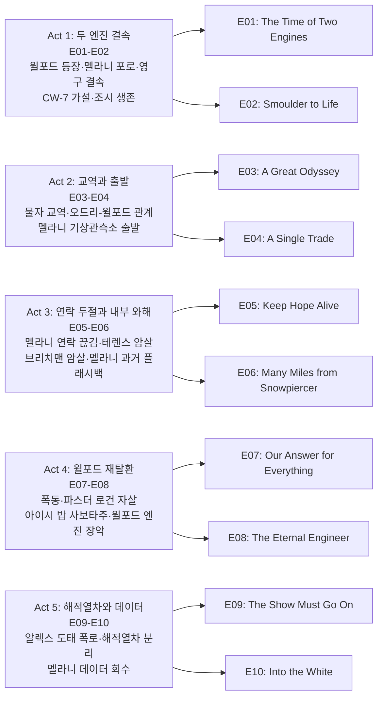

시즌 1 피날레에서 빅 앨리스가 설국열차에 결속되며 등장한 미스터 윌포드(션 빈)와, 혁명 후 설국열차를 이끄는 레이턴(데이비드 디그스)의 대립이 시즌 2의 중심이다. 멜라니 캐빌(제니퍼 코넬리)은 지구 온난화 가능성을 확인하기 위해 단독으로 브레슬라우 기상관측소로 향하고, 그 사이 열차 안에서는 윌포드의 선동·배신·테러가 이어지며 권력이 넘쳐흐른다.

## 시즌 개요

### 시리즈 정보
* **제목**: Snowpiercer / 설국열차
* **시즌**: 시즌 2 (총 10 에피소드)
* **쇼러너**: Graeme Manson (그레이엄 맨슨)
* **감독**: Christoph Schrewe, David Frazee, Leslie Hope, Rebecca Rodriguez, Clare Kilner 등
* **주연**: Jennifer Connelly (멜라니 캐빌), Daveed Diggs (앤드레 레이턴), Sean Bean (조지프 윌포드), Rowan Blanchard (알렉산드라 캐빌), Mickey Sumner (베스 틸), Alison Wright (루스 워델), Iddo Goldberg (베넷 녹스)
* **음악**: Bear McCreary, Bobby Krlic
* **장르**: 클라이메이트 픽션, 드라마, 디스토피아, 포스트 아포칼립스, 스릴러
* **에피소드 러닝타임**: 약 44–51분
* **방영 기간**: 2021.01.25 – 2021.03.29
* **방영 채널/플랫폼**: TNT (이후 Netflix, AMC+ 스트리밍)
* **제작사**: CJ Entertainment, Tomorrow Studios, Studio T 등
* **평점**: Rotten Tomatoes 시즌2 비평 다수, IMDb Snowpiercer 시리즈 7.0/10대

### 시즌 주제
시즌 2는 「두 엔진의 시대」—설국열차와 빅 앨리스가 영구 결속된 상태에서 자원·정보·심리전을 둔 권력 다툼을 그린다. 멜라니의 CW-7 분해·지구 재온난화 가설과 브레슬라우 기상관측소 미션은 "열차 밖 세계로 돌아갈 희망"이라는 서사 축을 만들고, 윌포드는 신격화·공포·배신을 통해 설국열차 내부를 장악해 나간다. 레이턴·루스·알렉스의 저항, 해적열차(10량) 분리, 멜라니 데이터 회수와 그녀의 행방 불명으로 시즌이 마무리되며 시즌 3의 「해적열차 vs 윌포드 열차」 구도로 이어진다.

### 추천 대상
* **시즌 1 시청자**: 빅 앨리스·윌포드·알렉스 등장과 멜라니 과거(열차 탈취)가 연결되는 만족도
* **디스토피아·권력 스릴러 선호자**: 계급·선동·배신이 얽힌 정치극과 클라이맥스
* **기후·SF 드라마 선호자**: CW-7·기상관측소·재온난화 데이터가 주는 희망과 비극

## 구조 분석 (Act-first 보조 도식)

## 시즌의 전체 내용 (스포일러 포함)

이미 시즌 2를 시청한 독자가 나중에 줄거리와 권력 구도를 빠르게 복기할 수 있도록, 공식 에피소드 전개를 기준으로 핵심 사건을 Act 5 구조로 정리한다. 시즌 2는 빅 앨리스의 강제 결속으로 시작해 멜라니의 기후 관측 미션, 윌포드의 정치적·물리적 열차 탈환, 그리고 10량 해적열차의 분리와 멜라니 데이터 회수로 이어지는 하나의 큰 권력 서사다.

### Act 1 (Setup): 두 엔진 결속 — [E01–E02]

#### [E01] "The Time of Two Engines" — 상세 장면 분석

**[E01-S01] 업링크 파괴와 동력 위기**: 멜라니는 빅 앨리스가 설국열차 시스템에 접속한 업링크를 끊어낸다. 동시에 바깥에서 눈이 내리는 것을 발견하는데, 이론상 대기 온도가 너무 낮아 눈이 내릴 수 없는 환경이므로 대기 화학이 변하고 있다는 최초의 단서가 된다. 그러나 설국열차는 동력 부족으로 자력 재가동이 불가능한 상태에 빠지고, 레이턴은 질서 유지를 위해 계엄령을 선포한 뒤 빅 앨리스에 물자를 넘기는 협상에 나선다.

**[E01-S02] 멜라니 포로와 모녀 재회**: 멜라니는 빅 앨리스에 끌려가 7년 만에 윌포드, 그리고 딸 알렉산드라와 재회한다. 윌포드는 항복을 요구하지만 멜라니는 거부한다. 한편 케빈은 심문 과정에서 "윌포드는 다른 모두가 죽더라도 모든 것을 다시 작동시킬 수 있다"고 주장하며, 윌포드의 자기중심적 생존 논리를 암시한다.

**[E01-S03] 빅 앨리스 침투 실패와 영구 결속**: 레이턴은 빅 앨리스 침투를 시도하지만 격퇴당하고, 대신 케빈을 인질로 확보한다. 윌포드는 연결을 끊어 설국열차 승객을 동사시키려 결정하고, 알렉스가 망설이면서도 이에 따른다. 그러나 멜라니가 미리 연결 장치에 설치해 둔 폭발물이 터지면서 분리 메커니즘이 파괴되고, 두 열차는 물리적으로 영구 결속된다. 윌포드는 어쩔 수 없이 열차를 재가동시킨다.

#### [E02] "Smoulder to Life" — 상세 장면 분석

**[E02-S01] 케빈 교환과 심리전**: 케빈 심문을 통해 빅 앨리스의 인원(약 100명)과 만성적 식량 부족이 드러난다. 멜라니-케빈 포로 교환이 성사되지만, 복귀한 케빈은 비밀을 누설한 대가로 윌포드의 심리적 압박을 받아 자살한다. 이 장면은 윌포드가 "충성과 공포"를 통해 부하를 지배하는 방식을 처음으로 보여 주며, 에피소드 말미에 우울·자살 관련 도움 안내 타이틀이 삽입된다.

**[E02-S02] 라이트스 테러와 틸 투입**: 라이트스(신비주의 집단)가 공격당하고 두 손가락이 절단되는 사건이 벌어지는데, 이 절단 패턴은 윌포드의 3손가락 경례를 모방한 정치적 테러임을 암시한다. 틸은 열차 탐정(Train Detective)으로 승진해 수사에 투입된다.

**[E02-S03] CW-7 가설과 기상 풍선**: 멜라니는 대기 중 냉각 물질 CW-7이 분해되기 시작했다는 가설을 제시하고, 기상 풍선으로 이를 검증하기 시작한다. 윌포드와의 과학 회담이 열리고, 알렉스는 레이턴 암살을 시도하지만 실행 직전에 중단한다. 멜라니는 가설 검증을 위해 브레슬라우 기상관측소로의 단독 미션을 수립한다.

**[E02-S04] 조시 생존 확인**: 자라가 시즌 1에서 죽은 줄 알았던 조시가 심각한 동상 상태로 살아 있음을 발견하고, 레이턴에게 알린다. 레이턴은 즉시 조시에게로 달려간다. 조시의 생존은 시즌 후반 그녀의 냉기 저항 능력과 해적열차 분리 작전의 핵심 복선이 된다.

### Act 2 (Inciting & Rising): 교역과 출발 — [E03–E04]

#### [E03] "A Great Odyssey" — 요약

레이턴은 식량 대 수리물자 교역을 제안하며 베넷과 운영 동맹을 구축한다. 틸과 로쉬는 라이트스 사건 배후로 브리치맨(윌포드에 충성하는 외부 작업자)을 좁혀 가고, 오드리는 심리적 균열의 초기 징후(알코올 의존)를 보인다. 조시는 레이턴의 아이와 멜라니의 기후 계획이 희망을 대표한다는 것을 인식하고 레이턴 지지를 결심한다. 파이크는 거래 중단에 반발하지만, 레이턴이 감독 하에 재개를 허용한다. 위험한 선로 구간을 통과하는 동안 멜라니와 알렉스는 유대를 형성하고, 눈물의 작별 끝에 멜라니가 기상관측소를 향해 열차를 떠난다.

#### [E04] "A Single Trade" — 요약

윌포드는 동상 환자 치료를 미끼로 설국열차 내부 영향력을 넓힌다. 조시의 동상이 심각해 빅 앨리스 헤드우드 부부의 전용 치료가 필요해지고, 이 치료 과정에서 조시에게 아이시 밥과 유사한 냉기 저항이 발현하기 시작한다. 틸은 정신적 부담 속에 보얀 보스코비치를 의심해 폭행하지만, 보얀은 무고함을 주장한다. 오드리와 윌포드의 과거 관계(윌포드를 지배하는 사도마조히스트적 역학)가 드러나고, 자라는 레이턴-루스 관계 개선을 위해 호스피탈리티에 합류한다. 알렉스와 LJ가 친교를 맺고, 최후의 호주인과 알렉스의 친구 에밀리아(역시 호주인)가 유대를 형성한다. 첫 번째 기상 풍선이 발사되고 멜라니와 연락이 성사되어 그녀의 생존이 재확인된다.

### Act 3 (Complications): 연락 두절과 내부 와해 — [E05–E06]

#### [E05] "Keep Hope Alive" — 요약

멜라니와의 최신 기상 풍선 통신이 실패하지만, 승무원은 사기 유지를 위해 이를 비밀로 한다. 윌포드는 오드리를 빅 앨리스로 초대하고, 오드리는 윌포드의 통신을 염탐하려 하지만 실패한다. 조시는 파이크의 밀거래 네트워크를 통해 레이턴에게 메시지를 보내고, 아이시 밥은 이를 알면서도 묵인하며 조시에게 헤드우드를 믿지 말라고 경고한다. 틸은 방향을 잃고 파스터 로건과 스파링을 하는데, 로건은 레이턴의 통치가 무너지고 있으며 새 지도자가 필요하다고 부추긴다. 테렌스가 조시의 안전을 위협하자, 레이턴은 마지못해 파이크에게 테렌스 암살을 지시한다. 조시는 윌포드가 브리치맨을 이용해 무언가를 계획 중이라고 레이턴에게 경고하고, 직후 보얀을 제외한 브리치맨 전원이 변장한 인물들에게 암살당한다. 윌포드는 국경 봉쇄와 함께 오드리와 루스에게 빅 앨리스 합류를 제안하고, 오드리는 수락하지만 루스는 거부한다.

#### [E06] "Many Miles from Snowpiercer" — 미드포인트 상세 분석

**[E06-S01] 플래시백 — 열차 탈취의 진실**: 대동결이 시작되던 시점으로 거슬러 올라간다. 멜라니와 윌포드는 누구를 구할지를 놓고 격렬히 대립한다. 윌포드가 잭부츠에게 명령해 탑승하려는 무고한 사람들을 사살하자, 멜라니는 마지막 순간 설국열차를 탈취해 윌포드를 남겨 두고 출발한다. 이 플래시백은 멜라니가 시즌 1에서 '윌포드 행세'를 하게 된 근본적 원인을 드러내며, 그녀의 죄책감과 윌포드의 잔혹함을 동시에 부각한다.

**[E06-S02] 기상관측소 — 고독과 발견**: 현재 시점에서 멜라니는 브레슬라우 기상관측소에 도착하지만, 물자가 눈사태로 전멸한 상태다. 완전한 고립 속에서 윌포드·레이턴·알렉스의 환각을 경험하며, 7년 전 기지에 머물다 식인까지 했던 과학자 세 명의 시신을 발견한다. 동시에 지열 분출구 덕분에 7년간 살아남은 쥐 떼를 확인하고, "극한에서도 지열 같은 예외적 조건이 생명을 유지한다"는 결정적 단서를 얻는다.

**[E06-S03] 재접선 실패 — 멜라니 고립**: 안테나가 거의 추락해 데이터 손실 위기를 겪고, 예정된 열차 접선에도 연락이 닿지 않는다. 마침내 설국열차와 빅 앨리스가 기상관측소를 지나가지만, 빅 앨리스 하부에서 화재가 발생하고 알렉스의 고함과 알람이 울리는 가운데 열차는 멈추지 못한다. 멜라니는 재탑승하지 못하고 선로 위에 홀로 남겨진다. 시즌 전반부와 후반부를 가르는 미드포인트로, 이후 멜라니는 완전한 고립 상태에서 데이터 수집을 이어간다.

### Act 4 (Climax): 윌포드 재탈환 — [E07–E08]

#### [E07] "Our Answer for Everything" — 요약

알렉스는 충성심 분열을 이유로 윌포드에게 배제당한다. 윌포드는 오드리를 동원해 자살 직전이던 케빈을 치료하되, 완전히 세뇌된 윌포드 추종자로 만든다. 브리치맨 암살 여파로 폭동이 확산되고 테일리들이 공격받는다. 루스는 위니를 숨기다가, 자신이 구질서에서 수잔느의 죽음에 기여했음을 직면한다. 레이턴이 자기 팔을 동결시키겠다고 제안하자, 루스는 같은 실수를 반복하지 말라고 군중에게 호소하며 레이턴을 공개적으로 옹호한다. 브레이크맨이 폭도를 진압하고, 틸은 오즈의 도움으로 브리치맨 살해범이 퍼스트 클래스 승객 유게니아임을 추적한 뒤 배후가 파스터 로건임을 밝혀낸다. 로건은 대면 시 자살한다. 에피소드 말미, 다층 교량을 통과하는 동안 승객들이 설국열차 곳곳에서 등불을 밝히며 윌포드를 부르고, 윌포드는 사이크스에게 아이시 밥 투입 준비를 지시한다.

#### [E08] "The Eternal Engineer" — 클라이맥스 상세 분석

**[E08-S01] 아이시 밥 사보타주와 대가**: LJ와 오즈는 청소부 일을 하며 연인 관계로 발전하고, 조시는 아이시 밥과 유사한 냉기 저항력을 보이며 회복 중이다. 윌포드는 아이시 밥에게 설국열차의 눈 흡입 시스템을 파괴하라고 지시한다. 아이시 밥은 임무를 수행하지만 그 결과로 사망한다. 보얀이 문제를 수리하고, 윌포드가 브리치맨을 배신했음을 깨달은 뒤 레이턴 편으로 전향한다.

**[E08-S02] 윌포드의 엔진 장악**: 사보타주로 메인 컴퓨터가 손상되자, 레이턴은 불가피하게 윌포드를 엔진에 들여보내 수리를 맡긴다. 레이턴은 윌포드의 존재를 열차 나머지에 숨기려 하지만, 수리 도중 멜라니가 남긴 시스템 변경 때문에 합병증이 발생한다. 윌포드는 엔진을 수동으로 재시동시키며 "영원한 엔지니어" 신화를 재현하고, 이 과정에서 자신의 존재가 열차 전체에 노출된다.

**[E08-S03] 레이턴 항복과 권력 이전**: 윌포드가 엔진을 성공적으로 장악한 가운데, 레이턴은 신호탄으로 테일에 상황이 악화되었음을 알린 뒤 항복한다. 레이턴은 빅 앨리스로 이송되고, 로쉬 가족은 빅 앨리스의 드로어에 수면 동결된다. 윌포드는 설국열차 엔진에 복귀하며 실권을 완전히 탈환한다. 이 에피소드는 시즌 2의 클라이맥스로, 시즌 전반부 내내 천천히 잠식해 온 윌포드의 전략이 최종적으로 결실을 맺는 순간이다.

### Act 5 (Resolution): 해적열차와 데이터 — [E09–E10]

#### [E09] "The Show Must Go On" — 상세 장면 분석

**[E09-S01] 윌포드 체제 확립**: 윌포드가 설국열차를 완전히 장악한다. 레이턴은 빅 앨리스의 퇴비장에서 강제 노동에 투입되고, 하비는 빅 앨리스 엔진에서 감시하에 일하며, 베넷은 설국열차에서 감시받는다. 윌포드는 카니발을 열어 축제 분위기를 연출하면서 동시에 가치 있는 인재를 솎아내기 시작한다. 틸에게는 브리치맨 살해범을 직접 처형하는 역할을 맡겨 도덕적 자문역으로 회유하려 하고, 헤드우드 부부에게는 조시의 냉기 저항 능력을 시험하도록 지시한다.

**[E09-S02] 알렉스의 폭로**: 윌포드에게 환멸을 느낀 알렉스가 결정적 사실을 밝힌다 — 윌포드는 과거 빅 앨리스의 자원을 절감하기 위해 승무원 절반을 의도적으로 희생시켰으며, 설국열차에서도 동일한 방식의 인원 도태를 계획 중이다. 이 폭로는 알렉스의 윌포드 이탈을 확정하는 동시에, 레이턴 진영에게 반격의 정당성과 긴급성을 부여한다.

**[E09-S03] 멜라니 신호와 반격 준비**: 윌포드는 멜라니 회수를 위해 되돌아가길 거부하고, 루스는 이를 계기로 윌포드와 완전히 결별해 퇴비장으로 보내진다. 하비는 멜라니의 전송 신호를 포착하지만 윌포드에게 숨기고, 비밀리에 레이턴과 루스에게 전달한다. 레이턴과 루스는 탈출과 반격 계획을 세우기 시작한다.

#### [E10] "Into the White" — 시즌 피날레 상세 분석

**[E10-S01] 엔진 탈환 시도와 좌절**: 레이턴과 루스는 알렉스의 협력으로 탈출에 성공하고 엔진 탈환을 시도한다. 베넷이 사이크스를 제압하지만, LJ가 윌포드에게 밀고하면서 작전에 차질이 생긴다. 하비는 윌포드의 개 주피터에게 습격당하고, 윌포드는 멜라니를 회수하기 위한 열차 정지를 막는다.

**[E10-S02] 해적열차 분리**: 알렉스가 수족관 칸을 기점으로 10량을 분리해 해적열차를 구성하는 계획을 제안한다. 자라는 남기로 결정하고, 레이턴은 대신 오드리를 인질로 데려간다. 보얀의 분리 시도가 잭부츠에게 저지되자, 조시가 외부로 나가 칸을 파괴하며 분리를 성사시킨다. 해적열차에는 레이턴·베넷·틸·조시·알렉스, 그리고 포로인 오드리와 사이크스가 탑승한다. 루스는 케빈에게 지체당해 본열차에 남겨진다.

**[E10-S03] 기상관측소 도착과 멜라니의 유산**: 레이턴과 알렉스는 브레슬라우 기상관측소에 도착하지만, 멜라니는 보이지 않는다. 멜라니가 수집한 기후 데이터는 온전히 보존되어 있으며, 지구 여러 지역의 온난화 추세를 확인시켜 준다. 멜라니의 마지막 메시지가 공개된다 — 자원이 바닥나자 더 이상 버틸 수 없음을 깨닫고, 데이터를 남기고 동결 세계로 걸어 들어가 죽음을 택했다는 내용이다. 시즌은 윌포드가 장악한 본열차와 레이턴이 이끄는 해적열차, 그리고 "일부 지역이 따뜻해지고 있다"는 데이터가 열어 놓은 희망의 이중 구도로 종결된다.

## 에피소드 가이드

| 회차 | 제목 | 방영일 | 한 줄 요약 |
|------|------|--------|-----------|
| E01 | "The Time of Two Engines" | 2021.01.25 | 윌포드 요구·멜라니 업링크 파괴·영구 결속·케빈 인질 |
| E02 | "Smoulder to Life" | 2021.02.01 | 케빈–멜라니 교환·테러 수사·CW-7 가설·조시 생존 확인 |
| E03 | "A Great Odyssey" | 2021.02.08 | 교역·베넷 동맹·브리치맨 의심·멜라니–알렉스 이별 |
| E04 | "A Single Trade" | 2021.02.15 | 윌포드 파티·조시 빅 앨리스 치료·오드리–윌포드 관계·멜라니 연락 성공 |
| E05 | "Keep Hope Alive" | 2021.02.22 | 멜라니 연락 두절 비밀·테렌스 암살·브리치맨 암살·오드리 빅 앨리스 행 |
| E06 | "Many Miles from Snowpiercer" | 2021.03.01 | 멜라니 과거 플래시백·연구 시설 도착·환각·열차가 멜라니 지나침 |
| E07 | "Our Answer for Everything" | 2021.03.08 | 폭동·루스 레이턴 옹호·파스터 로건 자살·등불 윌포드 경배 |
| E08 | "The Eternal Engineer" | 2021.03.15 | 아이시 밥 사보타주·보얀 전향·윌포드 엔진 수동 재시동·레이턴 항복 |
| E09 | "The Show Must Go On" | 2021.03.29 | 윌포드 카니발·알렉스 도태 폭로·하비 멜라니 신호 비밀 전달 |
| E10 | "Into the White" | 2021.03.29 | 연구 시설 도착·멜라니 부재·데이터·일기·지구 온난화 희망 |

## 캐릭터 분석

### 멜라니 캐빌 / 설국열차 엔진 담당 (제니퍼 코넬리)

**개요**: 시즌 1에서 "윌포드 대역"으로 설국열차를 운영해 온 인물. 시즌 2에서는 빅 앨리스에 포로로 있다가 교환된 뒤, CW-7 분해와 지구 재온난화를 확인하기 위해 브레슬라우 기상관측소에 단독 투입된다.

**성장 곡선**: 윌포드·알렉스와의 대면, 알렉스와의 이별, 연구 시설에서의 고립·환각·데이터 수집까지 "희망의 과학"을 짊어지고, 마지막에는 자원 고갈로 구조 불가를 판단하고 동결 세계로 걸어 들어간 것으로 그려진다. 시체가 없어 시즌 3에서 생존 여부가 반전 요소로 사용된다.

**동기와 욕망**: 인류가 열차 밖에서 다시 살 수 있는 증거를 찾는 것, 딸 알렉스가 윌포드의 조종에서 벗어나 믿을 만한 공동체에 속하는 것.

**갈등 구조**: 윌포드와의 과거(열차 탈취·알렉스 남김), 알렉스의 원망과 점진적 화해, 연구 시설에서의 고독과 한계.

**상징적 의미**: "열차 밖 세계"로의 귀환 가능성을 상징하는 과학자·엔지니어. 그녀의 데이터는 시즌 3 이후 뉴 에덴 서사의 씨앗이 된다.

### 조지프 윌포드 / 빅 앨리스 창조자 (션 빈)

**개요**: 설국열차와 빅 앨리스를 설계한 억만장자. 7년간 빅 앨리스에서 살아남았고, 시즌 1 피날레에서 설국열차에 결속한다. 시즌 2에서 정치·테러·세뇌·엔진 수리 등을 통해 설국열차를 다시 손에 넣는다.

**성장 곡선**: 협상·인질 교환·브리치맨 암살 배후·파스터 로건·오드리·케빈 세뇌·아이시 밥 설비 파괴·엔진 수동 재시동으로 "영원한 엔지니어" 신화를 재현하고, 시즌 말 권력의 정점에 선다. 알렉스의 배신과 해적열차 분리로 일부 권한은 잃지만 1,023량의 "왕국"은 유지한다.

**동기와 욕망**: 설국열차와 인류의 절대 통제, 멜라니에 대한 복수, 자신을 신처럼 숭배하는 질서.

**갈등 구조**: 레이턴·멜라니·알렉스·루스·오드리 등과의 충성·배신 게임. 자원 한계 속에서 "도태"를 정당화하는 냉정함.

**상징적 의미**: 디스토피아적 카리스마 독재자. "두 엔진의 시대"에서 한 축을 이루는 권력의 화신.

### 앤드레 레이턴 / 설국열차 민주 지도자 (데이비드 디그스)

**개요**: 시즌 1 혁명 후 설국열차의 공식 지도자. 시즌 2에서는 윌포드와의 협상·계엄·수사·동맹 유지에 고군분투하다, 윌포드의 엔진 탈환 후 포로가 되었다가 탈출해 해적열차를 이끈다.

**성장 곡선**: "민주적" 통치와 실질적 계엄 사이의 긴장, 베넷·루스·틸·조시·알렉스와의 동맹, 테렌스 암살 지시·보키 구원·멜라니 구출 실패를 거쳐 "10량 해적열차"의 리더로 재정립된다.

**동기와 욕망**: 설국열차의 공정한 질서 유지, 멜라니과 그 데이터로 대표되는 "열차 밖 희망"의 보존.

**갈등 구조**: 윌포드의 선동·테러·엔진 장악과의 대결, 루스에 대한 불신과 이후 그녀의 전향, 자라와 아이를 남기고 해적열차에 오른 선택.

**상징적 의미**: 혁명 후 "새 질서"를 대표하지만, 윌포드라는 적 앞에서는 전략적 결단(인질·폭력·분리)을 감수해야 하는 지도자.

### 알렉산드라(알렉스) 캐빌 / 빅 앨리스 엔지니어 (로완 블랜차드)

**개요**: 멜라니의 딸로, 7년간 빅 앨리스에서 윌포드에게 길러졌다. 시즌 2 초반에는 윌포드 충성으로 레이턴 암살을 맡지만 실행하지 않고, 점차 어머니와의 유대와 윌포드의 잔혹함(인원 도태)을 인식한다.

**성장 곡선**: 암살 거부→멜라니 이별→윌포드에게 배제·감금→레이턴·루스 탈출 시 엔진 쪽에서 협력→해적열차 합류→연구 시설에서 멜라니 데이터와 일기를 발견. "윌포드의 딸"에서 "멜라니의 딸"이자 저항군 일원으로 이동한다.

**동기와 욕망**: 어머니에 대한 이해와 화해, 윌포드 조종에서의 해방, 설국열차/해적열차 쪽 "믿을 사람들"과의 연대.

**상징적 의미**: 두 열차·두 부모(멜라니 vs 윌포드) 사이에서 정체성과 충성을 갈라놓는 세대. 시즌 2 피날레의 희망(데이터)은 그녀와 레이턴이 함께 가져간다.

## 드라마에 숨겨진 내용 분석

### 서브텍스트·암시
* "눈" 샘플(E01): 이론적으로는 너무 추워서 눈이 내리지 않아야 하는데 눈이 내린다는 것은 대기 화학(CW-7 분해)이 이미 변하고 있음을 암시하며, 멜라니의 기후 가설과 연결된다.
* 오드리–윌포드 관계: 지배/피지배가 역전된 사도마조히스트 관계는 윌포드가 "복종"을 통해 충성을 얻는 방식을 보여 주며, 케빈 세뇌·오드리 전향과 맞닿아 있다.
* "Keep Hope Alive": 멜라니 연락 두절을 숨기는 제목 그대로 "희망"을 유지하는 거짓말이 서사를 이끌고, 나중에 윌포드가 "멜라니 포기"를 선언할 때 루스가 거절하는 동기가 된다.

### 상징·소품·배경
* 두 엔진(설국열차 + 빅 앨리스): 하나의 "인류 방주"가 두 권력(레이턴 vs 윌포드)으로 쪼개진 구조. 영구 결속은 공생이자 영원한 갈등 상태다.
* 브레슬라우 기상관측소: 과거 연구원들의 식인·자살·쥐의 생존은 "극한 환경에서의 윤리 붕괴"와 "지열 같은 예외적 조건에서의 생명"을 동시에 보여 주며, 멜라니의 고독과 데이터의 가치를 부각한다.
* 등불(E06): 승객들이 들고 "윌포드"를 부르는 장면은 윌포드 숭배가 대중 선동으로 어떻게 작동하는지 시각화한다.

### 복선·회수
* 멜라니이 업링크를 폭파해 영구 결속시킨 선택(E01)은 "윌포드가 설국열차를 버리고 떠날 수 없게" 만든다. 대신 윌포드는 열차 안에서 권력을 되찾는 길을 택한다.
* 조시의 동상 치료와 헤드우드 실험은 "냉기 저항" 능력을 만들어 해적열차 분리(E09–E10) 때 수족관 칸 파괴를 가능하게 한다.
* 하비가 멜라니 신호를 숨기고 레이턴·루스에게 넘긴 일(E08)이 탈출·해적열차·연구 시설 도착으로 이어진다.

### 이스터에그·오마주
* 원작 만화 《Le Transperceneige》와 봉준호 영화 《설국열차》의 "열차 = 계급 사회" 메타포를 유지하면서, TV판은 "두 열차""기후 데이터""해적열차" 등으로 서사를 확장한다.
* "Eternal Engineer"는 윌포드가 자신을 "영원한 엔지니어"로 신격화하는 설국열차 신화를 다시 수행하는 에피소드 제목과 맞닿아 있다.

### 제작진 의도·해석
* 쇼러너 Graeme Manson은 오펀 블랙 등 SF 경험을 바탕으로 계급 전쟁·트라우마·저항을 인간 감정과 과학 로직에 묶어 넣었다는 인터뷰가 있다. 시즌 2의 "정치적 암투 + 멜라니 미션" 이중 구조는 권력 게임과 희망(기후 데이터)을 동시에 전면에 둔 선택으로 읽을 수 있다.

## 종합 평가

### 최종 평점: ★★★★☆ (4.0/5.0)

**장점**:
* 윌포드(션 빈)와 레이턴·멜라니·알렉스·루스의 권력·심리전이 타이트하게 엮여 있어 한 편 몰입감이 크다.
* 브레슬라우 기상관측소 미션과 CW-7·지구 온난화 데이터는 "열차 밖 세계"에 대한 희망을 주며 시즌 3·4로 이어지는 서사 씨앗이 된다.
* 해적열차 분리·멜라니 일기·데이터 회수로 끝나는 피날레는 비극(멜라니 행방 불명)과 희망(데이터)을 동시에 남겨 여운이 길다.

**단점**:
* 중간 에피소드(테러 수사·브리치맨 암살·폭동)가 다소 반복적으로 느껴질 수 있다.
* 10화 안에 인물·파벌이 많아 시즌 1을 보지 않으면 관계 파악이 부담될 수 있다.

### 한 줄 평

"두 엔진이 영원히 묶인 열차 위에서 벌어지는 윌포드 vs 레이턴의 권력 게임과, 멜라니의 기후 데이터가 남긴 희망이 해적열차로 이어지는 한 시즌."

### 추천 작품

* 《Snowpiercer》(시즌 1, 2020): 빅 앨리스·윌포드·알렉스 등장 배경과 멜라니 비밀을 이해하는 데 필수.
* 《Snowpiercer》(봉준호 영화, 2013): 원작 세계관과 계급 알레고리의 영화판 해석.
* 《The 100》(2014–2020): 포스트 아포칼립스·파벌 갈등·생존 정치를 좋아한다면 비슷한 맛으로 볼 만함.

### 시청 전 체크리스트

* 사전 지식이 필요한가? **시즌 1 시청 필수.** 빅 앨리스·윌포드·알렉스·멜라니 과거가 모두 시즌 1에 뿌리 내림.
* 어린이와 함께 볼 수 있는가? **제한적.** 폭력·세뇌·자살·암살·동상 등 장면이 있어 연령에 맞는 판단 필요.
* 몰아보기 vs 천천히? **몰아보기 추천.** 권력 전환과 반전이 연속되므로 2–3화 단위로 보면 흐름 파악에 유리.
* 특정 요소를 기대해도 되는가? **권력 스릴러·기후 SF·캐릭터 관계(멜라니–알렉스, 레이턴–루스–윌포드)** 를 기대하면 만족도 높음.
* 다음 시즌 예정은? **시즌 3(2022)** 에서 해적열차 vs 윌포드 열차, 멜라니 생존 여부, 뉴 에덴으로 이어짐. 시즌 4(2024)에서 시리즈 종영.

## 결론

설국열차 시즌 2는 "두 엔진의 시대"를 표제처럼 빅 앨리스와 설국열차가 영구 결속된 상태에서, 윌포드의 복귀와 권력 탈환, 멜라니의 기후 연구와 고독한 미션, 레이턴·루스·알렉스의 저항과 해적열차 분리까지를 담는다. 스포일러를 포함한 위 정리는 이미 시청한 독자가 나중에 줄거리·캐릭터·숨겨진 층을 다시 찾아보는 데 쓸 수 있도록 구성했다. 시즌 3·4로 이어지는 "뉴 에덴"과 "지구 복원" 서사는 이 시즌에서 회수한 멜라니의 데이터와 그녀의 희생(또는 생존)에 크게 의존한다.

## 참고 문헌 및 출처

- [Snowpiercer (TV series) — Wikipedia](https://en.wikipedia.org/wiki/Snowpiercer_(TV_series))
- [Season 2 — Snowpiercer Fandom Wiki](https://snowpiercer.fandom.com/wiki/Season_2)
- [Snowpiercer Season 2 Episode 1: The Time of Two Engines Recap — Metawitches](https://metawitches.com/2021/01/28/snowpiercer-season-2-episode-1-the-time-of-two-engines-recap/)
- [Snowpiercer Season 2 Episode 6: Many Miles from Snowpiercer Recap — Metawitches](https://metawitches.com/2021/03/14/snowpiercer-season-2-episode-6-many-miles-from-snowpiercer-recap/)
- [Snowpiercer Season 2 Finale Recap and Analysis — Post Apocalyptic Media](https://www.postapocalypticmedia.com/snowpiercer-season-2-finale-recap-and-analysis-episodes-9-and-10/)
- [The Ending Of Snowpiercer Season 2 Explained — Looper](https://www.looper.com/406131/the-ending-of-snowpiercer-season-2-explained/)
- [Snowpiercer Season 2 Ending: Melanie, Javi — The Cinemaholic](https://thecinemaholic.com/snowpiercer-season-2-finale/)
- [Snowpiercer's BRUTAL Season 2 Finale, Explained — CBR](https://www.cbr.com/snowpiercer-season-2-finale-explained/)
- [Breslauer Weather Station — Snowpiercer Fandom](https://snowpiercer.fandom.com/wiki/Breslauer_Weather_Station)
- [Snowpiercer season 2 snow sample meaning — Screen Rant](https://screenrant.com/snowpiercer-season-2-melanie-snow-sample-meaning/)
- [Snowpiercer Boss Breaks Down Big Alice and Finale — Yahoo Entertainment](https://www.yahoo.com/entertainment/snowpiercer-boss-breaks-down-big-030035365.html)
- [TNT Taps Graeme Manson as Showrunner — Warner Bros. Pressroom](https://press.wbd.com/us/media-release/tbs-0/tnt-taps-critically-acclaimed-writer-graeme-manson-showrunner-post-apocalyptic-sci-fi)
- [Snowpiercer Boss on Trauma, Resistance — Variety](https://variety.com/2020/tv/features/snowpiercer-graeme-manson-tnt-adaptation-climate-change-revolution-murder-mystery-interview-1234588786/)
- [Snowpiercer Season 2 Cast Character Guide — Screen Rant](https://screenrant.com/snowpiercer-season-2-cast-character-guide/)
- [Into the White — Snowpiercer Fandom](https://snowpiercer.fandom.com/wiki/Into_the_White)
