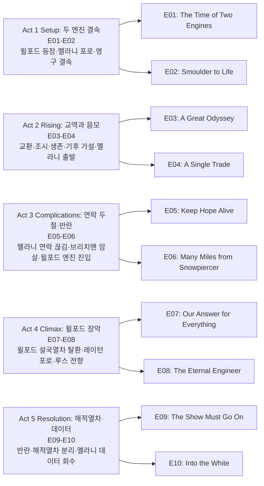

시즌 1 피날레에서 빅 앨리스가 설국열차에 결속되며 등장한 미스터 윌포드(션 빈)와, 혁명 후 설국열차를 이끄는 레이턴(데이비드 디그스)의 대립이 시즌 2의 중심이다. 멜라니 캐빌(제니퍼 코넬리)은 지구 온난화 가능성을 확인하기 위해 단독으로 브레슬라우 기상관측소로 향하고, 그 사이 열차 안에서는 윌포드의 선동·배신·테러가 이어지며 권력이 넘쳐흐른다.

## 시즌 개요

### 시리즈 정보
* **제목**: Snowpiercer / 설국열차
* **시즌**: 시즌 2 (총 10 에피소드)
* **쇼러너**: Graeme Manson (그레이엄 맨슨)
* **감독**: Christoph Schrewe, David Frazee, Leslie Hope, Rebecca Rodriguez, Clare Kilner 등
* **주연**: Jennifer Connelly (멜라니 캐빌), Daveed Diggs (앤드레 레이턴), Sean Bean (조지프 윌포드), Rowan Blanchard (알렉산드라 캐빌), Mickey Sumner (베스 틸), Alison Wright (루스 워델), Iddo Goldberg (베넷 녹스)
* **음악**: Bear McCreary, Bobby Krlic
* **장르**: 클라이메이트 픽션, 드라마, 디스토피아, 포스트 아포칼립스, 스릴러
* **에피소드 러닝타임**: 약 44–51분
* **방영 기간**: 2021.01.25 – 2021.03.29
* **방영 채널/플랫폼**: TNT (이후 Netflix, AMC+ 스트리밍)
* **제작사**: CJ Entertainment, Tomorrow Studios, Studio T 등
* **평점**: Rotten Tomatoes 시즌2 비평 다수, IMDb Snowpiercer 시리즈 7.0/10대

### 시즌 주제
시즌 2는 「두 엔진의 시대」—설국열차와 빅 앨리스가 영구 결속된 상태에서 자원·정보·심리전을 둔 권력 다툼을 그린다. 멜라니의 CW-7 분해·지구 재온난화 가설과 브레슬라우 기상관측소 미션은 “열차 밖 세계로 돌아갈 희망”이라는 서사 축을 만들고, 윌포드는 신격화·공포·배신을 통해 설국열차 내부를 장악해 나간다. 레이턴·루스·알렉스의 저항, 해적열차(10량) 분리, 멜라니 데이터 회수와 그녀의 행방 불명으로 시즌이 마무리되며 시즌 3의 「해적열차 vs 윌포드 열차」 구도로 이어진다.

### 추천 대상
* **시즌 1 시청자**: 빅 앨리스·윌포드·알렉스 등장과 멜라니 과거(열차 탈취)가 연결되는 만족도
* **디스토피아·권력 스릴러 선호자**: 계급·선동·배신이 얽힌 정치극과 클라이맥스
* **기후·SF 드라마 선호자**: CW-7·기상관측소·재온난화 데이터가 주는 희망과 비극

## 구조 분석 (Act 5)

## 시즌의 전체 내용 (스포일러 포함)

이미 시즌 2를 모두 시청한 독자가 나중에 내용을 떠올리기 위한 상세 정리이다. 시즌 1 피날레에서 빅 앨리스가 설국열차를 멈춘 채 결속한 뒤, 시즌 2는 윌포드와의 협상·영구 결속·멜라니의 기상관측소 미션·윌포드의 설국열차 탈환·레이턴 일행의 해적열차 분리와 멜라니 데이터 회수까지를 다룬다.

### Act 1 (Setup): 두 엔진 결속 — [E01–E02]

#### [E01] "The Time of Two Engines" — 상세 장면 분석

**[E01-S01] 설국열차 정지와 윌포드 요구**: 시즌 1 마지막에서 빅 앨리스가 설국열차를 잡아 세운 채로 있다. 윌포드는 식량·모르핀·소설·위스키 등을 요구하며 거부 시 열차를 영원히 멈추겠다고 위협한다. 레이턴은 계엄을 선포하고 물자를 모으며, 루스는 모르핀 대신 아스피린을 넣어 건넨다.

**[E01-S02] 멜라니의 업링크 파괴와 빅 앨리스 탑승**: 멜라니는 베넷·하비의 도움으로 두 열차 간 업링크를 폭파해 영구 결속시킨다. 동시에 “눈” 샘플을 채취하는데, 베넷은 이 온도에서는 눈이 내릴 수 없다며 이상함을 짚는다. 멜라니는 동상에 걸린 채 빅 앨리스에 올라타고, 윌포드와 딸 알렉산드라(알렉스)와 대면한다. 윌포드는 설국열차 항복을 요구하지만 멜라니는 거부한다.

**[E01-S03] 레이턴의 빅 앨리스 침공과 결말**: 레이턴이 이끄는 침공대는 빅 앨리스에서 격퇴되지만, 케빈(빅 앨리스 호스피탈리티)을 인질로 잡는다. 케빈은 “윌포드는 모두 죽어도 자기만 살아남을 수 있다”고 말한다. 윌포드는 설국열차와의 연결을 끊고 설국열차를 얼어죽게 하려 하나, 알렉스가 잠시 망설인 뒤 실행에 옮긴다. 이미 멜라니가 연결 장치에 폭탄을 설치해 두어 파괴되었기 때문에 두 열차는 영구 결속된 채로만 움직일 수 있고, 윌포드는 설국열차를 구하기 위해 엔진을 다시 가동할 수밖에 없다. 알렉스는 어머니의 작전에 감탄한 듯한 반응을 보인다.

#### [E02] "Smoulder to Life" — 요약

케빈 심문으로 빅 앨리스 인원·식량 부족이 드러나고, 윌포드는 케빈과 멜라니를 교환한다. 이후 윌포드는 케빈에게 “비밀 누설”에 대한 충성 의식을 강요한 뒤 그가 자살하게 만든다. 라이트스가 습격당해 손가락이 잘리고, 틸이 열차 탐정으로 승진해 수사한다. 잘린 손가락 수가 윌포드의 “세 손가락 경례”와 맞춰진 테러임이 드러난다. 멜라니는 CW-7(지구를 얼린 화합물)이 대기에서 분해되어 지구가 예상보다 빨리 따뜻해지고 있다고 주장하며, 기상 풍선을 띄워 데이터를 확인한다. 윌포드·레이턴·멜라니의 “과학 서미트”가 열리고, 윌포드는 알렉스에게 레이턴 암살을 지시하나 알렉스는 실행하지 않는다. 멜라니는 한 달간 단독으로 연구 시설에 머무는 미션을 제안하고, 2등급 클리닉에서 자라가 조시가 동상으로 중태이지만 살아 있음을 발견한다. 조시는 레이턴과의 재회와 멜라니의 “희망” 이야기를 듣고 레이턴 편을 들기로 한다.

### Act 2 (Inciting & Rising): 교역과 음모 — [E03–E04]

#### [E03] "A Great Odyssey" — 요약

식량과 수리 부품을 맞바꾸는 교역이 이루어지고, 레이턴은 멜라니 부재 중 베넷과 동맹해 열차를 지키기로 한다. 틸·로쉬는 라이트스 습격 사건을 추적해 브리치맨(윌포드 충성파)을 의심한다. 오드리 양은 불안과 알코올 의존 징후를 보이며, 윌포드와의 과거 관계가 암시된다. 위험 구간을 지나 연구 시설로 가는 경로가 정해지고, 멜라니와 알렉스는 눈물의 이별을 한다. 멜라니는 “넌 윌포드의 조종보다 낫고, 설국열차에는 믿을 사람들이 있다”고 알렉스에게 말한다.

#### [E04] "A Single Trade" — 요약

윌포드는 설국열차의 동상 환자 치료를 제안하고, 레이턴이 윌포드 일행을 설국열차에 초대한다. 조시의 동상이 심해 빅 앨리스의 헤드우드 부부에게 맡겨진다. 오드리는 윌포드와 사도마조히스트 관계였으며 그녀가 지배적이었음이 드러난다. 자라는 호스피탈리티에 합류해 레이턴과 루스 사이를 이어 주려 한다. 파티 중 알렉스와 LJ, 라스트 오스트레일리언과 에밀리아(알렉스 친구, 호주인)가 어울린다. 첫 기상 풍선이 발사되고 긴장 끝에 멜라니이 연구 시설에서 연락해 생존이 확인된다.

### Act 3 (Complications): 연락 두절과 반란 — [E05–E06]

#### [E05] "Keep Hope Alive" — 요약

열차가 U턴을 준비하는 동안 멜라니과의 연락이 끊긴다. 크루는 희망을 유지하기 위해 이 사실을 비밀로 한다. 윌포드는 오드리를 빅 앨리스로 초대하고, 오드리는 윌포드 통신 도청을 시도하나 실패한다. 헤드우드 부부에게 치료받는 조시는 파이크의 밀매 네트워크로 레이턴에게 메시지를 보내고, 아이시 밥이 이를 눈치채지만 숨겨 주며 “헤드우드는 믿지 마라”고 경고한다. 틸은 파스터 로건과 스파링하며, 로건은 “레이턴 통치는 무너지고 있다”고 말한다. 테렌스가 조시를 위협하자 레이턴은 파이크에게 테렌스를 암살하라 지시하고, 조시로부터 윌포드가 브리치맨과 무언가를 꾸민다는 정보를 받는다. 곧 브리치맨 대부분이 변장한 자들에게 암살당하고 보잔(보키)만 남는다. 윌포드는 오드리와 루스에게 빅 앨리스 합류를 제안하고, 국경이 봉쇄될 때 오드리는 받아들이고 루스는 거절한다.

#### [E06] "Many Miles from Snowpiercer" — 미드포인트

**플래시백**: 대동결이 심화되던 시절, 윌포드는 잭부츠에게 열차에 오르려는 민간인을 살해하게 하고, 멜라니는 설국열차를 훔쳐 윌포드를 남긴 채 출발하기로 결심한다.

**현재(연구 시설)**: 멜라니는 브레슬라우 기상관측소에 도착하지만 눈사태로 보급품 대부분을 잃는다. 홀로 윌포드·레이턴·알렉스의 환각을 겪고, 과거 연구원 세 명이 생존을 위해 식인을 했음을 발견하며 쥐들이 지열 배출구 덕분에 살아 있음을 확인한다. 안테나가 쓰러져 데이터를 잃을 뻔하지만 겨우 보존하고, 열차와의 연락 시도는 실패한다. 그녀가 궤도로 돌아왔을 때 설국열차와 빅 앨리스는 불꽃을 뿜으며 그녀를 지나쳐 가고, 알렉스가 그녀를 부르며 경보가 울리지만 열차는 멈추지 않아 멜라니는 궤도 옆에 남겨진다.

**설국열차**: 알렉스는 이중 충성 때문에 윌포드에게 배제당한다. 오드리는 트라우마에 시달리던 케빈을 “치료”해 완전히 세뇌된 윌포드 추종자로 만든다. 브리치맨 암살 이후 테일 주민에 대한 폭동이 일어나고, 루스는 숨는 위니와 함께 자신이 옛 질서 아래서 수잔의 죽음에 기여했음을 직면한다. 레이턴은 “내 팔을 얼려서라도 진정시키겠다”고 하지만 루스가 나서 “과거의 실수를 반복하지 말라”고 설득하고, 브레이크맨이 도착해 폭동은 멈추나 “나중에 복수하겠다”는 위협이 남는다. 틸과 오즈가 브리치맨 암살자 중 한 명(1등급 유제니아)을 추적하고, 파스터 로건이 배후임이 드러나자 로건은 자살한다. 다층 교량을 지나며 승객들이 등불을 들고 “윌포드”를 외치고, 윌포드는 사이크스에게 아이시 밥을 준비하라 지시한다.

### Act 4 (Climax): 윌포드 설국열차 탈환 — [E07–E08]

#### [E07] "Our Answer for Everything" — 요약

LJ와 오즈는 청소부로 일하며 연인 관계를 이어 간다. 조시는 회복하면서 아이시 밥처럼 극한 냉기에 견디는 능력을 보이기 시작하고, 윌포드는 아이시 밥에게 설국열차의 눈(수분) 흡입구를 파괴하라 지시한다. 아이시 밥은 그 과정에서 한계 이상의 냉기에 노출되어 사망한다. 보키가 설비를 수리하고 윌포드가 자신과 브리치맨을 배신했음을 확인한 뒤 레이턴 편으로 돌선다. 그러나 파괴로 설국열차 메인 컴퓨터에 문제가 생겨, 레이턴은 수리를 위해 윌포드를 엔진에 들여보내야 하고 이를 열차에 숨기려 한다. 윌포드는 수리 후 멜라니이 만든 엔진 구조 때문에 수동 재시동이 필요하다며 직접 조작하고, 그 과정에서 그가 엔진에 있음이 전 열차에 알려진다. 이후 레이턴이 테일에 “일이 잘못되었다”는 신호탄을 쏘고 항복하며 빅 앨리스로 끌려 가고, 로쉬(충성 흔들리던 인물)는 가족과 함께 빅 앨리스의 드로어에 넣어진다. 윌포드는 설국열차 엔진에 다시 앉아 열차를 장악한다.

#### [E08] "The Eternal Engineer" — 클라이맥스

윌포드가 설국열차를 장악한 뒤 레이턴은 빅 앨리스의 퇴비(컴포스트) 구역에서 강제 노동을 하고, 하비는 설국열차 엔진에서, 하비는 빅 앨리스 엔진에서 감시당하며 일한다. 윌포드는 열차에 카니발을 열고 “가치 있는 자”를 가리며, 틸을 자신의 “도덕 자문”으로 쓰려 한다. 브리치맨 암살자들을 직접 처형하고, 헤드우드 부부에게 조시의 신체 능력을 실험하게 한다. 알렉스는 윌포드가 빅 앨리스 인원의 절반을 자원 절약을 위해 죽였으며 설국열차에도 비슷한 “도태”를 할 계획임을 폭로하고, 그 후 배신자로 취급당해 감옥에 갇힌다. 멜라니 연락 두절을 안 윌포드는 그녀를 되찾으러 가지 않기로 하고, 이를 선언하라고 루스에게 호스피탈리티 수장 자리를 제안하나 루스는 거절하고 퇴비 구역으로 보내져 레이턴과 함께 일한다. 하비가 멜라니의 신호를 포착하고 윌포드에게 숨긴 뒤 레이턴·루스에게 전달하고, 셋은 탈출과 멜라니 구출을 모의한다.

### Act 5 (Resolution): 해적열차와 멜라니 데이터 — [E09–E10]

#### [E09] "The Show Must Go On" — 요약

레이턴과 루스가 탈출해 알렉스의 도움으로 엔진을 장악하고, 베넷이 사이크스를 제압한다. 그러나 LJ가 윌포드에게 밀고하고, 윌포드는 개 주피터로 하비를 물리게 해 제어권을 유지한 채 멜라니을 받으러 열차를 멈추지 않는다. 설국열차로 도망한 레이턴 일행은 알렉스 제안대로 수족관 칸에서 10량을 분리해 “해적열차”를 만들어 멜라니을 찾으러 가기로 한다. 자라는 아이를 위해 남기로 하고, 레이턴은 오드리를 인질로 데려가 자라의 안전을 담보로 삼는다. 보키가 분리 작업을 시도하다 잭부츠에 저지당하지만, 조시가 밖에서 수족관 칸을 파괴해 10량이 분리된다. 해적열차에는 레이턴·베넷·틸·조시·알렉스와 포로 오드리·사이크스가 타고, 루스는 케빈에게 지연되어 설국열차(윌포드 측)에 남는다.

#### [E10] "Into the White" — 시즌 피날레

레이턴과 알렉스는 연구 시설에 도착하지만 멜라니는 없다. 그녀가 마지막 전력으로 보존해 둔 데이터와 일기가 남아 있고, 일기에는 자원이 다 닳아 구조가 불가능하다고 판단한 그녀가 동결 세계 속으로 걸어 들어갔다고 적혀 있다. 시체는 발견되지 않아 생사는 불명으로 남는다. 데이터에는 북아프리카·중앙아메리카 등 일부 지역이 따뜻해지고 있다는 내용이 들어 있어, 열차 밖에서의 재정착 희망을 남긴다. 시즌 2는 윌포드가 1,023량의 설국열차+빅 앨리스를, 레이턴 일행이 10량 해적열차를 이끄는 구도로 끝난다.

## 에피소드 가이드

| 회차 | 제목 | 방영일 | 한 줄 요약 |
|------|------|--------|-----------|
| E01 | "The Time of Two Engines" | 2021.01.25 | 윌포드 요구·멜라니 업링크 파괴·영구 결속·케빈 인질 |
| E02 | "Smoulder to Life" | 2021.02.01 | 케빈–멜라니 교환·테러 수사·CW-7 가설·조시 생존 확인 |
| E03 | "A Great Odyssey" | 2021.02.08 | 교역·베넷 동맹·브리치맨 의심·멜라니–알렉스 이별 |
| E04 | "A Single Trade" | 2021.02.15 | 윌포드 파티·조시 빅 앨리스 치료·오드리–윌포드 관계·멜라니 연락 성공 |
| E05 | "Keep Hope Alive" | 2021.02.22 | 멜라니 연락 두절 비밀·테렌스 암살·브리치맨 암살·오드리 빅 앨리스 행 |
| E06 | "Many Miles from Snowpiercer" | 2021.03.01 | 멜라니 연구 시설·환각·열차가 멜라니 지나침·로건 자살·폭동 |
| E07 | "Our Answer for Everything" | 2021.03.08 | 아이시 밥 설비 파괴·보키 전향·윌포드 엔진 수리·레이턴 항복 |
| E08 | "The Eternal Engineer" | 2021.03.15 | 윌포드 카니발·알렉스 폭로·루스 거절·하비가 멜라니 신호 전달 |
| E09 | "The Show Must Go On" | 2021.03.29 | 엔진 탈환 실패·해적열차 10량 분리·루스 남음 |
| E10 | "Into the White" | 2021.03.29 | 연구 시설 도착·멜라니 부재·데이터·일기·지구 온난화 희망 |

## 캐릭터 분석

### 멜라니 캐빌 / 설국열차 엔진 담당 (제니퍼 코넬리)

**개요**: 시즌 1에서 “윌포드 대역”으로 설국열차를 운영해 온 인물. 시즌 2에서는 빅 앨리스에 포로로 있다가 교환된 뒤, CW-7 분해와 지구 재온난화를 확인하기 위해 브레슬라우 기상관측소에 단독 투입된다.

**성장 곡선**: 윌포드·알렉스와의 대면, 알렉스와의 이별, 연구 시설에서의 고립·환각·데이터 수집까지 “희망의 과학”을 짊어지고, 마지막에는 자원 고갈로 구조 불가를 판단하고 동결 세계로 걸어 들어간 것으로 그려진다. 시체가 없어 시즌 3에서 생존 여부가 반전 요소로 사용된다.

**동기와 욕망**: 인류가 열차 밖에서 다시 살 수 있는 증거를 찾는 것, 딸 알렉스가 윌포드의 조종에서 벗어나 믿을 만한 공동체에 속하는 것.

**갈등 구조**: 윌포드와의 과거(열차 탈취·알렉스 남김), 알렉스의 원망과 점진적 화해, 연구 시설에서의 고독과 한계.

**상징적 의미**: “열차 밖 세계”로의 귀환 가능성을 상징하는 과학자·엔지니어. 그녀의 데이터는 시즌 3 이후 뉴 에덴 서사의 씨앗이 된다.

### 조지프 윌포드 / 빅 앨리스 창조자 (션 빈)

**개요**: 설국열차와 빅 앨리스를 설계한 억만장자. 7년간 빅 앨리스에서 살아남았고, 시즌 1 피날레에서 설국열차에 결속한다. 시즌 2에서 정치·테러·세뇌·엔진 수리 등을 통해 설국열차를 다시 손에 넣는다.

**성장 곡선**: 협상·인질 교환·브리치맨 암살 배후·파스터 로건·오드리·케빈 세뇌·아이시 밥 설비 파괴·엔진 수동 재시동으로 “영원한 엔지니어” 신화를 재현하고, 시즌 말 권력의 정점에 선다. 알렉스의 배신과 해적열차 분리로 일부 권한은 잃지만 1,023량의 “왕국”은 유지한다.

**동기와 욕망**: 설국열차와 인류의 절대 통제, 멜라니에 대한 복수, 자신을 신처럼 숭배하는 질서.

**갈등 구조**: 레이턴·멜라니·알렉스·루스·오드리 등과의 충성·배신 게임. 자원 한계 속에서 “도태”를 정당화하는 냉정함.

**상징적 의미**: 디스토피아적 카리스마 독재자. “두 엔진의 시대”에서 한 축을 이루는 권력의 화신.

### 앤드레 레이턴 / 설국열차 민주 지도자 (데이비드 디그스)

**개요**: 시즌 1 혁명 후 설국열차의 공식 지도자. 시즌 2에서는 윌포드와의 협상·계엄·수사·동맹 유지에 고군분투하다, 윌포드의 엔진 탈환 후 포로가 되었다가 탈출해 해적열차를 이끈다.

**성장 곡선**: “민주적” 통치와 실질적 계엄 사이의 긴장, 베넷·루스·틸·조시·알렉스와의 동맹, 테렌스 암살 지시·보키 구원·멜라니 구출 실패를 거쳐 “10량 해적열차”의 리더로 재정립된다.

**동기와 욕망**: 설국열차의 공정한 질서 유지, 멜라니과 그 데이터로 대표되는 “열차 밖 희망”의 보존.

**갈등 구조**: 윌포드의 선동·테러·엔진 장악과의 대결, 루스에 대한 불신과 이후 그녀의 전향, 자라와 아이를 남기고 해적열차에 오른 선택.

**상징적 의미**: 혁명 후 “새 질서”를 대표하지만, 윌포드라는 적 앞에서는 전략적 결단(인질·폭력·분리)을 감수해야 하는 지도자.

### 알렉산드라(알렉스) 캐빌 / 빅 앨리스 엔지니어 (로완 블랜차드)

**개요**: 멜라니의 딸로, 7년간 빅 앨리스에서 윌포드에게 길러졌다. 시즌 2 초반에는 윌포드 충성으로 레이턴 암살을 맡지만 실행하지 않고, 점차 어머니와의 유대와 윌포드의 잔혹함(인원 도태)을 인식한다.

**성장 곡선**: 암살 거부→멜라니 이별→윌포드에게 배제·감금→레이턴·루스 탈출 시 엔진 쪽에서 협력→해적열차 합류→연구 시설에서 멜라니 데이터와 일기를 발견. “윌포드의 딸”에서 “멜라니의 딸”이자 저항군 일원으로 이동한다.

**동기와 욕망**: 어머니에 대한 이해와 화해, 윌포드 조종에서의 해방, 설국열차/해적열차 쪽 “믿을 사람들”과의 연대.

**상징적 의미**: 두 열차·두 부모(멜라니 vs 윌포드) 사이에서 정체성과 충성을 갈라놓는 세대. 시즌 2 피날레의 희망(데이터)은 그녀와 레이턴이 함께 가져간다.

## 드라마에 숨겨진 내용 분석

### 서브텍스트·암시
* “눈” 샘플(E01): 이론적으로는 너무 추워서 눈이 내리지 않아야 하는데 눈이 내린다는 것은 대기 화학(CW-7 분해)이 이미 변하고 있음을 암시하며, 멜라니의 기후 가설과 연결된다.
* 오드리–윌포드 관계: 지배/피지배가 역전된 사도마조히스트 관계는 윌포드가 “복종”을 통해 충성을 얻는 방식을 보여 주며, 케빈 세뇌·오드리 전향과 맞닿아 있다.
* “Keep Hope Alive”: 멜라니 연락 두절을 숨기는 제목 그대로 “희망”을 유지하는 거짓말이 서사를 이끌고, 나중에 윌포드가 “멜라니 포기”를 선언할 때 루스가 거절하는 동기가 된다.

### 상징·소품·배경
* 두 엔진(설국열차 + 빅 앨리스): 하나의 “인류 방주”가 두 권력(레이턴 vs 윌포드)으로 쪼개진 구조. 영구 결속은 공생이자 영원한 갈등 상태다.
* 브레슬라우 기상관측소: 과거 연구원들의 식인·자살·쥐의 생존은 “극한 환경에서의 윤리 붕괴”와 “지열 같은 예외적 조건에서의 생명”을 동시에 보여 주며, 멜라니의 고독과 데이터의 가치를 부각한다.
* 등불(E06): 승객들이 들고 “윌포드”를 부르는 장면은 윌포드 숭배가 대중 선동으로 어떻게 작동하는지 시각화한다.

### 복선·회수
* 멜라니이 업링크를 폭파해 영구 결속시킨 선택(E01)은 “윌포드가 설국열차를 버리고 떠날 수 없게” 만든다. 대신 윌포드는 열차 안에서 권력을 되찾는 길을 택한다.
* 조시의 동상 치료와 헤드우드 실험은 “냉기 저항” 능력을 만들어 해적열차 분리(E09–E10) 때 수족관 칸 파괴를 가능하게 한다.
* 하비가 멜라니 신호를 숨기고 레이턴·루스에게 넘긴 일(E08)이 탈출·해적열차·연구 시설 도착으로 이어진다.

### 이스터에그·오마주
* 원작 만화 《Le Transperceneige》와 봉준호 영화 《설국열차》의 “열차 = 계급 사회” 메타포를 유지하면서, TV판은 “두 열차”“기후 데이터”“해적열차” 등으로 서사를 확장한다.
* “Eternal Engineer”는 윌포드가 자신을 “영원한 엔지니어”로 신격화하는 설국열차 신화를 다시 수행하는 에피소드 제목과 맞닿아 있다.

### 제작진 의도·해석
* 쇼러너 Graeme Manson은 오펀 블랙 등 SF 경험을 바탕으로 계급 전쟁·트라우마·저항을 인간 감정과 과학 로직에 묶어 넣었다는 인터뷰가 있다. 시즌 2의 “정치적 암투 + 멜라니 미션” 이중 구조는 권력 게임과 희망(기후 데이터)을 동시에 전면에 둔 선택으로 읽을 수 있다.

## 종합 평가

### 최종 평점: ★★★★☆ (4.0/5.0)

**장점**:
* 윌포드(션 빈)와 레이턴·멜라니·알렉스·루스의 권력·심리전이 타이트하게 엮여 있어 한 편 몰입감이 크다.
* 브레슬라우 기상관측소 미션과 CW-7·지구 온난화 데이터는 “열차 밖 세계”에 대한 희망을 주며 시즌 3·4로 이어지는 서사 씨앗이 된다.
* 해적열차 분리·멜라니 일기·데이터 회수로 끝나는 피날레는 비극(멜라니 행방 불명)과 희망(데이터)을 동시에 남겨 여운이 길다.

**단점**:
* 중간 에피소드(테러 수사·브리치맨 암살·폭동)가 다소 반복적으로 느껴질 수 있다.
* 10화 안에 인물·파벌이 많아 시즌 1을 보지 않으면 관계 파악이 부담될 수 있다.

### 한 줄 평

“두 엔진이 영원히 묶인 열차 위에서 벌어지는 윌포드 vs 레이턴의 권력 게임과, 멜라니의 기후 데이터가 남긴 희망이 해적열차로 이어지는 한 시즌.”

### 추천 작품

* 《Snowpiercer》(시즌 1, 2020): 빅 앨리스·윌포드·알렉스 등장 배경과 멜라니 비밀을 이해하는 데 필수.
* 《Snowpiercer》(봉준호 영화, 2013): 원작 세계관과 계급 알레고리의 영화판 해석.
* 《The 100》(2014–2020): 포스트 아포칼립스·파벌 갈등·생존 정치를 좋아한다면 비슷한 맛으로 볼 만함.

### 시청 전 체크리스트

* 사전 지식이 필요한가? **시즌 1 시청 필수.** 빅 앨리스·윌포드·알렉스·멜라니 과거가 모두 시즌 1에 뿌리 내림.
* 어린이와 함께 볼 수 있는가? **제한적.** 폭력·세뇌·자살·암살·동상 등 장면이 있어 연령에 맞는 판단 필요.
* 몰아보기 vs 천천히? **몰아보기 추천.** 권력 전환과 반전이 연속되므로 2–3화 단위로 보면 흐름 파악에 유리.
* 특정 요소를 기대해도 되는가? **권력 스릴러·기후 SF·캐릭터 관계(멜라니–알렉스, 레이턴–루스–윌포드)** 를 기대하면 만족도 높음.
* 다음 시즌 예정은? **시즌 3(2022)** 에서 해적열차 vs 윌포드 열차, 멜라니 생존 여부, 뉴 에덴으로 이어짐. 시즌 4(2024)에서 시리즈 종영.

## 결론

설국열차 시즌 2는 “두 엔진의 시대”를 표제처럼 빅 앨리스와 설국열차가 영구 결속된 상태에서, 윌포드의 복귀와 권력 탈환, 멜라니의 기후 연구와 고독한 미션, 레이턴·루스·알렉스의 저항과 해적열차 분리까지를 담는다. 스포일러를 포함한 위 정리는 이미 시청한 독자가 나중에 줄거리·캐릭터·숨겨진 층을 다시 찾아보는 데 쓸 수 있도록 구성했다. 시즌 3·4로 이어지는 “뉴 에덴”과 “지구 복원” 서사는 이 시즌에서 회수한 멜라니의 데이터와 그녀의 희생(또는 생존)에 크게 의존한다.

## 참고 문헌 및 출처

- [Snowpiercer (TV series) — Wikipedia](https://en.wikipedia.org/wiki/Snowpiercer_(TV_series))
- [Season 2 — Snowpiercer Fandom Wiki](https://snowpiercer.fandom.com/wiki/Season_2)
- [Snowpiercer Season 2 Episode 1: The Time of Two Engines Recap — Metawitches](https://metawitches.com/2021/01/28/snowpiercer-season-2-episode-1-the-time-of-two-engines-recap/)
- [Snowpiercer Season 2 Episode 6: Many Miles from Snowpiercer Recap — Metawitches](https://metawitches.com/2021/03/14/snowpiercer-season-2-episode-6-many-miles-from-snowpiercer-recap/)
- [Snowpiercer Season 2 Finale Recap and Analysis — Post Apocalyptic Media](https://www.postapocalypticmedia.com/snowpiercer-season-2-finale-recap-and-analysis-episodes-9-and-10/)
- [The Ending Of Snowpiercer Season 2 Explained — Looper](https://www.looper.com/406131/the-ending-of-snowpiercer-season-2-explained/)
- [Snowpiercer Season 2 Ending: Melanie, Javi — The Cinemaholic](https://thecinemaholic.com/snowpiercer-season-2-finale/)
- [Snowpiercer's BRUTAL Season 2 Finale, Explained — CBR](https://www.cbr.com/snowpiercer-season-2-finale-explained/)
- [Breslauer Weather Station — Snowpiercer Fandom](https://snowpiercer.fandom.com/wiki/Breslauer_Weather_Station)
- [Snowpiercer season 2 snow sample meaning — Screen Rant](https://screenrant.com/snowpiercer-season-2-melanie-snow-sample-meaning/)
- [Snowpiercer Boss Breaks Down Big Alice and Finale — Yahoo Entertainment](https://www.yahoo.com/entertainment/snowpiercer-boss-breaks-down-big-030035365.html)
- [TNT Taps Graeme Manson as Showrunner — Warner Bros. Pressroom](https://press.wbd.com/us/media-release/tbs-0/tnt-taps-critically-acclaimed-writer-graeme-manson-showrunner-post-apocalyptic-sci-fi)
- [Snowpiercer Boss on Trauma, Resistance — Variety](https://variety.com/2020/tv/features/snowpiercer-graeme-manson-tnt-adaptation-climate-change-revolution-murder-mystery-interview-1234588786/)
- [Snowpiercer Season 2 Cast Character Guide — Screen Rant](https://screenrant.com/snowpiercer-season-2-cast-character-guide/)
- [Into the White — Snowpiercer Fandom](https://snowpiercer.fandom.com/wiki/Into_the_White)
