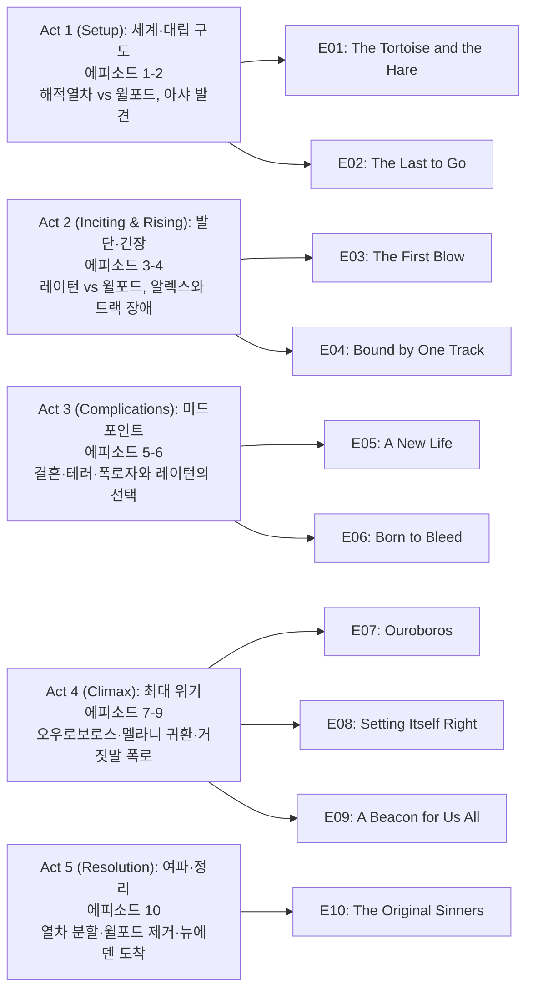

설국열차(Snowpiercer) 시즌 3은 시즌 2 말 레이턴이 스노우피어서 앞 10량을 탈취해 만든 '해적열차'와, 윌포드가 장악한 본열차가 6개월 후 대립하는 구조에서 시작한다. 레이턴은 따뜻한 땅 '뉴에덴'을 찾아 인류를 재정착시키려 하고, 윌포드는 본열차에서 권력을 공고히 하며 숨어 있는 저항군과 맞선다. 한편 북한 핵발전소에서 8년간 생존한 아샤의 합류, 멜라니의 귀환과 레이턴의 뉴에덴 거짓말 폭로, 그리고 최종적으로 열차를 둘로 나누고 윌포드를 제거하는 선택까지, 한 시즌 안에 긴장과 반전이 쌓인다.

## 시즌 개요

### 시리즈 정보
* **제목**: Snowpiercer / 설국열차
* **시즌**: 시즌 3 (총 10 에피소드)
* **쇼러너**: Graeme Manson (그레이엄 맨슨)
* **감독**: James Hawes 등 (에피소드별 상이)
* **주연**: Daveed Diggs (앤드레 레이턴), Jennifer Connelly (멜라니 캐빌), Sean Bean (미스터 윌포드), Rowan Blanchard (알렉산드라), Mickey Sumner (베스 틸), Lena Hall (미스 오드리), Alison Wright (루스 워델), Archie Panjabi (아샤)
* **음악**: Paul Leonard-Morgan (시리즈)
* **장르**: Science Fiction, Drama, Thriller, Post-Apocalyptic
* **에피소드 러닝타임**: 평균 45–50분
* **방영 기간**: 2022.01.24 – 2022.03.28
* **방영 채널/플랫폼**: TNT (미국), 넷플릭스(국제)
* **제작사**: Tomorrow Studios, Studio T, CJ Entertainment
* **원작**: 봉준호 영화 《설국열차》(2013), 자크 봉·장마르크 로셰 원작 그래픽노블
* **평점**: Rotten Tomatoes 시즌3 비평가/관객 평점, IMDb 7.2/10 수준 (시리즈)

### 시즌 주제

시즌 3은 '뉴에덴'이라는 희망의 상징과 레이턴의 거짓말, 그리고 그럼에도 끝까지 뉴에덴을 선택하는 사람들의 신뢰를 축으로 한다. 한편 열차 밖에서 혼자 살아남은 아샤는 트라우마와 고립, 열차 사회로의 재편입을 통해 '생존의 의미'를 보여 준다. 멜라니 복귀 후 데이터를 근거로 레이턴의 거짓말을 폭로하지만, 최종적으로는 전쟁이 아니라 '선택의 자유'—멜라니의 열차에 남을지, 레이턴과 함께 뉴에덴으로 갈지—로 갈등을 해소하며, 계급·권력보다 개인의 선택과 희망을 강조한다.

### 추천 대상
* **포스트아포칼립스·SF 드라마를 좋아하는 시청자**: 한정된 공간(열차)과 자원 속 권력 다툼과 희망 탐색이 조합된다.
* **시즌 1–2를 이미 본 시청자**: 레이턴·윌포드·멜라니·알렉스 관계와 뉴에덴 서사가 이어져 시즌 3이 완결감 있게 다가온다.
* **계급·저항·선택이라는 주제에 관심 있는 시청자**: 열차 사회의 은유와 '누가 어떤 미래를 선택하는가'가 분명히 드러난다.

## 구조 분석 (Act-first 보조 도식)

## 시즌의 전체 내용 (스포일러 포함)

시즌 2 종료 후 6개월이 지난 시점. 레이턴 일행은 앞 10량으로 구성된 해적열차를 몰며 멜라니을 찾고 따뜻한 땅(뉴에덴)을 탐색하고, 윌포드는 스노우피어서 본열차에서 통치를 강화하며 저항군을 탄압한다. 시즌 중반에는 레이턴과 자라의 결혼, 테러와 폭로자 규명, 멜라니의 귀환과 뉴에덴 데이터에 따른 거짓말 폭로가 이어지고, 피날레에서 열차는 둘로 나뉘며 윌포드는 동면 캡슐로 열차 밖으로 내보내진다. 레이턴 일행은 아프리카 뿔 지대의 뉴에덴에 도착해 실제로 따뜻한 땅을 확인한다.

### Act 1 (Setup): 세계·대립 구도 — [E01–E02]

**요약**: 해적열차와 스노우피어서의 6개월 후 대립, 뉴에덴 탐색, 그리고 북한 핵발전소 생존자 아샤의 발견이 시즌의 기반을 만든다.

#### [E01] "The Tortoise and the Hare" — 상세 장면 분석

**[E01-S01] 해적열차와 뉴에덴 탐색**: 레이턴, 베스, 알렉스, 벤, 자라 등이 해적열차를 이끌며 위성 데이터로 따뜻한 지점을 찾는다. 윌포드는 스노우피어서에서 통제를 강화하고 충성 의식을 요구한다.

**[E01-S02] 예상치 못한 발견**: 레이턴 일행이 얼어붙은 지역을 탐사하던 중, 뭔가 다른 존재나 신호와 비슷한 단서를 접하며 뉴에덴 가능성에 대한 기대가 커진다.

#### [E02] "The Last to Go" — 상세 장면 분석

**[E02-S01] 윌포드의 웨딩과 저항군**: 윌포드는 LJ 폴거와 오스웨일러의 결혼식을 '충성의 날'로 활용해 사기를 끌어올리려 한다. 한편 본열차 내부의 저항군은 위협적인 상황을 인지하고 대응을 모색한다.

**[E02-S02] 아샤 발견**: 벤이 얼음 채집 중 지하 원자로 구역에 빠지고, 레이턴이 구조하러 들어갔다가 빨간 방호복을 입은 생존자 아샤를 만난다. 북한 핵발전소에서 동료들이 방사능 등으로 죽고 8년간 혼자 살아온 그녀를 레이턴이 열차로 데려온다.

### Act 2 (Inciting & Rising): 발단·긴장 — [E03–E04]

**요약**: 레이턴과 윌포드의 숨바꼭질이 격해지고, 알렉스는 두 '부모' 캐릭터(레이턴·윌포드/멜라니) 사이에서 갈등한다. 트랙 장애로 과거의 고통스러운 기억이 다시 드러난다.

#### [E04] "Bound by One Track" — 상세 장면 분석

**[E04-S01] 알렉스의 부모 대면**: 알렉스가 레이턴과 윌포드(및 멜라니에 대한 기억) 사이에서 정체성과 충성의 대상을 고민한다. 한 트랙 장애 구간을 넘으면서 과거 사고나 배신과 연관된 기억이 되살아난다.

**[E04-S02] 트랙 장애와 과거**: 트랙 상의 장애물을 제거·우회하는 과정에서 열차와 개인에게 아픈 역사가 다시 드러나 관계가 긴장된다.

### Act 3 (Complications): 미드포인트 — [E05–E06]

**요약**: 레이턴과 자라의 결혼식이 테러 위협에 휩싸이고, 폭탄을 설치한 인물이 밝혀지며 레이턴은 되돌릴 수 없는 결정을 내린다.

#### [E05] "A New Life" — 상세 장면 분석

**[E05-S01] 결혼식과 테러 위협**: 해적열차에서 레이턴과 자라의 결혼이 진행된다. 이때 테러 공격 또는 폭탄 위협이 결혼과 새 출발을 위협하며, 내부 불신이 고조된다.

#### [E06] "Born to Bleed" — 상세 장면 분석

**[E06-S01] 폭로자 정체와 레이턴의 선택**: 테러의 배후(폭탄을 설치한 인물)가 밝혀진다. 레이턴은 이에 대응해 돌이킬 수 없는 결정—예를 들어 처벌, 추방, 혹은 전략적 동맹 단절—을 실행하며, 해적열차와 본열차 간 또는 내부 권력 구도가 바뀐다.

### Act 4 (Climax): 최대 위기 — [E07–E09]

**요약**: 오우로보로스(자기 꼬리를 물어먹는 구조)적 갈등, 멜라니 구출·귀환, 그리고 그녀가 뉴에덴 데이터를 분석해 레이턴의 거짓말을 전열차 앞에서 폭로하는 것이 클라이맥스를 이룬다.

#### [E07] "Ouroboros" — 상세 장면 분석

**[E07-S01] 순환하는 갈등**: 제목처럼 레이턴과 윌포드, 또는 열차 내 세력들이 서로를 잡아먹는 구조로 얽히며, 한 번의 승리가 다음 위기를 부르는 패턴이 반복된다.

#### [E09] "A Beacon for Us All" — 상세 장면 분석 (클라이맥스)

**[E09-S01] 멜라니 구출과 귀환**: 레이턴, 벤, 조시가 프랑스 근처에 보관된 동면 캡슐에서 멜라니을 구출한다. 6개월간 동면 상태였던 그녀는 의료 조치 후 알렉스, 벤과 재회한다.

**[E09-S02] 거짓말 폭로**: 멜라니이 뉴에덴 관련 데이터를 검토한 뒤, 레이턴이 실제로 뉴에덴에 간 적이 없고 생존 가능한 따뜻한 땅이라는 증거가 없다는 사실을 확인한다. 레이턴이 축하 자리에서 비밀 유지를 요청하자 멜라니은 거절하고, 전열차 앞에서 그가 뉴에덴을 '믿음'으로만 이끌어 왔음을 폭로한다. 이로 인해 열차 내 신뢰가 무너지고 분열이 심화된다.

**[E09-S03] 윌포드의 기회**: 혼란을 틈타 윌포드가 권력을 탈취하려 움직인다. 레이턴과 멜라니은 서로 대립하지만, 결국 윌포드를 공동의 적으로 인식하고 제거하기로 결심한다.

### Act 5 (Resolution): 여파·정리 — [E10]

**요약**: 열차를 둘로 나누고, 윌포드를 동면 캡슐에 넣어 열차 밖으로 내보낸 뒤, 레이턴 일행은 빅 앨리스로 뉴에덴(아프리카 뿔)을 향하고, 실제로 그곳이 생존 가능한 따뜻한 땅임이 확인된다.

#### [E10] "The Original Sinners" — 상세 장면 분석

**[E10-S01] 열차 분할**: 레이턴과 멜라니은 다시 전쟁을 하지 않고, 승객들에게 선택권을 준다. 스노우피어서는 Ag-sec 구간에서 둘로 나뉜다. 멜라니은 앞쪽(영원엔진 포함)을 이끌고, 레이턴은 빅 앨리스를 이끌어 뉴에덴을 향한다.

**[E10-S02] 윌포드 제거**: 윌포드는 멜라니이 사용했던 동면 캡슐에 넣어진 채 열차 밖으로 발사되어, 영원히 동면 상태로 남게 된다.

**[E10-S03] 선택한 사람들**: 레이턴과 함께 뉴에덴으로 가는 쪽에는 조시, 자라, 딸 리아나, 루스, 로슈와 딸 칼리, 알렉스, 하비 등이 포함된다. 멜라니의 열차에 남는 쪽에는 벤, 베스 틸(새 브레이크맨 리더), 미스 오드리, 마일스(엔지니어 수련), 펠턴 의사, 트리스탄(호스피탈리티 책임자) 등이 있다.

**[E10-S04] 뉴에덴 도착**: 레이턴 일행은 손상된 트랙을 지나 아프리카 뿔 지대에 도착한다. 멜라니의 우려와 달리 그곳은 약 -5°F 수준으로, 보호복 없이도 생존 가능한 온도다. 7년 만에 다시 맞이한 햇빛 아래 사람들이 열차에서 내려 뉴에덴의 '새 삶'을 맞이하며 시즌이 끝난다.

## 에피소드 가이드

| 회차 | 제목 | 방영일 | 한 줄 요약 |
|------|------|--------|-----------|
| E01 | "The Tortoise and the Hare" | 2022.01.24 | 해적열차의 뉴에덴 탐색, 윌포드의 통제 강화. |
| E02 | "The Last to Go" | 2022.01.31 | 윌포드의 웨딩·저항군 위협, 북한 핵발전소 생존자 아샤 발견. |
| E03 | "The First Blow" | 2022.02.07 | 레이턴과 윌포드의 숨바꼭질과 첫 타격. |
| E04 | "Bound by One Track" | 2022.02.14 | 알렉스의 부모 대면, 트랙 장애와 과거의 상처. |
| E05 | "A New Life" | 2022.02.21 | 레이턴과 자라의 결혼식, 테러 위협. |
| E06 | "Born to Bleed" | 2022.02.28 | 폭탄 설치자 정체 밝혀짐, 레이턴의 돌이킬 수 없는 결정. |
| E07 | "Ouroboros" | 2022.03.07 | 서로를 잡아먹는 갈등의 순환. |
| E08 | "Setting Itself Right" | 2022.03.14 | 상황 수습과 새로운 균형 모색. |
| E09 | "A Beacon for Us All" | 2022.03.21 | 멜라니 귀환, 뉴에덴 거짓말 폭로, 윌포드의 기회. |
| E10 | "The Original Sinners" | 2022.03.28 | 열차 분할, 윌포드 제거, 뉴에덴 도착과 새 출발. |

## 캐릭터 분석

### 앤드레 레이턴 / Andre Layton (Daveed Diggs)

**개요**: 전 시카고 형사이자 꼬리칸 반란 리더. 시즌 3에서는 해적열차의 지도자로 뉴에덴을 찾아 인류를 재정착시키려 한다.

**성장 곡선**: 시즌 내내 '뉴에덴'을 믿음으로 이끌지만, 데이터상 증거가 없어 멜라니에 의해 거짓말로 폭로된다. 그럼에도 최종적으로 열차를 나누고 선택권을 주는 방식으로 전쟁을 피하고, 뉴에덴에 도착해 자신의 비전이 맞았음을 증명한다.

**동기와 욕망**: 꼬리칸과 약자에 대한 정의, 그리고 '열차 밖'에서의 새 삶에 대한 희망. 권력 유지보다는 선택과 희망을 주고 싶어 한다.

**갈등 구조**: 윌포드와의 권력 투쟁, 멜라니과의 신뢰(거짓말 폭로), 자라·조시·리아나와의 가족 관계, 그리고 '거짓 희망'을 준 것에 대한 내적 갈등.

**상징적 의미**: 혁명 이후의 지도자—권력을 잡은 뒤에도 전쟁 대신 분할과 선택을 택하고, 희망을 증명하려 드는 인물.

### 멜라니 캐빌 / Melanie Cavill (Jennifer Connelly)

**개요**: 스노우피어서의 원 설계자이자 과학자. 시즌 2 말 외부 동면 캡슐에서 생존했고, 시즌 3 후반 구출되어 복귀한다.

**성장 곡선**: 귀환 후 데이터를 검토해 레이턴의 뉴에덴 주장이 증거 부재임을 알고, 전열차 앞에서 폭로한다. 그 후에도 레이턴과 손을 잡아 윌포드를 제거하고, 열차를 나누어 각자 선택하게 함으로써 피비린내 나는 내전을 막는다.

**동기와 욕망**: 과학적 사실과 열차 전체의 생존. '거짓 희망'으로 사람들을 위험에 빠뜨리는 것을 거부하지만, 최종적으로는 그들을 막지 않고 선택권을 인정한다.

**갈등 구조**: 딸 알렉스와의 재회, 레이턴에 대한 배신감과 동시에 윌포드라는 공동의 적에 대한 협력.

**상징적 의미**: 이성·데이터·진실을 대표하는 인물이지만, 결국 '선택의 자유'를 인정하는 쪽으로 기울어, 권위적 진실 강요보다는 공존을 택한다.

### 미스터 윌포드 / Mr. Wilford (Sean Bean)

**개요**: 스노우피어서와 빅 앨리스를 만든 천재 엔지니어이자 독재자. 시즌 3에서는 본열차를 장악하고 충성 의식과 위계를 강화한다.

**성장 곡선**: 레이턴·멜라니 대립과 거짓말 폭로로 인한 혼란을 이용해 권력을 되찾으려 하나, 두 사람이 연대해 그를 동면 캡슐에 가두고 열차 밖으로 내보낸다.

**동기와 욕망**: 열차와 인류를 '자신의 작품'으로 통제하고, 자신을 구원자이자 유일한 지도자로 유지하는 것.

**갈등 구조**: 저항군, 레이턴의 해적열차, 그리고 결국 레이턴·멜라니 연합과의 대결.

**상징적 의미**: 계급과 권력을 열차 구조에 녹여 넣은 창조자이자, 그 구조를 유지하려 하는 독재자. 시즌 3 피날레에서 '제거'됨으로써 열차 사회의 한 축이 사라진다.

### 아샤 / Asha (Archie Panjabi)

**개요**: 북한 핵발전소에서 동료 34명과 함께 얼어붙은 세상을 맞았고, 방사능과 고립 속에서 8년간 혼자 살아남은 핵 기술자. 레이턴이 구조해 해적열차로 데려온다.

**성장 곡선**: 극심한 탈수와 트라우마 상태에서 치료·보호되며, 점차 열차 사회에 참여하고 농업 등에 기여한다. 레이턴, 루스 등과 신뢰 관계를 쌓는다.

**동기와 욕망**: 생존과, 다시 '사회'에 속하는 것. 과거의 고통을 넘어 새 공동체에서 의미를 찾는다.

**갈등 구조**: 과거의 고립·죽음·방사능에 대한 트라우마와, 새로운 인간 관계·책임 사이의 긴장.

**상징적 의미**: '열차 밖'에서도 살아남은 인류의 또 다른 얼굴. 열차만이 유일한 공간이 아니며, 뉴에덴처럼 '밖'에 대한 희망을 상징적으로 보완하는 인물.

## 드라마에 숨겨진 내용 분석

### 서브텍스트·암시

- **뉴에덴과 '믿음'**: 레이턴이 데이터 없이 뉴에덴을 주장하는 것은 종교적·이상적 '희망'에 가깝다. 멜라니의 폭로는 '진실 vs 희망'의 대립처럼 그려지지만, 결국 뉴에덴이 실재함으로써 작품은 '맹목적 믿음'이 아니라 '선택한 희망'이 증명되는 구조를 택한다.
- **선택의 의미**: 피날레에서 '전쟁이 아닌 분리'는 계급 투쟁을 무력으로 해소하는 대신, 각자가 원하는 미래를 고르게 함으로써 권력 논리를 넘어서려는 메시지를 담는다.

### 상징·소품·배경

- **열차의 앞·뒤**: 앞칸(엔진·권력)·뒷칸(꼬리·억압)의 공간 구조는 계급과 자원 배분의 은유로 시리즈 전반에 유지된다. 시즌 3에서는 '열차를 둘로 나눔'으로써 하나의 계급 구조가 두 개의 서로 다른 미래(영원엔진 vs 뉴에덴)로 갈라진다.
- **아샤의 빨간 방호복**: 얼어붙은 세계에서 유일하게 눈에 띄는 색으로, 생존자·외부자·새로 들어온 존재를 동시에 나타낸다.
- **오우로보로스(E07)**: 제목처럼 레이턴·윌포드·멜라니이 서로를 잡아먹는 순환 구조가, 결국 '윌포드 제거'와 '열차 분할'로 끊어지며 새로운 루프가 열린다.

### 복선·회수

- **멜라니의 동면 캡슐**: 시즌 2에서 그녀가 생존한 장소이자, 시즌 3에서 그녀를 구출하는 장소이며, 피날레에서는 윌포드를 '영원히 제거'하는 데 재사용된다. 같은 물건이 구원과 제거에 모두 쓰인다.
- **뉴에덴 데이터**: 시즌 내내 레이턴이 말하는 '뉴에덴'은 멜라니에 의해 '증거 없음'으로 폭로되지만, 최종 화에서 실제 도착지가 따뜻한 땅으로 확인되며 '희망의 실재'가 회수된다.

### 이스터에그·오마주

- **원작 영화와 그래픽노블**: 열차 사회의 계급 구조, 꼬리칸의 반란, 엔진과 창조자(윌포드)에 대한 신화는 봉준호 영화와 자크 봉 원작의 핵심 모티프를 TV 시리즈가 확장한 것이다.
- **오펜 블랙**: 쇼러너 그레이엄 맨슨이 공동 제작한 《Orphan Black》처럼, 신뢰·정체성·복제(여기서는 '두 개의 열차') 테마가 반복된다.

### 제작진 의도·해석

- 그레이엄 맨슨은 인터뷰에서 설국열차를 계급 투쟁·불평등·생존의 정치학을 다루는 은유로 설명한 바 있으며, 시즌 3의 '선택과 분리'는 단순한 승리가 아니라 서로 다른 미래에 대한 시민들의 선택으로 그리려 한 것으로 해석할 수 있다.

## 종합 평가

### 최종 평점: ★★★★☆ (4.0/5.0)

**장점**:
- 레이턴·멜라니·윌포드 삼자 구도와 아샤·알렉스 등 보조 인물이 한 시즌 안에 잘 배치되어, 긴장과 반전이 유지된다.
- '거짓말 폭로' 후 전쟁 대신 열차 분할과 선택권을 주는 결말은 단순한 정복 결말을 피하고 주제를 일관되게 잡아준다.
- 아샤의 과거(핵발전소 8년 생존)는 열차 밖 세계와 트라우마를 구체적으로 보여 주어 세계관을 확장한다.

**단점**:
- 10화 분량에 인물·사건이 많아 일부 에피소드(예: E03, E08)는 전환만 담당하고 깊이가 다소 부족하게 느껴질 수 있다.
- 뉴에덴이 실제로 존재한다는 결말이 '레이턴의 직감이 맞았다'는 식으로 정리되어, 일부 시청자에게는 폭로의 무게가 약해 보일 수 있다.

### 한 줄 평

"뉴에덴이라는 희망과 그 거짓말의 폭로를 거쳐, 전쟁이 아닌 '선택'으로 열차를 나누고 윌포드를 제거한 뒤, 따뜻한 땅에 도착하는 한 시즌."

### 추천 작품

- 《설국열차》(2013, 봉준호): 동명 영화. 열차 계급 구조와 꼬리칸 반란의 원형.
- 《Station Eleven》(2022): 포스트아포칼립스 속 예술·공동체·희망.
- 《The 100》(2014–2020): 종말 후 생존·파벌·선택과 배신.

### 시청 전 체크리스트

- 사전 지식이 필요한가? **시즌 1·2 시청을 강력 권장.** 인물 관계(레이턴·멜라니·윌포드·알렉스·자라·조시)와 해적열차 탈취·멜라니 동면 설정이 이어짐.
- 어린이와 함께 볼 수 있는가? **성인 등급.** 폭력·죽음·정치적 탄압·트라우마 묘사가 있음.
- 몰아보기 vs 천천히? **몰아보기 적합.** 10화로 한 번에 보기 부담이 적고, 반전과 관계 변화가 연속되어 끊기면 감정선이 흐트러질 수 있음.
- 특정 요소를 기대해도 되는가? **SF·포스트아포칼립스·계급·저항·가족·선택**을 기대하면 만족도가 높다.
- 다음 시즌 예정은? **시즌 4가 제작되었으나 TNT에서 방영 취소 후, 2025년 넷플릭스 등에서 시즌 4 공개 예정(국제 배포).**

## 결론

설국열차 시즌 3은 해적열차와 스노우피어서의 대립, 아샤의 합류, 멜라니 귀환과 뉴에덴 거짓말 폭로, 그리고 열차 분할·윌포드 제거·뉴에덴 도착이라는 한 흐름으로 정리된다. '진실 vs 희망'을 넘어 '선택의 자유'와 '희망의 실재'를 동시에 보여 주며, 이미 시즌 1·2를 본 시청자에게는 캐릭터와 주제가 잘 마무리되는 시즌이다. 포스트아포칼립스 SF와 계급·저항·선택을 좋아한다면 추천한다.

## 참고 문헌 및 출처

- [Season 3 — Snowpiercer Fandom Wiki](https://snowpiercer.fandom.com/wiki/Season_3)
- [Snowpiercer (TV series) — Wikipedia](https://en.wikipedia.org/wiki/Snowpiercer_(TV_series))
- [Snowpiercer: Season 3 — Rotten Tomatoes](https://www.rottentomatoes.com/tv/snowpiercer/s03)
- [Snowpiercer Season 3 Episodes — TV Guide](https://www.tvguide.com/tvshows/snowpiercer/episodes-season-3/1030720475/)
- [Snowpiercer — Episode List — TVmaze](https://www.tvmaze.com/shows/23030/snowpiercer/episodes)
- [Snowpiercer Season 3 Ending Explained — The Cinemaholic](https://thecinemaholic.com/snowpiercer-season-3-finale-recap-and-ending-explained/)
- [Snowpiercer Season 3 Finale: Episode 10 Ending Explained — Epicstream](https://epicstream.com/article/snowpiercer-season-3-finale-episode-10-ending-explained)
- [Snowpiercer Season 3 Ending Explained — Collider](https://collider.com/snowpiercer-season-3-ending-explained/)
- [Snowpiercer's Bittersweet Season 3 Ending, Explained — CBR](https://www.cbr.com/snowpiercer-season3-ending-explained/)
- [Who is Asha — Epicstream](https://epicstream.com/article/who-is-asha-and-how-did-she-survive-a-life-beyond-the-train-in-snowpiercer-season-3)
- [Snowpiercer Season 3 Episode 2 Recap — The Cinemaholic (Asha)](https://thecinemaholic.com/snowpiercer-season-3-episode-2-recap-and-ending-explained/)
- [Melanie exposes Layton's lie — MEAWW](https://meaww.com/tnt-snowpiercer-season-3-episode-9-melanie-cavill-returns-and-exposes-laytons-lie-jennifer-connelly)
- [Snowpiercer Boss on Adaptation's Timely Themes — Variety](https://variety.com/2020/tv/features/snowpiercer-graeme-manson-tnt-adaptation-climate-change-revolution-murder-mystery-interview-1234588786)
- [Class Warfare on a Train — Indigo Music](https://indigomusic.com/feature/class-warfare-on-a-train-analysing-the-socioeconomic-allegory-in-snowpiercer)
- [Snowpiercer Season 3, Finale: Recap and Review — Post Apocalyptic Media](https://www.postapocalypticmedia.com/snowpiercer-season-3-finale-recap-and-review/)
