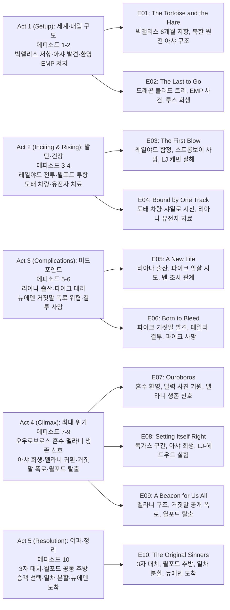

설국열차(Snowpiercer) 시즌 3은 시즌 2 말 레이턴이 스노우피어서 앞 10량을 탈취해 만든 '해적열차'와, 윌포드가 장악한 본열차가 6개월 후 대립하는 구조에서 시작한다. 레이턴은 따뜻한 땅 '뉴에덴'을 찾아 인류를 재정착시키려 하고, 윌포드는 본열차에서 권력을 공고히 하며 숨어 있는 저항군과 맞선다. 한편 북한 핵발전소에서 8년간 생존한 아샤의 합류, 멜라니의 귀환과 레이턴의 뉴에덴 거짓말 폭로, 그리고 최종적으로 열차를 둘로 나누고 윌포드를 제거하는 선택까지, 한 시즌 안에 긴장과 반전이 쌓인다.

## 시즌 개요

### 시리즈 정보
* **제목**: Snowpiercer / 설국열차
* **시즌**: 시즌 3 (총 10 에피소드)
* **쇼러너**: Graeme Manson (그레이엄 맨슨)
* **감독**: James Hawes 등 (에피소드별 상이)
* **주연**: Daveed Diggs (앤드레 레이턴), Jennifer Connelly (멜라니 캐빌), Sean Bean (미스터 윌포드), Rowan Blanchard (알렉산드라), Mickey Sumner (베스 틸), Lena Hall (미스 오드리), Alison Wright (루스 워델), Archie Panjabi (아샤)
* **음악**: Paul Leonard-Morgan (시리즈)
* **장르**: Science Fiction, Drama, Thriller, Post-Apocalyptic
* **에피소드 러닝타임**: 평균 45–50분
* **방영 기간**: 2022.01.24 – 2022.03.28
* **방영 채널/플랫폼**: TNT (미국), 넷플릭스(국제)
* **제작사**: Tomorrow Studios, Studio T, CJ Entertainment
* **원작**: 봉준호 영화 《설국열차》(2013), 자크 봉·장마르크 로셰 원작 그래픽노블
* **평점**: Rotten Tomatoes 시즌3 비평가/관객 평점, IMDb 7.2/10 수준 (시리즈)

### 시즌 주제

시즌 3은 '뉴에덴'이라는 희망의 상징과 레이턴의 거짓말, 그리고 그럼에도 끝까지 뉴에덴을 선택하는 사람들의 신뢰를 축으로 한다. 한편 열차 밖에서 혼자 살아남은 아샤는 트라우마와 고립, 열차 사회로의 재편입을 통해 '생존의 의미'를 보여 준다. 멜라니 복귀 후 데이터를 근거로 레이턴의 거짓말을 폭로하지만, 최종적으로는 전쟁이 아니라 '선택의 자유'—멜라니의 열차에 남을지, 레이턴과 함께 뉴에덴으로 갈지—로 갈등을 해소하며, 계급·권력보다 개인의 선택과 희망을 강조한다.

### 추천 대상
* **포스트아포칼립스·SF 드라마를 좋아하는 시청자**: 한정된 공간(열차)과 자원 속 권력 다툼과 희망 탐색이 조합된다.
* **시즌 1–2를 이미 본 시청자**: 레이턴·윌포드·멜라니·알렉스 관계와 뉴에덴 서사가 이어져 시즌 3이 완결감 있게 다가온다.
* **계급·저항·선택이라는 주제에 관심 있는 시청자**: 열차 사회의 은유와 '누가 어떤 미래를 선택하는가'가 분명히 드러난다.

## 구조 분석 (Act-first 보조 도식)

## 시즌의 전체 내용 (스포일러 포함)

시즌 3은 시즌 2 말 레이턴이 10량을 떼어 만든 해적열차와, 윌포드가 완전 장악한 빅 앨리스·스노우피어서 본열차가 6개월간 각각 다른 궤도를 달리다 다시 충돌하는 이야기다. 레이턴은 북한 핵발전소에서 8년간 홀로 살아남은 아샤를 구출하고, 혼수 직전 본 아프리카 드래곤 블러드 트리 환영을 뉴에덴의 징표로 믿으며 아프리카의 뿔(Horn of Africa)로 향한다. 그러나 뉴에덴은 과학적 근거가 전무하고, 레이턴은 투표를 위해 아샤에게 거짓 증언을 시키며 점점 깊은 도덕적 수렁에 빠진다. 후반부 멜라니가 기적적으로 귀환해 거짓말을 전 승객 앞에서 폭로하고, 최종적으로 두 리더가 윌포드를 공동 추방한 뒤 승객에게 선택권을 줌으로써 열차가 둘로 나뉘며 뉴에덴 도착과 스노우피어서 잔류라는 두 갈래 결말로 마무리된다.

### Act 1 (Setup): 세계·대립 구도 — [E01–E02]

**요약**: 윌포드 치하 6개월간 빅 앨리스의 은밀한 저항과 해적열차의 생존 탐색이 교차하며, 아샤의 구출과 드래곤 블러드 트리 환영이 뉴에덴 서사의 출발점이 된다. EMP 사건이 양 열차의 재충돌을 촉발한다.

#### [E01] "The Tortoise and the Hare" — 상세 장면 분석

**[E01-S01] 윌포드 체제의 6개월**: 빅 앨리스는 극심한 전력 부족으로 승객 대부분이 영하 노동에 동원된다. 루스 워델은 파이크의 도움으로 비밀 저항망을 유지하고, 죽은 줄 알았던 하비(자비에르 드 라 토레)는 생존해 빅 앨리스 엔지니어로 복무하고 있다.

**[E01-S02] 북한 원전 탐색과 아샤 발견**: 해적열차는 멜라니의 기후 데이터로도 거주 가능 지역을 찾지 못한 채 북한 핵발전소를 수색한다. 엔지니어 벤이 지붕을 뚫고 추락하자 레이턴과 조시가 구조에 나서고, 틸과 알렉스는 엔진 문제로 잠시 이탈한다. 오드리와 우연히 합류한 밀항자 마틴 콜빈이 알렉스를 강제로 빅 앨리스에 보내려 하지만, 사이크스가 협조를 거부하고 틸이 제압한다. 벤 구조를 기다리는 동안 레이턴은 원전 건물 안에서 생존자를 발견하고, 전력 부족으로 실신하기 직전 아프리카에 살아 있는 나무의 환영을 본다. 의식을 되찾은 레이턴은 생존자 아샤를 데리고 열차로 복귀한다.

#### [E02] "The Last to Go" — 상세 장면 분석

**[E02-S01] 뉴에덴 노선 확정**: 레이턴은 환영 속 나무가 아프리카의 뿔에서만 자라는 드래곤 블러드 트리(용혈수)임을 확인하고, 빅 앨리스와 재결합한 뒤 아프리카의 뿔을 최종 목적지로 선언한다. 아샤는 자신이 핵발전소 잔여 전력을 이용해 대피했던 과학자·가족 집단의 마지막 생존자였음을 설명하며, 열차 밖에서도 인간이 살아남을 수 있다는 가능성을 열어 둔다.

**[E02-S02] EMP 저지와 루스의 희생**: LJ와 오즈의 결혼 의식이 진행되는 와중, 루스는 케빈·하비·윌포드가 EMP 무기를 준비하고 있음을 발견한다. 루스는 파이크·라이츠·스트롱보이를 규합해 장치 무력화에 나서지만 EMP가 우발적으로 활성화되며 빅 앨리스의 위치가 노출된다. 루스가 시간을 벌며 처벌 위기에 몰리는 순간—윌포드가 루스의 팔을 동결하려 하던 바로 그 순간—해적열차가 평행 궤도에 나타나 상황을 뒤집는다.

### Act 2 (Inciting & Rising): 발단·긴장 — [E03–E04]

**요약**: 레일야드 함정으로 엔진 주도권을 되찾지만 스트롱보이의 죽음과 레이턴의 도덕적 타협(아샤 거짓 증언)이라는 무거운 후유증이 남는다. 이어 빅 앨리스 도태 차량에서 과거 학살의 흔적과 환영이 인물들을 심리적으로 압박하며, 리아나 유전자 치료 사실이 레이턴-자라 관계에 균열을 낸다.

#### [E03] "The First Blow" — 상세 장면 분석

**[E03-S01] 레일야드 전투와 엔진 탈환**: 스노우피어서는 빅 앨리스를 레일야드로 유인하며 4량 손실을 감수한다. 스트롱보이를 비롯한 혁명 대원이 사로잡혀 케빈에게 고문당하는 사이, 파이크-루스의 내부 신호와 조시-하비의 엔진실 지원을 받은 레이턴이 엔진에 잠입해 윌포드의 항복을 받아낸다. 열차는 재결합되고 윌포드는 수감된다. 윌포드는 레이턴의 리더십이 곧 무너질 것이라 예언한다.

**[E03-S02] 혁명의 후유증**: 스트롱보이는 고문 끝에 사망한다. LJ 폴더는 정세를 읽고 '올바른 편'에 서기 위해 케빈을 직접 살해한다. 틸과 펠턴은 로슈 가족을 구출하지만, 로슈의 아내가 드로워에서 사망했음을 확인한다. 레이턴은 오드리를 사이크스 편으로 3등칸에 추방하고, 뉴에덴 행을 투표에 부치기 위해 아샤에게 '뉴에덴에서 구조됐다'는 거짓 증언을 요구한다. 이 거짓말은 이후 시즌 전체를 관통하는 핵심 갈등의 씨앗이 된다.

#### [E04] "Bound by One Track" — 상세 장면 분석

**[E04-S01] 도태 차량과 과거의 유령**: 열차 전방에 분리된 빅 앨리스 3량이 발견된다. 알렉스와 벤이 클램프를 해제하기 위해 승선하자, 내부에는 윌포드가 수년 전 솎아낸 사람들의 시신이 가득하다—알렉스의 친구 샤일로도 그중 하나다. 알렉스, 윌포드, 하비는 멜라니와 윌포드의 개에 대한 환각에 시달리며 과거 트라우마와 대면한다.

**[E04-S02] 윌포드 의존 탈피와 유전자 치료 갈등**: 기술 문제가 발생하자 레이턴은 윌포드에게 도움을 청하지만, 아내의 죽음에 분노한 로슈가 윌포드를 죽이려 한다. 알렉스는 윌포드에게 배운 기술을 활용해 스스로 위기를 해결하며 독자적 성장을 보여 준다. 한편 아샤는 생존자 죄책감에 시달리고, 루스와 파이크 사이에 로맨스가 싹트기 시작한다. 레이턴은 펠턴과 헤드우드 부인을 통해 윌포드가 태아(리아나)에게 조시와 같은 냉내성 유전자 치료를 시행했으며 자라가 이에 동의했음을 알게 된다. 레이턴은 격분하지만 결국 자라에게 돌아온다.

### Act 3 (Complications): 미드포인트 — [E05–E06]

**요약**: 리아나 출산과 파이크의 연쇄 테러가 겹치며 레이턴의 지도부 신뢰가 크게 흔들린다. 파이크가 아샤를 통해 뉴에덴 거짓말까지 알아내면서 갈등은 테일리 전통의 결투로 치닫고, 레이턴이 파이크를 살해한 뒤 부상 악화로 쓰러지며 리더십 위기가 현실화된다.

#### [E05] "A New Life" — 상세 장면 분석

**[E05-S01] 출산과 암살 시도**: 자라가 진통을 시작한 날, 레이턴을 겨냥한 연쇄 폭탄 테러가 열차 곳곳에서 발생한다. 수사 끝에 배후가 파이크임이 밝혀진다—파이크는 루스가 더 적합한 지도자라 믿고, 레이턴이 초래한 인명 손실을 용납하지 못한다. 혼란 속에서도 자라는 리아나 레이턴을 무사히 출산한다.

**[E05-S02] 관계 재편**: 벤은 하비와 사이크스를 협업시켜 뉴에덴 정착 생명유지계를 준비한다. 두 사람은 윌포드 밑에서 겪은 트라우마를 공유하며 유대를 형성한다. 조시는 냉내성 치료 부작용인 통각 둔화를 겪고, 벤과 사랑하는 사람을 잃은 슬픔을 나누다 관계로 발전한다. 오드리는 여전히 고전하고, 동면 약물 후유증으로 악몽에 시달리는 윌포드에게 알렉스가 책을 읽어 주고 만화를 보여 주는 장면이 그려진다.

#### [E06] "Born to Bleed" — 상세 장면 분석

**[E06-S01] 거짓말 발견과 결투 요청**: LJ의 도움으로 오드리가 수감된 윌포드를 찾아간다—동면 약물로 망가진 윌포드는 이제 뉴에덴을 믿으며 드래곤 블러드 트리를 연구한다. 알렉스는 칼리 로슈와 유대를 쌓고, 칼리는 아버지 로슈를 집으로 돌아오게 한다. 틸의 수사로 파이크가 폭탄 테러범으로 특정되어 은신하지만, 아샤와 마주치면서 레이턴의 뉴에덴 거짓말까지 간파한다. 조시와 마일스의 제안으로 레이턴은 오래된 테일리 의식에 따라 파이크와의 결투를 받아들인다.

**[E06-S02] 결투와 붕괴**: 레이턴은 파이크를 설득하려 하지만, 파이크는 거짓말을 전 승객에게 폭로하겠다고 위협한다. 사투 끝에 레이턴이 파이크를 살해한다. 파이크의 시신 앞에서 추모하던 레이턴은 폭탄 테러로 인한 뇌진탕이 악화되며 그 자리에서 쓰러진다. 리더십 공백이 현실이 된다.

### Act 4 (Climax): 최대 위기 — [E07–E09]

**요약**: 혼수 상태의 레이턴이 자기 비전의 허상을 깨닫고, 멜라니 생존 신호 추적과 독성 가스 구간에서의 아샤 희생을 거쳐 멜라니가 귀환한다. 그러나 멜라니는 레이턴의 거짓말을 전 승객에게 공개 폭로하고, 하비와 함께 엔진을 장악하며, 윌포드까지 탈출하며 3자 대치가 성립한다.

#### [E07] "Ouroboros" — 상세 장면 분석

**[E07-S01] 혼수 속 오우로보로스**: 의식을 잃은 레이턴은 윌포드가 저항군을 이끄는 디스토피아적 스노우피어서 환영 속을 떠돈다. 친구와 적이 번갈아 나타나 그를 몰아세우고, 꼬리칸에 도착하면 보스가 성인이 된 딸 리아나인 것으로 드러난다. 현실에서는 틸이 오드리를 불러 레이턴에게 정신적으로 접근한다.

**[E07-S02] 거짓말의 기원과 멜라니 생존 신호**: 환영 속 레이턴은 북한 벙커로 이동해, 죽음 직전 본 드래곤 블러드 트리 환영이 실은 벽에 걸린 달력 사진에서 비롯된 시각 자극이었음을 깨닫는다. 뉴에덴의 '신호'가 데이터가 아닌 자기 암시였다는 자각으로 리더십 신념이 흔들린다. 깨어난 뒤, 자라와 조시는 화해하며 자라가 조시에게 레이턴과의 관계를 이어 가라 격려한다. 한편 윌포드는 알렉스에게 스노우피어서의 항로를 차트로 작성하게 하면서 프랑스에서 수신한 신호를 공개한다—스노우피어서가 다른 대륙에 있었던 시점에 프랑스에서 잡힌 신호이므로, 멜라니가 살아 있을 가능성이 있다.

#### [E08] "Setting Itself Right" — 상세 장면 분석

**[E08-S01] 독성 가스 구간 돌파와 아샤의 희생**: 벤과 알렉스는 소형 자율 트랙 유지보수 차량의 흔적이 멜라니를 남겨 둔 격납고로 이어짐을 발견한다. 윌포드의 이론을 뒷받침하지만, 해당 차량은 생명유지 기능이 없다. 열차는 차량을 가로채기 위해 항로를 변경하고, 화산성 독가스 구름을 통과해야 한다. 전원이 대피하는 가운데 로슈는 딸과 시간을 보내고, 틸과 오드리는 더 가까워진다. 자라는 윌포드를 방문해 멜라니를 이용해 혼란을 부추기려는 저의를 의심한다. 스크러버가 파손되어 독가스가 유입되자 아샤가 흡기구를 몸으로 막고 희생한다. 마지막 순간 아샤는 레이턴에게 "포기하지 말라"고 당부한다.

**[E08-S02] 멜라니 신호 재포착과 비밀 실험**: 독가스를 통과한 뒤, 벤과 알렉스는 멜라니 차량의 근거리 신호를 포착한다. 한편 LJ는 헤드우드 부인을 찾아가 혈액과 피부 샘플을 제공하고, 헤드우드가 누군가를 대상으로 비밀 실험을 진행 중임이 암시된다.

#### [E09] "A Beacon for Us All" — 상세 장면 분석 (클라이맥스)

**[E09-S01] 멜라니 구조**: 멜라니 캐빌은 6개월 이상 소형 트랙 스케일러 안에서 동면 약물을 이용해 스스로 생명을 연명해 왔다. 스노우피어서가 따라붙어 멜라니를 구출한다—기적적으로 살아 있다. 승객들은 기자 피라미드(이집트)를 마지막으로 지나가며 축하하고, 틸과 오드리는 정식으로 연인 관계를 시작한다.

**[E09-S02] 거짓말 공개 폭로와 엔진 장악**: 멜라니는 복귀 후 데이터를 검토하고 윌포드와 대화하며 트랙 안전성을 확인한 결과, 레이턴의 뉴에덴 계획이 과학적 근거 없이 사람들을 위험에 빠뜨린다고 판단한다. 멜라니는 전 승객 앞에서 레이턴의 뉴에덴 거짓말을 공개 폭로하고, 분노한 하비와 함께 엔진을 장악한다. 레이턴, 벤, 자라, 리아나, 틸, 조시는 빅 앨리스 엔진으로 후퇴해 재대결을 준비한다.

**[E09-S03] 윌포드 탈출**: 혼란을 틈타 윌포드는 LJ 등 지지자들의 도움으로 경비를 독살하고 감금에서 탈출한다. 이제 열차 위에는 멜라니, 레이턴, 윌포드 세 세력이 동시에 존재한다.

### Act 5 (Resolution): 여파·정리 — [E10]

**요약**: 멜라니-레이턴 전면전 직전, 윌포드 세력이 나이트카를 점령하며 3자 대치가 완성된다. 두 리더는 전쟁 대신 윌포드 공동 추방과 승객 선택이라는 합의에 도달하고, 열차는 둘로 나뉜다. 빅 앨리스는 뉴에덴에 도착하고, 스노우피어서의 멜라니는 먼 하늘에서 로켓 폭발 섬광을 목격한다.

#### [E10] "The Original Sinners" — 상세 장면 분석

**[E10-S01] 3자 대치와 협상**: 멜라니와 레이턴 양측이 무력 충돌을 준비하는 가운데, 윌포드의 세력—살아 있던 보얀과 새로운 콜드맨을 포함—이 나이트카를 점령하며 3자 구도가 성립한다. 상황이 파국으로 치닫자, 멜라니와 레이턴은 전쟁을 중단하고 협상에 나선다. 합의 내용은 두 가지: 윌포드를 함께 제거하고, 이후 승객에게 선택권을 주는 것이다.

**[E10-S02] 윌포드 공동 추방**: 멜라니와 레이턴은 연합하여 윌포드를 트랙 스케일러에 단독 추방한다—멜라니 자신이 6개월간 생존했던 바로 그 장비다. 이어 승객에게 두 가지 미래를 제시한다: 멜라니와 함께 스노우피어서에 남아 안전하게 순환하거나, 레이턴과 함께 뉴에덴이라는 불확실한 희망을 향해 떠나거나.

**[E10-S03] 열차 분리와 이별**: 열차 분리 과정에서 사랑하는 사람들이 서로 다른 미래를 선택하며 이별한다. 오즈가 LJ를 떠나자, LJ는 아버지의 유리 의안에 우발적으로 질식해 사망한다. 틸은 마지막 순간 오드리와 함께 스노우피어서에 남기로 결정하고, 벤 역시 멜라니와의 관계를 선택해 잔류한다.

**[E10-S04] 뉴에덴 도착과 후속 떡밥**: 빅 앨리스는 아프리카의 뿔로 향하는 험난한 트랙에서 탈선하지만, 탑승자 전원이 생존한다. 열차 밖으로 나온 이들은 따뜻하고 거주 가능한 환경을 확인한다—레이턴의 근거 없던 비전이 현실이 된 것이다. 3개월 후, 스노우피어서 위의 멜라니는 먼 하늘에서 로켓이 폭발하는 섬광을 목격한다.

## 에피소드 가이드

| 회차 | 제목 | 방영일 | 시청자(백만) | 한 줄 요약 |
|------|------|--------|:-----------:|-----------|
| E01 | "The Tortoise and the Hare" | 2022.01.24 | 0.96 | 빅 앨리스 저항전선, 북한 원전 생존자 아샤 발견, 알렉스 납치 시도 저지. |
| E02 | "The Last to Go" | 2022.01.31 | 0.66 | 드래곤 블러드 트리 단서로 뉴에덴 노선 확정, EMP 사건과 루스의 희생. |
| E03 | "The First Blow" | 2022.02.07 | 0.61 | 레일야드 전투·엔진 탈환, LJ 케빈 살해, 오드리 3등급 추방, 아샤 거짓 증언으로 뉴에덴 투표. |
| E04 | "Bound by One Track" | 2022.02.14 | 0.62 | 도태 차량 시신(샤일로) 발견, 로슈 아내 드로워 사망 확인, 리아나 유전자 치료 갈등. |
| E05 | "A New Life" | 2022.02.21 | 0.66 | 리아나 출산, 파이크의 연쇄 테러 발각, 벤-조시 관계 진전. |
| E06 | "Born to Bleed" | 2022.02.28 | 0.58 | 파이크가 아샤 통해 뉴에덴 거짓말 발견, 테일리 결투 끝 파이크 사망, 레이턴 붕괴. |
| E07 | "Ouroboros" | 2022.03.07 | 0.55 | 혼수 속 환영에서 달력 사진이 비전의 기원임을 깨닫고, 멜라니 생존 신호 제시. |
| E08 | "Setting Itself Right" | 2022.03.14 | 0.55 | 독가스 구간 아샤 희생, LJ-헤드우드 비밀 실험 암시, 멜라니 차량 신호 재포착. |
| E09 | "A Beacon for Us All" | 2022.03.21 | 0.66 | 멜라니 구조, 기자 피라미드 통과, 거짓말 공개 폭로, 하비 배신 엔진 장악, 윌포드 탈출. |
| E10 | "The Original Sinners" | 2022.03.28 | 0.63 | 보얀 생존·3자 대치, 윌포드 추방, LJ 유리 의안 질식사, 열차 분할, 뉴에덴 도착, 로켓 섬광. |

## 캐릭터 분석

### 앤드레 레이턴 / Andre Layton (Daveed Diggs)

**개요**: 전 시카고 형사이자 꼬리칸 반란 리더. 시즌 3에서는 해적열차의 지도자로 뉴에덴을 찾아 인류를 재정착시키려 한다.

**성장 곡선**: 시즌 내내 '뉴에덴'을 믿음으로 이끌지만, 데이터상 증거가 없어 멜라니에 의해 거짓말로 폭로된다. 그럼에도 최종적으로 열차를 나누고 선택권을 주는 방식으로 전쟁을 피하고, 뉴에덴에 도착해 자신의 비전이 맞았음을 증명한다.

**동기와 욕망**: 꼬리칸과 약자에 대한 정의, 그리고 '열차 밖'에서의 새 삶에 대한 희망. 권력 유지보다는 선택과 희망을 주고 싶어 한다.

**갈등 구조**: 윌포드와의 권력 투쟁, 멜라니과의 신뢰(거짓말 폭로), 자라·조시·리아나와의 가족 관계, 그리고 '거짓 희망'을 준 것에 대한 내적 갈등.

**상징적 의미**: 혁명 이후의 지도자—권력을 잡은 뒤에도 전쟁 대신 분할과 선택을 택하고, 희망을 증명하려 드는 인물.

### 멜라니 캐빌 / Melanie Cavill (Jennifer Connelly)

**개요**: 스노우피어서의 원 설계자이자 과학자. 시즌 2 말 외부 동면 캡슐에서 생존했고, 시즌 3 후반 구출되어 복귀한다.

**성장 곡선**: 귀환 후 데이터를 검토해 레이턴의 뉴에덴 주장이 증거 부재임을 알고, 전열차 앞에서 폭로한다. 그 후에도 레이턴과 손을 잡아 윌포드를 제거하고, 열차를 나누어 각자 선택하게 함으로써 피비린내 나는 내전을 막는다.

**동기와 욕망**: 과학적 사실과 열차 전체의 생존. '거짓 희망'으로 사람들을 위험에 빠뜨리는 것을 거부하지만, 최종적으로는 그들을 막지 않고 선택권을 인정한다.

**갈등 구조**: 딸 알렉스와의 재회, 레이턴에 대한 배신감과 동시에 윌포드라는 공동의 적에 대한 협력.

**상징적 의미**: 이성·데이터·진실을 대표하는 인물이지만, 결국 '선택의 자유'를 인정하는 쪽으로 기울어, 권위적 진실 강요보다는 공존을 택한다.

### 미스터 윌포드 / Mr. Wilford (Sean Bean)

**개요**: 스노우피어서와 빅 앨리스를 만든 천재 엔지니어이자 독재자. 시즌 3에서는 본열차를 장악하고 충성 의식과 위계를 강화한다.

**성장 곡선**: 레이턴·멜라니 대립과 거짓말 폭로로 인한 혼란을 이용해 권력을 되찾으려 하나, 두 사람이 연대해 그를 동면 캡슐에 가두고 열차 밖으로 내보낸다.

**동기와 욕망**: 열차와 인류를 '자신의 작품'으로 통제하고, 자신을 구원자이자 유일한 지도자로 유지하는 것.

**갈등 구조**: 저항군, 레이턴의 해적열차, 그리고 결국 레이턴·멜라니 연합과의 대결.

**상징적 의미**: 계급과 권력을 열차 구조에 녹여 넣은 창조자이자, 그 구조를 유지하려 하는 독재자. 시즌 3 피날레에서 '제거'됨으로써 열차 사회의 한 축이 사라진다.

### 아샤 / Asha (Archie Panjabi)

**개요**: 북한 핵발전소에서 동료 34명과 함께 얼어붙은 세상을 맞았고, 방사능과 고립 속에서 8년간 혼자 살아남은 핵 기술자. 레이턴이 구조해 해적열차로 데려온다.

**성장 곡선**: 극심한 탈수와 트라우마 상태에서 치료·보호되며, 점차 열차 사회에 참여하고 농업 등에 기여한다. 레이턴, 루스 등과 신뢰 관계를 쌓는다.

**동기와 욕망**: 생존과, 다시 '사회'에 속하는 것. 과거의 고통을 넘어 새 공동체에서 의미를 찾는다.

**갈등 구조**: 과거의 고립·죽음·방사능에 대한 트라우마와, 새로운 인간 관계·책임 사이의 긴장.

**상징적 의미**: '열차 밖'에서도 살아남은 인류의 또 다른 얼굴. 열차만이 유일한 공간이 아니며, 뉴에덴처럼 '밖'에 대한 희망을 상징적으로 보완하는 인물.

## 드라마에 숨겨진 내용 분석

### 서브텍스트·암시

- **뉴에덴과 '믿음'**: 레이턴이 데이터 없이 뉴에덴을 주장하는 것은 종교적·이상적 '희망'에 가깝다. 멜라니의 폭로는 '진실 vs 희망'의 대립처럼 그려지지만, 결국 뉴에덴이 실재함으로써 작품은 '맹목적 믿음'이 아니라 '선택한 희망'이 증명되는 구조를 택한다.
- **선택의 의미**: 피날레에서 '전쟁이 아닌 분리'는 계급 투쟁을 무력으로 해소하는 대신, 각자가 원하는 미래를 고르게 함으로써 권력 논리를 넘어서려는 메시지를 담는다.

### 상징·소품·배경

- **열차의 앞·뒤**: 앞칸(엔진·권력)·뒷칸(꼬리·억압)의 공간 구조는 계급과 자원 배분의 은유로 시리즈 전반에 유지된다. 시즌 3에서는 '열차를 둘로 나눔'으로써 하나의 계급 구조가 두 개의 서로 다른 미래(영원엔진 vs 뉴에덴)로 갈라진다.
- **아샤의 빨간 방호복**: 얼어붙은 세계에서 유일하게 눈에 띄는 색으로, 생존자·외부자·새로 들어온 존재를 동시에 나타낸다.
- **오우로보로스(E07)**: 제목처럼 레이턴·윌포드·멜라니이 서로를 잡아먹는 순환 구조가, 결국 '윌포드 제거'와 '열차 분할'로 끊어지며 새로운 루프가 열린다.

### 복선·회수

- **멜라니의 동면 캡슐**: 시즌 2에서 그녀가 생존한 장소이자, 시즌 3에서 그녀를 구출하는 장소이며, 피날레에서는 윌포드를 '영원히 제거'하는 데 재사용된다. 같은 물건이 구원과 제거에 모두 쓰인다.
- **뉴에덴 데이터**: 시즌 내내 레이턴이 말하는 '뉴에덴'은 멜라니에 의해 '증거 없음'으로 폭로되지만, 최종 화에서 실제 도착지가 따뜻한 땅으로 확인되며 '희망의 실재'가 회수된다.

### 이스터에그·오마주

- **원작 영화와 그래픽노블**: 열차 사회의 계급 구조, 꼬리칸의 반란, 엔진과 창조자(윌포드)에 대한 신화는 봉준호 영화와 자크 봉 원작의 핵심 모티프를 TV 시리즈가 확장한 것이다.
- **오펜 블랙**: 쇼러너 그레이엄 맨슨이 공동 제작한 《Orphan Black》처럼, 신뢰·정체성·복제(여기서는 '두 개의 열차') 테마가 반복된다.

### 제작진 의도·해석

- 그레이엄 맨슨은 인터뷰에서 설국열차를 계급 투쟁·불평등·생존의 정치학을 다루는 은유로 설명한 바 있으며, 시즌 3의 '선택과 분리'는 단순한 승리가 아니라 서로 다른 미래에 대한 시민들의 선택으로 그리려 한 것으로 해석할 수 있다.

## 종합 평가

### 최종 평점: ★★★★☆ (4.0/5.0)

**장점**:
- 레이턴·멜라니·윌포드 삼자 구도와 아샤·알렉스 등 보조 인물이 한 시즌 안에 잘 배치되어, 긴장과 반전이 유지된다.
- '거짓말 폭로' 후 전쟁 대신 열차 분할과 선택권을 주는 결말은 단순한 정복 결말을 피하고 주제를 일관되게 잡아준다.
- 아샤의 과거(핵발전소 8년 생존)는 열차 밖 세계와 트라우마를 구체적으로 보여 주어 세계관을 확장한다.

**단점**:
- 10화 분량에 인물·사건이 많아 일부 에피소드(예: E03, E08)는 전환만 담당하고 깊이가 다소 부족하게 느껴질 수 있다.
- 뉴에덴이 실제로 존재한다는 결말이 '레이턴의 직감이 맞았다'는 식으로 정리되어, 일부 시청자에게는 폭로의 무게가 약해 보일 수 있다.

### 한 줄 평

"뉴에덴이라는 희망과 그 거짓말의 폭로를 거쳐, 전쟁이 아닌 '선택'으로 열차를 나누고 윌포드를 제거한 뒤, 따뜻한 땅에 도착하는 한 시즌."

### 추천 작품

- 《설국열차》(2013, 봉준호): 동명 영화. 열차 계급 구조와 꼬리칸 반란의 원형.
- 《Station Eleven》(2022): 포스트아포칼립스 속 예술·공동체·희망.
- 《The 100》(2014–2020): 종말 후 생존·파벌·선택과 배신.

### 시청 전 체크리스트

- 사전 지식이 필요한가? **시즌 1·2 시청을 강력 권장.** 인물 관계(레이턴·멜라니·윌포드·알렉스·자라·조시)와 해적열차 탈취·멜라니 동면 설정이 이어짐.
- 어린이와 함께 볼 수 있는가? **성인 등급.** 폭력·죽음·정치적 탄압·트라우마 묘사가 있음.
- 몰아보기 vs 천천히? **몰아보기 적합.** 10화로 한 번에 보기 부담이 적고, 반전과 관계 변화가 연속되어 끊기면 감정선이 흐트러질 수 있음.
- 특정 요소를 기대해도 되는가? **SF·포스트아포칼립스·계급·저항·가족·선택**을 기대하면 만족도가 높다.
- 다음 시즌 예정은? **시즌 4가 제작되었으나 TNT에서 방영 취소 후, 2025년 넷플릭스 등에서 시즌 4 공개 예정(국제 배포).**

## 결론

설국열차 시즌 3은 해적열차와 스노우피어서의 대립, 아샤의 합류, 멜라니 귀환과 뉴에덴 거짓말 폭로, 그리고 열차 분할·윌포드 제거·뉴에덴 도착이라는 한 흐름으로 정리된다. '진실 vs 희망'을 넘어 '선택의 자유'와 '희망의 실재'를 동시에 보여 주며, 이미 시즌 1·2를 본 시청자에게는 캐릭터와 주제가 잘 마무리되는 시즌이다. 포스트아포칼립스 SF와 계급·저항·선택을 좋아한다면 추천한다.

## 참고 문헌 및 출처

- [Season 3 — Snowpiercer Fandom Wiki](https://snowpiercer.fandom.com/wiki/Season_3)
- [Snowpiercer (TV series) — Wikipedia](https://en.wikipedia.org/wiki/Snowpiercer_(TV_series))
- [Snowpiercer: Season 3 — Rotten Tomatoes](https://www.rottentomatoes.com/tv/snowpiercer/s03)
- [Snowpiercer Season 3 Episodes — TV Guide](https://www.tvguide.com/tvshows/snowpiercer/episodes-season-3/1030720475/)
- [Snowpiercer — Episode List — TVmaze](https://www.tvmaze.com/shows/23030/snowpiercer/episodes)
- [Snowpiercer Season 3 Ending Explained — The Cinemaholic](https://thecinemaholic.com/snowpiercer-season-3-finale-recap-and-ending-explained/)
- [Snowpiercer Season 3 Finale: Episode 10 Ending Explained — Epicstream](https://epicstream.com/article/snowpiercer-season-3-finale-episode-10-ending-explained)
- [Snowpiercer Season 3 Ending Explained — Collider](https://collider.com/snowpiercer-season-3-ending-explained/)
- [Snowpiercer's Bittersweet Season 3 Ending, Explained — CBR](https://www.cbr.com/snowpiercer-season3-ending-explained/)
- [Who is Asha — Epicstream](https://epicstream.com/article/who-is-asha-and-how-did-she-survive-a-life-beyond-the-train-in-snowpiercer-season-3)
- [Snowpiercer Season 3 Episode 2 Recap — The Cinemaholic (Asha)](https://thecinemaholic.com/snowpiercer-season-3-episode-2-recap-and-ending-explained/)
- [Melanie exposes Layton's lie — MEAWW](https://meaww.com/tnt-snowpiercer-season-3-episode-9-melanie-cavill-returns-and-exposes-laytons-lie-jennifer-connelly)
- [Snowpiercer Boss on Adaptation's Timely Themes — Variety](https://variety.com/2020/tv/features/snowpiercer-graeme-manson-tnt-adaptation-climate-change-revolution-murder-mystery-interview-1234588786)
- [Class Warfare on a Train — Indigo Music](https://indigomusic.com/feature/class-warfare-on-a-train-analysing-the-socioeconomic-allegory-in-snowpiercer)
- [Snowpiercer Season 3, Finale: Recap and Review — Post Apocalyptic Media](https://www.postapocalypticmedia.com/snowpiercer-season-3-finale-recap-and-review/)
